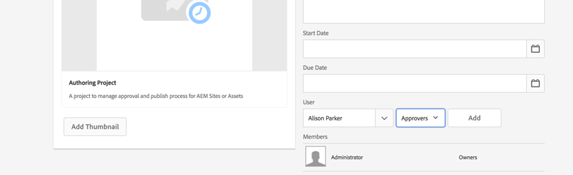

# AEM에서 프로젝트 개발

[!DNL AEM Projects]에 대해 개발하는 방법을 설명하는 개발 자습서입니다.  이 자습서에서는 컨텐츠 작성 워크플로우 및 작업을 관리하기 위해 AEM 내에서 새 프로젝트를 만드는 데 사용할 수 있는 사용자 지정 프로젝트 템플릿을 만듭니다.

>[!VIDEO](https://video.tv.adobe.com/v/16904/?quality=12&learn=on)

*이 비디오에서는 아래 자습서에서 만든 완료된 워크플로우에 대한 간단한 데모를 제공합니다.*

## 소개 {#introduction}

[[!DNL AEM Projects]](https://helpx.adobe.com/experience-manager/6-5/sites/authoring/using/projects.html) 는 AEM Sites 또는 자산 구현의 일부로 컨텐츠 만들기와 관련된 모든 워크플로우 및 작업을 보다 쉽게 관리 및 그룹화할 수 있도록 설계된 AEM의 기능입니다.

AEM Projects에는 여러 [OOTB 프로젝트 템플릿](https://helpx.adobe.com/experience-manager/6-5/sites/authoring/using/projects.html#ProjectTemplates)이 있습니다. 새 프로젝트를 만들 때 작성자는 사용 가능한 템플릿 중에서 선택할 수 있습니다. 고유한 비즈니스 요구 사항을 갖는 대규모 AEM 구현에서는 요구 사항에 맞게 맞춤 설정된 사용자 지정 프로젝트 템플릿을 만들어야 합니다. 사용자 지정 프로젝트 템플릿 개발자를 만들면 프로젝트 대시보드를 구성하고 사용자 지정 워크플로우에 연결할 수 있으며 프로젝트에 대한 추가 비즈니스 역할을 만들 수 있습니다. 프로젝트 템플릿의 구조를 살펴보고 샘플 템플릿을 만듭니다.


## 설정

이 자습서에서는 사용자 지정 프로젝트 템플릿을 만드는 데 필요한 코드를 단계별로 수행합니다. 자습서와 함께 따라 로컬 환경에 첨부된 [패키지](./assets/develop-aem-projects/projects-tasks-guide.ui.apps-0.0.1-SNAPSHOT.zip)를 다운로드하여 설치할 수 있습니다. [GitHub](https://github.com/Adobe-Marketing-Cloud/aem-guides/tree/feature/projects-tasks-guide)에서 호스팅되는 전체 Maven 프로젝트에 액세스할 수도 있습니다.

* [완료된 자습서 패키지](./assets/develop-aem-projects/projects-tasks-guide.ui.apps-0.0.1-SNAPSHOT.zip)
* [GitHub의 전체 코드 리포지토리](https://github.com/Adobe-Marketing-Cloud/aem-guides/tree/feature/projects-tasks-guide)

이 자습서에서는 [AEM 개발 사례](https://helpx.adobe.com/experience-manager/6-5/sites/developing/using/the-basics.html)에 대한 몇 가지 기본 지식과 [AEM Maven 프로젝트 설정](https://helpx.adobe.com/kr/experience-manager/6-5/sites/developing/using/ht-projects-maven.html)에 대해 잘 알고 있다고 가정합니다. 언급된 모든 코드는 참조용으로 사용되며 [로컬 개발 AEM 인스턴스](https://helpx.adobe.com/experience-manager/6-5/sites/deploying/using/deploy.html#GettingStarted)에만 배포해야 합니다.

## 프로젝트 템플릿 구조

프로젝트 템플릿은 소스 제어 하에 두어야 하며 /apps 아래의 애플리케이션 폴더 아래에 있어야 합니다. 이러한 폴더는 ***/projects/templates/**&lt;my-template>의 이름 지정 규칙이 있는 하위 폴더에 배치하는 것이 좋습니다. 이러한 명명 규칙을 지정하면 프로젝트를 만들 때 작성자가 새로운 사용자 지정 템플릿을 자동으로 사용할 수 있게 됩니다. 사용 가능한 프로젝트 템플릿의 구성은 다음 위치에서 설정됩니다. **/content/projects/jcr:content** 노드(**cq:allowedTemplates** 속성) 기본적으로 정규 표현식입니다. **/(apps|libs)/*/projects/templates/.***

프로젝트 템플릿의 루트 노드에는 **jcr:primaryType** cq:Template **이 있습니다.** 의 루트 노드 아래에 3개의 노드가 있습니다. **가젯**, **역할** 및 **워크플로우**. 이러한 노드는 모두 **nt:un구조화되지 않음**&#x200B;입니다. 루트 노드 아래에는 프로젝트 만들기 마법사에서 템플릿을 선택할 때 표시되는 thumbnail.png 파일도 있을 수 있습니다.

전체 노드 구조:

```shell
/apps/<my-app>
    + projects (nt:folder)
         + templates (nt:folder)
              + <project-template-root> (cq:Template)
                   + gadgets (nt:unstructured)
                   + roles (nt:unstructured)
                   + workflows (nt:unstructured)
```

### 프로젝트 템플릿 루트

프로젝트 템플릿의 루트 노드는 **cq:Template** 유형이 됩니다. 이 노드에서 프로젝트 만들기 마법사에 표시할 속성 **jcr:title** 및 **jcr:description**&#x200B;을 구성할 수 있습니다. 프로젝트의 속성을 채울 양식을 가리키는 **마법사**&#x200B;라는 속성도 있습니다. 기본값은 다음과 같습니다. **/libs/cq/core/content/projects/wizard/steps/defaultproject.html**&#x200B;은 사용자가 기본 프로젝트 속성을 채우고 그룹 구성원을 추가할 수 있도록 하므로 대부분의 경우 제대로 작동해야 합니다.

**프로젝트 만들기 마법사는 Sling POST 서블릿을 사용하지 않습니다. 대신 값이 사용자 지정 서블릿에 게시됩니다.**com.adobe.cq.projects.impl.servlet.ProjectServlet**사용자 지정 필드를 추가할 때 이를 고려해야 합니다.*

사용자 지정 마법사의 예는 번역 프로젝트 템플릿에 대해 찾을 수 있습니다. **/libs/cq/core/content/projects/wizard/translationproject/defaultproject**

### 가젯 {#gadgets}

이 노드에는 추가 속성이 없지만 가젯 노드의 하위는 새 프로젝트를 만들 때 프로젝트 타일이 프로젝트 대시보드를 채우는 것을 제어합니다. [프로젝트 타일](https://helpx.adobe.com/experience-manager/6-5/sites/authoring/using/projects.html#ProjectTiles) (가젯 또는 포드라고도 함)은 프로젝트의 작업 공간을 채우는 간단한 카드입니다. ootb 타일의 전체 목록은 다음 위치에서 찾을 수 있습니다. **/libs/cq/gui/components/projects/admin/pod **프로젝트를 만든 후에는 항상 타일을 추가/제거할 수 있습니다.

### 역할 {#roles}

모든 프로젝트에 3개의 [기본 역할](https://helpx.adobe.com/experience-manager/6-5/sites/authoring/using/projects.html#UserRolesinaProject)이 있습니다. **관찰자**, **편집자** 및 **소유자** 역할 노드 아래에 하위 노드를 추가하면 템플릿에 대한 비즈니스 특정 프로젝트 역할을 추가할 수 있습니다. 그런 다음 이러한 역할을 프로젝트와 연결된 특정 워크플로우에 연결할 수 있습니다.

### 워크플로우 {#workflows}

사용자 지정 프로젝트 템플릿을 만들어야 하는 가장 매력적인 이유 중 하나는 프로젝트에서 사용할 수 있는 워크플로우를 구성할 수 있도록 하기 때문입니다. OOTB 워크플로우 또는 사용자 지정 워크플로우를 수행할 수 있습니다. **workflows** 노드 아래에 사용 가능한 워크플로우 모델을 지정하는 아래에 **models** 노드(또한 `nt:unstructured`)와 하위 노드가 있어야 합니다. **modelId **속성은 /etc/workflow 아래의 워크플로우 모델을 가리키며 **마법사** 속성은 워크플로우를 시작할 때 사용되는 대화 상자를 가리킵니다. Projects의 가장 큰 장점은 워크플로우 시작 시 사용자 지정 대화 상자(마법사)를 추가하여 비즈니스 특정 메타데이터를 캡처하여 워크플로우 내에서 추가적인 작업을 수행할 수 있다는 것입니다.

```shell
<projects-template-root> (cq:Template)
    + workflows (nt:unstructured)
         + models (nt:unstructured)
              + <workflow-model> (nt:unstructured)
                   - modelId = points to the workflow model
                   - wizard = dialog used to start the workflow
```

## 프로젝트 템플릿 만들기 {#creating-project-template}

주로 노드를 복사/구성하므로 CRXDE Lite을 사용합니다. 로컬 AEM 인스턴스에서 [CRXDE Lite](http://localhost:4502/crx/de/index.jsp)을 엽니다.

1. 먼저 `projects` 이라는 `/apps/&lt;your-app-folder&gt;` 아래에 새 폴더를 만듭니다. `templates` 아래에 다른 폴더를 만듭니다.

   ```shell
   /apps/aem-guides/projects-tasks/
                       + projects (nt:folder)
                                + templates (nt:folder)
   ```

1. 좀 더 쉽게 하기 위해 기존의 단순 프로젝트 템플릿에서 사용자 지정 템플릿을 시작합니다.

   1. 1단계에서 만든 *templates* 폴더 아래에 **/libs/cq/core/content/projects/templates/default** 노드를 복사하여 붙여 넣습니다.

   ```shell
   /apps/aem-guides/projects-tasks/
                + templates (nt:folder)
                     + default (cq:Template)
   ```

1. 이제 **/apps/aem-guides/projects-tasks/projects/templates/authoring-project** 와 같은 경로가 있어야 합니다.

   1. 작성자 프로젝트 노드의 **jcr:title** 및 **jcr:description** 속성을 사용자 지정 제목 및 설명 값으로 편집합니다.

      1. **마법사** 속성을 기본 프로젝트 속성을 가리키도록 둡니다.

   ```shell
   /apps/aem-guides/projects-tasks/projects/
            + templates (nt:folder)
                 + authoring-project (cq:Template)
                      - jcr:title = "Authoring Project"
                      - jcr:description = "A project to manage approval and publish process for AEM Sites or Assets"
                      - wizard = "/libs/cq/core/content/projects/wizard/steps/defaultproject.html"
   ```

1. 이 프로젝트 템플릿의 경우 작업을 사용하겠습니다.
   1. **tasks**&#x200B;라는 authoring-project/gadgets 아래에 새 **nt:un구조화되지 않은** 노드를 추가합니다.
   1. **cardWeight** = &quot;100&quot;, **jcr:title**=&quot;Tasks&quot; 및 **sling:resourceType**=&quot;cq/gui/components/projects/admin/pod/taskpod&quot;에 대한 작업 노드에 문자열 속성을 추가합니다.

   이제 새 프로젝트를 만들 때 기본적으로 [작업 타일](https://experienceleague.adobe.com/docs/#Tasks)이 표시됩니다.

   ```shell
   ../projects/templates/authoring-project
       + gadgets (nt:unstructured)
            + team (nt:unstructured)
            + asset (nt:unstructured)
            + work (nt:unstructured)
            + experiences (nt:unstructured)
            + projectinfo (nt:unstructured)
            ..
            + tasks (nt:unstructured)
                 - cardWeight = "100"
                 - jcr:title = "Tasks"
                 - sling:resourceType = "cq/gui/components/projects/admin/pod/taskpod"
   ```

1. 프로젝트 템플릿에 사용자 지정 승인자 역할을 추가합니다.

   1. 프로젝트 템플릿(authoring-project) 노드 아래에 새 **nt:un구조화되지 않음** 노드가 **roles**&#x200B;로 레이블이 지정됩니다.
   1. 다른 **nt:un구조화되지 않은** 노드를 역할 노드의 하위로 추가합니다.
   1. 문자열 속성 추가 **jcr:title** = &quot;**승인자**&quot;, **롤클래스** =&quot;**소유자**&quot;, **roleid**=&quot;**승인자**&quot;.
      1. 승인자 노드의 이름과 jcr:title 및 roleid는 어떤 문자열 값이든 될 수 있습니다(roleid가 고유한 경우).
      1. **** roleclasses는  [3개의 OOTB 역할을 기반으로 해당 역할에 적용된 권한을 제어합니다](https://docs.adobe.com/docs/en/aem/6-3/author/projects.html#User Roleclasses in a Project).  **소유자**,  **편집자** 및  **관찰자**.
      1. 일반적으로 사용자 지정 역할이 관리 역할보다 많은 경우 롤렉클래스는 **owner;**&#x200B;이고, 사진사나 디자이너와 같은 보다 구체적인 작성 역할이면 **editor** 롤렉스가 충분합니다. **owner** 와 **editor** 간의 큰 차이점은 프로젝트 소유자가 프로젝트 속성을 업데이트하고 새 사용자를 프로젝트에 추가할 수 있다는 것입니다.

   ```shell
   ../projects/templates/authoring-project
       + gadgets (nt:unstructured)
       + roles (nt:unstructured)
           + approvers (nt:unstructured)
                - jcr:title = "Approvers"
                - roleclass = "owner"
                - roleid = "approver"
   ```

1. 단순 프로젝트 템플릿을 복사하면 4개의 OOTB 워크플로우가 구성됩니다. 워크플로우/모델 아래의 각 노드는 특정 워크플로우와 해당 워크플로우에 대한 시작 대화 상자를 가리킵니다. 이 자습서의 후반부에 이 프로젝트에 대한 사용자 지정 워크플로우를 만듭니다. 이제 워크플로우/모델 아래의 노드를 삭제합니다.

   ```shell
   ../projects/templates/authoring-project
       + gadgets (nt:unstructured)
       + roles (nt:unstructured)
       + workflows (nt:unstructured)
            + models (nt:unstructured)
               - (remove ootb models)
   ```

1. 컨텐츠 작성자가 프로젝트 템플릿을 쉽게 식별할 수 있도록 사용자 정의 축소판을 추가할 수 있습니다. 권장되는 크기는 319x319픽셀입니다.
   1. CRXDE Lite에서 **thumbnail.png**&#x200B;라는 가젯, 역할 및 워크플로우 노드의 동위 멤버로 새 파일을 만듭니다.
   1. 저장한 다음 `jcr:content` 노드로 이동하고 `jcr:data` 속성을 두 번 클릭합니다(&#39;view&#39;를 클릭하지 않음).
      1. 그러면 `jcr:data` 파일 편집 대화 상자가 표시되고 사용자 정의 축소판을 업로드할 수 있습니다.

   ```shell
   ../projects/templates/authoring-project
       + gadgets (nt:unstructured)
       + roles (nt:unstructured)
       + workflows (nt:unstructured)
       + thumbnail.png (nt:file)
   ```

프로젝트 템플릿의 XML 표현을 완료했습니다.

```xml
<?xml version="1.0" encoding="UTF-8"?>
<jcr:root xmlns:sling="http://sling.apache.org/jcr/sling/1.0" xmlns:cq="http://www.day.com/jcr/cq/1.0" xmlns:jcr="http://www.jcp.org/jcr/1.0" xmlns:nt="http://www.jcp.org/jcr/nt/1.0"
    jcr:description="A project to manage approval and publish process for AEM Sites or Assets"
    jcr:primaryType="cq:Template"
    jcr:title="Authoring Project"
    ranking="{Long}1"
    wizard="/libs/cq/core/content/projects/wizard/steps/defaultproject.html">
    <jcr:content
        jcr:primaryType="nt:unstructured"
        detailsHref="/projects/details.html"/>
    <gadgets jcr:primaryType="nt:unstructured">
        <team
            jcr:primaryType="nt:unstructured"
            jcr:title="Team"
            sling:resourceType="cq/gui/components/projects/admin/pod/teampod"
            cardWeight="60"/>
        <tasks
            jcr:primaryType="nt:unstructured"
            jcr:title="Tasks"
            sling:resourceType="cq/gui/components/projects/admin/pod/taskpod"
            cardWeight="100"/>
        <work
            jcr:primaryType="nt:unstructured"
            jcr:title="Workflows"
            sling:resourceType="cq/gui/components/projects/admin/pod/workpod"
            cardWeight="80"/>
        <experiences
            jcr:primaryType="nt:unstructured"
            jcr:title="Experiences"
            sling:resourceType="cq/gui/components/projects/admin/pod/channelpod"
            cardWeight="90"/>
        <projectinfo
            jcr:primaryType="nt:unstructured"
            jcr:title="Project Info"
            sling:resourceType="cq/gui/components/projects/admin/pod/projectinfopod"
            cardWeight="100"/>
    </gadgets>
    <roles jcr:primaryType="nt:unstructured">
        <approvers
            jcr:primaryType="nt:unstructured"
            jcr:title="Approvers"
            roleclass="owner"
            roleid="approvers"/>
    </roles>
    <workflows
        jcr:primaryType="nt:unstructured"
        tags="[]">
        <models jcr:primaryType="nt:unstructured">
        </models>
    </workflows>
</jcr:root>
```

## 사용자 지정 프로젝트 템플릿 테스트

이제 새 프로젝트를 만들어 프로젝트 템플릿을 테스트할 수 있습니다.

1. 사용자 지정 템플릿이 프로젝트 생성에 대한 옵션 중 하나로 표시됩니다.

   

1. 사용자 지정 템플릿을 선택한 후 &#39;다음&#39;을 클릭하고 프로젝트 구성원을 채울 때 승인자 역할로 추가할 수 있습니다.

   

1. &#39;만들기&#39;를 클릭하여 사용자 지정 템플릿을 기반으로 프로젝트 만들기를 완료합니다. 프로젝트 대시보드에 작업 타일과 가젯 아래에 구성된 다른 타일이 자동으로 표시된다는 것을 알 수 있습니다.

   


## 워크플로우인 이유

일반적으로 승인 프로세스를 중심으로 하는 AEM 워크플로우에서는 참가자 워크플로우 단계를 사용했습니다. AEM 받은 편지함에는 작업 및 워크플로우에 대한 세부 사항과 AEM 프로젝트와의 향상된 통합이 포함되어 있습니다. 이러한 기능을 사용하면 프로젝트 생성 작업 프로세스 단계를 사용하는 것이 더 매력적인 옵션이 됩니다.

### 작업 이유

기존 참가자 단계에 비해 작업 생성 단계를 사용하면 다음과 같은 두 가지 이점이 있습니다.

* **시작 및 기한**  - 작성자가 시간을 쉽게 관리할 수 있도록 해주는 새로운 달력 기능을 사용하면 이러한 날짜를 사용할 수 있습니다.
* **우선 순위**  - 낮음, 일반 및 높음의 우선순위가 내장된 작성자는 작업의 우선 순위를 지정할 수 있습니다
* **스레드 주석**  - 작성자가 작업을 수행할 때 공동 작업을 높이는 주석을 남길 수 있습니다.
* **가시성**  - 관리자가 프로젝트를 사용하여 작업 타일과 보기를 사용하여 체류 시간을 볼 수 있습니다
* **프로젝트 통합**  - 작업은 이미 프로젝트 역할 및 대시보드에 통합되었습니다

참가자 단계와 마찬가지로 작업을 동적으로 할당하고 라우팅할 수 있습니다. 제목, 우선 순위와 같은 작업 메타데이터는 다음 자습서에서 볼 수 있듯이 이전 작업을 기반으로 동적으로 설정할 수도 있습니다.

태스크는 참가자 단계보다 몇 가지 이점이 있지만 추가 오버헤드를 수반하며 프로젝트 외부에서 유용하지 않습니다. 또한 작업의 모든 동적 동작은 고유한 제한 사항이 있는 ecma 스크립트를 사용하여 코딩해야 합니다.

## 샘플 사용 사례 요구 사항 {#goals-tutorial}


위의 다이어그램에서는 샘플 승인 작업 과정에 대한 높은 수준의 요구 사항을 간략하게 설명합니다.

첫 번째 단계는 컨텐츠 편집을 완료하는 작업을 만드는 것입니다. 워크플로우 개시자가 이 첫 번째 작업의 담당자를 선택할 수 있도록 허용합니다.

첫 번째 작업이 완료되면 할당자는 워크플로우를 라우팅하기 위한 세 가지 옵션을 갖게 됩니다.

**일반 **- 일반 공정순서는 검토 및 승인할 프로젝트의 승인자 그룹에 지정된 태스크를 생성합니다. 작업의 우선 순위는 보통이고 기한 날짜는 작성 후 5일입니다.

**러시**  - 러시 라우팅은 또한 프로젝트의 승인자 그룹에 지정된 작업을 만듭니다. 작업의 우선 순위는 높음이고 기한 날짜는 1일입니다.

**바이패스**  - 이 샘플 워크플로우에서는 초기 참가자에게 승인 그룹을 우회하는 옵션이 있습니다. (예, &#39;승인&#39; 워크플로우의 목적을 달성할 수 없지만 추가 라우팅 기능을 설명할 수 있습니다.)

승인자 그룹은 콘텐츠를 승인하거나 재작업을 위해 초기 할당자에게 다시 보낼 수 있습니다. 재작업을 위해 다시 전송되는 경우 새 작업이 생성되고 &#39;재작업을 위해 다시 전송&#39;이라는 레이블이 적절히 지정됩니다.

워크플로우의 마지막 단계에서 ootb 페이지/자산 활성화 프로세스 단계를 사용하고 페이로드를 복제합니다.

## 워크플로우 모델 만들기

1. AEM 시작 메뉴에서 도구 -> 워크플로우 -> 모델로 이동합니다. 오른쪽 상단 모서리에서 &#39;만들기&#39;를 클릭하여 새 워크플로우 모델을 만듭니다.

   새 모델에 제목을 지정합니다. &quot;컨텐츠 승인 작업 과정&quot; 및 URL 이름: &quot;content-approval-workflow&quot;.

   

   워크플로우 만들기와 관련된 자세한 내용은 여기](https://helpx.adobe.com/experience-manager/6-5/sites/developing/using/workflows-models.html)에서 읽어보십시오.[

1. 모범 사례 사용자 지정 워크플로우는 /etc/workflow/models 아래에 있는 고유한 폴더로 그룹화해야 합니다. CRXDE Lite에서 **&quot;aem-guides&quot;**&#x200B;라는 /etc/workflow/models 아래에 새 **&#39;nt:folder&#39;**&#x200B;을 만듭니다. 하위 폴더를 추가하면 업그레이드 또는 서비스 팩 설치 중에 사용자 지정 워크플로우를 실수로 덮어쓰지 않습니다.

   *전체 하위 폴더는 업그레이드 또는 서비스 팩으로 덮어쓸 수 있으므로 /etc/workflow/models/dam 또는 /etc/workflow/models/projects와 같은 otb 하위 폴더 아래에 폴더나 사용자 지정 워크플로우를 배치하지 않는 것이 중요합니다.

   

   6.3의 워크플로우 모델 위치

   >[!NOTE]
   >
   >AEM 6.4+를 사용하는 경우 Workflow 위치가 변경되었습니다. 자세한 내용은 [여기 를 참조하십시오.](https://helpx.adobe.com/experience-manager/6-5/sites/developing/using/workflows-best-practices.html#LocationsWorkflowModels)

   AEM 6.4+를 사용하는 경우 워크플로우 모델이 `/conf/global/settings/workflow/models` 아래에 만들어집니다. /conf 디렉토리를 사용하여 위의 단계를 반복하고 `aem-guides` 하위 폴더를 추가하고 그 아래의 `content-approval-workflow`를 이동합니다.

   
위치6.4+의 워크플로우 모델 위치

1. AEM 6.3에 도입된 기능은 지정된 워크플로우에 워크플로우 단계를 추가하는 기능입니다. Workflow 정보 탭의 받은 편지함에서 사용자에게 단계가 표시됩니다. 사용자에게 워크플로우의 현재 단계와 이전 및 이후의 단계가 표시됩니다.

   단계를 구성하려면 SideKick에서 페이지 속성 대화 상자를 엽니다. 네 번째 탭에는 &quot;단계&quot;라는 레이블이 지정됩니다. 다음 값을 추가하여 이 워크플로우의 세 가지 단계를 구성합니다.

   1. 컨텐츠 편집
   1. 승인
   1. 게시

   

   페이지 속성 대화 상자에서 워크플로우 단계 를 구성합니다.

   

   AEM 받은 편지함에서 볼 수 있는 워크플로우 진행률 표시줄입니다.

   사용자가 선택할 때 Workflow 축소판으로 사용할 페이지 속성에 **Image**&#x200B;를 업로드할 수 있습니다. 이미지 차원은 319x319픽셀이어야 합니다. 사용자가 워크플로우를 선택하려고 할 때 페이지 속성에 **설명**&#x200B;을 추가하면 표시됩니다.

1. 프로젝트 작업 만들기 워크플로우 프로세스는 워크플로우의 단계로 작업을 만들도록 설계되었습니다. 작업을 완료한 후에만 워크플로우가 앞으로 이동합니다. 프로젝트 작업 만들기 단계의 강력한 측면은 워크플로우 메타데이터 값을 읽고 이 값을 사용하여 작업을 동적으로 만들 수 있다는 것입니다.

   먼저 기본적으로 생성되는 참가자 단계를 삭제합니다. 구성 요소 메뉴의 사이드 킥에서 **&quot;프로젝트&quot;** 하위 제목을 확장하고 **&quot;프로젝트 작업 만들기&quot;**&#x200B;를 드래그하여 모델에 놓습니다.

   프로젝트 작업 만들기 단계를 두 번 클릭하여 워크플로우 대화 상자를 엽니다. 다음 속성을 구성합니다.

   이 탭은 모든 워크플로우 프로세스 단계에서 일반적이며 제목 및 설명을 설정합니다(최종 사용자에게는 표시되지 않음). 설정하려는 중요한 속성은 드롭다운 메뉴에서 Workflow Stage가 **&quot;Edit Content&quot;**&#x200B;로 설정됩니다.

   ```shell
   Common Tab
   -----------------
       Title = "Start Task Creation"
       Description = "This the first task in the Workflow"
       Workflow Stage = "Edit Content"
   ```

   프로젝트 작업 만들기 워크플로우 프로세스는 워크플로우의 단계로 작업을 만들도록 설계되었습니다. 작업 탭에서는 작업의 모든 값을 설정할 수 있습니다. 이 예제에서는 할당자가 동적으로 변해야 하므로 비워 둡니다. 나머지 속성 값:

   ```shell
   Task Tab
   -----------------
       Name* = "Edit Content"
       Task Priority = "Medium"
       Description = "Edit the content and finalize for approval. Once finished submit for approval."
       Due In - Days = "2"
   ```

   라우팅 탭은 작업을 완료하는 사용자에게 사용 가능한 작업을 지정할 수 있는 선택적 대화 상자입니다. 이러한 작업은 문자열 값일 뿐이며 워크플로우의 메타데이터에 저장됩니다. 이러한 값은 나중에 워크플로우에서 스크립트 및/또는 프로세스 단계를 통해 읽어 워크플로우에 동적으로 &quot;경로 지정&quot;할 수 있습니다. [워크플로우 목표](#goals-tutorial)에 따라 이 탭에 다음 세 가지 작업을 추가합니다.

   ```shell
   Routing Tab
   -----------------
       Actions =
           "Normal Approval"
           "Rush Approval"
           "Bypass Approval"
   ```

   이 탭에서는 작업을 만들기 전에 프로그래밍 방식으로 작업의 다양한 값을 결정할 수 있는 작업 사전 만들기 스크립트를 구성할 수 있습니다. 대화 상자에 스크립트를 외부 파일에 가리키거나 짧은 스크립트를 직접 포함할 수 있습니다. 이 경우 작업 사전 만들기 스크립트를 외부 파일에 보냅니다. 5단계에서 해당 스크립트를 만듭니다.

   ```shell
   Advanced Settings Tab
   -----------------
      Pre-Create Task Script = "/apps/aem-guides/projects/scripts/start-task-config.ecma"
   ```

1. 이전 단계에서 작업 사전 만들기를 참조했습니다. 이제 워크플로우 메타데이터 값 &quot;**할당자**&quot;의 값을 기반으로 Task의 Assignee를 설정할 스크립트를 만듭니다. 워크플로우가 시작될 때 **&quot;assignee&quot;** 값이 설정됩니다. 또한 첫 번째 작업이 만기될 때 동적으로 설정되도록 워크플로우 메타데이터의 &quot;**taskPriority&quot;** 값과 **&quot;taskDueDate&quot; **를 읽어 작업의 우선순위를 동적으로 선택하는 워크플로우 메타데이터도 읽습니다.

   조직을 위해 앱 폴더 아래에 모든 프로젝트 관련 스크립트를 포함하는 폴더를 만들었습니다. **/apps/aem-guides/projects-tasks/projects/scripts**. 이 폴더 아래에 **&quot;start-task-config.ecma&quot;**&#x200B;라는 새 파일을 만듭니다. *start-task-config.ecma 파일의 경로가 4단계의 고급 설정 탭에 설정된 경로와 일치하는지 확인합니다.

   파일의 컨텐츠로 다음 내용을 추가합니다.

   ```
   // start-task-config.ecma
   // Populate the task using values stored as workflow metadata originally posted by the start workflow wizard
   
   // set the assignee based on start workflow wizard
   var assignee = workflowData.getMetaDataMap().get("assignee", Packages.java.lang.String);
   task.setCurrentAssignee(assignee);
   
   //Set the due date for the initial task based on start workflow wizard
   var dueDate = workflowData.getMetaDataMap().get("taskDueDate", Packages.java.util.Date);
   if (dueDate != null) {
       task.setProperty("taskDueDate", dueDate);
   }
   
   //Set the priority based on start workflow wizard
   var taskPriority = workflowData.getMetaDataMap().get("taskPriority", "Medium");
   task.setProperty("taskPriority", taskPriority);
   ```

1. 콘텐츠 승인 워크플로우로 돌아갑니다. **OR 분할** 구성 요소(&#39;Workflow&#39; 범주 아래의 사이드 킥에 있음)를 **작업 시작** 단계 아래에 끌어다 놓습니다. 공통 대화 상자에서 3개의 분기 라디오 단추를 선택합니다. OR 분할은 워크플로우 메타데이터 값 **&quot;lastTaskAction&quot;**&#x200B;을 읽어 워크플로우의 경로를 결정합니다. **&quot;lastTaskAction&quot;** 속성은 4단계에서 구성된 라우팅 탭에서 값 중 하나로 설정됩니다. 각 분기 탭에 대해 **스크립트** 텍스트 영역을 다음 값으로 채웁니다.

   ```
   function check() {
   var lastAction = workflowData.getMetaDataMap().get("lastTaskAction","");
   
   if(lastAction == "Normal Approval") {
       return true;
   }
   
   return false;
   }
   ```

   ```
   function check() {
   var lastAction = workflowData.getMetaDataMap().get("lastTaskAction","");
   
   if(lastAction == "Rush Approval") {
       return true;
   }
   
   return false;
   }
   ```

   ```
   function check() {
   var lastAction = workflowData.getMetaDataMap().get("lastTaskAction","");
   
   if(lastAction == "Bypass Approval") {
       return true;
   }
   
   return false;
   }
   ```

   *직접 문자열 일치를 수행하여 경로를 결정하므로 분기 스크립트에 설정된 값이 4단계에서 설정한 경로 값과 일치해야 합니다.

1. 다른 &quot;**프로젝트 작업 만들기**&quot; 단계를 OR 분할 아래의 맨 왼쪽(분기 1)에 있는 모델로 드래그합니다. 다음 속성으로 대화 상자를 채웁니다.

   ```
   Common Tab
   -----------------
       Title = "Approval Task Creation"
       Description = "Create a an approval task for Project Approvers. Priority is Medium."
       Workflow Stage = "Approval"
   
   Task Tab
   ------------
       Name* = "Approve Content for Publish"
       Task Priority = "Medium"
       Description = "Approve this content for publication."
       Days = "5"
   
   Routing Tab - Actions
   ----------------------------
       "Approve and Publish"
       "Send Back for Revision"
   ```

   일반 승인 경로이므로 작업의 우선 순위는 보통으로 설정됩니다. 또한 승인자 그룹에 5일을 지정하여 작업을 완료합니다. 할당자는 고급 설정 탭에서 동적으로 할당하므로 작업 탭에 비어 있습니다. 이 작업을 완료할 때 승인자 그룹에 가능한 두 개의 경로를 제공합니다. **&quot;Approve and Publish&quot;** 컨텐츠를 승인하고 게시할 수 있는 경우 및 원래 편집기가 수정해야 하는 문제가 있는 경우 **&quot;Send Back for Revision&quot;**. 승인자는 원래 편집기에서 워크플로우가 자신에게 반환되는지 확인하는 주석을 남길 수 있습니다.

이 자습서의 앞부분에서 승인자 역할이 포함된 프로젝트 템플릿을 만들었습니다. 이 템플릿에서 새 프로젝트를 작성할 때마다 승인자 역할에 대해 프로젝트별 그룹이 생성됩니다. 참가자 단계와 마찬가지로 작업은 사용자 또는 그룹에만 지정할 수 있습니다. 승인자 그룹에 해당하는 프로젝트 그룹에 이 작업을 할당하려고 합니다. 프로젝트 내에서 실행되는 모든 워크플로우에는 프로젝트 역할을 프로젝트 특정 그룹에 매핑하는 메타데이터가 있습니다.

다음 코드를 **고급 설정 **탭의 **스크립트** 텍스트 영역에 복사하여 붙여넣습니다. 이 코드는 워크플로우 메타데이터를 읽고 프로젝트의 승인자 그룹에 작업을 할당합니다. 승인자 그룹 값을 찾을 수 없으면 관리자 그룹에 작업을 할당하는 것으로 폴백됩니다.

```
var projectApproverGrp = workflowData.getMetaDataMap().get("project.group.approvers","administrators");

task.setCurrentAssignee(projectApproverGrp);
```

1. 다른 &quot;**프로젝트 작업 만들기**&quot; 단계를 OR 분할 아래의 중간 분기(분기 2)로 모델에 드래그하여 놓습니다. 다음 속성으로 대화 상자를 채웁니다.

   ```
   Common Tab
   -----------------
       Title = "Rush Approval Task Creation"
       Description = "Create a an approval task for Project Approvers. Priority is High."
       Workflow Stage = "Approval"
   
   Task Tab
   ------------
       Name* = "Rush Approve Content for Publish"
       Task Priority = "High"
       Description = "Rush approve this content for publication."
       Days = "1"
   
   Routing Tab - Actions
   ----------------------------
       "Approve and Publish"
       "Send Back for Revision"
   ```

   이 경로가 Rush Approval 경로이므로 작업의 우선 순위는 High로 설정됩니다. 또한 Approvers 그룹에는 단 하루 동안만 작업을 완료할 수 있습니다. 할당자는 고급 설정 탭에서 동적으로 할당하므로 작업 탭에 비어 있습니다.

   7단계의 동일한 스크립트 조각을 다시 사용하여 ** 고급 설정 ** 탭에서 **Script** 텍스트 영역을 채울 수 있습니다. 아래 코드를 복사하여 붙여 넣습니다.

   ```
   var projectApproverGrp = workflowData.getMetaDataMap().get("project.group.approvers","administrators");
   
   task.setCurrentAssignee(projectApproverGrp);
   ```

1. a** 작업 없음** 구성 요소를 맨 오른쪽 분기(분기 3)로 드래그합니다. 작업 없음 구성 요소는 작업을 수행하지 않으며 즉시 고급 상태가 되어 승인 단계를 건너뛰려는 원래 편집자의 의향을 나타냅니다. 기술적으로 워크플로우 단계 없이 이 분기를 종료할 수 있지만 가장 좋은 방법으로서 작업 없음 단계를 추가합니다. 이를 통해 다른 개발자에게 분기 3의 목적이 무엇인지 명확하게 할 수 있습니다.

   워크플로우 단계를 두 번 클릭하고 제목 및 설명을 구성합니다.

   ```
   Common Tab
   -----------------
       Title = "Bypass Approval"
       Description = "Placeholder step to indicate that the original editor decided to bypass the approver group."
   ```

   

   OR 분할에 있는 세 개의 분기를 모두 구성한 후에는 워크플로우 모델이 이와 유사해야 합니다.

1. 승인자 그룹에는 추가로 수정할 수 있도록 워크플로우를 원래 편집기로 다시 보낼 수 있는 옵션이 있으므로 **이동** 단계에서 마지막으로 수행한 작업을 읽고 워크플로우를 시작 부분으로 라우팅하거나 계속 진행할 수 있습니다.

   이동 단계 구성 요소(워크플로우 아래의 사이드 킥에 있음)가 다시 연결되는 OR 분할 아래의 이동 단계 구성 요소를 드래그하여 놓습니다. 두 번 클릭하고 대화 상자에서 다음 속성을 구성합니다.

   ```
   Common Tab
   ----------------
       Title = "Goto Step"
       Description = "Based on the Approver groups action route the workflow to the beginning or continue and publish the payload."
   
   Process Tab
   ---------------
       The step to go to. = "Start Task Creation"
   ```

   마지막으로 구성할 내용은 이동 프로세스 단계의 일부로 스크립트 입니다. 스크립트 값은 대화 상자를 통해 포함되거나 외부 파일을 가리키도록 구성할 수 있습니다. 이동 스크립트에는 **함수 check()**&#x200B;가 포함되어야 하며, 워크플로우가 지정된 단계로 이동되어야 하는 경우 true를 반환합니다. false를 반환하면 워크플로우가 앞으로 이동합니다.

   승인자 그룹이 **&quot;개정을 위해 뒤로 보내기&quot;** 작업(7단계 및 8단계에서 구성됨)을 선택하는 경우 워크플로우를 **&quot;작업 만들기 시작&quot;** 단계로 반환하려고 합니다.

   프로세스 탭에서 스크립트 텍스트 영역에 다음 코드 조각을 추가합니다.

   ```
   function check() {
   var lastAction = workflowData.getMetaDataMap().get("lastTaskAction","");
   
   if(lastAction == "Send Back for Revision") {
       return true;
   }
   
   return false;
   }
   ```

1. 페이로드를 게시하려면 ootb **페이지/자산 활성화** 프로세스 단계를 사용합니다. 이 프로세스 단계에서는 구성이 거의 필요하지 않으며, 활성화를 위해 워크플로우의 페이로드를 복제 큐에 추가합니다. 이동 단계 아래에 단계를 추가하며, 이렇게 하면 승인자 그룹이 게시용 콘텐츠를 승인하거나 원래 편집자가 승인 무시 경로를 선택한 경우에만 도달할 수 있습니다.

   모델의 이동 단계 아래에 있는 **페이지/자산 활성화** 프로세스 단계(WCM 워크플로우 아래의 사이드 킥에 있음)를 드래그 앤 드롭합니다.

   

   이동 단계를 추가하고 페이지/자산 활성화 단계를 추가한 후 워크플로우 모델의 모습은 무엇입니까?

1. 승인자 그룹이 수정에 대한 콘텐츠를 다시 보내는 경우 원래 편집기에 알릴 수 있습니다. 작업 생성 속성을 동적으로 변경하여 이 작업을 수행할 수 있습니다. **&quot;Send Back for Revision&quot;**&#x200B;의 lastActionTake 속성 값의 키를 해제합니다. 해당 값이 있으면 제목과 설명을 수정하여 이 작업이 수정을 위해 컨텐츠가 다시 전송되는 결과임을 나타냅니다. 또한 우선 순위를 **&quot;High&quot;**&#x200B;로 업데이트하여 편집기가 작동하는 첫 번째 항목입니다. 마지막으로 작업 기한 날짜를 수정을 위해 워크플로우를 다시 보낸 날짜로부터 하루로 설정합니다.

   시작 `start-task-config.ecma` 스크립트(5단계에서 작성됨)를 다음으로 바꿉니다.

   ```
   // start-task-config.ecma
   // Populate the task using values stored as workflow metadata originally posted by the start workflow wizard
   
   // set the assignee based on start workflow wizard
   var assignee = workflowData.getMetaDataMap().get("assignee", Packages.java.lang.String);
   task.setCurrentAssignee(assignee);
   
   //Set the due date for the initial task based on start workflow wizard
   var dueDate = workflowData.getMetaDataMap().get("taskDueDate", Packages.java.util.Date);
   if (dueDate != null) {
       task.setProperty("taskDueDate", dueDate);
   }
   
   //Set the priority based on start workflow wizard
   var taskPriority = workflowData.getMetaDataMap().get("taskPriority", "Medium");
   task.setProperty("taskPriority", taskPriority);
   
   var lastAction = workflowData.getMetaDataMap().get("lastTaskAction","");
   
   //change the title and priority if the approver group sent back the content
   if(lastAction == "Send Back for Revision") {
     var taskName = "Review and Revise Content";
   
     //since the content was rejected we will set the priority to High for the revison task
     task.setProperty("taskPriority", "High"); 
   
     //set the Task name (displayed as the task title in the Inbox) 
     task.setProperty("name", taskName);
     task.setProperty("nameHierarchy", taskName);
   
     //set the due date of this task 1 day from current date
     var calDueDate = Packages.java.util.Calendar.getInstance();
     calDueDate.add(Packages.java.util.Calendar.DATE, 1);
     task.setProperty("taskDueDate", calDueDate.getTime());
   
   }
   ```

## 워크플로우 시작 마법사 만들기 {#start-workflow-wizard}

프로젝트 내에서 워크플로우를 시작할 때 워크플로우를 시작하려면 마법사를 지정해야 합니다. 기본 마법사: `/libs/cq/core/content/projects/workflowwizards/default_workflow` 에서는 사용자가 워크플로우를 실행할 워크플로우 제목, 시작 댓글 및 페이로드 경로를 입력할 수 있습니다. 다음 몇 가지 다른 예를 볼 수 있습니다. `/libs/cq/core/content/projects/workflowwizards`

사용자 지정 마법사를 만드는 것은 워크플로우가 시작되기 전에 중요한 정보를 수집할 수 있으므로 매우 강력한 기능을 제공할 수 있습니다. 데이터는 워크플로우의 메타데이터 및 워크플로우 프로세스의 일부로 저장되며, 입력된 값에 따라 이 데이터를 읽고 동작을 동적으로 변경할 수 있습니다. 시작 마법사 값을 기반으로 워크플로우의 첫 번째 작업을 동적으로 할당하는 사용자 지정 마법사를 만듭니다.

1. CRXDE-Lite에서는 `/apps/aem-guides/projects-tasks/projects` 폴더 아래에 &quot;wizards&quot;라는 하위 폴더를 만듭니다. 다음 위치에서 기본 마법사를 복사합니다. 새로 만든 마법사 폴더 아래에 `/libs/cq/core/content/projects/workflowwizards/default_workflow` 이름을 **content-approval-start**&#x200B;로 변경합니다. 이제 전체 경로는 다음과 같습니다. `/apps/aem-guides/projects-tasks/projects/wizards/content-approval-start`

   기본 마법사는 워크플로우 모델의 제목, 설명 및 축소판이 선택된 첫 번째 열이 있는 2열 마법사입니다. 두 번째 열에는 워크플로우 제목, 시작 댓글 및 페이로드 경로에 대한 필드가 포함됩니다. 마법사는 표준 Touch UI 양식이며 표준 [Granite UI 양식 구성 요소](https://experienceleague.adobe.com/docs/)를 사용하여 필드를 채웁니다.

   

1. 워크플로우에서 첫 번째 작업의 담당자를 설정하는 데 사용할 추가 필드를 마법사에 추가합니다( [워크플로우 모델 만들기](#create-workflow-model) 참조). 5단계).

   `../content-approval-start/jcr:content/items/column2/items` 아래에 **&quot;assign&quot;** 유형의 새 노드를 만듭니다. `nt:unstructured` 프로젝트 사용자 선택기 구성 요소([Granite 사용자 선택기 구성 요소](https://experienceleague.adobe.com/docs/))를 기반으로 합니다. 이 양식 필드를 사용하면 사용자 및 그룹 선택을 현재 프로젝트에 속하는 사용자만 쉽게 제한할 수 있습니다.

   다음은 **assign** 노드의 XML 표현입니다.

   ```xml
   <assign
       granite:class="js-cq-project-user-picker"
       jcr:primaryType="nt:unstructured"
       sling:resourceType="cq/gui/components/projects/admin/userpicker"
       fieldLabel="Assign To"
       hideServiceUsers="{Boolean}true"
       impersonatesOnly="{Boolean}true"
       showOnlyProjectMembers="{Boolean}true"
       name="assignee"
       projectPath="${param.project}"
       required="{Boolean}true"/>
   ```

1. 또한 워크플로우에서 첫 번째 작업의 우선 순위를 결정하는 우선 순위 선택 필드도 추가합니다([워크플로우 모델 만들기](#create-workflow-model) 참조). 5단계).

   `/content-approval-start/jcr:content/items/column2/items` 아래에 **priority**&#x200B;라는 이름의 새 노드를 만듭니다. `nt:unstructured` [Granite UI 구성 요소 선택](https://experienceleague.adobe.com/docs/experience-manager-release-information/aem-release-updates/previous-updates/aem-previous-versions.html)을 사용하여 양식 필드를 채웁니다.

   **priority** 노드 아래에 **nt:un구조화되지 않은**&#x200B;의 **items** 노드를 추가합니다. **items** 노드 아래에 3개의 노드를 추가하여 높음, 중간 및 낮음에 대한 선택 옵션을 채웁니다. 각 노드는 **nt:un구조화되지 않음** 유형이며 **text** 및 **value** 속성을 가져야 합니다. 텍스트와 값 모두 동일한 값이어야 합니다.

   1. 높음
   1. 중간
   1. 낮음

   Medium 노드의 경우 &quot;**selected&quot;**(값)가 **true**&#x200B;로 설정된 추가 부울 속성을 추가합니다. 이렇게 하면 선택 필드의 기본값이 미디어 가 됩니다.

   다음은 노드 구조 및 속성의 XML 표현입니다.

   ```xml
   <priority
       jcr:primaryType="nt:unstructured"
       sling:resourceType="granite/ui/components/coral/foundation/form/select"
       fieldLabel="Task Priority"
       name="taskPriority">
           <items jcr:primaryType="nt:unstructured">
               <high
                   jcr:primaryType="nt:unstructured"
                   text="High"
                   value="High"/>
               <medium
                   jcr:primaryType="nt:unstructured"
                   selected="{Boolean}true"
                   text="Medium"
                   value="Medium"/>
               <low
                   jcr:primaryType="nt:unstructured"
                   text="Low"
                   value="Low"/>
               </items>
   </priority>
   ```

1. 워크플로우 개시자가 초기 작업의 기한 날짜를 설정하도록 허용합니다. [Granite UI DatePicker](https://experienceleague.adobe.com/docs/) 양식 필드를 사용하여 이 입력을 캡처합니다. 또한 [TypeHint](https://sling.apache.org/documentation/bundles/manipulating-content-the-slingpostservlet-servlets-post.html#typehint)가 있는 숨김 필드를 추가하여 입력이 JCR에서 Date 유형 속성으로 저장되도록 합니다.

   XML에 아래에 표시되는 다음 속성을 사용하여 두 개의 **nt:unrecrugend** 노드를 추가합니다.

   ```xml
   <duedate
       granite:rel="project-duedate"
       jcr:primaryType="nt:unstructured"
       sling:resourceType="granite/ui/components/coral/foundation/form/datepicker"
       displayedFormat="YYYY-MM-DD HH:mm"
       fieldLabel="Due Date"
       minDate="today"
       name="taskDueDate"
       type="datetime"/>
   <duedatetypehint
       jcr:primaryType="nt:unstructured"
       sling:resourceType="granite/ui/components/coral/foundation/form/hidden"
       name="taskDueDate@TypeHint"
       type="datetime"
       value="Calendar"/>
   ```

1. 시작 마법사 대화 상자 [에 대한 전체 코드를 여기](https://github.com/Adobe-Marketing-Cloud/aem-guides/blob/master/projects-tasks-guide/ui.apps/src/main/content/jcr_root/apps/aem-guides/projects-tasks/projects/wizards/content-approval-start/.content.xml)에서 볼 수 있습니다.

## 워크플로우 및 프로젝트 템플릿 연결 {#connecting-workflow-project}

마지막으로 수행해야 하는 작업은 프로젝트 중 하나에서 워크플로우 모델을 시작할 수 있도록 하는 것입니다. 이렇게 하려면 이 시리즈의 1부에서 만든 프로젝트 템플릿을 다시 방문해야 합니다.

워크플로우 구성은 해당 프로젝트에서 사용할 수 있는 워크플로우를 지정하는 프로젝트 템플릿의 영역입니다. 또한, 이 구성은 워크플로우를 시작할 때([이전 단계에서 만든)](#start-workflow-wizard)에 워크플로우 시작 마법사를 지정할 때 담당합니다. 프로젝트 템플릿의 워크플로우 구성은 &quot;live&quot;입니다. 즉, 워크플로우 구성을 업데이트하면 해당 템플릿을 사용하는 기존 프로젝트뿐만 아니라 새로 만든 새 프로젝트가 적용됩니다.

1. CRXDE-Lite에서 `/apps/aem-guides/projects-tasks/projects/templates/authoring-project/workflows/models`에서 이전에 만든 작성 프로젝트 템플릿으로 이동합니다.

   모델 노드 아래에 **contentapproval**&#x200B;라는 새 노드가 추가되고 노드 유형이 **nt:un구조화되지 않음**&#x200B;입니다. 노드에 다음 속성을 추가합니다.

   ```xml
   <contentapproval
       jcr:primaryType="nt:unstructured"
       modelId="/etc/workflow/models/aem-guides/content-approval-workflow/jcr:content/model"
       wizard="/apps/aem-guides/projects-tasks/projects/wizards/content-approval-start.html"
   />
   ```

   >[!NOTE]
   >
   >AEM 6.4를 사용하는 경우 워크플로우의 위치가 변경되었습니다. `modelId` 속성을 `/var/workflow/models/aem-guides/content-approval-workflow` 아래의 런타임 워크플로우 모델의 위치로 가리킵니다
   >
   >
   >워크플로우 위치 변경에 대한 자세한 내용은 여기 [을 참조하십시오.](https://helpx.adobe.com/experience-manager/6-5/sites/developing/using/workflows-best-practices.html#LocationsWorkflowModels)

   ```xml
   <contentapproval
       jcr:primaryType="nt:unstructured"
       modelId="/var/workflow/models/aem-guides/content-approval-workflow"
       wizard="/apps/aem-guides/projects-tasks/projects/wizards/content-approval-start.html"
   />
   ```

1. 컨텐츠 승인 작업 과정이 프로젝트 템플릿에 추가되면 프로젝트의 워크플로우 타일에서 시작할 수 있어야 합니다. 계속 진행하여 실행 및 생성된 다양한 공정순서를 사용하여 재생합니다.

## 지원 자료

* [완료된 자습서 패키지 다운로드](./assets/develop-aem-projects/projects-tasks-guide.ui.apps-0.0.1-SNAPSHOT.zip)
* [GitHub의 전체 코드 리포지토리](https://github.com/Adobe-Marketing-Cloud/aem-guides/tree/feature/projects-tasks-guide)
* [AEM 프로젝트 설명서](https://helpx.adobe.com/experience-manager/6-5/sites/authoring/using/projects.html)
