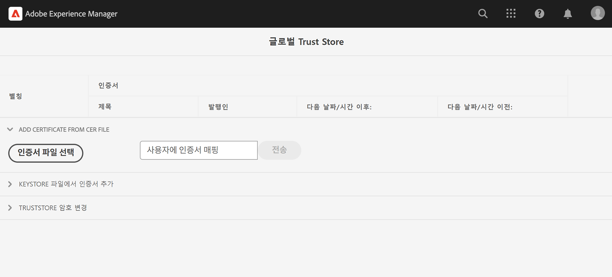

# 개인 인증서가 있는 내부 API 호출

개인 또는 자체 서명된 인증서를 사용하여 AEM에서 웹 API로 HTTPS를 호출하는 방법에 대해 알아봅니다.

>[!VIDEO](https://video.tv.adobe.com/v/3424853?quality=12&learn=on)

자체 서명된 인증서를 사용하는 웹 API에 HTTPS 연결을 만들려고 하면 기본적으로 다음 오류로 연결이 실패합니다.

```
PKIX path building failed: sun.security.provider.certpath.SunCertPathBuilderException: unable to find valid certification path to requested target
```

이 문제는 일반적으로 다음과 같은 경우에 발생합니다. **API의 SSL 인증서가 인증된 인증 기관(CA)에 의해 발급되지 않음** 및 Java™ 응용 프로그램에서 SSL/TLS 인증서의 유효성을 검사할 수 없습니다.

을 사용하여 개인 또는 자체 서명된 인증서가 있는 API를 성공적으로 호출하는 방법에 대해 알아보겠습니다. [Apache HttpClient](https://hc.apache.org/httpcomponents-client-4.5.x/index.html) 및 **AEM 글로벌 TrustStore**.


## HttpClient를 사용하는 프로토타입 API 호출 코드

다음 코드는 웹 API에 HTTPS 연결을 만듭니다.

```java
...
String API_ENDPOINT = "https://example.com";

// Create HttpClientBuilder
HttpClientBuilder httpClientBuilder = HttpClientBuilder.create();

// Create HttpClient
CloseableHttpClient httpClient = httpClientBuilder.build();

// Invoke API
CloseableHttpResponse closeableHttpResponse = httpClient.execute(new HttpGet(API_ENDPOINT));

// Code that reads response code and body from the 'closeableHttpResponse' object
...
```

코드는 [Apache HttpComponent](https://hc.apache.org/)의 [HttpClient](https://hc.apache.org/httpcomponents-client-4.5.x/index.html) 라이브러리 클래스 및 해당 메서드입니다.


## HttpClient 및 AEM TrustStore 자료 로드

가 있는 API 엔드포인트를 호출하려면 _개인 또는 자체 서명된 인증서_, [HttpClient](https://hc.apache.org/httpcomponents-client-4.5.x/index.html)의 `SSLContextBuilder` 은(는) AEM TrustStore와 함께 로드되어야 하며, 연결을 용이하게 하는 데 사용됩니다.

아래 단계를 수행합니다.

1. 다음으로 로그인 **AEM 작성자** as a **관리자**.
1. 다음으로 이동 **AEM Author > Tools > Security > Trust Store**&#x200B;를 클릭하고 **글로벌 Trust Store**. 처음 액세스하는 경우 글로벌 Trust Store에 대한 암호를 설정합니다.

   

1. 개인 인증서를 가져오려면 **인증서 파일 선택** 을(를) 클릭하고 원하는 인증서 파일 선택 `.cer` 확장명. 다음을 클릭하여 가져오기 **제출** 단추를 클릭합니다.

1. 아래와 같이 Java™ 코드를 업데이트합니다. 를 사용하려면 다음을 참고하십시오. `@Reference` AEM을 가져오려면 `KeyStoreService` 호출 코드는 OSGi 구성 요소/서비스 또는 Sling 모델(및 `@OsgiService` 사용).

   ```java
   ...
   
   // Get AEM's KeyStoreService reference
   @Reference
   private com.adobe.granite.keystore.KeyStoreService keyStoreService;
   
   ...
   
   // Get AEM TrustStore using KeyStoreService
   KeyStore aemTrustStore = getAEMTrustStore(keyStoreService, resourceResolver);
   
   if (aemTrustStore != null) {
   
       // Create SSL Context
       SSLContextBuilder sslbuilder = new SSLContextBuilder();
   
       // Load AEM TrustStore material into above SSL Context
       sslbuilder.loadTrustMaterial(aemTrustStore, null);
   
       // Create SSL Connection Socket using above SSL Context
       SSLConnectionSocketFactory sslsf = new SSLConnectionSocketFactory(
               sslbuilder.build(), NoopHostnameVerifier.INSTANCE);
   
       // Create HttpClientBuilder
       HttpClientBuilder httpClientBuilder = HttpClientBuilder.create();
       httpClientBuilder.setSSLSocketFactory(sslsf);
   
       // Create HttpClient
       CloseableHttpClient httpClient = httpClientBuilder.build();
   
       // Invoke API
       closeableHttpResponse = httpClient.execute(new HttpGet(API_ENDPOINT));
   
       // Code that reads response code and body from the 'closeableHttpResponse' object
       ...
   } 
   
   /**
    * 
    * Returns the global AEM TrustStore
    * 
    * @param keyStoreService OOTB OSGi service that makes AEM based KeyStore
    *                         operations easy.
    * @param resourceResolver
    * @return
    */
   private KeyStore getAEMTrustStore(KeyStoreService keyStoreService, ResourceResolver resourceResolver) {
   
       // get AEM TrustStore from the KeyStoreService and ResourceResolver
       KeyStore aemTrustStore = keyStoreService.getTrustStore(resourceResolver);
   
       return aemTrustStore;
   }
   
   ...
   ```

   * OOTB 삽입 `com.adobe.granite.keystore.KeyStoreService` OSGi 구성 요소에 대한 OSGi 서비스입니다.
   * 다음을 사용하여 글로벌 AEM TrustStore 가져오기 `KeyStoreService` 및 `ResourceResolver`, `getAEMTrustStore(...)` 메서드가 이를 수행합니다.
   * 다음의 개체 만들기 `SSLContextBuilder`, Java 참조™ [API 세부 정보](https://javadoc.io/static/org.apache.httpcomponents/httpcore/4.4.8/index.html?org/apache/http/ssl/SSLContextBuilder.html).
   * 글로벌 AEM TrustStore를에 로드 `SSLContextBuilder` 사용 `loadTrustMaterial(KeyStore truststore,TrustStrategy trustStrategy)` 메서드를 사용합니다.
   * 합격 `null` 대상 `TrustStrategy` 위의 방법에서는 API 실행 중에 AEM의 신뢰할 수 있는 인증서만 성공하도록 합니다.


>[!CAUTION]
>
>언급된 접근 방식을 사용하여 실행할 때 유효한 CA 발급 인증서가 있는 API 호출이 실패합니다. 이 메서드를 따를 때는 AEM 신뢰할 수 있는 인증서가 있는 API 호출만 성공할 수 있습니다.
>
>사용 [표준 접근 방식](#prototypical-api-invocation-code-using-httpclient) 유효한 CA 발급 인증서의 API 호출 실행 시(이전에 언급된 방법을 사용하여 비공개 인증서와 연관된 API만 실행해야 함)

## JVM 키 저장소 변경 방지

개인 인증서로 내부 API를 효과적으로 호출하는 기존 접근 방법에는 JVM 키 저장소 수정이 포함됩니다. Java를 사용하여 개인 인증서를 가져옴으로써 수행됩니다™ [keytool](https://docs.oracle.com/en/java/javase/11/tools/keytool.html#GUID-5990A2E4-78E3-47B7-AE75-6D1826259549) 명령입니다.

그러나 이 방법은 보안 모범 사례와 일치하지 않으며 AEM은 의 활용을 통해 우수한 옵션을 제공합니다. **글로벌 Trust Store** 및 [키 저장소 서비스](https://javadoc.io/doc/com.adobe.aem/aem-sdk-api/latest/com/adobe/granite/keystore/KeyStoreService.html).


## 솔루션 패키지

비디오에서 데모된 샘플 Node.js 프로젝트는에서 다운로드할 수 있습니다. [여기](assets/internal-api-call/REST-APIs.zip).

AEM 서블릿 코드는 WKND Sites 프로젝트의 `tutorial/web-api-invocation` 분기, [참조](https://github.com/adobe/aem-guides-wknd/tree/tutorial/web-api-invocation/core/src/main/java/com/adobe/aem/guides/wknd/core/servlets).
