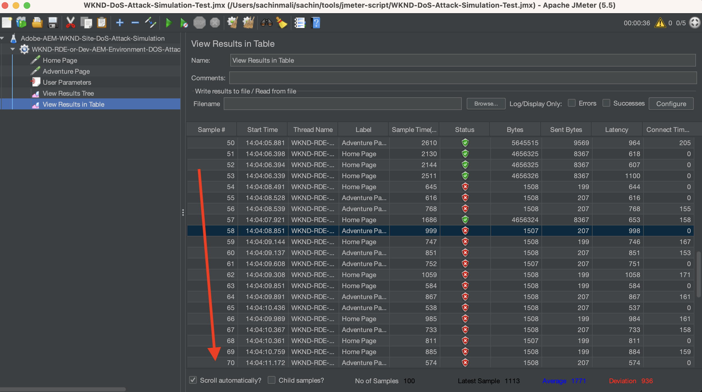

# ModSecurity를 사용하여 DoS 공격으로부터 AEM 사이트 보호

ModSecurity를 사용하여 Adobe Experience Manager(AEM) Publish Dispatcher에서 **OWASP ModSecurity CRS(Core Rule Set)**&#x200B;를 사용하여 DoS(서비스 거부) 공격으로부터 사이트를 보호하는 방법에 대해 알아봅니다.


>[!VIDEO](https://video.tv.adobe.com/v/3422976?quality=12&learn=on)

## 개요

[Open Web Application Security Project®(OWASP)](https://owasp.org/) 파운데이션은 웹 응용 프로그램에 가장 중요한 10가지 보안 문제를 요약한 [**OWASP Top 10**](https://owasp.org/www-project-top-ten/)을 제공합니다.

ModSecurity는 웹 애플리케이션에 대한 다양한 공격으로부터 보호하는 오픈 소스 크로스 플랫폼 솔루션입니다. 또한 HTTP 트래픽 모니터링, 로깅 및 실시간 분석을 허용합니다.

OWSAP®는 [OWASP® ModSecurity CRS(Core Rule Set)](https://github.com/coreruleset/coreruleset)도 제공합니다. CRS는 ModSecurity와 함께 사용하기 위한 일반적인 **공격 탐지** 규칙 집합입니다. 따라서 CRS는 최소한의 거짓 경고로 OWASP Top Ten을 포함한 광범위한 공격으로부터 웹 애플리케이션을 보호하는 것을 목표로 합니다.

이 자습서에서는 잠재적인 DoS 공격으로부터 사이트를 보호하기 위해 **DOS-PROTECTION** CRS 규칙을 활성화하고 구성하는 방법을 보여 줍니다.

>[!TIP]
>
>AEM as a Cloud Service의 [관리 CDN](https://experienceleague.adobe.com/docs/experience-manager-cloud-service/content/implementing/content-delivery/cdn.html)은(는) 대부분의 고객 성능 및 보안 요구 사항을 충족합니다. 그러나 ModSecurity는 추가 보안 계층을 제공하고 고객별 규칙 및 구성을 허용합니다.

## Dispatcher 프로젝트 모듈에 CRS 추가

1. [최신 OWASP ModSecurity 핵심 규칙 집합](https://github.com/coreruleset/coreruleset/releases)을(를) 다운로드하여 추출하십시오.

   ```shell
   # Replace the X.Y.Z with relevent version numbers.
   $ wget https://github.com/coreruleset/coreruleset/archive/refs/tags/vX.Y.Z.tar.gz
   
   # For version v3.3.5 when this tutorial is published
   $ wget https://github.com/coreruleset/coreruleset/archive/refs/tags/v3.3.5.tar.gz
   
   # Extract the downloaded file
   $ tar -xvzf coreruleset-3.3.5.tar.gz
   ```

1. AEM 프로젝트 코드에서 `dispatcher/src/conf.d/` 내에 `modsec/crs` 폴더를 만듭니다. 예를 들어 [AEM WKND Sites 프로젝트](https://github.com/adobe/aem-guides-wknd)의 로컬 복사본에 있습니다.

   {width="200" zoomable="yes"}

1. 다운로드한 CRS 릴리스 패키지의 `coreruleset-X.Y.Z/rules` 폴더를 `dispatcher/src/conf.d/modsec/crs` 폴더로 복사합니다.
1. 다운로드한 CRS 릴리스 패키지의 `coreruleset-X.Y.Z/crs-setup.conf.example` 파일을 `dispatcher/src/conf.d/modsec/crs` 폴더로 복사하고 이름을 `crs-setup.conf`(으)로 바꿉니다.
1. 복사된 CRS 규칙을 `XXXX-XXX-XXX.conf.disabled`(으)로 이름을 변경하여 `dispatcher/src/conf.d/modsec/crs/rules`에서 모든 CRS 규칙을 비활성화합니다. 아래 명령을 사용하여 모든 파일의 이름을 한 번에 바꿀 수 있습니다.

   ```shell
   # Go inside the newly created rules directory within the dispathcher module
   $ cd dispatcher/src/conf.d/modsec/crs/rules
   
   # Rename all '.conf' extension files to '.conf.disabled'
   $ for i in *.conf; do mv -- "$i" "$i.disabled"; done
   ```

   WKND 프로젝트 코드에서 이름이 변경된 CRS 규칙 및 구성 파일을 참조하십시오.

   {width="200" zoomable="yes"}

## DoS(서비스 거부) 보호 규칙 활성화 및 구성

서비스 거부(DoS) 보호 규칙을 활성화하고 구성하려면 아래 단계를 따르십시오.

1. `dispatcher/src/conf.d/modsec/crs/rules` 폴더 내에서 `REQUEST-912-DOS-PROTECTION.conf.disabled` 이름을 `REQUEST-912-DOS-PROTECTION.conf`(으)로 바꾸거나 `.disabled`을(를) rulename 확장에서 제거하여 DoS 보호 규칙을 사용하도록 설정합니다.
1. **DOS_COUNTER_THRESHOLD, DOS_BURST_TIME_SLICE, DOS_BLOCK_TIMEOUT** 변수를 정의하여 규칙을 구성합니다.
   1. `dispatcher/src/conf.d/modsec/crs` 폴더 내에 `crs-setup.custom.conf` 파일을 만듭니다.
   1. 아래 규칙 코드 조각을 새로 만든 파일에 추가합니다.

   ```
   # The Denial of Service (DoS) protection against clients making requests too quickly.
   # When a client is making more than 25 requests (excluding static files) within
   # 60 seconds, this is considered a 'burst'. After two bursts, the client is
   # blocked for 600 seconds.
   SecAction \
       "id:900700,\
       phase:1,\
       nolog,\
       pass,\
       t:none,\
       setvar:'tx.dos_burst_time_slice=60',\
       setvar:'tx.dos_counter_threshold=25',\
       setvar:'tx.dos_block_timeout=600'"    
   ```

이 예제 규칙 구성에서 **DOS_COUNTER_THRESHOLD**&#x200B;은(는) 25초이고, **DOS_BURST_TIME_SLICE**&#x200B;은(는) 60초이며, **DOS_BLOCK_TIMEOUT** 시간 초과는 600초입니다. 이 구성은 정적 파일을 제외하고 60초 이내에 두 번 이상 발생한 25개 요청을 식별하여 DoS 공격으로 자격을 얻으므로 요청 클라이언트가 600초(또는 10분) 동안 차단됩니다.

>[!WARNING]
>
>요구 사항에 적합한 값을 정의하려면 웹 보안 팀과 공동 작업하십시오.

## CRS 초기화

CRS를 초기화하려면 일반적인 긍정 오류(false positive)를 제거하고 사이트에 대한 로컬 예외를 추가하려면 아래 단계를 따르십시오.

1. CRS를 초기화하려면 **REQUEST-901-INITIALIZATION** 파일에서 `.disabled`을(를) 제거하십시오. 즉, `REQUEST-901-INITIALIZATION.conf.disabled` 파일의 이름을 `REQUEST-901-INITIALIZATION.conf`(으)로 바꿉니다.
1. 로컬 IP(127.0.0.1) ping과 같은 일반적인 긍정 오류(false positive)를 제거하려면 **REQUEST-905-COMMON-EXCEPTIONS** 파일에서 `.disabled`을(를) 제거하십시오.
1. AEM 플랫폼 또는 사이트별 경로와 같은 로컬 예외를 추가하려면 `REQUEST-900-EXCLUSION-RULES-BEFORE-CRS.conf.example`의 이름을 `REQUEST-900-EXCLUSION-RULES-BEFORE-CRS.conf`(으)로 바꾸십시오.
   1. 새로 이름이 변경된 파일에 AEM 플랫폼별 경로 예외를 추가합니다.

   ```
   ########################################################
   # AEM as a Cloud Service exclusions                    #
   ########################################################
   # Ignoring AEM-CS Specific internal and reserved paths
   
   SecRule REQUEST_URI "@beginsWith /systemready" \
       "id:1010,\
       phase:1,\
       pass,\
       nolog,\
       ctl:ruleEngine=Off"    
   
   SecRule REQUEST_URI "@beginsWith /system/probes" \
       "id:1011,\
       phase:1,\
       pass,\
       nolog,\
       ctl:ruleEngine=Off"
   
   SecRule REQUEST_URI "@beginsWith /gitinit-status" \
       "id:1012,\
       phase:1,\
       pass,\
       nolog,\
       ctl:ruleEngine=Off"
   
   ########################################################
   # ADD YOUR SITE related exclusions                     #
   ########################################################
   ...
   ```

1. 또한 **REQUEST-910-IP-REFERENTIAL.conf.disabled**&#x200B;에서 IP 신뢰도 블록 검사에 대해 `.disabled`을(를) 제거하고 `REQUEST-949-BLOCKING-EVALUATION.conf.disabled`에서 예외 항목 점수 검사에 대해 을(를) 제거하십시오.

>[!TIP]
>
>AEM 6.5에서 를 구성할 때 위의 경로를 AEM의 상태를 확인하는 각 AMS 또는 온프레미스 경로(즉, 하트비트 경로)로 바꾸십시오.

## ModSecurity Apache 구성 추가

ModSecurity(즉, `mod_security` Apache 모듈)를 활성화하려면 아래 단계를 수행하십시오.

1. 아래 키 구성으로 `dispatcher/src/conf.d/modsec/modsecurity.conf`에 `modsecurity.conf`을(를) 만듭니다.

   ```
   # Include the baseline crs setup
   Include conf.d/modsec/crs/crs-setup.conf
   
   # Include your customizations to crs setup if exist
   IncludeOptional conf.d/modsec/crs/crs-setup.custom.conf
   
   # Select all available CRS rules:
   #Include conf.d/modsec/crs/rules/*.conf
   
   # Or alternatively list only specific ones you want to enable e.g.
   Include conf.d/modsec/crs/rules/REQUEST-900-EXCLUSION-RULES-BEFORE-CRS.conf
   Include conf.d/modsec/crs/rules/REQUEST-901-INITIALIZATION.conf
   Include conf.d/modsec/crs/rules/REQUEST-905-COMMON-EXCEPTIONS.conf
   Include conf.d/modsec/crs/rules/REQUEST-910-IP-REPUTATION.conf
   Include conf.d/modsec/crs/rules/REQUEST-912-DOS-PROTECTION.conf
   Include conf.d/modsec/crs/rules/REQUEST-949-BLOCKING-EVALUATION.conf
   
   # Start initially with engine off, then switch to detection and observe, and when sure enable engine actions
   #SecRuleEngine Off
   #SecRuleEngine DetectionOnly
   SecRuleEngine On
   
   # Remember to use relative path for logs:
   SecDebugLog logs/httpd_mod_security_debug.log
   
   # Start with low debug level
   SecDebugLogLevel 0
   #SecDebugLogLevel 1
   
   # Start without auditing
   SecAuditEngine Off
   #SecAuditEngine RelevantOnly
   #SecAuditEngine On
   
   # Tune audit accordingly:
   SecAuditLogRelevantStatus "^(?:5|4(?!04))"
   SecAuditLogParts ABIJDEFHZ
   SecAuditLogType Serial
   
   # Remember to use relative path for logs:
   SecAuditLog logs/httpd_mod_security_audit.log
   
   # You might still use /tmp for temporary/work files:
   SecTmpDir /tmp
   SecDataDir /tmp
   ```

1. AEM 프로젝트의 Dispatcher 모듈 `dispatcher/src/conf.d/available_vhosts`에서 원하는 `.vhost`을(를) 선택합니다(예: `wknd.vhost`). `<VirtualHost>` 블록 외부에 아래 항목을 추가합니다.

   ```
   # Enable the ModSecurity and OWASP CRS
   <IfModule mod_security2.c>
       Include conf.d/modsec/modsecurity.conf
   </IfModule>
   
   ...
   
   <VirtualHost *:80>
       ServerName    "publish"
       ...
   </VirtualHost>
   ```

위의 _ModSecurity CRS_ 및 _DOS-PROTECTION_ 구성은 모두 AEM WKND Sites 프로젝트의 [tutorial/enable-modsecurity-crs-dos-protection](https://github.com/adobe/aem-guides-wknd/tree/tutorial/enable-modsecurity-crs-dos-protection) 분기에서 검토할 수 있습니다.

### Dispatcher 구성 유효성 검사

AEM as a Cloud Service을 사용하여 작업할 때 _Dispatcher 구성_ 변경 사항을 배포하기 전에 [AEM SDK의 Dispatcher 도구](https://experienceleague.adobe.com/docs/experience-manager-learn/cloud-service/local-development-environment-set-up/dispatcher-tools.html)의 `validate` 스크립트를 사용하여 로컬에서 유효성을 검사하는 것이 좋습니다.

```
# Go inside Dispatcher SDK 'bin' directory
$ cd <YOUR-AEM-SDK-DIR>/<DISPATCHER-SDK-DIR>/bin

# Validate the updated Dispatcher configurations
$ ./validate.sh <YOUR-AEM-PROJECT-CODE-DIR>/dispatcher/src
```

## 배포

Cloud Manager [웹 계층](https://experienceleague.adobe.com/docs/experience-manager-cloud-service/content/implementing/using-cloud-manager/cicd-pipelines/configuring-production-pipelines.html?#web-tier-config) 또는 [전체 스택](https://experienceleague.adobe.com/docs/experience-manager-cloud-service/content/implementing/using-cloud-manager/cicd-pipelines/configuring-production-pipelines.html?#full-stack-code) 파이프라인을 사용하여 로컬로 검증된 Dispatcher 구성을 배포합니다. [빠른 개발 환경](https://experienceleague.adobe.com/docs/experience-manager-learn/cloud-service/developing/rde/overview.html)을 사용하여 반환 시간을 단축할 수도 있습니다.

## 확인

DoS 보호를 확인하기 위해 이 예제에서는 60초 이내에 50개 이상의 요청(25개 요청 임계값과 2회 발생 횟수)을 전송해 보겠습니다. 그러나 이러한 요청은 AEM as a Cloud Service [기본 제공](https://experienceleague.adobe.com/docs/experience-manager-cloud-service/content/implementing/content-delivery/cdn.html) 또는 웹 사이트를 향해 있는 [기타 CDN](https://experienceleague.adobe.com/docs/experience-manager-cloud-service/content/implementing/content-delivery/cdn.html?#point-to-point-CDN)을 통해 전달되어야 합니다.

CDN 통과를 수행하는 한 가지 방법은 각 사이트 페이지 요청에 **새로운 무작위 값이 있는 쿼리 매개 변수를 추가하는 것입니다**.

짧은 기간(예: 60초) 내에 더 많은 요청(50초 이상)을 트리거하려면 Apache [JMeter](https://jmeter.apache.org/) 또는 [벤치마크 또는 ab 도구](https://httpd.apache.org/docs/2.4/programs/ab.html)를 사용할 수 있습니다.

### JMeter 스크립트를 사용하여 DoS 공격 시뮬레이션

JMeter를 사용하여 DoS 공격을 시뮬레이션하려면 아래 단계를 따르십시오.

1. [Apache JMeter 다운로드](https://jmeter.apache.org/download_jmeter.cgi) 및 로컬에서 [설치](https://jmeter.apache.org/usermanual/get-started.html#install)
1. `<JMETER-INSTALL-DIR>/bin` 디렉터리에서 `jmeter` 스크립트를 사용하여 로컬로 [실행](https://jmeter.apache.org/usermanual/get-started.html#running)합니다.
1. **열기** 도구 메뉴를 사용하여 샘플 [WKND-DoS-Attack-Simulation-Test](assets/modsecurity-crs/WKND-DoS-Attack-Simulation-Test.jmx) JMX 스크립트를 JMeter로 엽니다.

   

1. 테스트 AEM 환경 URL과 일치하는 _홈 페이지_ 및 _모험 페이지_ HTTP 요청 샘플러에서 **서버 이름 또는 IP** 필드 값을 업데이트합니다. 샘플 JMeter 스크립트의 다른 세부 사항을 검토하십시오.

   

1. 도구 메뉴에서 **시작** 단추를 눌러 스크립트를 실행합니다. 스크립트는 WKND 사이트의 _홈 페이지_ 및 _모험 페이지_&#x200B;에 대해 50개의 HTTP 요청(사용자 5명, 루프 횟수 10개)을 보냅니다. 따라서 정적이 아닌 파일에 대한 총 100개의 요청은 **DOS-PROTECTION** CRS 규칙 사용자 지정 구성당 DoS 공격을 검증합니다.

   

1. **테이블의 결과 보기** JMeter 수신기가 요청 번호 ~ 53 이상에 대한 **실패** 응답 상태를 표시합니다.

   

1. 실패한 요청에 대해 **503 HTTP 응답 코드**&#x200B;이(가) 반환되었습니다. **결과 트리 보기** JMeter 수신기를 사용하여 세부 정보를 볼 수 있습니다.

   

### 로그 검토

ModSecurity 로거 구성은 DoS 공격 사건의 세부 정보를 기록합니다. 세부 정보를 보려면 아래 단계를 따르십시오.

1. **Dispatcher 게시**&#x200B;의 `httpderror` 로그 파일을 다운로드하여 엽니다.
1. **오류** 줄을 보려면 로그 파일에서 `burst` 단어를 검색하십시오.

   ```
   Tue Aug 15 15:19:40.229262 2023 [security2:error] [pid 308:tid 140200050567992] [cm-p46652-e1167810-aem-publish-85df5d9954-bzvbs] [client 192.150.10.209] ModSecurity: Warning. Operator GE matched 2 at IP:dos_burst_counter. [file "/etc/httpd/conf.d/modsec/crs/rules/REQUEST-912-DOS-PROTECTION.conf"] [line "265"] [id "912170"] [msg "Potential Denial of Service (DoS) Attack from 192.150.10.209 - # of Request Bursts: 2"] [ver "OWASP_CRS/3.3.5"] [tag "application-multi"] [tag "language-multi"] [tag "platform-multi"] [tag "paranoia-level/1"] [tag "attack-dos"] [tag "OWASP_CRS"] [tag "capec/1000/210/227/469"] [hostname "publish-p46652-e1167810.adobeaemcloud.com"] [uri "/content/wknd/us/en/adventures.html"] [unique_id "ZNuXi9ft_9sa85dovgTN5gAAANI"]
   
   ...
   
   Tue Aug 15 15:19:40.515237 2023 [security2:error] [pid 309:tid 140200051428152] [cm-p46652-e1167810-aem-publish-85df5d9954-bzvbs] [client 192.150.10.209] ModSecurity: Access denied with connection close (phase 1). Operator EQ matched 0 at IP. [file "/etc/httpd/conf.d/modsec/crs/rules/REQUEST-912-DOS-PROTECTION.conf"] [line "120"] [id "912120"] [msg "Denial of Service (DoS) attack identified from 192.150.10.209 (1 hits since last alert)"] [ver "OWASP_CRS/3.3.5"] [tag "application-multi"] [tag "language-multi"] [tag "platform-multi"] [tag "paranoia-level/1"] [tag "attack-dos"] [tag "OWASP_CRS"] [tag "capec/1000/210/227/469"] [hostname "publish-p46652-e1167810.adobeaemcloud.com"] [uri "/us/en.html"] [unique_id "ZNuXjAN7ZtmIYHGpDEkmmwAAAQw"]
   ```

1. _클라이언트 IP 주소_, 작업, 오류 메시지 및 요청 세부 정보 등 세부 정보를 검토하십시오.

## ModSecurity의 성능에 미치는 영향

ModSecurity 및 관련 규칙을 활성화하면 성능에 몇 가지 영향을 미치므로 필요, 중복 및 건너뛴 규칙을 염두에 두어야 합니다. CRS 규칙을 활성화하고 사용자 지정하려면 웹 보안 전문가와 협력하십시오.

### 추가 규칙

이 자습서에서는 데모용으로만 **DOS-PROTECTION** CRS 규칙을 활성화하고 사용자 지정합니다. 적절한 규칙을 이해하고 검토하고 구성하려면 Web Security 전문가와 협력하는 것이 좋습니다.
