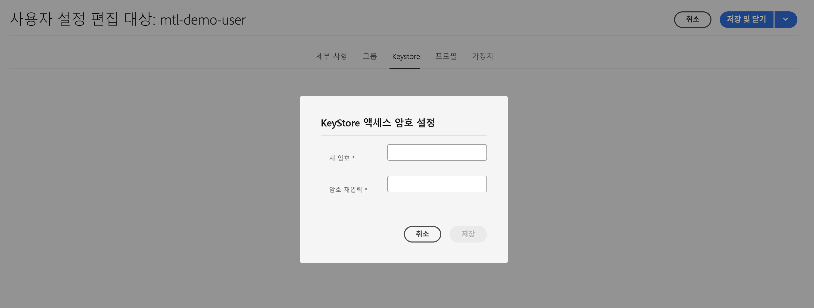
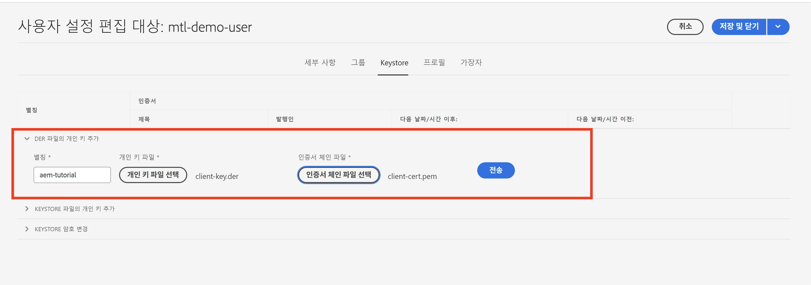
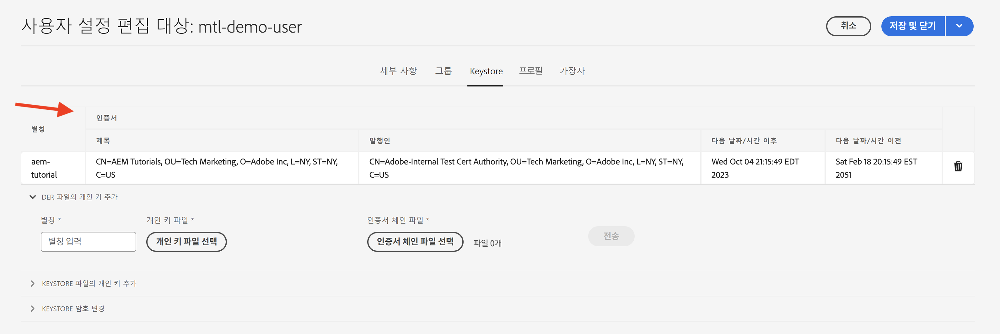

# AEM에서의 mTLS(상호 전송 계층 보안) 인증

AEM에서 mTLS(상호 전송 계층 보안) 인증이 필요한 웹 API로 HTTPS 호출을 수행하는 방법에 대해 알아봅니다.

>[!VIDEO](https://video.tv.adobe.com/v/3424855?quality=12&learn=on)

mTLS(양방향 TLS) 인증은 TLS 프로토콜의 보안을 강화하는 방식으로, **서버뿐만 아니라 클라이언트도 서로 인증**&#x200B;하는 과정을 거칩니다. 이러한 인증은 디지털 인증서를 사용하여 수행됩니다. 일반적으로 강력한 보안과 신원 확인이 중요한 상황에서 사용됩니다.

기본적으로 mTLS 인증이 필요한 웹 API에 HTTPS 연결을 시도하면 연결이 다음 오류로 인해 실패합니다.

```
javax.net.ssl.SSLHandshakeException: Received fatal alert: certificate_required
```

이는 클라이언트가 인증서 제시를 하지 않았기 때문에 발생하는 문제입니다.

[Apache HttpClient](https://hc.apache.org/httpcomponents-client-4.5.x/index.html)와 **AEM의 키 저장소 및 TrustStore**&#x200B;를 사용하여 mTLS 인증이 필요한 API를 성공적으로 호출하는 방법을 알아보겠습니다.


## HttpClient 및 AEM 키 저장소 자료 로드

AEM에서 mTLS로 보호된 API를 호출하려면 다음과 같은 주요 단계를 수행해야 합니다.

### AEM 인증서 생성

조직의 보안 팀과 협력하여 AEM 인증서를 요청하십시오. 보안 팀에서 키, 인증서 서명 요청(CSR) 등 인증서 관련 세부 정보를 제공하거나 요청하고, CSR을 사용하여 인증서가 발급됩니다.

데모 목적을 위해 키 및 인증서 서명 요청(CSR) 등의 인증서 관련 정보를 생성합니다. 아래 예제에서는 자체 서명된 CA를 사용하여 인증서를 발급합니다.

- 먼저, 내부 인증 기관(CA) 인증서를 생성합니다.

  ```shell
  # Create an internal Certification Authority (CA) certificate
  openssl req -new -x509 -days 9999 -keyout internal-ca-key.pem -out internal-ca-cert.pem
  ```

- AEM 인증서를 생성합니다.

  ```shell
  # Generate Key
  openssl genrsa -out client-key.pem
  
  # Generate CSR
  openssl req -new -key client-key.pem -out client-csr.pem
  
  # Generate certificate and sign with internal Certification Authority (CA)
  openssl x509 -req -days 9999 -in client-csr.pem -CA internal-ca-cert.pem -CAkey internal-ca-key.pem -CAcreateserial -out client-cert.pem
  
  # Verify certificate
  openssl verify -CAfile internal-ca-cert.pem client-cert.pem
  ```

- AEM 비공개 키를 DER 형식으로 변환합니다. AEM의 키 저장소에는 DER 형식의 비공개 키가 필요합니다.

  ```shell
  openssl pkcs8 -topk8 -inform PEM -outform DER -in client-key.pem -out client-key.der -nocrypt
  ```

>[!TIP]
>
>자체 서명된 CA 인증서는 개발 목적으로만 사용해야 합니다. 프로덕션 목적으로는 신뢰할 수 있는 인증 기관(CA)을 사용하여 인증서를 발급하십시오.


### 인증서 교환

위와 같이 AEM 인증서에 자체 서명된 CA를 사용하는 경우, 인증서나 내부 인증 기관(CA) 인증서를 API 공급자에게 전달해야 합니다.

또한 API 공급자가 자체 서명된 CA 인증서를 사용하는 경우 API 공급자로부터 인증서나 내부 인증 기관(CA) 인증서를 받아야 합니다.

### 인증서 가져오기

AEM 인증서를 가져오려면 아래 단계를 따르십시오.

1. **AEM 작성자 인스턴스**&#x200B;에 **관리자**&#x200B;로 로그인합니다.

1. **AEM 작성자 인스턴스 > 도구 > 보안 > 사용자 > 사용자 생성 또는 기존 사용자 선택**&#x200B;으로 이동합니다.

   

   데모 목적을 위해 `mtl-demo-user`라는 새 사용자를 만듭니다.

1. **사용자 속성**&#x200B;을 열려면 사용자 이름을 클릭합니다.

1. **키 저장소** 탭을 클릭한 다음 **키 저장소 만들기** 버튼을 클릭합니다. 그런 다음 **키 저장소 액세스 암호 설정** 대화 상자에서 이 사용자의 키 저장소에 대한 암호를 설정하고 [저장]을 클릭합니다.

   

1. 새 화면의 **DER 파일에서 비공개 키 추가** 섹션에서 아래 단계를 따릅니다.

   1. 별칭 입력

   1. 위에서 생성한 DER 형식의 AEM 비공개 키 가져오기.

   1. 위에서 생성한 인증서 체인 파일 가져오기.

   1. [제출] 클릭

      

1. 인증서를 성공적으로 가져왔는지 확인합니다.

   

API 공급자가 자체 서명된 CA 인증서를 사용하는 경우, 해당 인증서를 AEM의 TrustStore에 가져와야 합니다. [여기](https://experienceleague.adobe.com/docs/experience-manager-learn/foundation/security/call-internal-apis-having-private-certificate.html?lang=ko#httpclient-and-load-aem-truststore-material)의 단계를 따르십시오.

마찬가지로, AEM이 자체 서명된 CA 인증서를 사용하는 경우 API 공급자에게 해당 인증서를 가져오도록 요청해야 합니다.

### HttpClient를 사용한 전형적인 mTLS API 호출 코드

아래와 같이 Java™ 코드를 업데이트합니다. `@Reference` 주석을 사용하여 AEM의 `KeyStoreService` 서비스를 가져오려면 호출하는 코드는 OSGi 구성 요소/서비스이거나 Sling 모델이어야 합니다(이 경우 `@OsgiService`가 사용됨).


```java
...

// Get AEM's KeyStoreService reference
@Reference
private com.adobe.granite.keystore.KeyStoreService keyStoreService;

...

// Get AEM KeyStore using KeyStoreService
KeyStore aemKeyStore = getAEMKeyStore(keyStoreService, resourceResolver);

if (aemKeyStore != null) {

    // Create SSL Context
    SSLContextBuilder sslbuilder = new SSLContextBuilder();

    // Load AEM KeyStore material into above SSL Context with keystore password
    // Ideally password should be encrypted and stored in OSGi config
    sslbuilder.loadKeyMaterial(aemKeyStore, "admin".toCharArray());

    // If API provider cert is self-signed, load AEM TrustStore material into above SSL Context
    // Get AEM TrustStore
    KeyStore aemTrustStore = getAEMTrustStore(keyStoreService, resourceResolver);
    sslbuilder.loadTrustMaterial(aemTrustStore, null);

    // Create SSL Connection Socket using above SSL Context
    SSLConnectionSocketFactory sslsf = new SSLConnectionSocketFactory(
            sslbuilder.build(), NoopHostnameVerifier.INSTANCE);

    // Create HttpClientBuilder
    HttpClientBuilder httpClientBuilder = HttpClientBuilder.create();
    httpClientBuilder.setSSLSocketFactory(sslsf);

    // Create HttpClient
    CloseableHttpClient httpClient = httpClientBuilder.build();

    // Invoke API
    closeableHttpResponse = httpClient.execute(new HttpGet(MTLS_API_ENDPOINT));

    // Code that reads response code and body from the 'closeableHttpResponse' object
    ...
} 

/**
 * Returns the AEM KeyStore of a user. In this example we are using the
 * 'mtl-demo-user' user.
 * 
 * @param keyStoreService
 * @param resourceResolver
 * @return AEM KeyStore
 */
private KeyStore getAEMKeyStore(KeyStoreService keyStoreService, ResourceResolver resourceResolver) {

    // get AEM KeyStore of 'mtl-demo-user' user, you can create a user or use an existing one. 
    // Then create keystore and upload key, certificate files.
    KeyStore aemKeyStore = keyStoreService.getKeyStore(resourceResolver, "mtl-demo-user");

    return aemKeyStore;
}

/**
 * 
 * Returns the global AEM TrustStore
 * 
 * @param keyStoreService OOTB OSGi service that makes AEM based KeyStore
 *                         operations easy.
 * @param resourceResolver
 * @return
 */
private KeyStore getAEMTrustStore(KeyStoreService keyStoreService, ResourceResolver resourceResolver) {

    // get AEM TrustStore from the KeyStoreService and ResourceResolver
    KeyStore aemTrustStore = keyStoreService.getTrustStore(resourceResolver);

    return aemTrustStore;
}

...
```

- OOTB `com.adobe.granite.keystore.KeyStoreService` OSGi 서비스를 OSGi 구성 요소에 삽입합니다.
- `KeyStoreService` 및 `ResourceResolver`를 사용하여 사용자의 AEM 키 저장소를 `getAEMKeyStore(...)` 메서드로 가져옵니다.
- API 공급자가 자체 서명된 CA 인증서를 사용하는 경우 `getAEMTrustStore(...)` 메서드를 사용하여 글로벌 AEM TrustStore를 가져옵니다.
- `SSLContextBuilder` 오브젝트를 만듭니다(Java™ [API 세부 정보](https://javadoc.io/static/org.apache.httpcomponents/httpcore/4.4.8/index.html?org/apache/http/ssl/SSLContextBuilder.html) 참조).
- `loadKeyMaterial(final KeyStore keystore,final char[] keyPassword)` 메서드를 사용하여 사용자의 AEM 키 저장소를 `SSLContextBuilder`에 로드합니다.
- 키 저장소 암호는 키 저장소를 만들 때 설정한 암호이며, OSGi 구성에 저장해야 합니다(자세한 내용은 [암호 구성 값](https://experienceleague.adobe.com/docs/experience-manager-cloud-service/content/implementing/deploying/configuring-osgi.html?lang=ko#secret-configuration-values) 참조).

## JVM 키 저장소 변경 방지

개인 인증서를 사용하여 mTLS API를 효과적으로 호출하는 기존 방식에는 JVM 키 저장소를 수정하는 것이 포함됩니다. 이는 Java™ [keytool](https://docs.oracle.com/en/java/javase/11/tools/keytool.html#GUID-5990A2E4-78E3-47B7-AE75-6D1826259549) 명령을 사용하여 개인 인증서를 가져옴으로써 구현됩니다.

그러나 이 방법은 보안 모범 사례에 부합하지 않으며, AEM은 **사용자별 키 저장소와 글로벌 TrustStore** 및 [KeyStoreService](https://javadoc.io/doc/com.adobe.aem/aem-sdk-api/latest/com/adobe/granite/keystore/KeyStoreService.html)를 활용하여 더 나은 옵션을 제공합니다.

## 솔루션 패키지

비디오에서 데모한 Node.js 프로젝트 샘플은 [여기](assets/internal-api-call/REST-APIs.zip)에서 다운로드할 수 있습니다.

AEM 서블릿 코드는 WKND Sites 프로젝트의 `tutorial/web-api-invocation` 분기에서 확인할 수 있습니다. [여기를 참조](https://github.com/adobe/aem-guides-wknd/tree/tutorial/web-api-invocation/core/src/main/java/com/adobe/aem/guides/wknd/core/servlets)하십시오.
