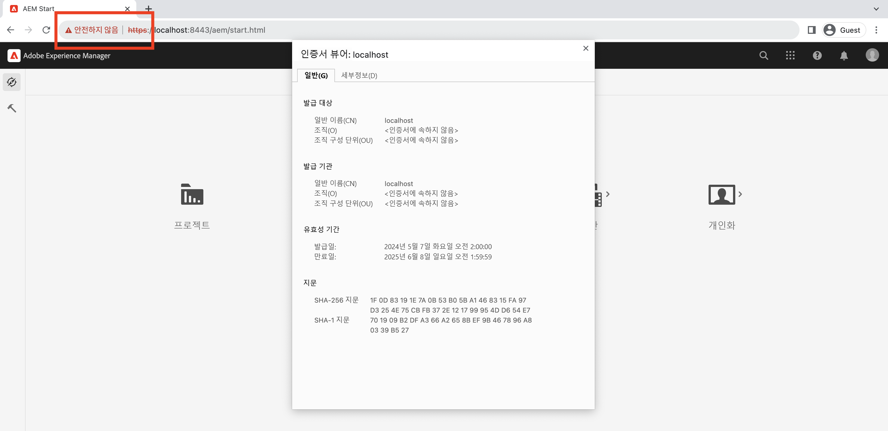

# AEM에서 SSL 마법사 사용

기본 제공 SSL 마법사를 사용하여 HTTPS를 통해 실행되도록 Adobe Experience Manager에서 SSL을 설정하는 방법에 대해 알아봅니다.

>[!VIDEO](https://video.tv.adobe.com/v/17993?quality=12&learn=on)


>[!NOTE]
>
>관리되는 환경의 경우 IT 부서에서 CA가 신뢰하는 인증서와 키를 제공하는 것이 가장 좋습니다.
>
>자체 서명된 인증서는 개발 목적으로만 사용해야 합니다.

## SSL 구성 마법사 사용

__AEM 작성자 인스턴스 > 도구 > 보안 > SSL 구성__&#x200B;으로 이동하여 __SSL 구성 마법사__&#x200B;를 엽니다.


### Store Credentials 생성

`ssl-service` 시스템 사용자에 연결된 _Key Store_&#x200B;와 전역 _Trust Store_&#x200B;를 생성하려면 __Store Credentials__ 마법사 단계를 사용하십시오.

1. `ssl-service` 시스템 사용자에 연결된 __Key Store__&#x200B;의 암호를 입력하고 확인합니다.
1. 전역 __Trust Store__&#x200B;의 암호를 입력하고 확인합니다. 이 Trust Store는 시스템 전체에 적용되는 것이며, 이미 생성되어 있는 경우 입력한 암호는 무시됩니다.

   

### 비공개 키 및 인증서 업로드

_비공개 키_&#x200B;와 _SSL 인증서_&#x200B;를 업로드하려면 __키 및 인증서__ 마법사 단계를 사용하십시오.

일반적으로 IT 부서가 CA에서 신뢰하는 인증서와 키를 제공합니다. 하지만 __개발__ 및 __테스트__ 목적에는 자체 서명된 인증서도 사용할 수 있습니다.

자체 서명된 인증서를 만들거나 다운로드하려면 [자체 서명된 비공개 키 및 인증서](#self-signed-private-key-and-certificate)를 참조하십시오.

1. __비공개 키__&#x200B;를 DER(구분 인코딩 규칙) 형식으로 업로드합니다. PEM과 달리 DER로 인코딩된 파일에는 `-----BEGIN CERTIFICATE-----`과 같은 일반 텍스트 구문이 포함되지 않습니다.
1. 연결된 __SSL 인증서__&#x200B;를 `.crt` 형식으로 업로드합니다.

   

### SSL 커넥터 세부 정보 업데이트

_호스트 이름_ 및 _포트_&#x200B;를 업데이트하려면 __SSL 커넥터__ 마법사 단계를 사용하십시오.

1. __HTTPS 호스트 이름__ 값을 업데이트하거나 확인합니다. 이 값은 인증서의 `Common Name (CN)`과 일치해야 합니다.
1. __HTTPS 포트__ 값을 업데이트하거나 확인합니다.

   

### SSL 설정 확인

1. SSL을 확인하려면 __HTTPS URL로 이동__ 버튼을 클릭합니다.
1. 자체 서명된 인증서를 사용하는 경우 `Your connection is not private` 오류가 표시됩니다.

   

## 자체 서명된 비공개 키 및 인증서

다음 zip에는 AEM SSL을 로컬로 설정하는 데 필요한 [!DNL DER] 및 [!DNL CRT] 파일이 포함되어 있습니다. 이들 파일은 로컬 개발 목적으로만 사용해야 합니다.

[!DNL DER] 및 [!DNL CERT] 파일은 편의를 위해 제공되는 것이며 아래의 비공개 키 및 자체 서명된 인증서 생성 섹션에 설명된 단계를 사용하여 생성됩니다.

필요한 경우, 인증서 암호구는 **admin**&#x200B;입니다.

이 localhost - 비공개 키 및 자체 서명된 인증서.zip (2028년 7월 만료)

[인증서 파일 다운로드](assets/use-the-ssl-wizard/certificate.zip)

### 비공개 키 및 자체 서명된 인증서 생성

위 비디오는 자체 서명된 인증서를 사용하여 AEM 작성자 인스턴스에서 SSL을 설정하고 구성하는 방법을 보여 줍니다. [[!DNL OpenSSL]](https://www.openssl.org/)을 사용하는 아래 명령을 통해 마법사의 2단계에서 사용할 비공개 키와 인증서를 생성할 수 있습니다.

```shell
### Create Private Key
$ openssl genrsa -aes256 -out localhostprivate.key 4096

### Generate Certificate Signing Request using private key
$ openssl req -sha256 -new -key localhostprivate.key -out localhost.csr -subj '/CN=localhost'

### Generate the SSL certificate and sign with the private key, will expire one year from now
$ openssl x509 -req -extfile <(printf "subjectAltName=DNS:localhost") -days 365 -in localhost.csr -signkey localhostprivate.key -out localhost.crt

### Convert Private Key to DER format - SSL wizard requires key to be in DER format
$ openssl pkcs8 -topk8 -inform PEM -outform DER -in localhostprivate.key -out localhostprivate.der -nocrypt
```
