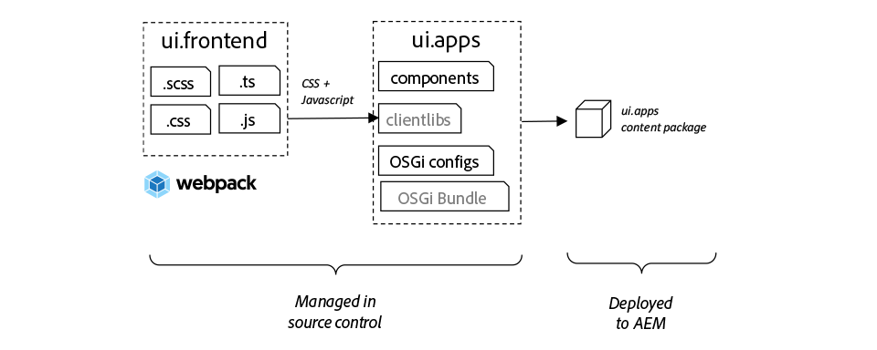
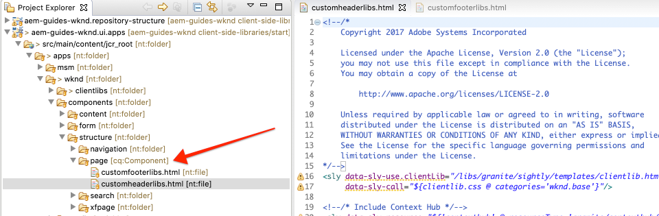
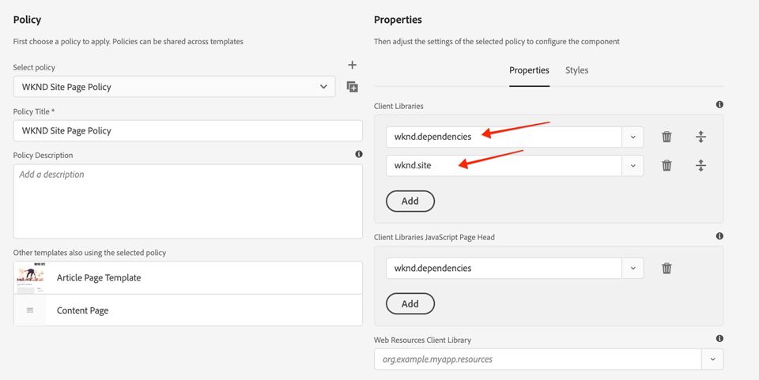

# 클라이언트측 라이브러리 및 프런트 엔드 워크플로우 {#client-side-libraries}

Client-Side Libraries or clientlibs are used to deploy and manage CSS for an Adobe Experience Manager (AEM) Sites implementation. 또한 이 자습서에서는 비연결된 [웹 팩](https://docs.adobe.com/content/help/ko-KR/experience-manager-core-components/using/developing/archetype/uifrontend.html) [](https://webpack.js.org/) 프로젝트인 ui.frontend 모듈을 전체 빌드 프로세스에 통합할 수 있는 방법을 다룹니다.

## 전제 조건 {#prerequisites}

필요한 도구 및 [로컬 개발 환경 설정을 위한 지침을 검토하십시오](overview.md#local-dev-environment).

또한 클라이언트측 라이브러리 및 AEM의 기본 사항을 [이해하려면 구성 요소](component-basics.md#client-side-libraries) 기초 자습서를 검토하는 것이 좋습니다.

### 스타터 프로젝트

튜토리얼이 빌드하는 기본 라인 코드를 확인합니다.

1. github.com/adobe/aem-guides-wknd [저장소](https://github.com/adobe/aem-guides-wknd) 복제
1. 분기를 `client-side-libraries/start` 확인해 보세요

   ```shell
   $ git clone git@github.com:adobe/aem-guides-wknd.git ~/code/aem-guides-wknd
   $ cd ~/code/aem-guides-wknd
   $ git checkout client-side-libraries/start
   ```

1. Maven 기술을 사용하여 로컬 AEM 인스턴스에 코드 베이스를 배포할 수 있습니다.

   ```shell
   $ cd ~/code/aem-guides-wknd
   $ mvn clean install -PautoInstallSinglePackage
   ```

항상 [GitHub에서](https://github.com/adobe/aem-guides-wknd/tree/client-side-libraries/solution) 완료된 코드를 보거나 분기로 전환하여 로컬로 코드를 체크 아웃할 수 `client-side-libraries/solution`있습니다.

## 목표

1. 클라이언트측 라이브러리가 편집 가능한 템플릿을 통해 페이지에 포함되는 방법을 이해합니다.
1. 전용 프런트 엔드 개발을 위한 UI.Frontend 모듈 및 웹 팩 개발 서버를 사용하는 방법을 알아봅니다.
1. 컴파일된 CSS 및 JavaScript를 사이트 구현에 전달하는 엔드 투 엔드 워크플로우를 살펴봅니다.

## 구축 내용 {#what-you-will-build}

이 장에서는 구현을 [UI 디자인 목업에 더 가깝게 만들기 위해 WKND 사이트 및 아티클 페이지 템플릿에 대한 몇 가지 기준선 스타일을 추가합니다](assets/pages-templates/wknd-article-design.xd). 고급 프런트 엔드 워크플로우를 사용하여 웹 팩 프로젝트를 AEM 클라이언트 라이브러리에 통합하게 됩니다.

>[!VIDEO](https://video.tv.adobe.com/v/30359/?quality=12&learn=on)

## 배경 {#background}

클라이언트측 라이브러리는 AEM Sites 구현에 필요한 CSS 및 JavaScript 파일을 구성하고 관리하는 메커니즘을 제공합니다. 클라이언트측 라이브러리 또는 clientlibs의 기본 목표는 다음과 같습니다.

1. CSS/JS를 작은 개별 파일에 저장하여 개발 및 유지 관리 간소화
1. 타사 프레임워크에 대한 종속성을 체계적으로 관리합니다.
1. CSS/JS를 하나 또는 두 개의 요청에 연결하여 클라이언트측 요청 수를 최소화합니다.

클라이언트 [측 라이브러리 사용에 대한 자세한 내용은 여기를 참조하십시오.](https://docs.adobe.com/content/help/en/experience-manager-65/developing/introduction/clientlibs.html)

클라이언트측 라이브러리에는 몇 가지 제한 사항이 있습니다. 특히 Sass, LESS 및 TypeScript와 같은 인기 있는 프런트 엔드 언어에 대한 지원이 제한되어 있습니다. 자습서에서는 ui.frontend **** 모듈이 이 문제를 해결하는 데 어떻게 도움이 되는지 살펴봅니다.

시작 코드 베이스를 로컬 AEM 인스턴스에 배포하고 http://localhost:4502/editor.html/content/wknd/us/en/magazine/guide-la-skateparks.html으로 [이동합니다](http://localhost:4502/editor.html/content/wknd/us/en/magazine/guide-la-skateparks.html). 이 페이지는 현재 스타일이 지정되지 않았습니다. 다음으로 페이지에 CSS 및 Javascript를 추가하기 위해 WKND 브랜드에 대한 클라이언트측 라이브러리를 구현합니다.

## 클라이언트측 라이브러리 조직 {#organization}

다음으로 [AEM Project Tranype에 의해 생성된 clientlibs 조직을 살펴볼 것입니다](https://docs.adobe.com/content/help/ko-KR/experience-manager-core-components/using/developing/archetype/overview.html).


*상위 수준 다이어그램 클라이언트측 라이브러리 조직 및 페이지 포함*

>[!NOTE]
>
> 다음의 클라이언트측 라이브러리 조직은 AEM Project 원형에서 생성되지만 시작점에 불과합니다. 프로젝트가 어떻게 CSS 및 Javascript를 사이트 구현에 관리하고 전달할 수 있는지 여부는 리소스, 기술 및 요구 사항에 따라 크게 달라질 수 있습니다.

1. Eclipse 또는 기타 IDE를 사용하여 **ui.apps** 모듈을 엽니다.
1. 패스를 확장하여 원형 `/apps/wknd/clientlibs` 에 의해 생성된 clientlibs를 봅니다.

   

   Adobe는 아래 세부 사항을 통해 이러한 고객을 조사할 것입니다.

1. Inspect. `clientlibs/clientlib-base`

   **clientlib-base** 는 WKND 사이트가 작동하는 데 필요한 CSS 및 JavaScript의 기본 수준을 나타냅니다. 로 설정된 속성 `categories` 을 확인합니다 `wknd.base`. `categories` 는 clientlibs에 대한 태그 지정 메커니즘이며 이를 참조하는 방법입니다.

   속성 `embed` 과 값 `String[]` 을 확인합니다. 이 `embed` 속성은 해당 카테고리를 기준으로 다른 clientlibs를 포함합니다. **clientlib-base** 는 필요한 모든 AEM Core Component clientlibraries를 포함합니다. 여기에는 회전판용 javascript, 기능할 빠른 검색 구성 요소와 같은 가공물이 포함됩니다. **clientlib-base** 는 고유한 CSS 및 Javascript를 포함하지 않지만 대신 다른 클라이언트 라이브러리를 포함합니다. **clientlib-base** 는 **clientlib-grid** clientlib을 카테고리와 `wknd.grid`포함합니다.

   이 속성 `allowProxy` 을 확인합니다 `true`. clientlibs를 항상 설정하는 것이 가장 좋은 `allowProxy=true` 방법입니다. 이 `allowProxy` 속성을 통해 Adobe 응용 프로그램 코드 아래에 clientlibs를 저장할 수 `/apps`**있지만** , 최종 사용자에게 응용 프로그램 코드가 노출되지 않도록 하기 위해 `/etc.clientlibs` 접두사가 있는 경로 위에 clientlibs를 전달합니다. allowProxy [속성에 대한 자세한 내용은 여기를 참조하십시오.](https://docs.adobe.com/content/help/en/experience-manager-65/developing/introduction/clientlibs.html#locating-a-client-library-folder-and-using-the-proxy-client-libraries-servlet).

1. Inspect. `clientlibs/clientlib-grid`

   **clientlib-grid** 는 [레이아웃 모드](https://docs.adobe.com/content/help/en/experience-manager-65/authoring/siteandpage/responsive-layout.html) 가 AEM Sites 편집기와 연동되는 데 필요한 CSS를 포함/생성하는 책임을 집니다. **clientlib-grid** 는 category set `wknd.grid` 을 포함하며 clientlib-base를 통해 **포함됩니다**.

   다양한 열과 중단점을 사용하도록 그리드를 사용자 지정할 수 있습니다. 그런 다음 생성된 기본 중단점을 업데이트합니다.

1. 파일을 업데이트합니다 `/apps/wknd/clientlibs/clientlib-grid/less/grid.less`.

   ```css
   @import (once) "/libs/wcm/foundation/clientlibs/grid/grid_base.less";
   
   /* maximum amount of grid cells to be provided */
   @max_col: 12;
   @screen-small: 767px;
   @screen-medium: 1024px;
   @screen-large: 1200px;
   @gutter-padding: 14px;
   
   /* default breakpoint */
   .aem-Grid {
       .generate-grid(default, @max_col);
   }
   
   /* phone breakpoint */
   @media (max-width: @screen-small) {
       .aem-Grid {
           .generate-grid(phone, @max_col);
       }
   }
   /* tablet breakpoint */
   @media (min-width: (@screen-small + 1)) and (max-width: @screen-medium) {
       .aem-Grid {
           .generate-grid(tablet, @max_col);
       }
   }
   
   .aem-GridColumn {
       padding: 0 @gutter-padding;
   }
   
   .responsivegrid.aem-GridColumn {
       padding-left: 0;
       padding-right: 0;
   }
   ```

   이렇게 하면 에서 설정한 템플릿 중단점에 해당하는 중단점이 변경됩니다 `/ui.content/src/main/content/jcr_root/conf/wknd/settings/wcm/templates/article-page-template/structure/.content.xml`.

   이 파일은 격자를 생성하기 위해 사용자 정의 혼합이 포함된 `grid_base.less` 파일 `/libs` 을 실제로 참조합니다.

1. Inspect의 속성을 참조하십시오 `clientlibs/clientlib-site`.

   **clientlib-site** 는 WKND 브랜드에 대한 모든 사이트 특정 스타일을 포함합니다. 의 카테고리를 `wknd.site`확인하십시오. 이 clientlib을 생성하는 CSS 및 Javascript는 실제로 `ui.frontend` 모듈에서 유지됩니다. 다음 번에 이 통합을 살펴보겠습니다.

1. Inspect의 속성을 참조하십시오 `clientlibs/clientlib-dependencies`.

   **clientlib-dependencies** is intended to embed any third party dependencies. 이것은 HTML 페이지의 맨 위에 로드될 수 있도록 별도의 clientlib입니다(필요한 경우). 의 카테고리를 `wknd.dependencies`확인하십시오. 이 clientlib을 생성하는 CSS 및 Javascript는 실제로 `ui.frontend` 모듈에서 유지됩니다. 이 통합은 튜토리얼의 후반부에서 살펴봅니다.

## ui.frontend 모듈 사용 {#ui-frontend}

다음으로 **[ui.frontend](https://docs.adobe.com/content/help/ko-KR/experience-manager-core-components/using/developing/archetype/uifrontend.html)** 모듈 사용을 살펴봅니다.

### 동기 부여

클라이언트측 라이브러리는 Sass 또는 [TypeScript와 같은 언어 지원에 대해 몇 가지](https://sass-lang.com/) 제한 [을 갖습니다](https://www.typescriptlang.org/). 또한 프런트 엔드 개발을 가속화하고 최적화하는 [NPM](https://www.npmjs.com/) 및 [웹](https://webpack.js.org/) 팩과 같은 오픈 소스 툴이폭발적으로 증가하고 있습니다.

ui.frontend **** 모듈의 기본 아이디어는 NPM 및 Webpack과 같은 뛰어난 도구를 사용하여 대부분의 프런트 엔드 개발을 관리할 수 있다는 것입니다. ui.frontend **모듈에 내장된 주요 통합 부분인** aem-clientlib-generator [](https://github.com/wcm-io-frontend/aem-clientlib-generator) 는 webpack/npm 프로젝트에서 컴파일된 CSS 및 JS 가공물을 가져와서 AEM 클라이언트측 라이브러리로 변환합니다. 이를 통해 프런트 엔드 개발자는 다양한 툴과 기술을 자유롭게 선택할 수 있습니다.



### 사용

이제 ui.frontrend`.scss` 모듈을 통해 일부 Sass 파일( **** 확장명)을 추가하여 WKND 브랜드에 대한 몇 가지 기본 스타일을 추가하겠습니다.

1. ui. **frontend** 모듈을 열고 탐색합니다 `src/main/webpack/base/sass`.

   

1. 폴더 아래에 이름이 지정된 새 파일 `_variables.scss` 을 만듭니다 `src/main/webpack/base/sass`.
1. 다음 `_variables.scss` 으로 채웁니다.

   ```scss
   //== Colors
   //
   //## Gray and brand colors for use across theme.
   
   $black:                  #202020;
   $gray:                   #696969;
   $gray-light:             #EBEBEB;
   $gray-lighter:           #F7F7F7;
   $white:                  #ffffff;
   $yellow:                 #FFE900;
   $blue:                   #0045FF;
   $pink:                   #FF0058;
   
   $brand-primary:           $yellow;
   
   //== Layout
   $gutter-padding: 14px;
   $max-width: 1164px;
   $max-body-width: 1680px;
   $screen-xsmall: 475px;
   $screen-small: 767px;
   $screen-medium: 1024px;
   $screen-large: 1200px;
   
   //== Scaffolding
   //
   //## Settings for some of the most global styles.
   $body-bg:                   $white;
   $text-color:                $black;
   $text-color-inverse:        $gray-light;
   
   $brand-secondary:           $black;
   
   $brand-third:               $gray-light;
   $link-color:                $blue;
   $link-hover-color:          $link-color;
   $link-hover-decoration:     underline;
   $nav-link:                  $black;
   $nav-link-inverse:          $gray-light;
   
   //== Typography
   //
   //## Font, line-height, and color for body text, headings, and more.
   
   $font-family-sans-serif:  "Source Sans Pro", "Helvetica Neue", Helvetica, Arial, sans-serif;
   $font-family-serif:       "Asar",Georgia, "Times New Roman", Times, serif;
   $font-family-base:        $font-family-sans-serif;
   
   $font-size-base:          18px;
   $font-size-large:         24px;
   $font-size-xlarge:        48px;
   $font-size-medium:        18px;
   $font-size-small:         14px;
   $font-size-xsmall:        12px;
   
   $font-size-h1:            40px;
   $font-size-h2:            36px;
   $font-size-h3:            24px;
   $font-size-h4:            16px;
   $font-size-h5:            14px;
   $font-size-h6:            10px;
   
   $line-height-base:        1.5;
   $line-height-computed:    floor(($font-size-base * $line-height-base)); // ~20px
   
   $font-weight-light:      300;
   $font-weight-normal:     normal;
   $font-weight-semi-bold:  400;
   $font-weight-bold:       600;
   ```

   Sass를 사용하면 변수를 만들 수 있으며, 이를 여러 파일에서 사용하여 일관성을 유지할 수 있습니다. 글꼴 모음 튜토리얼의 후반부에서 이러한 글꼴을 사용하기 위해 Google 웹 글꼴에 대한 호출을 포함하는 방법을 살펴봅니다.

1. 아래에 명명된 또 다른 파일 `_elements.scss` 을 만들고 `src/main/webpack/base/sass` 다음 파일로 채웁니다.

   ```scss
   body {
       background-color: $body-bg;
       font-family: $font-family-base;
       margin: 0;
       padding: 0;
       font-size: $font-size-base;
       text-align: left;
       color: $text-color;
       line-height: $line-height-base;
   
       .root {
           max-width: $max-width;
           margin: 0 auto;
       }
   }
   
   // Headings
   // -------------------------
   
   h1, h2, h3, h4, h5, h6,
   .h1, .h2, .h3, .h4, .h5, .h6 {
       line-height: $line-height-base;
       color: $text-color;
   }
   
   h1, .h1,
   h2, .h2,
   h3, .h3 {
       font-family: $font-family-serif;
       font-weight: $font-weight-normal;
       margin-top: $line-height-computed;
       margin-bottom: ($line-height-computed / 2);
   }
   
   h4, .h4,
   h5, .h5,
   h6, .h6 {
       font-family: $font-family-sans-serif;
       text-transform: uppercase;
       font-weight: $font-weight-bold;
   }
   
   h1, .h1 { font-size: $font-size-h1; }
   h2, .h2 { font-size: $font-size-h2; }
   h3, .h3 { font-size: $font-size-h3; }
   h4, .h4 { font-size: $font-size-h4; }
   h5, .h5 { font-size: $font-size-h5; }
   h6, .h6 { font-size: $font-size-h6; }
   
   a {
       color: $link-color;
       text-decoration: none;
   }
   
   h1 a, h2 a, h3 a {
       color: $pink; /* for wednesdays :-) */
   }
   
   // Body text
   // -------------------------
   
   p {
       margin: 0 0 ($line-height-computed / 2);
       font-size: $font-size-base;
       line-height: $line-height-base + 1;
       text-align: justify;
   }
   ```

   파일의 변수 `_elements.scss` 를 사용합니다 `_variables.scss`.

1. 아래 `_shared.scss` 에서 `src/main/webpack/base/sass` 업데이트하여 `_elements.scss` 및 `_variables.scss` 파일을 포함합니다.

   ```css
   @import './variables';
   @import './elements';
   ```

1. 명령줄 터미널을 열고 다음 명령을 사용하여 **ui.frontend** 모듈을 `npm install` 설치합니다.

   ```shell
   $ cd ~/code/aem-guides-wknd/ui.frontend
   $ npm install
   ```

   >[!NOTE]
   >
   >`npm install` 새 복제 또는 프로젝트 생성 후에 한 번만 실행해야 합니다.

1. 동일한 터미널에서 명령을 사용하여 **ui.frontend** 모듈을 만들고 `npm run dev` 배포합니다.

   ```shell
   $ npm run dev
   ...
   Entrypoint site = clientlib-site/css/site.css clientlib-site/js/site.js
   Entrypoint dependencies = clientlib-dependencies/js/dependencies.js
   start aem-clientlib-generator
   ...
   copy: dist/clientlib-site/css/site.css ../ui.apps/src/main/content/jcr_root/apps/wknd/clientlibs/clientlib-site/css/site.css
   ```

   이 명령 `npm run dev` 은 웹 팩 프로젝트에 대한 소스 코드를 작성 및 컴파일하고, 궁극적으로 **ui.apps** 모듈에서 clientlib-site **및** clientlib-dependencies **를 채워야** 합니다.

   >[!NOTE]
   >
   >또한 JS와 CSS를 축소하는 `npm run prod` 프로파일도 있습니다. 이는 Maven을 통해 웹 팩 빌드가 트리거될 때마다 표준 컴파일입니다. ui.frontend 모듈에 대한 자세한 내용은 [여기에서 확인할 수 있습니다](https://docs.adobe.com/content/help/ko-KR/experience-manager-core-components/using/developing/archetype/uifrontend.html).

1. Inspect이 `site.css` 아래 파일을 보관하다 `ui.frontend/dist/clientlib-site/css/site.css`. CSS는 대부분 이전에 만든 파일의 컨텐츠로 구성되지만 변수는 실제 값으로 대체됩니다. `_elements.scss`

   

1. 파일을 Inspect으로 `ui.frontend/clientlib.config.js`전송합니다. npm 플러그인 [aem-clientlib-generator에 대한 구성 파일입니다](https://github.com/wcm-io-frontend/aem-clientlib-generator). **aem-clientlib-generator** 는 컴파일된 CSS/JavaScript를 변환하고 **ui.apps 모듈로 복사하는 작업을 담당하는** 도구입니다.

1. Inspect의 ui.apps `site.css` 모듈 **** `ui.apps/src/main/content/jcr_root/apps/wknd/clientlibs/clientlib-site/css/site.css`에 있는 파일 이 항목은 `site.css` ui.frontend **** 모듈의 파일과 동일해야 합니다. 이제 **ui.apps** 모듈이므로 AEM에 배포할 수 있습니다.

   

   >[!NOTE]
   >
   > clientlib-site **는 빌드 시간 동안** 는 npm **또는** maven **을 사용하여**&#x200B;실제로 컴파일되므로 **** ui.apps모듈의 소스 컨트롤에서 실제로 무시할 수 있습니다. ui.apps 아래의 `.gitignore` 파일을 **Inspect으로 복사하십시오**.

>[!CAUTION]
>
> 일부 프로젝트에서는 **ui.frontend** 모듈 사용이 필요하지 않을 수 있습니다. ui.frontend **** 모듈에는 추가 복잡성이 추가되어 이러한 고급 프런트 엔드 도구(Sass, webpack, npm..)를 사용할 필요/욕구가 없는 경우 이 도구는 초과 작동을 일으킬 수 있습니다. 이러한 이유로 AEM 프로젝트 원형형의 선택 부분으로 간주되며 표준 클라이언트측 라이브러리와 바닐라 CSS 및 JavaScript의 사용은 완벽하게 지원됩니다.

## 페이지 및 템플릿 포함 {#page-inclusion}

다음으로 AEM 템플릿/페이지에 clientlibs를 포함하도록 프로젝트를 설정하는 방법을 살펴봅니다. 웹 개발 시 가장 좋은 방법은 태그를 닫기 직전에 HTML 헤더 `<head>` 및 JavaScript에 CSS를 포함하는 `</body>` 것입니다.

1. ui.apps **모듈에서** 탐색합니다 `ui.apps/src/main/content/jcr_root/apps/wknd/components/structure/page`.

   

   WKND 구현의 모든 페이지를 렌더링하는 데 사용되는 구성 요소입니다. `page`

1. Open the file `customheaderlibs.html`. 선을 보세요 `${clientlib.css @ categories='wknd.base'}`. 이 메시지는 카테고리가 있는 clientlib용 CSS가 이 파일을 통해 `wknd.base` 포함되며 모든 Adobe 페이지의 헤더에 clientlib-base **를** 효과적으로 포함됨을 나타냅니다.

1. Google 글꼴 스타일 `customheaderlibs.html` 에 대한 참조가 **ui.frontrend** 모듈에서 앞서 지정한 내용을 포함하도록 업데이트합니다. 또한 당분간 ContextHub에 주석을 달 것입니다.

   ```html
   <link href="//fonts.googleapis.com/css?family=Source+Sans+Pro:400,600|Asar&display=swap" rel="stylesheet">
   <sly data-sly-use.clientLib="/libs/granite/sightly/templates/clientlib.html"
    data-sly-call="${clientlib.css @ categories='wknd.base'}"/>
   
   <!--/* Include Context Hub
   <sly data-sly-resource="${'contexthub' @ resourceType='granite/contexthub/components/contexthub'}"/>
   */-->
   ```

1. 파일을 Inspect으로 `customfooterlibs.html`전송합니다. 이 파일 `customheaderlibs.html` 은 프로젝트를 구현하여 덮어쓰도록 되어 있습니다. 여기서 `${clientlib.js @ categories='wknd.base'}` 는 clientlib-base의 **JavaScript가 모든 페이지** 하단에 포함됩니다.

1. Maven을 사용하여 로컬 AEM 인스턴스에 프로젝트를 빌드하고 배포합니다.

   ```shell
   $ cd ~/code/aem-guides-wknd
   $ mvn clean install -PautoInstallSinglePackage
   ```

1. http://localhost:4502/libs/wcm/core/content/sites/templates.html/conf/wknd에서 WKND 템플릿을 [찾습니다](http://localhost:4502/libs/wcm/core/content/sites/templates.html/conf/wknd).

1. 템플릿 편집기에서 **아티클 페이지 템플릿을** 선택하고 엽니다.

   

1. 페이지 **정보** 아이콘을 클릭하고 메뉴에서 **페이지 정책** 을 선택하여 **페이지 정책** 대화 상자를엽니다.

   

   *페이지 정보 > 페이지 정책*

1. 여기에 카테고리 `wknd.dependencies` 와 `wknd.site` 가 나와 있습니다. 기본적으로 페이지 정책을 통해 구성된 clientlibs는 페이지 헤드에 CSS가 포함되고 본문 끝에 JavaScript가 포함되도록 분할됩니다. 원하는 경우 Page 헤드에 clientlib JavaScript가 로드되도록 명시적으로 나열할 수 있습니다. 이런 경우입니다 `wknd.dependencies`.

   

   >[!NOTE]
   >
   > clientlib에 대해 이전에 살펴보았던 것처럼 페이지 구성 요소 `wknd.site` 에서 `wknd.dependencies` 또는 `customheaderlibs.html` 스크립트를 사용하여 직접 `customfooterlibs.html` 또는 페이지 구성 요소를 참조할 수도 `wknd.base` 있습니다. 템플릿을 사용하면 템플릿을 선택하고 템플릿별로 사용할 clientlibs를 선택할 수 있습니다. 예를 들어 선택한 템플릿에서만 사용할 수 있는 매우 무거운 JavaScript 라이브러리가 있는 경우

1. 아티클 페이지 템플릿을 사용하여 만든 **LA Skatetpark** 페이지로 **이동합니다**. [http://localhost:4502/editor.html/content/wknd/us/en/magazine/guide-la-skateparks.html](http://localhost:4502/editor.html/content/wknd/us/en/magazine/guide-la-skateparks.html). ui.frontend **** 모듈에서 만든 CSS가 효과가 있음을 나타내기 위해 적용된 글꼴과 일부 기본 스타일의 차이가 나타나야 합니다.

1. [ **페이지 정보** ] 아이콘을 클릭하고 메뉴에서 **[게시됨으로** 보기]를 선택하여 AEM 편집기 외부에서 아티클 페이지를 엽니다.

   

1. http://localhost:4502/content/wknd/us/en/magazine/guide-la-skateparks.html?wcmmode=disabled의 페이지 소스 [를](http://localhost:4502/content/wknd/us/en/magazine/guide-la-skateparks.html?wcmmode=disabled) 보면 다음 clientlib 참조를 볼 수 있습니다 `<head>`.

   ```html
   <head>
   ...
   <link rel="stylesheet" href="/etc.clientlibs/wknd/clientlibs/clientlib-base.css" type="text/css">
   <script type="text/javascript" src="/etc.clientlibs/wknd/clientlibs/clientlib-dependencies.js"></script>
   <link rel="stylesheet" href="/etc.clientlibs/wknd/clientlibs/clientlib-dependencies.css" type="text/css">
   <link rel="stylesheet" href="/etc.clientlibs/wknd/clientlibs/clientlib-site.css" type="text/css">
   ...
   </head>
   ```

   clientlibs에서 프록시 끝점을 사용하고 `/etc.clientlibs` 있습니다. 페이지 아래쪽에도 다음 clientlib 포함 사항이 표시됩니다.

   ```html
   ...
   <script type="text/javascript" src="/etc.clientlibs/wknd/clientlibs/clientlib-site.js"></script>
   <script type="text/javascript" src="/etc.clientlibs/wknd/clientlibs/clientlib-base.js"></script>
   ...
   </body>
   ```

   >[!WARNING]
   >
   >이 경로는 **발송자 필터 섹션** 을 사용하는 보안상의 이유로 제한되어야 하므로 게시 쪽에서는 클라이언트 라이브러리가 **/앱에서** 제공되지 [않습니다](https://docs.adobe.com/content/help/en/experience-manager-dispatcher/using/configuring/dispatcher-configuration.html#example-filter-section). 클라이언트 라이브러리의 [allowProxy 속성은](https://docs.adobe.com/content/help/en/experience-manager-65/developing/introduction/clientlibs.html#locating-a-client-library-folder-and-using-the-proxy-client-libraries-servlet) CSS 및 JS가 /etc.clientlibs에서 제공되도록 **합니다**.

## Webpack DevServer {#webpack-dev-server}

이전 두 번의 연습에서 **ui.frontrend** 모듈의 여러 Sass 파일을 업데이트하고 빌드 프로세스를 통해 이러한 변경 사항이 AEM에 반영되는 것을 확인할 수 있었습니다. 다음으로 [웹 팩 개발 서버를](https://webpack.js.org/configuration/dev-server/) 활용하여 프런트 엔드 스타일을 신속하게 개발할 예정입니다.

>[!VIDEO](https://video.tv.adobe.com/v/30352/?quality=12&learn=on)

아래는 비디오에 표시되는 높은 수준의 단계입니다.

1. ui.frontend 모듈 내에서 다음 명령을 실행하여 webpack **개발** 서버를 시작합니다.

   ```shell
   $ cd ~/code/aem-guides-wknd/ui.frontend/
   $ npm start
   
   > aem-maven-archetype@1.0.0 start code/aem-guides-wknd/ui.frontend
   > webpack-dev-server --open --config ./webpack.dev.js
   ```

1. 이렇게 하면 http://localhost:8080/에서 정적 마크업을 [포함하는 새](http://localhost:8080/) 브라우저 창이 열립니다.
1. http://localhost:4502/content/wknd/us/en/magazine/guide-la-skateparks.html?wcmmode=disabled에서 LA 스케이트파크 아티클 페이지의 페이지 소스를 [복사합니다](http://localhost:4502/content/wknd/us/en/magazine/guide-la-skateparks.html?wcmmode=disabled).
1. AEM의 복사한 마크업을 아래 `index.html` 의 **ui.frontend** 모듈에 붙여넣습니다 `src/main/webpack/static`.
1. 복사한 마크업을 편집하고 clientlib-site **및** clientlib-dependencies에 대한 모든 참조를 **제거합니다**.

   ```html
   <!-- remove -->
   <script type="text/javascript" src="/etc.clientlibs/wknd/clientlibs/clientlib-dependencies.js"></script>
   <link rel="stylesheet" href="/etc.clientlibs/wknd/clientlibs/clientlib-dependencies.css" type="text/css">
   <link rel="stylesheet" href="/etc.clientlibs/wknd/clientlibs/clientlib-site.css" type="text/css">
   ...
   <script type="text/javascript" src="/etc.clientlibs/wknd/clientlibs/clientlib-site.js"></script>
   ```

   웹 팩 개발 서버에서 이러한 객체를 자동으로 생성하므로 이러한 참조를 제거할 수 있습니다.

1. 파일을 `.scss` 편집하고 변경 사항이 브라우저에 자동으로 반영되었는지 확인합니다.
1. 파일을 `/aem-guides-wknd.ui.frontend/webpack.dev.js` 검토합니다. 여기에는 webpack-dev-server를 시작하는 데 사용되는 webpack 구성이 포함됩니다. 경로 `/content` 와 로컬로 실행 중인 AEM 인스턴스 `/etc.clientlibs` 에서 프록시됩니다. 이미지 및 기타 clientlibs( **ui.frontend** 코드로 관리되지 않음)를 사용할 수 있는 방식입니다.

   >[!CAUTION]
   >
   > 정적 마크업의 이미지 src는 로컬 AEM 인스턴스의 라이브 이미지 구성 요소를 가리킵니다. AEM이 시작되지 않았거나 브라우저에서 로컬 AEM 인스턴스에 로그인하지 않은 경우 이미지 경로가 변경되면 이미지가 끊어진 것으로 나타납니다.
1. 명령줄에서 을 입력하여 웹 팩 서버를 **중지할** 수 있습니다 `CTRL+C`.

## It 통합 {#putting-it-together}

이 자습서는 클라이언트측 라이브러리와 AEM과 통합할 수 있는 잠재적인 프런트 엔드 워크플로우에 초점을 두고 있습니다. 이 점을 염두에 두고, 아티클 페이지 템플릿에서 사용되는 핵심 구성 요소의 몇 가지 기본 스타일을 제공하는 [클라이언트측 라이브러리-final-styles.zip](assets/client-side-libraries/client-side-libraries-final-styles.zip)을 설치하여 구현 시간을 단축할 것입니다.

* [탐색 표시](https://docs.adobe.com/content/help/ko-KR/experience-manager-core-components/using/components/breadcrumb.html)
* [다운로드](https://docs.adobe.com/content/help/en/experience-manager-core-components/using/components/download.html)
* [이미지](https://docs.adobe.com/content/help/ko-KR/experience-manager-core-components/using/components/image.html)
* [목록](https://docs.adobe.com/content/help/ko-KR/experience-manager-core-components/using/components/list.html)
* [탐색](https://docs.adobe.com/content/help/ko-KR/experience-manager-core-components/using/components/navigation.html)
* [빠른 검색](https://docs.adobe.com/content/help/ko-KR/experience-manager-core-components/using/components/quick-search.html)
* [분리자](https://docs.adobe.com/content/help/ko-KR/experience-manager-core-components/using/components/separator.html)

>[!VIDEO](https://video.tv.adobe.com/v/30351/?quality=12&learn=on)

아래는 비디오에 표시되는 높은 수준의 단계입니다.

1. 클라이언트 측 [라이브러리-final-styles.zip을 다운로드하고](assets/client-side-libraries/client-side-libraries-final-styles.zip) 아래의 내용을 압축 해제합니다 `ui.frontend/src/main/webpack`. zip의 내용은 다음 폴더를 덮어써야 합니다.

   ```plain
   /src/main/webpack
            /base
            /components
            /resources
   ```

1. 웹 팩 개발 서버를 사용하여 새 스타일을 미리 봅니다.

   ```shell
    $ cd ~/code/aem-guides-wknd/ui.frontend/
    $ npm start
   
    > aem-maven-archetype@1.0.0 start code/aem-guides-wknd/ui.frontend
    > webpack-dev-server --open --config ./webpack.dev.js
   ```

1. 코드 베이스를 로컬 AEM 인스턴스에 배포하여 LA 스케이트 파크 아티클에 적용된 새로운 스타일을 확인할 수 있습니다.

   ```shell
    $ cd ~/code/aem-guides-wknd
    $ mvn -PautoInstallSinglePackage clean install
   ```

## 축하합니다! {#congratulations}

축하합니다. 아티클 페이지에는 WKND 브랜드와 일치하는 몇 가지 일관된 스타일이 있으며 **ui.frontend** 모듈에 익숙해집니다.

### 다음 단계 {#next-steps}

Experience Manager 스타일 시스템을 사용하여 개별 스타일을 구현하고 핵심 구성 요소를 다시 사용하는 방법을 알아봅니다. [스타일 시스템을 사용하여 스타일 시스템](style-system.md) 커버를 사용하여 개발하면 브랜드별 CSS 및 템플릿 편집기의 고급 정책 구성으로 핵심 구성 요소를 확장할 수 있습니다.

완성된 코드를 [GitHub에서](https://github.com/adobe/aem-guides-wknd) 보거나 Git brach에서 로컬로 코드를 검토하고 배포합니다 `client-side-libraries/solution`.

1. github.com/adobe/aem-wknd-guides [저장소](https://github.com/adobe/aem-guides-wknd) 복제
1. 분기를 `client-side-libraries/solution` 보세요

## 추가 툴 및 리소스 {#additional-resources}

### aemfed {#develop-aemfed}

[**aemfed**](https://aemfed.io/) 는 프런트 엔드 개발 속도를 높이는 데 사용할 수 있는 오픈 소스 명령줄 도구입니다. Aemsync, [Browsersync](https://www.npmjs.com/package/aemsync)및 [Sling](https://www.npmjs.com/package/browser-sync) Log [Tracer를 통해](https://sling.apache.org/documentation/bundles/log-tracers.html)지원됩니다.

높은 수준 **의** 앱은 **ui.apps** 모듈 내에서 파일 변경 사항을 듣고 실행 중인 AEM 인스턴스에 직접 동기화하도록 디자인되었습니다. 변경 사항에 따라 로컬 브라우저가 자동으로 새로 고쳐져 프런트 엔드 개발 속도가 빨라집니다. 또한 Sling Log Tracer와 연동하여 단말기에 바로 서버측 오류를 자동으로 표시할 수 있습니다.

ui.apps **모듈 내에서 많은 작업을 하고 있는 경우 HTL 스크립트를 수정하고 사용자 지정 구성 요소를 만드는** 경우 **** aemfed는 매우 강력한 도구가 될 수 있습니다. [전체 문서는 여기에서 찾을 수 있습니다.](https://github.com/abmaonline/aemfed).

### 클라이언트측 라이브러리 디버깅 {#debugging-clientlibs}

여러 가지 **카테고리** 및 **포함** 방법이 서로 다르면 문제를 해결하는 것이 번거로울 수 있습니다. AEM은 이 문제를 해결하는 데 도움이 되는 여러 도구를 제공합니다. 가장 중요한 도구 중 하나는 **AEM에서 LESS 파일을 다시 컴파일하고 CSS를 생성하게 하는 클라이언트 라이브러리** 재구축입니다.

* [**덤프 라이브러리**](http://localhost:4502/libs/granite/ui/content/dumplibs.html) - AEM 인스턴스에 등록된 모든 클라이언트 라이브러리를 나열합니다. `<host>/libs/granite/ui/content/dumplibs.html`

* [**테스트 출력**](http://localhost:4502/libs/granite/ui/content/dumplibs.test.html) - 사용자가 카테고리를 기반으로 clientlib의 예상 HTML 출력을 볼 수 있습니다. `<host>/libs/granite/ui/content/dumplibs.test.html`

* [**라이브러리 종속성 유효성 검사**](http://localhost:4502/libs/granite/ui/content/dumplibs.validate.html) - 찾을 수 없는 모든 종속성 또는 포함된 카테고리를 강조 표시합니다. `<host>/libs/granite/ui/content/dumplibs.validate.html`

* [**클라이언트 라이브러리**](http://localhost:4502/libs/granite/ui/content/dumplibs.rebuild.html) 다시 구성 - 사용자가 AEM에서 모든 클라이언트 라이브러리를 다시 빌드하거나 클라이언트 라이브러리의 캐시를 무효화할 수 있도록 합니다. 이 도구는 AEM에서 생성된 CSS를 다시 컴파일할 수 있으므로 LESS로 개발 시 특히 효과적입니다. 일반적으로 캐시를 무효화한 다음 모든 라이브러리를 재구성하는 대신 페이지 새로 고침을 수행하는 것이 더 효과적입니다. `<host>/libs/granite/ui/content/dumplibs.rebuild.html`


