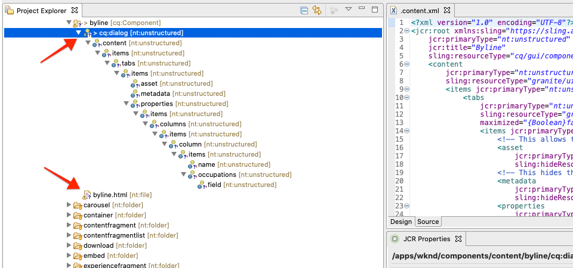
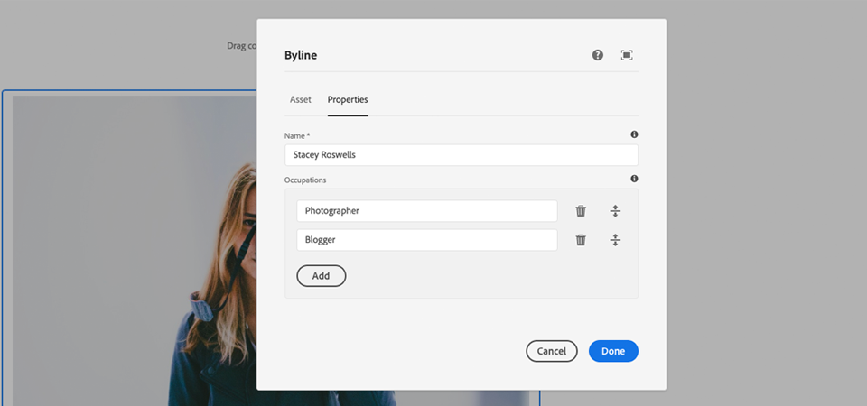
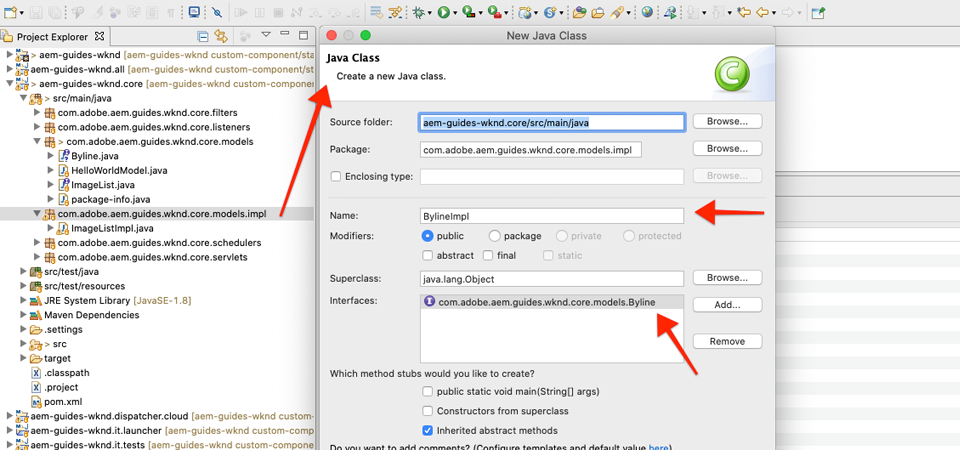
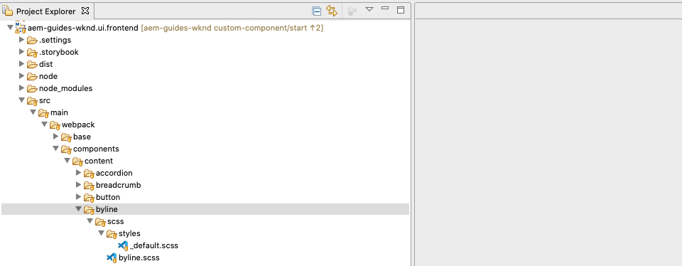

# 사용자 지정 구성 요소 {#custom-component}

이 자습서에서는 대화 상자에서 제작한 컨텐츠를 표시하는 사용자 정의 AEM Byline 구성 요소의 엔드 투 엔드 제작, Sling 모델을 개발하여 구성 요소의 HTL을 채우는 비즈니스 로직을 캡슐화하는 것을 살펴봅니다.

## 전제 조건 {#prerequisites}

필요한 도구 및 [로컬 개발 환경 설정을 위한 지침을 검토하십시오](overview.md#local-dev-environment).

### 스타터 프로젝트

>[!NOTE]
>
> 이 자습서의 이전 부분을 따라해 본 경우 이 장에 대한 스타터 프로젝트는 구현 시간을 단축시켜 줍니다. 템플릿과 다양한 콘텐츠가 포함되어 있습니다. 또한 맞춤형 구성 요소 개발 외에 새로운 컨텐츠 및 구현의 다른 영역을 자유롭게 탐색할 수 있습니다.

튜토리얼이 빌드하는 기본 라인 코드를 확인합니다.

1. github.com/adobe/aem-guides-wknd [저장소](https://github.com/adobe/aem-guides-wknd) 복제
1. 분기를 `custom-component/start` 확인해 보세요

   ```shell
   $ git clone git@github.com:adobe/aem-guides-wknd.git ~/code/aem-guides-wknd
   $ cd ~/code/aem-guides-wknd
   $ git checkout custom-component/start
   ```

1. Maven 기술을 사용하여 로컬 AEM 인스턴스에 코드 베이스를 배포할 수 있습니다.

   ```shell
   $ cd ~/code/aem-guides-wknd
   $ mvn clean install -PautoInstallSinglePackage
   ```

항상 [GitHub에서](https://github.com/adobe/aem-guides-wknd/tree/custom-component/solution) 완료된 코드를 보거나 분기로 전환하여 로컬로 코드를 체크 아웃할 수 `custom-component/solution`있습니다.

## 목표

1. 사용자 정의 AEM 구성 요소를 만드는 방법 이해
1. Sling Models를 사용하여 비즈니스 로직을 캡슐화하는 방법
1. HTL 스크립트 내에서 슬링 모델을 사용하는 방법 이해

## 구축 내용 {#byline-component}

>[!VIDEO](https://video.tv.adobe.com/v/30181/?quality=12&learn=on)

WKND 자습서의 이 부분에서는 아티클의 기여자에 대한 작성된 정보를 표시하는 데 사용되는 바이트 구성 요소가 만들어집니다.


*WKND 디자인 팀에서 제공하는 byline component visual design*

필자 구성 요소의 구현에는 필자 컨텐트를 수집하는 대화 상자와 필자의 다음을 검색하는 사용자 지정 슬링 모델이 포함됩니다.

* 이름
* 이미지
* 직업

로 표시됩니다.


*일선 구성 요소 분해*

## 필자 구성 요소 만들기 {#create-byline-component}

먼저 Byline Component 노드 구조를 만들고 대화 상자를 정의합니다. AEM의 구성 요소를 나타내며 JCR의 위치별로 구성 요소의 리소스 유형을 암시적으로 정의합니다.

이 대화 상자에는 컨텐츠 작성자가 제공할 수 있는 인터페이스가 표시됩니다. 이 구현을 위해 AEM WCM 핵심 구성 요소의 **이미지** 구성 요소를 활용하여 Byline의 이미지 작성 및 렌더링을 처리할 수 있으므로 구성 요소의 이미지로 설정됩니다 `sling:resourceSuperType`.

### 구성 요소 노드 만들기 {#create-component-node}

1. ui.apps **모듈** 에서 유형 `/apps/wknd/components/content` 의 **byline이라는 새 노드** 로 이동하여 만듭니다 `cq:Component`.

   

1. Byline 구성 요소의 노드에 다음 속성을 `cq:Component` 추가합니다.

   ```plain
   jcr:title = Byline
   jcr:description = Displays a contributor's byline.
   componentGroup = WKND.Content
   sling:resourceSuperType =  core/wcm/components/image/v2/image
   ```

   

   이 XML의 결과는 다음과 `.content.xml` 같습니다.

   ```xml
   <?xml version="1.0" encoding="UTF-8"?>
   <jcr:root
       xmlns:sling="https://sling.apache.org/jcr/sling/1.0" xmlns:jcr="https://www.jcp.org/jcr/1.0"
       jcr:primaryType="cq:Component"
       jcr:title="Byline"
       jcr:description="Displays a contributor's byline."
       componentGroup="WKND.Content"
       sling:resourceSuperType="core/wcm/components/image/v2/image"/>
   ```

### HTL 스크립트 만들기 {#create-the-htl-script}

1. 노드 아래에 `byline` 구성 요소의 HTML 프레젠테이션을 `byline.html`담당하는 새 파일을 추가합니다. Sling이 이 리소스 유형을 렌더링하는 데 사용할 기본 스크립트가 되므로 `cq:Component` 노드와 동일한 파일 이름을 지정하는 것이 중요합니다.

1. 다음 코드를 에 추가합니다 `byline.html`.

   ```xml
   <!--/* byline.html */-->
   <div data-sly-use.placeholderTemplate="core/wcm/components/commons/v1/templates.html">
   </div>
   <sly data-sly-call="${placeholderTemplate.placeholder @ isEmpty=true}"></sly>
   ```

`byline.html` 을 [나중에](#byline-htl)다시 방문하면 슬링 모델이 생성됩니다. HTL 파일의 현재 상태를 사용하면 구성 요소가 페이지로 드래그하여 놓을 때 AEM Sites 페이지 편집기에서 빈 상태로 표시될 수 있습니다.

### 대화 상자 정의 만들기 {#create-the-dialog-definition}

다음으로 다음 필드를 사용하여 필자 구성 요소에 대한 대화 상자를 정의합니다.

* **이름**:기고자 이름으로 텍스트 필드.
* **이미지**:기고자의 소개 사진에 대한 참조.
* **직업**:공헌자의 직종 목록. 직업은 오름차순(a~z)으로 정렬해야 합니다.

1. 구성 요소 노드 아래에 `byline` Type이라는 새 노드 `cq:dialog` 를 만듭니다 `nt:unstructured`.
1. 다음 XML `cq:dialog` 로 업데이트합니다. 다음 XML을 열고 이 XML에 `.content.xml` 복사하여 붙여넣는 것이 가장 쉽습니다.

   ```xml
   <?xml version="1.0" encoding="UTF-8"?>
   <jcr:root xmlns:sling="http://sling.apache.org/jcr/sling/1.0" xmlns:jcr="http://www.jcp.org/jcr/1.0"
           xmlns:nt="http://www.jcp.org/jcr/nt/1.0"
           jcr:primaryType="nt:unstructured"
           jcr:title="Byline"
           sling:resourceType="cq/gui/components/authoring/dialog">
       <content
               jcr:primaryType="nt:unstructured"
               sling:resourceType="granite/ui/components/coral/foundation/container">
           <items jcr:primaryType="nt:unstructured">
               <tabs
                       jcr:primaryType="nt:unstructured"
                       sling:resourceType="granite/ui/components/coral/foundation/tabs"
                       maximized="{Boolean}false">
                   <items jcr:primaryType="nt:unstructured">
                       <asset
                               jcr:primaryType="nt:unstructured"
                               sling:hideResource="{Boolean}false"/>
                       <metadata
                               jcr:primaryType="nt:unstructured"
                               sling:hideResource="{Boolean}true"/>
                       <properties
                               jcr:primaryType="nt:unstructured"
                               jcr:title="Properties"
                               sling:resourceType="granite/ui/components/coral/foundation/container"
                               margin="{Boolean}true">
                           <items jcr:primaryType="nt:unstructured">
                               <columns
                                       jcr:primaryType="nt:unstructured"
                                       sling:resourceType="granite/ui/components/coral/foundation/fixedcolumns"
                                       margin="{Boolean}true">
                                   <items jcr:primaryType="nt:unstructured">
                                       <column
                                               jcr:primaryType="nt:unstructured"
                                               sling:resourceType="granite/ui/components/coral/foundation/container">
                                           <items jcr:primaryType="nt:unstructured">
                                               <name
                                                       jcr:primaryType="nt:unstructured"
                                                       sling:resourceType="granite/ui/components/coral/foundation/form/textfield"
                                                       emptyText="Enter the contributor's name to display."
                                                       fieldDescription="The contributor's name to display."
                                                       fieldLabel="Name"
                                                       name="./name"
                                                       required="{Boolean}true"/>
                                               <occupations
                                                       jcr:primaryType="nt:unstructured"
                                                       sling:resourceType="granite/ui/components/coral/foundation/form/multifield"
                                                       fieldDescription="A list of the contributor's occupations."
                                                       fieldLabel="Occupations"
                                                       required="{Boolean}false">
                                                   <field
                                                           jcr:primaryType="nt:unstructured"
                                                           sling:resourceType="granite/ui/components/coral/foundation/form/textfield"
                                                           emptyText="Enter an occupation"
                                                           name="./occupations"/>
                                               </occupations>
                                           </items>
                                       </column>
                                   </items>
                               </columns>
                           </items>
                       </properties>
                   </items>
               </tabs>
           </items>
       </content>
   </jcr:root>
   ```

   이러한 노드 정의 [는 Sling Resource Combination](https://sling.apache.org/documentation/bundles/resource-merger.html) 을 사용하여 구성 요소에서 상속되는 대화 탭(이 경우 `sling:resourceSuperType` 핵심 구성 요소의 이미지 구성 요소)을 제어합니다 ****.

   

### 정책 대화 상자 만들기 {#create-the-policy-dialog}

대화 상자 만들기와 동일한 접근 방식에 따라, 정책 대화 상자(이전의 디자인 대화 상자)를 만들어 핵심 구성 요소의 이미지 구성 요소에서 상속된 정책 구성에 원치 않는 필드를 숨깁니다.

1. 노드 아래에 `byline` type이라는 새 노드 `cq:Component` 를 `cq:design_dialog` `nt:unstructured`만듭니다.
1. 다음 XML `cq:design_dialog` 로 업데이트합니다. 아래 XML을 열고 `.content.xml` 복사하여 붙여 넣는 것이 가장 쉽습니다.

   ```xml
   <?xml version="1.0" encoding="UTF-8"?>
   <jcr:root xmlns:sling="http://sling.apache.org/jcr/sling/1.0" xmlns:granite="http://www.adobe.com/jcr/granite/1.0" xmlns:cq="http://www.day.com/jcr/cq/1.0" xmlns:jcr="http://www.jcp.org/jcr/1.0" xmlns:nt="http://www.jcp.org/jcr/nt/1.0"
       jcr:primaryType="nt:unstructured"
       jcr:title="Byline"
       sling:resourceType="cq/gui/components/authoring/dialog">
       <content
               jcr:primaryType="nt:unstructured">
           <items jcr:primaryType="nt:unstructured">
               <tabs
                       jcr:primaryType="nt:unstructured">
                   <items jcr:primaryType="nt:unstructured">
                       <properties
                               jcr:primaryType="nt:unstructured">
                           <items jcr:primaryType="nt:unstructured">
                               <content
                                       jcr:primaryType="nt:unstructured">
                                   <items jcr:primaryType="nt:unstructured">
                                       <decorative
                                               jcr:primaryType="nt:unstructured"
                                               sling:hideResource="{Boolean}true"/>
                                       <altValueFromDAM
                                               jcr:primaryType="nt:unstructured"
                                               sling:hideResource="{Boolean}true"/>
                                       <titleValueFromDAM
                                               jcr:primaryType="nt:unstructured"
                                               sling:hideResource="{Boolean}true"/>
                                       <displayCaptionPopup
                                               jcr:primaryType="nt:unstructured"
                                               sling:hideResource="{Boolean}true"/>
                                       <disableUuidTracking
                                               jcr:primaryType="nt:unstructured"
                                               sling:hideResource="{Boolean}true"/>
                                   </items>
                               </content>
                           </items>
                       </properties>
                       <features
                               jcr:primaryType="nt:unstructured">
                           <items jcr:primaryType="nt:unstructured">
                               <content
                                       jcr:primaryType="nt:unstructured">
                                   <items jcr:primaryType="nt:unstructured">
                                       <accordion
                                               jcr:primaryType="nt:unstructured">
                                           <items jcr:primaryType="nt:unstructured">
                                               <orientation
                                                       jcr:primaryType="nt:unstructured"
                                                       sling:hideResource="{Boolean}true"/>
                                               <crop
                                                       jcr:primaryType="nt:unstructured"
                                                       sling:hideResource="{Boolean}true"/>
                                           </items>
                                       </accordion>
                                   </items>
                               </content>
                           </items>
                       </features>
                   </items>
               </tabs>
           </items>
       </content>
   </jcr:root>
   ```

   이전 **정책 대화 상자** XML의 기초가 [핵심 구성 요소 이미지 구성 요소에서](https://github.com/adobe/aem-core-wcm-components/blob/master/content/src/content/jcr_root/apps/core/wcm/components/image/v2/image/_cq_design_dialog/.content.xml)획득되었습니다.

   대화 상자 구성에서와 마찬가지로 [Sling Resource Combination](https://sling.apache.org/documentation/bundles/resource-merger.html) 을 사용하여 속성 `sling:resourceSuperType`이 있는 노드 정의에서 볼 수 있듯이 해당 필드에서 상속되지 않은 관련 필드를 `sling:hideResource="{Boolean}true"` 숨깁니다.

### 코드 배포 {#deploy-the-code}

1. Maven 기술을 사용하여 업데이트된 코드 베이스를 로컬 AEM 인스턴스에 배포합니다.

   ```shell
   $ cd ~/code/aem-guides-wknd
   $ mvn clean install -PautoInstallPackage
   ```

### Add the component to a page {#add-the-component-to-a-page}

AEM 구성 요소 개발에 간단하고 주력하기 위해 현재 상태의 Byline 구성 요소를 아티클 페이지에 추가하여 노드 정의가 배포되고 올바른지 확인하고 AEM은 새 구성 요소 정의를 인식하며 구성 요소의 대화 상자가 작성에서 작동합니다. `cq:Component`

We [added the Byline component to the WKND.Content **Component Group** , via the](#create-component-node)property, it is automatically available to any `/apps/wknd/components/content/byline@componentGroup=WKND.Content` Any **Layout Container** **** **** PolicyAllows the Article Page의 Layout Is인 WND.ContentGroup에 Content 구성 요소를 추가했습니다.

#### Drag and drop the component onto the page {#drag-and-drop-the-component-onto-the-page}

1. **** AEM > 사이트 > WKND 사이트 > 언어 기본 > 영어 > 잡지 > LA Skatetpark에 대한 최종 안내서에서 아티클 페이지를 편집합니다 ****.
1. 왼쪽 세로 막대에서 **byline 구성** 요소를 열린 아티클 페이지의 레이아웃 컨테이너 **맨 아래에** 드래그하여 놓습니다.

   

#### 구성 요소 작성 {#author-the-component}

AEM 작성자는 대화 상자를 통해 구성 요소를 구성하고 작성합니다. Byline 구성 요소 개발 시점에서 데이터를 수집하기 위해 대화 상자가 포함되지만, 제작된 컨텐츠를 렌더링하는 논리는 아직 추가되지 않았습니다.

1. 왼쪽 세로 막대가 열려 **있고 표시되고** 자산 파인더가 **** 선택되었는지 확인합니다.

   

1. [ **byline 구성 요소 자리 표시자**]를 선택하면 작업 표시줄이 표시되고 **공구 모양** 아이콘을 눌러 대화 상자를 엽니다.

   

1. 대화 상자가 열려 있고 첫 번째 탭(자산)이 활성화되어 있으면 왼쪽 사이드바를 열고 자산 파인더에서 이미지를 이미지 드롭 영역으로 드래그합니다. &quot;stacey&quot;를 검색하여 WKND ui.content 패키지에 포함된 Stacey Roswels 소개 사진을 찾습니다.

   **[stacey-roswels.jpg](assets/custom-component/stacey-roswells.jpg)**

   

1. 이미지를 추가한 후 **속성** 탭을 클릭하여 **이름** 및 직업 **을**&#x200B;입력합니다.

   직업 입력 시 **역 알파벳순** 순서로 입력하면 스링 모델에서 구현할 사전순 비즈니스 로직이 쉽게 표시됩니다.

   오른쪽 **하단에 있는 완료** 단추를 눌러 변경 사항을 저장합니다.

   

1. 대화 상자를 저장한 후 [CRXDE Lite](http://localhost:4502/crx/de/index.jsp#/content/wknd/language-masters/en/magazine/guide-la-skateparks/jcr:content/root/responsivegrid/responsivegrid/byline) 로 이동하고 구성 요소의 컨텐츠가 AEM 페이지 아래의 byline 구성 요소 컨텐츠 노드에 저장되는 방식을 검토합니다.

   노드 아래의 Byline 구성 요소 `jcr:content/root/responsivegrid/responsivegrid` 컨텐트 노드를 찾습니다(예: `/content/wknd/language-masters/en/magazine/guide-la-skateparks/jcr:content/root/responsivegrid/responsivegrid/byline`).

   속성 이름 `name`, `occupations`및 `fileReference` 이 **byline 노드에 저장됩니다**.

   또한 노드 `sling:resourceType` 의 설정이 이 컨텐트 노드를 Byline 구성 요소 구현에 바인딩하는 `wknd/components/content/byline` 원인임을 확인하십시오.

   

   */content/wknd/language-masters/en/magazine/guide-la-skateparks/jcr:content/root/responsivegrid/responsivegrid/byline*

## 필자 슬링 모델 만들기 {#create-sling-model}

다음으로 데이터 모델 역할을 하는 Sling 모델을 만들어 Byline 구성 요소에 대한 비즈니스 논리를 제공합니다.

Sling Models는 JCR에서 Java 변수에 대한 데이터 매핑을 용이하게 하고 AEM 컨텍스트에서 개발 시 많은 다른 특성을 제공하는 주석 기반 Java &quot;POJO&#39;(Plain Old Java Objects)입니다.

### Maven 종속성 검토 {#maven-dependency}

필자 슬링 모델은 AEM에서 제공하는 여러 Java API를 사용합니다. 이러한 API는 모듈의 POM 파일에 `dependencies` 나열된 `core` API를 통해 사용할 수 있습니다.

1. 아래에서 `pom.xml` 파일을 엽니다 `<src>/aem-guides-wknd/core/pom.xml`.
1. POM 파일의 종속성 섹션 `uber-jar` 에서 DEPENDENCY를 찾습니다.

   ```xml
   ...
       <dependency>
           <groupId>com.adobe.aem</groupId>
           <artifactId>uber-jar</artifactId>
           <classifier>apis</classifier>
       </dependency>
   ...
   ```

   uber-jar [에는 AEM에서 노출한 모든 공개 Java API가](https://docs.adobe.com/content/help/en/experience-manager-65/developing/devtools/ht-projects-maven.html#experience-manager-api-dependencies) 포함되어 있습니다. 파일에 버전이 지정되어 있지 `core/pom.xml` 않습니다. 버전은 프로젝트의 루트에 있는 상위 원자로 포m에서 유지됩니다 `aem-guides-wknd/pom.xml`.

1. 다음 항목에 대한 종속성을 찾습니다 `core.wcm.components.core`.

   ```xml
    <!-- Core Component Dependency -->
       <dependency>
           <groupId>com.adobe.cq</groupId>
           <artifactId>core.wcm.components.core</artifactId>
       </dependency>
   ```

   AEM 코어 구성 요소에 의해 노출되는 모든 공개 Java API입니다. AEM 코어 구성 요소는 AEM 외부에서 유지 관리되므로 별도의 릴리스 주기가 있습니다. 이러한 이유로 이것은 별도로 포함되어야 하고 uber-jar에 포함되지 **않는** 종속성이 있습니다.

   uber-jar와 마찬가지로 이 종속성에 대한 버전은 에 있는 상위 원자로 mac 파일에서 유지됩니다 `aem-guides-wknd/pom.xml`.

   이 자습서의 후반부에서는 핵심 구성 요소 이미지 클래스를 사용하여 byline 구성 요소에 이미지를 표시합니다. Sling 모델을 작성 및 컴파일하려면 핵심 구성 요소 종속성이 있어야 합니다.

### Byline interface {#byline-interface}

필자에 대한 공개 Java 인터페이스를 만듭니다. `Byline.java` HTL 스크립트를 실행하는 데 필요한 공개 메서드를 `byline.html` 정의합니다.

1. 아래의 `aem-guides-wknd.core` 모듈 내에서 `src/main/java,` 패키지 > 새로 만들기 > 인터페이스 `Byline.java` 를 마우스 오른쪽 단추로 클릭하여 이름이 지정된 새 Java 인터페이스를 `com.adobe.aem.guides.wknd.core.models` 만듭니다 ****. 인터페이스 **이름으로 필자를** 입력하고 마침을 클릭합니다.

   

1. 다음 방법 `Byline.java` 으로 업데이트합니다.

   ```java
   package com.adobe.aem.guides.wknd.core.models;
   
   import java.util.List;
   
   /**
   * Represents the Byline AEM Component for the WKND Site project.
   **/
   public interface Byline {
       /***
       * @return a string to display as the name.
       */
       String getName();
   
       /***
       * Occupations are to be sorted alphabetically in a descending order.
       *
       * @return a list of occupations.
       */
       List<String> getOccupations();
   
       /***
       * @return a boolean if the component has enough content to display.
       */
       boolean isEmpty();
   }
   ```

   처음 두 가지 방법은 Byline 구성 요소의 **이름** 및 **직업** 값을 노출합니다.

   이 `isEmpty()` 방법은 구성 요소에 렌더링할 컨텐츠가 있는지 또는 구성 대기 중인지 확인하는 데 사용됩니다.

   Notice there is no method for the Image; [그 이유를 나중에](#tackling-the-image-problem)살펴보겠습니다.

### Byline 구현 {#byline-implementation}

`BylineImpl.java` 는 앞에서 정의된 인터페이스를 구현하는 Sling 모델의 `Byline.java` 구현입니다. 에 대한 전체 코드는 이 섹션 하단에 `BylineImpl.java` 있습니다.

1. 아래의 `core` 모듈 `src/main/java`내에서 패키지를 마우스 오른쪽 단추로 클릭하고 [ **새로 만들기] > [클래스]를 선택하여** BylineImpl.java `com.adobe.aem.guides.wknd.core.models.impl` 라는 새 클래스 파일을 **만듭니다**.

   이름에 BylineImpl을 **입력합니다**. Byline **인터페이스를** 구현 인터페이스로 추가합니다.

   

1. 열기 `BylineImpl.java`. 인터페이스에 정의된 모든 메서드로 자동 채워집니다 `Byline.java`. 다음 클래스 수준 주석으로 업데이트하여 슬링 모델 주석 `BylineImpl.java` 을 추가합니다. 이 `@Model(..)`주석을 사용하면 클래스가 슬링 모델로 바뀝니다.

   ```java
   import org.apache.sling.api.SlingHttpServletRequest;
   import org.apache.sling.models.annotations.Model;
   import org.apache.sling.models.annotations.DefaultInjectionStrategy;
   ...
   @Model(
           adaptables = {SlingHttpServletRequest.class},
           adapters = {Byline.class},
           resourceType = {BylineImpl.RESOURCE_TYPE},
           defaultInjectionStrategy = DefaultInjectionStrategy.OPTIONAL
   )
   public class BylineImpl implements Byline {
       protected static final String RESOURCE_TYPE = "wknd/components/content/byline";
       ...
   }
   ```

   이 주석과 매개 변수를 검토하겠습니다.

   * 이 `@Model` 주석은 AEM에 배포할 때 BylineImpl을 Sling 모델로 등록합니다.
   * 이 `adaptables` 매개 변수는 요청에 따라 이 모델을 적용할 수 있도록 지정합니다.
   * 이 `adapters` 매개 변수를 사용하면 Byline 인터페이스에서 구현 클래스를 등록할 수 있습니다. 따라서 HTL 스크립트에서 직접 영향을 받는 것이 아니라 인터페이스를 통해 Sling 모델을 호출할 수 있습니다. [어댑터에 대한 자세한 내용은 여기를 참조하십시오](https://sling.apache.org/documentation/bundles/models.html#specifying-an-alternate-adapter-class-since-110).
   * 이 `resourceType` 는 Byline 구성 요소 리소스 유형(이전에 만들어짐)을 가리키며, 여러 구현이 있을 경우 올바른 모델을 확인하는 데 도움이 됩니다. [모델 클래스를 리소스 유형과 연결하는 방법에 대한 자세한 내용은 여기를 참조하십시오](https://sling.apache.org/documentation/bundles/models.html#associating-a-model-class-with-a-resource-type-since-130).

### 슬링 모델 메서드 구현 {#implementing-the-sling-model-methods}

#### getName() {#implementing-get-name}

첫 번째 해결 방법은 속성 아래의 byline `getName()` 의 JCR 컨텐츠 노드에 저장된 값을 간단히 반환하는 것입니다 `name`.

이를 위해 `@ValueMapValue` 슬링 모델 주석을 사용하여 요청 리소스의 ValueMap을 사용하여 Java 필드에 값을 주입합니다.

```java
...
import org.apache.sling.models.annotations.injectorspecific.ValueMapValue;
...
public class BylineImpl implements Byline {
    ...

    @ValueMapValue
    private String name;

    ...
    @Override
    public String getName() {
        return name;
    }
    ...
}
```

JCR 속성은 Java 필드와 동일한 이름(&quot;이름&quot; 모두)을 공유하므로 이 연결을 `@ValueMapValue` 자동으로 확인하고 속성 값을 Java 필드에 삽입합니다.

#### getProtty() {#implementing-get-occupations}

다음 구현 방법은 다음과 같습니다 `getOccupations()`. 이 방법은 JCR 속성에 저장된 모든 직업 `occupations` 을 수집하고 정렬(알파벳순) 컬렉션을 반환합니다.

속성 값에 대해 탐구한 동일한 기술 `getName()` 을 사용하여 슬링 모델 필드에 삽입할 수 있습니다.

주입된 Java 필드를 통해 Sling 모델에서 JCR 속성 값을 사용할 수 있게 되면 정렬 비즈니스 로직을 `occupations``getOccupations()` 메서드에 적용할 수 있습니다.

```java
import java.util.ArrayList;
import java.util.Collections;
...

public class BylineImpl implements Byline {
    ...
    @ValueMapValue
    private List<String> occupations;
    ...
    public List<String> getOccupations() {
        if (occupations != null) {
            Collections.sort(occupations);
            return new ArrayList<String>(occupations);
        } else {
            return Collections.emptyList();
        }
    }
    ...
}
...
```

#### isEmpty() {#implementing-is-empty}

마지막 공개 메서드는 구성 요소 `isEmpty()` 가 렌더링하기 위해 &quot;충분히 작성됨&quot;으로 간주되어야 하는 시기를 결정합니다.

이 구성 요소의 경우, 구성 요소를 렌더링하기 *전에* 세 가지 필드, 이름, 이미지 및 직업 모두 작성해야 한다는 비즈니스 요구 사항이 있습니다.

```java
import org.apache.commons.lang3.StringUtils;
...
public class BylineImpl implements Byline {
    ...
    @Override
    public boolean isEmpty() {
        if (StringUtils.isBlank(name)) {
            // Name is missing, but required
            return true;
        } else if (occupations == null || occupations.isEmpty()) {
            // At least one occupation is required
            return true;
        } else if (/* image is not null, logic to be determined */) {
            // A valid image is required
            return true;
        } else {
            // Everything is populated, so this component is not considered empty
            return false;
        }
    }
    ...
}
```

#### &quot;이미지 문제&quot; 해결 {#tackling-the-image-problem}

이름과 작업 조건을 확인하는 것은 간단합니다(그리고 Apache Commons Lang3은 항상 사용하기 쉬운 [StringUtils](https://commons.apache.org/proper/commons-lang/apidocs/org/apache/commons/lang3/StringUtils.html) 클래스). 하지만 핵심 구성 요소 이미지 구성 요소를 사용하여 이미지를 표면화하는 경우 이미지 **** 의 존재 여부를 확인하는 방법은 명확하지 않습니다.

다음 두 가지 방법으로 문제를 해결할 수 있습니다.

1. JCR 속성이 `fileReference` 자산으로 확인되는지 확인합니다.
1. 이 리소스를 핵심 구성 요소 이미지 처리 모델로 변환하고 해당 방법이 비어 있지 않은지 `getSrc()` 확인하십시오.

   우리는 **두 번째** 접근을 선택할 것입니다. 첫 번째 방법으로도 충분하지만 이 자습서에서는 후자를 사용하여 Sling Models의 다른 기능을 살펴볼 수 있습니다.

1. 이미지를 가져오는 비공개 방법을 만듭니다. 이 방법은 HTL 자체에서 이미지 개체를 노출할 필요가 없고, 이 개체를 드라이브에만 사용할 수 있으므로 비공개로 유지됩니다 `isEmpty().`

   다음 비공개 메서드 `getImage()`:

   ```java
   import com.adobe.cq.wcm.core.components.models.Image;
   ...
   private Image getImage() {
       Image image = null;
       // Figure out how to populate the image variable!
       return image;
   }
   ```

   위에서 설명한 바와 같이 **이미지 슬링 모델을 가져오는 두 가지 방법이 더 있습니다**.

   첫 번째는 주석을 사용하여 현재 요청을 코어 구성 요소의 `@Self` `Image.class`

   ```java
   @Self
   private Image image;
   ```

   두 번째 방법은 매우 편리한 서비스인 [Apache Sling ModelFactory](https://sling.apache.org/apidocs/sling10/org/apache/sling/models/factory/ModelFactory.html) OSGi 서비스를 사용하고 Java 코드로 다른 유형의 Sling 모델을 만드는 데 도움이 됩니다.

   우리는 두 번째 접근을 선택할 것입니다.

   >[!NOTE]
   >
   >실제 구현에서는 사용하기 쉽고 보다 세련된 솔루션이므로 &quot;하나&quot; `@Self` 로 접근하십시오. 이 튜토리얼에서는 Sling Models의 더 많은 패싯을 탐색해야 하기 때문에 두 번째 접근 방법을 사용합니다. 매우 유용한 부분은 더욱 복잡한 구성 요소입니다.

   Sling Models는 OSGi 서비스가 아닌 Java POJOs이므로 일반적인 OSGi 삽입 주석을 사용할 `@Reference` 수 ******[없습니다. 대신 Sling Models는 유사한 기능을 제공하는 특수](https://sling.apache.org/documentation/bundles/models.html#injector-specific-annotations)** @OSGiService주석을 제공합니다.

1. 주석 `BylineImpl.java` 을 포함하여 다음 `OSGiService` 사항을 주입하도록 `ModelFactory`업데이트합니다.

   ```java
   import org.apache.sling.models.factory.ModelFactory;
   import org.apache.sling.models.annotations.injectorspecific.OSGiService;
   ...
   public class BylineImpl implements Byline {
       ...
       @OSGiService
       private ModelFactory modelFactory;
   }
   ```

   사용 가능한 `ModelFactory` 경우 다음을 사용하여 핵심 구성 요소 이미지 슬링 모델을 만들 수 있습니다.

   ```java
   modelFactory.getModelFromWrappedRequest(SlingHttpServletRequest request, Resource resource, java.lang.Class<T> targetClass)
   ```

   그러나 이 방법에는 요청과 리소스가 모두 필요하지만 아직 Sling 모델에서 사용할 수 없습니다. 이를 얻기 위해 슬링 모델 주석이 더 사용됩니다.

   현재 요청을 가져오려면 **[@Self](https://sling.apache.org/documentation/bundles/models.html#injector-specific-annotations)** 주석을 `adaptable` 사용하여 `@Model(..)` (&#39;s&#39; `SlingHttpServletRequest.class`로정의된 Java 클래스 필드에 삽입할 수 있습니다.

1. SlingHttpServletRequest 요청을 가져오려면 **@Self** 주석을 **추가합니다**.

   ```java
   import org.apache.sling.models.annotations.injectorspecific.Self;
   ...
   @Self
   private SlingHttpServletRequest request;
   ```

   핵심 구성 요소 이미지 슬링 모델 `@Self Image image` `@Self` 을 주입하는 데 사용하는 것은 위의 옵션 - 주석은 적응형 개체(SlingHttpServletRequest)를 주입하고 주석 필드 유형에 맞게 합니다. 핵심 구성 요소 이미지 슬링 모델이 SlingHttpServletRequest 개체에서 적응할 수 있으므로 이러한 작업이 효과가 있었으며 더 탐구적인 접근 방법보다 코드가 적게 되었습니다.

   이제 ModelFactory API를 통해 이미지 모델을 인스턴스화하는 데 필요한 변수를 삽입했습니다. Sling Model의 **[@PostConstruct](https://sling.apache.org/documentation/bundles/models.html#postconstruct-methods)** 주석을 사용하여 Sling Model 인스턴스화 후 이 개체를 가져옵니다.

   `@PostConstruct` 은 매우 유용하며 생성자와 유사한 용량으로 작동하지만 클래스가 인스턴스화되고 모든 주석 처리된 Java 필드가 주입된 후에 호출됩니다. 다른 슬링 모델 주석은 Java 클래스 필드(변수)에 주석을 달 수 있지만, 일반적으로 이름이 없는 제로 매개 변수 메서드 `@PostConstruct` `init()` 에 주석을 달 수 있습니다(모든 이름으로 이름 지정할 수 있음).

1. Add **@PostConstruct** 메서드:

   ```java
   import javax.annotation.PostConstruct;
   ...
   public class BylineImpl implements Byline {
       ...
       private Image image;
   
       @PostConstruct
       private void init() {
           image = modelFactory.getModelFromWrappedRequest(request,
                                                           request.getResource(),
                                                           Image.class);
       }
       ...
   }
   ```

   Sling Models는 OSGi 서비스가 **아니므로** 등급 상태를 유지하는 것이 안전합니다. 종종 `@PostConstruct` 일반 생성자의 경우와 마찬가지로 나중에 사용할 수 있도록 Sling Model 클래스 상태를 파생하고 설정합니다.

   메서드에 예외가 `@PostConstruct` 발생하면 Sling Model은 인스턴스화하지 않습니다(null임).

1. **이제 getImage()를** 업데이트하여 이미지 개체를 반환할 수 있습니다.

   ```java
   /**
       * @return the Image Sling Model of this resource, or null if the resource cannot create a valid Image Sling Model.
   */
   private Image getImage() {
       return image;
   }
   ```

1. 구현으로 돌아가서 `isEmpty()` 마무리합시다.

   ```java
   @Override
   public boolean isEmpty() {
       ...
       } else if (getImage() == null || StringUtils.isBlank(getImage().getSrc())) {
           // A valid image is required
           return true;
       } else {
       ...
   }
   ```

   참고: 초기화된 `getImage()` 클래스 변수를 반환하고 지나치게 비용이 많이 `image` `modelFactory.getModelFromWrappedRequest(...)` 들지 않지만 불필요한 호출을 방지할 가치가 있는 호출은 호출하지 않으므로 문제가 되지 않습니다.

1. 결승전은 다음과 `BylineImpl.java` 같습니다.

   ```java
   package com.adobe.aem.guides.wknd.core.models.impl;
   
   import java.util.ArrayList;
   import java.util.Collections;
   import java.util.List;
   
   import javax.annotation.PostConstruct;
   
   import org.apache.commons.lang3.StringUtils;
   import org.apache.sling.api.SlingHttpServletRequest;
   import org.apache.sling.models.annotations.DefaultInjectionStrategy;
   import org.apache.sling.models.annotations.Model;
   import org.apache.sling.models.annotations.injectorspecific.OSGiService;
   import org.apache.sling.models.annotations.injectorspecific.Self;
   import org.apache.sling.models.annotations.injectorspecific.ValueMapValue;
   import org.apache.sling.models.factory.ModelFactory;
   
   import com.adobe.aem.guides.wknd.core.models.Byline;
   import com.adobe.cq.wcm.core.components.models.Image;
   
   @Model(
           adaptables = {SlingHttpServletRequest.class},
           adapters = {Byline.class},
           resourceType = {BylineImpl.RESOURCE_TYPE},
           defaultInjectionStrategy = DefaultInjectionStrategy.OPTIONAL
   )
   public class BylineImpl implements Byline {
       protected static final String RESOURCE_TYPE = "wknd/components/content/byline";
   
       @Self
       private SlingHttpServletRequest request;
   
       @OSGiService
       private ModelFactory modelFactory;
   
       @ValueMapValue
       private String name;
   
       @ValueMapValue
       private List<String> occupations;
   
       private Image image;
   
       @PostConstruct
       private void init() {
           image = modelFactory.getModelFromWrappedRequest(request, request.getResource(), Image.class);
       }
   
       @Override
       public String getName() {
           return name;
       }
   
       @Override
       public List<String> getOccupations() {
           if (occupations != null) {
               Collections.sort(occupations);
               return new ArrayList<String>(occupations);
           } else {
               return Collections.emptyList();
           }
       }
   
       @Override
       public boolean isEmpty() {
           final Image image = getImage();
   
           if (StringUtils.isBlank(name)) {
               // Name is missing, but required
               return true;
           } else if (occupations == null || occupations.isEmpty()) {
               // At least one occupation is required
               return true;
           } else if (image == null || StringUtils.isBlank(image.getSrc())) {
               // A valid image is required
               return true;
           } else {
               // Everything is populated, so this component is not considered empty
               return false;
           }
       }
   
       /**
       * @return the Image Sling Model of this resource, or null if the resource cannot create a valid Image Sling Model.
       */
       private Image getImage() {
           return image;
       }
   }
   ```

## Byline HTL {#byline-htl}

모듈에서, AEM 구성 요소 `ui.apps` `/apps/wknd/components/content/byline/byline.html` 의 이전 설정에서 생성한 항목을 엽니다.

```html
<div data-sly-use.placeholderTemplate="core/wcm/components/commons/v1/templates.html">
</div>
<sly data-sly-call="${placeholderTemplate.placeholder @ isEmpty=false}"></sly>
```

이 HTL 스크립트에서 지금까지 수행한 작업을 살펴보겠습니다.

* 구성 요소가 완전히 구성되어 있지 않을 때 표시되는 핵심 구성 요소의 자리 표시자를 `placeholderTemplate` 가리킵니다. 이렇게 하면 AEM Sites 페이지 편집기에서 위에 정의된 구성 요소 제목이 있는 상자로 렌더링됩니다( `cq:Component`의 `jcr:title` 속성).

* 이 `data-sly-call="${placeholderTemplate.placeholder @ isEmpty=false}` 는 위에 `placeholderTemplate` 정의된 값을 로드하고 자리 표시자 템플릿에 부울 값(현재 하드 코딩됨) `false`으로 전달합니다. 이 `isEmpty` 가 true이면 자리 표시자 템플릿이 회색 상자를 렌더링하고 그렇지 않으면 렌더링되지 않습니다.

### Byline HTL 업데이트

1. 다음과 같은 **뼈대** HTML 구조로 byline.html을 업데이트합니다.

   ```xml
   <div data-sly-use.placeholderTemplate="core/wcm/components/commons/v1/templates.html"
       class="cmp-byline">
           <div class="cmp-byline__image">
               <!-- Include the Core Components Image Component -->
           </div>
           <h2 class="cmp-byline__name"><!-- Include the name --></h2>
           <p class="cmp-byline__occupations"><!-- Include the occupations --></p>
   </div>
   <sly data-sly-call="${placeholderTemplate.placeholder @ isEmpty=true}"></sly>
   ```

   CSS 클래스는 BEM [명명 규칙을 따릅니다](https://getbem.com/naming/). BEM 규칙을 반드시 사용해야 하는 것은 아니지만, BEM은 핵심 구성 요소 CSS 클래스에 사용되고 일반적으로 깔끔하고 읽기 쉬운 CSS 규칙에 사용되기 때문에 권장됩니다.

#### HTL에서 Sling Model 객체 인스턴스화 {#instantiating-sling-model-objects-in-htl}

Use [block 문은](https://github.com/adobe/htl-spec/blob/master/SPECIFICATION.md#221-use) HTL 스크립트에서 Sling Model 개체를 인스턴스화하고 HTL 변수에 지정하는 데 사용됩니다.

`data-sly-use.byline="com.adobe.aem.guides.wknd.models.Byline"` BylineImpl에 의해 구현된 Byline 인터페이스(com.adobe.aem.guides.wknd.models.Byline)를 사용하고 현재 SlingHttpServletRequest를 이 인터페이스에 적응하며 그 결과는 HTML 변수 이름(byline `data-sly-use.<variable-name>`)에 저장됩니다.

1. 외부 `div` 를 업데이트하여 Byline **Sling** Model을 공개 인터페이스별로 참조합니다.

   ```xml
   <div data-sly-use.byline="com.adobe.aem.guides.wknd.core.models.Byline"
       data-sly-use.placeholderTemplate="core/wcm/components/commons/v1/templates.html"
       class="cmp-byline">
       ...
   </div>
   ```

#### Sling Model 메서드 액세스 {#accessing-sling-model-methods}

HTL은 JSTL에서 빌리고 Java getter 메서드 이름의 동일한 단축키를 사용합니다.

예를 들어 필라인 슬링 모델의 메서드 `getName()` 를 호출하는 경우, 유사한 방법 `byline.name`이 아닌 `byline.isEmpty`으로 단축될 수 `byline.empty`있습니다. 전체 메서드 이름 `byline.getName` 을 사용하거나 `byline.isEmpty`사용하는 것도 가능합니다. HTL에서 메서드 `()` 를 호출하는 데 JSTL과 유사한 경우는 사용되지 않습니다.

매개 변수가 필요한 Java 메서드는 HTL에서 사용할 **수 없습니다** . 이는 HTL에서 논리를 간단하게 유지하기 위한 디자인입니다.

1. 필자 모델 또는 HTL에서 `getName()` 메서드를 호출하여 구성 요소에 필자 이름을 추가할 수 있습니다. `${byline.name}`.

   태그를 `h2` 업데이트합니다.

   ```xml
   <h2 class="cmp-byline__name">${byline.name}</h2>
   ```

#### HTL 표현식 옵션 사용 {#using-htl-expression-options}

[HTL 표현식 옵션](https://github.com/adobe/htl-spec/blob/master/SPECIFICATION.md#12-available-expression-options) 은 HTL의 컨텐츠에 대한 수정자 역할을 하며 날짜 형식에서 i18n 변환에 이르는 범위를 제공합니다. 또한 표현식은 목록 또는 값 배열을 연결하는 데 사용할 수 있으며, 이는 작업을 쉼표로 구분된 형식으로 표시하는 데 필요합니다.

표현식은 HTL 표현식의 `@` 연산자를 통해 추가됩니다.

1. 직업 목록에 &quot;,&quot;를 포함하려면 다음 코드가 사용됩니다.

   ```html
   <p class="cmp-byline__occupations">${byline.occupations @ join=', '}</p>
   ```

#### 자리 표시자 조건부 표시 {#conditionally-displaying-the-placeholder}

AEM 구성 요소에 대한 대부분의 HTL 스크립트는 **자리 표시자 패러다임을** 활용하여 구성 요소가 잘못 작성되었으며 AEM 게시에 표시되지 **않음을 나타내는 시각적 단서를 작성자에게 제공합니다**. 이 결정을 내리기 위한 규칙은 구성 요소의 지원 슬링 모델에 대한 메서드를 구현하기 위한 것입니다. `Byline.isEmpty()`.

`isEmpty()` 를 Byline Sling Model에서 호출하면 결과(또는 연산자를 통해 `!` 음수가 됨)가 다음과 같은 HTL 변수에 저장됩니다. `hasContent`

1. 외부 `div` 를 업데이트하여 다음과 같은 HTL 변수를 저장합니다 `hasContent`.

   ```html
    <div data-sly-use.byline="com.adobe.aem.guides.wknd.core.models.Byline"
         data-sly-use.placeholderTemplate="core/wcm/components/commons/v1/templates.html"
         data-sly-test.hasContent="${!byline.empty}"
         class="cmp-byline">
         ...
   </div>
   ```

   HTL `data-sly-test`블록 `test` 을 사용하면 HTL 표현식의 결과가 사실인지 여부에 따라 HTL 변수가 HTL 변수를 설정하고 HTML 요소가 렌더링되거나 렌더링되지 않는다는 점에서 흥미롭습니다. &quot;true&quot;이면 HTML 요소가 렌더링되므로 렌더링되지 않습니다.

   이제 이 HTL 변수를 다시 사용하여 자리 표시자를 조건부로 표시하거나 숨길 `hasContent` 수 있습니다.

1. 다음을 사용하여 파일 맨 아래 `placeholderTemplate` 에 대한 조건부 호출을 업데이트합니다.

   ```html
   <sly data-sly-call="${placeholderTemplate.placeholder @ isEmpty=!hasContent}"></sly>
   ```

#### 핵심 구성 요소를 사용하여 이미지 표시 {#using-the-core-components-image}

이제 HTL 스크립트 `byline.html` 가 거의 완료되었으며 이미지만 누락되었습니다.

```html
<!--/* current progress of byline.html */-->
<div data-sly-use.byline="com.adobe.aem.guides.wknd.core.models.Byline"
     data-sly-use.placeholderTemplate="core/wcm/components/commons/v1/templates.html"
     data-sly-test.hasContent="${!byline.empty}"
     class="cmp-byline">
    <div class="cmp-byline__image">
        <!-- Include the Core Components Image component -->
    </div>
    <h2 class="cmp-byline__name">${byline.name}</h2>
    <p class="cmp-byline__occupations">${byline.occupations @ join=', '}</p>
</div>
<sly data-sly-call="${placeholderTemplate.placeholder @ isEmpty=!hasContent}"></sly>
```

핵심 구성 요소 이미지 구성 요소 `sling:resourceSuperType` 를 사용하여 이미지 작성을 제공하므로 핵심 구성 요소 이미지 구성 요소를 사용하여 이미지를 렌더링할 수도 있습니다.

이를 위해 현재 byline 리소스를 포함하되 리소스 유형을 사용하여 핵심 구성 요소 이미지 구성 요소의 리소스 유형을 강제로 적용해야 합니다 `core/wcm/components/image/v2/image`. 구성 요소를 다시 사용할 수 있는 강력한 패턴입니다. 이를 위해 HTL의 `data-sly-resource` 블록이 사용됩니다.

1. 클래스 `div` 를 다음 `cmp-byline__image` 으로 바꿉니다.

   ```html
   <div class="cmp-byline__image"
       data-sly-resource="${ '.' @ resourceType = 'core/wcm/components/image/v2/image' }"></div>
   ```

   이 `data-sly-resource`는 상대 경로를 통해 현재 리소스를 포함시키고 리소스 유형 `'.'`에 현재 리소스(또는 byline content 리소스)를 강제로 포함시킵니다 `core/wcm/components/image/v2/image`.

   코어 구성 요소 리소스 유형은 프록시를 통해 직접 사용되지만, 이는 스크립트 내 사용이며 Adobe 컨텐츠에 지속되지 않기 때문입니다.

2. 아래 완료 `byline.html` :

   ```html
   <div data-sly-use.byline="com.adobe.aem.guides.wknd.core.models.Byline"
       data-sly-use.placeholderTemplate="core/wcm/components/commons/v1/templates.html"
       data-sly-test.hasContent="${!byline.empty}"
       class="cmp-byline">
       <div class="cmp-byline__image"
            data-sly-resource="${ '.' @ resourceType = 'core/wcm/components/image/v2/image' }">
       </div>
           <h2 class="cmp-byline__name">${byline.name}</h2>
           <p class="cmp-byline__occupations">${byline.occupations @ join=','}</p>
   </div>
   <sly data-sly-call="${placeholderTemplate.placeholder @ isEmpty=!hasContent}"></sly>
   ```

3. 코드 베이스를 로컬 AEM 인스턴스에 배포합니다. POM 파일에 대한 주요 변경 사항이 있으므로 프로젝트의 루트 디렉토리에서 전체 Maven 빌드를 수행합니다.

   >[!WARNING]
   >
   > WKND 프로젝트는 JCR의 모든 변경 사항을 덮어쓸 수 `ui.content` 있도록 설정되므로 이전에 아티클 페이지에 추가된 Byline 구성 요소를 삭제하지 않도록 `ui.apps` 프로젝트만 배포해야 합니다.

   ```shell
   $ cd ~/code/aem-guides-wknd/ui.apps
   $ mvn -PautoInstallPackage clean install
   ...
   Package imported.
   Package installed in 338ms.
   [INFO] ------------------------------------------------------------------------
   [INFO] BUILD SUCCESS
   [INFO] ------------------------------------------------------------------------
   ```

#### 스타일이 지정되지 않은 Byline 구성 요소 검토 {#reviewing-the-unstyled-byline-component}

1. 업데이트를 배포한 후 LA Skatetparks에 대한 [Ultimate Guide ](http://localhost:4502/editor.html/content/wknd/language-masters/en/magazine/guide-la-skateparks.html) 페이지 또는 장 초반에 Byline 구성 요소를 추가한 위치로 이동합니다.

1. 이제 이미지 **,**&#x200B;이름 **및**&#x200B;직업 **이 나타나고 스타일이 적용되지 않지만 부산식 구성 요소가 있습니다** .

   

#### Sling Model 등록 검토 {#reviewing-the-sling-model-registration}

AEM [Web Console의 Sling Models 상태 보기에는 AEM에 등록된 모든 Sling](http://localhost:4502/system/console/status-slingmodels) 모델이 표시됩니다. 필자 슬링 모델은 이 목록을 검토하여 설치 및 인식되는 것으로 확인될 수 있습니다.

이 목록에 **BylineImpl** 이 표시되지 않으면 Sling 모델의 주석에 문제가 있거나 핵심 프로젝트에서 등록된 Sling Models 패키지(com.adobe.aem.guides.wknd.core.models)에 Sling Model이 추가되지 않았습니다.


*http://localhost:4502/system/console/status-slingmodels*

## Byline styles {#byline-styles}

필자 구성 요소의 크리에이티브 디자인에 맞추려면 필자 구성 요소의 스타일을 지정해야 합니다. 이 작업은 AEM에서 **ui.frontend** Maven 하위 프로젝트를 통해 지원을 제공하는 SCSS를 사용하여 수행할 수 있습니다.

스타일링 후 필자 구성 요소는 다음의 심미적 요소를 채택해야 합니다.


*WKND 크리에이티브 팀이 정의한 대로 구성 요소 디자인*

### 기본 스타일 추가

Byline 구성 요소의 기본 스타일을 추가합니다. ui. **frontend** `/src/main/webpack/components/content`프로젝트(:)에서

1. 새 폴더 이름을 만듭니다 `byline`.
1. 이름이 지정된 폴더 아래에 새 폴더를 `byline` 만듭니다 `scss`.
1. 이름이 지정된 폴더 아래에 새 파일을 `byline/scss` 만듭니다 `byline.scss`.
1. 이름이 지정된 폴더 아래에 새 폴더를 `byline/scss` 만듭니다 `styles`.
1. 이름이 지정된 폴더 아래에 새 파일을 `byline/scss/styles` 만듭니다 `default.scss`.

   

1. 기본 스타일을 포함하도록 byline.scss **를** 채우는 방식으로 시작합니다.

   ```scss
    /* WKND Byline styles */
   @import 'styles/default';
   ```

1. SCSS로 작성된 Byline 구현 CSS를 다음 항목에 추가합니다. `default.scss`

   ```scss
   .cmp-byline {
       $imageSize: 60px;
   
       .cmp-byline__image {
           float: left;
   
       /* This class targets a Core Component Image CSS class */
       .cmp-image__image {
           width: $imageSize;
           height: $imageSize;
           border-radius: $imageSize / 2;
           object-fit: cover;
           }
       }
   
       .cmp-byline__name {
           font-size: $font-size-large;
           font-family: $font-family-serif;
           padding-top: 0.5rem;
           margin-left: $imageSize + 25px;
           margin-bottom: .25rem;
           margin-top:0rem;
       }
   
       .cmp-byline__occupations {
           margin-left: $imageSize + 25px;
           color: $gray;
           font-size: $font-size-xsmall;
           text-transform: uppercase;
       }
   }
   ```

1. ui.frontend `main.scss` 프로젝트 **에서 파일을 열고 다음 줄을 섹션에서** `/src/main/webpack/site` `/* Components */` 추가합니다.

   ```scss
   @import '../components/content/byline/scss/byline.scss';
   ```

1. NPM을 사용하여 `ui.frontend` 모듈을 빌드하고 컴파일합니다.

   ```shell
    $ cd ~/code/aem-guides-wknd/ui.frontend
    $ npm run dev
   ```

1. Maven을 사용하여 프로젝트 `ui.apps` 를 임시 `ui.frontend` 로 포함하는 프로젝트를 로컬 AEM 인스턴스로 만들고 배포합니다.

   ```shell
    $ cd ~/code/aem-guides-wknd/ui.apps
    $ mvn clean install -PautoInstallPackage
   ```

   >[!TIP]
   >
   >오래된 CSS가 제공되지 않도록 하려면 브라우저 캐시를 지워야 할 수 있으며, 전체 스타일을 얻으려면 Byline 구성 요소로 페이지를 새로 고칠 수 있습니다.

## It 통합 {#putting-it-together}

다음은 완전히 작성되고 스타일이 지정된 Byline 구성 요소가 AEM 페이지에서 표시되는 모양입니다.


이 튜토리얼에 내장된 기능을 살펴보려면 아래 비디오를 시청하십시오.

>[!VIDEO](https://video.tv.adobe.com/v/30174/?quality=12&learn=on)

## 축하합니다! {#congratulations}

축하합니다. Adobe Experience Manager을 사용해 방금 사용자 정의 구성 요소를 만들었습니다.

### 다음 단계 {#next-steps}

모든 것이 제대로 개발되고 구현된 비즈니스 로직이 정확하고 완전한지 확인하기 위해 Byline Java 코드에 대한 JUnit 테스트를 작성하는 방법을 살펴보면서 AEM 구성 요소 개발에 대해 계속 배워보십시오.

* [장치 테스트 또는 AEM 구성 요소 작성](unit-testing.md)

완성된 코드를 [GitHub에서](https://github.com/adobe/aem-guides-wknd) 보거나 Git brach에서 로컬로 코드를 검토하고 배포합니다 `custom-component/solution`.

1. github.com/adobe/aem-guides-wknd [저장소](https://github.com/adobe/aem-guides-wknd) 복제
1. 분기를 `custom-component/solution` 확인해 보세요

## 문제 해결 {#troubleshooting}

### 소스 폴더가 없습니다.

Eclipse에 소스 폴더가 표시되지 않으면 src를 마우스 오른쪽 버튼으로 클릭하고 기본 및 java에 대한 폴더를 추가하여 폴더를 추가할 수 있습니다. `src/main/java` 폴더를 추가한 후에는 패키지가 `src/main/java` 표시됩니다.

### 확인되지 않은 패키지


>[!NOTE]
>
> 핵심 프로젝트에 추가된 새 종속성 중 일부에 대한 해결되지 않은 패키지 가져오기가 있는 경우 aem-guides-wknd maven 프로젝트를 업데이트하면 모든 하위 프로젝트를 업데이트합니다. 이렇게 하려면 aem-guides-wknd > **Maven > 프로젝트 업데이트를 마우스 오른쪽 단추로 클릭합니다**.
