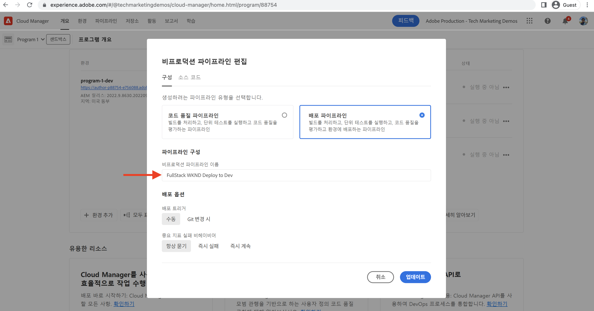
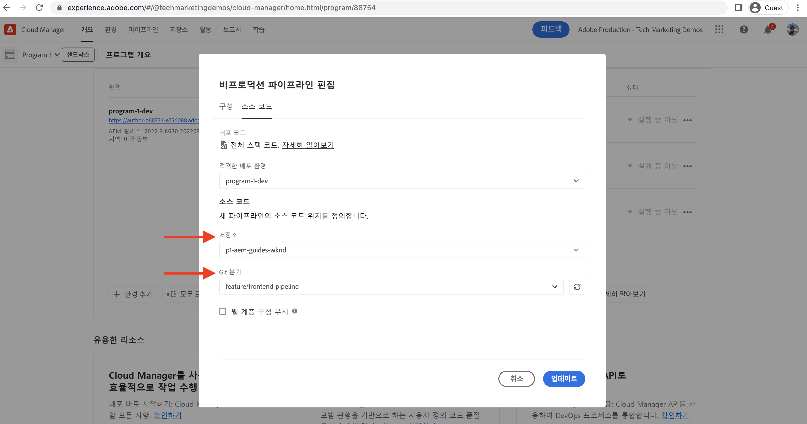
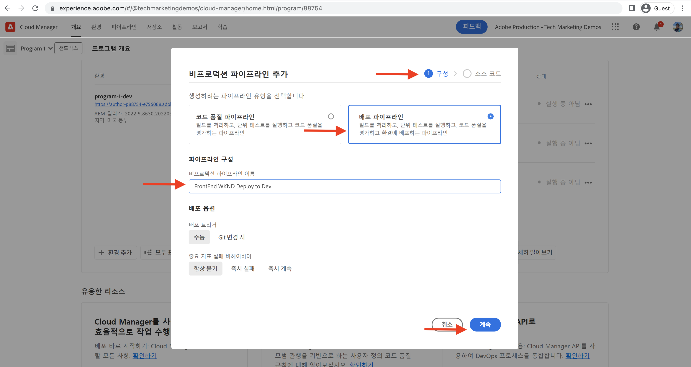
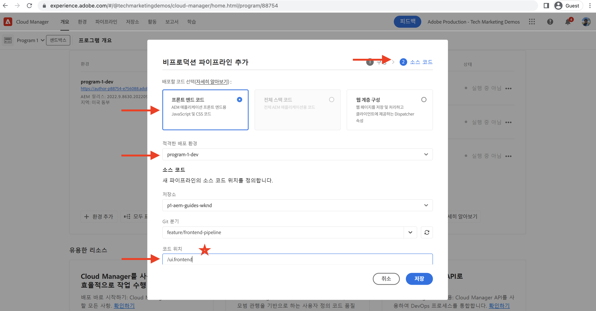
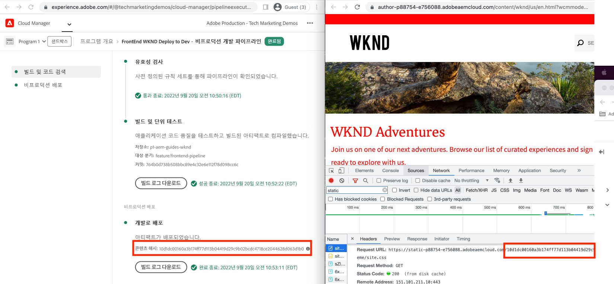

# 프론트엔드 파이프라인을 사용하여 배포

이 장에서는 Adobe Cloud Manager에서 프론트엔드 파이프라인을 만들고 실행합니다. `ui.frontend` 모듈에서만 파일을 빌드하고 AEM as a Cloud Service의 기본 제공 CDN에 배포합니다. 따라서 `/etc.clientlibs` 기반 프론트엔드 리소스 배달에서 벗어납니다.

## 목표 {#objectives}

* 프론트엔드 파이프라인을 만들고 실행합니다.
* 프론트엔드 리소스가 `/etc.clientlibs`에서 배달되지 않고 `https://static-`(으)로 시작하는 새 호스트 이름에서 배달되는지 확인하십시오.

## 프론트엔드 파이프라인 사용

>[!VIDEO](https://video.tv.adobe.com/v/3409420?quality=12&learn=on)

## 사전 요구 사항 {#prerequisites}

여러 부분으로 구성된 자습서이며 [표준 AEM 프로젝트 업데이트](./update-project.md)에 설명된 단계가 완료된 것으로 간주됩니다.

Cloud Manager에서 파이프라인을 만들고 배포할 수 있는 [권한](https://experienceleague.adobe.com/docs/experience-manager-cloud-manager/content/requirements/users-and-roles.html?lang=ko#role-definitions)과(와) AEM as a Cloud Service 환경에 대한 [액세스](https://experienceleague.adobe.com/docs/experience-manager-cloud-service/content/implementing/using-cloud-manager/manage-environments.html?lang=ko)이 있는지 확인하십시오.

## 기존 파이프라인 이름 바꾸기

__구성__ 탭의 __비프로덕션 파이프라인 이름__ 필드로 이동하여 기존 파이프라인의 이름을 __Deploy to Dev__&#x200B;에서 __FullStack WKND Deploy to Dev__(으)로 변경합니다. 이는 파이프라인의 이름만 보고 파이프라인이 전체 스택인지 프론트엔드인지를 명시적으로 하기 위한 것입니다.

__Source 코드__ 탭에서도 저장소 및 Git 분기 필드 값이 올바른지, 분기에 프론트엔드 파이프라인 계약 변경 사항이 있는지 확인하십시오.

## 프론트엔드 파이프라인 만들기

__모듈에서 프론트엔드 리소스를__ ONLY`ui.frontend`만 빌드하고 배포하려면 다음 단계를 수행하십시오.

1. Cloud Manager UI의 __파이프라인__ 섹션에서 __추가__ 버튼을 클릭한 다음 배포하려는 AEM as a Cloud Service 환경을 기반으로 __비프로덕션 파이프라인 추가__(또는 __프로덕션 파이프라인 추가__)를 선택합니다.

1. __비프로덕션 파이프라인 추가__ 대화 상자에서 __구성__ 단계의 일부로 __배포 파이프라인__ 옵션을 선택하고 이름을 __FrontEnd WKND를 Dev로 배포__&#x200B;로 지정한 다음 __계속__&#x200B;을 클릭합니다

1. __Source 코드__ 단계의 일부로 __프론트엔드 코드__ 옵션을 선택하고 __적합한 배포 환경__&#x200B;에서 환경을 선택하십시오. __Source 코드__ 섹션에서 저장소 및 Git 분기 필드 값이 올바른지 그리고 분기에 프론트엔드 파이프라인 계약 변경 사항이 있는지 확인합니다.
__코드 위치__ 필드의 __가장 중요한__ 값은 `/ui.frontend`이고 마지막으로 __저장__&#x200B;을 클릭합니다.

## 배포 시퀀스

* 먼저 새로 이름이 변경된 __FullStack WKND Deploy to Dev__ 파이프라인을 실행하여 AEM 저장소에서 WKND clientlib 파일을 제거합니다. 가장 중요한 것은 __Sling 구성__ 파일(`SiteConfig`, `HtmlPageItemsConfig`)을 추가하여 AEM에서 프론트엔드 파이프라인 계약을 준비하도록 하는 것입니다.

>[!WARNING]
>
>__FullStack WKND를 Dev에 배포__ 파이프라인이 완료되면 __스타일이 지정되지 않음__ WKND 사이트가 발생하고 손상되었을 수 있습니다. 가동 중단을 계획하거나 홀수 시간 동안 배포하십시오. 이는 단일 전체 스택 파이프라인을 사용하는 것에서부터 프론트엔드 파이프라인으로 초기 전환 중에 계획해야 하는 1회적인 중단입니다.

* 마지막으로 __FrontEnd WKND Deploy to Dev__ 파이프라인을 실행하여 `ui.frontend` 모듈만 빌드하고 프론트엔드 리소스를 CDN에 직접 배포합니다.

>[!IMPORTANT]
>
>__스타일이 지정되지 않음__ WKND 사이트가 정상적으로 복구되었으며 현재 __FrontEnd__ 파이프라인 실행이 전체 스택 파이프라인보다 훨씬 빠릅니다.

## 스타일 변경 사항 및 새로운 게재 패러다임 확인

* WKND 사이트의 페이지를 열면 텍스트 색상 us __Adobe Red__&#x200B;을(를) 볼 수 있고 CDN에서 프론트엔드 리소스(CSS, JS) 파일이 전달됩니다. 리소스 요청 호스트 이름이 `https://static-pXX-eYY.p123-e456.adobeaemcloud.com/$HASH_VALUE$/theme/site.css`(으)로 시작하며 마찬가지로 `HtmlPageItemsConfig` 파일에서 참조한 site.js 또는 기타 정적 리소스도 시작합니다.

>[!TIP]
>
>여기에서 `$HASH_VALUE$`은(는) __FrontEnd WKND를 Dev__ 파이프라인의 __CONTENT HASH__ 필드에 표시되는 것과 동일합니다. AEM은 프론트엔드 리소스의 CDN URL에 대한 알림을 받습니다. 값은 `/conf/wknd/sling:configs/com.adobe.cq.wcm.core.components.config.HtmlPageItemsConfig/jcr:content`prefixPath __속성 아래__&#x200B;에 저장됩니다.

## 축하합니다! {#congratulations}

축하합니다. WKND Sites 프로젝트의 &#39;ui.frontend&#39; 모듈만 빌드하고 배포하는 프론트엔드 파이프라인을 만들고 실행하고 확인했습니다. 이제 프론트엔드 팀은 전체 AEM 프로젝트의 수명 주기를 벗어나 사이트의 디자인 및 프론트엔드 동작을 빠르게 반복할 수 있습니다.

## 다음 단계 {#next-steps}

다음 장 [고려 사항](considerations.md)에서는 프론트엔드 및 백엔드 개발 프로세스에 미치는 영향을 검토합니다.
