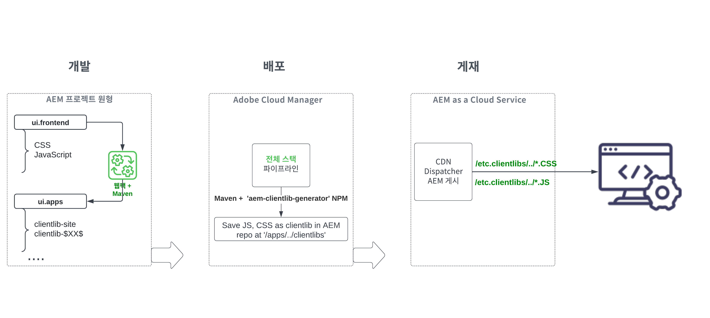

# 풀스택 AEM 프로젝트의 &#39;ui.frontend&#39; 모듈 검토 {#aem-full-stack-ui-frontent}

이 챕터에서는 __WKND Sites 프로젝트__&#x200B;의 &#39;ui.frontend&#39; 모듈을 중심으로 풀스택 AEM 프로젝트 프론트엔드 아티팩트의 개발, 배포 및 게재를 검토합니다.


## 목표 {#objective}

* AEM 풀스택 프로젝트에서 프론트엔드 아티팩트의 빌드 및 배포 흐름을 이해합니다.
* AEM 풀스택 프로젝트 `ui.frontend` 모듈의 [Webpack](https://webpack.js.org/) 구성 검토
* AEM 클라이언트 라이브러리(clientlibs라고도 함) 생성 프로세스

## AEM 풀스택 및 빠른 사이트 생성 프로젝트를 위한 프론트엔드 배포 흐름

>[!IMPORTANT]
>
>이 비디오는 프론트엔드 리소스 빌드, 배포 및 게재 모델의 미묘한 차이를 간략하게 설명하는 **풀스택 및 빠른 사이트 생성** 프로젝트에 대한 프론트엔드 흐름을 설명 및 제시합니다.

>[!VIDEO](https://video.tv.adobe.com/v/3409344?quality=12&learn=on)

## 사전 요구 사항 {#prerequisites}


* [AEM WKND Sites 프로젝트](https://github.com/adobe/aem-guides-wknd) 복제
* 복제된 AEM WKND Sites 프로젝트를 빌드하여 AEM as a Cloud Service에 배포한 상태입니다.

자세한 내용은 AEM WKND Sites 프로젝트 [README.md](https://github.com/adobe/aem-guides-wknd/blob/main/README.md)를 참조하십시오.

## AEM 풀스택 프로젝트 프론트엔드 아티팩트 흐름 {#flow-of-frontend-artifacts}

아래는 풀스택 AEM 프로젝트의 프론트엔드 아티팩트 __개발, 배포 및 게재__ 흐름을 개략적으로 표현한 것입니다.




개발 단계의 경우 스타일 지정, 리브랜딩과 같은 프론트엔드 변경은 `ui.frontend/src/main/webpack` 폴더의 CSS, JS 파일을 업데이트하여 수행됩니다. 그다음 빌드 단계에서는 [Webpack](https://webpack.js.org/) 모듈 번들러와 Maven 플러그인이 이러한 파일을 `ui.apps` 모듈에서 최적화된 AEM clientlibs로 변환합니다.

Cloud Manager에서 [__풀스택__ 파이프라인을 실행하는 경우 프론트엔드 변경 사항은 AEM as a Cloud Service 환경에 배포됩니다](https://experienceleague.adobe.com/docs/experience-manager-cloud-service/content/implementing/using-cloud-manager/cicd-pipelines/introduction-ci-cd-pipelines.html?lang=ko).

프론트엔드 리소스는 `/etc.clientlibs/`로 시작하는 URI 경로를 통해 웹 브라우저에 전달되며, 일반적으로 AEM Dispatcher와 CDN에 캐시됩니다.


>[!NOTE]
>
> 마찬가지로 __AEM 빠른 사이트 생성 여정__&#x200B;에서 [프론트엔드 변경 사항](https://experienceleague.adobe.com/docs/experience-manager-cloud-service/content/sites/administering/site-creation/quick-site/customize-theme.html?lang=ko)은 __프론트엔드__ 파이프라인을 실행함으로써 AEM as a Cloud Service 환경에 배포됩니다. 관련 내용은 [파이프라인 설정](https://experienceleague.adobe.com/docs/experience-manager-cloud-service/content/sites/administering/site-creation/quick-site/pipeline-setup.html?lang=ko)을 참조하시기 바랍니다.

### WKND Sites 프로젝트에서 Webpack 구성 검토 {#development-frontend-webpack-clientlib}

* WKND Sites 프론트엔드 리소스를 번들 처리하는 데 사용되는 세 개의 __Webpack__ 구성 파일이 있습니다.

   1. `webpack.common` - 여기에는 WKND 리소스 번들링 및 최적화를 지시하는 __공통__ 구성이 포함되어 있습니다. __출력__ 속성은 통합된 파일(JavaScript 번들이라고도 하지만 AEM OSGi 번들과 혼동하지 않도록 주의)을 생성할 위치를 알려 줍니다. 기본 이름은 `clientlib-site/js/[name].bundle.js`로 설정됩니다.

  ```javascript
      ...
      output: {
              filename: 'clientlib-site/js/[name].bundle.js',
              path: path.resolve(__dirname, 'dist')
          }
      ...    
  ```

   1. `webpack.dev.js`는 webpack-dev-serve 및 사용할 HTML 템플릿에 대한 포인트를 위한 __개발__ 구성을 포함합니다. 또한 `localhost:4502`에서 실행 중인 AEM 인스턴스에 대한 프록시 구성을 포함합니다.

  ```javascript
      ...
      devServer: {
          proxy: [{
              context: ['/content', '/etc.clientlibs', '/libs'],
              target: 'http://localhost:4502',
          }],
      ...    
  ```

   1. `webpack.prod.js`는 __프로덕션__ 구성을 포함하며 플러그인을 사용하여 개발 파일을 최적화된 번들로 변환합니다.

  ```javascript
      ...
      module.exports = merge(common, {
          mode: 'production',
          optimization: {
              minimize: true,
              minimizer: [
                  new TerserPlugin(),
                  new CssMinimizerPlugin({ ...})
          }
      ...    
  ```


* 번들 처리된 리소스는 [aem-clientlib-generator](https://www.npmjs.com/package/aem-clientlib-generator) 플러그인을 사용하여 `ui.apps` 모듈로 이동되고, `clientlib.config.js` 파일에서 관리되는 구성을 사용합니다.

```javascript
    ...
    const BUILD_DIR = path.join(__dirname, 'dist');
    const CLIENTLIB_DIR = path.join(
    __dirname,
    '..',
    'ui.apps',
    'src',
    'main',
    'content',
    'jcr_root',
    'apps',
    'wknd',
    'clientlibs'
    );
    ...
```

* `ui.frontend/pom.xml`의 __frontend-maven-plugin__&#x200B;은 AEM 프로젝트 빌드 중에 Webpack 번들링 및 clientlib 생성을 조율합니다.

`$ mvn clean install -PautoInstallSinglePackage`

### AEM as a Cloud Service에 배포 {#deployment-frontend-aemaacs}

[__풀스택__ 파이프라인](https://experienceleague.adobe.com/docs/experience-manager-cloud-service/content/implementing/using-cloud-manager/cicd-pipelines/introduction-ci-cd-pipelines.html?lang=ko&#full-stack-pipeline)은 이러한 변경 사항을 클라우드 AEM as a Cloud Service 환경에 배포합니다.


### AEM as a Cloud Service에서 게재 {#delivery-frontend-aemaacs}

풀스택 파이프라인을 통해 배포된 프론트엔드 리소스는 AEM 사이트에서 웹 브라우저로 `/etc.clientlibs` 파일로 제공됩니다. [공개적으로 호스팅되는 WKND 사이트](https://wknd.site/content/wknd/us/en.html)를 방문하여 웹 페이지 소스를 보면 이를 확인할 수 있습니다.

```html
    ....
    <link rel="stylesheet" href="/etc.clientlibs/wknd/clientlibs/clientlib-site.lc-181cd4102f7f49aa30eea548a7715c31-lc.min.css" type="text/css">

    ...

    <script async src="/etc.clientlibs/wknd/clientlibs/clientlib-site.lc-d4e7c03fe5c6a405a23b3ca1cc3dcd3d-lc.min.js"></script>
    ....
```

## 축하합니다! {#congratulations}

축하합니다. 풀스택 프로젝트의 ui.frontend 모듈을 검토했습니다.

## 다음 단계 {#next-steps}

다음 챕터에서는 [프론트엔드 파이프라인을 사용하도록 프로젝트를 업데이트](update-project.md)하고 AEM WKND Sites 프로젝트를 업데이트하여 프론트엔드 파이프라인 계약에 대해 활성화합니다.
