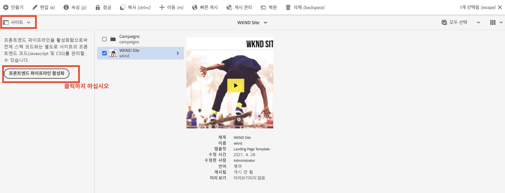

# 프론트엔드 파이프라인을 사용하도록 풀스택 AEM 프로젝트 업데이트 {#update-project-enable-frontend-pipeline}

이 챕터에서는 __WKND Sites 프로젝트__&#x200B;의 구성 변경을 통해 풀스택 파이프라인 실행을 요구하지 않고도 프론트엔드 파이프라인을 사용하여 JavaScript와 CSS를 배포합니다. 이렇게 하면 프론트엔드 및 백엔드 아티팩트의 개발 및 배포 라이프사이클이 분리되어 전반적으로 더 빠르고 반복적인 개발 프로세스가 가능해집니다.

## 목표 {#objectives}

* 프론트엔드 파이프라인을 사용하도록 풀스택 프로젝트 업데이트

## 풀스택 AEM 프로젝트의 구성 변경 개요

>[!VIDEO](https://video.tv.adobe.com/v/3409419?quality=12&learn=on)

## 사전 요구 사항 {#prerequisites}

이 튜토리얼은 여러 부분으로 구성되어 있으며, 학습자가 이미 [&#39;ui.frontend&#39; 모듈](./review-uifrontend-module.md)을 검토했다고 가정합니다.


## 풀스택 AEM 프로젝트 변경 사항

테스트 실행을 위해 배포하기 위한 프로젝트 관련 구성 변경 사항이 3개 있고, 스타일 변경 사항이 1개 있으므로 프론트엔드 파이프라인 계약을 활성화하기 위한 WKND 프로젝트에서 총 4개의 특정 변경 사항이 존재합니다.

1. `ui.frontend`를 풀스택 빌드 사이클의 모듈에서 제거

   * WKND Sites 프로젝트 루트 `pom.xml`에서 `<module>ui.frontend</module>` 하위 모듈 항목을 주석으로 처리합니다.

   ```xml
       ...
       <modules>
       <module>all</module>
       <module>core</module>
       <!--
       <module>ui.frontend</module>
       -->                
       <module>ui.apps</module>
       ...
   ```

   * 그리고 `ui.apps/pom.xml`에서 관련 종속성을 주석 처리합니다.

   ```xml
       ...
       <!-- ====================================================================== -->
       <!-- D E P E N D E N C I E S                                                -->
       <!-- ====================================================================== -->
           ...
       <!--
           <dependency>
               <groupId>com.adobe.aem.guides</groupId>
               <artifactId>aem-guides-wknd.ui.frontend</artifactId>
               <version>${project.version}</version>
               <type>zip</type>
           </dependency>
       -->    
       ...
   ```

1. 두 개의 새로운 Webpack 구성 파일을 추가하여 프론트엔드 파이프라인 계약을 위한 `ui.frontend` 모듈을 준비합니다.

   * 기존의 `webpack.common.js`를 `webpack.theme.common.js`로 복사하고 `output` 속성 및 `MiniCssExtractPlugin`, `CopyWebpackPlugin` 플러그인 구성 매개변수를 아래와 같이 변경합니다.

   ```javascript
   ...
   output: {
           filename: 'theme/js/[name].js', 
           path: path.resolve(__dirname, 'dist')
       }
   ...
   
   ...
       new MiniCssExtractPlugin({
               filename: 'theme/[name].css'
           }),
       new CopyWebpackPlugin({
           patterns: [
               { from: path.resolve(__dirname, SOURCE_ROOT + '/resources'), to: './theme' }
           ]
       })
   ...
   ```

   * 기존의 `webpack.prod.js`를 `webpack.theme.prod.js`로 복사하고 위 파일에 대한 `common` 변수의 위치를 다음과 같이 변경합니다.

   ```javascript
   ...
       const common = require('./webpack.theme.common.js');
   ...
   ```

   >[!NOTE]
   >
   >위의 두 가지 &#39;webpack&#39; 구성 변경 사항이 서로 다른 출력 파일 및 폴더 이름을 가지므로 clientlib(풀스택)과 테마에서 생성된 (프론트엔드) 파이프라인 프론트엔드 아티팩트를 쉽게 구별할 수 있습니다.
   >
   >예상하셨다시피 위의 변경 사항은 기존 Webpack 구성을 사용하기 위해 건너뛸 수 있지만 아래 변경 사항은 반드시 필요합니다.
   >
   >부여할 이름과 구성 방식은 자율입니다.


   * `package.json` 파일에서 `name` 속성 값이 `/conf` 노드의 사이트 이름과 동일한지 확인합니다. `scripts` 속성에서 `build` 스크립트는 이 모듈의 프론트엔드 파일을 빌드하는 방법을 지시합니다.

   ```javascript
       {
       "name": "wknd",
       "version": "1.0.0",
       ...
   
       "scripts": {
           "build": "webpack --config ./webpack.theme.prod.js"
       }
   
       ...
       }
   ```

1. 두 개의 Sling 구성을 추가함으로써 프론트엔드 파이프라인을 위한 `ui.content` 모듈을 준비합니다.

   * `com.adobe.cq.wcm.core.components.config.HtmlPageItemsConfig`에서 파일 생성 - 여기에는 `ui.frontend` 모듈이 Webpack 빌드 프로세스를 사용하여 `dist` 폴더 아래에서 생성하는 모든 프론트엔드 파일이 포함됩니다.

   ```xml
   ...
       <css
       jcr:primaryType="nt:unstructured"
       element="link"
       location="header">
       <attributes
           jcr:primaryType="nt:unstructured">
           <as
               jcr:primaryType="nt:unstructured"
               name="as"
               value="style"/>
           <href
               jcr:primaryType="nt:unstructured"
               name="href"
               value="/theme/site.css"/>
   ...
   ```

   >[!TIP]
   >
   >    __AEM WKND Sites 프로젝트__&#x200B;에서 전체 [HtmlPageItemsConfig](https://github.com/adobe/aem-guides-wknd/blob/feature/frontend-pipeline/ui.content/src/main/content/jcr_root/conf/wknd/_sling_configs/com.adobe.cq.wcm.core.components.config.HtmlPageItemsConfig/.content.xml)를 확인합니다.


   * 두 번째로 `com.adobe.aem.wcm.site.manager.config.SiteConfig`의 `themePackageName` 값이 `package.json` 및 `name` 속성 값과 일치하고 `siteTemplatePath`가 `/libs/wcm/core/site-templates/aem-site-template-stub-2.0.0` 스텁 경로 값을 가리키도록 설정합니다.

   ```xml
   ...
       <?xml version="1.0" encoding="UTF-8"?>
       <jcr:root xmlns:sling="http://sling.apache.org/jcr/sling/1.0" xmlns:jcr="http://www.jcp.org/jcr/1.0" xmlns:nt="http://www.jcp.org/jcr/nt/1.0"
               jcr:primaryType="nt:unstructured"
               siteTemplatePath="/libs/wcm/core/site-templates/aem-site-template-stub-2.0.0"
               themePackageName="wknd">
       </jcr:root>
   ...
   ```

   >[!TIP]
   >
   >    __AEM WKND Sites 프로젝트__&#x200B;에서 전체 [SiteConfig](https://github.com/adobe/aem-guides-wknd/blob/feature/frontend-pipeline/ui.content/src/main/content/jcr_root/conf/wknd/_sling_configs/com.adobe.aem.wcm.site.manager.config.SiteConfig/.content.xml)를 확인합니다.

1. 테스트 실행을 위해 프론트엔드 파이프라인을 통해 배포할 테마나 스타일을 변경할 때 `ui.frontend/src/main/webpack/base/sass/_variables.scss`를 업데이트하여 `text-color`를 Adobe Red(또는 원하는 색상)으로 변경합니다.

   ```css
       $black:     #a40606;
       ...
   ```

마지막으로, 이러한 변경 사항을 프로그램의 Adobe git 저장소에 푸시합니다.


>[!AVAILABILITY]
>
> 이들 변경 사항은 __AEM WKND Sites 프로젝트__&#x200B;의 [__프론트엔드 파이프라인__](https://github.com/adobe/aem-guides-wknd/tree/feature/frontend-pipeline) 분기 내 GitHub에서 확인할 수 있습니다.


## 주의 - _프론트엔드 파이프라인 활성화_ 버튼

[레일 선택기](https://experienceleague.adobe.com/docs/experience-manager-cloud-service/content/sites/authoring/getting-started/basic-handling.html)의 [사이트](https://experienceleague.adobe.com/docs/experience-manager-cloud-service/content/sites/authoring/getting-started/basic-handling.html) 옵션은 사이트 루트 또는 사이트 페이지를 선택할 시 **프론트엔드 파이프라인 활성화** 버튼을 표시합니다. **프론트엔드 파이프라인 활성화** 버튼을 클릭하면 위의 **Sling 구성**&#x200B;을 재정의하게 되므로 Cloud Manager 파이프라인 실행을 통해 위의 변경 사항을 배포한 후에는 이 버튼을 **누르지 말아야 합니다**.



실수로 클릭한 경우 프론트엔드 파이프라인 계약 및 변경 사항이 복원되었는지 확인하기 위해 파이프라인을 다시 실행해야 합니다.

## 축하합니다! {#congratulations}

축하합니다. 프론트엔드 파이프라인 계약에 사용할 수 있도록 WKND Sites 프로젝트를 업데이트했습니다.

## 다음 단계 {#next-steps}

다음 챕터에서는 [프론트엔드 파이프라인을 사용하는 배포](create-frontend-pipeline.md)에 대해 알아보면서 프론트엔드 파이프라인을 생성 및 실행하고 &#39;/etc.clientlibs&#39; 기반의 프론트엔드 리소스 게재를 __건너뛰는__ 방법을 확인하겠습니다.
