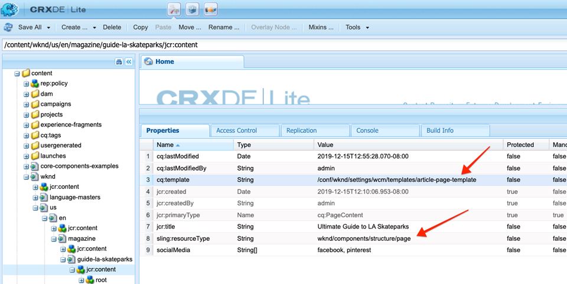
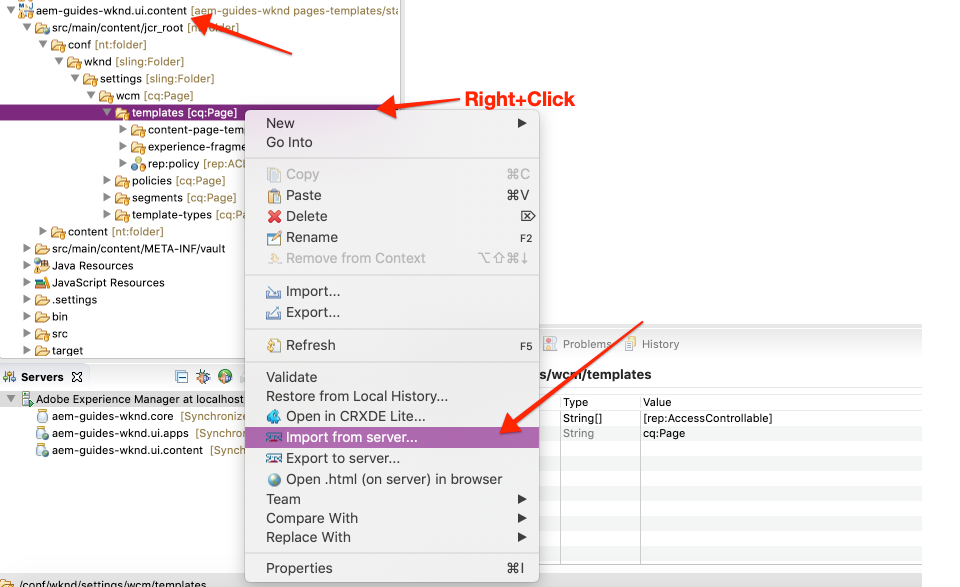
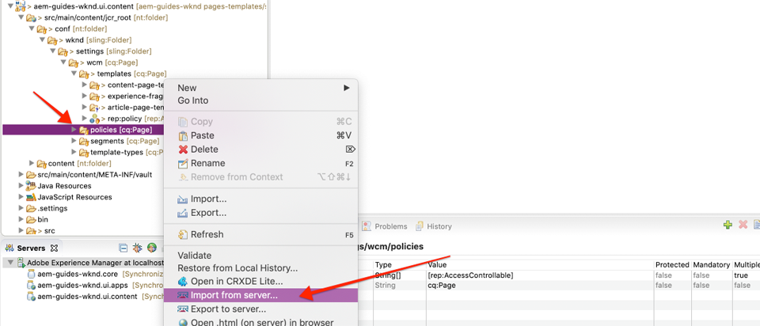

# 페이지 및 템플릿 {#pages-and-template}

이 장에서는 기본 페이지 구성 요소와 편집 가능한 템플릿 간의 관계를 살펴봅니다. AdobeXD의 몇 가지 초안을 기반으로 스타일이 지정되지 않은 아티클 템플릿을 [작성할 예정입니다](https://www.adobe.com/products/xd.html). 템플릿을 작성하는 과정에서 편집 가능한 템플릿의 핵심 구성 요소 및 고급 정책 구성에 대해 다룹니다.

## 전제 조건 {#prerequisites}

필요한 도구 및 [로컬 개발 환경 설정을 위한 지침을 검토하십시오](overview.md#local-dev-environment).

### 스타터 프로젝트

튜토리얼이 빌드하는 기본 라인 코드를 확인합니다.

1. github.com/adobe/aem-guides-wknd [저장소](https://github.com/adobe/aem-guides-wknd) 복제
1. 분기를 `pages-templates/start` 보세요

   ```shell
   $ git clone git@github.com:adobe/aem-guides-wknd.git ~/code/aem-guides-wknd
   $ cd ~/code/aem-guides-wknd
   $ git checkout pages-templates/start
   ```

1. Maven 기술을 사용하여 로컬 AEM 인스턴스에 코드 베이스를 배포할 수 있습니다.

   ```shell
   $ cd ~/code/aem-guides-wknd
   $ mvn clean install -PautoInstallSinglePackage
   ```

항상 [GitHub에서](https://github.com/adobe/aem-guides-wknd/tree/pages-templates/solution) 완료된 코드를 보거나 분기로 전환하여 로컬로 코드를 체크 아웃할 수 `pages-templates/solution`있습니다.

## 목표

1. Inspect에서 만든 페이지 디자인을 만들어 핵심 구성 요소에 매핑합니다.
1. 편집 가능한 템플릿의 세부 사항과 페이지 컨텐츠를 세부적으로 제어하는 데 정책을 사용하는 방법을 이해합니다.
1. 템플릿 및 페이지 연결 방법 살펴보기

## 구축 내용 {#what-you-will-build}

튜토리얼의 이 부분에서 새 아티클 페이지를 만들고 공통 구조에 맞게 정렬할 수 있는 새 아티클 페이지 템플릿을 만듭니다. 아티클 페이지 템플릿은 AdobeXD에서 제작한 디자인 및 UI 키트를 기반으로 합니다. 이 장은 템플릿의 구조나 골격을 구축하는 데에만 초점을 두고 있습니다. 스타일은 구현되지 않지만 템플릿과 페이지가 작동합니다.


## Adobe XD과 UI 계획 {#adobexd}

대부분의 경우 새 웹 사이트에 대한 계획은 목업 및 정적 디자인으로 시작됩니다. [Adobe XD](https://www.adobe.com/products/xd.html) 는 사용자 경험을 구축하기 위한 디자인 툴입니다. 다음으로 아티클 페이지 템플릿의 구조를 계획하는 데 도움이 되는 UI 키트 및 초안을 검사합니다.

>[!VIDEO](https://video.tv.adobe.com/v/30214/?quality=12&learn=on)

WKND [아티클 디자인 파일을 다운로드합니다](https://github.com/adobe/aem-guides-wknd/releases/download/aem-guides-wknd-0.0.2/AEM_UI-kit-WKND-article-design.xd).

## 경험 조각으로 머리글 및 바닥글 만들기 {#experience-fragments}

머리글 또는 바닥글과 같은 글로벌 컨텐츠를 만들 때 일반적으로 [경험 조각을 사용하는 것입니다](https://docs.adobe.com/content/help/en/experience-manager-learn/sites/experience-fragments/experience-fragments-feature-video-use.html). 경험 조각 - 여러 구성 요소를 결합하여 하나의 참조 가능한 구성 요소를 만들 수 있습니다. 경험 조각은 다중 사이트 관리 지원을 활용할 수 있으며 로케일당 다양한 머리글/바닥글을 관리할 수 있습니다.

그런 다음 WKND 로고를 추가하기 위해 머리글 및 바닥글로 사용할 경험 조각을 업데이트합니다.

>[!VIDEO](https://video.tv.adobe.com/v/30215/?quality=12&learn=on)

>[!NOTE]
>
> 경험 조각은 비디오와 다르게 보입니까? 이를 삭제하고 시작 프로젝트 코드 베이스를 다시 설치해 보십시오.

아래는 위 비디오에서 수행되는 높은 수준의 단계입니다.

1. WKND Dark 로고를 포함하도록 http://localhost:4502/editor.html/content/experience-fragments/wknd/us/en/site/header/master.html [에](http://localhost:4502/editor.html/content/experience-fragments/wknd/us/en/site/header/master.html) 있는 경험 조각 헤더를 업데이트합니다.

   

   *WKND Dark 로고*

1. WKND Light 로고를 포함하도록 http://localhost:4502/editor.html/content/experience-fragments/wknd/us/en/site/footer/master.html [에](http://localhost:4502/editor.html/content/experience-fragments/wknd/us/en/site/footer/master.html) 있는 경험 조각 헤더를 업데이트합니다.

   

   *WKND Light 로고*

## 아티클 페이지 템플릿 만들기

페이지를 생성할 때 새 페이지를 만드는 기준으로 사용할 템플릿을 선택해야 합니다. 템플릿은 결과 페이지, 초기 컨텐츠 및 허용된 구성 요소의 구조를 정의합니다.

편집 가능한 템플릿의 세 가지 주요 [영역이 있습니다](https://docs.adobe.com/content/help/en/experience-manager-65/developing/platform/templates/page-templates-editable.html).

1. **구조** - 템플릿의 일부인 구성 요소를 정의합니다. 컨텐츠 작성자가 편집할 수 없습니다.
1. **초기 컨텐츠** - 템플릿이 시작할 구성 요소를 정의하며 컨텐츠 작성자가 편집하고 삭제할 수 있습니다.
1. **정책** - 구성 요소의 작동 방식과 작성자가 사용할 수 있는 옵션에 대한 구성을 정의합니다.

다음으로 아티클 페이지 템플릿을 만듭니다. 이것은 AEM의 로컬 인스턴스에서 발생합니다.

>[!VIDEO](https://video.tv.adobe.com/v/30217/?quality=12&learn=on)

아래는 위 비디오에서 수행되는 높은 수준의 단계입니다.

1. WKND 사이트 템플릿 폴더로 이동합니다. **도구** > **일반** **** > **템플릿>WKND 사이트**
1. 아티클 페이지 템플릿 제목의 **WKND 사이트 빈 페이지** 템플릿 유형을 사용하여 **새 템플릿 만들기**
1. 구조 **** 모드에서 다음 요소를 포함하도록 템플릿을 구성합니다.

   * 경험 조각 헤더
   * 이미지
   * 탐색 표시
   * 컨테이너 - 8열 전체 데스크탑, 12열 전체 태블릿, 모바일
   * 컨테이너 - 4열 너비, 12열 너비 태블릿, 모바일
   * 경험 조각 바닥글

   

   *구조 - 아티클 페이지 템플릿*

1. 초기 **컨텐츠** 모드로 전환하고 다음 구성 요소를 시작 컨텐츠로 추가합니다.

   * **기본 컨테이너**
      * 제목 - H1의 기본 크기
      * 제목 - *&quot;작성자 이름별&quot;* (H4 크기)
      * 텍스트 - 비어 있음
   * **측면 컨테이너**
      * 제목 - *&quot;이 스토리 공유&quot;* (H5 크기)
      * 소셜 미디어 공유
      * 분리자
      * 다운로드
      * 목록

   

   *초기 컨텐츠 - 아티클 페이지 템플릿*

1. 초기 **페이지 속성을** 업데이트하여 **Facebook** 및 Pinterest에 대해 사용자 공유를 사용할 **수**&#x200B;있습니다.
1. 이미지를 쉽게 식별하기 위해 **아티클 페이지 템플릿의** 속성에 업로드합니다.

   

   *아티클 페이지 템플릿 축소판*

1. WKND 사이트 템플릿 폴더 **에서** 아티클 페이지 템플릿 [을 활성화합니다](http://localhost:4502/libs/wcm/core/content/sites/templates.html/conf/wknd/settings/wcm/templates).

## 아티클 페이지 만들기

이제 템플릿이 있으므로 해당 템플릿을 사용하여 새 페이지를 만듭니다.

1. 다음 zip 패키지 WKND- [PagesTemplates-DAM-Assets.zip을](assets/pages-templates/WKND-PagesTemplates-DAM-Assets.zip) 다운로드하여 CRX 패키지 관리자를 통해 [설치합니다](http://localhost:4502/crx/packmgr/index.jsp).

   위의 패키지는 나중 단계에서 아티클 페이지를 채우는 데 사용할 아래 `/content/dam/wknd/en/magazine/la-skateparks` 에 몇 개의 이미지와 에셋을 설치합니다.

   *위 패키지에 있는 이미지와 자산은 Unsplash.com의 무료[사용권이 적용됩니다](https://unsplash.com/).*

   

1. WKND > 미국 ******>** 미국 ********&#x200B;및MagazineBenth 아래에 새페이지를 만듭니다. 컨텐츠 **페이지 템플릿을** 사용합니다.

   이 페이지는 사이트에 일부 구조를 추가하고 탐색 표시 구성 요소를 볼 수 있도록 해줍니다.

1. 그런 다음 WKND > **미국** **** > **미국****>** en>Magazine아래에 새 페이지를만듭니다. 아티클 페이지 **템플릿을** 사용합니다. LA Skatepark에 대한 **Ultimate 가이드의** 제목과 **guide-la-skatepark의 이름을 사용하십시오**.

   

1. UI Planning에서 검사한 목업을 Adobe XD 부분과 일치하도록 [컨텐츠를 사용하여 페이지를](#adobexd) 채웁니다. 샘플 아티클 텍스트는 여기에서 [다운로드할 수 있습니다](assets/pages-templates/la-skateparks-copy.txt). 다음과 유사한 것을 만들 수 있습니다.

   

   >[!NOTE]
   >
   > 페이지 상단에 있는 이미지 구성 요소는 편집할 수 있지만 제거할 수는 없습니다. 탐색 표시 구성 요소는 페이지에 나타나지만 편집하거나 제거할 수 없습니다.

## Inspect 노드 구조 {#node-structure}

이 시점에서 기사 페이지는 분명히 스타일이 없습니다. 하지만 기본 구조가 제자리에 있습니다. 다음으로 컨텐츠 렌더링에 책임이 있는 템플릿 및 페이지 구성 요소의 역할을 더 잘 이해할 수 있도록 아티클 페이지의 노드 구조를 살펴봅니다.

로컬 AEM 인스턴스의 CRXDE-Lite 도구를 사용하여 이렇게 할 수 있습니다.

1. CRXDE [-Lite를](http://localhost:4502/crx/de/index.jsp#/content/wknd/us/en/magazine/guide-la-skateparks/jcr%3Acontent) 열고 트리 탐색으로 `/content/wknd/us/en/magazine/guide-la-skateparks`이동합니다.

1. 페이지 아래 `jcr:content` 의 노드를 `la-skateparks` 클릭하고 속성을 봅니다.

   

   앞서 만든 아티클 페이지 템플릿 `cq:template`을 가리키는 값 `/conf/wknd/settings/wcm/templates/article-page`을 확인합니다.

   또한, 를 가리키는 값 `sling:resourceType`을 확인할 수 `wknd/components/structure/page`있습니다. AEM 프로젝트 원형에서 만든 페이지 구성 요소이며 템플릿을 기반으로 페이지를 렌더링합니다.

1. 아래 `jcr:content` 노드를 확장하고 노드 계층 `/content/wknd/us/en/magazine/guide-la-skateparks/jcr:content` 을 봅니다.

   

   각 노드를 저작한 구성 요소에 느슨하게 매핑할 수 있어야 합니다. 접두사가 있는 노드를 검사하여 사용되는 다양한 레이아웃 컨테이너를 식별할 수 있는지 확인하십시오 `responsivegrid`.

1. 다음으로 페이지 구성 요소를 검사합니다(위치) `/apps/wknd/components/structure/page`. CRXDE Lite에서 구성 요소 속성 보기:

   

   페이지 구성 요소는 **structure라는 폴더 아래에 있습니다**. 이것은 템플릿 편집기 구조 모드에 해당하는 규칙이며, 페이지 구성 요소가 작성자가 직접 상호 작용할 것이 아님을 나타내기 위해 사용됩니다.

   페이지 구성 요소 아래에는 2개의 HTL 스크립트만 `customfooterlibs.html` 있습니다 `customheaderlibs.html` . 그러면 이 구성 요소가 페이지를 어떻게 렌더링합니까?

   속성 `sling:resourceSuperType` 과 값을 확인합니다 `core/wcm/components/page/v2/page`. 이 속성을 사용하면 WKND의 페이지 구성 요소가 핵심 구성 요소 페이지 구성 요소의 모든 기능을 상속받을 수 있습니다. 이것은 [프록시 구성 요소 패턴이라고 하는 것의 첫 번째 예입니다](https://docs.adobe.com/content/help/en/experience-manager-core-components/using/developing/guidelines.html#ProxyComponentPattern). 자세한 내용은 [여기를 참조하십시오.](https://docs.adobe.com/content/help/en/experience-manager-core-components/using/developing/guidelines.html).

1. Inspect WKND 구성 요소 내의 다른 구성 요소, `Breadcrumb` 구성 요소는 `/apps/wknd/components/content/breadcrumb`. 동일한 `sling:resourceSuperType` 속성을 찾을 수 있지만 이 경우 해당 속성이 가리키는 것을 알 수 있습니다 `core/wcm/components/breadcrumb/v2/breadcrumb`. 이것은 프록시 구성 요소 패턴을 사용하여 핵심 구성 요소를 포함하는 또 다른 예입니다. 실제로 WKND 코드 베이스의 모든 구성 요소는 AEM 코어 구성 요소의 프록시입니다(유명한 HelloWorld 구성 요소 제외). 사용자 지정 코드를 쓰기 *전에* 가능한 한 핵심 구성 요소의 기능을 최대한 재사용하는 것이 좋습니다.

1. 다음으로 CRXDE Lite을 사용하여 핵심 구성 요소 페이지를 `/apps/core/wcm/components/page/v2/page` 검사합니다.

   

   이 페이지 아래에는 더 많은 스크립트가 포함되어 있습니다. 핵심 구성 요소 페이지에는 많은 기능이 포함되어 있습니다. 이 기능은 유지 관리와 가독성을 용이하게 하기 위해 여러 스크립트로 분할됩니다. HTL 스크립트를 열고 다음을 검색하여 포함 `page.html` 을 추적할 수 `data-sly-include`있습니다.

   ```html
   <!--/* /apps/core/wcm/components/page/v2/page/page.html */-->
   <!DOCTYPE HTML>
   <html data-sly-use.page="com.adobe.cq.wcm.core.components.models.Page" lang="${page.language}"
           data-sly-use.head="head.html"
           data-sly-use.footer="footer.html"
           data-sly-use.redirect="redirect.html">
       <head data-sly-call="${head.head @ page = page}"></head>
       <body class="${page.cssClassNames}">
           <sly data-sly-test.isRedirectPage="${page.redirectTarget && (wcmmode.edit || wcmmode.preview)}"
               data-sly-call="${redirect.redirect @ redirectTarget = page.redirectTarget}"></sly>
           <sly data-sly-test="${!isRedirectPage}">
               <sly data-sly-include="body.socialmedia_begin.html"></sly>
               <sly data-sly-include="body.html"></sly>
               <sly data-sly-call="${footer.footer @ page = page}"></sly>
               <sly data-sly-include="body.socialmedia_end.html"></sly>
           </sly>
       </body>
   </html>
   ```

   HTL을 여러 스크립트로 분할하는 또 다른 이유는 프록시 구성 요소가 개별 스크립트를 재정의하여 사용자 지정 비즈니스 로직을 구현할 수 있도록 허용하기 때문입니다. HTL 스크립트 `customfooterlibs.html` 와 `customheaderlibs.html`는 프로젝트를 구현하여 무시할 수 있는 명시적 목적으로 제작됩니다.

   이 아티클을 읽고 편집 가능한 템플릿이 [컨텐츠 페이지 렌더링에 어떻게 영향을 주는지 자세히 알아볼 수 있습니다](https://docs.adobe.com/content/help/en/experience-manager-65/developing/platform/templates/page-templates-editable.html#resultant-content-pages).

1. 다른 핵심 구성 요소의 Inspect(탐색 표시)입니다 `/apps/core/wcm/components/breadcrumb/v2/breadcrumb`. Breadcrumb 구성 요소의 마크업이 최종적으로 어떻게 생성되는지 확인하려면 스크립트를 `breadcrumb.html` 보십시오.

## 소스 제어에 구성 저장 {#configuration-persistence}

대부분의 경우, 특히 AEM 프로젝트를 시작할 때는 템플릿 및 관련 컨텐츠 정책과 같은 구성을 소스 제어에 유지하는 것이 중요합니다. 따라서 모든 개발자는 동일한 컨텐츠 및 구성 세트에 대해 작업할 수 있고 환경 간에 추가적인 일관성을 유지할 수 있습니다. 프로젝트가 특정 성숙도에 도달하면 템플릿 관리 방식을 고급 사용자 그룹으로 전환할 수 있습니다.

이제 템플릿을 다른 코드 조각으로 취급하고 **아티클 페이지 템플릿을 프로젝트의 일부로** 동기화합니다. 지금까지 AEM 프로젝트에서 **로컬 AEM 인스턴스로** 코드를 푸시했습니다. 아티클 **페이지 템플릿은** AEM의 로컬 인스턴스에서 직접 생성되었으므로, AEM 프로젝트로 템플릿을 **가져오거나** 끌어와야 합니다. ui.content **** 모듈은 이러한 특정 목적을 위해 AEM 프로젝트에 포함되어 있습니다.

다음 몇 단계는 Eclipse IDE를 사용하여 수행되지만 AEM의 로컬 인스턴스에서 컨텐츠를 **가져오거나 가져오도록** 구성한 모든 IDE를 사용할 수 있습니다.

1. Eclipse IDE에서 AEM의 로컬 인스턴스에 연결된 AEM 개발자 도구 플러그인이 시작된 서버인지, **ui.content** 모듈이 서버 구성에 추가되었는지 확인합니다.

   

1. 프로젝트 탐색기에서 **ui.content** 모듈을 확장합니다. 폴더(작은 `src` 글로벌 아이콘이 있는 폴더)를 확장하고 탐색합니다 `/conf/wknd/settings/wcm/templates`.

1. [!UICONTROL 노드를 마우스 오른쪽] 단추로 클릭하고 `templates` 서버에서 **가져오기...**:

   

   저장소에서 **가져오기 대화 상자를** 확인하고 마침을 **클릭합니다**. 이제 폴더 `article-page-template` 아래 `templates` 가 표시됩니다.

1. 단계를 반복하여 컨텐츠를 가져오지만 다음 위치에 있는 **정책** 노드를 선택합니다 `/conf/wknd/settings/wcm/policies`.

   

1. Inspect에 있는 `filter.xml` 파일 `src/main/content/META-INF/vault/filter.xml`.

   ```xml
   <!--ui.content filter.xml-->
   <?xml version="1.0" encoding="UTF-8"?>
   <workspaceFilter version="1.0">
       <filter root="/conf/wknd" mode="merge"/>
       <filter root="/content/wknd" mode="merge"/>
       <filter root="/content/dam/wknd" mode="merge"/>
       <filter root="/content/experience-fragments/wknd" mode="merge"/>
   </workspaceFilter>
   ```

   이 `filter.xml` 파일은 패키지와 함께 설치할 노드의 경로를 식별합니다. 기존 컨텐츠가 수정되지 않고 새 컨텐츠만 추가된다는 것을 나타내는 각 필터 `mode="merge"` 에 표시됩니다. 컨텐츠 작성자는 이러한 경로를 업데이트하고 있으므로 코드 배포가 컨텐츠를 덮어쓰지 **않는** 것이 중요합니다. 필터 요소 [작업에 대한 자세한 내용은 FileVault 설명서를](https://jackrabbit.apache.org/filevault/filter.html) 참조하십시오.

   각 모듈 `ui.content/src/main/content/META-INF/vault/filter.xml` 에 의해 관리되는 서로 다른 노드를 비교하고 `ui.apps/src/main/content/META-INF/vault/filter.xml` 파악합니다.

   >[!WARNING]
   >
   > WKND 참조 사이트에 대한 일관된 배포를 위해 프로젝트의 일부 분기가 설정되므로 JCR의 변경 사항을 `ui.content` 덮어씁니다. 코드/스타일은 특정 정책에 맞게 작성되므로 솔루션 분기(예: 솔루션 분기)의 디자인입니다.

## 축하합니다! {#congratulations}

축하합니다. 최근에 Adobe Experience Manager Sites과 함께 새로운 템플릿과 페이지를 만들었습니다.

### 다음 단계 {#next-steps}

이 시점에서 기사 페이지는 분명히 스타일이 없습니다. 클라이언트측 라이브러리 및 [프런트 엔드 워크플로우](client-side-libraries.md) 자습서에 따라 CSS 및 Javascript를 포함하여 전역 스타일을 사이트에 적용하고 전용 프런트 엔드 빌드를 통합하는 모범 사례를 알아봅니다.

완성된 코드를 [GitHub에서](https://github.com/adobe/aem-guides-wknd) 보거나 Git brach에서 로컬로 코드를 검토하고 배포합니다 `pages-templates/solution`.

1. github.com/adobe/aem-wknd-guides [저장소](https://github.com/adobe/aem-guides-wknd) 복제
1. 분기를 `pages-templates/solution` 보세요
