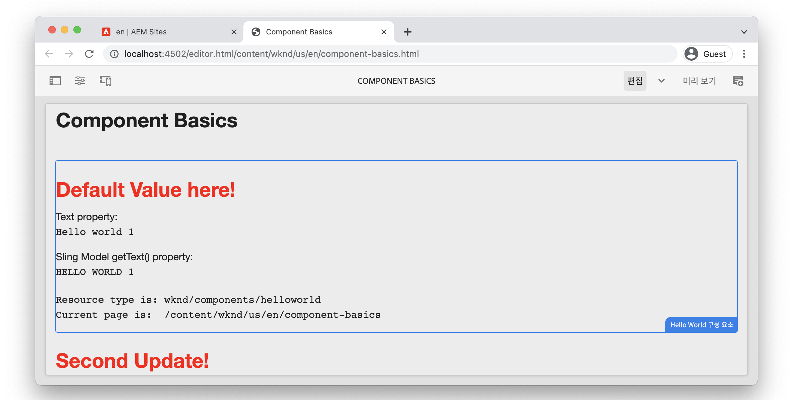

# 구성 요소 기본 사항 {#component-basics}

이 장에서 간단한 방법을 통해 Adobe Experience Manager(AEM) 사이트 구성 요소의 기본 기술을 살펴보겠습니다 `HelloWorld` 예. 작성, HTL, Sling 모델, 클라이언트 측 라이브러리에 대한 주제를 다루는 기존 구성 요소에 대해 약간 수정됩니다.

## 사전 요구 사항 {#prerequisites}

설정에 필요한 도구 및 지침을 검토합니다. [로컬 개발 환경](./overview.md#local-dev-environment).

비디오에 사용되는 IDE는 [Visual Studio 코드](https://code.visualstudio.com/) 그리고 [VSCode AEM 동기화](https://marketplace.visualstudio.com/items?itemName=yamato-ltd.vscode-aem-sync) 플러그인.

## 목표 {#objective}

1. HTML을 동적으로 렌더링하는 HTL 템플릿 및 Sling 모델의 역할을 알아봅니다.
1. 대화 상자를 사용하여 컨텐츠 작성을 용이하게 하는 방법을 이해합니다.
1. 구성 요소를 지원하는 CSS 및 JavaScript를 포함하도록 클라이언트 측 라이브러리의 기본 사항을 알아봅니다.

## 빌드할 내용 {#what-build}

이 장에서는 간단한 `HelloWorld` 구성 요소. 를 업데이트하는 동안 `HelloWorld` 구성 요소에서는 AEM 구성 요소 개발의 주요 영역에 대해 알아봅니다.

## 스타터 프로젝트 {#starter-project}

이 장에서는 [AEM 프로젝트 원형](https://github.com/adobe/aem-project-archetype). 아래 비디오를 시청하고 를 검토합니다. [전제 조건](#prerequisites) 시작하기

>[!NOTE]
>
> 이전 장을 성공적으로 완료한 경우 프로젝트를 다시 사용하고 시작 프로젝트를 체크 아웃하는 단계를 건너뛸 수 있습니다.

>[!VIDEO](https://video.tv.adobe.com/v/330985?quality=12&learn=on)

새 명령줄 터미널을 열고 다음 작업을 수행합니다.

1. 빈 디렉토리에서 [aem-guides-wknd](https://github.com/adobe/aem-guides-wknd) 저장소:

   ```shell
   $ git clone git@github.com:adobe/aem-guides-wknd.git --branch tutorial/component-basics-start --single-branch
   ```

   >[!NOTE]
   >
   > 선택적으로 이전 장에서 생성된 프로젝트를 계속 사용할 수 있습니다. [프로젝트 설정](./project-setup.md).

1. 로 이동합니다.  `aem-guides-wknd` 폴더를 입력합니다.

   ```shell
   $ cd aem-guides-wknd
   ```

1. 다음 명령을 사용하여 프로젝트를 AEM의 로컬 인스턴스에 빌드 및 배포합니다.

   ```shell
   $ mvn clean install -PautoInstallSinglePackage
   ```

   >[!NOTE]
   >
   > AEM 6.5 또는 6.4를 사용하는 경우 `classic` 프로파일을 Maven 명령에 추가합니다.

   ```shell
   $ mvn clean install -PautoInstallSinglePackage -Pclassic
   ```

1. 다음 지침에 따라 프로젝트를 기본 IDE로 가져옵니다. [로컬 개발 환경](overview.md#local-dev-environment).

## 구성 요소 작성 {#component-authoring}

구성 요소는 웹 페이지의 작은 모듈식 빌딩 블록으로 생각할 수 있습니다. 구성 요소를 재사용하려면 구성 요소를 구성해야 합니다. 이 작업은 작성 대화 상자를 통해 수행됩니다. 다음으로 단순 구성 요소를 만들고 대화 상자의 값이 AEM에서 어떻게 지속되는지 검사하겠습니다.

>[!VIDEO](https://video.tv.adobe.com/v/330986?quality=12&learn=on)

다음은 위의 비디오에서 수행되는 높은 수준의 단계입니다.

1. 이름이 인 페이지 만들기 **구성 요소 기본 사항** 아래 **WKND 사이트** `>` **미국** `>` **en**.
1. 추가 **Hello World 구성 요소** 를 클릭합니다.
1. 구성 요소에 대한 대화 상자를 열고 텍스트를 입력합니다. 변경 사항을 저장하여 페이지에 표시되는 메시지를 확인합니다.
1. 개발자 모드로 전환하고 CRXDE-Lite에서 컨텐츠 경로를 보고 구성 요소 인스턴스의 속성을 검사합니다.
1. CRXDE-Lite를 사용하여 `cq:dialog` 및 `helloworld.html` 다음에서 `/apps/wknd/components/content/helloworld`.

## HTL(HTML 템플릿 언어) 및 대화 상자 {#htl-dialogs}

HTML 템플릿 언어 또는 **[HTL](https://experienceleague.adobe.com/docs/experience-manager-htl/content/getting-started.html)** 는 AEM 구성 요소가 컨텐츠를 렌더링하는 데 사용하는 경량 서버 측 템플릿 언어입니다.

**대화 상자** 구성 요소에 사용할 수 있는 구성을 정의합니다.

다음으로 업데이트 `HelloWorld` 텍스트 메시지 앞에 추가 인사말을 표시하는 HTL 스크립트입니다.

>[!VIDEO](https://video.tv.adobe.com/v/330987?quality=12&learn=on)

다음은 위의 비디오에서 수행되는 높은 수준의 단계입니다.

1. IDE로 전환하고 프로젝트를 `ui.apps` 모듈.
1. 를 엽니다. `helloworld.html` 파일 및 HTML 마크업을 업데이트합니다.
1. 다음과 같은 IDE 도구 사용 [VSCode AEM 동기화](https://marketplace.visualstudio.com/items?itemName=yamato-ltd.vscode-aem-sync) 파일 변경 사항을 로컬 AEM 인스턴스와 동기화하려면 다음을 수행하십시오.
1. 브라우저로 돌아가서 구성 요소 렌더링이 변경되었음을 확인합니다.
1. 를 엽니다. `.content.xml` 대화 상자를 정의하는 파일입니다. `HelloWorld` 구성 요소 위치:

   ```plain
   <code>/aem-guides-wknd/ui.apps/src/main/content/jcr_root/apps/wknd/components/helloworld/_cq_dialog/.content.xml
   ```

1. 대화 상자를 업데이트하여 이름이 인 추가 텍스트 필드를 추가합니다 **제목** 의 이름으로 `./title`:

   ```xml
   <?xml version="1.0" encoding="UTF-8"?>
   <jcr:root xmlns:sling="http://sling.apache.org/jcr/sling/1.0" xmlns:cq="http://www.day.com/jcr/cq/1.0" xmlns:jcr="http://www.jcp.org/jcr/1.0" xmlns:nt="http://www.jcp.org/jcr/nt/1.0"
       jcr:primaryType="nt:unstructured"
       jcr:title="Properties"
       sling:resourceType="cq/gui/components/authoring/dialog">
       <content
           jcr:primaryType="nt:unstructured"
           sling:resourceType="granite/ui/components/coral/foundation/fixedcolumns">
           <items jcr:primaryType="nt:unstructured">
               <column
                   jcr:primaryType="nt:unstructured"
                   sling:resourceType="granite/ui/components/coral/foundation/container">
                   <items jcr:primaryType="nt:unstructured">
                       <title
                           jcr:primaryType="nt:unstructured"
                           sling:resourceType="granite/ui/components/coral/foundation/form/textfield"
                           fieldLabel="Title"
                           name="./title"/>
                       <text
                           jcr:primaryType="nt:unstructured"
                           sling:resourceType="granite/ui/components/coral/foundation/form/textfield"
                           fieldLabel="Text"
                           name="./text"/>
                   </items>
               </column>
           </items>
       </content>
   </jcr:root>
   ```

1. 파일 다시 열기 `helloworld.html`: 렌더링을 담당하는 기본 HTL 스크립트를 나타냅니다 `HelloWorld` 아래의 경로에서 구성 요소:

   ```plain
       <code>/aem-guides-wknd.ui.apps/src/main/content/jcr_root/apps/wknd/components/helloworld/helloworld.html
   ```

1. 업데이트 `helloworld.html` 의 값을 렌더링합니다. **인사말** 텍스트 필드를 의 일부로 `H1` 태그:

   ```html
   <div class="cmp-helloworld" data-cmp-is="helloworld">
       <h1 class="cmp-helloworld__title">${properties.title}</h1>
       ...
   </div>
   ```

1. 개발자 플러그인을 사용하거나 Maven 기술을 사용하여 AEM의 로컬 인스턴스에 변경 사항을 배포합니다.

## Sling 모델 {#sling-models}

Sling 모델은 JCR에서 Java™ 변수로 데이터를 쉽게 매핑하는 주석 기반의 Java™ &quot;POJO&quot;(일반 이전 Java™ 개체)입니다. 또한 AEM의 맥락에서 개발할 때 몇 가지 다른 세부 사항을 제공합니다.

다음으로, `HelloWorldModel` Sling 모델 을 사용하면 JCR에 저장된 값에 비즈니스 로직을 적용하여 페이지에 출력할 수 있습니다.

>[!VIDEO](https://video.tv.adobe.com/v/330988?quality=12&learn=on)

1. 파일을 엽니다. `HelloWorldModel.java`: 와 함께 사용되는 Sling 모델 `HelloWorld` 구성 요소.

   ```plain
   <code>/aem-guides-wknd.core/src/main/java/com/adobe/aem/guides/wknd/core/models/HelloWorldModel.java
   ```

1. 다음 가져오기 구문을 추가합니다.

   ```java
   import org.apache.commons.lang3.StringUtils;
   import org.apache.sling.models.annotations.DefaultInjectionStrategy;
   ```

1. 업데이트 `@Model` 사용할 주석 `DefaultInjectionStrategy`:

   ```java
   @Model(adaptables = Resource.class,
      defaultInjectionStrategy = DefaultInjectionStrategy.OPTIONAL)
      public class HelloWorldModel {
      ...
   ```

1. 다음 줄을 `HelloWorldModel` 클래스를 사용하여 구성 요소의 JCR 속성 값을 매핑합니다 `title` 및 `text` Java™ 변수로

   ```java
   ...
   @Model(adaptables = Resource.class,
   defaultInjectionStrategy = DefaultInjectionStrategy.OPTIONAL)
   public class HelloWorldModel {
   
       ...
   
       @ValueMapValue
       private String title;
   
       @ValueMapValue
       private String text;
   
       @PostConstruct
       protected void init() {
           ...
   ```

1. 다음 메서드를 추가합니다 `getTitle()` 변환 후 `HelloWorldModel` 클래스, 이름이 지정된 속성의 값 반환 `title`. 이 메서드는 &quot;Default Value here!&quot;라는 문자열 값을 반환하기 위해 추가 논리를 추가합니다. if 속성 `title` null이거나 비어 있습니다.

   ```java
   /***
   *
   * @return the value of title, if null or blank returns "Default Value here!"
   */
   public String getTitle() {
       return StringUtils.isNotBlank(title) ? title : "Default Value here!";
   }
   ```

1. 다음 메서드를 추가합니다 `getText()` 변환 후 `HelloWorldModel` 클래스, 이름이 지정된 속성의 값 반환 `text`. 이 메서드는 문자열을 모든 대문자로 변환합니다.

   ```java
       /***
       *
       * @return All caps variation of the text value
       */
   public String getText() {
       return StringUtils.isNotBlank(this.text) ? this.text.toUpperCase() : null;
   }
   ```

1. 에서 번들을 빌드하고 배포합니다. `core` 모듈:

   ```shell
   $ cd core
   $ mvn clean install -PautoInstallBundle
   ```

   >[!NOTE]
   >
   > AEM 6.4/6.5의 경우 `mvn clean install -PautoInstallBundle -Pclassic`

1. 파일 업데이트 `helloworld.html` at `aem-guides-wknd.ui.apps/src/main/content/jcr_root/apps/wknd/components/content/helloworld/helloworld.html` 새로 만든 `HelloWorld` 모델:

   ```html
   <div class="cmp-helloworld" data-cmp-is="helloworld"
   data-sly-use.model="com.adobe.aem.guides.wknd.core.models.HelloWorldModel">
       <h1 class="cmp-helloworld__title">${model.title}</h1>
       <div class="cmp-helloworld__item" data-sly-test="${properties.text}">
           <p class="cmp-helloworld__item-label">Text property:</p>
           <pre class="cmp-helloworld__item-output" data-cmp-hook-helloworld="property">${properties.text}</pre>
       </div>
       <div class="cmp-helloworld__item" data-sly-test="${model.text}">
           <p class="cmp-helloworld__item-label">Sling Model getText() property:</p>
           <pre class="cmp-helloworld__item-output" data-cmp-hook-helloworld="property">${model.text}</pre>
       </div>
       <div class="cmp-helloworld__item"  data-sly-test="${model.message}">
           <p class="cmp-helloworld__item-label">Model message:</p>
           <pre class="cmp-helloworld__item-output"data-cmp-hook-helloworld="model">${model.message}</pre>
       </div>
   </div>
   ```

1. Eclipse 개발자 플러그인을 사용하거나 Maven 기술을 사용하여 AEM의 로컬 인스턴스에 변경 사항을 배포합니다.

## 클라이언트측 라이브러리 {#client-side-libraries}

클라이언트 측 라이브러리, `clientlibs` 짧게 설명하면 AEM Sites 구현에 필요한 CSS 및 JavaScript 파일을 구성하고 관리하는 메커니즘을 제공합니다. 클라이언트측 라이브러리는 AEM의 페이지에 CSS 및 JavaScript를 포함하는 표준 방법입니다.

다음 [ui.frontend](https://experienceleague.adobe.com/docs/experience-manager-core-components/using/developing/archetype/uifrontend.html) 모듈이 탈결합되어 있다 [웹 팩](https://webpack.js.org/) 빌드 프로세스에 통합된 프로젝트입니다. 이를 통해 Sass, LESS 및 TypeScript와 같은 인기 있는 프런트 엔드 라이브러리를 사용할 수 있습니다. 다음 `ui.frontend` 모듈은 보다 깊이 탐색됩니다 [클라이언트 측 라이브러리 장](/help/getting-started-wknd-tutorial-develop/project-archetype/client-side-libraries.md).

다음으로, 의 CSS 스타일을 업데이트합니다 `HelloWorld` 구성 요소.

>[!VIDEO](https://video.tv.adobe.com/v/340750?quality=12&learn=on)

다음은 위의 비디오에서 수행되는 높은 수준의 단계입니다.

1. 터미널 창을 열고 `ui.frontend` directory

1. 안에 있음 `ui.frontend` 디렉토리 실행 `npm install npm-run-all --save-dev` 설치 명령 [npm-run-all](https://www.npmjs.com/package/npm-run-all) 노드 모듈입니다. 이 단계는 **Archetype 39에서 생성된 AEM 프로젝트에 필요합니다.**&#x200B;로 설정되면 예정된 Archetype 버전에서 이 작업이 필요하지 않습니다.

1. 그런 다음 `npm run watch` 명령:

   ```shell
   $ npm run watch
   ```

1. IDE로 전환하고 프로젝트를 `ui.frontend` 모듈.
1. 파일을 엽니다. `ui.frontend/src/main/webpack/components/_helloworld.scss`.
1. 빨간색 제목을 표시하도록 파일을 업데이트합니다.

   ```scss
   .cmp-helloworld {}
   .cmp-helloworld__title {
       color: red;
   }
   ```

1. 터미널에서 다음을 나타내는 활동이 표시됩니다 `ui.frontend` 모듈이 변경 내용을 컴파일하고 AEM의 로컬 인스턴스와 동기화하는 중입니다.

   ```shell
   Entrypoint site 214 KiB = clientlib-site/site.css 8.45 KiB clientlib-site/site.js 206 KiB
   2022-02-22 17:28:51: webpack 5.69.1 compiled successfully in 119 ms
   change:dist/index.html
   + jcr_root/apps/wknd/clientlibs/clientlib-site/css/site.css
   + jcr_root/apps/wknd/clientlibs/clientlib-site/css
   + jcr_root/apps/wknd/clientlibs/clientlib-site/js/site.js
   + jcr_root/apps/wknd/clientlibs/clientlib-site/js
   + jcr_root/apps/wknd/clientlibs/clientlib-site
   + jcr_root/apps/wknd/clientlibs/clientlib-dependencies/css.txt
   + jcr_root/apps/wknd/clientlibs/clientlib-dependencies/js.txt
   + jcr_root/apps/wknd/clientlibs/clientlib-dependencies
   ```

1. 브라우저로 돌아가서 제목 색상이 변경되었음을 확인합니다.

   

## 축하합니다! {#congratulations}

축하합니다. Adobe Experience Manager에서 구성 요소 개발의 기본 사항을 배웠습니다!

### 다음 단계 {#next-steps}

다음 장에서 Adobe Experience Manager 페이지 및 템플릿을 숙지하십시오 [페이지 및 템플릿](pages-templates.md). 핵심 구성 요소가 프로젝트에 프록시되는 방법을 이해하고 편집 가능한 템플릿의 고급 정책 구성을 배워서 잘 구조화된 문서 페이지 템플릿을 작성합니다.

에서 완성된 코드 보기 [GitHub](https://github.com/adobe/aem-guides-wknd) 코드를 Git 분기에서 로컬로 검토하고 배포합니다 `tutorial/component-basics-solution`.
