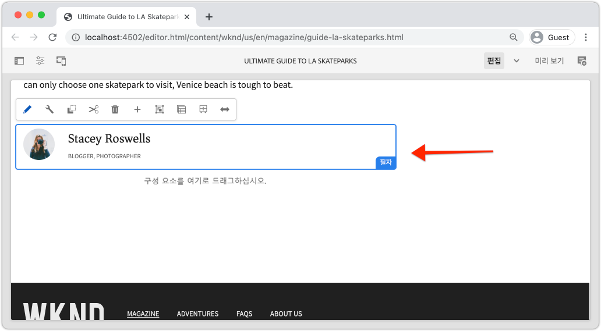
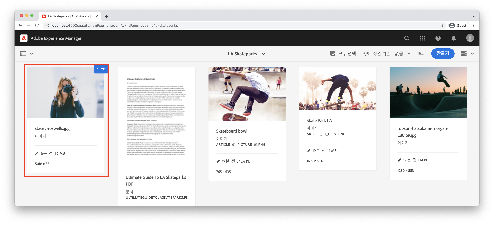
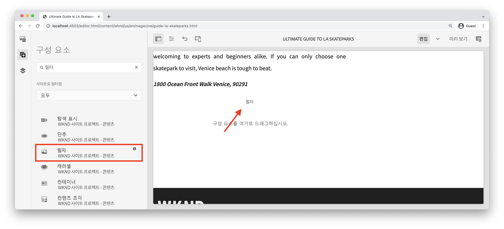
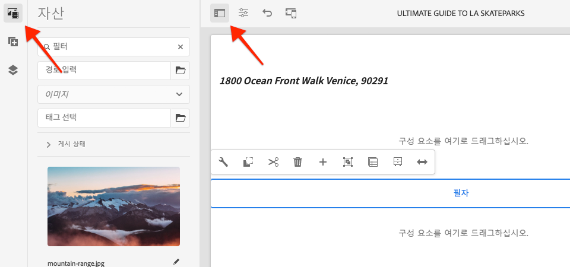
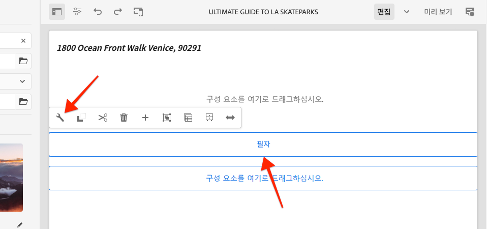
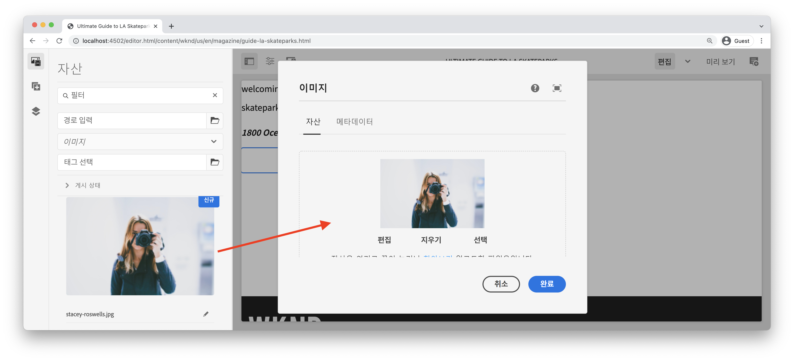
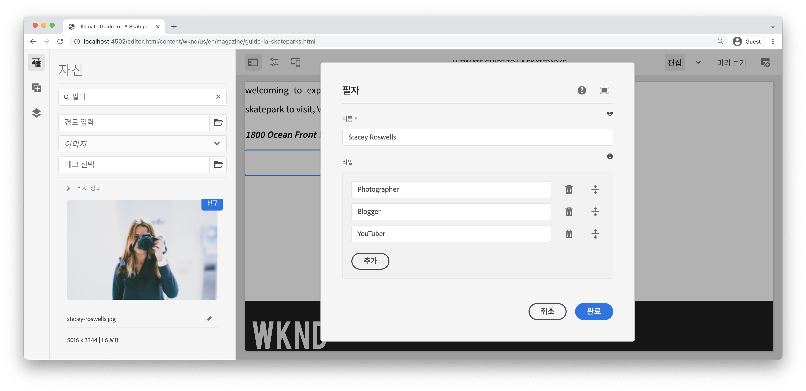
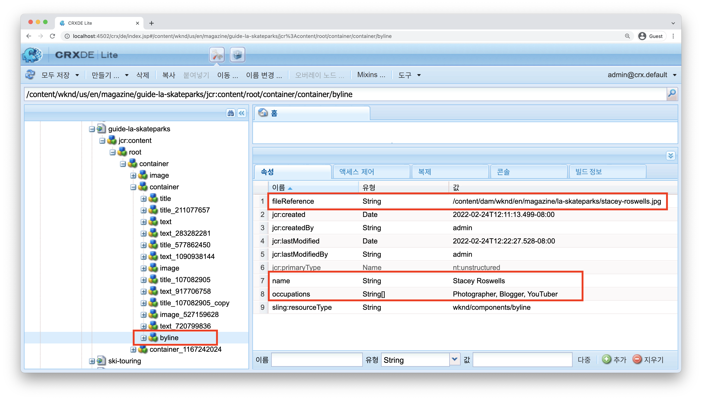
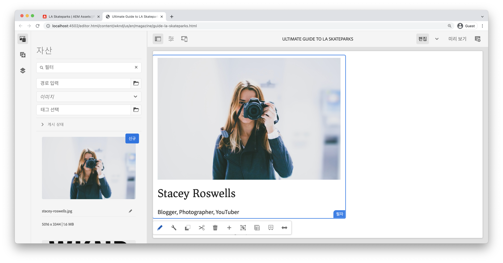
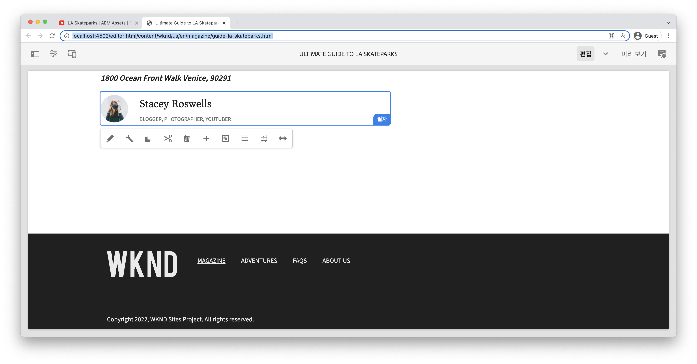

# 사용자 지정 구성 요소 {#custom-component}

이 자습서에서는 대화 상자에서 작성된 컨텐츠를 표시하는 사용자 지정 AEM byline 구성 요소의 전체 만들기를 설명하고 Sling 모델을 개발하여 구성 요소의 HTL을 채우는 비즈니스 로직을 캡슐화하는 방법을 설명합니다.

## 전제 조건 {#prerequisites}

[로컬 개발 환경](overview.md#local-dev-environment)을 설정하는 데 필요한 도구 및 지침을 검토하십시오.

### 스타터 프로젝트

>[!NOTE]
>
> 이전 장을 성공적으로 완료한 경우 프로젝트를 다시 사용하고 시작 프로젝트를 체크 아웃하는 단계를 건너뛸 수 있습니다.

자습서가 빌드하는 기본 라인 코드를 확인합니다.

1. [GitHub](https://github.com/adobe/aem-guides-wknd)에서 `tutorial/custom-component-start` 분기를 확인하십시오

   ```shell
   $ cd aem-guides-wknd
   $ git checkout tutorial/custom-component-start
   ```

1. Maven 기술을 사용하여 로컬 AEM 인스턴스에 코드 베이스를 배포합니다.

   ```shell
   $ mvn clean install -PautoInstallSinglePackage
   ```

   >[!NOTE]
   >
   > AEM 6.5 또는 6.4를 사용하는 경우 `classic` 프로필을 Maven 명령에 추가합니다.

   ```shell
   $ mvn clean install -PautoInstallSinglePackage -Pclassic
   ```

항상 [GitHub](https://github.com/adobe/aem-guides-wknd/tree/tutorial/custom-component-solution)에서 완료된 코드를 보거나 분기 `tutorial/custom-component-solution`로 전환하여 로컬로 코드를 체크 아웃할 수 있습니다.

## 목표

1. 사용자 지정 AEM 구성 요소를 만드는 방법을 이해합니다
1. Sling 모델을 사용하여 비즈니스 로직을 캡슐화하는 방법을 알아봅니다
1. HTL 스크립트 내에서 Sling 모델을 사용하는 방법을 이해합니다

## 빌드할 내용 {#byline-component}

WKND 자습서의 이 부분에서 아티클의 기여자에 대한 작성된 정보를 표시하는 데 사용되는 줄 구성 요소가 만들어집니다.



*필자 구성 요소*

필자 구성 요소의 구현에는 필자 컨텐츠를 수집하는 대화 상자 및 필자를 검색하는 사용자 지정 슬링 모델이 포함되어 있습니다.

* 이름
* 이미지
* 직업

## 필자 구성 요소 만들기 {#create-byline-component}

먼저 부산물 구성 요소 노드 구조를 만들고 대화 상자를 정의합니다. 이 항목은 AEM의 구성 요소를 나타내며 JCR의 해당 위치별로 구성 요소의 리소스 유형을 암시적으로 정의합니다.

이 대화 상자는 컨텐츠 작성자가 제공할 수 있는 인터페이스를 표시합니다. 이 구현의 경우 AEM WCM 코어 구성 요소의 **이미지** 구성 요소를 활용하여 Byline 이미지의 작성 및 렌더링을 처리하므로 이 구성 요소는 구성 요소의 `sling:resourceSuperType`로 설정됩니다.

### 구성 요소 정의 만들기 {#create-component-definition}

1. **ui.apps** 모듈에서 `/apps/wknd/components`로 이동하여 `byline` 라는 새 폴더를 만듭니다.
1. `byline` 폴더 아래에 `.content.xml` 라는 새 파일을 추가합니다.

   

1. `.content.xml` 파일을 다음과 같이 채웁니다.

   ```xml
   <?xml version="1.0" encoding="UTF-8"?>
       <jcr:root xmlns:sling="http://sling.apache.org/jcr/sling/1.0" xmlns:cq="http://www.day.com/jcr/cq/1.0" xmlns:jcr="http://www.jcp.org/jcr/1.0"
       jcr:primaryType="cq:Component"
       jcr:title="Byline"
       jcr:description="Displays a contributor's byline."
       componentGroup="WKND Sites Project - Content"
       sling:resourceSuperType="core/wcm/components/image/v2/image"/>
   ```

   위의 XML 파일은 제목, 설명 및 그룹을 포함하여 구성 요소에 대한 정의를 제공합니다. `sling:resourceSuperType`은 `core/wcm/components/image/v2/image`코어 이미지 구성 요소](https://experienceleague.adobe.com/docs/experience-manager-core-components/using/components/image.html)를 가리킵니다.[

### HTL 스크립트 만들기 {#create-the-htl-script}

1. `byline` 폴더 아래에 구성 요소의 HTML 프레젠테이션을 담당하는 새 파일 `byline.html`을 추가합니다. Sling에서 이 리소스 유형을 렌더링하는 데 사용할 기본 스크립트가 되므로 폴더와 동일한 이름으로 파일 이름을 지정하는 것이 중요합니다.

1. 다음 코드를 `byline.html`에 추가합니다.

   ```html
   <!--/* byline.html */-->
   <div data-sly-use.placeholderTemplate="core/wcm/components/commons/v1/templates.html">
   </div>
   <sly data-sly-call="${placeholderTemplate.placeholder @ isEmpty=true}"></sly>
   ```

`byline.html` Sling  [모델이 만들어지면 나중에](#byline-htl) 다시 방문합니다. HTL 파일의 현재 상태를 사용하면 구성 요소가 페이지로 끌어다 놓을 때 AEM Sites의 페이지 편집기에 빈 상태로 표시될 수 있습니다.

### 대화 상자 정의 만들기 {#create-the-dialog-definition}

다음으로, 다음 필드로 필자 구성 요소에 대한 대화 상자를 정의합니다.

* **이름**: 기여자 이름이 되는 텍스트 필드.
* **이미지**: 기여자의 소개 사진.
* **직업**: 기여자가 갖는 직업 목록. 직업은 오름차순(a~z)으로 정렬해야 합니다.

1. `byline` 폴더 아래에서 `_cq_dialog` 라는 새 폴더를 만듭니다.
1. `byline/_cq_dialog` 아래에 `.content.xml` 라는 새 파일을 추가합니다. 대화 상자의 XML 정의입니다. 다음 XML을 추가합니다.

   ```xml
   <?xml version="1.0" encoding="UTF-8"?>
   <jcr:root xmlns:sling="http://sling.apache.org/jcr/sling/1.0" xmlns:cq="http://www.day.com/jcr/cq/1.0" xmlns:jcr="http://www.jcp.org/jcr/1.0" xmlns:nt="http://www.jcp.org/jcr/nt/1.0"
           jcr:primaryType="nt:unstructured"
           jcr:title="Byline"
           sling:resourceType="cq/gui/components/authoring/dialog">
       <content
               jcr:primaryType="nt:unstructured"
               sling:resourceType="granite/ui/components/coral/foundation/container">
           <items jcr:primaryType="nt:unstructured">
               <tabs
                       jcr:primaryType="nt:unstructured"
                       sling:resourceType="granite/ui/components/coral/foundation/tabs"
                       maximized="{Boolean}false">
                   <items jcr:primaryType="nt:unstructured">
                       <asset
                               jcr:primaryType="nt:unstructured"
                               sling:hideResource="{Boolean}false"/>
                       <metadata
                               jcr:primaryType="nt:unstructured"
                               sling:hideResource="{Boolean}true"/>
                       <properties
                               jcr:primaryType="nt:unstructured"
                               jcr:title="Properties"
                               sling:resourceType="granite/ui/components/coral/foundation/container"
                               margin="{Boolean}true">
                           <items jcr:primaryType="nt:unstructured">
                               <columns
                                       jcr:primaryType="nt:unstructured"
                                       sling:resourceType="granite/ui/components/coral/foundation/fixedcolumns"
                                       margin="{Boolean}true">
                                   <items jcr:primaryType="nt:unstructured">
                                       <column
                                               jcr:primaryType="nt:unstructured"
                                               sling:resourceType="granite/ui/components/coral/foundation/container">
                                           <items jcr:primaryType="nt:unstructured">
                                               <name
                                                       jcr:primaryType="nt:unstructured"
                                                       sling:resourceType="granite/ui/components/coral/foundation/form/textfield"
                                                       emptyText="Enter the contributor's name to display."
                                                       fieldDescription="The contributor's name to display."
                                                       fieldLabel="Name"
                                                       name="./name"
                                                       required="{Boolean}true"/>
                                               <occupations
                                                       jcr:primaryType="nt:unstructured"
                                                       sling:resourceType="granite/ui/components/coral/foundation/form/multifield"
                                                       fieldDescription="A list of the contributor's occupations."
                                                       fieldLabel="Occupations"
                                                       required="{Boolean}false">
                                                   <field
                                                           jcr:primaryType="nt:unstructured"
                                                           sling:resourceType="granite/ui/components/coral/foundation/form/textfield"
                                                           emptyText="Enter an occupation"
                                                           name="./occupations"/>
                                               </occupations>
                                           </items>
                                       </column>
                                   </items>
                               </columns>
                           </items>
                       </properties>
                   </items>
               </tabs>
           </items>
       </content>
   </jcr:root>
   ```

   이러한 대화 상자 노드 정의는 [Sling Resource Merger](https://sling.apache.org/documentation/bundles/resource-merger.html)를 사용하여 `sling:resourceSuperType` 구성 요소에서 상속되는 대화 상자 탭을 제어합니다. 이 경우 **코어 구성 요소의 이미지 구성 요소**&#x200B;입니다.

   

### 정책 대화 상자 만들기 {#create-the-policy-dialog}

대화 상자 만들기와 동일한 접근 방식에 따라 정책 대화 상자(이전의 디자인 대화 상자)를 만들어 핵심 구성 요소의 이미지 구성 요소에서 상속된 정책 구성에서 원하지 않는 필드를 숨깁니다.

1. `byline` 폴더 아래에서 `_cq_design_dialog` 라는 새 폴더를 만듭니다.
1. `byline/_cq_design_dialog` 아래에 `.content.xml` 라는 새 파일을 만듭니다. 파일을 다음과 같이 업데이트합니다. 사용할 수 있습니다. `.content.xml` 을 열고 아래 XML을 복사하거나 붙여 넣는 것이 더 쉽습니다.

   ```xml
   <?xml version="1.0" encoding="UTF-8"?>
   <jcr:root xmlns:sling="http://sling.apache.org/jcr/sling/1.0" xmlns:granite="http://www.adobe.com/jcr/granite/1.0" xmlns:cq="http://www.day.com/jcr/cq/1.0" xmlns:jcr="http://www.jcp.org/jcr/1.0" xmlns:nt="http://www.jcp.org/jcr/nt/1.0"
       jcr:primaryType="nt:unstructured"
       jcr:title="Byline"
       sling:resourceType="cq/gui/components/authoring/dialog">
       <content
               jcr:primaryType="nt:unstructured">
           <items jcr:primaryType="nt:unstructured">
               <tabs
                       jcr:primaryType="nt:unstructured">
                   <items jcr:primaryType="nt:unstructured">
                       <properties
                               jcr:primaryType="nt:unstructured">
                           <items jcr:primaryType="nt:unstructured">
                               <content
                                       jcr:primaryType="nt:unstructured">
                                   <items jcr:primaryType="nt:unstructured">
                                       <decorative
                                               jcr:primaryType="nt:unstructured"
                                               sling:hideResource="{Boolean}true"/>
                                       <altValueFromDAM
                                               jcr:primaryType="nt:unstructured"
                                               sling:hideResource="{Boolean}true"/>
                                       <titleValueFromDAM
                                               jcr:primaryType="nt:unstructured"
                                               sling:hideResource="{Boolean}true"/>
                                       <displayCaptionPopup
                                               jcr:primaryType="nt:unstructured"
                                               sling:hideResource="{Boolean}true"/>
                                       <disableUuidTracking
                                               jcr:primaryType="nt:unstructured"
                                               sling:hideResource="{Boolean}true"/>
                                   </items>
                               </content>
                           </items>
                       </properties>
                       <features
                               jcr:primaryType="nt:unstructured">
                           <items jcr:primaryType="nt:unstructured">
                               <content
                                       jcr:primaryType="nt:unstructured">
                                   <items jcr:primaryType="nt:unstructured">
                                       <accordion
                                               jcr:primaryType="nt:unstructured">
                                           <items jcr:primaryType="nt:unstructured">
                                               <orientation
                                                       jcr:primaryType="nt:unstructured"
                                                       sling:hideResource="{Boolean}true"/>
                                               <crop
                                                       jcr:primaryType="nt:unstructured"
                                                       sling:hideResource="{Boolean}true"/>
                                           </items>
                                       </accordion>
                                   </items>
                               </content>
                           </items>
                       </features>
                   </items>
               </tabs>
           </items>
       </content>
   </jcr:root>
   ```

   이전 **정책 대화 상자** XML의 기반이 [핵심 구성 요소 이미지 구성 요소](https://github.com/adobe/aem-core-wcm-components/blob/master/content/src/content/jcr_root/apps/core/wcm/components/image/v2/image/_cq_design_dialog/.content.xml)에서 획득되었습니다.

   대화 상자 구성에서 처럼 [Sling Resource Merger](https://sling.apache.org/documentation/bundles/resource-merger.html)는 `sling:hideResource="{Boolean}true"` 속성을 사용하는 노드 정의에서 보듯이 `sling:resourceSuperType`에서 상속되지 않은 필드를 숨기는 데 사용됩니다.

### 코드 배포 {#deploy-the-code}

1. Maven 기술을 사용하여 로컬 AEM 인스턴스에 업데이트된 코드 베이스를 배포합니다.

   ```shell
   $ cd aem-guides-wknd
   $ mvn clean install -PautoInstallSinglePackage
   ```

## 페이지에 구성 요소 추가 {#add-the-component-to-a-page}

작업을 단순화하고 AEM 구성 요소 개발에 집중할 수 있도록 현재 상태의 부산물 구성 요소를 문서 페이지에 추가하여 `cq:Component` 노드 정의가 배포되고 올바른지 확인하고, AEM은 새 구성 요소 정의를 인식하며 구성 요소의 대화 상자가 작성에 대해 작동합니다.

### AEM Assets에 이미지 추가

먼저 샘플 헤드 샷을 AEM Assets에 업로드하여 오프라인 구성 요소에서 이미지를 채우는 데 사용합니다.

1. AEM Assets의 LA Skatestparks 폴더로 이동합니다. [http://localhost:4502/assets.html/content/dam/wknd/en/magazine/la-skateparks](http://localhost:4502/assets.html/content/dam/wknd/en/magazine/la-skateparks)

1. **[stacey-roswells.jpg](assets/custom-component/stacey-roswells.jpg)**&#x200B;에 대한 헤드 샷을 폴더에 업로드합니다.

   

### 구성 요소 작성 {#author-the-component}

다음으로, AEM의 페이지에 타임라인 구성 요소를 추가합니다. Byline 구성 요소를 **WKND Sites Project - Content** 구성 요소 그룹에 추가했으므로 `ui.apps/src/main/content/jcr_root/apps/wknd/components/byline/.content.xml` 정의를 통해 이 구성 요소는 문서 페이지의 레이아웃 컨테이너가 있는 **WKND Sites Project - Content** 구성 요소 그룹을 허용하는 **Container**&#x200B;에서 자동으로 사용할 수 있습니다.****

1. 다음 위치에서 LA 스케이트파크 문서로 이동합니다. [http://localhost:4502/editor.html/content/wknd/us/en/magazine/guide-la-skateparks.html](http://localhost:4502/editor.html/content/wknd/us/en/magazine/guide-la-skateparks.html)

1. 왼쪽 사이드바에서 열린 문서 페이지의 레이아웃 컨테이너 **하단**&#x200B;에 있는 **개별 구성 요소**&#x200B;를 끌어다 놓습니다.

   

1. 왼쪽 사이드바가 열기&#x200B;**되어 있고 표시되며**&#x200B;자산 파인더&#x200B;**가 선택되어 있는지 확인합니다.**

   

1. **타임라인 구성 요소 자리 표시자**&#x200B;를 선택합니다. 그러면 작업 표시줄이 표시되고 **렌치** 아이콘을 탭하여 대화 상자를 엽니다.

   

1. 대화 상자가 열리면 첫 번째 탭(자산)이 활성화되고 왼쪽 사이드바를 열고 자산 파인더에서 이미지를 이미지 드롭다운 영역으로 드래그합니다. &quot;stacey&quot;를 검색하여 WKND ui.content 패키지에 제공된 Stacey Roswells 바이오 사진을 찾습니다.

   

1. 이미지를 추가한 후 **속성** 탭을 클릭하여 **이름** 및 **직업**&#x200B;을 입력합니다.

   직업 입력 시 **역방향 알파벳** 순서에 해당 논리를 입력하여 Sling 모델에서 구현할 사전순 비즈니스 논리를 쉽게 확인할 수 있습니다.

   오른쪽 하단에 있는 **완료** 단추를 눌러 변경 사항을 저장합니다.

   

   AEM 작성자는 대화 상자를 통해 구성 요소를 구성하고 작성합니다. 이 시점에서 타임라인 구성 요소 개발 시 대화 상자가 데이터 수집을 위해 포함되지만 작성된 컨텐츠를 렌더링하는 논리는 아직 추가되지 않았습니다. 따라서 자리 표시자만 표시됩니다.

1. 대화 상자를 저장한 후 [CRXDE Lite](http://localhost:4502/crx/de/index.jsp#/content/wknd/us/en/magazine/guide-la-skateparks/jcr%3Acontent/root/container/container/byline)로 이동하여 구성 요소의 컨텐츠가 AEM 페이지 아래의 byline 구성 요소 컨텐츠 노드에 저장되는 방식을 검토합니다.

   LA Skate Parks 페이지 아래에서 Byline 구성 요소 컨텐츠 노드(예: `/content/wknd/us/en/magazine/guide-la-skateparks/jcr:content/root/container/container/byline`)를 찾습니다.

   속성 이름 `name`, `occupations` 및 `fileReference`이 **byline node**&#x200B;에 저장되었는지 확인합니다.

   또한 노드의 `sling:resourceType`이 `wknd/components/content/byline`로 설정되어 이 컨텐츠 노드를 Byline 구성 요소 구현에 바인딩하는 것에 주목합니다.

   

## 라인 Sling 모델 작성 {#create-sling-model}

다음으로, 데이터 모델 역할을 하는 Sling 모델을 만들고 Byline 구성 요소에 대한 비즈니스 논리를 제공합니다.

Sling 모델은 AEM 컨텍스트에서 개발 시 JCR에서 Java 변수로 데이터를 쉽게 매핑하고 많은 다른 세부 사항을 제공하는 주석 기반의 Java &quot;POJO&quot;(Plain Old Java Objects)입니다.

### Maven 종속성 검토 {#maven-dependency}

Sling 모델은 AEM에서 제공하는 여러 Java API를 사용합니다. 이러한 API는 `core` 모듈의 POM 파일에 나열된 `dependencies`을 통해 사용할 수 있습니다. 이 자습서에 사용된 프로젝트는 AEM as a Cloud Service용으로 빌드되었습니다. 그러나 AEM 6.5/6.4와 이전 버전과 호환된다는 점에서 독특합니다. 따라서 Cloud Service과 AEM 6.x에 대한 종속성이 모두 포함됩니다.

1. `<src>/aem-guides-wknd/core/pom.xml` 아래의 `pom.xml` 파일을 엽니다.
1. `aem-sdk-api` - **AEM as a Cloud Service에 대한 종속성을 찾습니다.**

   ```xml
   <dependency>
       <groupId>com.adobe.aem</groupId>
       <artifactId>aem-sdk-api</artifactId>
   </dependency>
   ```

   [aem-sdk-api](https://experienceleague.adobe.com/docs/experience-manager-cloud-service/implementing/developing/aem-as-a-cloud-service-sdk.html?lang=en#building-for-the-sdk)에는 AEM에 의해 노출된 모든 공개 Java API가 포함되어 있습니다. 이 프로젝트를 작성할 때는 기본적으로 `aem-sdk-api`이 사용됩니다. 버전은 `aem-guides-wknd/pom.xml`에 있는 프로젝트의 루트에 있는 부모 원자로 pom에서 유지됩니다.

1. `uber-jar` - **AEM 6.5/6.4에만 대한 종속성을 찾습니다.**

   ```xml
   ...
       <dependency>
           <groupId>com.adobe.aem</groupId>
           <artifactId>uber-jar</artifactId>
           <classifier>apis</classifier>
       </dependency>
   ...
   ```

   `uber-jar`은 `classic` 프로필이 호출될 때만 포함됩니다(예: `mvn clean install -PautoInstallSinglePackage -Pclassic`). 이 프로젝트에서도 고유합니다. AEM 프로젝트 원형(Project Archetype)에서 생성된 실제 프로젝트에서 지정된 AEM 버전이 6.5 또는 6.4인 경우 `uber-jar`이(가) 기본값입니다.

   [uber-jar](https://docs.adobe.com/content/help/en/experience-manager-65/developing/devtools/ht-projects-maven.html#experience-manager-api-dependencies)에는 AEM 6.x에 의해 노출된 모든 공개 Java API가 포함되어 있습니다. 버전은 프로젝트 `aem-guides-wknd/pom.xml`의 루트에 있는 상위 반응기 pom에서 유지됩니다.

1. `core.wcm.components.core`에 대한 종속성을 찾습니다.

   ```xml
    <!-- Core Component Dependency -->
       <dependency>
           <groupId>com.adobe.cq</groupId>
           <artifactId>core.wcm.components.core</artifactId>
       </dependency>
   ```

   AEM 핵심 구성 요소에 의해 노출된 모든 공개 Java API입니다. AEM 코어 구성 요소는 AEM 외부에서 유지 관리되는 프로젝트이므로 별도의 릴리스 주기를 갖습니다. 이러한 이유로 이 종속성은 별도로 포함해야 하며 `uber-jar` 또는 `aem-sdk-api`에 포함되지 않은 **입니다.**

   uber-jar와 마찬가지로, 이 종속성에 대한 버전은 `aem-guides-wknd/pom.xml`에 있는 부모 반응기 pom 파일에서 유지됩니다.

   이 자습서의 후반부에서는 코어 구성 요소 이미지 클래스를 사용하여 이미지를 개별 구성 요소에 표시합니다. Sling 모델을 만들고 컴파일하려면 코어 구성 요소 종속성이 있어야 합니다.

### 개별 인터페이스 {#byline-interface}

필라인에 대한 공개 Java 인터페이스를 만듭니다. `Byline.java` htl 스크립트를 구동하는 데 필요한 공용  `byline.html` 메서드를 정의합니다.

1. `core/src/main/java/com/adobe/aem/guides/wknd/core/models` 아래의 `aem-guides-wknd.core` 모듈 내에서 `Byline.java` 라는 새 파일을 만듭니다

   

1. `Byline.java` 을(를) 다음 방법으로 업데이트합니다.

   ```java
   package com.adobe.aem.guides.wknd.core.models;
   
   import java.util.List;
   
   /**
   * Represents the Byline AEM Component for the WKND Site project.
   **/
   public interface Byline {
       /***
       * @return a string to display as the name.
       */
       String getName();
   
       /***
       * Occupations are to be sorted alphabetically in a descending order.
       *
       * @return a list of occupations.
       */
       List<String> getOccupations();
   
       /***
       * @return a boolean if the component has enough content to display.
       */
       boolean isEmpty();
   }
   ```

   처음 두 메서드는 Byline 구성 요소의 **name** 및 **직업**&#x200B;에 대한 값을 노출합니다.

   `isEmpty()` 메서드는 구성 요소에 렌더링할 컨텐츠가 있는지 또는 구성 대기 중인지 확인하는 데 사용됩니다.

   이 이미지에 대한 방법은 없습니다. [나중에](#tackling-the-image-problem)인 이유를 살펴보겠습니다.

1. 공개 Java 클래스가 들어 있는 Java 패키지, 이 경우 Sling 모델은 패키지의 `package-info.java` 파일을 사용하여 버전을 지정해야 합니다.

WKND 소스의 Java 패키지 `com.adobe.aem.guides.wknd.core.models` 는 `2.0.0` 버전이므로 중단되지 않는 공용 인터페이스 및 메서드를 추가하고 있으므로 버전을 `2.1.0`(으)로 늘려야 합니다. `core/src/main/java/com/adobe/aem/guides/wknd/core/models/package-info.java`에서 파일을 열고 `@Version("2.0.0")`을 `@Version("2.1.0")`(으)로 업데이트하십시오.

    &quot;
    @Version(&quot;2.1.0&quot;)
    package com.adobe.aem.guides.wknd.core.models;
    
    import org.osgi.annotation.versioning.Version;
    &quot;

이 패키지의 파일을 변경할 때마다 [패키지 버전을 의미상](https://semver.org/)조정해야 합니다. 없는 경우 Maven 프로젝트의 [bnd-baseline-maven-plugin](https://github.com/bndtools/bnd/tree/master/maven/bnd-baseline-maven-plugin)은 잘못된 패키지 버전을 감지하고 빌드된 패키지를 중단합니다. 다행히도, 실패 시 Maven 플러그인은 잘못된 Java 패키지 버전과 이 버전이 되어야 한다고 보고합니다. 위반되는 Java 패키지의 `package-info.java`에 있는 `@Version("...")` 선언을 수정하기 위해 플러그인이 권장하는 버전으로 방금 업데이트했습니다.

### 필자 구현 {#byline-implementation}

`BylineImpl.java` 는 이전에 정의된 인터페이스를 구현하는 Sling  `Byline.java` 모델의 구현입니다. `BylineImpl.java`에 대한 전체 코드는 이 섹션의 하단에 있습니다.

1. `core/src/main/java/com/adobe/aem/guides/core/models` 아래에 `impl`이라는 새 폴더를 만듭니다.
1. `impl` 폴더에서 새 파일 `BylineImpl.java`을 만듭니다.

   

1. 열기 `BylineImpl.java`. `Byline` 인터페이스를 구현하도록 지정합니다. IDE의 자동 완성 기능을 사용하거나 파일을 수동으로 업데이트하여 `Byline` 인터페이스를 구현하는 데 필요한 메서드를 포함합니다.

   ```java
   package com.adobe.aem.guides.wknd.core.models.impl;
   import java.util.List;
   import com.adobe.aem.guides.wknd.core.models.Byline;
   
   public class BylineImpl implements Byline {
   
       @Override
       public String getName() {
           // TODO Auto-generated method stub
           return null;
       }
   
       @Override
       public List<String> getOccupations() {
           // TODO Auto-generated method stub
           return null;
       }
   
       @Override
       public boolean isEmpty() {
           // TODO Auto-generated method stub
           return false;
       }
   }
   ```

1. 다음 클래스 수준 주석과 함께 `BylineImpl.java`을 업데이트하여 Sling 모델 주석을 추가합니다. 이 `@Model(..)`주석은 클래스를 Sling 모델로 바꾸는 방법입니다.

   ```java
   import org.apache.sling.api.SlingHttpServletRequest;
   import org.apache.sling.models.annotations.Model;
   import org.apache.sling.models.annotations.DefaultInjectionStrategy;
   ...
   @Model(
           adaptables = {SlingHttpServletRequest.class},
           adapters = {Byline.class},
           resourceType = {BylineImpl.RESOURCE_TYPE},
           defaultInjectionStrategy = DefaultInjectionStrategy.OPTIONAL
   )
   public class BylineImpl implements Byline {
       protected static final String RESOURCE_TYPE = "wknd/components/content/byline";
       ...
   }
   ```

   이 주석 및 해당 매개 변수를 살펴보겠습니다.

   * `@Model` 주석은 AEM에 배포될 때 BylineImpl을 Sling 모델로 등록합니다.
   * `adaptables` 매개 변수는 이 모델을 요청에 의해 적용할 수 있도록 지정합니다.
   * `adapters` 매개 변수를 사용하면 Byline 인터페이스 아래에 구현 클래스를 등록할 수 있습니다. 이렇게 하면 HTL 스크립트가 impl이 직접 아닌 인터페이스를 통해 Sling 모델을 호출할 수 있습니다. [어댑터에 대한 자세한 내용은 여기에서 확인할 수 있습니다](https://sling.apache.org/documentation/bundles/models.html#specifying-an-alternate-adapter-class-since-110).
   * `resourceType`은(는) 순 구성 요소 리소스 유형(이전에 만든)을 가리키며, 여러 구현이 있는 경우 올바른 모델을 확인하는 데 도움이 됩니다. [모델 클래스를 리소스 유형과 연결하는 방법에 대한 자세한 내용은 여기에서 확인할 수 있습니다](https://sling.apache.org/documentation/bundles/models.html#associating-a-model-class-with-a-resource-type-since-130).

### Sling 모델 메서드 구현 {#implementing-the-sling-model-methods}

#### getName() {#implementing-get-name}

우리가 처리할 첫 번째 방법은 `getName()`입니다. 이 메서드는 `name` 속성 아래에 있는 byline의 JCR 컨텐츠 노드에 저장된 값을 단순히 반환합니다.

이를 위해 `@ValueMapValue` Sling Model 주석을 사용하여 요청의 ValueMap 리소스를 사용하여 Java 필드에 값을 삽입할 수 있습니다.


```java
import org.apache.sling.models.annotations.injectorspecific.ValueMapValue;

public class BylineImpl implements Byline {
    ...
    @ValueMapValue
    private String name;

    ...
    @Override
    public String getName() {
        return name;
    }
    ...
}
```

JCR 속성은 Java 필드와 동일한 이름을 공유하므로(둘 다 &quot;이름&quot;임) `@ValueMapValue`은 이 연결을 자동으로 확인하고 속성 값을 Java 필드에 삽입합니다.

#### getTowals() {#implementing-get-occupations}

다음 구현 방법은 `getOccupations()`입니다. 이 메서드는 JCR 속성 `occupations`에 저장된 모든 작업을 수집하고 정렬된(사전순) 컬렉션을 반환합니다.

`getName()`에서 탐색한 동일한 기술을 사용하여 속성 값을 Sling 모델의 필드에 삽입할 수 있습니다.

Sling 모델에서 삽입된 Java 필드 `occupations`을 통해 JCR 속성 값을 사용할 수 있게 되면 `getOccupations()` 메서드에서 정렬 비즈니스 논리를 적용할 수 있습니다.


```java
import java.util.ArrayList;
import java.util.Collections;
  ...

public class BylineImpl implements Byline {
    ...
    @ValueMapValue
    private List<String> occupations;
    ...
    @Override
    public List<String> getOccupations() {
        if (occupations != null) {
            Collections.sort(occupations);
            return new ArrayList<String>(occupations);
        } else {
            return Collections.emptyList();
        }
    }
    ...
}
  ...
```


#### isEmpty() {#implementing-is-empty}

마지막 공개 메서드는 구성 요소가 렌더링하기 위해 &quot;작성&quot;한 것으로 간주해야 하는 시기를 결정하는 `isEmpty()`입니다.

이 구성 요소의 경우, 구성 요소를 렌더링하기 전에 *먼저 세 개의 필드, 이름, 이미지 및 직업을 모두 입력해야 한다는 비즈니스 요구 사항이 있습니다.*


```java
import org.apache.commons.lang3.StringUtils;
  ...
public class BylineImpl implements Byline {
    ...
    @Override
    public boolean isEmpty() {
        if (StringUtils.isBlank(name)) {
            // Name is missing, but required
            return true;
        } else if (occupations == null || occupations.isEmpty()) {
            // At least one occupation is required
            return true;
        } else if (/* image is not null, logic to be determined */) {
            // A valid image is required
            return true;
        } else {
            // Everything is populated, so this component is not considered empty
            return false;
        }
    }
    ...
}
```


#### 이미지 문제 해결 {#tackling-the-image-problem}

이름과 작업 조건을 확인하는 것은 매우 간단합니다(그리고 Apache Commons Lang3은 항상 편리한 [StringUtils](https://commons.apache.org/proper/commons-lang/apidocs/org/apache/commons/lang3/StringUtils.html) 클래스)를 제공하지만, 핵심 구성 요소 이미지 구성 요소를 사용하여 이미지를 표시하므로 **이미지**&#x200B;의 존재 여부를 확인하는 방법은 확실하지 않습니다.

이를 해결하는 방법에는 두 가지가 있습니다.

`fileReference` JCR 속성이 자산으로 확인되는지 확인합니다. ** 이 리소스를 코어 구성 요소 이미지 Sling 모델로 변환하고 메서드 `getSrc()` 가 비어 있지 않은지 확인합니다.

**두 번째** 방법을 선택하겠습니다. 첫 번째 방법으로도 충분할 수 있지만, 이 자습서에서는 후자를 사용하여 Sling 모델의 다른 기능을 탐색할 수 있습니다.

1. 이미지를 가져오는 비공개 메서드를 만듭니다. 이 메서드는 HTL 자체에 Image 개체를 노출할 필요가 없고 `isEmpty().` 드라이브에만 사용되므로 private으로 유지됩니다

   `getImage()`에 대한 다음 개인 메서드:

   ```java
   import com.adobe.cq.wcm.core.components.models.Image;
   ...
   private Image getImage() {
       Image image = null;
       // Figure out how to populate the image variable!
       return image;
   }
   ```

   위에서 설명한 대로 **이미지 Sling 모델**&#x200B;을 가져오는 두 가지 방법이 더 있습니다.

   먼저 `@Self` 주석을 사용하여 현재 요청을 코어 구성 요소의 `Image.class`에 자동으로 조정합니다

   ```java
   @Self
   private Image image;
   ```

   두 번째 플러그인은 매우 편리한 서비스인 [Apache Sling ModelFactory](https://sling.apache.org/apidocs/sling10/org/apache/sling/models/factory/ModelFactory.html) OSGi 서비스를 사용하므로 Java 코드에서 다른 유형의 Sling 모델을 만드는 데 도움이 됩니다.

   두 번째 방법을 택하겠습니다.

   >[!NOTE]
   >
   >실제 구현에서는 더 간단하고 우아한 솔루션이므로 `@Self` 을 사용하여 &quot;One&quot;에 접근하는 것이 좋습니다. 이 자습서에서는 매우 유용한 Sling 모델의 패싯을 더 많이 탐색해야 하므로 두 번째 방법을 사용하게 됩니다. 이는 보다 복잡한 구성 요소입니다.

   Sling 모델은 OSGi 서비스가 아닌 Java POJO이므로 일반적인 OSGi 주입 주석 `@Reference` **을 사용할 수 없습니다. 대신 Sling 모델은 유사한 기능을 제공하는 특수**[@OSGiService](https://sling.apache.org/documentation/bundles/models.html#injector-specific-annotations)**주석을 제공합니다.**

1. `BylineImpl.java`을 업데이트하여 `OSGiService` 주석을 포함하여 `ModelFactory`를 주입합니다.

   ```java
   import org.apache.sling.models.factory.ModelFactory;
   import org.apache.sling.models.annotations.injectorspecific.OSGiService;
   ...
   public class BylineImpl implements Byline {
       ...
       @OSGiService
       private ModelFactory modelFactory;
   }
   ```

   `ModelFactory` 을 사용할 수 있으면 다음을 사용하여 코어 구성 요소 이미지 Sling 모델을 만들 수 있습니다.

   ```java
   modelFactory.getModelFromWrappedRequest(SlingHttpServletRequest request, Resource resource, java.lang.Class<T> targetClass)
   ```

   그러나 이 메서드는 요청과 리소스를 모두 필요로 하지만, 아직 Sling 모델에서는 사용할 수 없습니다. 이러한 주석을 얻기 위해 더 많은 Sling 모델 주석이 사용됩니다.

   현재 요청을 가져오기 위해 **[@Self](https://sling.apache.org/documentation/bundles/models.html#injector-specific-annotations)** 주석을 사용하여 `adaptable`(`@Model(..)`에 `SlingHttpServletRequest.class`로 정의된)를 Java 클래스 필드에 삽입할 수 있습니다.

1. **@Self** 주석을 추가하여 **SlingHttpServletRequest**:

   ```java
   import org.apache.sling.models.annotations.injectorspecific.Self;
   ...
   @Self
   private SlingHttpServletRequest request;
   ```

   `@Self Image image` 을 사용하여 Core Component Image Sling 모델을 주입하는 것은 위의 선택 사항이었다는 점을 기억하십시오. - `@Self` 주석은 적응형 개체(여기서는 SlingHttpServletRequest)를 주입하고 주석 필드 유형에 맞게 조정하려고 합니다. 코어 구성 요소 이미지 Sling 모델은 SlingHttpServletRequest 개체에서 적응할 수 있으므로 이 작업이 수행되었을 것이며 더 탐색적인 접근 방법보다 코드가 적습니다.

   이제 ModelFactory API를 통해 이미지 모델을 인스턴스화하는 데 필요한 변수를 삽입했습니다. Sling Model이 인스턴스화한 후 Sling Model의 **[@PostConstruct](https://sling.apache.org/documentation/bundles/models.html#postconstruct-methods)** 주석을 사용하여 이 개체를 가져옵니다.

   `@PostConstruct` 는 매우 유용하며 생성자와 유사한 용량으로 작동하지만 클래스가 인스턴스화되고 주석 처리된 모든 Java 필드가 삽입되면 호출됩니다. 다른 Sling 모델 주석은 Java 클래스 필드(변수)에 주석을 다는 반면, `@PostConstruct` 에서는 일반적으로 `init()` 라는 이름이 붙은 비어 있는 제로 매개 변수 메서드에 주석을 답니다(하지만 아무 이름이나 지정할 수 있음).

1. **@PostConstruct** 메서드를 추가합니다.

   ```java
   import javax.annotation.PostConstruct;
   ...
   public class BylineImpl implements Byline {
       ...
       private Image image;
   
       @PostConstruct
       private void init() {
           image = modelFactory.getModelFromWrappedRequest(request,
                                                           request.getResource(),
                                                           Image.class);
       }
       ...
   }
   ```

   Sling 모델은 **NOT** OSGi 서비스이므로 클래스 상태를 유지하는 것이 안전합니다. 종종 `@PostConstruct`은 일반 생성자가 수행하는 작업과 마찬가지로 나중에 사용할 수 있도록 Sling 모델 클래스 상태를 파생하고 설정합니다.

   `@PostConstruct` 메서드에 예외가 발생하면 Sling 모델이 인스턴스화되지 않습니다(null임).

1. **이제 getImage()** 를 업데이트하여 이미지 개체를 간단히 반환할 수 있습니다.

   ```java
   /**
       * @return the Image Sling Model of this resource, or null if the resource cannot create a valid Image Sling Model.
   */
   private Image getImage() {
       return image;
   }
   ```

1. 다시 `isEmpty()`으로 돌아가서 구현을 마치겠습니다.

   ```java
   @Override
   public boolean isEmpty() {
      final Image componentImage = getImage();
   
       if (StringUtils.isBlank(name)) {
           // Name is missing, but required
           return true;
       } else if (occupations == null || occupations.isEmpty()) {
           // At least one occupation is required
           return true;
       } else if (componentImage == null || StringUtils.isBlank(componentImage.getSrc())) {
           // A valid image is required
           return true;
       } else {
           // Everything is populated, so this component is not considered empty
           return false;
       }
   }
   ```

   `getImage()`에 대한 여러 호출은 초기화된 `image` 클래스 변수를 반환하므로 문제가 되지 않으며, 과도한 비용이 들지 않지만 불필요한 호출을 방지할 가치가 있는 `modelFactory.getModelFromWrappedRequest(...)`를 호출하지 않습니다.

1. 최종 `BylineImpl.java`은(는) 다음과 같아야 합니다.


   ```java
   package com.adobe.aem.guides.wknd.core.models.impl;
   
   import java.util.ArrayList;
   import java.util.Collections;
   import java.util.List;
   import javax.annotation.PostConstruct;
   import org.apache.commons.lang3.StringUtils;
   import org.apache.sling.api.SlingHttpServletRequest;
   import org.apache.sling.models.annotations.DefaultInjectionStrategy;
   import org.apache.sling.models.annotations.Model;
   import org.apache.sling.models.annotations.injectorspecific.OSGiService;
   import org.apache.sling.models.annotations.injectorspecific.Self;
   import org.apache.sling.models.annotations.injectorspecific.ValueMapValue;
   import org.apache.sling.models.factory.ModelFactory;
   import com.adobe.aem.guides.wknd.core.models.Byline;
   import com.adobe.cq.wcm.core.components.models.Image;
   
   @Model(
           adaptables = {SlingHttpServletRequest.class},
           adapters = {Byline.class},
           resourceType = {BylineImpl.RESOURCE_TYPE},
           defaultInjectionStrategy = DefaultInjectionStrategy.OPTIONAL
   )
   public class BylineImpl implements Byline {
       protected static final String RESOURCE_TYPE = "wknd/components/content/byline";
   
       @Self
       private SlingHttpServletRequest request;
   
       @OSGiService
       private ModelFactory modelFactory;
   
       @ValueMapValue
       private String name;
   
       @ValueMapValue
       private List<String> occupations;
   
       private Image image;
   
       @PostConstruct
       private void init() {
           image = modelFactory.getModelFromWrappedRequest(request, request.getResource(), Image.class);
       }
   
       @Override
       public String getName() {
           return name;
       }
   
       @Override
       public List<String> getOccupations() {
           if (occupations != null) {
               Collections.sort(occupations);
               return new ArrayList<String>(occupations);
           } else {
               return Collections.emptyList();
           }
       }
   
       @Override
       public boolean isEmpty() {
           final Image componentImage = getImage();
   
           if (StringUtils.isBlank(name)) {
               // Name is missing, but required
               return true;
           } else if (occupations == null || occupations.isEmpty()) {
               // At least one occupation is required
               return true;
           } else if (componentImage == null || StringUtils.isBlank(componentImage.getSrc())) {
               // A valid image is required
               return true;
           } else {
               // Everything is populated, so this component is not considered empty
               return false;
           }
       }
   
       /**
       * @return the Image Sling Model of this resource, or null if the resource cannot create a valid Image Sling Model.
       */
       private Image getImage() {
           return image;
       }
   }
   ```


## 필자 HTL {#byline-htl}

`ui.apps` 모듈에서 AEM 구성 요소의 이전 세트에서 만든 `/apps/wknd/components/byline/byline.html` 을 엽니다.

```html
<div data-sly-use.placeholderTemplate="core/wcm/components/commons/v1/templates.html">
</div>
<sly data-sly-call="${placeholderTemplate.placeholder @ isEmpty=false}"></sly>
```

이 HTL 스크립트가 지금까지 무엇을 수행하는지 살펴보겠습니다.

* `placeholderTemplate` 은 구성 요소가 완전히 구성되지 않은 경우 표시되는 코어 구성 요소의 자리 표시자를 가리킵니다. 이렇게 하면 AEM Sites 페이지 편집기에서 `cq:Component`&#39;s `jcr:title` 속성에 위에서 정의한 대로 구성 요소 제목이 있는 상자로 렌더링됩니다.

* `data-sly-call="${placeholderTemplate.placeholder @ isEmpty=false}`은 위에 정의된 `placeholderTemplate`을 로드하고 부울 값(현재 `false`로 하드코딩됨)을 자리 표시자 템플릿에 전달합니다. `isEmpty` 이 true이면 자리 표시자 템플릿이 회색 상자를 렌더링하고, 그렇지 않으면 아무 것도 렌더링하지 않습니다.

### Byline HTL 업데이트

1. **byline.html**&#x200B;을 다음과 같은 골격 HTML 구조로 업데이트합니다.

   ```html
   <div data-sly-use.placeholderTemplate="core/wcm/components/commons/v1/templates.html"
       class="cmp-byline">
           <div class="cmp-byline__image">
               <!--/* Include the Core Components Image Component */-->
           </div>
           <h2 class="cmp-byline__name"><!--/* Include the name */--></h2>
           <p class="cmp-byline__occupations"><!--/* Include the occupations */--></p>
   </div>
   <sly data-sly-call="${placeholderTemplate.placeholder @ isEmpty=true}"></sly>
   ```

   CSS 클래스는 [BEM 이름 지정 규칙](https://getbem.com/naming/)을 따릅니다. BEM 규칙 사용은 필수가 아니지만, BEM은 핵심 구성 요소 CSS 클래스에서 사용되고 일반적으로 읽기 쉬운 CSS 규칙을 만드는 데 사용되므로 권장됩니다.

### HTL에서 Sling Model 개체 인스턴스화 {#instantiating-sling-model-objects-in-htl}

[Use block 문](https://github.com/adobe/htl-spec/blob/master/SPECIFICATION.md#221-use)은 HTL 스크립트에서 Sling Model 개체를 인스턴스화하고 HTL 변수에 할당하는 데 사용됩니다.

`data-sly-use.byline="com.adobe.aem.guides.wknd.models.Byline"` bylineImpl에 의해 구현된 Byline 인터페이스(com.adobe.aem.guides.wknd.models.Byline)를 사용하고 현재 SlingHttpServletRequest를 이 인터페이스에 조정하며, 그 결과는 HTL 변수 이름( `data-sly-use.<variable-name>`)에 저장됩니다.

1. 외부 `div`을 업데이트하여 **Byline** Sling 모델을 공용 인터페이스로 참조합니다.

   ```xml
   <div data-sly-use.byline="com.adobe.aem.guides.wknd.core.models.Byline"
       data-sly-use.placeholderTemplate="core/wcm/components/commons/v1/templates.html"
       class="cmp-byline">
       ...
   </div>
   ```

### Sling 모델 메서드 액세스 {#accessing-sling-model-methods}

HTL은 JSTL에서 빌리며 Java getter 메서드 이름의 단축과 동일한 사용을 사용합니다.

예를 들어, Sling 모델의 `getName()` 메서드를 호출하면 `byline.isEmpty` 대신 `byline.name` 로 단축될 수 있습니다. 이 메서드는 `byline.empty` 로 단축될 수 있습니다. 전체 메서드 이름 `byline.getName` 또는 `byline.isEmpty` 도 작동합니다. `()` 은 HTL에서 메서드를 호출하는 데 사용되지 않습니다(JSTL과 유사).

매개 변수 **이 필요한 Java 메서드는 HTL에서**&#x200B;를 사용할 수 없습니다. 이것은 HTL에서 논리를 단순하게 유지하기 위해 디자인에 의해 결정됩니다.

1. Byline Sling Model에서 `getName()` 메서드를 호출하거나 HTL에서 Byline 이름을 구성 요소에 추가할 수 있습니다. `${byline.name}`.

   `h2` 태그를 업데이트합니다.

   ```xml
   <h2 class="cmp-byline__name">${byline.name}</h2>
   ```

### HTL 표현식 옵션 사용 {#using-htl-expression-options}

[HTL 표현식 ](https://github.com/adobe/htl-spec/blob/master/SPECIFICATION.md#12-available-expression-options) 선택 사항은 HTL의 컨텐츠에 대해 수정자 역할을 하며 날짜 포맷에서 i18n 번역 범위까지의 범위에 해당합니다. 표현식은 목록 또는 값 배열을 연결하는 데 사용할 수도 있습니다. 이 경우 직업을 쉼표로 구분된 형식으로 표시하는 데 필요합니다.

표현식은 HTL 표현식에서 `@` 연산자를 통해 추가됩니다.

1. &quot;, &quot;를 사용하여 직업 목록에 참여하기 위해 다음 코드가 사용됩니다.

   ```html
   <p class="cmp-byline__occupations">${byline.occupations @ join=', '}</p>
   ```

### 자리 표시자를 조건부로 표시 {#conditionally-displaying-the-placeholder}

AEM 구성 요소에 대한 대부분의 HTL 스크립트는 **자리 표시자 패러다임**&#x200B;을 활용하여 구성 요소가 잘못 작성되고 AEM Publish **에 표시되지 않음을 나타내는**&#x200B;작성자에게 시각적 단서를 제공합니다. 이 결정을 내리기 위한 규칙은 구성 요소의 지원 Sling 모델에 대한 메서드를 구현하는 것입니다. 이 경우 `Byline.isEmpty()`

`isEmpty()` 은 Byline Sling Model에서 호출되고 결과(또는  `!` 연산자를 통해 음수가 아님)가  `hasContent`라는 HTL 변수에 저장됩니다.

1. 바깥쪽 `div`을 업데이트하여 `hasContent` 이름의 HTL 변수를 저장합니다.

   ```html
    <div data-sly-use.byline="com.adobe.aem.guides.wknd.core.models.Byline"
         data-sly-use.placeholderTemplate="core/wcm/components/commons/v1/templates.html"
         data-sly-test.hasContent="${!byline.empty}"
         class="cmp-byline">
         ...
   </div>
   ```

   `data-sly-test` 을 사용하는 것에 주의하십시오. HTL `test` 블록은 둘 다 HTL 변수를 설정하고 HTL 표현식의 결과가 신뢰할 수 있는지 여부에 따라 HTML 요소가 기반으로 렌더링되거나 렌더링되지 않는다는 점에서 흥미롭습니다. &quot;truthy&quot;가 렌더링되는 경우 HTML 요소가 렌더링되지 않습니다.

   이제 이 HTL 변수 `hasContent`을 사용하여 자리 표시자를 조건부로 표시/숨길 수 있습니다.

1. 조건 호출을 파일 하단의 `placeholderTemplate`에 업데이트하여 다음을 수행하십시오.

   ```html
   <sly data-sly-call="${placeholderTemplate.placeholder @ isEmpty=!hasContent}"></sly>
   ```

### 핵심 구성 요소를 사용하여 이미지 표시 {#using-the-core-components-image}

이제 `byline.html`에 대한 HTL 스크립트가 완료되었으며 이미지만 누락되었습니다.

Core Components 이미지 구성 요소를 사용하여 이미지 작성을 제공하므로, 코어 구성 요소 이미지 구성 요소를 사용하여 이미지를 렌더링할 수도 있습니다.`sling:resourceSuperType`

이를 위해 현재 byline 리소스를 포함해야 하지만 리소스 유형 `core/wcm/components/image/v2/image`을 사용하여 코어 구성 요소 이미지 구성 요소의 리소스 유형을 강제로 적용합니다. 구성 요소를 다시 사용할 수 있는 강력한 패턴입니다. 이를 위해 HTL의 `data-sly-resource` 블록이 사용됩니다.

1. `div` 을 `cmp-byline__image` 클래스로 바꿉니다.

   ```html
   <div class="cmp-byline__image"
       data-sly-resource="${ '.' @ resourceType = 'core/wcm/components/image/v2/image' }"></div>
   ```

   이 `data-sly-resource`은(는) 상대 경로 `'.'`을 통해 현재 리소스를 포함하고, 리소스 유형이 `core/wcm/components/image/v2/image`인 현재 리소스(또는 byline content resource)를 강제로 포함합니다.

   코어 구성 요소 리소스 유형은 프록시가 아니라 직접 사용됩니다. 이는 스크립트 내 사용이며 컨텐츠로 지속되지 않기 때문입니다.

2. 아래 `byline.html`을 완료했습니다.

   ```html
   <!--/* byline.html */-->
   <div data-sly-use.byline="com.adobe.aem.guides.wknd.core.models.Byline" 
       data-sly-use.placeholderTemplate="core/wcm/components/commons/v1/templates.html"
       data-sly-test.hasContent="${!byline.empty}"
       class="cmp-byline">
       <div class="cmp-byline__image"
           data-sly-resource="${ '.' @ resourceType = 'core/wcm/components/image/v2/image' }">
       </div>
       <h2 class="cmp-byline__name">${byline.name}</h2>
       <p class="cmp-byline__occupations">${byline.occupations @ join=', '}</p>
   </div>
   <sly data-sly-call="${placeholderTemplate.placeholder @ isEmpty=!hasContent}"></sly>
   ```

3. 로컬 AEM 인스턴스에 코드 베이스를 배포합니다. POM 파일을 크게 변경했으므로 프로젝트의 루트 디렉토리에서 전체 Maven 빌드를 수행합니다.

   ```shell
   $ cd aem-guides-wknd/
   $ mvn clean install -PautoInstallSinglePackage
   ```

   AEM 6.5/6.4에 배포하여 `classic` 프로필을 호출하는 경우:

   ```shell
   $ mvn clean install -PautoInstallSinglePackage -Pclassic
   ```

### 스타일이 지정되지 않은 필자 구성 요소 검토 {#reviewing-the-unstyled-byline-component}

1. 업데이트를 배포한 후 [Ultimate Guide to LA Skatestparks ](http://localhost:4502/editor.html/content/wknd/us/en/magazine/guide-la-skateparks.html) 페이지로 이동하거나 장에서 이전에 Byline 구성 요소를 추가한 위치로 이동합니다.

1. 이제 **이미지**, **이름** 및 **직업**&#x200B;이 나타나며, 스타일이 지정되지 않았지만 작동하는 Byline 구성 요소가 있습니다.

   

### Sling 모델 등록 검토 {#reviewing-the-sling-model-registration}

[AEM 웹 콘솔의 Sling 모델 상태 보기](http://localhost:4502/system/console/status-slingmodels)는 AEM에 등록된 모든 Sling 모델을 표시합니다. 이 목록을 검토하여 Byline Sling Model이 설치 및 인식되고 있음을 확인할 수 있습니다.

**BylineImpl**&#x200B;이 이 목록에 표시되지 않으면 Sling 모델의 주석에 문제가 있거나 Sling 모델이 코어 프로젝트의 등록된 Sling 모델 패키지(com.adobe.aem.guides.wknd.core.models)에 추가되지 않았을 수 있습니다.


*http://localhost:4502/system/console/status-slingmodels*

## 필자 스타일 {#byline-styles}

필자 구성 요소의 크리에이티브 디자인에 맞추기 위해 필자 구성 요소를 스타일링해야 합니다. 이 작업은 **ui.frontend** Maven 하위 프로젝트를 통해 AEM이 지원을 제공하는 SCSS를 사용하여 수행됩니다.

### 기본 스타일 추가

필자 구성 요소에 대한 기본 스타일을 추가합니다. `/src/main/webpack/components` 아래의 **ui.frontend** 프로젝트에서 다음을 수행하십시오.

1. 새 파일 `_byline.scss`을 만듭니다.

   

1. Byline 구현 CSS(SCSS로 작성됨)를 `default.scss`에 추가합니다.

   ```scss
   .cmp-byline {
       $imageSize: 60px;
   
       .cmp-byline__image {
           float: left;
   
       /* This class targets a Core Component Image CSS class */
       .cmp-image__image {
           width: $imageSize;
           height: $imageSize;
           border-radius: $imageSize / 2;
           object-fit: cover;
           }
       }
   
       .cmp-byline__name {
           font-size: $font-size-medium;
           font-family: $font-family-serif;
           padding-top: 0.5rem;
           margin-left: $imageSize + 25px;
           margin-bottom: .25rem;
           margin-top:0rem;
       }
   
       .cmp-byline__occupations {
           margin-left: $imageSize + 25px;
           color: $gray;
           font-size: $font-size-xsmall;
           text-transform: uppercase;
       }
   }
   ```

1. `ui.frontend/src/main/webpack/site/main.scss`에서 `main.scss` 검토:

   ```scss
   @import 'variables';
   @import 'wkndicons';
   @import 'base';
   @import '../components/**/*.scss';
   @import './styles/*.scss';
   ```

   `main.scss` 는 모듈에 포함된 스타일에 대한 기본  `ui.frontend` 시작점입니다. 정규식 `'../components/**/*.scss'`에는 `components/` 폴더에 있는 모든 파일이 포함됩니다.

1. 전체 프로젝트를 AEM에 빌드 및 배포:

   ```shell
   $ cd aem-guides-wknd/
   $ mvn clean install -PautoInstallSinglePackage
   ```

   AEM 6.4/6.5를 사용하는 경우 `-Pclassic` 프로필을 추가합니다.

   >[!TIP]
   >
   >오래된 CSS가 제공되지 않도록 브라우저 캐시를 지우고 개별 구성 요소로 페이지를 새로 고쳐 전체 스타일이 지정된 페이지를 가져올 수 있습니다.

## 함께 {#putting-it-together}

다음은 완전히 작성 및 스타일이 지정된 개별 구성 요소가 AEM 페이지에서 어떻게 표시되어야 하는지 설명합니다.



## 축하합니다! {#congratulations}

축하합니다. Adobe Experience Manager을 사용하여 사용자 정의 구성 요소를 처음부터 새로 만들었습니다!

### 다음 단계 {#next-steps}

모든 것이 제대로 개발되고 구현된 비즈니스 로직이 올바르고 완료되도록 Java 코드에 대한 JUnit 테스트를 작성하는 방법을 통해 AEM 구성 요소 개발에 대해 계속 알아보십시오.

* [단위 테스트 또는 AEM 구성 요소 작성](unit-testing.md)

완료된 코드를 [GitHub](https://github.com/adobe/aem-guides-wknd)에서 확인하거나 Git brach `tutorial/custom-component-solution`에서 로컬로 코드를 검토하고 배포합니다.

1. [github.com/adobe/aem-guides-wknd](https://github.com/adobe/aem-guides-wknd) 리포지토리를 복제합니다.
1. `tutorial/custom-component-solution` 분기를 확인하십시오
