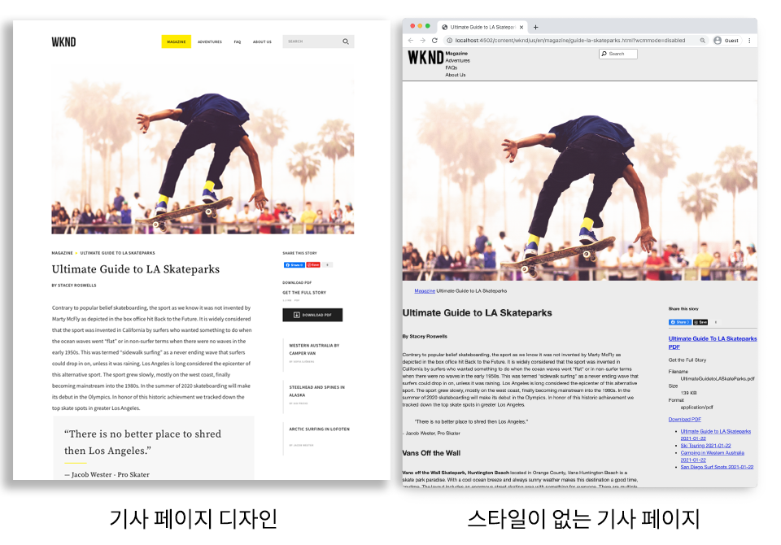
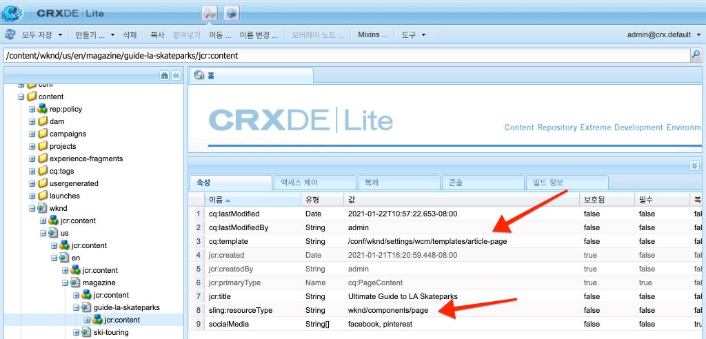
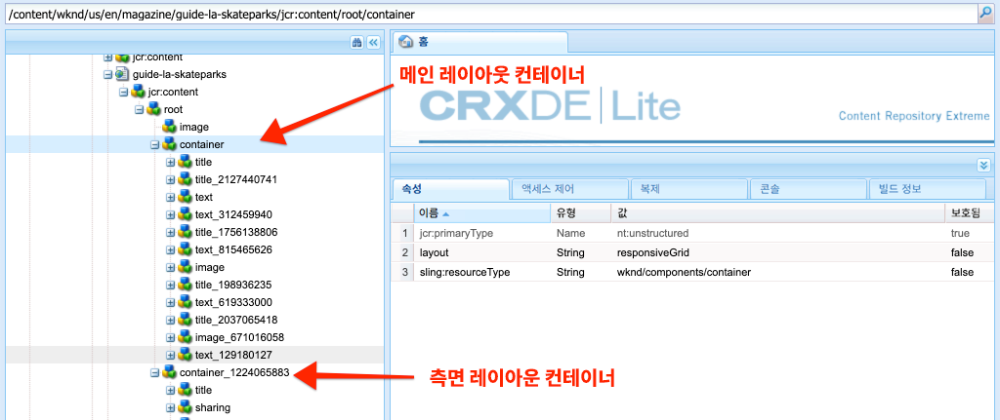
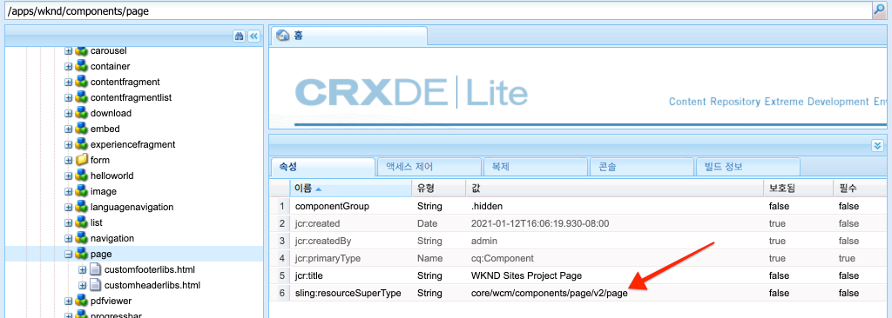
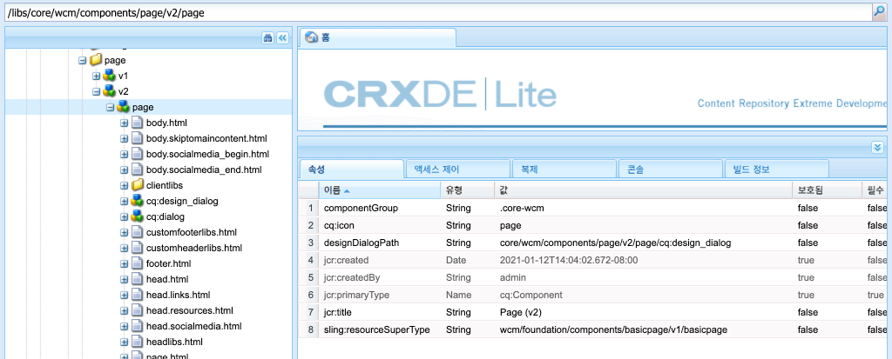

# 페이지 및 템플릿 {#pages-and-template}

이 장에서는 기본 페이지 구성 요소와 편집 가능한 템플릿 간의 관계를 살펴봅니다. [AdobeXD](https://www.adobe.com/products/xd.html)의 일부 초안을 기반으로 스타일이 지정되지 않은 아티클 템플릿을 작성합니다. 템플릿을 작성하는 과정에서 편집 가능한 템플릿의 핵심 구성 요소 및 고급 정책 구성에 대해 다룹니다.

## 전제 조건 {#prerequisites}

[로컬 개발 환경 설정](overview.md#local-dev-environment)에 대한 필수 도구 및 지침을 검토하십시오.

### 시작 프로젝트

>[!NOTE]
>
> 이전 장을 성공적으로 완료한 경우 프로젝트를 다시 사용하고 시작 프로젝트를 체크 아웃하는 단계를 건너뛸 수 있습니다.

튜토리얼이 빌드하는 기본 라인 코드를 확인합니다.

1. [GitHub](https://github.com/adobe/aem-guides-wknd)에서 `tutorial/pages-templates-start` 분기를 확인합니다.

   ```shell
   $ cd ~/code/aem-guides-wknd
   $ git checkout tutorial/pages-templates-start
   ```

1. Maven 기술을 사용하여 로컬 AEM 인스턴스에 코드 베이스를 배포할 수 있습니다.

   ```shell
   $ mvn clean install -PautoInstallSinglePackage
   ```

   >[!NOTE]
   >
   > AEM 6.5 또는 6.4를 사용하는 경우 `classic` 프로파일을 모든 Maven 명령에 추가합니다.

   ```shell
   $ mvn clean install -PautoInstallSinglePackage -Pclassic
   ```

항상 [GitHub](https://github.com/adobe/aem-guides-wknd/tree/pages-templates/solution)에서 완료된 코드를 보거나 분기 `tutorial/pages-templates-solution`로 전환하여 로컬로 코드를 체크 아웃할 수 있습니다.

## 목표

1. Inspect Adobe XD에서 만든 페이지 디자인을 만들어 핵심 구성 요소에 매핑합니다.
1. 편집 가능한 템플릿의 세부 사항과 정책을 사용하여 페이지 컨텐츠를 세부적으로 제어하는 방법을 이해합니다.
1. 템플릿 및 페이지 연결 방법 알아보기

## {#what-you-will-build} 빌드할 항목

자습서의 이 부분에서는 새 아티클 페이지를 만들고 공통 구조에 맞게 정렬할 수 있는 새 아티클 페이지 템플릿을 만듭니다. 아티클 페이지 템플릿은 AdobeXD로 제작된 디자인과 UI 키트를 기반으로 합니다. 이 장은 템플릿의 구조나 뼈대를 빌드하는 데에만 중점을 둡니다. 스타일은 구현되지 않지만 템플릿과 페이지가 작동합니다.



## Adobe XD {#adobexd}의 UI 계획

대부분의 경우 새 웹 사이트를 계획하는 것은 목업 및 정적 디자인으로 시작됩니다. [Adobe ](https://www.adobe.com/products/xd.html) XD는 사용자 경험을 구축하기 위한 디자인 툴입니다. 다음으로 아티클 페이지 템플릿의 구조를 계획하는 데 도움이 되는 UI 키트 및 초안을 검사합니다.

>[!VIDEO](https://video.tv.adobe.com/v/30214/?quality=12&learn=on)

**WKND  [아티클 디자인 파일을 다운로드합니다](https://github.com/adobe/aem-guides-wknd/releases/download/aem-guides-wknd-0.0.2/AEM_UI-kit-WKND-article-design.xd)**.

>[!NOTE]
>
> 일반 [AEM 코어 구성 요소 UI 키트도 사용자 지정 프로젝트의 시작점으로 사용할 수 있습니다](https://experienceleague.adobe.com/docs/experience-manager-learn/assets/AEM-CoreComponents-UI-Kit.xd).

## 아티클 페이지 템플릿 만들기

페이지를 생성할 때 새 페이지를 만드는 기준으로 사용할 템플릿을 선택해야 합니다. 템플릿은 결과 페이지의 구조, 초기 컨텐츠 및 허용된 구성 요소의 구조를 정의합니다.

[편집 가능한 템플릿](https://experienceleague.adobe.com/docs/experience-manager-65/developing/platform/templates/page-templates-editable.html)에는 3개의 기본 영역이 있습니다.

1. **구조**  - 템플릿의 일부인 구성 요소를 정의합니다. 컨텐츠 작성자가 편집할 수 없습니다.
1. **초기 컨텐츠**  - 템플릿이 시작할 구성 요소를 정의하며 컨텐츠 작성자가 편집 및/또는 삭제할 수 있습니다.
1. **정책**  - 구성 요소의 작동 방식과 작성자가 사용할 수 있는 옵션에 대한 구성을 정의합니다.

다음으로 목업의 구조와 일치하는 새 템플릿을 AEM에서 만듭니다. AEM의 로컬 인스턴스에서 발생합니다. 아래 비디오의 단계를 따르십시오.

>[!VIDEO](https://video.tv.adobe.com/v/330991/?quality=12&learn=on)

아래 비디오에 대한 높은 단계:

### 구조 구성

1. **페이지 템플릿 유형**&#x200B;이라는 **아티클 페이지**&#x200B;를 사용하여 새 템플릿을 만듭니다.
1. **구조** 모드로 전환합니다.
1. **경험 조각** 구성 요소를 추가하여 템플릿 맨 위에 **헤더** 역할을 합니다.
   * `/content/experience-fragments/wknd/us/en/site/header/master`을 가리키도록 구성 요소를 구성합니다.
   * 정책을 **페이지 헤더**&#x200B;로 설정하고 **기본 요소**&#x200B;가 `header`로 설정되어 있는지 확인합니다. `header`요소는 다음 장에서 CSS로 타깃팅됩니다.
1. **경험 조각** 구성 요소를 추가하여 템플릿 하단의 **바닥글** 역할을 수행합니다.
   * `/content/experience-fragments/wknd/us/en/site/footer/master`을 가리키도록 구성 요소를 구성합니다.
   * 정책을 **페이지 바닥글**&#x200B;으로 설정하고 **기본 요소**&#x200B;이(가) `footer`로 설정되어 있는지 확인합니다. `footer` 요소는 다음 장에서 CSS로 타깃팅됩니다.
1. 템플릿을 처음 만들 때 포함된 **main** 컨테이너를 잠급니다.
   * 정책을 **페이지 메인**&#x200B;으로 설정하고 **기본 요소**&#x200B;이(가) `main`로 설정되어 있는지 확인합니다. `main` 요소는 다음 장에서 CSS로 타깃팅됩니다.
1. **이미지** 구성 요소를 **main** 컨테이너에 추가합니다.
   * **이미지** 구성 요소의 잠금을 해제합니다.
1. 기본 컨테이너의 **이미지** 구성 요소 아래에 **탐색 표시** 구성 요소를 추가합니다.
   * **Breadcrumb** 구성 요소 **기사 페이지 - 탐색 표시**&#x200B;에 대한 새 정책을 만듭니다. **탐색 시작 수준**&#x200B;을 **4**&#x200B;로 설정합니다.
1. **탐색 표시** 구성 요소 아래에 그리고 **main** 컨테이너 내에 **컨테이너** 구성 요소를 추가합니다. 이것은 템플릿의 **컨텐트 컨테이너** 역할을 합니다.
   * **컨텐트** 컨테이너의 잠금을 해제합니다.
   * 정책을 **페이지 컨텐츠**&#x200B;로 설정합니다.
1. **컨텐트 컨테이너** 아래에 다른 **컨테이너** 구성 요소를 추가합니다. 템플릿의 **사이드 레일** 컨테이너 역할을 합니다.
   * **사이드 레일** 컨테이너의 잠금을 해제합니다.
   * **아티클 페이지 - 사이드 레일**&#x200B;이라는 새 정책을 만듭니다.
   * **WKND 사이트 프로젝트 - 컨텐트**&#x200B;에 **허용된 구성 요소**&#x200B;를 다음 항목을 포함하도록 구성합니다.**단추**, **다운로드**, **이미지**, **목록**, **구분 문자**, **소셜 미디어 공유**, **텍스트** 및 **제목**.
1. 페이지 루트 컨테이너의 정책을 업데이트합니다. 템플릿에서 가장 바깥쪽 컨테이너입니다. 정책을 **페이지 루트**&#x200B;로 설정합니다.
   * **컨테이너 설정**&#x200B;에서 **레이아웃**&#x200B;을 **응답형 격자**&#x200B;로 설정합니다.
1. **컨텐트 컨테이너**&#x200B;에 대한 레이아웃 모드 참여 핸들을 오른쪽에서 왼쪽으로 드래그하고 8열 너비로 컨테이너를 축소합니다.
1. **사이드 레일 컨테이너**&#x200B;에 대해 레이아웃 모드 참여를 참조하십시오. 핸들을 오른쪽에서 왼쪽으로 드래그하고 4열 너비로 컨테이너를 축소합니다. 그런 다음 왼쪽 핸들을 왼쪽에서 오른쪽 1열로 드래그하여 컨테이너 3개의 열을 너비로 만들고 **컨텐트 컨테이너** 사이에 1개의 열 간격을 유지합니다.
1. 모바일 에뮬레이터를 열고 모바일 중단점으로 전환합니다. 레이아웃 모드를 다시 시작하고 **컨텐츠 컨테이너** 및 **사이드 레일 컨테이너**&#x200B;의 전체 페이지 너비로 만듭니다. 이렇게 하면 모바일 중단점에서 컨테이너가 세로로 스택됩니다.
1. **컨텐트 컨테이너**&#x200B;에서 **Text** 구성 요소의 정책을 업데이트합니다.
   * 정책을 **콘텐츠 텍스트**&#x200B;로 설정합니다.
   * **플러그인** > **단락 스타일**&#x200B;에서 **단락 스타일 사용**&#x200B;을 선택하고 **견적 블록**&#x200B;이(가) 활성화되어 있는지 확인합니다.

### 초기 컨텐츠 구성

1. **초기 내용** 모드로 전환합니다.
1. **제목** 구성 요소를 **컨텐트 컨테이너**&#x200B;에 추가합니다. 아티클 제목이 됩니다. 비워 두면 현재 페이지의 제목이 자동으로 표시됩니다.
1. 첫 번째 제목 구성 요소 아래에 두 번째 **제목** 구성 요소를 추가합니다.
   * 텍스트를 사용하여 구성 요소를 구성합니다.&quot;작성자별&quot;. 텍스트 자리 표시자가 됩니다.
   * 유형을 `H4`으로 설정합니다.
1. **작성자** 제목 구성 요소 아래에 **텍스트** 구성 요소를 추가합니다.
1. **제목** 구성 요소를 **사이드 레일 컨테이너**&#x200B;에 추가합니다.
   * 텍스트를 사용하여 구성 요소를 구성합니다.&quot;이 스토리 공유&quot;를 참조하십시오.
   * 유형을 `H5`으로 설정합니다.
1. **이 스토리 공유** 제목 구성 요소 아래에 **소셜 미디어 공유** 구성 요소를 추가합니다.
1. **소셜 미디어 공유** 구성 요소 아래에 **Separator** 구성 요소를 추가합니다.
1. **Separator** 구성 요소 아래에 **다운로드** 구성 요소를 추가합니다.
1. **다운로드** 구성 요소 아래에 **목록** 구성 요소를 추가합니다.
1. 템플릿에 대한 **초기 페이지 속성**&#x200B;을 업데이트합니다.
   * **소셜 미디어** > **소셜 미디어 공유**&#x200B;에서 **Facebook** 및 **Pinterest**&#x200B;을 선택합니다.

### 템플릿을 활성화하고 축소판 추가

1. [http://localhost:4502/libs/wcm/core/content/sites/templates.html/conf/wknd](http://localhost:4502/libs/wcm/core/content/sites/templates.html/conf/wknd)으로 이동하여 템플릿 콘솔에서 템플릿 보기
1. **아티클** 페이지 템플릿을 활성화합니다.
1. 아티클 페이지 템플릿의 속성을 편집하고 다음 축소판을 업로드하여 아티클 페이지 템플릿을 사용하여 만든 페이지를 빠르게 식별할 수 있습니다.

   

## 경험 조각 {#experience-fragments}으로 머리글 및 바닥글 업데이트

머리글 또는 바닥글과 같은 글로벌 컨텐츠를 만들 때 일반적으로 사용하는 방법은 [경험 조각](https://docs.adobe.com/content/help/en/experience-manager-learn/sites/experience-fragments/experience-fragments-feature-video-use.html)을 사용하는 것입니다. 경험 조각을 사용하면 여러 구성 요소를 결합하여 하나의 참조 가능 구성 요소를 만들 수 있습니다. 경험 조각은 다중 사이트 관리 및 [현지화](https://experienceleague.adobe.com/docs/experience-manager-core-components/using/components/experience-fragment.html?lang=en#localized-site-structure)를 지원하는 이점이 있습니다.

AEM 프로젝트 원형이 머리글과 바닥글을 생성했습니다. 다음으로 경험 조각을 업데이트하여 목업을 일치시킵니다. 아래 비디오의 단계를 따르십시오.

>[!VIDEO](https://video.tv.adobe.com/v/330992/?quality=12&learn=on)

아래 비디오에 대한 높은 단계:

1. 샘플 콘텐츠 패키지 **[WKND-PagesTemplates-Content-Assets.zip](assets/pages-templates/WKND-PagesTemplates-Content-Assets.zip)**&#x200B;을 다운로드합니다.
1. [http://localhost:4502/crx/packmgr/index.jsp](http://localhost:4502/crx/packmgr/index.jsp)에서 Package Manager를 사용하여 컨텐트 패키지를 업로드 및 설치합니다.
1. [http://localhost:4502/editor.html/conf/wknd/settings/wcm/templates/xf-web-variation/structure.html](http://localhost:4502/editor.html/conf/wknd/settings/wcm/templates/xf-web-variation/structure.html)에서 경험 조각에 사용되는 템플릿인 웹 변형 템플릿을 업데이트합니다.
   * 템플릿의 **Container** 구성 요소로 정책을 업데이트합니다.
   * 정책을 **XF 루트**&#x200B;로 설정합니다.
   * **허용된 구성 요소** 아래에서 **언어 탐색**, **탐색** 및 **빠른 검색** 구성 요소를 포함할 구성 요소 그룹 **WKND 사이트 프로젝트 - 구조**&#x200B;을 선택합니다.

### 헤더 경험 조각 업데이트

1. 헤더를 렌더링하는 경험 조각을 [http://localhost:4502/editor.html/content/experience-fragments/wknd/us/en/site/header/master.html](http://localhost:4502/editor.html/content/experience-fragments/wknd/us/en/site/header/master.html)에서 엽니다.
1. 조각의 루트 **컨테이너**&#x200B;를 구성합니다. 가장 바깥쪽 **컨테이너**&#x200B;입니다.
   * **레이아웃**&#x200B;을 **응답형 격자**&#x200B;로 설정합니다.
1. **WKND Dark 로고**&#x200B;를 **Container**&#x200B;의 맨 위에 이미지로 추가합니다. 이전 단계에서 설치된 패키지에 로고가 포함되었습니다.
   * **WKND 다크 로고**&#x200B;의 레이아웃을 전체 **2**&#x200B;열로 수정합니다. 핸들을 오른쪽에서 왼쪽으로 드래그합니다.
   * &quot;WKND 로고&quot;의 **대체 텍스트**&#x200B;로 로고를 구성합니다.
   * 로고를 [홈] 페이지에서 `/content/wknd/us/en`에 **링크**&#x200B;로 구성합니다.
1. 페이지에 이미 있는 **내비게이션** 구성 요소를 구성합니다.
   * **루트 수준 제외**&#x200B;를 **1**&#x200B;으로 설정합니다.
   * **내비게이션 구조 깊이**&#x200B;를 **1**&#x200B;으로 설정합니다.
   * **내비게이션** 구성 요소의 레이아웃을 전체 **8**&#x200B;열로 수정합니다. 핸들을 오른쪽에서 왼쪽으로 드래그합니다.
1. **언어 탐색** 구성 요소를 제거합니다.
1. **검색** 구성 요소의 레이아웃을 전체 **2**&#x200B;열로 수정합니다. 핸들을 오른쪽에서 왼쪽으로 드래그합니다. 이제 모든 구성 요소가 단일 행에 수평으로 정렬되어야 합니다.

### 바닥글 경험 조각 업데이트

1. [http://localhost:4502/editor.html/content/experience-fragments/wknd/us/en/site/footer/master.html](http://localhost:4502/editor.html/content/experience-fragments/wknd/us/en/site/footer/master.html)에서 바닥글을 렌더링하는 경험 조각을 엽니다.
1. 조각의 루트 **컨테이너**&#x200B;를 구성합니다. 가장 바깥쪽 **컨테이너**&#x200B;입니다.
   * **레이아웃**&#x200B;을 **응답형 격자**&#x200B;로 설정합니다.
1. **WKND 라이트 로고**&#x200B;를 **Container**&#x200B;의 맨 위에 이미지로 추가합니다. 이전 단계에서 설치된 패키지에 로고가 포함되었습니다.
   * **WKND 라이트 로고**&#x200B;의 레이아웃을 전체 **2**&#x200B;열로 수정합니다. 핸들을 오른쪽에서 왼쪽으로 드래그합니다.
   * &quot;WKND 로고 라이트&quot;의 **대체 텍스트**&#x200B;로 로고를 구성합니다.
   * 로고를 [홈] 페이지에서 `/content/wknd/us/en`에 **링크**&#x200B;로 구성합니다.
1. 로고 아래에 **내비게이션** 구성 요소를 추가합니다. **내비게이션** 구성 요소를 구성합니다.
   * **루트 수준 제외**&#x200B;를 **1**&#x200B;으로 설정합니다.
   * **모든 하위 페이지 수집**&#x200B;의 선택을 취소합니다.
   * **내비게이션 구조 깊이**&#x200B;를 **1**&#x200B;으로 설정합니다.
   * **내비게이션** 구성 요소의 레이아웃을 전체 **8**&#x200B;열로 수정합니다. 핸들을 오른쪽에서 왼쪽으로 드래그합니다.

## 아티클 페이지 만들기

그런 다음 아티클 페이지 템플릿을 사용하여 새 페이지를 만듭니다. 사이트 목업에 맞게 페이지의 컨텐츠를 작성합니다. 아래 비디오의 단계를 따르십시오.

>[!VIDEO](https://video.tv.adobe.com/v/330993/?quality=12&learn=on)

아래 비디오에 대한 높은 단계:

1. [http://localhost:4502/sites.html/content/wknd/us/en/magazine](http://localhost:4502/sites.html/content/wknd/us/en/magazine)의 사이트 콘솔로 이동합니다.
1. **WKND** > **US** > **EN** > **Magazine** 아래에 새 페이지를 만듭니다.
   * **아티클 페이지** 템플릿을 선택합니다.
   * **Properties**&#x200B;에서 **Title**&#x200B;을(를) &quot;LA Skatestparks에 대한 최종 가이드&quot;로 설정합니다.
   * **Name**&#x200B;을 &quot;guide-la-skateparks&quot;로 설정합니다.
1. **작성자** 제목별로 &quot;Stacey Roswels별&quot; 텍스트를 대체합니다.
1. 아티클을 채울 단락을 포함하도록 **Text** 구성 요소를 업데이트합니다. 다음 텍스트 파일을 복사본으로 사용할 수 있습니다.[la-sketate-parks-copy.txt](assets/pages-templates/la-skateparks-copy.txt).
1. 다른 **텍스트** 구성 요소를 추가합니다.
   * 견적을 포함하도록 구성 요소를 업데이트합니다.&quot;LA를 떠날 곳이 없다.&quot;
   * 전체 화면 모드에서 리치 텍스트 편집기를 편집하고 위의 견적을 수정하여 **견적 블록** 요소를 사용합니다.
1. 목업에 맞게 아티클의 본문을 계속 채울 수 있습니다.
1. PDF 버전의 아티클을 사용하도록 **다운로드** 구성 요소를 구성합니다.
   * **다운로드** > **속성**&#x200B;에서 **DAM 자산에서 제목 가져오기**&#x200B;의 확인란을 클릭합니다.
   * **설명**&#x200B;을(를) 다음으로 설정합니다.&quot;전체 스토리 얻기&quot;
   * **작업 텍스트**&#x200B;를 다음과 같이 설정합니다.&quot;PDF 다운로드&quot;를 참조하십시오.
1. **목록** 구성 요소를 구성합니다.
   * **목록 설정** > **목록 작성 사용**&#x200B;에서 **하위 페이지**&#x200B;를 선택합니다.
   * **상위 페이지**&#x200B;를 `/content/wknd/us/en/magazine`로 설정합니다.
   * **항목 설정**&#x200B;링크 항목&#x200B;**을 선택하고**&#x200B;날짜 표시&#x200B;**를 선택합니다.**

## Inspect 노드 구조 {#node-structure}

이 시점에서 아티클 페이지는 분명히 스타일이 적용되지 않습니다. 하지만 기본 구조가 제자리에 있습니다. 다음으로 템플릿, 페이지 및 구성 요소의 역할에 대한 이해를 높이기 위해 아티클 페이지의 노드 구조를 검사합니다.

로컬 AEM 인스턴스에서 CRXDE-Lite 도구를 사용하여 기본 노드 구조를 봅니다.

1. [CRXDE-Lite](http://localhost:4502/crx/de/index.jsp#/content/wknd/us/en/magazine/guide-la-skateparks/jcr%3Acontent)를 열고 트리 탐색을 사용하여 `/content/wknd/us/en/magazine/guide-la-skateparks`로 이동합니다.

1. `la-skateparks` 페이지 아래의 `jcr:content` 노드를 클릭하고 속성을 확인합니다.

   

   `cq:template` 값은 이전에 만든 아티클 페이지 템플릿을 가리키는 `/conf/wknd/settings/wcm/templates/article-page` 값입니다.

   또한 `wknd/components/page`을 가리키는 `sling:resourceType` 값도 확인합니다. AEM 프로젝트 원형에서 만든 페이지 구성 요소이며 템플릿을 기반으로 페이지를 렌더링합니다.

1. `/content/wknd/us/en/magazine/guide-la-skateparks/jcr:content` 아래의 `jcr:content` 노드를 확장하고 노드 계층을 봅니다.

   

   각 노드를 저작된 구성 요소에 느슨하게 매핑할 수 있어야 합니다. `container`에 접두어가 붙은 노드를 검사하여 사용되는 다른 레이아웃 컨테이너를 식별할 수 있는지 확인하십시오.

1. 다음으로 페이지 구성 요소를 `/apps/wknd/components/page`에 검사합니다. CRXDE Lite에서 구성 요소 속성 보기:

   

   페이지 구성 요소 아래에는 2개의 HTL 스크립트, `customfooterlibs.html` 및 `customheaderlibs.html`만 있습니다. *그러면 이 구성 요소가 페이지를 어떻게 렌더링합니까?*

   `sling:resourceSuperType` 속성은 `core/wcm/components/page/v2/page`을(를) 가리킵니다. 이 속성을 사용하면 WKND의 페이지 구성 요소가 핵심 구성 요소 페이지 구성 요소의 기능 중 **모든**&#x200B;을 상속할 수 있습니다. 이것은 [프록시 구성 요소 패턴](https://docs.adobe.com/content/help/en/experience-manager-core-components/using/developing/guidelines.html#ProxyComponentPattern)이라는 이름의 첫 번째 예입니다. 자세한 내용은 [여기에서 찾을 수 있습니다.](https://docs.adobe.com/content/help/en/experience-manager-core-components/using/developing/guidelines.html).

1. WKND 구성 요소 내의 다른 구성 요소인 `Breadcrumb` 구성 요소는 다음 위치에 있습니다.`/apps/wknd/components/breadcrumb`. 동일한 `sling:resourceSuperType` 속성을 찾을 수 있지만 이번에는 `core/wcm/components/breadcrumb/v2/breadcrumb`을 가리킵니다. 프록시 구성 요소 패턴을 사용하여 핵심 구성 요소를 포함하는 또 다른 예입니다. 실제로 WKND 코드 베이스의 모든 구성 요소는 AEM 코어 구성 요소의 프록시입니다(유명한 HelloWorld 구성 요소 제외). 사용자 지정 코드를 쓰기 전에 *의 핵심 구성 요소 기능을 최대한 다시 사용하는 것이 좋습니다.*

1. 다음으로 CRXDE Lite을 사용하여 `/libs/core/wcm/components/page/v2/page`의 핵심 구성 요소 페이지를 검사합니다.

   >[!NOTE]
   >
   > AEM 6.5/6.4에서 핵심 구성 요소는 `/apps/core/wcm/components` 아래에 있습니다. AEM에서 Cloud Service으로 핵심 구성 요소는 `/libs` 아래에 있으며 자동으로 업데이트됩니다.

   

   이 페이지 아래에 더 많은 스크립트가 포함되어 있습니다. 핵심 구성 요소 페이지에는 많은 기능이 포함되어 있습니다. 이 기능은 유지 관리와 가독성을 용이하게 하기 위해 여러 스크립트로 분할됩니다. `page.html`을 열고 `data-sly-include`을 찾아 HTL 스크립트 포함을 추적할 수 있습니다.

   ```html
   <!--/* /libs/core/wcm/components/page/v2/page/page.html */-->
   <!DOCTYPE HTML>
   <html data-sly-use.page="com.adobe.cq.wcm.core.components.models.Page" lang="${page.language}"
       data-sly-use.head="head.html"
       data-sly-use.footer="footer.html"
       data-sly-use.redirect="redirect.html">
       <head data-sly-call="${head.head @ page = page}"></head>
       <body class="${page.cssClassNames}"
           id="${page.id}"
           data-cmp-data-layer-enabled="${page.data ? true : false}">
           <script data-sly-test.dataLayerEnabled="${page.data}">
           window.adobeDataLayer = window.adobeDataLayer || [];
           adobeDataLayer.push({
               page: JSON.parse("${page.data.json @ context='scriptString'}"),
               event:'cmp:show',
               eventInfo: {
                   path: 'page.${page.id @ context="scriptString"}'
               }
           });
           </script>
           <sly data-sly-test.isRedirectPage="${page.redirectTarget && (wcmmode.edit || wcmmode.preview)}"
               data-sly-call="${redirect.redirect @ redirectTarget = page.redirectTarget}"></sly>
           <sly data-sly-test="${!isRedirectPage}">
               <sly data-sly-include="body.skiptomaincontent.html"></sly>
               <sly data-sly-include="body.socialmedia_begin.html"></sly>
               <sly data-sly-include="body.html"></sly>
               <sly data-sly-call="${footer.footer @ page = page}"></sly>
               <sly data-sly-include="body.socialmedia_end.html"></sly>
           </sly>
       </body>
   </html>
   ```

   HTL을 여러 스크립트로 분할하는 다른 이유는 프록시 구성 요소가 개별 스크립트를 재정의하여 사용자 지정 비즈니스 논리를 구현할 수 있도록 허용하기 때문입니다. HTL 스크립트 `customfooterlibs.html` 및 `customheaderlibs.html`은 프로젝트를 구현하여 재정의할 명시적 목적으로 만들어집니다.

   이 문서](https://experienceleague.adobe.com/docs/experience-manager-65/developing/platform/templates/page-templates-editable.html)를 읽고 편집 가능한 템플릿이 [컨텐트 페이지 렌더링에 어떻게 영향을 주는지 자세히 알 수 있습니다.

1. 다른 핵심 구성 요소(예: `/libs/core/wcm/components/breadcrumb/v2/breadcrumb`의 브레드크럼). `breadcrumb.html` 스크립트를 보고 탐색 표시 구성 요소의 마크업이 최종적으로 어떻게 생성되는지 알아보십시오.

## 소스 제어 {#configuration-persistence}에 구성 저장

대부분의 경우, 특히 AEM 프로젝트를 시작할 때는 템플릿 및 관련 컨텐츠 정책과 같은 구성을 소스 제어에 유지하는 것이 중요합니다. 이렇게 하면 모든 개발자가 동일한 컨텐츠 및 구성 세트를 사용하여 작업하고 환경 간에 추가적인 일관성을 유지할 수 있습니다. 프로젝트가 특정 수준의 성숙도에 도달하면 템플릿 관리 방식을 고급 사용자 그룹으로 전환할 수 있습니다.

이제 템플릿을 다른 코드 조각처럼 취급하고 **아티클 페이지 템플릿** 다운을 프로젝트의 일부로 동기화합니다. 지금까지 AEM 프로젝트에서 AEM의 로컬 인스턴스로 **푸시된** 코드가 있습니다. **아티클 페이지 템플릿**&#x200B;이(가) AEM의 로컬 인스턴스에서 직접 만들어졌기 때문에 AEM 프로젝트로 템플릿을 **import**&#x200B;해야 합니다. 이 특정 목적을 위해 **ui.content** 모듈이 AEM 프로젝트에 포함됩니다.

다음 몇 단계는 [VSCode AEM Sync](https://marketplace.visualstudio.com/items?itemName=yamato-ltd.vscode-aem-sync&amp;ssr=false#overview) 플러그인을 사용하여 VSCode IDE를 사용하여 수행되지만 **import**&#x200B;로 구성했거나 AEM의 로컬 인스턴스에서 컨텐츠를 가져오는 모든 IDE를 사용할 수 있습니다.

1. VSCode에서 `aem-guides-wknd` 프로젝트를 엽니다.

1. 프로젝트 탐색기에서 **ui.content** 모듈을 확장합니다. `src` 폴더를 확장하고 `/conf/wknd/settings/wcm/templates`로 이동합니다.

1. [!UICONTROL 폴더를 ] 마우스 오른쪽 단추로  `templates` 클릭하고  **AEM 서버에서 가져오기**:

   

   `article-page`을(를) 가져오고 `page-content`, `xf-web-variation` 템플릿도 업데이트해야 합니다.

   

1. 내용을 가져오려면 단계를 반복하지만 `/conf/wknd/settings/wcm/policies`에 있는 **policies** 폴더를 선택합니다.

   

1. Inspect은 `ui.content/src/main/content/META-INF/vault/filter.xml`에 있는 `filter.xml` 파일을 반환합니다.

   ```xml
   <!--ui.content filter.xml-->
   <?xml version="1.0" encoding="UTF-8"?>
   <workspaceFilter version="1.0">
       <filter root="/conf/wknd" mode="merge"/>
       <filter root="/content/wknd" mode="merge"/>
       <filter root="/content/dam/wknd" mode="merge"/>
       <filter root="/content/experience-fragments/wknd" mode="merge"/>
   </workspaceFilter>
   ```

   `filter.xml` 파일은 패키지와 함께 설치할 노드의 경로를 식별합니다. 기존 컨텐츠가 수정되지 않고 새 컨텐츠만 추가됨을 나타내는 각 필터에 `mode="merge"`이 표시됩니다. 컨텐츠 작성자는 이러한 경로를 업데이트할 수 있으므로 코드 배포에서는 **이 컨텐츠를 덮어쓰지 않는**&#x200B;이(가) 있어야 합니다. 필터 요소 작업에 대한 자세한 내용은 [FileVault 설명서](https://jackrabbit.apache.org/filevault/filter.html)를 참조하십시오.

   각 모듈에서 관리하는 다른 노드를 이해하려면 `ui.content/src/main/content/META-INF/vault/filter.xml` 및 `ui.apps/src/main/content/META-INF/vault/filter.xml`을 비교하십시오.

   >[!WARNING]
   >
   > WKND 참조 사이트에 대한 일관된 배포를 위해 프로젝트의 일부 분기가 설정되므로 `ui.content`이 JCR의 모든 변경 사항을 덮어씁니다. 코드/스타일은 특정 정책에 맞게 작성되므로 솔루션 분기(예: 솔루션 분기)에 대한 디자인 기준입니다.

## 축하합니다!{#congratulations}

축하합니다. Adobe Experience Manager Sites에서 새 템플릿과 페이지를 만들었습니다.

### 다음 단계 {#next-steps}

이 시점에서 아티클 페이지는 분명히 스타일이 적용되지 않습니다. CSS 및 Javascript를 포함하여 전역 스타일을 사이트에 적용하고 전용 프런트 엔드 빌드를 통합하는 모범 사례를 살펴보려면 [클라이언트측 라이브러리 및 프런트 엔드 워크플로우](client-side-libraries.md) 자습서를 따르십시오.

[GitHub](https://github.com/adobe/aem-guides-wknd)에서 완료된 코드를 보거나 Git brach `tutorial/pages-templates-solution`에서 코드를 로컬로 검토 및 배포합니다.

1. [github.com/adobe/aem-wknd-guides](https://github.com/adobe/aem-guides-wknd) 저장소를 복제합니다.
1. `tutorial/pages-templates-solution` 분기를 확인합니다.
