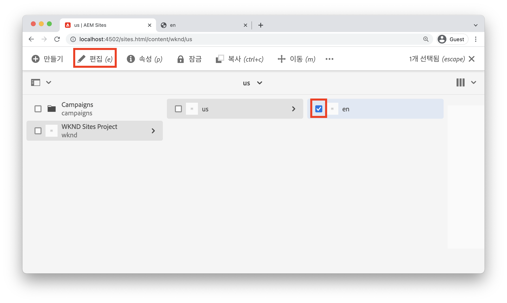
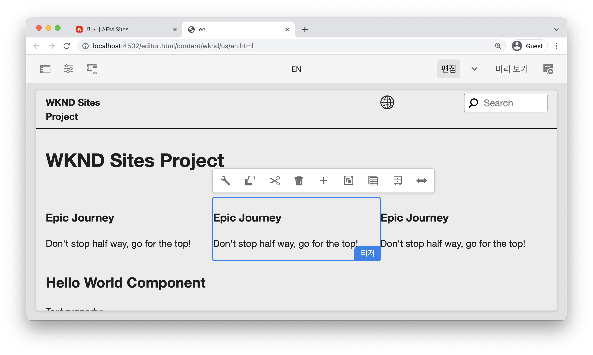
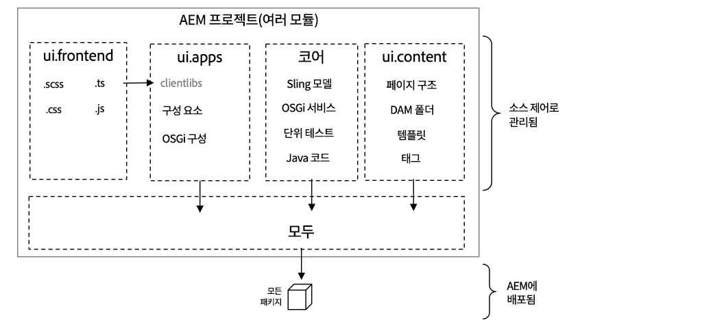
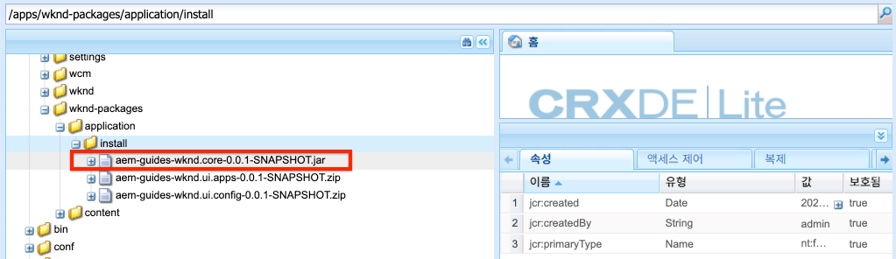
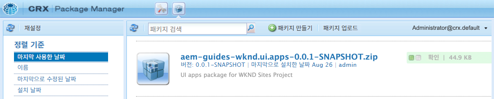

# 프로젝트 설정 {#project-setup}

이 자습서에서는 Adobe Experience Manager 사이트에 대한 코드 및 구성을 관리하기 위한 Maven 다중 모듈 프로젝트 만들기 를 다룹니다.

## 전제 조건 {#prerequisites}

[로컬 개발 환경](../overview.md#local-dev-environment)을 설정하는 데 필요한 도구 및 지침을 검토하십시오. 로컬에서 사용할 수 있는 Adobe Experience Manager의 새 인스턴스가 있고 추가 샘플/데모 패키지가 설치되어 있지 않은지(필수 서비스 팩 제외) 확인하십시오.

## 목표 {#objective}

1. Maven 원형 을 사용하여 새 AEM 프로젝트를 생성하는 방법을 알아봅니다.
1. AEM Project Archetype에서 생성한 다양한 모듈과 이러한 모듈이 어떻게 함께 작동하는지를 이해합니다.
1. AEM 핵심 구성 요소가 AEM 프로젝트에 포함되는 방법을 이해합니다.

## {#what-build} 빌드할 내용

>[!VIDEO](https://video.tv.adobe.com/v/30152/?quality=12&learn=on)

이 장에서는 [AEM Project Archetype](https://github.com/adobe/aem-project-archetype)을 사용하여 새 Adobe Experience Manager 프로젝트를 생성합니다. AEM 프로젝트에는 Sites 구현에 사용되는 모든 코드, 콘텐츠 및 구성이 포함되어 있습니다. 이 장에서 생성된 프로젝트는 WKND Site의 구현 기반 역할을 하며, 향후 장에 구축됩니다.

**Maven 프로젝트란?** -  [Apache ](https://maven.apache.org/) Mabanis 는 프로젝트를 제작하기 위한 소프트웨어 관리 도구입니다. *모든 Adobe Experience* Manager 구현은 Maven 프로젝트를 사용하여 AEM 맨 위에 사용자 지정 코드를 작성, 관리 및 배포합니다.

**Maven 원형은 무엇입니까?** - Maven  [원형은 ](https://maven.apache.org/archetype/index.html) 새 프로젝트를 생성하기 위한 템플릿 또는 패턴입니다. AEM 프로젝트 원형을 사용하면 사용자 지정 네임스페이스로 새 프로젝트를 생성하고 우수 사례를 따르는 프로젝트 구조를 포함하여 프로젝트를 크게 가속화할 수 있습니다.

## 프로젝트를 만듭니다 {#create}

AEM용 Maven 다중 모듈 프로젝트를 만드는 두 가지 옵션이 있습니다. 이 자습서에서는 [Maven AEM Project Archetype **26**](https://github.com/adobe/aem-project-archetype)을 활용합니다. Cloud Manager도 [AEM 애플리케이션 프로젝트 만들기를 시작하는 UI 마법사](https://docs.adobe.com/content/help/en/experience-manager-cloud-manager/using/getting-started/create-an-application-project.html)를 제공합니다. Cloud Manager UI에서 생성한 기본 프로젝트는 원형 그대로 사용하는 구조와 같습니다.

>[!NOTE]
>
>이 자습서에서는 원형 버전 **26**&#x200B;을 사용합니다. 항상 원형 중 **최신** 버전을 사용하여 새 프로젝트를 생성하는 것이 좋습니다.

다음 일련의 단계는 UNIX 기반 명령줄 단말을 사용하여 수행되지만 Windows 단말을 사용하는 경우에는 유사해야 합니다.

1. 명령줄 터미널을 엽니다. Maven이 설치되어 있는지 확인합니다.

   ```shell
   $ mvn --version
   Apache Maven 3.6.2
   Maven home: /Library/apache-maven-3.6.2
   Java version: 11.0.4, vendor: Oracle Corporation, runtime: /Library/Java/JavaVirtualMachines/jdk-11.0.4.jdk/Contents/Home
   ```

1. 다음 명령을 실행하여 **adobe-public** 프로필이 활성 상태인지 확인합니다.

   ```shell
   $ mvn help:effective-settings
       ...
   <activeProfiles>
       <activeProfile>adobe-public</activeProfile>
   </activeProfiles>
   <pluginGroups>
       <pluginGroup>org.apache.maven.plugins</pluginGroup>
       <pluginGroup>org.codehaus.mojo</pluginGroup>
   </pluginGroups>
   </settings>
   [INFO] ------------------------------------------------------------------------
   [INFO] BUILD SUCCESS
   [INFO] ------------------------------------------------------------------------
   [INFO] Total time:  0.856 s
   ```

   **이**&#x200B;표시되지 않으면 **adobe-public**&#x200B;이(가) `~/.m2/settings.xml` 파일에서 Adobe 보고서가 제대로 참조되지 않음을 나타내는 것입니다. 로컬 개발 환경](https://docs.adobe.com/content/help/en/experience-manager-learn/foundation/development/set-up-a-local-aem-development-environment.html#install-apache-maven)에서 Apache Maven을 설치하고 구성하는 단계를 다시 방문하여 알아보십시오.[

1. AEM 프로젝트를 생성할 디렉토리로 이동합니다. 이 디렉토리는 프로젝트의 소스 코드를 유지 관리할 모든 디렉토리일 수 있습니다. 예를 들어, 사용자의 홈 디렉토리 아래에 `code`라는 디렉토리가 있습니다.

   ```shell
   $ cd ~/code
   ```

1. 다음 내용을 명령줄에서 [일괄 처리 모드](https://maven.apache.org/archetype/maven-archetype-plugin/examples/generate-batch.html)로 프로젝트를 생성합니다.

   ```shell
   mvn -B archetype:generate \
       -D archetypeGroupId=com.adobe.aem \
       -D archetypeArtifactId=aem-project-archetype \
       -D archetypeVersion=26 \
       -D appTitle="WKND Sites Project" \
       -D appId="wknd" \
       -D groupId="com.adobe.aem.guides.wknd" \
       -D artifactId="aem-guides-wknd" \
       -D version="0.0.1-SNAPSHOT" \
       -D aemVersion="cloud"
   ```

   >[!NOTE]
   >
   > AEM 6.5.5+를 타깃팅하는 경우 `aemVersion="cloud"`을 `aemVersion="6.5.5"`(으)로 바꿉니다. 6.4.8+를 타깃팅하는 경우 `aemVersion="6.4.8"` 을 사용하십시오.

   프로젝트 [를 구성하는 데 사용할 수 있는 속성의 전체 목록은 여기에서 찾을 수 있습니다](https://github.com/adobe/aem-project-archetype#available-properties).

1. 다음 폴더 및 파일 구조는 로컬 파일 시스템의 Maven 원형에 의해 생성됩니다.

   ```plain
    ~/code/
       |--- aem-guides-wknd/
           |--- all/
           |--- core/
           |--- ui.apps/
           |--- ui.apps.structure/
           |--- ui.config/
           |--- ui.content/
           |--- ui.frontend/
           |--- ui.tests /
           |--- it.tests/
           |--- dispatcher/
           |--- analyse/
           |--- pom.xml
           |--- README.md
           |--- .gitignore
   ```

## 프로젝트 배포 및 빌드 {#build}

프로젝트 코드를 작성하고 AEM의 로컬 인스턴스에 배포합니다.

1. 포트 **4502**&#x200B;에서 로컬로 실행되는 AEM의 작성자 인스턴스가 있는지 확인합니다.
1. 명령줄에서 `aem-guides-wknd` 프로젝트 디렉토리로 이동합니다.

   ```shell
   $ cd aem-guides-wknd
   ```

1. 다음 명령을 실행하여 전체 프로젝트를 AEM에 빌드 및 배포합니다.

   ```shell
   $ mvn clean install -PautoInstallSinglePackage
   ```

   빌드는 약 1분 정도 걸리며 다음 메시지로 끝나야 합니다.

   ```
   ...
   [INFO] ------------------------------------------------------------------------
   [INFO] Reactor Summary for aem-guides-wknd 0.0.1-SNAPSHOT:
   [INFO]
   [INFO] aem-guides-wknd .................................... SUCCESS [  0.269 s]
   [INFO] WKND Sites Project - Core .......................... SUCCESS [  8.047 s]
   [INFO] WKND Sites Project - UI Frontend ................... SUCCESS [01:02 min]
   [INFO] WKND Sites Project - Repository Structure Package .. SUCCESS [  1.985 s]
   [INFO] WKND Sites Project - UI apps ....................... SUCCESS [  8.037 s]
   [INFO] WKND Sites Project - UI content .................... SUCCESS [  4.672 s]
   [INFO] WKND Sites Project - UI config ..................... SUCCESS [  0.313 s]
   [INFO] WKND Sites Project - All ........................... SUCCESS [  0.270 s]
   [INFO] WKND Sites Project - Integration Tests ............. SUCCESS [ 15.571 s]
   [INFO] WKND Sites Project - Dispatcher .................... SUCCESS [  0.232 s]
   [INFO] WKND Sites Project - UI Tests ...................... SUCCESS [  0.728 s]
   [INFO] WKND Sites Project - Project Analyser .............. SUCCESS [ 33.398 s]
   [INFO] ------------------------------------------------------------------------
   [INFO] BUILD SUCCESS
   [INFO] ------------------------------------------------------------------------
   [INFO] Total time:  02:18 min
   [INFO] Finished at: 2021-01-31T12:33:56-08:00
   [INFO] ------------------------------------------------------------------------
   ```

   Maven 프로필 `autoInstallSinglePackage`은 프로젝트의 개별 모듈을 컴파일하고 단일 패키지를 AEM 인스턴스에 배포합니다. 기본적으로 이 패키지는 **4502** 포트에서 로컬로 실행되고 `admin:admin` 자격 증명과 함께 AEM 인스턴스에 배포됩니다.

1. 로컬 AEM 인스턴스의 패키지 관리자로 이동합니다.[http://localhost:4502/crx/packmgr/index.jsp](http://localhost:4502/crx/packmgr/index.jsp) `aem-guides-wknd.ui.apps`, `aem-guides-wknd.ui.config`, `aem-guides-wknd.ui.content` 및 `aem-guides-wknd.all`에 대한 패키지가 표시됩니다.

1. 사이트 콘솔로 이동합니다.[http://localhost:4502/sites.html/content](http://localhost:4502/sites.html/content) WKND 사이트가 사이트 중 하나가 됩니다. 여기에는 미국 및 언어 마스터 계층 구조를 가진 사이트 구조가 포함됩니다. 이 사이트 계층 구조는 원형 을 사용하여 프로젝트를 생성할 때 `language_country` 및 `isSingleCountryWebsite` 값을 기반으로 합니다.

1. 페이지를 선택하고 메뉴 모음에서 **편집** 단추를 클릭하여 **US** `>` **English** 페이지를 엽니다.

   

1. 스타터 컨텐츠가 이미 만들어졌고 페이지에 여러 구성 요소를 추가할 수 있습니다. 이러한 구성 요소를 실험하여 기능에 대한 아이디어를 얻습니다. 다음 장에서는 구성 요소의 기본 사항을 학습합니다.

   

   *Archetype에서 생성된 샘플 컨텐츠*

## 프로젝트 {#project-structure} Inspect

생성된 AEM 프로젝트는 각각 다른 역할을 가진 개별 Maven 모듈로 구성됩니다. 이 자습서와 대부분의 개발 팀은 다음 모듈에 중점을 둡니다.

* [코어](https://docs.adobe.com/content/help/en/experience-manager-core-components/using/developing/archetype/core.html)  - Java 코드, 주로 백엔드 개발자입니다.
* [ui.frontend](https://docs.adobe.com/content/help/en/experience-manager-core-components/using/developing/archetype/uifrontend.html)  - CSS, JavaScript, Sass, Type Script에 대한 소스 코드가 포함되어 있으며, 주로 프런트 엔드 개발자를 위한 것입니다.
* [ui.apps](https://docs.adobe.com/content/help/en/experience-manager-core-components/using/developing/archetype/uiapps.html)  - 구성 요소 및 대화 상자 정의를 포함하고, 컴파일된 CSS 및 JavaScript를 클라이언트 라이브러리로 포함합니다.
* [ui.content](https://docs.adobe.com/content/help/en/experience-manager-core-components/using/developing/archetype/uicontent.html)  - 편집 가능한 템플릿, 메타데이터 스키마(/content, /conf)와 같은 구조적 컨텐츠 및 구성을 포함합니다.

* **모두**  - 위의 모듈을 AEM 환경에 배포할 수 있는 단일 패키지에 결합하는 빈 Maven 모듈입니다.



Maven 모듈에 대한 **모든**&#x200B;에 대한 자세한 내용은 [AEM Project Archetype 설명서](https://docs.adobe.com/content/help/en/experience-manager-core-components/using/developing/archetype/overview.html)를 참조하십시오.

### 코어 구성 요소 {#core-components} 포함

[AEM 코어 ](https://docs.adobe.com/content/help/ko-KR/experience-manager-core-components/using/introduction.html) 구성 요소 는 AEM용 WCM(표준화된 웹 컨텐츠 관리) 구성 요소 세트입니다. 이러한 구성 요소는 기본적인 기능 세트를 제공하며 개별 프로젝트에 대해 스타일 지정, 사용자 지정 및 확장되도록 디자인되었습니다.

AEM as a Cloud Service 환경에는 최신 버전의 [AEM 코어 구성 요소](https://docs.adobe.com/content/help/en/experience-manager-core-components/using/introduction.html)가 포함되어 있습니다. 따라서 AEM as a Cloud Service에 대해 생성된 프로젝트는 AEM 코어 구성 요소 포함을 포함하지 **않습니다.**

AEM 6.5/6.4 생성 프로젝트의 경우 원형 은 프로젝트에 [AEM 코어 구성 요소](https://docs.adobe.com/content/help/en/experience-manager-core-components/using/introduction.html)를 자동으로 포함합니다. AEM 6.5/6.4에서 AEM 코어 구성 요소를 포함하여 최신 버전이 프로젝트와 함께 배포되도록 하는 것이 좋습니다. 프로젝트에 포함된 코어 구성 요소 [를 여기에서 찾을 수 있는 방법에 대한 자세한 내용은](https://docs.adobe.com/content/help/en/experience-manager-core-components/using/developing/archetype/using.html#core-components)

## 소스 제어 관리 {#source-control}

응용 프로그램에서 코드를 관리하는 데 소스 제어 형식을 사용하는 것이 항상 좋습니다. 이 자습서에서는 Git 및 GitHub를 사용합니다. SCM에서 무시해야 하는 Maven 및/또는 선택한 IDE에서 생성되는 몇 가지 파일이 있습니다.

Maven은 코드 패키지를 작성하고 설치할 때마다 대상 폴더를 만듭니다. 대상 폴더 및 콘텐츠는 SCM에서 제외해야 합니다.

`ui.apps` 아래에 많은 `.content.xml` 파일이 만들어졌는지 확인하십시오. 이러한 XML 파일은 JCR에 설치된 컨텐츠의 노드 유형과 속성을 매핑합니다. 이러한 파일은 매우 중요하므로 **이 무시되지 않아야 합니다.**

AEM 프로젝트 원형 은 파일을 안전하게 무시할 수 있는 시작점으로 사용할 수 있는 샘플 `.gitignore` 파일을 생성합니다. 파일이 `<src>/aem-guides-wknd/.gitignore`에 생성됩니다.

## 축하합니다! {#congratulations}

축하합니다. 첫 번째 AEM 프로젝트를 만들었습니다!

### 다음 단계 {#next-steps}

[구성 요소 기본 사항](component-basics.md) 자습서를 사용하는 간단한 `HelloWorld` 예를 통해 AEM(Adobe Experience Manager) 사이트 구성 요소의 기본 기술을 이해합니다.

## Advanced Maven 명령(보너스) {#advanced-maven-commands}

개발 중에는 모듈 중 하나만으로 작업하고 시간을 절약하기 위해 전체 프로젝트를 빌드하지 않으려는 경우가 있을 수 있습니다. AEM 게시 인스턴스에 직접 배포하거나 포트 4502에서 실행되지 않는 AEM 인스턴스에 배포할 수도 있습니다.

다음으로 개발 중에 보다 유연하게 사용할 수 있는 몇 가지 추가 Maven 프로필 및 명령을 살펴보겠습니다.

### 코어 모듈 {#core-module}

**[코어](https://docs.adobe.com/content/help/en/experience-manager-core-components/using/developing/archetype/core.html)** 모듈에는 프로젝트와 연결된 모든 Java 코드가 포함되어 있습니다. 빌드되면 AEM에 OSGi 번들을 배포합니다. 이 모듈만 빌드하려면

1. `core` 폴더(`aem-guides-wknd` 아래)로 이동합니다.

   ```shell
   $ cd core/
   ```

1. 다음 명령을 실행합니다.

   ```shell
   $ mvn clean install -PautoInstallBundle
   ...
   [INFO] --- sling-maven-plugin:2.4.0:install (install-bundle) @ aem-guides-wknd.core ---
   [INFO] Installing Bundle aem-guides-wknd.core(~/code/aem-guides-wknd/core/target/aem-guides-wknd.core-0.0.1-SNAPSHOT.jar) to http://localhost:4502/system/console via WebConsole
   [INFO] Bundle installed
   [INFO] ------------------------------------------------------------------------
   [INFO] BUILD SUCCESS
   [INFO] ------------------------------------------------------------------------
   [INFO] Total time:  8.558 s
   ```

1. [http://localhost:4502/system/console/bundles](http://localhost:4502/system/console/bundles)로 이동합니다. OSGi 웹 콘솔이며 AEM 인스턴스에 설치된 모든 번들에 대한 정보가 포함되어 있습니다.

1. **Id** 정렬 열을 전환합니다. 그러면 WKND 번들이 설치 및 활성화되어 있어야 합니다.

   

1. [CRXDE-Lite](http://localhost:4502/crx/de/index.jsp#/apps/wknd-packages/application/install/aem-guides-wknd.core-1.0.0-SNAPSHOT.jar)에서 jar의 &#39;물리적&#39; 위치를 볼 수 있습니다.

   

### Ui.apps 및 Ui.content 모듈 {#apps-content-module}

**[ui.apps](https://docs.adobe.com/content/help/en/experience-manager-core-components/using/developing/archetype/uiapps.html)** maven 모듈에는 `/apps` 아래의 사이트에 필요한 모든 렌더링 코드가 포함되어 있습니다. 여기에는 [clientlibs](https://docs.adobe.com/content/help/en/experience-manager-cloud-service/implementing/developing/clientlibs.html)라는 AEM 형식으로 저장될 CSS/JS가 포함됩니다. 여기에는 동적 HTML 렌더링을 위한 [HTL](https://docs.adobe.com/content/help/ko-KR/experience-manager-htl/using/overview.html) 스크립트도 포함됩니다. **ui.apps** 모듈을 JCR의 구조에 대한 맵으로 생각할 수 있지만 파일 시스템에 저장하고 소스 제어에 커밋할 수 있는 형식으로 생각할 수 있습니다. **ui.apps** 모듈에는 코드만 포함되어 있습니다.

이 모듈만 빌드하려면

1. 명령줄에서 `ui.apps` 폴더(`aem-guides-wknd` 아래)로 이동합니다.

   ```shell
   $ cd ../ui.apps
   ```

1. 다음 명령을 실행합니다.

   ```shell
   $ mvn clean install -PautoInstallPackage
   ...
   Package installed in 122ms.
   [INFO] ------------------------------------------------------------------------
   [INFO] BUILD SUCCESS
   [INFO] ------------------------------------------------------------------------
   [INFO] Total time:  6.972 s
   [INFO] Finished at: 2019-12-06T14:44:12-08:00
   [INFO] ------------------------------------------------------------------------
   ```

1. [http://localhost:4502/crx/packmgr/index.jsp](http://localhost:4502/crx/packmgr/index.jsp)로 이동합니다. `ui.apps` 패키지가 첫 번째로 설치된 패키지로 표시되고 다른 패키지와 비교하여 최신 타임스탬프가 있어야 합니다.

   

1. 명령줄로 돌아가서 `ui.apps` 폴더 내에서 다음 명령을 실행합니다.

   ```shell
   $ mvn -PautoInstallPackagePublish clean install
   ...
   [INFO] --- content-package-maven-plugin:1.0.2:install (install-package-publish) @ aem-guides-wknd.ui.apps ---
   [INFO] Installing aem-guides-wknd.ui.apps (/Users/dgordon/code/aem-guides-wknd/ui.apps/target/aem-guides-wknd.ui.apps-0.0.1-SNAPSHOT.zip) to http://localhost:4503/crx/packmgr/service.jsp
   [INFO] I/O exception (java.net.ConnectException) caught when processing request: Connection refused (Connection refused)
   [INFO] Retrying request
   [INFO] I/O exception (java.net.ConnectException) caught when processing request: Connection refused (Connection refused)
   [INFO] Retrying request
   [INFO] I/O exception (java.net.ConnectException) caught when processing request: Connection refused (Connection refused)
   [INFO] Retrying request
   [INFO] ------------------------------------------------------------------------
   [INFO] BUILD FAILURE
   [INFO] ------------------------------------------------------------------------
   [INFO] Total time:  6.717 s
   [INFO] Finished at: 2019-12-06T14:51:45-08:00
   [INFO] ------------------------------------------------------------------------
   ```

   프로필 `autoInstallPackagePublish`은 **4503**&#x200B;에서 실행되는 게시 환경에 패키지를 배포하기 위한 것입니다. http://localhost:4503에서 실행 중인 AEM 인스턴스를 찾을 수 없는 경우 위의 오류가 발생합니다.

1. 마지막으로 다음 명령을 실행하여 포트 **4504**&#x200B;에 `ui.apps` 패키지를 배포합니다.

   ```shell
   $ mvn -PautoInstallPackage clean install -Daem.port=4504
   ...
   [INFO] --- content-package-maven-plugin:1.0.2:install (install-package) @ aem-guides-wknd.ui.apps ---
   [INFO] Installing aem-guides-wknd.ui.apps (/Users/dgordon/code/aem-guides-wknd/ui.apps/target/aem-guides-wknd.ui.apps-0.0.1-SNAPSHOT.zip) to http://localhost:4504/crx/packmgr/service.jsp
   [INFO] I/O exception (java.net.ConnectException) caught when processing request: Connection refused (Connection refused)
   [INFO] Retrying request
   [INFO] I/O exception (java.net.ConnectException) caught when processing request: Connection refused (Connection refused)
   [INFO] Retrying request
   [INFO] I/O exception (java.net.ConnectException) caught when processing request: Connection refused (Connection refused)
   [INFO] Retrying request
   [INFO] ------------------------------------------------------------------------
   [INFO] BUILD FAILURE
   [INFO] --------------------------------------------------------------------
   ```

   포트 **4504**&#x200B;에서 실행 중인 AEM 인스턴스가 없을 경우 다시 빌드 오류가 발생합니다. 매개 변수 `aem.port`은(는) `aem-guides-wknd/pom.xml`의 POM 파일에 정의됩니다.

**[ui.content](https://docs.adobe.com/content/help/en/experience-manager-core-components/using/developing/archetype/uicontent.htm)** 모듈은 **ui.apps** 모듈과 동일한 방식으로 구성됩니다. 유일한 차이는 **ui.content** 모듈에 **가변** 콘텐츠라고 하는 내용이 포함되어 있다는 것입니다. **** 메타콘텐츠는 기본적으로 소스 제어에 저장되지만 AEM 인스턴스에서 직접 수정할 수 있는 템플릿, 정책 또는 폴더 구조와 같은 비코드 구성을  **** 나타냅니다. 이 내용은 페이지 및 템플릿 장의 훨씬 더 자세히 살펴보겠습니다.

**ui.apps** 모듈을 빌드하는 데 사용되는 것과 동일한 Maven 명령을 사용하여 **ui.content** 모듈을 빌드할 수 있습니다. **ui.content** 폴더 내에서 위의 단계를 자유롭게 반복하십시오.
