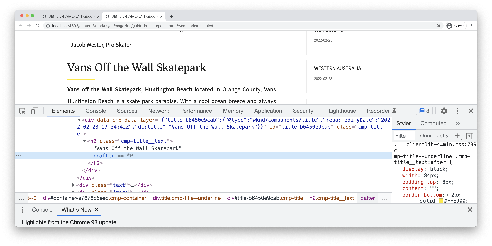

# 스타일 시스템을 사용하여 개발 {#developing-with-the-style-system}

Experience Manager의 스타일 시스템을 사용하여 개별 스타일을 구현하고 핵심 구성 요소를 재사용하는 방법에 대해 알아봅니다. 이 튜토리얼에서는 스타일 시스템에서 템플릿 편집기의 브랜드별 CSS 및 고급 정책 구성을 사용하여 핵심 구성 요소를 확장하는 개발 방법을 다룹니다.

## 사전 요구 사항 {#prerequisites}

설정에 필요한 도구 및 지침 검토 [로컬 개발 환경](overview.md#local-dev-environment).

또한 다음을 검토하는 것이 좋습니다. [클라이언트측 라이브러리 및 프론트엔드 워크플로](client-side-libraries.md) AEM 프로젝트에 내장된 클라이언트측 라이브러리 및 다양한 프론트엔드 도구의 기본 사항을 이해하는 자습서입니다.

### 스타터 프로젝트

>[!NOTE]
>
> 이전 장을 성공적으로 완료한 경우 프로젝트를 재사용하고 스타터 프로젝트 체크 아웃 단계를 건너뛸 수 있습니다.

자습서가 빌드하는 기본 코드 체크 아웃:

1. 다음을 확인하십시오. `tutorial/style-system-start` 에서 분기 [GitHub](https://github.com/adobe/aem-guides-wknd)

   ```shell
   $ cd aem-guides-wknd
   $ git checkout tutorial/style-system-start
   ```

1. Maven 기술을 사용하여 로컬 AEM 인스턴스에 코드 베이스를 배포합니다.

   ```shell
   $ mvn clean install -PautoInstallSinglePackage
   ```

   >[!NOTE]
   >
   > AEM 6.5 또는 6.4를 사용하는 경우 `classic` 모든 Maven 명령에 대한 프로필

   ```shell
   $ mvn clean install -PautoInstallSinglePackage -Pclassic
   ```

에서 완성된 코드를 항상 볼 수 있습니다. [GitHub](https://github.com/adobe/aem-guides-wknd/tree/tutorial/style-system-solution) 또는 분기로 전환하여 코드를 로컬에서 확인합니다. `tutorial/style-system-solution`.

## 목표

1. 스타일 시스템을 사용하여 브랜드별 CSS를 AEM 핵심 구성 요소에 적용하는 방법을 이해할 수 있습니다.
1. BEM 표기법과 이를 사용하여 스타일의 범위를 신중하게 지정하는 방법에 대해 알아봅니다.
1. 편집 가능한 템플릿을 사용하여 고급 정책 구성을 적용합니다.

## 빌드할 항목 {#what-build}

이 장에서는 [스타일 시스템 기능](https://experienceleague.adobe.com/docs/experience-manager-learn/sites/page-authoring/style-system-feature-video-use.html) 의 변형을 만들려면 **제목** 및 **텍스트** 문서 페이지에서 사용되는 구성 요소입니다.


*제목 구성 요소에 사용할 수 있는 밑줄 스타일*

## 배경 {#background}

다음 [스타일 시스템](https://experienceleague.adobe.com/docs/experience-manager-65/authoring/siteandpage/style-system.html) 개발자와 템플릿 편집자가 구성 요소의 여러 가지 시각적 변형을 만들 수 있습니다. 그런 다음 작성자는 페이지를 작성할 때 사용할 스타일을 결정할 수 있습니다. 스타일 시스템은 자습서의 나머지 부분에서 낮은 코드 접근 방식으로 핵심 구성 요소를 사용하여 여러 가지 고유한 스타일을 수행하는 데 사용됩니다.

스타일 시스템의 일반적인 개념은 작성자가 구성 요소가 어떻게 표시되어야 하는지에 대한 다양한 스타일을 선택할 수 있다는 것입니다. &quot;스타일&quot;은 구성 요소의 외부 div에 삽입되는 추가 CSS 클래스에서 지원됩니다. 이러한 스타일 클래스를 기반으로 클라이언트 라이브러리에서 CSS 규칙이 추가되어 구성 요소의 모양이 변경됩니다.

다음을 찾을 수 있습니다. [스타일 시스템에 대한 자세한 설명서는 여기 를 참조하십시오.](https://experienceleague.adobe.com/docs/experience-manager-cloud-service/content/sites/authoring/features/style-system.html). 거기에는 또한 훌륭한 것이 있다 [스타일 시스템 이해를 위한 기술 비디오](https://experienceleague.adobe.com/docs/experience-manager-learn/sites/developing/style-system-technical-video-understand.html).

## 밑줄 스타일 - 제목 {#underline-style}

다음 [제목 구성 요소](https://experienceleague.adobe.com/docs/experience-manager-core-components/using/wcm-components/title.html) 이(가) 다음 프로젝트에 프록시되었습니다. `/apps/wknd/components/title` 의 일부로 **ui.apps** 모듈. 제목 요소의 기본 스타일(`H1`, `H2`, `H3`...에서 이미 구현되었습니다. **ui.frontend** 모듈.

다음 [WKND 문서 디자인](assets/pages-templates/wknd-article-design.xd) 에는 밑줄이 있는 제목 구성 요소의 고유한 스타일이 들어 있습니다. 두 개의 구성 요소를 만들거나 구성 요소 대화 상자를 수정하는 대신 스타일 시스템 을 사용하여 작성자가 밑줄 스타일을 추가할 수 있습니다.


### 제목 정책 추가

콘텐츠 작성자가 특정 구성 요소에 적용할 밑줄 스타일을 선택할 수 있도록 제목 구성 요소에 대한 정책을 추가해 보겠습니다. 이 작업은 AEM 내의 템플릿 편집기 를 사용하여 수행됩니다.

1. 다음 위치로 이동 **문서 페이지** 템플릿 출처: [http://localhost:4502/editor.html/conf/wknd/settings/wcm/templates/article-page/structure.html](http://localhost:4502/editor.html/conf/wknd/settings/wcm/templates/article-page/structure.html)

1. 위치 **구조** 모드, 기본 **레이아웃 컨테이너**&#x200B;를 선택하고 **정책** 아이콘 옆에 있는 **제목** 아래에 나열된 구성 요소 *허용된 구성 요소*:

   

1. 다음 값으로 제목 구성 요소에 대한 정책을 만듭니다.

   *정책 제목&#42;*: **WKND 제목**

   *속성* > *스타일 탭* > *새 스타일 추가*

   **밑줄** : `cmp-title--underline`

   

   클릭 **완료** 을 클릭하여 제목 정책에 대한 변경 사항을 저장합니다.

   >[!NOTE]
   >
   > 값 `cmp-title--underline` 구성 요소 HTML 마크업의 외부 div에서 CSS 클래스를 채웁니다.

### 밑줄 스타일 적용

작성자가 되면 특정 제목 구성 요소에 밑줄 스타일을 적용해 보겠습니다.

1. 다음 위치로 이동 **라 스케이트파크스** AEM Sites 편집기의 문서: [http://localhost:4502/editor.html/content/wknd/us/en/magazine/guide-la-skateparks.html](http://localhost:4502/editor.html/content/wknd/us/en/magazine/guide-la-skateparks.html)
1. 위치 **편집** 모드에서는 제목 구성 요소를 선택합니다. 다음을 클릭합니다. **그림붓** 아이콘을 클릭하고 **밑줄** 스타일:

   

   >[!NOTE]
   >
   > 이 시점에서는 다음과 같은 가시적인 변화가 발생하지 않습니다. `underline` 스타일이 구현되지 않았습니다. 다음 연습에서는 이 스타일이 구현됩니다.

1. 다음을 클릭합니다. **페이지 정보** 아이콘 > **게시됨으로 보기** AEM editor 외부에서 페이지를 검사합니다.
1. 브라우저 개발자 도구를 사용하여 제목 구성 요소 주위의 마크업에 CSS 클래스가 있는지 확인합니다 `cmp-title--underline` 외부 div에 적용됩니다.

   

   ```html
   <div class="title cmp-title--underline">
       <div data-cmp-data-layer="{&quot;title-b6450e9cab&quot;:{&quot;@type&quot;:&quot;wknd/components/title&quot;,&quot;repo:modifyDate&quot;:&quot;2022-02-23T17:34:42Z&quot;,&quot;dc:title&quot;:&quot;Vans Off the Wall Skatepark&quot;}}" 
       id="title-b6450e9cab" class="cmp-title">
           <h2 class="cmp-title__text">Vans Off the Wall Skatepark</h2>
       </div>
   </div>
   ```

### 밑줄 스타일 구현 - ui.frontend

그런 다음 를 사용하여 밑줄 스타일을 구현합니다 **ui.frontend** AEM 프로젝트의 모듈입니다. 와 번들로 제공되는 Webpack 개발 서버 **ui.frontend** 스타일 미리 보기 모듈 *다음 이전* AEM의 로컬 인스턴스에 배포하는 것이 사용됩니다.

1. 시작 `watch` 다음 내에서 처리 **ui.frontend** 모듈:

   ```shell
   $ cd ~/code/aem-guides-wknd/ui.frontend/
   $ npm run watch
   ```

   이렇게 하면 의 변경 사항을 모니터링하는 프로세스가 시작됩니다. `ui.frontend` 를 모듈화하고 변경 사항을 AEM 인스턴스에 동기화합니다.


1. IDE를 반환하고 파일을 엽니다 `_title.scss` 출처: `ui.frontend/src/main/webpack/components/_title.scss`.
1. 을(를) 타깃팅하는 새 규칙 소개 `cmp-title--underline` 클래스:

   ```scss
   /* Default Title Styles */
   .cmp-title {}
   .cmp-title__text {}
   .cmp-title__link {}
   
   /* Add Title Underline Style */
   .cmp-title--underline {
       .cmp-title__text {
           &:after {
           display: block;
               width: 84px;
               padding-top: 8px;
               content: '';
               border-bottom: 2px solid $brand-primary;
           }
       }
   }
   ```

   >[!NOTE]
   >
   >스타일을 항상 대상 구성 요소에 밀접하게 적용하는 것이 좋습니다. 이렇게 하면 추가 스타일이 페이지의 다른 영역에 영향을 주지 않습니다.
   >
   >모든 핵심 구성 요소는 **[BEM 표기법](https://github.com/adobe/aem-core-wcm-components/wiki/css-coding-conventions)**. 구성 요소에 대한 기본 스타일을 만들 때 외부 CSS 클래스를 타깃팅하는 것이 좋습니다. 또 다른 모범 사례는 HTML 요소가 아닌 핵심 구성 요소 BEM 표기법으로 지정된 클래스 이름을 타깃팅하는 것입니다.

1. 브라우저 및 AEM 페이지로 돌아갑니다. 밑줄 스타일이 추가된 것을 볼 수 있습니다.

   

1. 이제 AEM 편집기에서 를 켜거나 끌 수 있습니다 **밑줄** 스타일을 지정하여 변경 사항이 시각적으로 반영되었는지 확인합니다.

## 견적 블록 스타일 - 텍스트 {#text-component}

그런 다음 유사한 단계를 반복하여 [텍스트 구성 요소](https://experienceleague.adobe.com/docs/experience-manager-core-components/using/wcm-components/text.html). 텍스트 구성 요소가 다음 프로젝트에 프록시되었습니다. `/apps/wknd/components/text` 의 일부로 **ui.apps** 모듈. 단락 요소의 기본 스타일이 **ui.frontend**.

다음 [WKND 문서 디자인](assets/pages-templates/wknd-article-design.xd) 텍스트 구성 요소에 인용 블록을 사용하는 고유한 스타일이 포함되어 있습니다.


### 텍스트 정책 추가

그런 다음 텍스트 구성 요소에 대한 정책을 추가합니다.

1. 다음 위치로 이동 **문서 페이지 템플릿** 출처: [http://localhost:4502/editor.html/conf/wknd/settings/wcm/templates/article-page/structure.html](http://localhost:4502/editor.html/conf/wknd/settings/wcm/templates/article-page/structure.html).

1. 위치 **구조** 모드, 기본 **레이아웃 컨테이너**&#x200B;를 선택하고 **정책** 아이콘 옆에 있는 **텍스트** 아래에 나열된 구성 요소 *허용된 구성 요소*:

   

1. 텍스트 구성 요소 정책을 다음 값으로 업데이트합니다.

   *정책 제목&#42;*: **컨텐츠 텍스트**

   *플러그인* > *단락 스타일* > *단락 스타일 사용*

   *스타일 탭* > *새 스타일 추가*

   **견적 블록** : `cmp-text--quote`

   

   

   클릭 **완료** 텍스트 정책에 대한 변경 사항을 저장합니다.

### 견적 블록 스타일 적용

1. 다음 위치로 이동 **라 스케이트파크스** AEM Sites 편집기의 문서: [http://localhost:4502/editor.html/content/wknd/us/en/magazine/guide-la-skateparks.html](http://localhost:4502/editor.html/content/wknd/us/en/magazine/guide-la-skateparks.html)
1. 위치 **편집** 모드에서 텍스트 구성 요소를 선택합니다. 견적 요소를 포함하도록 구성 요소를 편집합니다.

   

1. 텍스트 구성 요소를 선택하고 **그림붓** 아이콘을 클릭하고 **견적 블록** 스타일:

   

1. 브라우저의 개발자 도구를 사용하여 마크업을 검사합니다. 클래스 이름이 표시됩니다. `cmp-text--quote` 이(가) 구성 요소의 외부 div에 추가되었습니다.

   ```html
   <!-- Quote Block style class added -->
   <div class="text cmp-text--quote">
       <div data-cmp-data-layer="{&quot;text-60910f4b8d&quot;:{&quot;@type&quot;:&quot;wknd/components/text&quot;,&quot;repo:modifyDate&quot;:&quot;2022-02-24T00:55:26Z&quot;,&quot;xdm:text&quot;:&quot;<blockquote>&amp;nbsp; &amp;nbsp; &amp;nbsp;&amp;quot;There is no better place to shred then Los Angeles&amp;quot;</blockquote>\r\n<p>- Jacob Wester, Pro Skater</p>\r\n&quot;}}" id="text-60910f4b8d" class="cmp-text">
           <blockquote>&nbsp; &nbsp; &nbsp;"There is no better place to shred then Los Angeles"</blockquote>
           <p>- Jacob Wester, Pro Skater</p>
       </div>
   </div>
   ```

### 견적 블록 스타일 구현 - ui.frontend

다음으로 다음을 사용하여 Quote Block 스타일을 구현해 보겠습니다. **ui.frontend** AEM 프로젝트의 모듈입니다.

1. 아직 실행되지 않은 경우 `watch` 다음 내에서 처리 **ui.frontend** 모듈:

   ```shell
   $ npm run watch
   ```

1. 파일 업데이트 `text.scss` 출처: `ui.frontend/src/main/webpack/components/_text.scss`:

   ```css
   /* Default text style */
   .cmp-text {}
   .cmp-text__paragraph {}
   
   /* WKND Text Quote style */
   .cmp-text--quote {
       .cmp-text {
           background-color: $brand-third;
           margin: 1em 0em;
           padding: 1em;
   
           blockquote {
               border: none;
               font-size: $font-size-large;
               font-family: $font-family-serif;
               padding: 14px 14px;
               margin: 0;
               margin-bottom: 0.5em;
   
               &:after {
                   border-bottom: 2px solid $brand-primary; /*yellow border */
                   content: '';
                   display: block;
                   position: relative;
                   top: 0.25em;
                   width: 80px;
               }
           }
           p {
               font-family:  $font-family-serif;
           }
       }
   }
   ```

   >[!CAUTION]
   >
   > 이 경우 원시 HTML 요소는 스타일에 의해 타깃팅됩니다. 이는 텍스트 구성 요소가 콘텐츠 작성자를 위한 리치 텍스트 편집기를 제공하기 때문입니다. RTE 콘텐츠에 대해 직접 스타일을 만드는 것은 신중하게 수행해야 하며 스타일의 범위를 엄격하게 지정하는 것이 더 중요합니다.

1. 다시 한 번 브라우저로 돌아오면 Quote 블록 스타일이 추가되었음을 알 수 있습니다.

   

1. Webpack 개발 서버를 중지합니다.

## 고정 폭 - 컨테이너 (보너스) {#layout-container}

컨테이너 구성 요소는 문서 페이지 템플릿의 기본 구조를 만들고 콘텐츠 작성자가 페이지에 콘텐츠를 추가할 수 있는 놓기 영역을 제공하는 데 사용되었습니다. 컨테이너는 스타일 시스템을 사용하여 콘텐츠 작성자가 레이아웃을 디자인할 수 있는 더 많은 옵션을 제공할 수도 있습니다.

다음 **주 컨테이너** 의 문서 페이지 템플릿에는 작성자가 사용할 수 있는 두 개의 컨테이너가 포함되어 있으며 폭은 고정되어 있습니다.


*문서 페이지 템플릿의 기본 컨테이너*.

의 정책 **주 컨테이너** 기본 요소를 다음으로 설정 `main`:


다음을 만드는 CSS **주 컨테이너** 에 고정 세트가 설정되었습니다. **ui.frontend** 모듈 위치: `ui.frontend/src/main/webpack/site/styles/container_main.scss` :

```SCSS
main.container {
    padding: .5em 1em;
    max-width: $max-content-width;
    float: unset!important;
    margin: 0 auto!important;
    clear: both!important;
}
```

을 타깃팅하는 대신 `main` HTML 요소인 스타일 시스템을 사용하여 **고정 폭** 컨테이너 정책의 일부로 스타일을 지정합니다. 스타일 시스템은 사용자에게 간을 전환할 수 있는 옵션을 제공합니다. **고정 폭** 및 **유체 폭** 컨테이너.

1. **보너스 챌린지** - 이전 연습에서 얻은 단원을 사용하고 스타일 시스템을 사용하여 **고정 폭** 및 **유체 폭** 컨테이너 구성 요소의 스타일입니다.

## 축하합니다! {#congratulations}

축하합니다. 문서 페이지가 거의 스타일이 지정되었으며 AEM 스타일 시스템을 사용하여 실습한 경험을 쌓았습니다.

### 다음 단계 {#next-steps}

을(를) 만드는 전체적인 단계에 대해 알아봅니다. [사용자 지정 AEM 구성 요소](custom-component.md) 대화 상자에서 작성된 콘텐츠를 표시하고 슬링 모델 개발을 탐색하여 구성 요소의 HTL을 채우는 비즈니스 논리를 캡슐화합니다.

에서 완료된 코드 보기 [GitHub](https://github.com/adobe/aem-guides-wknd) 또는 Git 분기의 로컬에서 코드를 검토하고 배포합니다 `tutorial/style-system-solution`.

1. 복제 [github.com/adobe/aem-wknd-guides](https://github.com/adobe/aem-guides-wknd) 리포지토리.
1. 다음을 확인하십시오. `tutorial/style-system-solution` 분기입니다.
