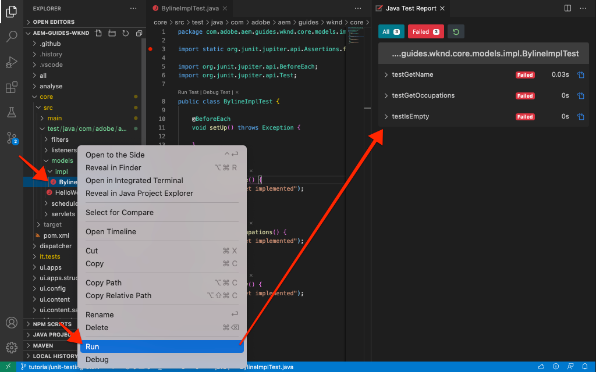

# 단위 테스트 {#unit-testing}

이 튜토리얼에서는 [사용자 지정 구성 요소](./custom-component.md) 튜토리얼.

## 사전 요구 사항 {#prerequisites}

설정에 필요한 도구 및 지침 검토 [로컬 개발 환경](overview.md#local-dev-environment).

_Java™ 8과 Java™ 11이 모두 시스템에 설치된 경우 VS 코드 테스트 실행기는 테스트를 실행할 때 더 낮은 Java™ 런타임을 선택하여 테스트 실패를 초래할 수 있습니다. 이 경우 Java™ 8을 제거합니다._

### 스타터 프로젝트

>[!NOTE]
>
> 이전 장을 성공적으로 완료한 경우 프로젝트를 재사용하고 스타터 프로젝트 체크 아웃 단계를 건너뛸 수 있습니다.

자습서가 빌드하는 기본 코드 체크 아웃:

1. 다음을 확인하십시오. `tutorial/unit-testing-start` 에서 분기 [GitHub](https://github.com/adobe/aem-guides-wknd)

   ```shell
   $ cd aem-guides-wknd
   $ git checkout tutorial/unit-testing-start
   ```

1. Maven 기술을 사용하여 로컬 AEM 인스턴스에 코드 베이스를 배포합니다.

   ```shell
   $ mvn clean install -PautoInstallSinglePackage
   ```

   >[!NOTE]
   >
   > AEM 6.5 또는 6.4를 사용하는 경우 `classic` 모든 Maven 명령에 대한 프로필

   ```shell
   $ mvn clean install -PautoInstallSinglePackage -Pclassic
   ```

에서 완성된 코드를 항상 볼 수 있습니다. [GitHub](https://github.com/adobe/aem-guides-wknd/tree/tutorial/unit-testing-start) 또는 분기로 전환하여 코드를 로컬에서 확인합니다. `tutorial/unit-testing-start`.

## 목표

1. 단위 테스트의 기본 사항을 이해합니다.
1. AEM 코드를 테스트하는 데 일반적으로 사용되는 프레임워크 및 도구에 대해 알아봅니다.
1. 단위 테스트를 작성할 때 AEM 리소스를 조롱하거나 시뮬레이트하기 위한 옵션을 이해합니다.

## 배경 {#unit-testing-background}

이 튜토리얼에서는 을(를) 작성하는 방법을 알아봅니다. [단위 테스트](https://en.wikipedia.org/wiki/Unit_testing) Byline 구성 요소의 경우 [Sling 모델](https://sling.apache.org/documentation/bundles/models.html) (에서 생성됨) [사용자 지정 AEM 구성 요소 만들기](custom-component.md)). 단위 테스트는 Java™으로 작성된 빌드 시간 테스트로서 Java™ 코드의 예상 동작을 확인합니다. 각 단위 테스트는 일반적으로 작으며 예상 결과에 대해 방법(또는 작업 단위)의 출력을 확인합니다.

AEM 모범 사례를 사용하고 다음을 사용합니다.

* [주니트 5](https://junit.org/junit5/)
* [모키토 테스트 프레임워크](https://site.mockito.org/)
* [wcm.io 테스트 프레임워크](https://wcm.io/testing/) (빌드 대상: [Apache Sling 모크스](https://sling.apache.org/documentation/development/sling-mock.html))

## 장치 테스트 및 Adobe Cloud Manager {#unit-testing-and-adobe-cloud-manager}

[Adobe Cloud Manager](https://experienceleague.adobe.com/docs/experience-manager-cloud-manager/content/introduction.html) 단위 테스트 실행을 통합합니다. [코드 검사 보고](https://experienceleague.adobe.com/docs/experience-manager-cloud-manager/content/using/code-quality-testing.html) 를 CI/CD 파이프라인에 추가하여 단위 테스트 AEM 코드의 모범 사례를 장려하고 홍보합니다.

단위 테스트 코드는 모든 코드 기반에 좋은 방법이지만 Cloud Manager를 사용할 때는 Cloud Manager가 실행될 단위 테스트를 제공하여 코드 품질 테스트 및 보고 기능을 활용하는 것이 중요합니다.

## 테스트 Maven 종속성 업데이트 {#inspect-the-test-maven-dependencies}

첫 번째 단계는 테스트 작성 및 실행을 지원하기 위해 Maven 종속성을 검사하는 것입니다. 다음 네 가지 종속성이 필요합니다.

1. JUnit5
1. 모키토 테스트 프레임워크
1. Apache Sling 모크스
1. AEM Mocks 테스트 프레임워크(io.wcm 기준)

다음 **JUnit5**, **모키토 및 **AEM 모크스** 테스트 종속성은 를 사용하여 설정하는 동안 프로젝트에 자동으로 추가됩니다. [AEM Maven Archetype](project-setup.md).

1. 이러한 종속성을 보려면 상위 반응기 POM을 엽니다. **aem-guides-wknd/pom.xml**&#x200B;로 이동한 다음 `<dependencies>..</dependencies>` 및 다음에서 io.wcm을 통해 JUnit, Mockito, Apache Sling Mocks 및 AEM Mock Tests에 대한 종속성을 확인합니다. `<!-- Testing -->`.
1. 다음을 확인합니다. `io.wcm.testing.aem-mock.junit5` 이(가) (으)로 설정됨 **4.1.0**:

   ```xml
   <dependency>
       <groupId>io.wcm</groupId>
       <artifactId>io.wcm.testing.aem-mock.junit5</artifactId>
       <version>4.1.0</version>
       <scope>test</scope>
   </dependency>
   ```

   >[!CAUTION]
   >
   > Archetype **35** 을 사용하여 프로젝트를 생성합니다. `io.wcm.testing.aem-mock.junit5` 버전 **4.1.8**. 다음으로 다운그레이드하십시오. **4.1.0** 이 장의 나머지 부분을 따라가다.

1. 열기 **aem-guides-wknd/core/pom.xml** 및 해당 테스트 종속성을 사용할 수 있는지 확인합니다.

   의 병렬 소스 폴더 **코어** 프로젝트에는 단위 테스트와 모든 지원 테스트 파일이 포함됩니다. 이 **테스트** 폴더는 소스 코드에서 테스트 클래스를 분리하지만 테스트가 소스 코드와 동일한 패키지에 있는 것처럼 작동할 수 있도록 허용합니다.

## JUnit 테스트 만들기 {#creating-the-junit-test}

단위 테스트는 일반적으로 Java™ 클래스를 사용하여 1대 1을 매핑합니다. 이 장에서는 다음에 대한 JUnit 테스트를 작성합니다. **BylineImpl.java**- Byline 구성 요소를 지원하는 슬링 모델입니다.


*단위 테스트가 저장되는 위치입니다.*

1. 에 대한 단위 테스트 만들기 `BylineImpl.java` 아래에 새 Java™ 클래스를 만들어 `src/test/java` 는 테스트할 Java™ 클래스의 위치를 미러링하는 Java™ 패키지 폴더 구조입니다.

   

   테스트 중이므로

   * `src/main/java/com/adobe/aem/guides/wknd/core/models/impl/BylineImpl.java`

   에서 해당 단위 테스트 Java™ 클래스를 만듭니다.

   * `src/test/java/com/adobe/aem/guides/wknd/core/models/impl/BylineImplTest.java`

   다음 `Test` 단위 테스트 파일의 접미사 `BylineImplTest.java` 는 다음을 허용하는 규칙입니다.

   1. 테스트 파일로 쉽게 식별 _대상_ `BylineImpl.java`
   1. 또한 테스트 파일을 구분합니다 _출처:_ 시험중인 학급, `BylineImpl.java`


## BylineImplTest.java 검토 {#reviewing-bylineimpltest-java}

이 시점에서 JUnit 테스트 파일은 빈 Java™ 클래스입니다.

1. 다음 코드를 사용하여 파일을 업데이트합니다.

   ```java
   package com.adobe.aem.guides.wknd.core.models.impl;
   
   import static org.junit.jupiter.api.Assertions.*;
   
   import org.junit.jupiter.api.BeforeEach;
   import org.junit.jupiter.api.Test;
   
   public class BylineImplTest {
   
       @BeforeEach
       void setUp() throws Exception {
   
       }
   
       @Test 
       void testGetName() { 
           fail("Not yet implemented");
       }
   
       @Test 
       void testGetOccupations() { 
           fail("Not yet implemented");
       }
   
       @Test 
       void testIsEmpty() { 
           fail("Not yet implemented");
       }
   }
   ```

1. 첫 번째 방법 `public void setUp() { .. }` JUnit에 주석이 추가됨 `@BeforeEach`: 이 클래스의 각 테스트 메서드를 실행하기 전에 JUnit 테스트 실행기가 이 메서드를 실행하도록 지시합니다. 이렇게 하면 모든 테스트에 필요한 일반적인 테스트 상태를 초기화할 수 있는 편리한 위치를 제공합니다.

1. 후속 메서드는 이름이 접두사로 추가된 테스트 메서드입니다. `test` 규칙에 따라 및 로 표시됨 `@Test` 주석. 아직 구현하지 않았기 때문에 기본적으로 모든 테스트가 실패하도록 설정됩니다.

   먼저 테스트 중인 클래스의 각 공용 메서드에 대한 단일 테스트 메서드로 시작하므로

   | BylineImpl.java |  | BylineImplTest.java |
   | ------------------|--------------|---------------------|
   | getName() | 은(는) 다음을 통해 테스트함: | testGetName() |
   | getOccuptions() | 은(는) 다음을 통해 테스트함: | testGetOccuptions() |
   | isEmpty() | 은(는) 다음을 통해 테스트함: | testIsEmpty() |

   이 방법은 이 장의 뒷부분에서 살펴보겠지만 필요에 따라 확장될 수 있습니다.

   이 JUnit 테스트 클래스(JUnit 테스트 사례라고도 함)가 실행되면 각 메서드는 `@Test` 은 통과 또는 실패할 수 있는 테스트로 실행됩니다.


*`core/src/test/java/com/adobe/aem/guides/wknd/core/models/impl/BylineImplTest.java`*

1. 을 마우스 오른쪽 단추로 클릭하여 JUnit 테스트 사례 실행 `BylineImplTest.java` 파일 및 탭 **실행**.
예상대로 모든 테스트가 아직 구현되지 않아 실패합니다.

   

   *BylineImplTests.java > Run을 마우스 오른쪽 단추로 클릭합니다.*

## BylineImpl.java 검토 {#reviewing-bylineimpl-java}

단위 테스트를 작성할 때 두 가지 기본 접근 방식이 있습니다.

* [TDD 또는 테스트 기반 개발](https://en.wikipedia.org/wiki/Test-driven_development)를 포함합니다. 단위 테스트를 구현이 개발되기 바로 전에 증분 방식으로 작성하는 작업이 포함됩니다. 테스트를 작성하고 테스트를 통과할 수 있도록 구현을 작성하십시오.
* 구현 우선 개발(먼저 작업 코드를 개발한 다음 해당 코드의 유효성을 검사하는 테스트를 작성하는 작업 포함).

이 자습서에서는 이미 작업을 만들었으므로 후자의 접근 방식이 사용됩니다 **BylineImpl.java** 이전 챕터 참조). 이러한 점 때문에, 우리는 그것의 공적인 방법 뿐만 아니라 그것의 구현 세부사항 중 일부를 검토하고 이해해야 한다. 좋은 테스트는 입력과 출력에만 신경 써야 하므로 이는 반대로 들릴 수 있지만 AEM에서 작업할 때 작업 테스트를 구성하기 위해 이해해야 하는 다양한 구현 고려 사항이 있습니다.

AEM의 컨텍스트에서 TDD는 일정 수준의 전문성을 필요로 하며 AEM 개발 및 AEM 코드의 단위 테스트에 능숙한 AEM 개발자가 가장 잘 채택합니다.

## AEM 테스트 컨텍스트 설정  {#setting-up-aem-test-context}

AEM용으로 작성된 대부분의 코드는 JCR, Sling 또는 AEM API에 의존하며, 이를 위해서는 실행 중인 AEM의 컨텍스트가 제대로 실행되어야 합니다.

실행 중인 AEM 인스턴스의 컨텍스트 외부에서 빌드 시 단위 테스트가 실행되므로 이러한 컨텍스트는 없습니다. 이 작업을 용이하게 하려면, [wcm.io의 AEM Mocks](https://wcm.io/testing/aem-mock/usage.html) 다음 API를 허용하는 모의 컨텍스트 만들기 _대부분_ AEM에서 실행 중인 것처럼 작동합니다.

1. 다음을 사용하여 AEM 컨텍스트 만들기 **wcm.ios** `AemContext` 위치: **BylineImplTest.java** 로 데코레이트된 JUnit 확장으로 추가 `@ExtendWith` (으)로 **BylineImplTest.java** 파일. 확장은 필요한 모든 초기화 및 정리 작업을 처리합니다. 클래스 변수 만들기 `AemContext` 모든 테스트 메서드에 사용할 수 있습니다.

   ```java
   import org.junit.jupiter.api.extension.ExtendWith;
   import io.wcm.testing.mock.aem.junit5.AemContext;
   import io.wcm.testing.mock.aem.junit5.AemContextExtension;
   ...
   
   @ExtendWith(AemContextExtension.class)
   class BylineImplTest {
   
       private final AemContext ctx = new AemContext();
   ```

   이 변수, `ctx`는 일부 AEM 및 Sling 추상화를 제공하는 모의 AEM 컨텍스트를 노출합니다.

   * BylineImpl Sling 모델이 이 컨텍스트에 등록됩니다.
   * 모의 JCR 콘텐츠 구조는 이 컨텍스트에서 작성됩니다
   * 이 컨텍스트에서는 사용자 정의 OSGi 서비스를 등록할 수 있습니다
   * SlingHttpServletRequest 개체, ModelFactory, PageManager, Page, Template, ComponentManager, Component, TagManager, Tag 등과 같은 다양한 모의 Sling 및 AEM OSGi 서비스와 같이 필요한 다양한 모의 개체와 도우미를 제공합니다.
      * *이러한 개체에 대한 모든 메서드가 구현되는 것은 아닙니다.*
   * 및 [훨씬 더](https://wcm.io/testing/aem-mock/usage.html)!

   다음 **`ctx`** 객체는 대부분의 모의 문맥의 시작점 역할을 합니다.

1. 다음에서 `setUp(..)` 메서드, 각 메서드 이전에 실행됨 `@Test` 메서드, 공통 모의 테스트 상태를 정의합니다.

   ```java
   @BeforeEach
   public void setUp() throws Exception {
       ctx.addModelsForClasses(BylineImpl.class);
       ctx.load().json("/com/adobe/aem/guides/wknd/core/models/impl/BylineImplTest.json", "/content");
   }
   ```

   * **`addModelsForClasses`** 테스트할 Sling 모델을 모의 AEM 컨텍스트에 등록하므로 `@Test` 메서드를 사용합니다.
   * **`load().json`** 는 리소스 구조를 모의 컨텍스트에 로드하므로 코드가 실제 저장소에서 제공한 것처럼 이러한 리소스와 상호 작용할 수 있습니다. 파일의 리소스 정의 **`BylineImplTest.json`** 다음 구문을 사용하여 모의 JCR 컨텍스트에 **/content**.
   * **`BylineImplTest.json`** 은(는) 아직 없으며 존재하므로 이를 만들고 테스트에 필요한 JCR 리소스 구조를 정의하겠습니다.

1. 모의 리소스 구조를 나타내는 JSON 파일은 아래에 저장됩니다. **core/src/test/resources** juNit Java™ 테스트 파일과 동일한 패키지 경로를 따릅니다.

   다음 위치에 JSON 파일 만들기: `core/test/resources/com/adobe/aem/guides/wknd/core/models/impl` 명명된 **BylineImplTest.json** (다음 컨텐츠 포함)

   ```json
   {
       "byline": {
       "jcr:primaryType": "nt:unstructured",
       "sling:resourceType": "wknd/components/content/byline"
       }
   }
   ```

   

   이 JSON은 Byline 구성 요소 단위 테스트를 위한 모의 리소스(JCR 노드)를 정의합니다. 이때 JSON에는 인라인 구성 요소 콘텐츠 리소스를 나타내는 데 필요한 최소 속성 세트인 `jcr:primaryType` 및 `sling:resourceType`.

   단위 테스트를 사용하여 작업할 때 일반적인 규칙은 각 테스트를 충족하는 데 필요한 최소 모의 콘텐츠, 컨텍스트 및 코드 세트를 만드는 것입니다. 불필요한 아티팩트를 만드는 경우가 많으므로, 테스트를 작성하기 전에 완전한 모의 문맥을 구축하려는 유혹을 피하십시오.

   이제 의 존재와 함께 **BylineImplTest.json**, 다음과 같은 경우 `ctx.json("/com/adobe/aem/guides/wknd/core/models/impl/BylineImplTest.json", "/content")` 가 실행되면 모의 리소스 정의가 경로의 컨텍스트에 로드됩니다. **/content.**

## getName() 테스트 {#testing-get-name}

이제 기본적인 모의 컨텍스트 설정이 있으므로 첫 번째 테스트를 작성해 보겠습니다. **BylineImpl의 getName()**. 이 테스트에서는 메서드를 확인해야 합니다. **getName()** 리소스의 &quot;에 저장된 올바른 작성 이름을 반환합니다.**name&quot;** 속성.

1. 업데이트 **testGetname**&#x200B;의 () 메서드 **BylineImplTest.java** 다음과 같이:

   ```java
   import com.adobe.aem.guides.wknd.core.models.Byline;
   ...
   @Test
   public void testGetName() {
       final String expected = "Jane Doe";
   
       ctx.currentResource("/content/byline");
       Byline byline = ctx.request().adaptTo(Byline.class);
   
       String actual = byline.getName();
   
       assertEquals(expected, actual);
   }
   ```

   * **`String expected`** 예상 값을 설정합니다. 이 값은 &quot;(으)로 설정됩니다.**제인 던**&quot;.
   * **`ctx.currentResource`** 코드를 평가할 모의 리소스 컨텍스트를 로 설정하므로 다음으로 설정합니다. **/content/byline** 즉, mock byline 콘텐츠 리소스가 로드됩니다.
   * **`Byline byline`** mock Request 개체에서 Byline Sling 모델을 조정하여 인스턴스화합니다.
   * **`String actual`** 테스트 중인 메서드를 호출합니다. `getName()`를 입력합니다.
   * **`assertEquals`** 는 예상 값이 byline Sling 모델 개체에서 반환한 값과 일치함을 어설션합니다. 이 값이 같지 않으면 테스트가 실패합니다.

1. 테스트 실행... (으)로 실패합니다. `NullPointerException`.

   이 테스트는 을(를) 정의한 적이 없기 때문에 실패하지 않습니다. `name` 테스트 실행이 해당 시점에 도달하지 않았더라도 테스트가 실패하는 모의 JSON의 속성입니다. 이 테스트는 다음으로 인해 실패합니다. `NullPointerException` byline 개체 자체입니다.

1. 다음에서 `BylineImpl.java`, `@PostConstruct init()` sling 모델이 인스턴스화되지 않도록 하고 해당 Sling 모델 개체가 null이 되는 예외를 throw합니다.

   ```java
   @PostConstruct
   private void init() {
       image = modelFactory.getModelFromWrappedRequest(request, request.getResource(), Image.class);
   }
   ```

   ModelFactory OSGi 서비스는 를 통해 제공되는 반면 `AemContext` (Apache Sling 컨텍스트에서) 다음을 포함하여 모든 메서드가 구현되지는 않습니다. `getModelFromWrappedRequest(...)` BylineImpl의 `init()` 메서드를 사용합니다. 그 결과 [AbstractMethodError](https://docs.oracle.com/en/java/javase/11/docs/api/java.base/java/lang/AbstractMethodError.html): 용어로 말하면 다음과 같습니다. `init()` 실패 및 그 결과로 나타나는 `ctx.request().adaptTo(Byline.class)` 은(는) null 개체입니다.

   제공된 모크가 코드를 수용할 수 없으므로 직접 모크 컨텍스트를 구현해야 합니다. 이를 위해 Mockito를 사용하여 다음과 같은 경우 모크 이미지 개체를 반환하는 모크 ModelFactory 개체를 만들 수 있습니다. `getModelFromWrappedRequest(...)` 호출됩니다.

   Byline Sling 모델을 인스턴스화하려면 이 모의 컨텍스트가 제대로 되어 있어야 하므로 이 컨텍스트를 `@Before setUp()` 메서드를 사용합니다. 또한 다음을 추가해야 합니다. `MockitoExtension.class` (으)로 `@ExtendWith` 위의 주석 **BylineImplTest** 클래스.

   ```java
   package com.adobe.aem.guides.wknd.core.models.impl;
   
   import org.mockito.junit.jupiter.MockitoExtension;
   import org.mockito.Mock;
   
   import com.adobe.aem.guides.wknd.core.models.Byline;
   import com.adobe.cq.wcm.core.components.models.Image;
   
   import io.wcm.testing.mock.aem.junit5.AemContext;
   import io.wcm.testing.mock.aem.junit5.AemContextExtension;
   
   import org.apache.sling.models.factory.ModelFactory;
   import org.junit.jupiter.api.BeforeEach;
   import org.junit.jupiter.api.Test;
   import org.junit.jupiter.api.extension.ExtendWith;
   
   import static org.junit.jupiter.api.Assertions.*;
   import static org.mockito.Mockito.*;
   import org.apache.sling.api.resource.Resource;
   
   @ExtendWith({ AemContextExtension.class, MockitoExtension.class })
   public class BylineImplTest {
   
       private final AemContext ctx = new AemContext();
   
       @Mock
       private Image image;
   
       @Mock
       private ModelFactory modelFactory;
   
       @BeforeEach
       public void setUp() throws Exception {
           ctx.addModelsForClasses(BylineImpl.class);
   
           ctx.load().json("/com/adobe/aem/guides/wknd/core/models/impl/BylineImplTest.json", "/content");
   
           lenient().when(modelFactory.getModelFromWrappedRequest(eq(ctx.request()), any(Resource.class), eq(Image.class)))
                   .thenReturn(image);
   
           ctx.registerService(ModelFactory.class, modelFactory, org.osgi.framework.Constants.SERVICE_RANKING,
                   Integer.MAX_VALUE);
       }
   
       @Test
       void testGetName() { ...
   }
   ```

   * **`@ExtendWith({AemContextExtension.class, MockitoExtension.class})`** 로 실행할 테스트 사례 클래스를 [목성 확장](https://www.javadoc.io/static/org.mockito/mockito-junit-jupiter/4.11.0/org/mockito/junit/jupiter/MockitoExtension.html) @Mock 주석을 사용하여 클래스 수준에서 모의 개체를 정의할 수 있습니다.
   * **`@Mock private Image`** 형식의 모의 개체 만들기 `com.adobe.cq.wcm.core.components.models.Image`. 이는 클래스 수준에서 정의되므로 필요한 경우 `@Test` 메서드는 필요에 따라 동작을 변경할 수 있습니다.
   * **`@Mock private ModelFactory`** modelFactory 형식의 mock 개체를 만듭니다. 이것은 순수한 모키토 모의이며, 그 위에 구현된 방법이 없습니다. 이는 클래스 수준에서 정의되므로 필요한 경우 `@Test`메서드는 필요에 따라 동작을 변경할 수 있습니다.
   * **`when(modelFactory.getModelFromWrappedRequest(..)`** 다음 경우에 대한 모의 동작 등록 `getModelFromWrappedRequest(..)` 는 mock ModelFactory 개체에서 호출됩니다. 에 정의된 결과 `thenReturn (..)` 는 모의 이미지 개체를 반환합니다. 이 동작은 첫 번째 매개 변수가 `ctx`의 요청 개체입니다. 두 번째 매개 변수는 임의의 리소스 개체이고 세 번째 매개 변수는 코어 구성 요소 이미지 클래스여야 합니다. 테스트 기간 동안 다음을 설정하고 있으므로 모든 리소스를 허용합니다. `ctx.currentResource(...)` 에 정의된 다양한 모의 리소스 **BylineImplTest.json**. 다음 사항을 추가합니다. **lenient()** 나중에 ModelFactory의 이 동작을 재정의하려고 하므로 엄격합니다.
   * **`ctx.registerService(..)`.** mock ModelFactory 개체를 가장 높은 서비스 순위로 AemContext에 등록합니다. BylineImpl의에 사용된 ModelFactory이므로 이 작업이 필요합니다. `init()` 을 통해 주사됩니다. `@OSGiService ModelFactory model` 필드. AemContext에 삽입 **우리의** 모의 개체, 호출 처리 `getModelFromWrappedRequest(..)`, 해당 유형의 최상위 서비스(ModelFactory)로 등록해야 합니다.

1. 테스트를 다시 실행하고 실패해도 이번에는 메시지가 실패한 이유를 명확하게 알 수 있습니다.

   

   *어설션으로 인한 testGetName() 실패*

   다음 항목을 받습니다. **어설션 오류** 즉, 테스트에서 어설션 조건이 실패했으며 **예상 값은 &quot;Jane Doe&quot;입니다.** 하지만 **실제 값이 null입니다.**. 이는 &quot;&quot;이므로 적절합니다.**name&quot;** 속성이 mock에 추가되지 않았습니다. **/content/byline** 의 리소스 정의 **BylineImplTest.json**&#x200B;이제 추가하겠습니다.

1. 업데이트 **BylineImplTest.json** 을(를) 정의하려면 `"name": "Jane Doe".`

   ```json
   {
       "byline": {
       "jcr:primaryType": "nt:unstructured",
       "sling:resourceType": "wknd/components/content/byline",
       "name": "Jane Doe"
       }
   }
   ```

1. 테스트를 다시 실행하고 **`testGetName()`** 이제 지나갑니다!

   


## getOccuptions() 테스트 {#testing-get-occupations}

좋습니다! 첫 번째 테스트가 통과되었습니다! 계속 진행하여 테스트해 보겠습니다. `getOccupations()`. 모의 컨텍스트의 초기화는 `@Before setUp()`메서드, 모든 사용자가 사용할 수 있습니다. `@Test` 다음을 포함한 이 테스트 사례의 메서드 `getOccupations()`.

이 메서드는 Occuptions 속성에 저장된 알파벳순으로 정렬된 작업 목록(내림차순)을 반환해야 합니다.

1. 업데이트 **`testGetOccupations()`** 다음과 같이:

   ```java
   import java.util.List;
   import com.google.common.collect.ImmutableList;
   ...
   @Test
   public void testGetOccupations() {
       List<String> expected = new ImmutableList.Builder<String>()
                               .add("Blogger")
                               .add("Photographer")
                               .add("YouTuber")
                               .build();
   
       ctx.currentResource("/content/byline");
       Byline byline = ctx.request().adaptTo(Byline.class);
   
       List<String> actual = byline.getOccupations();
   
       assertEquals(expected, actual);
   }
   ```

   * **`List<String> expected`** 예상 결과를 정의합니다.
   * **`ctx.currentResource`** /content/byline의 모의 리소스 정의에 대해 컨텍스트를 평가할 현재 리소스를 설정합니다. 이렇게 하면 **BylineImpl.java** 는 모의 리소스의 컨텍스트에서 실행됩니다.
   * **`ctx.request().adaptTo(Byline.class)`** mock Request 개체에서 Byline Sling 모델을 조정하여 인스턴스화합니다.
   * **`byline.getOccupations()`** 테스트 중인 메서드를 호출합니다. `getOccupations()`를 입력합니다.
   * **`assertEquals(expected, actual)`** 어설션 예상 목록이 실제 목록과 동일합니다.

1. 기억해, 그냥 **`getName()`** 위, **BylineImplTest.json** 은(는) 직업을 정의하지 않으므로 다음 이유로 이 테스트를 실행하면 실패합니다. `byline.getOccupations()` 은(는) 빈 목록을 반환합니다.

   업데이트 **BylineImplTest.json** 직업 목록을 포함시키려면 알파벳순이 아닌 순서로 설정하여 다음 기준에 따라 직업들이 알파벳순으로 정렬되었는지 확인합니다. **`getOccupations()`**.

   ```json
   {
       "byline": {
       "jcr:primaryType": "nt:unstructured",
       "sling:resourceType": "wknd/components/content/byline",
       "name": "Jane Doe",
       "occupations": ["Photographer", "Blogger", "YouTuber"]
       }
   }
   ```

1. 테스트를 실행하면 다시 통과합니다! 정렬된 직업을 만드는 것이 효과가 있는 것 같습니다!

   

   *testGetOccuptions() 합격*

## isEmpty() 테스트 {#testing-is-empty}

테스트할 마지막 메서드입니다 **`isEmpty()`**.

테스트 `isEmpty()` 다양한 조건에 대한 테스트가 필요하므로 흥미롭습니다. 검토 중 **BylineImpl.java**&#x200B;의 `isEmpty()` 방법 다음 조건을 테스트해야 합니다.

* 이름이 비어 있으면 true 반환
* 작업이 null이거나 비어 있으면 true 반환
* 이미지가 null이거나 src URL이 없으면 true 반환
* 이름, 직업 및 이미지(src URL 포함)가 있으면 false를 반환합니다

이를 위해서는 각 테스트에서 특정 조건 및 새로운 모의 리소스 구조를 테스트하는 테스트 방법을 만들어야 합니다. `BylineImplTest.json` 테스트를 진행합니다.

이 검사를 통해 다음의 경우에 대한 테스트를 건너뛸 수 있었습니다. `getName()`, `getOccupations()` 및 `getImage()` 은(는) 해당 상태의 예상 비헤이비어를 를 통해 테스트하므로 비어 있음 `isEmpty()`.

1. 첫 번째 테스트는 속성이 설정되지 않은 완전히 새로운 구성 요소의 상태를 테스트합니다.

   새 리소스 정의 추가 `BylineImplTest.json`, 의미 체계 이름 지정 &quot;**비어 있음**&quot;

   ```json
   {
       "byline": {
           "jcr:primaryType": "nt:unstructured",
           "sling:resourceType": "wknd/components/content/byline",
           "name": "Jane Doe",
           "occupations": ["Photographer", "Blogger", "YouTuber"]
       },
       "empty": {
           "jcr:primaryType": "nt:unstructured",
           "sling:resourceType": "wknd/components/content/byline"
       }
   }
   ```

   **`"empty": {...}`** 다음만 포함하는 &quot;empty&quot;라는 새 리소스 정의를 정의합니다. `jcr:primaryType` 및 `sling:resourceType`.

   로드해야 합니다. `BylineImplTest.json` 대상 `ctx` 에서 각 테스트 메서드를 실행하기 전에 `@setUp`, 따라서 이 새로운 리소스 정의는 다음 테스트에서 즉시 사용할 수 있습니다. **/content/empty.**

1. 업데이트 `testIsEmpty()` 다음과 같이, 현재 리소스를 새로 설정 &quot;**비어 있음**&quot;모의 리소스 정의.

   ```java
   @Test
   public void testIsEmpty() {
       ctx.currentResource("/content/empty");
       Byline byline = ctx.request().adaptTo(Byline.class);
   
       assertTrue(byline.isEmpty());
   }
   ```

   테스트를 실행하고 통과했는지 확인합니다.

1. 그런 다음 필요한 데이터 포인트(이름, 직업 또는 이미지)가 비어 있는지 확인할 수 있도록 메서드 집합을 만듭니다. `isEmpty()` true를 반환합니다.

   각 테스트의 경우 단속 모의 자원 정의, 갱신 **BylineImplTest.json** 다음에 대한 추가 리소스 정의 포함 **이름 없이** 및 **직업이 없는**.

   ```json
   {
       "byline": {
           "jcr:primaryType": "nt:unstructured",
           "sling:resourceType": "wknd/components/content/byline",
           "name": "Jane Doe",
           "occupations": ["Photographer", "Blogger", "YouTuber"]
       },
       "empty": {
           "jcr:primaryType": "nt:unstructured",
           "sling:resourceType": "wknd/components/content/byline"
       },
       "without-name": {
           "jcr:primaryType": "nt:unstructured",
           "sling:resourceType": "wknd/components/content/byline",
           "occupations": "[Photographer, Blogger, YouTuber]"
       },
       "without-occupations": {
           "jcr:primaryType": "nt:unstructured",
           "sling:resourceType": "wknd/components/content/byline",
           "name": "Jane Doe"
       }
   }
   ```

   다음 테스트 방법을 만들어 이러한 각 상태를 테스트합니다.

   ```java
   @Test
   public void testIsEmpty() {
       ctx.currentResource("/content/empty");
   
       Byline byline = ctx.request().adaptTo(Byline.class);
   
       assertTrue(byline.isEmpty());
   }
   
   @Test
   public void testIsEmpty_WithoutName() {
       ctx.currentResource("/content/without-name");
   
       Byline byline = ctx.request().adaptTo(Byline.class);
   
       assertTrue(byline.isEmpty());
   }
   
   @Test
   public void testIsEmpty_WithoutOccupations() {
       ctx.currentResource("/content/without-occupations");
   
       Byline byline = ctx.request().adaptTo(Byline.class);
   
       assertTrue(byline.isEmpty());
   }
   
   @Test
   public void testIsEmpty_WithoutImage() {
       ctx.currentResource("/content/byline");
   
       lenient().when(modelFactory.getModelFromWrappedRequest(eq(ctx.request()),
           any(Resource.class),
           eq(Image.class))).thenReturn(null);
   
       Byline byline = ctx.request().adaptTo(Byline.class);
   
       assertTrue(byline.isEmpty());
   }
   
   @Test
   public void testIsEmpty_WithoutImageSrc() {
       ctx.currentResource("/content/byline");
   
       when(image.getSrc()).thenReturn("");
   
       Byline byline = ctx.request().adaptTo(Byline.class);
   
       assertTrue(byline.isEmpty());
   }
   ```

   **`testIsEmpty()`** 빈 모의 리소스 정의에 대해 테스트하고 `isEmpty()` true입니다.

   **`testIsEmpty_WithoutName()`** 직업이 있지만 이름이 없는 모의 리소스 정의에 대해 테스트합니다.

   **`testIsEmpty_WithoutOccupations()`** 이름은 있지만 직업은 없는 모의 리소스 정의에 대해 테스트합니다.

   **`testIsEmpty_WithoutImage()`** 이름과 직업을 가진 모의 리소스 정의에 대해 테스트하지만 모의 이미지가 null로 반환되도록 설정합니다. 다음을 재정의하려고 합니다. `modelFactory.getModelFromWrappedRequest(..)`다음에 정의된 동작 `setUp()` 이 호출에서 반환된 이미지 개체가 null인지 확인합니다. Mockito 스텁 기능은 엄격하며 중복 코드를 원하지 않습니다. 따라서 다음과 같이 모의 를 설정합니다. **`lenient`** 에서 동작을 재정의하고 있음을 명시적으로 알려주는 설정입니다. `setUp()` 메서드를 사용합니다.

   **`testIsEmpty_WithoutImageSrc()`** 이름과 직업을 가진 모의 리소스 정의에 대해 테스트하지만 다음의 경우 빈 문자열을 반환하도록 모의 이미지 를 설정합니다. `getSrc()` 이 호출됩니다.

1. 마지막으로, 다음을 확인하기 위한 테스트를 작성합니다. **isEmpty()** 구성 요소가 올바르게 구성되면 false를 반환합니다. 이 조건에서는 재사용할 수 있습니다 **/content/byline** - 완전히 구성된 Byline 구성 요소를 나타냅니다.

   ```java
   @Test
   public void testIsNotEmpty() {
       ctx.currentResource("/content/byline");
       when(image.getSrc()).thenReturn("/content/bio.png");
   
       Byline byline = ctx.request().adaptTo(Byline.class);
   
       assertFalse(byline.isEmpty());
   }
   ```

1. 이제 BylineImplTest.java 파일에서 모든 단위 테스트를 실행하고 Java™ 테스트 보고서 출력을 검토합니다.


## 빌드의 일부로 단위 테스트 실행 {#running-unit-tests-as-part-of-the-build}

단위 테스트가 실행되며 Maven 빌드의 일부로 통과해야 합니다. 이렇게 하면 응용 프로그램을 배포하기 전에 모든 테스트를 성공적으로 통과할 수 있습니다. 패키지 또는 설치와 같은 Maven 목표를 실행하면 자동으로 호출되며 프로젝트의 모든 단위 테스트를 통과해야 합니다.

```shell
$ mvn package
```


```shell
$ mvn package
```

마찬가지로 테스트 방법을 실패로 변경하면 빌드가 실패하고 실패한 테스트와 이유를 보고합니다.


## 코드 검토 {#review-the-code}

에서 완료된 코드 보기 [GitHub](https://github.com/adobe/aem-guides-wknd) 또는 Git 분기의 로컬에서 코드를 검토하고 배포합니다 `tutorial/unit-testing-solution`.
