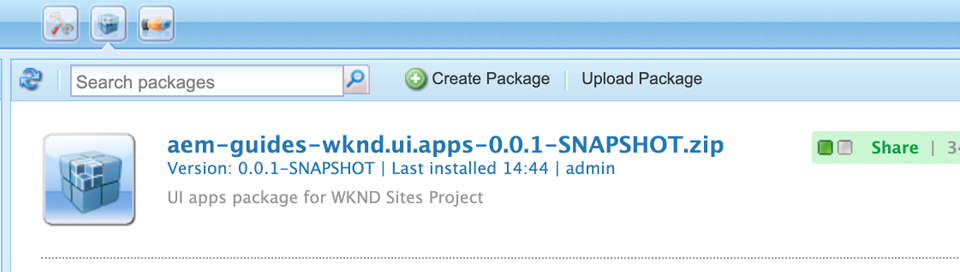

# 프로젝트 설정 {#project-setup}

이 자습서에서는 Adobe Experience Manager 사이트의 코드 및 구성을 관리하기 위한 다중 모듈 프로젝트 생성에 대해 설명합니다.

## 전제 조건 {#prerequisites}

필요한 도구 및 [로컬 개발 환경 설정을 위한 지침을 검토하십시오](overview.md#local-dev-environment). 로컬에서 사용 가능한 새로운 Adobe Experience Manager 인스턴스가 있고 추가적인 샘플/데모 패키지가 설치되지 않았는지 확인합니다(필수 서비스 팩 제외).

## 목표 {#objective}

1. Maven 원형형을 사용하여 새로운 AEM 프로젝트를 생성하는 방법을 학습합니다.
1. AEM 프로젝트 원형을 통해 생성된 다양한 모듈과 이러한 모듈을 함께 사용하는 방법을 파악할 수 있습니다.
1. AEM 코어 구성 요소가 AEM 프로젝트에 어떻게 포함되어 있는지 이해합니다.

## 구축 내용 {#what-build}

>[!VIDEO](https://video.tv.adobe.com/v/30152/?quality=12&learn=on)

이 장에서는 AEM 프로젝트 원형을 사용하여 새로운 Adobe Experience Manager 프로젝트를 [제작하게 됩니다](https://github.com/adobe/aem-project-archetype). AEM 프로젝트에는 사이트 구현에 사용되는 모든 코드, 컨텐츠 및 구성이 포함되어 있습니다. 이 장에서 생성된 프로젝트는 WKND 사이트 구현의 기초가 되며, 차후 장에 세워진다.

## 배경 {#background}

**마벤 프로젝트란?** - [Apache Maven](https://maven.apache.org/) 은 프로젝트를 빌드하는 소프트웨어 관리 도구입니다. *모든 Adobe Experience Manager* 구현에서는 Maven 프로젝트를 사용하여 AEM 위에 사용자 정의 코드를 만들고, 관리하고, 배포합니다.

**마벤의 원형이란?** - [마비안 원형은](https://maven.apache.org/archetype/index.html) 새로운 프로젝트를 생성하기 위한 템플릿이나 패턴입니다. AEM 프로젝트 원형에서는 사용자 정의 네임스페이스로 새 프로젝트를 생성하고 모범 사례를 따르는 프로젝트 구조를 포함시켜 프로젝트를 가속화할 수 있습니다.

## 프로젝트 만들기 {#create}

AEM용 Maven 다중 모듈 프로젝트를 만들기 위한 두 가지 옵션이 있습니다. 이 자습서는 Maven AEM Project [원형형 **22를**](https://github.com/adobe/aem-project-archetype)활용합니다. 또한 Cloud Manager [는 AEM 애플리케이션 프로젝트 생성을 시작하는 UI 마법사도](https://docs.adobe.com/content/help/en/experience-manager-cloud-manager/using/getting-started/create-an-application-project.html) 제공합니다. Cloud Manager UI에서 생성된 기본 프로젝트는 원형을 직접 사용하는 구조와 동일한 구조를 갖게 됩니다.

>[!NOTE]
>
>이 튜토리얼을 따라 하기 위해 원형 버전 **22** 을 사용하십시오. 그러나 **최신** 버전의 원형 버전을 사용하여 새로운 프로젝트를 생성하는 것이 좋습니다.

다음 일련의 단계는 UNIX 기반 명령줄 터미널을 사용하여 수행되지만 Windows 터미널을 사용하는 경우 비슷해야 합니다.

1. 명령줄 터미널을 열고 Maven이 설치되어 있고 명령줄 경로에 추가되었는지 확인합니다.

   ```shell
   $ mvn --version
   Apache Maven 3.6.2
   Maven home: /Library/apache-maven-3.6.2
   Java version: 11.0.4, vendor: Oracle Corporation, runtime: /Library/Java/JavaVirtualMachines/jdk-11.0.4.jdk/Contents/Home
   ```

1. 다음 명령을 실행하여 **adobe-public** 프로필이 활성 상태인지 확인합니다.

   ```shell
   $ mvn help:effective-settings
       ...
   <activeProfiles>
       <activeProfile>adobe-public</activeProfile>
   </activeProfiles>
   <pluginGroups>
       <pluginGroup>org.apache.maven.plugins</pluginGroup>
       <pluginGroup>org.codehaus.mojo</pluginGroup>
   </pluginGroups>
   </settings>
   [INFO] ------------------------------------------------------------------------
   [INFO] BUILD SUCCESS
   [INFO] ------------------------------------------------------------------------
   [INFO] Total time:  0.856 s
   ```

   **adobe-public** 이 표시되지 **않으면** Adobe 보고서가 `~/.m2/settings.xml` 파일에서 올바르게 참조되지 않는다는 것을 나타냅니다. 로컬 개발 환경에서 Apache Maven을 설치하고 구성하려면 단계 [를 다시 방문하십시오](https://docs.adobe.com/content/help/en/experience-manager-learn/foundation/development/set-up-a-local-aem-development-environment.html#install-apache-maven).

1. AEM 프로젝트를 생성할 디렉토리로 이동합니다. 프로젝트의 소스 코드를 유지 관리할 모든 디렉토리가 될 수 있습니다. 예를 들어 사용자의 홈 디렉토리 `code` 아래에 이름이 지정된 디렉토리입니다.

   ```shell
   $ cd ~/code
   ```

1. 다음을 명령줄에 붙여 넣어 일괄 처리 모드에서 프로젝트를 [생성합니다](https://maven.apache.org/archetype/maven-archetype-plugin/examples/generate-batch.html).

   ```shell
   $ mvn archetype:generate -B \
       -DarchetypeGroupId=com.adobe.granite.archetypes \
       -DarchetypeArtifactId=aem-project-archetype \
       -DarchetypeVersion=22 \
       -DgroupId=com.adobe.aem.guides \
       -Dversion=0.0.1-SNAPSHOT \
       -DappsFolderName=wknd \
       -DartifactId=aem-guides-wknd \
       -Dpackage=com.adobe.aem.guides.wknd \
       -DartifactName="WKND Sites Project" \
       -DcomponentGroupName=WKND \
       -DconfFolderName=wknd \
       -DcontentFolderName=wknd \
       -DcssId=wknd \
       -DisSingleCountryWebsite=n \
       -Dlanguage_country=en_us \
       -DoptionAemVersion=6.5.0 \
       -DoptionDispatcherConfig=none \
       -DoptionIncludeErrorHandler=n \
       -DoptionIncludeExamples=y \
       -DoptionIncludeFrontendModule=y \
       -DpackageGroup=wknd \
       -DsiteName="WKND Site"
   ```

   >[!NOTE]
   >
   >기본적으로 Maven 원형에서 프로젝트를 생성하면 대화형 모드가 사용됩니다. 일괄 처리 모드를 사용하여 생성된 모든 값을 과도하게 정렬하지 않도록 합니다. 또한 Eclipse용 [AEM 개발자 도구 플러그인을 사용하여 Maven AEM 프로젝트를 만들 수도 있습니다](https://helpx.adobe.com/experience-manager/6-5/sites/developing/using/aem-eclipse.html).

   >[!CAUTION]
   >
   >다음과 같은 오류가 발생하는 경우: *project standalone-pom에서 goal org.apache.maven.plugins:maven-tranype-plugin:3.1.1:generate (default-cli) on project standalone-pom:원하는 원형이 존재하지*&#x200B;않습니다. Adobe 보고서가 `~/.m2/settings.xml` 파일에서 올바르게 참조되지 않음을 나타냅니다. 이전 단계를 다시 방문하여 settings.xml 파일이 Adobe 보고서를 참조하는지 확인하십시오.

   다음 표에는 이 자습서에 사용된 값이 나와 있습니다.

   | 이름 | 값 | 설명 |
   |-----------------------------|---------|--------------------|
   | groupId | com.adobe.aem.guides | 베이스 마비그룹 ID |
   | artifactId | aem-guides-wknd | 기본 Maven ArtifactId |
   | 버전 | 0.0.1-스냅샷 | 버전 |
   | 패키지 | com.adobe.aem.guides.wknd | Java 소스 패키지 |
   | appsFolderName | wknd | /apps 폴더 이름 |
   | artifactName | WKND Sites Project | Maven 프로젝트 이름 |
   | componentGroupName | WKND | AEM 구성 요소 그룹 이름 |
   | contentFolderName | wknd | /content 폴더 이름 |
   | confFolderName | wknd | /conf 폴더 이름 |
   | cssId | wknd | 생성된 css에 사용된 접두사 |
   | packageGroup | wknd | 콘텐츠 패키지 그룹 이름 |
   | siteName | WKND 사이트 | AEM 사이트 이름 |
   | optionAemVersion | 6.5.0 | Target AEM 버전 |
   | language_country | en_us | 언어/국가 코드를 사용하여 컨텐츠 구조를 생성합니다(예: en_us). |
   | optionIncludeExamples | y | 구성 요소 라이브러리 예제 사이트 포함 |
   | optionIncludeErrorHandler | n | 사용자 지정 404 응답 페이지 포함 |
   | optionIncludeFrontendModule | y | 전용 프런트 엔드 모듈 포함 |
   | isSingleCountryWebsite | n | 예제 컨텐츠에서 언어 마스터 구조 만들기 |
   | optionDispatcherConfig | 없음 | 발송자 구성 모듈 생성 |

1. 다음 폴더 및 파일 구조는 로컬 파일 시스템의 Maven 원형에서 생성됩니다.

   ```plain
    ~/code/
       |--- aem-guides-wknd/
           |--- all/
           |--- core/
           |--- ui.apps/
           |--- ui.content/
           |--- ui.frontend /
           |--- it.launcher/
           |--- it.tests/
           |--- pom.xml
           |--- README.md
           |--- .gitignore
   ```

## 프로젝트 빌드 {#build}

이제 새 프로젝트를 생성했으므로 프로젝트 코드를 AEM의 로컬 인스턴스에 배포할 수 있습니다.

1. 포트 **4502에서 로컬로 실행되는 AEM 인스턴스가 있는지 확인합니다**.
1. 명령줄에서 프로젝트 디렉터리로 `aem-guides-wknd` 이동합니다.

   ```shell
   $ cd aem-guides-wknd
   ```

1. 다음 명령을 실행하여 전체 프로젝트를 빌드하고 AEM에 배포합니다.

   ```shell
   $ mvn -PautoInstallSinglePackage clean install
   ...
   [INFO] ------------------------------------------------------------------------
   [INFO] Reactor Summary for aem-guides-wknd 0.0.1-SNAPSHOT:
   [INFO]
   [INFO] aem-guides-wknd .................................... SUCCESS [  0.394 s]
   [INFO] WKND Sites Project - Core .......................... SUCCESS [  7.299 s]
   [INFO] WKND Sites Project - UI Frontend ................... SUCCESS [ 31.938 s]
   [INFO] WKND Sites Project - Repository Structure Package .. SUCCESS [  0.736 s]
   [INFO] WKND Sites Project - UI apps ....................... SUCCESS [  4.025 s]
   [INFO] WKND Sites Project - UI content .................... SUCCESS [  1.447 s]
   [INFO] WKND Sites Project - All ........................... SUCCESS [  0.881 s]
   [INFO] WKND Sites Project - Integration Tests Bundles ..... SUCCESS [  1.052 s]
   [INFO] WKND Sites Project - Integration Tests Launcher .... SUCCESS [  1.239 s]
   [INFO] ------------------------------------------------------------------------
   [INFO] BUILD SUCCESS
   [INFO] ------------------------------------------------------------------------
   ```

   Maven 프로필은 프로젝트의 개별 모듈을 `autoInstallSinglePackage` 컴파일하고 단일 패키지를 AEM 인스턴스에 배포합니다. 기본적으로 이 패키지는 포트 **4502** 및 의 자격 증명과 함께 로컬로 실행되는 AEM 인스턴스에 배포됩니다 `admin:admin`.

1. 로컬 AEM 인스턴스의 패키지 관리자로 이동합니다. [http://localhost:4502/crx/packmgr/index.jsp](http://localhost:4502/crx/packmgr/index.jsp). 3개의 패키지 `aem-guides-wknd.ui.apps`, `aem-guides-wknd.ui.content`및 `aem-guides-wknd.all`.

   또한 [AEM Core Components용](https://docs.adobe.com/content/help/ko-KR/experience-manager-core-components/using/introduction.html) 여러 패키지가 원형 프로젝트에 포함되어 있어야 합니다. 이 내용은 튜토리얼의 후반부에서 다룹니다.

1. 사이트 콘솔로 이동합니다. [http://localhost:4502/sites.html/content](http://localhost:4502/sites.html/content). WKND 사이트는 사이트 중 하나가 될 것입니다. 여기에는 미국 및 언어 마스터 계층 구조의 사이트 구조가 포함됩니다. 이 사이트 계층 구조는 원형 `language_country` 을 사용하여 프로젝트를 생성할 때 및 `isSingleCountryWebsite` 에 대한 값을 기반으로 합니다.

1. 페이지를 선택하고 메뉴 모음에서 **** `>` 편집 ******** 단추를 클릭하여 미국영어페이지를 엽니다.

   

1. 일부 컨텐츠는 이미 만들어져 있으며 몇 가지 구성 요소를 페이지에 추가할 수 있습니다. 이러한 구성 요소를 테스트하여 기능에 대한 아이디어를 얻을 수 있습니다. 이 페이지 및 구성 요소의 구성 방식은 튜토리얼 후반부에서 자세히 살펴봅니다.

## Inspect 프로젝트 {#project-structure}

AEM 원형은 다음과 같은 개별적인 마비단원으로 구성되어 있습니다.

* [핵심](https://docs.adobe.com/content/help/en/experience-manager-core-components/using/developing/archetype/core.html) - OSGi 서비스, 청취자 또는 예약자와 같은 모든 핵심 기능뿐만 아니라 서블릿이나 요청 필터와 같은 구성 요소 관련 Java 코드가 포함된 Java 번들.
* [ui.apps](https://docs.adobe.com/content/help/en/experience-manager-core-components/using/developing/archetype/uiapps.html) - 프로젝트의 /apps 부분, 즉 JS&amp;CSS clientlibs, 구성 요소 및 OSGi 구성을 포함합니다.
* [ui.content](https://docs.adobe.com/content/help/en/experience-manager-core-components/using/developing/archetype/uicontent.html) - 편집 가능한 템플릿, 메타데이터 스키마(/content, /conf)와 같은 구조 컨텐츠 및 구성을 포함합니다.
* ui.tests - 서버측에서 실행되는 JUnit 테스트를 포함하는 Java 번들 이 번들은 프로덕션에 배포되지 않습니다.
* ui.launcher - ui.tests 번들(및 종속 번들)을 서버에 배포하고 원격 JUnit 실행을 트리거하는 풀 코드를 포함합니다
* [ui.frontend](https://docs.adobe.com/content/help/ko-KR/experience-manager-core-components/using/developing/archetype/uifrontend.html) - (선택 사항)에는 Webpack 기반 프런트 엔드 빌드 모듈을 사용하는 데 필요한 가공물이 포함되어 있습니다.
* 모두 - 위 모듈을 AEM 환경에 배포할 수 있는 단일 패키지로 결합하는 빈 Maven 모듈입니다.


Maven 모듈에 대한 자세한 내용은 [AEM 프로젝트 원형](https://docs.adobe.com/content/help/ko-KR/experience-manager-core-components/using/developing/archetype/overview.html) 설명서를 참조하십시오.

## 고급 마웬 명령 {#advanced-maven-commands}

개발 중에 모듈 중 하나만 사용하여 작업할 수 있으므로 시간을 절약하기 위해 전체 프로젝트를 빌드하지 않으려는 경우가 있습니다. AEM 게시 인스턴스에 직접 배포하거나 포트 4502에서 실행되지 않는 AEM 인스턴스에 직접 배포할 수도 있습니다.

개발 과정에서 보다 유연하게 사용할 수 있는 몇 가지 추가 Maven 프로파일과 명령을 살펴보겠습니다.

### 핵심 모듈 {#core-module}

코어 **[](https://docs.adobe.com/content/help/en/experience-manager-core-components/using/developing/archetype/core.html)** 모듈에는 프로젝트와 연결된 모든 Java 코드가 포함되어 있습니다. OSGi 번들을 AEM에 배포하면 이 모듈만 빌드하려면:

1. 폴더(아래) `core` 로 `aem-guides-wknd`이동합니다.

   ```shell
   $ cd core/
   ```

1. 다음 명령을 실행합니다.

   ```shell
   $ mvn -PautoInstallBundle clean install
   ...
   [INFO] --- sling-maven-plugin:2.4.0:install (install-bundle) @ aem-guides-wknd.core ---
   [INFO] Installing Bundle aem-guides-wknd.core(~/code/aem-guides-wknd/core/target/aem-guides-wknd.core-0.0.1-SNAPSHOT.jar) to http://localhost:4502/system/console via WebConsole
   [INFO] Bundle installed
   [INFO] ------------------------------------------------------------------------
   [INFO] BUILD SUCCESS
   [INFO] ------------------------------------------------------------------------
   [INFO] Total time:  8.558 s
   [INFO] Finished at: 2019-12-06T13:40:21-08:00
   [INFO] ------------------------------------------------------------------------
   ```

1. http://localhost:4502/system/console/bundles으로 [이동합니다](http://localhost:4502/system/console/bundles). OSGi 웹 콘솔이며 AEM 인스턴스에 설치된 모든 번들에 대한 정보가 포함되어 있습니다.

1. Id **정렬 열을** 전환하면 WKND 번들이 설치되고 활성화되어 있어야 합니다.

   

1. CRXDE- [Lite에서 항아리의 &#39;물리적&#39; 위치를 볼 수 있습니다](http://localhost:4502/crx/de/index.jsp#/apps/wknd/install/wknd-sites-guide.core-0.0.1-SNAPSHOT.jar).

   

### Ui.apps 및 Ui.content 모듈 {#apps-content-module}

ui.apps **[maven 모듈에는 아래 사이트에 필요한 모든 렌더링 코드가 포함되어](https://docs.adobe.com/content/help/en/experience-manager-core-components/using/developing/archetype/uiapps.html)** `/apps`있습니다. 여기에는 clientlibs라는 AEM 형식으로 저장되는 CSS/JS가 [포함됩니다](https://helpx.adobe.com/experience-manager/6-5/sites/developing/using/clientlibs.html). 동적 HTML [을](https://docs.adobe.com/docs/en/htl/overview.html) 렌더링하기 위한 HTL 스크립트도 포함되어 있습니다. ui.apps **** 모듈을 JCR의 구조에 대한 맵으로 생각할 수 있지만 파일 시스템에 저장되고 소스 제어에 커밋될 수 있는 형식으로 생각하면 됩니다. ui.apps **** 모듈에는 코드만 포함되어 있습니다.

이 모듈만 빌드하려면:

1. 명령줄에서 폴더(아래) `ui.apps` 로 `aem-guides-wknd`이동합니다.

   ```shell
   $ cd ../ui.apps
   ```

1. 다음 명령을 실행합니다.

   ```shell
   $ mvn -PautoInstallPackage clean install
   ...
   Package installed in 122ms.
   [INFO] ------------------------------------------------------------------------
   [INFO] BUILD SUCCESS
   [INFO] ------------------------------------------------------------------------
   [INFO] Total time:  6.972 s
   [INFO] Finished at: 2019-12-06T14:44:12-08:00
   [INFO] ------------------------------------------------------------------------
   ```

1. http://localhost:4502/crx/packmgr/index.jsp으로 [이동합니다](http://localhost:4502/crx/packmgr/index.jsp). 패키지가 처음 설치된 패키지로 표시되고 다른 패키지보다 최신 타임스탬프가 있어야 합니다. `ui.apps`

   

1. 명령줄로 돌아가서 폴더 내에서 다음 명령을 `ui.apps` 실행합니다.

   ```shell
   $ mvn -PautoInstallPackagePublish clean install
   ...
   [INFO] --- content-package-maven-plugin:1.0.2:install (install-package-publish) @ aem-guides-wknd.ui.apps ---
   [INFO] Installing aem-guides-wknd.ui.apps (/Users/dgordon/code/aem-guides-wknd/ui.apps/target/aem-guides-wknd.ui.apps-0.0.1-SNAPSHOT.zip) to http://localhost:4503/crx/packmgr/service.jsp
   [INFO] I/O exception (java.net.ConnectException) caught when processing request: Connection refused (Connection refused)
   [INFO] Retrying request
   [INFO] I/O exception (java.net.ConnectException) caught when processing request: Connection refused (Connection refused)
   [INFO] Retrying request
   [INFO] I/O exception (java.net.ConnectException) caught when processing request: Connection refused (Connection refused)
   [INFO] Retrying request
   [INFO] ------------------------------------------------------------------------
   [INFO] BUILD FAILURE
   [INFO] ------------------------------------------------------------------------
   [INFO] Total time:  6.717 s
   [INFO] Finished at: 2019-12-06T14:51:45-08:00
   [INFO] ------------------------------------------------------------------------
   ```

   이 프로필 `autoInstallPackagePublish` 은 포트 **4503에서 실행되는 게시 환경에 패키지를 배포하기 위한 것입니다**. http://localhost:4503에서 실행되는 AEM 인스턴스를 찾을 수 없는 경우 위의 오류가 발생합니다.

1. 마지막으로 다음 명령을 실행하여 포트 `ui.apps` 4504에 **패키지를 배포합니다**.

   ```shell
   $ mvn -PautoInstallPackage clean install -Daem.port=4504
   ...
   [INFO] --- content-package-maven-plugin:1.0.2:install (install-package) @ aem-guides-wknd.ui.apps ---
   [INFO] Installing aem-guides-wknd.ui.apps (/Users/dgordon/code/aem-guides-wknd/ui.apps/target/aem-guides-wknd.ui.apps-0.0.1-SNAPSHOT.zip) to http://localhost:4504/crx/packmgr/service.jsp
   [INFO] I/O exception (java.net.ConnectException) caught when processing request: Connection refused (Connection refused)
   [INFO] Retrying request
   [INFO] I/O exception (java.net.ConnectException) caught when processing request: Connection refused (Connection refused)
   [INFO] Retrying request
   [INFO] I/O exception (java.net.ConnectException) caught when processing request: Connection refused (Connection refused)
   [INFO] Retrying request
   [INFO] ------------------------------------------------------------------------
   [INFO] BUILD FAILURE
   [INFO] --------------------------------------------------------------------
   ```

   포트 **4504에서 실행 중인 AEM 인스턴스가 없을 경우 빌드 오류가 다시** 발생합니다. 매개 변수 `aem.port` 는 의 POM 파일에 정의됩니다 `aem-guides-wknd/pom.xml`.

ui. **[content](https://docs.adobe.com/content/help/en/experience-manager-core-components/using/developing/archetype/uicontent.htm)** 모듈은 **ui.apps** 모듈과 동일한 방식으로 구조화됩니다. 유일한 차이점은 ui.content **모듈에는** mutable **** 컨텐츠라고 하는 내용이 포함되어 있다는 것입니다. **가변** 컨텐츠는 기본적으로 소스 제어에 저장되지만 AEM 인스턴스에서 직접 수정할 수 **있는 템플릿, 정책 또는 폴더 구조와 같은 비코드 구성을** 참조합니다. 페이지 및 템플릿의 장에서 이러한 주제를 자세히 살펴볼 수 있습니다. 현재는 **ui.apps** 모듈을 빌드하는 데 사용되는 동일한 Maven 명령을 사용하여 **ui.content** 모듈을 빌드할 수 있다는 점에서 중요한사항입니다. ui.content **** 폴더 내에서 위 단계를 반복하십시오.

### Ui.frontend 모듈 {#ui-frontend-module}

ui.frontend **[모듈은 사실](https://docs.adobe.com/content/help/ko-KR/experience-manager-core-components/using/developing/archetype/uifrontend.html)** 웹팩 [](https://webpack.js.org/) 프로젝트인 Maven 모듈입니다. 이 모듈은 JavaScript 및 CSS 파일을 출력하는 전용 프런트 엔드 빌드 시스템으로 설정되며, 이 시스템은 AEM에 배포됩니다. 개발자는 **프런트 엔드** 모듈을 사용하여 Sass, [TypeScript](https://sass-lang.com/)와 같은 언어를 사용하여 코드를 작성하고, [npm 모듈을](https://www.typescriptlang.org/)[](https://www.npmjs.com/) 사용하고, 출력을 AEM에 직접 통합할 수 있습니다.

ui. **frontend** 모듈은 클라이언트측 라이브러리 및 프런트 엔드 개발에 대한 장의 자세한 내용을 다룹니다. 일단 그것이 프로젝트에 어떻게 통합되었는지 봅시다.

1. 명령줄에서 폴더(아래) `ui.frontend` 로 `aem-guides-wknd`이동합니다.

   ```shell
   $ cd ../ui.frontend
   ```

1. 다음 명령을 실행합니다.

   ```shell
   $ mvn clean install
   ...
   [INFO] write clientlib asset txt file (type: js): ../ui.apps/src/main/content/jcr_root/apps/wknd/clientlibs/clientlib-site/js.txt
   [INFO] copy: dist/clientlib-site/site.js ../ui.apps/src/main/content/jcr_root/apps/wknd/clientlibs/clientlib-site/js/site.js
   [INFO]
   [INFO] write clientlib asset txt file (type: css): ../ui.apps/src/main/content/jcr_root/apps/wknd/clientlibs/clientlib-site/css.txt
   [INFO] copy: dist/clientlib-site/site.css ../ui.apps/src/main/content/jcr_root/apps/wknd/clientlibs/clientlib-site/css/site.css
   [INFO]
   [INFO] --- maven-assembly-plugin:3.1.1:single (default) @ aem-guides-wknd.ui.frontend ---
   [INFO] Reading assembly descriptor: assembly.xml
   [INFO] Building zip: /Users/dgordon/code/aem-guides-wknd/ui.frontend/target/aem-guides-wknd.ui.frontend-0.0.1-SNAPSHOT.zip
   [INFO]
   [INFO] --- maven-install-plugin:2.5.2:install (default-install) @ aem-guides-wknd.ui.frontend ---
   [INFO] Installing /Users/dgordon/code/aem-guides-wknd/ui.frontend/pom.xml to /Users/dgordon/.m2/repository/com/adobe/aem/guides/aem-guides-wknd.ui.frontend/0.0.1-SNAPSHOT/aem-guides-wknd.ui.frontend-0.0.1-SNAPSHOT.pom
   [INFO] Installing /Users/dgordon/code/aem-guides-wknd/ui.frontend/target/aem-guides-wknd.ui.frontend-0.0.1-SNAPSHOT.zip to /Users/dgordon/.m2/repository/com/adobe/aem/guides/aem-guides-wknd.ui.frontend/0.0.1-SNAPSHOT/aem-guides-wknd.ui.frontend-0.0.1-SNAPSHOT.zip
   [INFO] ------------------------------------------------------------------------
   [INFO] BUILD SUCCESS
   [INFO] ------------------------------------------------------------------------
   [INFO] Total time:  13.520 s
   [INFO] Finished at: 2019-12-06T15:26:16-08:00
   ```

   이런 선을 보세요 `copy: dist/clientlib-site/site.js ../ui.apps/src/main/content/jcr_root/apps/wknd/clientlibs/clientlib-site/js/site.js`. 이는 컴파일된 CSS 및 JS가 `ui.apps` 폴더로 복사되고 있음을 나타냅니다.

1. 파일에 대해 수정된 타임스탬프를 봅니다 `aem-guides-wknd/ui.apps/src/main/content/jcr_root/apps/wknd/clientlibs/clientlib-site/css.txt`. 모듈의 다른 파일보다 최근에 업데이트되어야 `ui.apps` 합니다.

   우리가 본 다른 모듈과는 달리 **ui.frontend** 모듈은 AEM에 직접 배포되지 않습니다. 대신 CSS 및 JS가 **ui.apps** 모듈로 복사되고 **ui.apps** 모듈이 AEM에 배포됩니다. 첫 번째 Maven 명령에서 빌드 순서를 보면 **ui.frontend** 가 항상 *ui.apps* 전에 **빌드되어**&#x200B;있는 것을 확인할 수 있습니다.

   이 자습서의 후반부에서는 신속한 개발을 위해 **ui.frontend** 모듈 및 포함된 webpack 개발 서버의 고급 기능을 살펴봅니다.

## 핵심 구성 요소 포함 {#core-components}

원형에는 프로젝트에 [AEM 코어 구성](https://docs.adobe.com/content/help/ko-KR/experience-manager-core-components/using/introduction.html) 요소가 자동으로 포함됩니다. 이전에는 배포된 패키지를 AEM에 검사할 때 핵심 구성 요소와 관련된 여러 패키지가 포함되었습니다. 핵심 구성 요소는 AEM Sites 프로젝트의 개발을 가속화하기 위해 고안된 기본 구성 요소 세트입니다. 핵심 구성 요소는 오픈 소스이며 [GitHub에서 사용할 수 있습니다](https://github.com/adobe/aem-core-wcm-components). 프로젝트에 핵심 구성 요소가 [포함된 방법에 대한 자세한 내용은 여기를 참조하십시오](https://docs.adobe.com/content/help/en/experience-manager-core-components/using/developing/archetype/overview.html#core-components).

1. 즐겨 사용하는 텍스트 편집기를 엽니다 `aem-guides-wknd/pom.xml`.

1. `core.wcm.components.version`을 검색합니다. 포함된 핵심 구성 요소 버전이 표시됩니다.

   ```xml
       <core.wcm.components.version>2.x.x</core.wcm.components.version>
   ```

   >[!NOTE]
   >
   > AEM 프로젝트 원형에는 AEM 코어 구성 요소 버전이 포함되지만, 이러한 프로젝트는 릴리스 주기가 다르므로 포함된 핵심 구성 요소 버전이 최신 버전은 아닐 수 있습니다. 가장 좋은 방법은 최신 버전의 핵심 구성 요소를 활용하는 것입니다. 새로운 기능 및 버그 수정이 자주 업데이트됩니다. 최신 [릴리스 정보는 GitHub에서 확인할 수 있습니다](https://github.com/adobe/aem-core-wcm-components/releases).

1. 섹션으로 스크롤할 경우 개별 핵심 구성 요소 종속성이 `dependencies` 표시됩니다.

   ```xml
   <dependency>
       <groupId>com.adobe.cq</groupId>
       <artifactId>core.wcm.components.core</artifactId>
       <version>${core.wcm.components.version}</version>
   </dependency>
   <dependency>
       <groupId>com.adobe.cq</groupId>
       <artifactId>core.wcm.components.content</artifactId>
       <type>zip</type>
       <version>${core.wcm.components.version}</version>
   </dependency>
   <dependency>
       <groupId>com.adobe.cq</groupId>
       <artifactId>core.wcm.components.config</artifactId>
       <type>zip</type>
       <version>${core.wcm.components.version}</version>
   </dependency>
   <dependency>
       <groupId>com.adobe.cq</groupId>
       <artifactId>core.wcm.components.examples</artifactId>
       <type>zip</type>
       <version>${core.wcm.components.version}</version>
   </dependency>
   ```

## 소스 제어 관리 {#source-control}

응용 프로그램의 코드를 관리하기 위해 소스 컨트롤 형식을 사용하는 것이 좋습니다. 이 자습서에서는 git 및 GitHub를 사용합니다. SCM에서 무시해야 하는 Maven 및/또는 선택한 IDE에서 생성된 여러 파일이 있습니다.

Maven은 코드 패키지를 빌드하고 설치할 때마다 대상 폴더를 만듭니다. 대상 폴더 및 내용은 SCM에서 제외되어야 합니다.

ui.apps 아래에서 생성된 많은 .content.xml 파일도 확인할 수 있습니다. 이러한 XML 파일은 JCR에 설치된 컨텐츠의 노드 유형과 속성을 매핑합니다. 이러한 파일은 중요하므로 무시해서는 **안** 됩니다.

AEM 프로젝트 원형에서는 파일을 안전하게 무시하고 사용할 수 있는 시작점으로 사용할 수 있는 샘플 `.gitignore` 파일을 생성합니다. 파일은 에서 생성됩니다 `<src>/aem-guides-wknd/.gitignore`.

## 리뷰 {#chapter-review}

>[!VIDEO](https://video.tv.adobe.com/v/30153/?quality=12&learn=on)

## 축하합니다! {#congratulations}

축하합니다. 첫 번째 AEM 프로젝트를 만들었습니다.

### 다음 단계 {#next-steps}

구성 요소 기초 자습서를 통해 간단한 `HelloWorld` 예를 통해 Adobe Experience Manager(AEM) 사이트 구성 요소의 기본 기술을 [이해할 수](component-basics.md) 있습니다.
