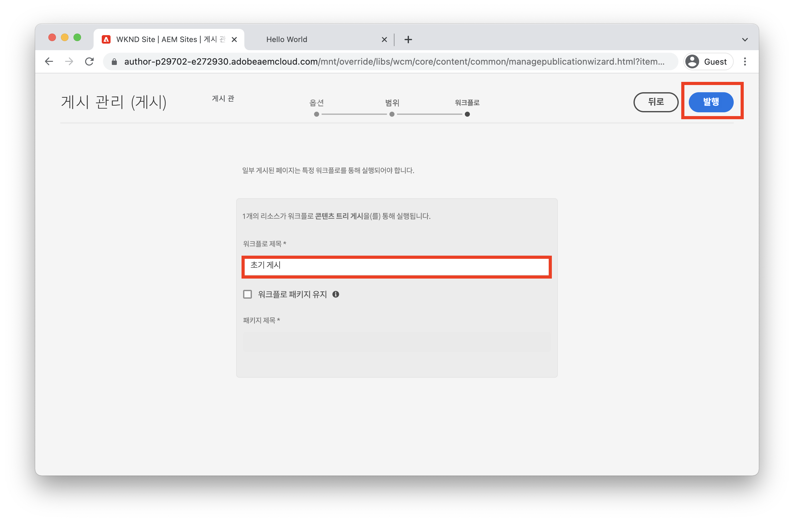

# 작성 및 게시 소개 {#author-content-publish}

사용자가 웹 사이트의 컨텐츠를 업데이트하는 방법을 이해하는 것이 중요합니다. 이 장에서는 **컨텐츠 작성자** 그리고 이전 장에서 생성된 사이트에 대한 편집 업데이트를 만듭니다. 이 장의 끝에 변경 사항을 게시하여 라이브 사이트가 어떻게 업데이트되는지 이해하겠습니다.

## 전제 조건 {#prerequisites}

이 내용은 여러 부분으로 구성된 자습서이며 [사이트 만들기](./create-site.md) 장이 완료되었습니다.

## 목표 {#objective}

1. 의 개념 이해 **페이지** 및 **구성 요소** AEM Sites.
1. 웹 사이트의 콘텐츠를 업데이트하는 방법을 알아봅니다.
1. 라이브 사이트에 변경 사항을 게시하는 방법을 알아봅니다.

## 새 페이지 만들기 {#create-page}

웹 사이트는 일반적으로 여러 페이지 경험을 형성하기 위해 페이지로 분할됩니다. AEM은 동일한 방식으로 컨텐츠를 구조화합니다. 그런 다음 사이트에 대한 새 페이지를 만듭니다.

1. AEM에 로그인 **작성자** 이전 장에서 사용된 서비스입니다.
1. AEM 시작 화면에서 를 클릭합니다. **Sites** > **WKND 사이트** > **영어** > **문서**
1. 오른쪽 상단 모서리에서 을(를) 클릭합니다. **만들기** > **페이지**.

   

   그러면 **페이지 만들기** 마법사

1. 을(를) 선택합니다 **문서 페이지** 템플릿을 선택하고 **다음**.

   AEM의 페이지는 페이지 템플릿을 기반으로 만들어집니다. 페이지 템플릿은 [페이지 템플릿](page-templates.md) 제2장.

1. 아래 **속성** 입력 **제목** &quot;Hello World&quot;
1. 설정 **이름** 대상 `hello-world` 을(를) 클릭합니다. **만들기**.

   

1. 대화 상자 팝업에서 **열기** 새로 만든 페이지를 엽니다.

## 구성 요소 작성 {#author-component}

AEM 구성 요소는 웹 페이지의 작은 모듈식 빌딩 블록으로 생각할 수 있습니다. UI를 논리 청크 또는 구성 요소로 분할하여 관리하는 것이 훨씬 쉬워집니다. 구성 요소를 다시 사용하려면 구성 요소를 구성해야 합니다. 이 작업은 작성 대화 상자를 통해 수행됩니다.

AEM에서는 [핵심 구성 요소](https://experienceleague.adobe.com/docs/experience-manager-core-components/using/introduction.html?lang=ko-KR) 프로덕션 준비 단계입니다. 다음 **핵심 구성 요소** 다음과 같은 기본 요소에서 범위 확장 [텍스트](https://experienceleague.adobe.com/docs/experience-manager-core-components/using/components/text.html) 및 [이미지](https://experienceleague.adobe.com/docs/experience-manager-core-components/using/components/image.html) 와 같은 더 복잡한 UI 요소를 [회전판](https://experienceleague.adobe.com/docs/experience-manager-core-components/using/components/carousel.html).

다음으로, AEM 페이지 편집기를 사용하여 몇 가지 구성 요소를 작성합니다.

1. 로 이동합니다 **Hello World** 이전 연습에서 만든 페이지입니다.
1. 로그인했는지 확인합니다. **편집** 모드 및 왼쪽 사이드 레일에서 를 클릭하고 **구성 요소** 아이콘.

   

   이렇게 하면 구성 요소 라이브러리가 열리고 페이지에서 사용할 수 있는 사용 가능한 구성 요소가 나열됩니다.

1. 아래로 스크롤하여 **드래그+드롭** a **텍스트(v2)** 구성 요소를 페이지의 편집 가능한 주 영역에 추가합니다.

   

1. 을(를) 클릭합니다. **텍스트** 강조 표시할 구성 요소를 클릭한 다음 **렌치** 아이콘  구성 요소의 대화 상자를 엽니다. 텍스트를 입력하고 대화 상자에 변경 사항을 저장합니다.

   

   다음 **텍스트** 이제 구성 요소에 페이지에 리치 텍스트가 표시됩니다.

1. 의 인스턴스를 드래그하지 않고 위의 단계를 반복합니다 **이미지(v2)** 구성 요소를 생성하지 않고 페이지에 속해 있어야 합니다. 를 엽니다. **이미지** 구성 요소의 대화 상자.

1. 왼쪽 레일에서 로 전환합니다. **자산 파인더** 다음을 클릭하여 **자산** 아이콘 .
1. **드래그+드롭** 이미지를 구성 요소의 대화 상자에 입력하고 **완료** 변경 사항을 저장하려면 을 클릭합니다.

   

1. 다음과 같은 구성 요소가 페이지에 있는지 확인합니다. **제목**, **탐색**, **검색** 수정되었습니다. 이러한 영역은 페이지 템플릿의 일부로 구성되며 개별 페이지에서 수정할 수 없습니다. 다음 장에서 더 많은 연구가 있을 것이다.

다른 구성 요소를 자유롭게 사용해 보십시오. 각각에 대한 설명서 [코어 구성 요소는 여기에서 찾을 수 있습니다](https://experienceleague.adobe.com/docs/experience-manager-core-components/using/introduction.html). 에 대한 자세한 비디오 시리즈 [페이지 작성은 여기에서 찾을 수 있습니다](https://experienceleague.adobe.com/docs/experience-manager-learn/sites/page-authoring/aem-sites-authoring-overview.html).

## 업데이트 게시 {#publish-updates}

AEM 환경은 **작성자 서비스** 그리고 **게시 서비스**. 이 장에서는 **작성자 서비스**. 사이트 방문자가 변경 사항을 보려면 사이트 방문자를 **게시 서비스**.

*작성자에서 게시까지 높은 수준의 컨텐츠 흐름*

**1.** 컨텐츠 작성자는 사이트 콘텐츠를 업데이트합니다. 실시간으로 푸시될 업데이트를 미리 보고 검토 및 승인할 수 있습니다.

**2.** 컨텐츠가 게시되었습니다. 게시는 온디맨드로 수행하거나 향후 날짜에 예약된 후에 수행할 수 있습니다.

**3.** 사이트 방문자에게는 게시 서비스에 반영된 변경 사항이 표시됩니다.

### 변경 사항 게시

이제 변경 사항을 게시합니다.

1. AEM 시작 화면에서 로 이동합니다. **Sites** 을(를) 선택하고 을(를) 선택합니다. **WKND 사이트**.
1. 을(를) 클릭합니다. **게시 관리** 메뉴 모음에서 를 클릭합니다.

   

   이 사이트에서는 완전히 새로운 사이트이므로 모든 페이지를 게시하려고 하며 게시 관리 마법사를 사용하여 게시해야 하는 사항을 정확하게 정의할 수 있습니다.

1. 아래 **옵션** 기본 설정을 **게시** 예약은 **지금**. **다음**&#x200B;을 클릭합니다.
1. 아래 **범위**&#x200B;에서 을(를) 선택합니다. **WKND 사이트** 을(를) 클릭합니다. **하위 설정 포함**. 대화 상자에서 다음을 확인합니다. **하위 포함**. 전체 사이트가 게시되었는지 확인하려면 나머지 상자를 선택 취소합니다.

   

1. 을(를) 클릭합니다. **게시된 참조** 버튼을 클릭합니다. 대화 상자에서 모든 항목이 선택되어 있는지 확인합니다. 여기에는 다음이 포함됩니다 **표준 사이트 템플릿** 사이트 템플릿에서 생성된 몇 가지 구성을 확인합니다. 클릭 **완료** 를 업데이트하여

   

1. 마지막으로 옆에 있는 상자를 선택합니다 **WKND 사이트** 을(를) 클릭합니다. **다음** 오른쪽 상단 모서리에서
1. 에서 **워크플로우** 단계를 입력하고 **워크플로우 제목**. 모든 텍스트가 될 수 있으며 나중에 감사 추적의 일부로 유용할 수 있습니다. &quot;초기 게시&quot;를 입력하고 를 클릭합니다. **게시**.

## 게시된 콘텐츠 보기 {#publish}

그런 다음 게시 서비스로 이동하여 변경 사항을 확인합니다.

1. 게시 서비스의 URL을 쉽게 가져올 수 있는 방법은 작성자 URL을 복사하여 `author` 단어 `publish`. 예:

   * **작성자 URL** - `https://author-pYYYY-eXXXX.adobeaemcloud.com/`
   * **게시 URL** - `https://publish-pYYYY-eXXXX.adobeaemcloud.com/`

1. 추가 `/content/wknd.html` 최종 URL이 다음과 같이 표시되도록 게시 URL에 추가합니다. `https://publish-pYYYY-eXXXX.adobeaemcloud.com/content/wknd.html`.

   >[!NOTE]
   >
   > 변경 `wknd.html` 에 고유한 이름을 제공한 경우 해당 사이트의 이름과 일치시키기 위해 [사이트 만들기](create-site.md).

1. 게시 URL로 이동하면 AEM 작성 기능 없이 사이트가 표시됩니다.

   

1. 사용 **탐색** 메뉴 클릭 **문서** > **Hello World** 이전에 만든 Hello World 페이지로 이동합니다.
1. 로 돌아갑니다. **AEM 작성자 서비스** 페이지 편집기에서 몇 가지 추가 컨텐츠를 변경할 수 있습니다.
1. 를 클릭하여 페이지 편집기 내에서 직접 이러한 변경 사항을 게시합니다. **페이지 속성** 아이콘 > **페이지 게시**

   

1. 로 돌아갑니다. **AEM 게시 서비스** 변경 사항을 확인합니다. 아마 당신은 **not** 업데이트를 즉시 참조하십시오. 이것은 **AEM 게시 서비스** include [Apache 웹 서버 및 CDN을 통해 캐싱](https://experienceleague.adobe.com/docs/experience-manager-cloud-service/implementing/content-delivery/caching.html). 기본적으로 HTML 컨텐츠는 최대 5분 동안 캐시됩니다.

1. 테스트/디버깅 목적으로 캐시를 무시하려면 다음과 같은 쿼리 매개 변수를 추가하면 됩니다. `?nocache=true`. URL은 다음과 같습니다 `https://publish-pYYYY-eXXXX.adobeaemcloud.com/content/wknd/en/article/hello-world.html?nocache=true`. 사용 가능한 캐싱 전략 및 구성에 대한 자세한 내용 [여기에서 찾을 수 있습니다.](https://experienceleague.adobe.com/docs/experience-manager-cloud-service/implementing/content-delivery/overview.html).

1. Cloud Manager에서 게시 서비스 URL을 찾을 수도 있습니다. 로 이동합니다 **Cloud Manager 프로그램** > **환경** > **환경**.

   

   아래 **환경 세그먼트** 에 대한 링크를 찾을 수 있습니다. **작성자** 및 **게시** 서비스.

## 축하합니다! {#congratulations}

축하합니다. AEM 사이트에 변경 사항을 작성 및 게시했습니다!

### 다음 단계 {#next-steps}

실제 구현 계획에서 일반적으로 사이트 만들기 전에 모형 및 UI 디자인을 사용하는 사이트를 계획합니다. 에서 Adobe XD UI 키트를 사용하여 Adobe Experience Manager Sites 구현을 디자인하고 가속화하는 방법을 살펴볼 수 있습니다 [Adobe XD을 사용한 UI 계획](./ui-planning-adobe-xd.md).

AEM Sites 기능을 계속 살펴보시겠습니까? 언제든지 다음 장에 바로 들어가세요 [페이지 템플릿](./page-templates.md) 를 눌러 페이지 템플릿과 페이지 간의 관계를 파악합니다.

