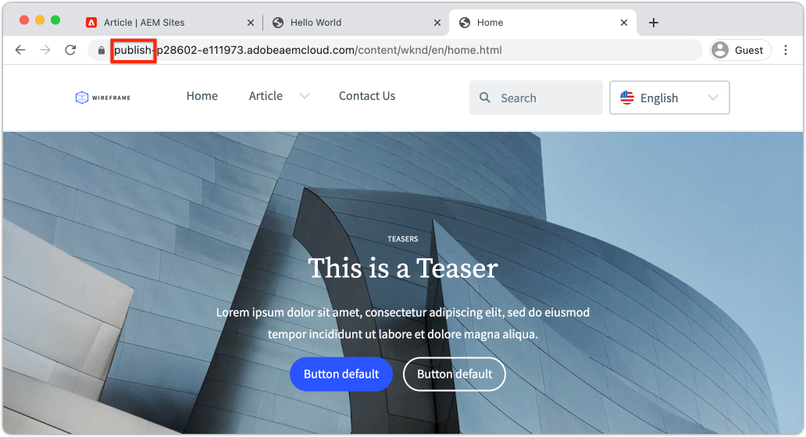

# 컨텐츠 작성 및 게시 변경 사항 {#author-content-publish}

>[!CAUTION]
>
> 여기에 소개된 빠른 사이트 생성 기능은 2021년 하반기에 출시될 예정입니다. 관련 설명서는 미리 보기를 위해 사용할 수 있습니다.

사용자가 웹 사이트의 컨텐츠를 업데이트하는 방법을 이해하는 것이 중요합니다. 이 장에서는 **컨텐츠 작성자**&#x200B;의 가상 사용자를 채택하고 이전 장에서 생성된 사이트에 대한 일부 편집 업데이트를 수행합니다. 이 장의 끝에 변경 사항을 게시하여 라이브 사이트가 어떻게 업데이트되는지 이해하겠습니다.

## 전제 조건 {#prerequisites}

이 내용은 여러 부분으로 구성된 자습서이며 [사이트 만들기](./create-site.md) 장에 설명된 단계가 완료되었다고 가정합니다.

## 목표 {#objective}

1. AEM Sites의 **페이지** 및 **구성 요소**&#x200B;의 개념을 이해합니다.
1. 웹 사이트의 콘텐츠를 업데이트하는 방법을 알아봅니다.
1. 라이브 사이트에 변경 사항을 게시하는 방법을 알아봅니다.

## 새 페이지 {#create-page} 만들기

웹 사이트는 일반적으로 여러 페이지 경험을 형성하기 위해 페이지로 분할됩니다. AEM은 동일한 방식으로 컨텐츠를 구조화합니다. 그런 다음 사이트에 대한 새 페이지를 만듭니다.

1. 이전 장에 사용된 AEM **Author** 서비스에 로그인합니다.
1. AEM 시작 화면에서 **사이트** > **WKND 사이트** > **영어** > **문서**&#x200B;를 클릭합니다
1. 오른쪽 상단 모서리에서 **만들기** > **페이지**&#x200B;를 클릭합니다.

   

   그러면 **페이지 만들기** 마법사가 나타납니다.

1. **Article Page** 템플릿을 선택하고 **다음**&#x200B;을 클릭합니다.

   AEM의 페이지는 페이지 템플릿을 기반으로 만들어집니다. 페이지 템플릿은 [페이지 템플릿](page-templates.md) 장에서 더 자세히 조사됩니다.

1. **속성** 아래에 &quot;Hello World&quot;의 **제목**&#x200B;을 입력합니다.
1. **이름**&#x200B;을 `hello-world`로 설정하고 **만들기**&#x200B;를 클릭합니다.

   

1. 대화 상자 팝업에서 **열기**&#x200B;를 클릭하여 새로 만든 페이지를 엽니다.

## 구성 요소 {#author-component} 작성

AEM 구성 요소는 웹 페이지의 작은 모듈식 빌딩 블록으로 생각할 수 있습니다. UI를 논리 청크 또는 구성 요소로 분할하여 관리하는 것이 훨씬 쉬워집니다. 구성 요소를 다시 사용하려면 구성 요소를 구성해야 합니다. 이 작업은 작성 대화 상자를 통해 수행됩니다.

AEM에서는 프로덕션 준비 상태의 [코어 구성 요소](https://experienceleague.adobe.com/docs/experience-manager-core-components/using/introduction.html?lang=ko-KR) 세트를 제공합니다. **코어 구성 요소**&#x200B;는 [텍스트](https://experienceleague.adobe.com/docs/experience-manager-core-components/using/components/text.html) 및 [이미지](https://experienceleague.adobe.com/docs/experience-manager-core-components/using/components/image.html)와 같은 기본 요소에서 [캐러셀](https://experienceleague.adobe.com/docs/experience-manager-core-components/using/components/carousel.html)과 같은 더 복잡한 UI 요소에 이르기까지 다양합니다.

다음으로, AEM 페이지 편집기를 사용하여 몇 가지 구성 요소를 작성하겠습니다.

1. 이전 연습에서 만든 **Hello World** 페이지로 이동합니다.
1. **편집** 모드 상태이고 왼쪽 레일에서 **구성 요소** 아이콘을 클릭합니다.

   

   이렇게 하면 구성 요소 라이브러리가 열리고 페이지에서 사용할 수 있는 사용 가능한 구성 요소가 나열됩니다.

1. 아래로 스크롤하여 **Drag+Drop** **텍스트(v2)** 구성 요소를 페이지의 편집 가능한 주 영역으로 드래그합니다.

   

1. **텍스트** 구성 요소를 클릭하여 강조 표시한 다음 **렌치** 아이콘 을 클릭하여 구성 요소의 대화 상자를 엽니다. 텍스트를 입력하고 대화 상자에 변경 사항을 저장합니다.

   

   이제 **텍스트** 구성 요소에 페이지에 리치 텍스트가 표시됩니다.

1. 페이지에서 **Image(v2)** 구성 요소의 인스턴스를 드래그하지 않고 위의 단계를 반복합니다. **이미지** 구성 요소의 대화 상자를 엽니다.

1. 왼쪽 레일에서 **자산** 아이콘 을 클릭하여 **자산 파인더** 로 전환합니다.
1. **이미지를** 구성 요소의 대화 상자로 드래그하고 [ **** 다운로드]를 클릭하여 변경사항을 저장합니다.

   

1. 페이지에 고정된 **제목**, **탐색**, **검색**&#x200B;과 같은 구성 요소가 있는지 확인합니다. 이러한 영역은 페이지 템플릿의 일부로 구성되며 개별 페이지에서 수정할 수 없습니다. 다음 장에서 더 많은 연구가 있을 것이다.

다른 구성 요소를 자유롭게 사용해 보십시오. 각 [코어 구성 요소에 대한 설명서는 여기에 있습니다](https://experienceleague.adobe.com/docs/experience-manager-core-components/using/introduction.html). [페이지 작성에 대한 자세한 비디오 시리즈는 여기에 있습니다](https://experienceleague.adobe.com/docs/experience-manager-learn/sites/page-authoring/aem-sites-authoring-overview.html).

## 업데이트 게시 {#publish-updates}

AEM 환경은 **작성자 서비스**&#x200B;와 **게시 서비스** 간에 분할됩니다. 이 장에서는 **작성자 서비스**&#x200B;에 있는 사이트를 몇 가지 수정했습니다. 사이트 방문자가 변경 사항을 보려면 **게시 서비스**&#x200B;에 게시해야 합니다.

*작성자에서 게시까지 높은 수준의 컨텐츠 흐름*

**1.** 컨텐츠 작성자는 사이트 콘텐츠를 업데이트합니다. 실시간으로 푸시될 업데이트를 미리 보고 검토 및 승인할 수 있습니다.

**2.** 컨텐츠가 게시되었습니다. 게시는 온디맨드로 수행하거나 향후 날짜에 예약된 후에 수행할 수 있습니다.

**3.** 사이트 방문자에게는 게시 서비스에 반영된 변경 사항이 표시됩니다.

### 변경 사항 게시

이제 변경 사항을 게시합니다.

1. AEM 시작 화면에서 **사이트**&#x200B;로 이동하고 **WKND 사이트**&#x200B;를 선택합니다.
1. 메뉴 모음에서 **게시 관리**&#x200B;를 클릭합니다.

   

   이 사이트에서는 완전히 새로운 사이트이므로 모든 페이지를 게시하려고 하며 게시 관리 마법사를 사용하여 게시해야 하는 사항을 정확하게 정의할 수 있습니다.

1. **옵션**&#x200B;에서 기본 설정을 **게시**&#x200B;로 두고 **지금**&#x200B;에 대해 예약하십시오. **다음**&#x200B;을 클릭합니다.
1. **범위**&#x200B;에서 **WKND 사이트**&#x200B;를 선택하고 **하위 포함**&#x200B;을 클릭합니다. 대화 상자에서 모든 상자를 선택 취소합니다. 전체 사이트를 게시하려고 합니다.

   

1. **게시된 참조** 단추를 클릭합니다. 대화 상자에서 모든 항목이 선택되어 있는지 확인합니다. 여기에는 **기본 AEM 사이트 템플릿** 및 사이트 템플릿에서 생성된 몇 가지 구성이 포함됩니다. **완료**&#x200B;를 클릭하여 업데이트합니다.

   

1. 마지막으로 오른쪽 상단 모서리에서 **게시** 를 클릭하여 콘텐츠를 게시합니다.

## 게시된 콘텐츠 보기 {#publish}

그런 다음 게시 서비스로 이동하여 변경 사항을 확인합니다.

1. 게시 서비스의 URL을 쉽게 가져올 수 있는 방법은 작성자 URL을 복사하고 `author` 단어를 `publish` 로 바꾸는 것입니다. 예:

   * **작성자 URL** - `https://author-pYYYY-eXXXX.adobeaemcloud.com/`
   * **게시 URL**  -  `https://publish-pYYYY-eXXXX.adobeaemcloud.com/`

1. 최종 URL이 다음과 같이 표시되도록 게시 URL에 `/content/wknd.html` 을 추가합니다.`https://publish-pYYYY-eXXXX.adobeaemcloud.com/content/wknd.html`.

   >[!NOTE]
   >
   > [사이트 생성](create-site.md) 중에 고유한 이름을 제공한 경우 사이트의 이름과 일치하도록 `wknd.html` 을 변경합니다.

1. 게시 URL로 이동하면 AEM 작성 기능 없이 사이트가 표시됩니다.

   

1. **탐색** 메뉴를 사용하여 **문서** > **Hello World**&#x200B;를 클릭하여 이전에 만든 Hello World 페이지로 이동합니다.
1. **AEM 작성자 서비스**&#x200B;로 돌아가서 페이지 편집기에서 몇 가지 추가 콘텐츠를 변경합니다.
1. **페이지 속성** 아이콘 > **페이지 게시**&#x200B;를 클릭하여 페이지 편집기 내에서 직접 이러한 변경 사항을 게시합니다

   

1. **AEM 게시 서비스**&#x200B;로 돌아가서 변경 사항을 확인합니다. 업데이트 내용이 즉시 표시되지 않는 **입니다.** 이것은 **AEM 게시 서비스**&#x200B;에 Apache 웹 서버 및 CDN](https://experienceleague.adobe.com/docs/experience-manager-cloud-service/implementing/content-delivery/caching.html)을 통한 [캐싱이 포함되어 있기 때문입니다. 기본적으로 HTML 콘텐츠는 ~5분 동안 캐시됩니다.

1. 테스트/디버깅 목적으로 캐시를 무시하려면 `?nocache=true` 과 같은 쿼리 매개 변수를 추가하면 됩니다. URL은 `https://publish-pYYYY-eXXXX.adobeaemcloud.com/content/wknd/en/article/hello-world.html?nocache=true` 과 비슷합니다. 사용 가능한 캐싱 전략 및 구성에 대한 자세한 내용은 [에서 확인할 수 있습니다](https://experienceleague.adobe.com/docs/experience-manager-cloud-service/implementing/content-delivery/overview.html).

1. Cloud Manager에서 게시 서비스 URL을 찾을 수도 있습니다. **Cloud Manager 프로그램** > **환경** > **환경**&#x200B;으로 이동합니다.

   

   **환경 세그먼트** 아래에서 **작성자** 및 **게시** 서비스에 대한 링크를 찾을 수 있습니다.

## 축하합니다! {#congratulations}

축하합니다. AEM 사이트에 변경 사항을 작성 및 게시했습니다!

### 다음 단계 {#next-steps}

[페이지 템플릿을 만들고 수정하는 방법을 알아봅니다](./page-templates.md). 페이지 템플릿과 페이지 간의 관계를 이해합니다. 컨텐츠에 대한 세부적인 거버넌스 및 브랜드 일관성을 제공하기 위해 페이지 템플릿의 정책을 구성하는 방법을 알아봅니다.  잘 구성된 잡지 기사 템플릿은 Adobe XD의 모집단 을 기반으로 만들어집니다.
