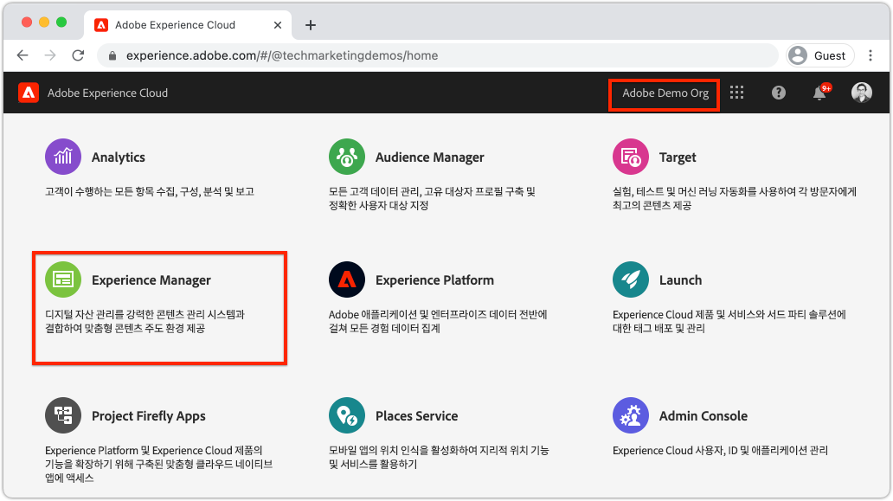
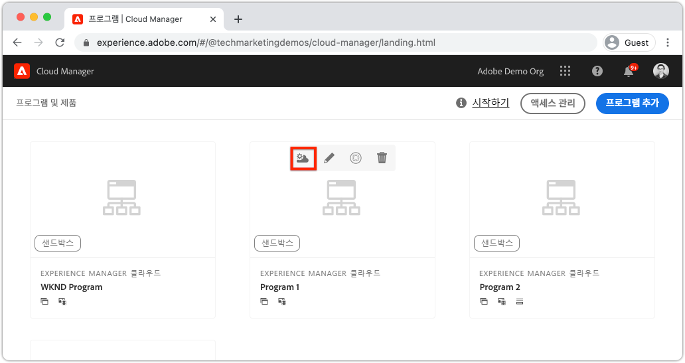
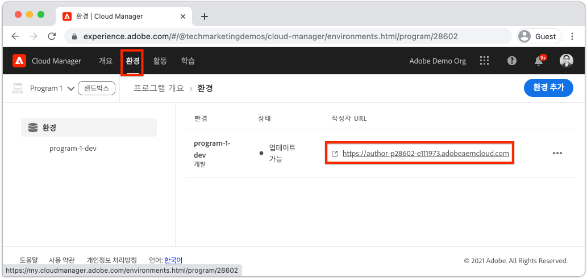
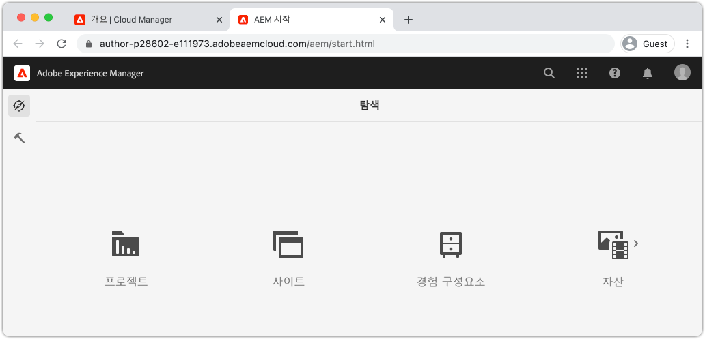
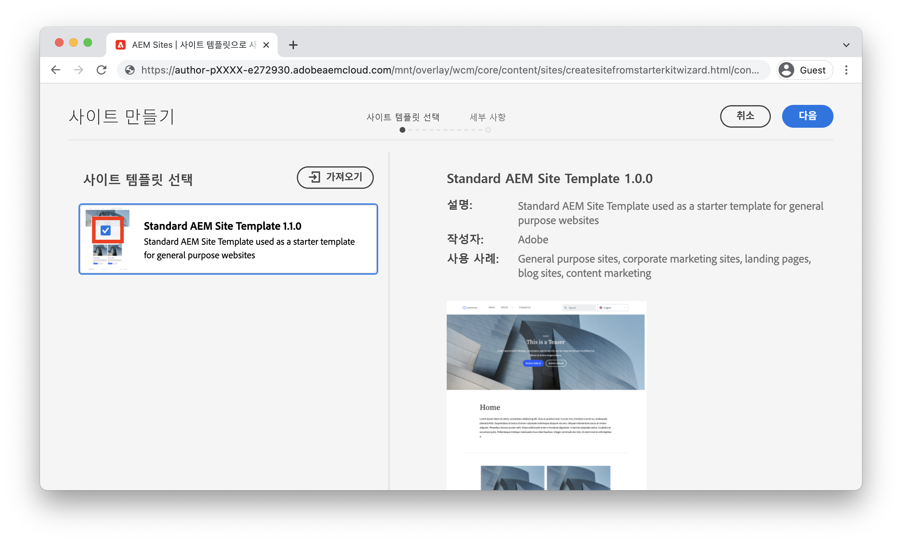
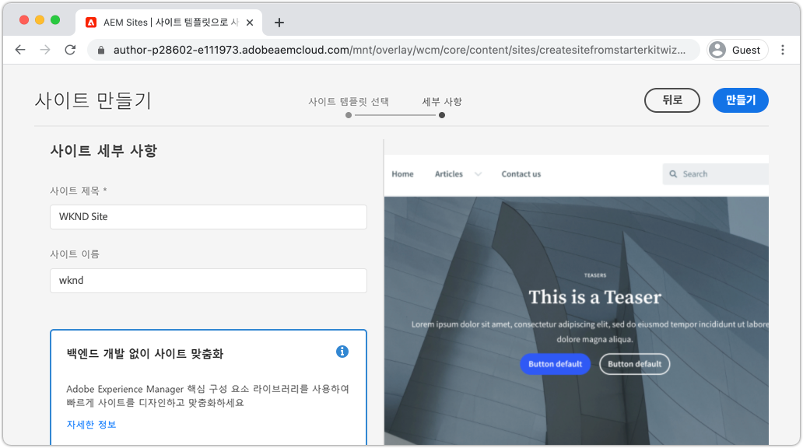
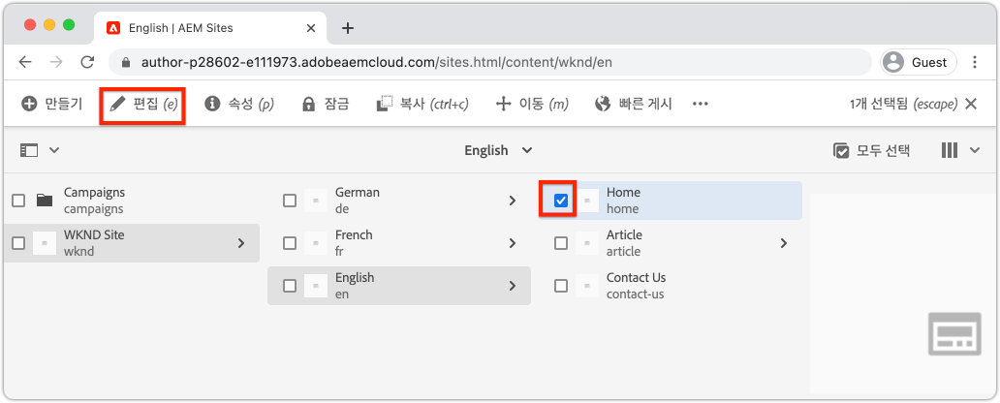
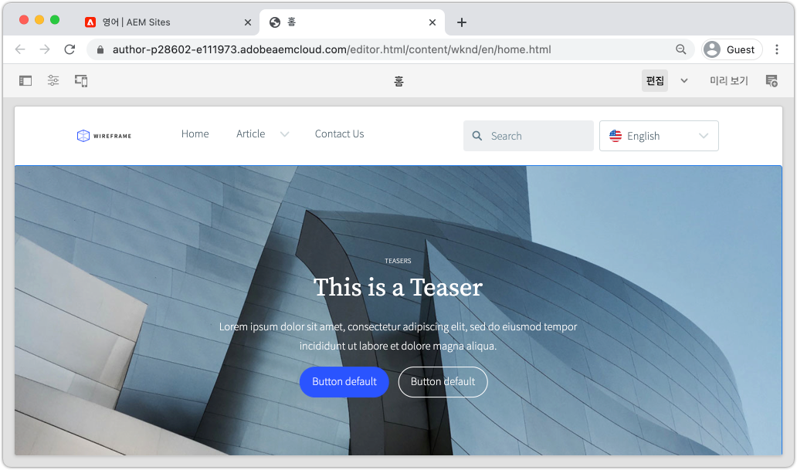

# 사이트 {#create-site} 만들기

>[!CAUTION]
>
> 여기에 소개된 빠른 사이트 제작 기능은 2021년 하반기에 출시될 예정입니다. 관련 설명서는 미리 보기 목적으로 사용할 수 있습니다.

이 장에서는 Adobe Experience Manager에서 새 사이트를 만드는 방법을 다룹니다. Adobe에서 제공하는 표준 사이트 템플릿은 시작점으로 사용됩니다.

## 전제 조건 {#prerequisites}

이 장의 단계는 Adobe Experience Manager에서 Cloud Service 환경으로 수행됩니다. AEM 환경에 대한 관리 액세스 권한이 있는지 확인합니다. 이 자습서를 완료할 때는 [샌드박스 프로그램](https://experienceleague.adobe.com/docs/experience-manager-cloud-service/onboarding/getting-access/sandbox-programs/introduction-sandbox-programs.html) 및 [개발 환경](https://experienceleague.adobe.com/docs/experience-manager-cloud-service/implementing/using-cloud-manager/manage-environments.html)을 사용하는 것이 좋습니다.

자세한 내용은 [온보딩 문서](https://experienceleague.adobe.com/docs/experience-manager-cloud-service/onboarding/home.html)를 검토하십시오.

## 목표 {#objective}

1. 사이트 만들기 마법사를 사용하여 새 사이트를 생성하는 방법을 알아봅니다.
1. 사이트 템플릿의 역할을 파악합니다.
1. 생성된 AEM 사이트를 살펴보십시오.

## Adobe Experience Manager 작성자 {#author}에 로그인

첫 번째 단계로 AEM에 Cloud Service 환경으로 로그인합니다. AEM 환경은 **작성자 서비스**&#x200B;와 **게시 서비스** 사이에 분할됩니다.

* **작성자 서비스**  - 사이트 컨텐츠가 작성, 관리 및 업데이트되는 곳입니다. 일반적으로 내부 사용자만 **작성자 서비스**&#x200B;에 액세스할 수 있고 로그인 화면 뒤에 있습니다.
* **게시 서비스**  - 라이브 웹 사이트를 호스팅합니다. 이 서비스는 최종 사용자가 볼 수 있으며 일반적으로 공개적으로 사용할 수 있습니다.

대부분의 자습서는 **작성자 서비스**&#x200B;를 사용하여 수행됩니다.

1. Adobe Experience Cloud [https://experience.adobe.com/](https://experience.adobe.com/)로 이동합니다. 개인 계정 또는 회사/학교 계정을 사용하여 로그인합니다.
1. 메뉴에서 올바른 조직이 선택되었는지 확인하고 **Experience Manager**&#x200B;을 클릭합니다.

   

1. **클라우드 관리자**&#x200B;에서 **시작**&#x200B;을 클릭합니다.
1. 사용할 프로그램 위로 마우스를 가져간 후 **클라우드 관리자 프로그램** 아이콘을 클릭합니다.

   

1. 맨 위 메뉴에서 **환경**&#x200B;을 클릭하여 제공된 환경을 봅니다.

1. 사용할 환경을 찾아 **작성자 URL**&#x200B;을 클릭합니다.

   

   >[!NOTE]
   >
   >이 자습서에서는 **개발** 환경을 사용하는 것이 좋습니다.

1. AEM **작성자 서비스**&#x200B;에 새 탭이 시작됩니다. **Adobe**&#x200B;으로 로그인하면 동일한 Experience Cloud 자격 증명으로 자동으로 로그인됩니다.

1. 이제 리디렉션되고 인증된 후에 AEM 시작 화면이 표시됩니다.

   

>[!NOTE]
>
> Experience Manager에 액세스하는 데 문제가 있습니까? [온보딩 문서](https://experienceleague.adobe.com/docs/experience-manager-cloud-service/onboarding/home.html) 검토

## 기본 사이트 템플릿 다운로드

사이트 템플릿은 새 사이트의 시작점을 제공합니다. 사이트 템플릿에는 몇 가지 기본 테마, 페이지 템플릿, 구성 및 샘플 컨텐츠가 포함되어 있습니다. 사이트 템플릿에 포함된 내용은 개발자에게 전적으로 적용됩니다. Adobe은 새 구현을 가속화하기 위해 **기본 사이트 템플릿**&#x200B;을 제공합니다.

1. 새 브라우저 탭을 열고 GitHub에서 기본 사이트 템플릿 프로젝트로 이동합니다.[https://github.com/adobe/aem-site-template-basic](https://github.com/adobe/aem-site-template-basic). 프로젝트는 오픈 소스로 제공되며 누구나 사용할 수 있도록 라이센스가 부여되었습니다.
1. **릴리스**&#x200B;를 클릭하고 [최신 릴리스](https://github.com/adobe/aem-site-template-basic/releases/latest)로 이동합니다.
1. **자산** 드롭다운을 확장하고 템플릿 zip 파일을 다운로드합니다.

   

   이 zip 파일은 다음 연습에서 사용됩니다.

   >[!NOTE]
   >
   > 이 자습서는 기본 사이트 템플릿의 버전 **5.0.0**&#x200B;을 사용하여 작성되었습니다. 새 프로젝트를 시작하는 경우에는 항상 최신 버전을 사용하는 것이 좋습니다.

## 새 사이트 만들기

그런 다음 이전 연습에서 사이트 템플릿을 사용하여 새 사이트를 생성합니다.

1. AEM 환경으로 돌아갑니다. AEM 시작 화면에서 **사이트**&#x200B;로 이동합니다.
1. 오른쪽 위 모서리에서 **만들기** > **사이트(템플릿)**&#x200B;를 클릭합니다. 그러면 **사이트 만들기 마법사**&#x200B;가 표시됩니다.
1. **사이트 템플릿 선택** 아래에서 **가져오기** 단추를 클릭합니다.

   이전 연습에서 다운로드한 **.zip** 템플릿 파일을 업로드합니다.

1. **기본 AEM 사이트 템플릿**&#x200B;을 선택하고 **다음**&#x200B;을 클릭합니다.

   

1. **사이트 세부 사항** > **사이트 제목**&#x200B;에 `WKND Site`를 입력합니다.
1. **사이트 이름**&#x200B;에 `wknd`를 입력합니다.

   

   >[!NOTE]
   >
   > 공유 AEM 환경을 사용하는 경우 고유 식별자를 **사이트 이름**&#x200B;에 추가합니다. 예 `wknd-johndoe`. 이렇게 하면 여러 사용자가 충돌 없이 동일한 자습서를 완료할 수 있습니다.

1. **만들기**&#x200B;를 클릭하여 사이트를 생성합니다. AEM에서 웹 사이트 만들기를 완료하면 **성공** 대화 상자에서 **완료**&#x200B;를 클릭합니다.

## 새로운 사이트 살펴보기

1. 아직 없는 경우 AEM Sites 콘솔으로 이동합니다.
1. 새 **WKND 사이트**&#x200B;가 생성되었습니다. 다중 언어 계층 구조를 가진 사이트 구조가 포함됩니다.
1. 페이지를 선택하고 메뉴 모음에서 **편집** 단추를 클릭하여 **영어** > **홈** 페이지를 엽니다.

   

1. 시작 컨텐츠가 이미 만들어졌고 페이지에 여러 구성 요소를 추가할 수 있습니다. 이러한 구성 요소를 실험해 보면서 기능에 대한 아이디어를 얻을 수 있습니다. 다음 장에서는 구성 요소의 기본 사항을 살펴봅니다.

   

   *사이트 템플릿에서 제공하는 샘플 컨텐츠*

## 축하합니다!{#congratulations}

축하합니다. 첫 번째 AEM 사이트를 만들었습니다!

### 다음 단계 {#next-steps}

AEM, Adobe Experience Manager의 페이지 편집기를 사용하여 [콘텐츠 제작 및 게시](author-content-publish.md) 장에 있는 사이트의 컨텐츠를 업데이트합니다. atomic 구성 요소를 구성하여 컨텐츠를 업데이트하는 방법을 알아봅니다. AEM 작성자 및 게시 환경의 차이를 파악하고 라이브 사이트에 업데이트를 게시하는 방법을 알아봅니다.
