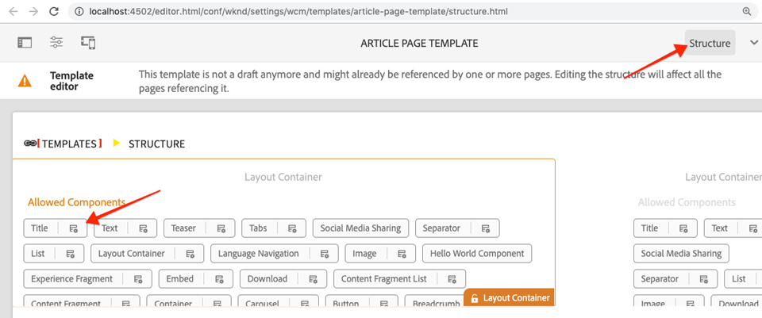
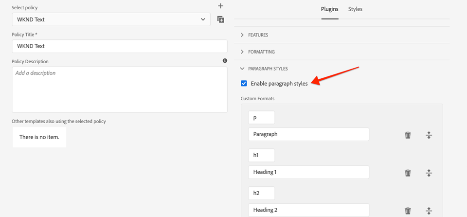
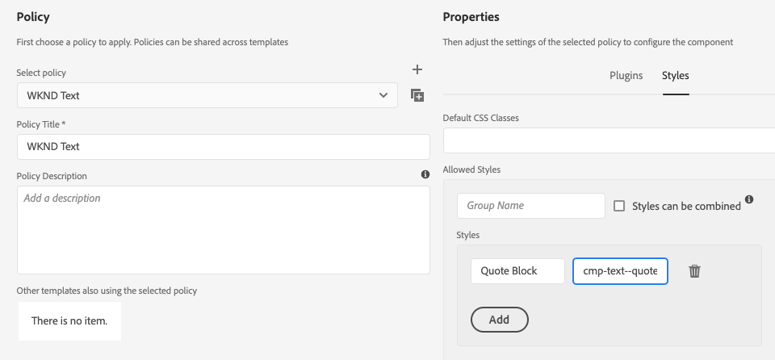

# 스타일 시스템을 사용한 개발 {#developing-with-the-style-system}

Experience Manager 스타일 시스템을 사용하여 개별 스타일을 구현하고 핵심 구성 요소를 다시 사용하는 방법을 알아봅니다. 이 자습서에서는 템플릿 편집기의 브랜드별 CSS 및 고급 정책 구성으로 핵심 구성 요소를 확장하기 위한 스타일 시스템 개발에 대해 설명합니다.

## 전제 조건 {#prerequisites}

필요한 도구 및 [로컬 개발 환경 설정을 위한 지침을 검토하십시오](overview.md#local-dev-environment).

또한 클라이언트측 라이브러리 및 [프런트 엔드 워크플로우](client-side-libraries.md) 튜토리얼을 검토하여 클라이언트측 라이브러리 및 AEM 프로젝트에 내장된 다양한 프런트 엔드 툴의 기본 사항을 이해하는 것이 좋습니다.

### 스타터 프로젝트

튜토리얼이 빌드하는 기본 라인 코드를 확인합니다.

1. github.com/adobe/aem-guides-wknd [저장소](https://github.com/adobe/aem-guides-wknd) 복제
1. 분기를 `style-system/start` 확인해 보세요

   ```shell
   $ git clone git@github.com:adobe/aem-guides-wknd.git ~/code/aem-guides-wknd
   $ cd ~/code/aem-guides-wknd
   $ git checkout style-system/start
   ```

1. Maven 기술을 사용하여 로컬 AEM 인스턴스에 코드 베이스를 배포할 수 있습니다.

   ```shell
   $ cd ~/code/aem-guides-wknd
   $ mvn clean install -PautoInstallSinglePackage
   ```

항상 [GitHub에서](https://github.com/adobe/aem-guides-wknd/tree/style-system/solution) 완료된 코드를 보거나 분기로 전환하여 로컬로 코드를 체크 아웃할 수 `style-system/solution`있습니다.

## 목표

1. 스타일 시스템을 사용하여 브랜드별 CSS를 AEM 코어 구성 요소에 적용하는 방법을 이해합니다.
1. BEM 표기법과 이 표기법을 사용하여 스타일에 대해 자세히 범위를 지정하는 방법을 알아봅니다.
1. 편집 가능한 템플릿으로 고급 정책 구성을 적용합니다.

## 구축 내용 {#what-you-will-build}

이 장에서는 [스타일 시스템 기능을](https://docs.adobe.com/content/help/en/experience-manager-learn/sites/page-authoring/style-system-feature-video-use.html) 사용하여 아티클 페이지에 사용되는 여러 가지 구성 요소를 만듭니다. 또한 스타일 시스템을 사용하여 머리글/바닥글 및 레이아웃 컨테이너와 같은 구조적 요소에 대한 변형을 만들 것입니다.

>[!VIDEO](https://video.tv.adobe.com/v/30386/?quality=12&learn=on)

## 배경 {#background}

개발자와 [템플릿](https://docs.adobe.com/content/help/en/experience-manager-65/developing/components/style-system.html) 편집자는 스타일 시스템을 사용하여 구성 요소의 시각적 변형을 여러 개 만들 수 있습니다. 그런 다음 작성자는 페이지를 작성할 때 사용할 스타일을 결정할 수 있습니다. Adobe는 튜토리얼의 나머지 부분 전체에서 스타일 시스템을 활용하여 몇 가지 고유한 스타일을 구현하고 낮은 코드 접근 방식에서는 핵심 구성 요소를 활용할 것입니다.

스타일 시스템의 일반적인 아이디어는 작성자가 구성 요소의 모양을 다양한 스타일로 선택할 수 있다는 것입니다. &quot;styles&quot;는 구성 요소의 바깥쪽 div에 삽입되는 추가 CSS 클래스에 의해 지원됩니다. 클라이언트 라이브러리에서 CSS 규칙은 이러한 스타일 클래스를 기반으로 추가되어 구성 요소의 모양이 변경됩니다.

스타일 시스템에 대한 [자세한 설명서는 여기에서 찾을 수 있습니다](https://docs.adobe.com/content/help/en/experience-manager-65/developing/components/style-system.html). 스타일 시스템을 이해하기 위한 뛰어난 [기술 비디오도 있습니다](https://docs.adobe.com/content/help/en/experience-manager-learn/sites/developing/style-system-technical-video-understand.html).

## 제목 구성 요소 스타일 {#title-component}

이 시점에서 [제목 구성](https://docs.adobe.com/content/help/en/experience-manager-core-components/using/components/title.html) 요소는 `/apps/wknd/components/content/title` ui.apps **모듈** 의 일부로서 프로젝트로 프록시되었습니다. 머리글 요소(`H1`, `H2`, `H3`..)의 기본 스타일은 다음 **파일** 의 ui.frontend `_elements.scss` 모듈에 이미 구현되었습니다 `ui.frontend/src/main/webpack/base/sass/_elements.scss`.

### 밑줄 스타일

WKND [아티클 디자인에는](assets/pages-templates/wknd-article-design.xd) 밑줄이 있는 제목 구성 요소의 고유한 스타일이 포함되어 있습니다. 두 개의 구성 요소를 만들거나 구성 요소 대화 상자를 수정하는 대신 스타일 시스템을 사용하여 작성자가 밑줄 스타일을 추가할 수 있습니다.


### Inspect 제목 구성 요소 마크업

프런트 엔드 개발자로서 핵심 구성 요소의 스타일 지정을 위한 첫 번째 단계는 구성 요소에서 생성한 마크업을 이해하는 것입니다.

생성된 프로젝트의 일부로 원형 유형이 **핵심 구성 요소 예** 프로젝트를 포함했습니다. 개발자 및 컨텐츠 작성자의 경우 핵심 구성 요소에서 사용 가능한 모든 기능을 쉽게 이해할 수 있습니다. 라이브 버전도 [제공됩니다](https://opensource.adobe.com/aem-core-wcm-components/library.html).

1. 새 브라우저를 열고 제목 구성 요소를 봅니다.

   로컬 AEM 인스턴스: [http://localhost:4502/editor.html/content/core-components-examples/library/title.html](http://localhost:4502/editor.html/content/core-components-examples/library/title.html)

   라이브 예: [https://opensource.adobe.com/aem-core-wcm-components/library/title.html](https://opensource.adobe.com/aem-core-wcm-components/library/title.html)

1. 다음은 제목 구성 요소의 마크업입니다.

   ```html
   <div class="cmp-title">
       <h1 class="cmp-title__text">Lorem Ipsum</h1>
   </div>
   ```

   제목 구성 요소의 BEM 표기법:

   ```plain
   BLOCK cmp-title
       ELEMENT cmp-title__text
   ```

1. 스타일 시스템은 구성 요소를 둘러싼 외부 div에 CSS 클래스를 추가합니다. 따라서 타깃팅할 마크업은 다음과 같이 표시됩니다.

   ```html
   <div class="STYLE-SYSTEM-CLASS-HERE"> <!-- Custom CSS class - implementation gets to define this -->
       <div class="cmp-title">
           <h1 class="cmp-title__text">Lorem Ipsum</h1>
       </div>
   </div>
   ```

### 밑줄 스타일 구현 - ui.frontend

다음으로 프로젝트의 **ui.frontend** 모듈을 사용하여 Underline 스타일을 구현할 것입니다. AEM의 로컬 인스턴스에 배포하기 **전에** ui.frontrend ** 모듈과 함께 번들로 제공되는 webpack 개발 서버를 사용할 것입니다.

1. ui.frontend 모듈 내에서 다음 명령을 실행하여 webpack **개발** 서버를 시작합니다.

   ```shell
   $ cd ~/code/aem-guides-wknd/ui.frontend/
   $ npm start
   
   > aem-maven-archetype@1.0.0 start code/aem-guides-wknd/ui.frontend
   > webpack-dev-server --open --config ./webpack.dev.js
   ```

   브라우저를 http://localhost:8080에서 [열어야 합니다](http://localhost:8080).

   >[!NOTE]
   >
   > 이미지가 손상된 경우 시작 프로젝트가 AEM의 로컬 인스턴스에 배포되었는지(포트 4502에서 실행), 사용된 브라우저도 로컬 AEM 인스턴스에 로그인했는지 확인합니다.

   

1. Eclipse 또는 선택한 IDE에서 다음 위치에 있는 파일을 `index.html` 엽니다. `ui.frontend/src/main/webpack/static/index.html`. 웹 팩 개발 서버에서 사용하는 정적 마크업입니다.
1. 제목 구성 요소의 인스턴스를 `index.html` 찾아 문서에 cmp-title을 검색하여 밑줄 스타일을 추가할 *수 있습니다*. Choose the Title component with the text *&quot;Banks of the Wall Skatepark&quot;* (line 218). 클래스를 주변 div `cmp-title--underline` 에 추가합니다.

   ```html
    <!-- before -->
    <div class="title aem-GridColumn aem-GridColumn--default--8">
        <div class="cmp-title">
            <h2 class="cmp-title__text">Vans off the Wall Skatepark</h2>
        </div>
    </div>
   ```

   ```html
    <!-- After -->
    <div class="cmp-title--underline title aem-GridColumn aem-GridColumn--default--8">
        <div class="cmp-title">
            <h2 class="cmp-title__text">Vans off the Wall Skatepark</h2>
        </div>
    </div>
   ```

1. 브라우저로 돌아가 추가 클래스가 마크업에 반영되었는지 확인합니다.
1. ui. **frontend** 모듈로 돌아가서 다음 위치에 있는 파일을 `title.scss` 업데이트합니다. `ui.frontend/src/main/webpack/components/content/title/scss/title.scss`:

   ```css
   /* Add Title Underline Style */
   .cmp-title--underline {
   
       .cmp-title {
       }
   
       .cmp-title__text {
           &:after {
           display: block;
               width: 84px;
               padding-top: 8px;
               content: '';
               border-bottom: 2px solid $brand-primary;
           }
       }
   }
   ```

   >[!NOTE]
   >
   >스타일 범위를 대상 구성 요소로 항상 엄격히 지정하는 것이 좋습니다. 이렇게 하면 페이지의 다른 영역에 추가 스타일이 적용되지 않습니다.
   >
   >모든 핵심 구성 요소는 **[BEM 표기법을 준수합니다](https://github.com/adobe/aem-core-wcm-components/wiki/css-coding-conventions)**. 구성 요소의 기본 스타일을 만들 때 외부 CSS 클래스를 타깃팅하는 것이 가장 좋습니다. 또 다른 우수 사례는 HTML 요소가 아닌 핵심 구성 요소 BEM 표기법에 의해 지정된 클래스 이름을 대상으로 하는 것입니다.

1. 다시 브라우저로 돌아오면 밑줄 스타일이 추가되어 표시됩니다.

   

1. 웹 팩 개발 서버를 중지합니다.

### 제목 정책 추가

다음으로 컨텐츠 작성자가 특정 구성 요소에 적용할 밑줄 스타일을 선택할 수 있도록 제목 구성 요소에 대한 새 정책을 추가해야 합니다. 이 작업은 AEM 내의 템플릿 편집기를 사용하여 수행됩니다.

1. Maven 기술을 사용하여 로컬 AEM 인스턴스에 코드 베이스를 배포할 수 있습니다.

   ```shell
   $ cd ~/code/aem-guides-wknd
   $ mvn clean install -PautoInstallSinglePackage
   ```

1. 다음 위치에 있는 **아티클 페이지 템플릿으로** 이동합니다. [http://localhost:4502/editor.html/conf/wknd/settings/wcm/templates/article-page-template/structure.html](http://localhost:4502/editor.html/conf/wknd/settings/wcm/templates/article-page-template/structure.html).

1. 기본 **레이아웃 컨테이너** 의 기본 **레이아웃 컨테이너**&#x200B;에서Allowed ComponentsComponents에 나열된 TitleAllowed **구성 요소 옆에 있는 정책** 아이콘 **** **&#x200B;을 선택합니다.

   

1. 다음 값을 사용하여 제목 구성 요소에 대한 새 정책을 만듭니다.

   *정책 제목 **: **WKND 제목**

   *속성* > *스타일 탭* > *새 스타일 추가*

   **밑줄** : `cmp-title--underline`

   

   완료 **를** 클릭하여 제목 정책에 대한 변경 사항을 저장합니다.

   >[!NOTE]
   >
   > 이 값 `cmp-title--underline` 은 **ui.frontend** 모듈에서 개발할 때 이전에 타깃팅한 CSS 클래스와 일치합니다.

### 밑줄 스타일 적용

마지막으로 작성자는 특정 제목 구성 요소에 밑줄 스타일을 적용하도록 선택할 수 있습니다.

1. AEM Sites 편집기에서 **La Skatetparks** 아티클로 이동합니다. [http://localhost:4502/editor.html/content/wknd/us/en/magazine/guide-la-skateparks.html](http://localhost:4502/editor.html/content/wknd/us/en/magazine/guide-la-skateparks.html)
1. 편집 **** 모드에서 제목 구성 요소를 선택합니다. 페인트브러쉬 **아이콘을 클릭하고** 밑줄 **** 스타일을 선택합니다.

   

   작성자는 스타일을 켜거나 끌 수 있어야 합니다.

1. [ **페이지 정보** ] 아이콘 > **[게시됨으로** 보기]를 클릭하여 AEM 편집기 외부에서 페이지를 검사합니다.

   

   브라우저 개발자 도구를 사용하여 Title 구성 요소 주위의 마크업에 외부 div에 `cmp-title--underline` 적용되는 CSS 클래스가 있는지 확인합니다.

## 텍스트 구성 요소 스타일 {#text-component}

그런 다음 유사한 단계를 반복하여 [텍스트 구성 요소에 고유한 스타일을 적용합니다](https://docs.adobe.com/content/help/ko-KR/experience-manager-core-components/using/components/text.html). 텍스트 구성 요소는 `/apps/wknd/components/content/text` ui.apps **모듈** 의 일부로서 프로젝트에서 프록시되었습니다. 단락 요소의 기본 스타일은 **아래 파일의 ui.frontend** 모듈에 이미 구현되어 `_elements.scss` 있습니다 `ui.frontend/src/main/webpack/base/sass/_elements.scss`.

### 견적 블록 스타일

WKND [아티클 디자인에는](assets/pages-templates/wknd-article-design.xd) 견적 블록이 있는 텍스트 구성 요소에 대한 고유한 스타일이 포함되어 있습니다.


### Inspect 텍스트 구성 요소 마크업

다시 한 번 텍스트 구성 요소의 마크업을 검사합니다.

1. 새 브라우저를 열고 핵심 구성 요소 라이브러리의 일부로 텍스트 구성 요소를 봅니다.로컬 AEM 인스턴스: [http://localhost:4502/editor.html/content/core-components-examples/library/text.html](http://localhost:4502/editor.html/content/core-components-examples/library/text.html)

   라이브 예: [https://opensource.adobe.com/aem-core-wcm-components/library/text.html](https://opensource.adobe.com/aem-core-wcm-components/library/text.html)

1. 다음은 텍스트 구성 요소의 마크업입니다.

   ```html
   <div class="cmp-text">
       <p><b>Bold </b>can be used to emphasize a word or phrase, as can <u>underline</u> and <i>italics.&nbsp;</i><sup>Superscript</sup> and <sub>subscript</sub> are useful for mathematical (E = mc<sup>2</sup>) or scientific (h<sub>2</sub>O) expressions. Paragraph styles can provide alternative renderings, such as quote sections:</p>
       <blockquote>"<i>Be yourself; everyone else is already taken"</i></blockquote>
       <b>- Oscar Wilde</b>
   </div>
   ```

   제목 구성 요소의 BEM 표기법:

   ```plain
   BLOCK cmp-text
       ELEMENT
   ```

1. 스타일 시스템은 구성 요소를 둘러싼 외부 div에 CSS 클래스를 추가합니다. 따라서 타깃팅할 마크업은 다음과 같이 표시됩니다.

   ```html
   <div class="STYLE-SYSTEM-CLASS-HERE"> <!-- Custom CSS class - implementation gets to define this -->
       <div class="cmp-text">
           <p><b>Bold </b>can be used to emphasize a word or phrase, as can <u>underline</u> and <i>italics.&nbsp;</i><sup>Superscript</sup> and <sub>subscript</sub> are useful for mathematical (E = mc<sup>2</sup>) or scientific (h<sub>2</sub>O) expressions. Paragraph styles can provide alternative renderings, such as quote sections:</p>
           <blockquote>"<i>Be yourself; everyone else is already taken"</i></blockquote>
           <b>- Oscar Wilde</b>
       </div>
   </div>
   ```

### 견적 블록 스타일 구현 - ui.frontend

그런 다음 프로젝트의 ui.frontend **** 모듈을 사용하여 견적 블록 스타일을 구현할 것입니다.

1. ui.frontend 모듈 내에서 다음 명령을 실행하여 webpack **개발** 서버를 시작합니다.

   ```shell
   $ cd ~/code/aem-guides-wknd/ui.frontend/
   $ npm start
   
   > aem-maven-archetype@1.0.0 start code/aem-guides-wknd/ui.frontend
   > webpack-dev-server --open --config ./webpack.dev.js
   ```

1. Eclipse 또는 선택한 IDE에서 다음 위치에 있는 파일을 `index.html` 엽니다. `ui.frontend/src/main/webpack/static/index.html`. 웹 팩 개발 서버에서 사용하는 정적 마크업입니다.
1. 텍스트 구성 요소의 인스턴스 `index.html` 에서 텍스트 *&quot;Jacob Wester&quot;* (210행)를 검색하여찾습니다. 클래스를 주변 div `cmp-text--quote` 에 추가합니다.

   ```html
    <!-- before -->
    <div class="text aem-GridColumn aem-GridColumn--default--8">
        <div class="cmp-text">
            <blockquote>"There is no better place to shred then Los Angeles"</blockquote>
            <p>Jacob Wester - Pro Skater</p>
        </div>
    </div>
   ```

   ```html
    <!-- After -->
    <div class="cmp-text--quote text aem-GridColumn aem-GridColumn--default--8">
        <div class="cmp-text">
            <blockquote>"There is no better place to shred then Los Angeles"</blockquote>
            <p>Jacob Wester - Pro Skater</p>
        </div>
    </div>
   ```

1. 브라우저로 돌아가 추가 클래스가 마크업에 반영되었는지 확인합니다.
1. ui. **frontend** 모듈로 돌아가서 다음 위치에 있는 파일을 `text.scss` 업데이트합니다. `ui.frontend/src/main/webpack/components/content/text/scss/text.scss`:

   ```css
   /* WKND Text Quote style */
   
   .cmp-text--quote {
   
       .cmp-text {
           background-color: $brand-third;
           margin: 1em 0em;
           padding: 1em;
   
           blockquote {
               border: none;
               font-size: $font-size-h2;
               font-family: $font-family-serif;
               padding: 14px 14px;
               margin: 0;
               margin-bottom: 0.5em;
   
               &:after {
                   border-bottom: 2px solid $brand-primary; /*yellow border */
                   content: '';
                   display: block;
                   position: relative;
                   top: 0.25em;
                   width: 80px;
               }
           }
   
           p {
               font-size:    $font-size-large;
               font-family:  $font-family-serif;
           }
       }
   }
   ```

   >[!CAUTION]
   >
   > 이 경우 원시 HTML 요소는 스타일에 의해 타깃팅됩니다. 이는 텍스트 구성 요소가 컨텐츠 작성자를 위한 리치 텍스트 편집기를 제공하기 때문입니다. RTE 컨텐츠에 직접 스타일을 만드는 작업은 신중하게 해야 하며 스타일을 더욱 정밀하게 범위 잡는 것이 중요합니다.

1. 다시 브라우저로 돌아오면 추가된 견적 블록 스타일이 표시됩니다.

   

1. 웹 팩 개발 서버를 중지합니다.

### 텍스트 정책 추가

다음으로 텍스트 구성 요소에 대한 새 정책을 추가합니다.

1. Maven 기술을 사용하여 로컬 AEM 인스턴스에 코드 베이스를 배포할 수 있습니다.

   ```shell
   $ cd ~/code/aem-guides-wknd
   $ mvn clean install -PautoInstallSinglePackage
   ```

1. 다음 위치에 있는 **아티클 페이지 템플릿으로** 이동합니다. [http://localhost:4502/editor.html/conf/wknd/settings/wcm/templates/article-page-template/structure.html](http://localhost:4502/editor.html/conf/wknd/settings/wcm/templates/article-page-template/structure.html).

1. 기본 **레이아웃 컨테이너** 의 기본 **레이아웃 컨테이너**&#x200B;에서 Allowed Text Allowed Components구성 요소 아래에 나열된 **Facebook 구성 요소 옆에 있는 정책** 아이콘 **** **&#x200B;을 선택합니다.

   

1. 다음 값을 사용하여 텍스트 구성 요소에 대한 새 정책을 만듭니다.

   *정책 제목 **: **WKND 텍스트**

   *플러그인* > *단락 스타일* > 단락 *스타일 사용*

   *스타일 탭* > *새 스타일 추가*

   **견적 블록** : `cmp-text--quote`

   

   

   완료를 **클릭하여** 텍스트 정책에 대한 변경 사항을 저장합니다.

### 견적 블록 스타일 적용

1. AEM Sites 편집기에서 **La Skatetparks** 아티클로 이동합니다. [http://localhost:4502/editor.html/content/wknd/us/en/magazine/guide-la-skateparks.html](http://localhost:4502/editor.html/content/wknd/us/en/magazine/guide-la-skateparks.html)
1. 편집 **** 모드에서 텍스트 구성 요소를 선택합니다. 견적 요소를 포함하도록 구성 요소를 편집합니다.

   

1. 텍스트 구성 요소를 선택하고 **페인트브러쉬** 아이콘을 클릭하고 **견적 블록** 스타일을 선택합니다.

   

   작성자는 스타일을 켜거나 끌 수 있어야 합니다.

## 레이아웃 컨테이너 {#layout-container}

레이아웃 컨테이너는 아티클 페이지 템플릿의 기본 구조를 만들고 콘텐츠 작성자가 페이지에 콘텐츠를 추가할 수 있는 드롭 영역을 제공하는 데 사용되었습니다. 또한 레이아웃 컨테이너는 스타일 시스템을 활용할 수 있으므로 컨텐츠 작성자에게 레이아웃 디자인을 위한 더 많은 옵션을 제공합니다.

현재 CSS 규칙은 고정된 너비를 적용하는 전체 페이지에 적용됩니다. 대신 컨텐츠 작성자가 켜기/끄기로 전환할 수 있는 **고정 폭** 스타일을 만드는 것이 보다 유연한 접근 방식입니다.

### 고정 폭 스타일 구현 - ui.frontend

프로젝트의 **ui.frontend** 모듈에서 고정 폭 스타일을 구현하기 시작합니다.

1. ui.frontend 모듈 내에서 다음 명령을 실행하여 webpack **개발** 서버를 시작합니다.

   ```shell
   $ cd ~/code/aem-guides-wknd/ui.frontend/
   $ npm start
   ```

1. 다음 위치에 `index.html` 있는 파일을 엽니다. `ui.frontend/src/main/webpack/static/index.html`.
1. 집필 페이지 템플릿의 본문을 고정 너비로 만들고 머리글과 바닥글을 더 넓힐 수 있게 하려고 합니다. 따라서 두 경험 조각(136줄) 사이의 두 번째 `<div class='responsivegrid aem-GridColumn aem-GridColumn--default--12'` (레이아웃 컨테이너)를 타깃팅하려고 합니다.

   

1. 이전 단계 `cmp-layout-container--fixed` 에서 식별된 `div` 클래스에 클래스를 추가합니다.

   ```html
   <!-- Experience Fragment Header -->
   <div class="experiencefragment aem-GridColumn aem-GridColumn--default--12">
       ...
   </div>
   <!-- Main body Layout Container -->
   <div class="responsivegrid cmp-layout-container--fixed aem-GridColumn aem-GridColumn--default--12">
       ...
   </div>
   <!-- Experience Fragment Footer -->
   <div class="experiencefragment aem-GridColumn aem-GridColumn--default--12">
       ...
   </div>
   ```

1. 다음 위치에 `container.scss` 있는 파일을 업데이트합니다. `ui.frontend/src/main/webpack/components/content/container/scss/container.scss`:

   ```css
   /* WKND Layout Container - Fixed Width */
   
   .cmp-layout-container--fixed {
       @media (min-width: $screen-medium + 1) {
           display:block;
           max-width:  $max-width !important;
           float: unset !important;
           margin: 0 auto !important;
           padding: 0 $gutter-padding;
           clear: both !important;
       }
   }
   ```

1. 다음 위치에 `_elements.scss` 있는 파일을 업데이트합니다. `ui.frontend/src/main/webpack/base/sass/_elements.scss` 변수를 사용하여 `.root` 규칙을 변경하여 변수에 새로운 최대 너비를 설정합니다 `$max-body-width`.

   ```css
    /* Before */
    body {
        ...
   
        .root {
            max-width: $max-width;
            margin: 0 auto;
            padding-top: 12px;
        }
    }
   ```

   ```css
    /* After */
    body {
        ...
   
        .root {
            max-width: $max-body-width;
            margin: 0 auto;
            padding-top: 12px;
        }
    }
   ```

   >[!NOTE]
   >
   > 변수 및 값의 전체 목록은 `ui.frontend/src/main/webpack/base/sass/_variables.scss`.

1. 브라우저로 돌아가면 페이지의 기본 컨텐츠는 동일하게 나타나지만 머리글과 바닥글은 훨씬 더 넓습니다. 예상된 일입니다.

   

### 레이아웃 컨테이너 정책 업데이트

다음으로 AEM의 레이아웃 컨테이너 정책을 업데이트하여 고정 폭 스타일을 추가합니다.

1. Maven 기술을 사용하여 로컬 AEM 인스턴스에 코드 베이스를 배포할 수 있습니다.

   ```shell
   $ cd ~/code/aem-guides-wknd
   $ mvn clean install -PautoInstallSinglePackage
   ```

1. 다음 위치에 있는 **아티클 페이지 템플릿으로** 이동합니다. [http://localhost:4502/editor.html/conf/wknd/settings/wcm/templates/article-page-template/structure.html](http://localhost:4502/editor.html/conf/wknd/settings/wcm/templates/article-page-template/structure.html).

1. 구조 **** 모드에서 기본 **레이아웃 컨테이너** (경험 조각 머리글과 바닥글 사이)를 선택하고 **정책** 아이콘을 선택합니다.

   

1. 다음 값이 있는 **고정 너비에 대한 추가** 스타일을 포함하도록 WKND 사이트 기본 **정책을** `cmp-layout-container--fixed`업데이트합니다.

   

   변경 내용을 저장하고 아티클 페이지 템플릿 페이지를 새로 고칩니다.

1. 기본 **레이아웃 컨테이너** (경험 조각 머리글과 바닥글 사이)를 다시 선택합니다. 이번에는 **페인트브러쉬** 아이콘이 표시되고 스타일 드롭다운에서 **고정 너비** 를 선택할 수 있습니다.

   

   스타일을 켜거나 끌 수 있어야 합니다.

1. AEM Sites 편집기에서 **La Skatetparks** 아티클로 이동합니다. [http://localhost:4502/editor.html/content/wknd/us/en/magazine/guide-la-skateparks.html](http://localhost:4502/editor.html/content/wknd/us/en/magazine/guide-la-skateparks.html). 고정 폭 컨테이너가 작동 중이어야 합니다.

## 머리글/바닥글 - 경험 조각 {#experience-fragment}

다음으로 머리글 및 바닥글에 스타일을 추가하여 아티클 페이지 템플릿을 마무리합니다. 머리글과 바닥글은 모두 컨테이너 내의 구성 요소를 그룹화하는 경험 조각으로 구현되었습니다. 스타일 시스템을 사용하는 다른 핵심 구성 요소와 마찬가지로 고유한 CSS 클래스를 경험 조각 구성 요소에 적용할 수 있습니다.

### 헤더 스타일 구현 - ui.frontend

헤더 구성 요소 내의 구성 요소는 [AdobeXD 디자인과](assets/pages-templates/wknd-article-design.xd)일치하도록 이미 스타일이 지정되어 있으므로, 일부 작은 레이아웃 수정만 필요합니다.

1. ui.frontend 모듈 내에서 다음 명령을 실행하여 webpack **개발** 서버를 시작합니다.

   ```shell
   $ cd ~/code/aem-guides-wknd/ui.frontend/
   $ npm start
   ```

1. 다음 위치에 `index.html` 있는 파일을 엽니다. `ui.frontend/src/main/webpack/static/index.html`.
1. class=&quot;experiencerfragment(Line 48)를 검색하여 경험 조각 구성 요소의 **첫** 번째 ** 인스턴스를 찾습니다.
1. 이전 단계 `cmp-experiencefragment--header` 에서 식별된 `div` 클래스에 클래스를 추가합니다.

   ```html
       ...
       <div class="root responsivegrid">
           <div class="aem-Grid aem-Grid--12 aem-Grid--default--12 ">
   
           <!-- add cmp-experiencefragment--header -->
           <div class="experiencefragment cmp-experiencefragment--header aem-GridColumn aem-GridColumn--default--12">
               ...
   ```

1. 다음 위치에 `experiencefragment.scss` 있는 파일을 엽니다. `ui.frontend/src/main/webpack/components/content/experiencefragment/scss/experiencefragment.scss`. 파일에 다음 스타일을 추가합니다.

   ```css
   /* Header Style */
   .cmp-experiencefragment--header {
   
       .cmp-experiencefragment {
           max-width: $max-width;
           margin: 0 auto;
       }
   
       /* Logo Image */
       .cmp-image__image {
           max-width: 8rem;
           margin-top: $gutter-padding / 2;
           margin-bottom: $gutter-padding / 2;
       }
   
       @media (max-width: $screen-medium) {
   
           .cmp-experiencefragment {
               padding-top: 1rem;
               padding-bottom: 1rem;
           }
           /* Logo Image */
           .cmp-image__image {
               max-width: 6rem;
               margin-top: .75rem;
           }
       }
   }
   ```

   >[!CAUTION]
   >
   > 헤더 내에 로고의 스타일을 지정하는 단축키가 있습니다. 로고는 실제로 경험 조각 내에 있는 이미지 구성 요소입니다. 나중에 헤더에 다른 이미지를 추가해야 하는데 두 이미지를 구별할 수 없었습니다. 필요한 경우 여기에 &quot;logo&quot; 클래스를 항상 이미지 구성 요소에 추가할 수 있습니다.

1. 브라우저로 돌아가서 웹 팩 개발 서버를 봅니다. 업데이트된 머리글 스타일이 나머지 컨텐츠에 더 맞게 조정되어 있어야 합니다. 브라우저를 태블릿/모바일 장치 너비로 축소하는 경우 로고의 크기가 보다 적절하게 조정되는지 확인해야 합니다.

   

### 바닥글 스타일 구현 - ui.front

Adobe XD 디자인의 [Footer에는](assets/pages-templates/wknd-article-design.xd) 텍스트가 밝은 검은색 배경이 포함되어 있습니다. 이를 반영하려면 경험 조각 바닥글 내에 있는 컨텐츠의 스타일을 지정해야 합니다.

1. 다음 위치에 `index.html` 있는 파일을 엽니다. `ui.frontend/src/main/webpack/static/index.html`.

1. class=&quot;experiencerfragment **(Line 385)를 검색하여 경험 조각 구성 요소의** 두 번째 ** 인스턴스를 찾습니다.

1. 이전 단계 `cmp-experiencefragment--footer` 에서 식별된 `div` 클래스에 클래스를 추가합니다.

   ```html
   <!-- add cmp-experiencefragment--footer -->
   <div class="experiencefragment cmp-experiencefragment--footer aem-GridColumn aem-GridColumn--default--12">
   ```

1. 다음 위치에 `experiencefragment.scss` 있는 파일을 다시 엽니다. `ui.frontend/src/main/webpack/components/content/experiencefragment/scss/experiencefragment.scss`. **파일에 다음 스타일을 추가합니다** .

   ```css
   /* Footer Style */
   .cmp-experiencefragment--footer {
   
       background-color: $black;
       color: $gray-light;
       margin-top: 5rem;
   
       p {
           font-size: $font-size-small;
       }
   
       .cmp-experiencefragment {
           max-width: $max-width;
           margin: 0 auto;
           padding-bottom: 0rem;
       }
   
       /* Separator */
       .cmp-separator {
           margin-top: 2rem;
           margin-bottom: 2rem;
       }
   
       .cmp-separator__horizontal-rule {
           border: 0;
       }
   
       /* Navigation */
       .cmp-navigation__item-link {
           color: $nav-link-inverse;
           &:hover,
           &:focus {
               background-color: unset;
               text-decoration: underline;
           }
       }
   
       .cmp-navigation__item--level-1.cmp-navigation__item--active .cmp-navigation__item-link {
           background-color: unset;
           color: $gray-lighter;
           text-decoration: underline;
       }
   
   }
   ```

   >[!CAUTION]
   >
   > Adobe Experience Fragment Footer CSS 내에서 내비게이션 구성 요소의 기본 스타일을 재정의하여 약간의 단축키를 사용할 수 있습니다. 바닥글 내에 여러 내비게이션 구성 요소가 있을 가능성이 높으며 컨텐츠 작성자가 내비게이션 스타일을 전환할 가능성은 낮습니다. 탐색 구성 요소에 대해서만 바닥글 스타일을 만드는 것이 좋습니다.

1. 브라우저 및 웹팩 개발 서버로 돌아갑니다. XD 디자인에 더 가깝게 일치하도록 바닥글 스타일을 업데이트해야 합니다.

   

1. 웹 팩 개발 서버를 중지합니다.

### 경험 조각 정책 업데이트

다음으로 AEM의 경험 조각 구성 요소 정책을 업데이트하여 머리글 및 바닥글 스타일을 추가합니다.

1. Maven 기술을 사용하여 로컬 AEM 인스턴스에 코드 베이스를 배포할 수 있습니다.

   ```shell
   $ cd ~/code/aem-guides-wknd
   $ mvn clean install -PautoInstallSinglePackage
   ```

1. 다음 위치에 있는 **아티클 페이지 템플릿으로** 이동합니다. [http://localhost:4502/editor.html/conf/wknd/settings/wcm/templates/article-page-template/structure.html](http://localhost:4502/editor.html/conf/wknd/settings/wcm/templates/article-page-template/structure.html).

1. 구조 **** 모드에서 헤더 **경험 조각**&#x200B;을 선택하고 **정책** 아이콘을선택합니다.

   

1. WKND **Site Experience Fragment - Header** 정책을 업데이트하여 값 **으로 기본 CSS 클래스를** 추가합니다 `cmp-experiencefragment--header`

   

   변경 내용을 저장하면 적용된 적절한 헤더 CSS 스타일이 표시됩니다.

   >[!NOTE]
   >
   > 템플릿 이외의 헤더 스타일을 전환할 필요가 없으므로 기본 CSS 스타일로 간단히 설정할 수 있습니다.

1. 그런 다음 바닥글 **경험 조각을** 선택하고 해당 **정책** 아이콘을 클릭하여 정책 구성을 엽니다.

1. WKND **Site Experience Fragment - Footer** 정책을 업데이트하여 다음 값 **의 기본 CSS 클래스를** 추가합니다 `cmp-experiencefragment--footer`.

   

   변경 내용을 저장하면 적용된 바닥글 CSS 스타일이 표시됩니다.

   

1. AEM Sites 편집기에서 **La Skatetparks** 아티클로 이동합니다. [http://localhost:4502/editor.html/content/wknd/us/en/magazine/guide-la-skateparks.html](http://localhost:4502/editor.html/content/wknd/us/en/magazine/guide-la-skateparks.html). 업데이트된 머리글 및 바닥글이 적용된 것을 확인할 수 있습니다.

## 리뷰 {#review}

장의 일부로 구현된 스타일 및 기능을 검토합니다.

>[!VIDEO](https://video.tv.adobe.com/v/30378/?quality=12&learn=on)

## 축하합니다! {#congratulations}

축하합니다. 아티클 페이지는 거의 완전히 스타일을 지정했으며 AEM 스타일 시스템을 사용하여 직접 제작한 경험을 얻게 되었습니다.

### 다음 단계 {#next-steps}

대화 상자에서 작성한 컨텐츠를 표시하는 [사용자 정의 AEM 구성](custom-component.md) 요소를 만드는 단계를 끝까지 알아보고, Sling 모델을 개발하여 구성 요소의 HTL을 채우는 비즈니스 로직을 캡슐화합니다.

완성된 코드를 [GitHub에서](https://github.com/adobe/aem-guides-wknd) 보거나 Git brach에서 로컬로 코드를 검토하고 배포합니다 `style-system/solution`.

1. github.com/adobe/aem-wknd-guides [저장소](https://github.com/adobe/aem-guides-wknd) 복제
1. 분기를 `style-system/solution` 보세요
