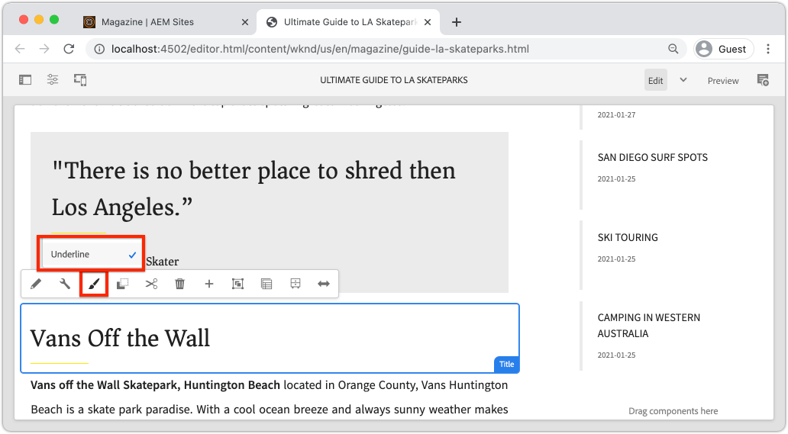

# 스타일 시스템 {#developing-with-the-style-system}으로 개발

Experience Manager의 스타일 시스템을 사용하여 개별 스타일을 구현하고 핵심 구성 요소를 다시 사용하는 방법을 알아봅니다. 이 자습서는 템플릿 편집기의 브랜드 전용 CSS 및 고급 정책 구성으로 핵심 구성 요소를 확장하기 위한 스타일 시스템 개발에 대해 설명합니다.

## 전제 조건 {#prerequisites}

[로컬 개발 환경 설정](overview.md#local-dev-environment)에 대한 필수 도구 및 지침을 검토하십시오.

또한 클라이언트측 라이브러리 및 AEM 프로젝트에 내장된 다양한 프런트 엔드 도구의 기본 사항을 이해하려면 [클라이언트측 라이브러리 및 프런트 엔드 워크플로우](client-side-libraries.md) 자습서를 검토하는 것이 좋습니다.

### 시작 프로젝트

>[!NOTE]
>
> 이전 장을 성공적으로 완료한 경우 프로젝트를 다시 사용하고 시작 프로젝트를 체크 아웃하는 단계를 건너뛸 수 있습니다.

튜토리얼이 빌드하는 기본 라인 코드를 확인합니다.

1. [GitHub](https://github.com/adobe/aem-guides-wknd)에서 `tutorial/style-system-start` 분기를 확인합니다.

   ```shell
   $ cd aem-guides-wknd
   $ git checkout tutorial/style-system-start
   ```

1. Maven 기술을 사용하여 로컬 AEM 인스턴스에 코드 베이스를 배포할 수 있습니다.

   ```shell
   $ mvn clean install -PautoInstallSinglePackage
   ```

   >[!NOTE]
   >
   > AEM 6.5 또는 6.4를 사용하는 경우 `classic` 프로파일을 모든 Maven 명령에 추가합니다.

   ```shell
   $ mvn clean install -PautoInstallSinglePackage -Pclassic
   ```

항상 [GitHub](https://github.com/adobe/aem-guides-wknd/tree/tutorial/style-system-solution)에서 완료된 코드를 보거나 분기 `tutorial/style-system-solution`로 전환하여 로컬로 코드를 체크 아웃할 수 있습니다.

## 목표

1. 스타일 시스템을 사용하여 브랜드별 CSS를 AEM 코어 구성 요소에 적용하는 방법을 이해합니다.
1. BEM 표기법과 스타일을 주의 깊게 범위 지정하는 데 사용할 수 있는 방법에 대해 알아보십시오.
1. 편집 가능한 템플릿에 고급 정책 구성을 적용합니다.

## {#what-you-will-build} 빌드할 항목

이 장에서는 [스타일 시스템 기능](https://docs.adobe.com/content/help/en/experience-manager-learn/sites/page-authoring/style-system-feature-video-use.html)을 사용하여 아티클 페이지에 사용되는 **제목** 및 **텍스트** 구성 요소의 변형을 만듭니다.



*제목 구성 요소에 사용할 수 있는 밑줄 스타일*

## 배경 {#background}

[스타일 시스템](https://docs.adobe.com/content/help/en/experience-manager-65/developing/components/style-system.html)을 사용하면 개발자와 템플릿 편집자는 구성 요소의 시각적 변형을 여러 개 만들 수 있습니다. 그런 다음 작성자는 페이지를 작성할 때 사용할 스타일을 결정할 수 있습니다. 자습서의 나머지 부분에서는 스타일 시스템을 활용하여 몇 가지 고유한 스타일을 얻을 수 있을 뿐만 아니라 낮은 코드 방식에서는 핵심 구성 요소를 활용할 수 있습니다.

스타일 시스템의 일반적인 아이디어는 작성자가 구성 요소의 모양을 다양한 스타일로 선택할 수 있다는 것입니다. &quot;styles&quot;는 구성 요소의 외부 div에 삽입되는 추가 CSS 클래스를 지원합니다. 클라이언트 라이브러리에서 CSS 규칙은 이러한 스타일 클래스를 기반으로 추가되어 구성 요소의 모양이 변경됩니다.

[스타일 시스템에 대한 자세한 설명서는 여기에서 찾을 수 있습니다](https://experienceleague.adobe.com/docs/experience-manager-cloud-service/sites/authoring/features/style-system.html). 스타일 시스템](https://experienceleague.adobe.com/docs/experience-manager-learn/sites/developing/style-system-technical-video-understand.html)을 이해하는 데 유용한 [기술 비디오도 있습니다.

## 밑줄 스타일 - 제목 {#underline-style}

[제목 구성 요소](https://experienceleague.adobe.com/docs/experience-manager-core-components/using/components/title.html)가 **ui.apps** 모듈의 일부로 `/apps/wknd/components/title` 아래의 프로젝트에 프록시되었습니다. 제목 요소(`H1`, `H2`, `H3`..)의 기본 스타일이 이미 **ui.frontend** 모듈에 구현되었습니다.

[WKND 아티클 디자인](assets/pages-templates/wknd-article-design.xd)에는 밑줄이 있는 제목 구성 요소의 고유한 스타일이 포함되어 있습니다. 두 개의 구성 요소를 만들거나 구성 요소 대화 상자를 수정하는 대신 스타일 시스템을 사용하여 작성자가 밑줄 스타일을 추가할 수 있도록 할 수 있습니다.


### Inspect 제목 마크업

프런트 엔드 개발자로서 핵심 구성 요소의 스타일 지정을 위한 첫 번째 단계는 구성 요소에서 생성한 마크업을 이해하는 것입니다.

1. 새 브라우저를 열고 AEM 코어 구성 요소 라이브러리 사이트에서 제목 구성 요소를 봅니다.[https://www.aemcomponents.dev/content/core-components-examples/library/page-authoring/title.html](https://www.aemcomponents.dev/content/core-components-examples/library/page-authoring/title.html)

1. 다음은 제목 구성 요소의 마크업입니다.

   ```html
   <div class="cmp-title">
       <h1 class="cmp-title__text">Lorem Ipsum</h1>
   </div>
   ```

   제목 구성 요소의 BEM 표기법:

   ```plain
   BLOCK cmp-title
       ELEMENT cmp-title__text
   ```

1. 스타일 시스템은 구성 요소를 둘러싼 외부 div에 CSS 클래스를 추가합니다. 따라서 타깃팅할 마크업은 다음과 같이 표시됩니다.

   ```html
   <div class="STYLE-SYSTEM-CLASS-HERE"> <!-- Custom CSS class - implementation gets to define this -->
       <div class="cmp-title">
           <h1 class="cmp-title__text">Lorem Ipsum</h1>
       </div>
   </div>
   ```

### 밑줄 스타일 구현 - ui.front

그런 다음 프로젝트의 **ui.frontend** 모듈을 사용하여 밑줄 스타일을 구현합니다. **ui.frontend** 모듈과 함께 번들로 제공되는 webpack 개발 서버를 사용하여 *스타일을 AEM의 로컬 인스턴스에 배포하기 전에 미리 봅니다.*

1. **ui.frontend** 모듈 내에서 다음 명령을 실행하여 webpack 개발 서버를 시작합니다.

   ```shell
   $ cd ~/code/aem-guides-wknd/ui.frontend/
   $ npm start
   
   > aem-maven-archetype@1.0.0 start code/aem-guides-wknd/ui.frontend
   > webpack-dev-server --open --config ./webpack.dev.js
   ```

   브라우저가 [http://localhost:8080](http://localhost:8080)에 열립니다.

   >[!NOTE]
   >
   > 이미지가 손상된 경우 시작 프로젝트가 AEM의 로컬 인스턴스(포트 4502에서 실행)에 배포되었고 사용된 브라우저도 로컬 AEM 인스턴스에 로그인되어 있는지 확인합니다.

   

1. IDE에서 다음 위치에 있는 `index.html` 파일을 엽니다.`ui.frontend/src/main/webpack/static/index.html`. 웹 팩 개발 서버에서 사용하는 정적 마크업입니다.
1. `index.html`에서 *cmp-title*&#x200B;에 대한 문서를 검색하여 제목 구성 요소의 인스턴스를 찾아 밑줄 스타일을 추가합니다. 텍스트 *&quot;Bannes of the Wall Skatepark&quot;*(218행)이 있는 제목 구성 요소를 선택합니다. `cmp-title--underline` 클래스를 주변 div에 추가합니다.

   ```diff
   - <div class="title aem-GridColumn--phone--12 aem-GridColumn aem-GridColumn--default--8">
   + <div class="cmp-title--underline title aem-GridColumn--phone--12 aem-GridColumn aem-GridColumn--default--8">
        <div data-cmp-data-layer="{&#34;title-8bea562fa0&#34;:{&#34;@type&#34;:&#34;wknd/components/title&#34;,&#34;repo:modifyDate&#34;:&#34;2021-01-22T18:54:20Z&#34;,&#34;dc:title&#34;:&#34;Vans Off the Wall&#34;}}" id="title-8bea562fa0" class="cmp-title">
            <h2 class="cmp-title__text">Vans Off the Wall</h2>
        </div>
    </div>
   ```

1. 브라우저로 돌아가 추가 클래스가 마크업에 반영되었는지 확인합니다.
1. **ui.frontend** 모듈로 돌아가서 다음 위치에 있는 `title.scss` 파일을 업데이트합니다.`ui.frontend/src/main/webpack/components/_title.scss`:

   ```css
   /* Add Title Underline Style */
   .cmp-title--underline {
       .cmp-title__text {
           &:after {
           display: block;
               width: 84px;
               padding-top: 8px;
               content: '';
               border-bottom: 2px solid $brand-primary;
           }
       }
   }
   ```

   >[!NOTE]
   >
   >스타일 범위를 대상 구성 요소로 항상 밀리는 것이 가장 좋습니다. 이렇게 하면 추가 스타일이 페이지의 다른 영역에 영향을 주지 않습니다.
   >
   >모든 핵심 구성 요소는 **[BEM 표기법](https://github.com/adobe/aem-core-wcm-components/wiki/css-coding-conventions)**&#x200B;을 따릅니다. 구성 요소의 기본 스타일을 만들 때 외부 CSS 클래스를 타깃팅하는 것이 가장 좋습니다. 또 다른 우수 사례는 HTML 요소가 아닌 핵심 구성 요소 BEM 표기법에 의해 지정된 클래스 이름을 대상으로 하는 것입니다.

1. 브라우저로 다시 돌아오면 밑줄 스타일이 추가된 것을 확인할 수 있습니다.

   

1. 웹 팩 개발 서버를 중지합니다.

### 제목 정책 추가

다음으로 컨텐츠 작성자가 특정 구성 요소에 적용할 밑줄 스타일을 선택할 수 있도록 제목 구성 요소에 대한 새 정책을 추가해야 합니다. 이 작업은 AEM 내의 템플릿 편집기를 사용하여 수행됩니다.

1. Maven 기술을 사용하여 코드 베이스를 로컬 AEM 인스턴스에 배포합니다.

   ```shell
   $ cd ~/code/aem-guides-wknd
   $ mvn clean install -PautoInstallSinglePackage
   ```

1. 다음 위치에 있는 **아티클 페이지** 템플릿으로 이동합니다.[http://localhost:4502/editor.html/conf/wknd/settings/wcm/templates/article-page/structure.html](http://localhost:4502/editor.html/conf/wknd/settings/wcm/templates/article-page/structure.html)

1. **구조** 모드의 기본 **레이아웃 컨테이너**&#x200B;에서 **허용되는 구성 요소&#x200B;*에 나열된*제목** 구성 요소 옆에 있는 **정책** 아이콘을 선택합니다.

   

1. 다음 값을 사용하여 제목 구성 요소에 대한 새 정책을 만듭니다.

   *정책 제목 **: **WKND 제목**

   *속성* >  *스타일 탭* >  *새 스타일 추가*

   **밑줄** :  `cmp-title--underline`

   

   제목 정책에 대한 변경 내용을 저장하려면 **완료**&#x200B;를 클릭합니다.

   >[!NOTE]
   >
   > `cmp-title--underline` 값은 **ui.frontend** 모듈에서 개발할 때 이전에 타깃팅한 CSS 클래스와 일치합니다.

### 밑줄 스타일 적용

마지막으로 작성자는 특정 제목 구성 요소에 밑줄 스타일을 적용하도록 선택할 수 있습니다.

1. 다음 AEM Sites 편집기에서 **La Skatetparks** 아티클로 이동합니다.[http://localhost:4502/editor.html/content/wknd/us/en/magazine/guide-la-skateparks.html](http://localhost:4502/editor.html/content/wknd/us/en/magazine/guide-la-skateparks.html)
1. **편집** 모드에서 제목 구성 요소를 선택합니다. **페인트브러쉬** 아이콘을 클릭하고 **밑줄** 스타일을 선택합니다.

   

   작성자는 스타일을 켜거나 끌 수 있어야 합니다.

1. AEM 편집기 외부에서 페이지를 검사하려면 **페이지 정보** 아이콘 > **게시됨으로 보기**&#x200B;를 클릭합니다.

   

   브라우저 개발자 도구를 사용하여 제목 구성 요소 주위의 마크업에 외부 div에 CSS 클래스 `cmp-title--underline`가 적용되었는지 확인합니다.

## 인용 블록 스타일 - 텍스트 {#text-component}

그런 다음 유사한 단계를 반복하여 [텍스트 구성 요소](https://experienceleague.adobe.com/docs/experience-manager-core-components/using/components/text.html)에 고유한 스타일을 적용합니다. 텍스트 구성 요소는 **ui.apps** 모듈의 일부로 `/apps/wknd/components/text` 아래의 프로젝트에 프록시되었습니다. 단락 요소의 기본 스타일이 이미 **ui.frontend**&#x200B;에 구현되었습니다.

[WKND 아티클 디자인](assets/pages-templates/wknd-article-design.xd)에는 인용 블록이 있는 텍스트 구성 요소에 대한 고유한 스타일이 포함되어 있습니다.


### Inspect 텍스트 구성 요소 마크업

다시 한 번 텍스트 구성 요소의 마크업을 검사합니다.

1. 다음 위치에서 텍스트 구성 요소에 대한 마크업을 검토합니다.[https://www.aemcomponents.dev/content/core-components-examples/library/page-authoring/text.html](https://www.aemcomponents.dev/content/core-components-examples/library/page-authoring/text.html)

1. 다음은 텍스트 구성 요소의 마크업입니다.

   ```html
   <div class="text">
       <div class="cmp-text" data-cmp-data-layer="{&quot;text-2d9d50c5a7&quot;:{&quot;@type&quot;:&quot;core/wcm/components/text/v2/text&quot;,&quot;repo:modifyDate&quot;:&quot;2019-01-22T11:56:17Z&quot;,&quot;xdm:text&quot;:&quot;<p>Lorem ipsum dolor sit amet, consectetur adipiscing elit, sed do eiusmod tempor incididunt ut labore et dolore magna aliqua. Eu mi bibendum neque egestas congue quisque egestas. Varius morbi enim nunc faucibus a pellentesque. Scelerisque eleifend donec pretium vulputate sapien nec sagittis.</p>\n&quot;}}" id="text-2d9d50c5a7">
           <p>Lorem ipsum dolor sit amet, consectetur adipiscing elit, sed do eiusmod tempor incididunt ut labore et dolore magna aliqua. Eu mi bibendum neque egestas congue quisque egestas. Varius morbi enim nunc faucibus a pellentesque. Scelerisque eleifend donec pretium vulputate sapien nec sagittis.</p>
       </div>
   </div>
   ```

   텍스트 구성 요소의 BEM 표기법:

   ```plain
   BLOCK cmp-text
       ELEMENT
   ```

1. 스타일 시스템은 구성 요소를 둘러싼 외부 div에 CSS 클래스를 추가합니다. 따라서 타깃팅할 마크업은 다음과 같이 표시됩니다.

   ```html
   <div class="text STYLE-SYSTEM-CLASS-HERE"> <!-- Custom CSS class - implementation gets to define this -->
       <div class="cmp-text" data-cmp-data-layer="{&quot;text-2d9d50c5a7&quot;:{&quot;@type&quot;:&quot;core/wcm/components/text/v2/text&quot;,&quot;repo:modifyDate&quot;:&quot;2019-01-22T11:56:17Z&quot;,&quot;xdm:text&quot;:&quot;<p>Lorem ipsum dolor sit amet, consectetur adipiscing elit, sed do eiusmod tempor incididunt ut labore et dolore magna aliqua. Eu mi bibendum neque egestas congue quisque egestas. Varius morbi enim nunc faucibus a pellentesque. Scelerisque eleifend donec pretium vulputate sapien nec sagittis.</p>\n&quot;}}" id="text-2d9d50c5a7">
           <p>Lorem ipsum dolor sit amet, consectetur adipiscing elit, sed do eiusmod tempor incididunt ut labore et dolore magna aliqua. Eu mi bibendum neque egestas congue quisque egestas. Varius morbi enim nunc faucibus a pellentesque. Scelerisque eleifend donec pretium vulputate sapien nec sagittis.</p>
       </div>
   </div>
   ```

### 견적 블록 스타일 구현 - ui.frontend

다음으로 프로젝트의 **ui.frontend** 모듈을 사용하여 견적 블록 스타일을 구현하겠습니다.

1. **ui.frontend** 모듈 내에서 다음 명령을 실행하여 webpack 개발 서버를 시작합니다.

   ```shell
   $ cd ~/code/aem-guides-wknd/ui.frontend/
   $ npm start
   ```

1. IDE에서 다음 위치에 있는 `index.html` 파일을 엽니다.`ui.frontend/src/main/webpack/static/index.html`.
1. `index.html`에서 텍스트 *&quot;Jacob Wester&quot;*(210행)을 검색하여 텍스트 구성 요소의 인스턴스를 찾습니다. `cmp-text--quote` 클래스를 주변 div에 추가합니다.

   ```diff
   - <div class="text aem-GridColumn--phone--12 aem-GridColumn aem-GridColumn--default--8">
   + <div class="cmp-text--quote text aem-GridColumn--phone--12 aem-GridColumn aem-GridColumn--default--8">
        <div data-cmp-data-layer="{&#34;text-a15f39a83a&#34;:{&#34;@type&#34;:&#34;wknd/components/text&#34;,&#34;repo:modifyDate&#34;:&#34;2021-01-22T00:23:27Z&#34;,&#34;xdm:text&#34;:&#34;&lt;blockquote>&amp;quot;There is no better place to shred then Los Angeles.”&lt;/blockquote>\r\n&lt;p>- Jacob Wester, Pro Skater&lt;/p>\r\n&#34;}}" id="text-a15f39a83a" class="cmp-text">
            <blockquote>&quot;There is no better place to shred then Los Angeles.”</blockquote>
            <p>- Jacob Wester, Pro Skater</p>
        </div>
    </div>
   ```

1. 다음 위치에 있는 `text.scss` 파일을 업데이트합니다.`ui.frontend/src/main/webpack/components/_text.scss`:

   ```css
   /* WKND Text Quote style */
   .cmp-text--quote {
       .cmp-text {
           background-color: $brand-third;
           margin: 1em 0em;
           padding: 1em;
   
           blockquote {
               border: none;
               font-size: $font-size-large;
               font-family: $font-family-serif;
               padding: 14px 14px;
               margin: 0;
               margin-bottom: 0.5em;
   
               &:after {
                   border-bottom: 2px solid $brand-primary; /*yellow border */
                   content: '';
                   display: block;
                   position: relative;
                   top: 0.25em;
                   width: 80px;
               }
           }
           p {
               font-family:  $font-family-serif;
           }
       }
   }
   ```

   >[!CAUTION]
   >
   > 이 경우 원시 HTML 요소는 스타일을 기준으로 합니다. 이는 텍스트 구성 요소가 컨텐츠 작성자를 위한 리치 텍스트 편집기를 제공하기 때문입니다. RTE 컨텐츠에 맞게 스타일을 직접 만드는 작업은 신중하게 수행해야 하며 스타일을 보다 세부적으로 적용하는 것이 더 중요합니다.

1. 다시 브라우저로 돌아오면 추가된 견적 블록 스타일이 표시됩니다.

   

1. 웹 팩 개발 서버를 중지합니다.

### 텍스트 정책 추가

다음으로 텍스트 구성 요소에 대한 새 정책을 추가합니다.

1. Maven 기술을 사용하여 로컬 AEM 인스턴스에 코드 베이스를 배포할 수 있습니다.

   ```shell
   $ cd ~/code/aem-guides-wknd
   $ mvn clean install -PautoInstallSinglePackage
   ```

1. 다음 위치에 있는 **아티클 페이지 템플릿**&#x200B;으로 이동합니다.[http://localhost:4502/editor.html/conf/wknd/settings/wcm/templates/article-page/structure.html](http://localhost:4502/editor.html/conf/wknd/settings/wcm/templates/article-page/structure.html)).

1. **구조** 모드의 기본 **레이아웃 컨테이너**&#x200B;에서 **허용되는 구성 요소&#x200B;*에 나열된*텍스트** 구성 요소 옆에 있는 **정책** 아이콘을 선택합니다.

   

1. 다음 값으로 텍스트 구성 요소 정책을 업데이트합니다.

   *정책 제목 **: **컨텐츠 텍스트**

   *플러그인* >  *단락 스타일* >  *단락 스타일 사용*

   *스타일 탭* >  *새 스타일 추가*

   **견적 블록** :  `cmp-text--quote`

   

   

   텍스트 정책에 대한 변경 내용을 저장하려면 **완료**&#x200B;를 클릭합니다.

### 따옴표 블록 스타일 적용

1. 다음 AEM Sites 편집기에서 **La Skatetparks** 아티클로 이동합니다.[http://localhost:4502/editor.html/content/wknd/us/en/magazine/guide-la-skateparks.html](http://localhost:4502/editor.html/content/wknd/us/en/magazine/guide-la-skateparks.html)
1. **편집** 모드에서 텍스트 구성 요소를 선택합니다. 견적 요소를 포함하도록 구성 요소를 편집합니다.

   

1. 텍스트 구성 요소를 선택하고 **페인트브러쉬** 아이콘을 클릭하고 **견적 블록** 스타일을 선택합니다.

   

   작성자는 스타일을 켜거나 끌 수 있어야 합니다.

## 고정 폭 - 컨테이너(보너스) {#layout-container}

컨테이너 구성 요소는 아티클 페이지 템플릿의 기본 구조를 만들고 콘텐츠 작성자가 페이지에 콘텐츠를 추가할 수 있는 드롭 영역을 제공하는 데 사용되었습니다. 또한 컨테이너는 스타일 시스템을 활용할 수 있으므로 컨텐츠 작성자에게 레이아웃을 디자인할 수 있는 더 많은 옵션을 제공합니다.

아티클 페이지 템플릿의 **기본 컨테이너**&#x200B;에는 작성 가능한 컨테이너 2개가 포함되어 있고 너비가 고정되어 있습니다.


*아티클 페이지 템플릿의 기본 컨테이너입니다*.

**기본 컨테이너**&#x200B;의 정책은 기본 요소를 `main`으로 설정합니다.


**기본 컨테이너**&#x200B;를 수정하도록 하는 CSS는 `ui.frontend/src/main/webpack/site/styles/container_main.scss`의 **ui.frontend** 모듈에서 설정됩니다.

```SCSS
main.container {
    padding: .5em 1em;
    max-width: $max-content-width;
    float: unset!important;
    margin: 0 auto!important;
    clear: both!important;
}
```

`main` HTML 요소를 대상으로 하는 대신 스타일 시스템을 사용하여 **고정 폭** 스타일을 컨테이너 정책의 일부로 만들 수 있습니다. 스타일 시스템에서는 사용자에게 **고정 너비**&#x200B;와 **유동 너비** 컨테이너 간 전환 옵션을 제공할 수 있습니다.

1. **추가 과제**  - 이전 연습에서 학습한 교훈을 살펴보고 스타일 시스템을 사용하여 컨테이너 구성 요소에 대해  **** 고정 폭 및  **유동** 위젯 스타일을 구현하십시오.

## 축하합니다!{#congratulations}

축하합니다. 아티클 페이지는 거의 완벽하게 스타일을 지정했으며 AEM 스타일 시스템을 사용하여 직접 제작한 경험을 얻게 되었습니다.

### 다음 단계 {#next-steps}

대화 상자에서 제작된 콘텐츠를 표시하는 [사용자 정의 AEM 구성 요소](custom-component.md)를 만들고 Sling 모델을 개발하여 구성 요소의 HTL을 채우는 비즈니스 논리를 캡슐화하는 단계를 끝까지 알아봅니다.

[GitHub](https://github.com/adobe/aem-guides-wknd)에서 완료된 코드를 보거나 Git brach `tutorial/style-system-solution`에서 코드를 로컬로 검토 및 배포합니다.

1. [github.com/adobe/aem-wknd-guides](https://github.com/adobe/aem-guides-wknd) 저장소를 복제합니다.
1. `tutorial/style-system-solution` 분기를 확인합니다.
