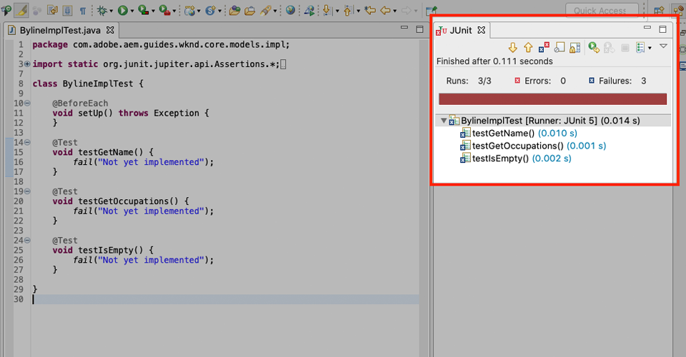
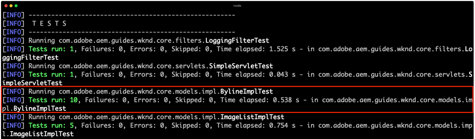
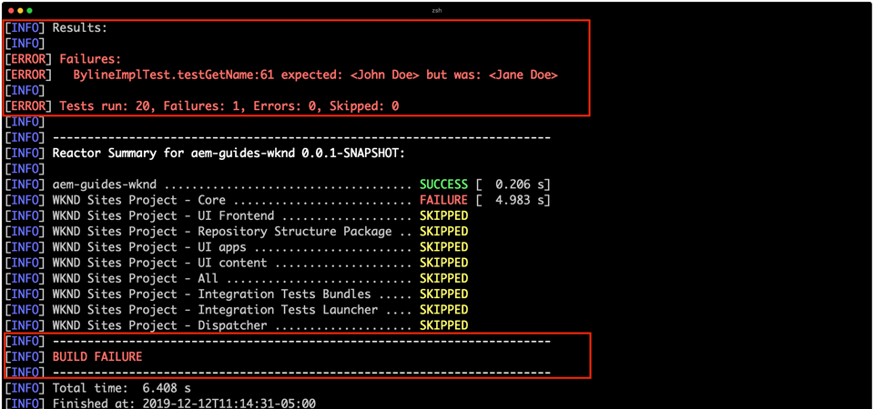

# 단위 테스트 {#unit-testing}

이 자습서에서는 [사용자 지정 구성 요소](./custom-component.md) 자습서에서 만든 Byline 구성 요소의 Sling 모델의 동작을 확인하는 단위 테스트의 구현을 다룹니다.

## 전제 조건 {#prerequisites}

튜토리얼이 빌드하는 기본 라인 코드를 확인합니다.

1. [github.com/adobe/aem-guides-wknd](https://github.com/adobe/aem-guides-wknd) 저장소를 복제합니다.
1. `unit-testing/start` 분기를 확인합니다.

```shell
$ git clone git@github.com:adobe/aem-guides-wknd.git ~/code/aem-guides-wknd
$ cd ~/code/aem-guides-wknd
$ git checkout unit-testing/start
```

항상 [GitHub](https://github.com/adobe/aem-guides-wknd/tree/unit-testing/solution)에서 완료된 코드를 보거나 분기 `unit-testing/solution`로 전환하여 로컬로 코드를 체크 아웃할 수 있습니다.

## 목표

1. 단위 테스트의 기본 사항을 이해합니다.
1. AEM 코드를 테스트하는 데 일반적으로 사용되는 프레임워크 및 도구에 대해 알아보십시오.
1. 장치 테스트를 작성할 때 AEM 리소스를 조롱하거나 시뮬레이션하는 옵션을 이해합니다.

## 배경 {#unit-testing-background}

이 자습서에서는 [사용자 지정 AEM 구성 요소 만들기](custom-component.md)에서 만든 Byline 구성 요소의 [Sling 모델](https://sling.apache.org/documentation/bundles/models.html)에 대한 [단위 테스트](https://en.wikipedia.org/wiki/Unit_testing)를 쓰는 방법을 살펴봅니다. 단위 테스트는 Java 코드의 예상 동작을 확인하는 Java로 작성된 빌드 시간 테스트입니다. 각 단위 테스트는 일반적으로 작고, 예상 결과와 비교하여 메서드(또는 작업 단위)의 출력을 검증합니다.

AEM 모범 사례를 활용하고 다음을 사용할 예정입니다.

* [JUnit 5](https://junit.org/junit5/)
* [Mockito Testing Framework](https://site.mockito.org/)
* [wcm.io Test Framework](https://wcm.io/testing/) (Apache  [Sling Simultans를 기반으로 구축됨](https://sling.apache.org/documentation/development/sling-mock.html))

>[!VIDEO](https://video.tv.adobe.com/v/30207/?quality=12&learn=on)

## 장치 테스트 및 Adobe 클라우드 관리자 {#unit-testing-and-adobe-cloud-manager}

[Adobe Cloud ](https://docs.adobe.com/content/help/ko-KR/experience-manager-cloud-manager/using/introduction-to-cloud-manager.html) Manager는 유닛 테스트 실행 및  [코드 적용 범위를 CI/CD ](https://docs.adobe.com/content/help/en/experience-manager-cloud-manager/using/how-to-use/understand-your-test-results.html#code-quality-testing) 파이프라인에 통합하여 AEM 코드 테스트 모범 사례를 장려하고 홍보합니다.

단위 테스트 코드는 모든 코드 베이스에 적합한 방법이지만 Cloud Manager를 사용하는 경우 Cloud Manager를 실행하기 위한 단위 테스트를 제공함으로써 코드 품질 테스트 및 보고 기능을 활용하는 것이 중요합니다.

## Inspect 테스트 마비안 종속성 {#inspect-the-test-maven-dependencies}

첫 번째 단계는 테스트 작성 및 실행을 지원하기 위해 Maven 종속성을 검사하는 것입니다. 필요한 네 가지 종속성이 있습니다.

1. JUnit5
1. Mockito Test Framework
1. 아파치 슬링
1. AEM Android Test Framework(io.wcm 기준)

**JUnit5**, **Mockito** 및 **AEM Android** 테스트 종속성이 설치 중에 [AEM Maven 원형유형](project-setup.md)을 사용하여 프로젝트에 자동으로 추가됩니다.

1. 이러한 종속성을 보려면 상위 원자로 POM을 **aem-guides-wknd/pom.xml**&#x200B;에서 열고 `<dependencies>..</dependencies>`로 이동하고 다음 종속성이 정의되어 있는지 확인합니다.

   ```xml
   <dependencies>
       ...
       <!-- Testing -->
       <dependency>
           <groupId>org.junit</groupId>
           <artifactId>junit-bom</artifactId>
           <version>5.5.2</version>
           <type>pom</type>
           <scope>import</scope>
       </dependency>
       <dependency>
           <groupId>org.slf4j</groupId>
           <artifactId>slf4j-simple</artifactId>
           <version>1.7.25</version>
           <scope>test</scope>
       </dependency>
       <dependency>
           <groupId>org.mockito</groupId>
           <artifactId>mockito-core</artifactId>
           <version>2.25.1</version>
           <scope>test</scope>
       </dependency>
       <dependency>
           <groupId>org.mockito</groupId>
           <artifactId>mockito-junit-jupiter</artifactId>
           <version>2.25.1</version>
           <scope>test</scope>
       </dependency>
       <dependency>
           <groupId>junit-addons</groupId>
           <artifactId>junit-addons</artifactId>
           <version>1.4</version>
           <scope>test</scope>
       </dependency>
       <dependency>
           <groupId>io.wcm</groupId>
           <artifactId>io.wcm.testing.aem-mock.junit5</artifactId>
           <!-- Prefer the latest version of AEM Mock Junit5 dependency -->
           <version>2.5.2</version>
           <scope>test</scope>
       </dependency>
       ...
   </dependencies>
   ```

1. **aem-guides-wknd/core/pom.xml**&#x200B;을 열고 해당 테스트 종속성을 사용할 수 있음을 확인합니다.

   ```xml
   ...
   <dependency>
       <groupId>org.junit.jupiter</groupId>
       <artifactId>junit-jupiter</artifactId>
       <scope>test</scope>
   </dependency>
   <dependency>
       <groupId>org.mockito</groupId>
       <artifactId>mockito-core</artifactId>
       <scope>test</scope>
   </dependency>
   <dependency>
       <groupId>org.mockito</groupId>
       <artifactId>mockito-junit-jupiter</artifactId>
       <scope>test</scope>
   </dependency>
   <dependency>
       <groupId>junit-addons</groupId>
       <artifactId>junit-addons</artifactId>
   </dependency>
   <dependency>
       <groupId>io.wcm</groupId>
       <artifactId>io.wcm.testing.aem-mock.junit5</artifactId>
   </dependency>
   ...
   ```

   **core** 프로젝트의 병렬 소스 폴더에는 단위 테스트와 지원 테스트 파일이 포함됩니다. 이 **test** 폴더는 테스트 클래스를 소스 코드와 분리하지만 소스 코드와 동일한 패키지에 있는 것처럼 작동할 수 있도록 합니다.

## JUnit 테스트 {#creating-the-junit-test} 만들기

단위 테스트는 일반적으로 Java 클래스에 1부터 1까지 매핑합니다. 이 장에서 Byline 구성 요소를 지원하는 Sling 모델인 **BylineImpl.java**&#x200B;에 대한 JUnit 테스트를 작성합니다.


*단위 테스트가 저장되는 위치입니다.*

1. Eclipse에서는 테스트할 Java 클래스를 마우스 오른쪽 단추로 클릭하고 **새로 만들기 > 기타 > Java > JUnit > JUnit 테스트 케이스**&#x200B;를 선택하면 이 작업을 수행할 수 있습니다.

   

1. 첫 번째 마법사 화면에서 다음을 확인합니다.

   * JUnit 테스트 유형은 **New JUnit Jupiter test**&#x200B;입니다. 이는 Adobe **pom.xml의**&#x200B;에 설정된 JUnit Maven 종속성 목록입니다.
   * **package**&#x200B;은 테스트 중인 클래스의 java 패키지입니다(`BylineImpl.java`).
   * 소스 폴더는 단위 테스트 파일이 저장되는 위치를 Eclipse에 지시하는 **core** 프로젝트(`aem-guides-wknd.core/src/test/java`)를 가리킵니다.
   * `setUp()` 메서드 부본이 수동으로 생성됩니다.나중에 어떻게 사용되는지 보겠습니다.
   * 그리고 테스트 중인 클래스는 테스트하려는 Java 클래스입니다.`BylineImpl.java`

   

   *JUnit 테스트 케이스 마법사 - 2단계*

1. 마법사 아래쪽에 있는 **다음** 단추를 클릭합니다.

   이 다음 단계는 테스트 방법의 자동 생성에 도움이 됩니다. 일반적으로 Java 클래스의 각 공용 메서드에는 해당 테스트 메서드가 하나 이상 있으므로 해당 비헤이비어의 유효성을 확인합니다. 종종 단위 테스트에는 여러 테스트 방법이 각각 다른 입력 또는 상태 세트를 나타내는 단일 공개 방법을 테스트하는 경우가 있습니다.

   마법사에서 `BylineImpl` 아래의 모든 방법을 선택합니다. 단, `init()`은 내부적으로 Sling 모델에서 사용되는 메서드입니다(`@PostConstruct` 통해). 다른 메서드는 `init()`의 실행에 의존하므로 다른 모든 방법을 테스트하여 `init()`을 효과적으로 테스트합니다.

   새로운 테스트 방법을 JUnit 테스트 클래스에 언제든지 추가할 수 있습니다. 마법사의 이 페이지는 단지 편의를 위한 것입니다.

   

   *테스트 케이스 마법사(계속)*

1. 마법사 아래쪽에 있는 [마침] 단추를 클릭하여 JUnit5 테스트 파일을 생성합니다.
1. **aem-guides-wknd.core** > **/src/test/java**&#x200B;의 해당 패키지 구조에서 JUnit5 테스트 파일이 `BylineImplTest.java`라는 파일로 생성되었는지 확인합니다.

## BylineImplTest.java {#reviewing-bylineimpltest-java} 검토

테스트 파일에는 여러 가지 자동 생성 방법이 있습니다. 이때 이 JUnit 테스트 파일에는 AEM만의 것이 없습니다.

첫 번째 방법은 `@BeforeEach`로 주석을 단 `public void setUp() { .. }`입니다.

`@BeforeEach` 주석은 이 클래스의 각 테스트 메서드를 실행하기 전에 JUnit 테스트가 실행되도록 지시한 JUnit 주석입니다.

그 다음 메서드는 테스트 메서드 자체이며 `@Test` 주석과 같이 표시됩니다. 기본적으로 모든 테스트는 실패로 설정됩니다.

이 JUnit 테스트 클래스(JUnit 테스트 케이스라고도 함)가 실행되면 `@Test`으로 표시된 각 메서드가 합격 또는 불합격할 수 있는 테스트로 실행됩니다.


*`core/src/test/java/com/adobe/aem/guides/wknd/core/models/impl/BylineImplTest.java`*

1. 클래스 이름을 마우스 오른쪽 단추로 클릭하여 JUnit 테스트 케이스를 실행하고 **Run As > JUnit Test**.

   

   *BylineImplTests.java > 실행 > JUnit 테스트를 마우스 오른쪽 단추로 클릭*

1. 예상대로 모든 테스트가 실패합니다.

   

   *Eclipse > 창 > 보기 표시 > Java > JUnit에서 보기 시작*

## BylineImpl.java {#reviewing-bylineimpl-java} 검토

단위 테스트를 작성할 때는 다음 두 가지 주요 방법이 있습니다.

* [구현 개발](https://en.wikipedia.org/wiki/Test-driven_development) 직전 단계별로 단위 테스트를 쓰는 TDD 또는 테스트 중심 개발테스트를 작성하고 테스트를 통과하도록 구현을 작성합니다.
* 먼저 작업 코드를 개발한 다음 해당 코드의 유효성을 검사하는 테스트를 작성하는 등 구현 첫 번째 개발입니다.

이 자습서에서는 이전 장에서 작업 중인 **BylineImpl.java**&#x200B;을(를) 이미 만들었으므로 후자 방식이 사용됩니다. 이러한 이유로 우리는 공개 방법의 행동을 검토하고 이해해야 하고, 또한 그것의 구현 세부 사항들도 고려해야 합니다. 이는 반대로 들릴 수 있습니다. 좋은 테스트는 입력 및 출력 문제만 신경써야 하지만 AEM에서 작업할 때는 실행 테스트를 구성하기 위해 알아야 하는 다양한 구현 고려 사항이 있습니다.

AEM의 경우 TDD는 전문적인 지식 수준을 필요로 하며 AEM 개발 및 AEM 코드의 유닛 테스팅에 능숙한 AEM 개발자가 가장 잘 채택하는 제품입니다.

>[!VIDEO](https://video.tv.adobe.com/v/30208/?quality=12&learn=on)

## AEM 테스트 컨텍스트 설정 {#setting-up-aem-test-context}

AEM용으로 작성된 대부분의 코드는 JCR, Sling 또는 AEM API를 사용하며, 따라서 실행 중인 AEM의 컨텍스트가 제대로 실행되어야 합니다.

단위 테스트는 실행 중인 AEM 인스턴스의 컨텍스트 밖에서 빌드 시 실행되므로 이러한 리소스가 없습니다. 이를 촉진하기 위해 [wcm.io의 AEM Android](https://wcm.io/testing/aem-mock/usage.html)는 이러한 API가 AEM에서 실행 중인 것처럼 작동할 수 있도록 하는 모의 컨텍스트를 만듭니다.

1. `@ExtendWith`로 장식 중인 JUnit 확장명으로 **wcm.io의** `AemContext`BylineImplTest.java **를 &lt;a6/>BylineImplTest.java** 파일에 추가하여 AEM 컨텍스트를 만듭니다. **** 익스텐션은 필요한 모든 초기화 및 정리 작업을 처리합니다. 모든 테스트 메서드에 사용할 수 있는 `AemContext`에 대한 클래스 변수를 만듭니다.

   ```java
   import org.junit.jupiter.api.extension.ExtendWith;
   import io.wcm.testing.mock.aem.junit5.AemContext;
   import io.wcm.testing.mock.aem.junit5.AemContextExtension;
   ...
   
   @ExtendWith(AemContextExtension.class)
   class BylineImplTest {
   
       private final AemContext ctx = new AemContext();
   ```

   이 변수 `ctx`는 많은 AEM 및 Sling 추상 변수를 제공하는 모의 AEM 컨텍스트를 노출합니다.

   * BylineImpl Sling 모델이 이 컨텍스트에 등록됩니다.
   * 이 컨텍스트에서 Mock JCR 컨텐츠 구조가 만들어집니다
   * 이 컨텍스트에서 사용자 지정 OSGi 서비스를 등록할 수 있습니다.
   * SlingHttpServletRequest 개체, ModelFactory, PageManager, Page, Template, ComponentManager, TagManager, TagManager 등과 같은 다양한 모의 Sling 및 AEM OSGi 서비스 등과 같은 일반적인 필수 모의 객체와 도우미를 제공합니다.
      * *이러한 개체에 대한 일부 메서드는 구현되지 않습니다.*
   * [훨씬 더 많은](https://wcm.io/testing/aem-mock/usage.html)!

   **`ctx`** 개체는 대부분의 Mock 컨텍스트에서 시작 지점으로 사용됩니다.

1. 각 `@Test` 메서드 이전에 실행되는 `setUp(..)` 메서드에서 일반적인 모의 테스트 상태를 정의합니다.

   ```java
   @BeforeEach
   public void setUp() throws Exception {
       ctx.addModelsForClasses(BylineImpl.class);
       ctx.load().json("/com/adobe/aem/guides/wknd/core/models/impl/BylineImplTest.json", "/content");
   }
   ```

   * **`addModelsForClasses`** 메서드에서 인스턴스화될 수 있도록 Sling 모델을 모의 AEM 컨텍스트에  `@Test` 등록합니다.
   * **`load().json`** 리소스 구조를 모의 컨텍스트에 로드하여 코드가 실제 저장소에서 제공한 것처럼 이러한 리소스와 상호 작용할 수 있습니다. **`BylineImplTest.json`** 파일의 리소스 정의는 **/content** 아래의 모의 JCR 컨텍스트에 로드됩니다.
   * **`BylineImplTest.json`** 아직 존재하지 않으므로, 만들고 테스트에 필요한 JCR 리소스 구조를 정의해 보겠습니다.

1. 모의 리소스 구조를 나타내는 JSON 파일은 JUnit Java 테스트 파일과 동일한 패키지 경로 지정 다음에 **core/src/test/resources** 아래에 저장됩니다.

   다음 콘텐트가 포함된 **core/test/resources/com/adobe/aem/guides/wknd/core/models/impl**&#x200B;이라는 이름의 새 JSON 파일을 만듭니다.****

   ```json
   {
       "byline": {
       "jcr:primaryType": "nt:unstructured",
       "sling:resourceType": "wknd/components/content/byline"
       }
   }
   ```

   

   이 JSON은 Byline 구성 요소 단위 테스트에 대한 모의 리소스 정의를 정의합니다. 이 시점에서 JSON에는 Byline 구성 요소 컨텐츠 리소스, `jcr:primaryType` 및 `sling:resourceType`을 나타내는 데 필요한 최소 속성 세트가 있습니다.

   단위 테스트 작업 시 이러한 규칙의 일반적인 규칙은 각 테스트를 충족하는 데 필요한 최소한의 모의 컨텐츠, 컨텍스트 및 코드를 만드는 것입니다. 테스트 작성 전에 전체 모의 컨텍스트를 작성하려는 유혹을 피하십시오. 이러한 경우 불필요한 가공물이 발생할 수 있습니다.

   이제 **BylineImplTest.json**&#x200B;이(가) 있으므로 `ctx.json("/com/adobe/aem/guides/wknd/core/models/impl/BylineImplTest.json", "/content")`이(가) 실행될 때 모의 리소스 정의가 경로 **/content.**&#x200B;의 컨텍스트에 로드됩니다.

## getName() {#testing-get-name} 테스트

기본 mock 컨텍스트 설정이 있으므로 **BylineImpl의 getName()**&#x200B;에 대한 첫 번째 테스트를 작성하겠습니다. 이 테스트는 **getName()** 메서드가 리소스의 &quot;**name&quot;** 속성에 저장된 올바른 작성 이름을 반환하는지 확인해야 합니다.

1. **BylineImplTest.java**&#x200B;에서 **testGetName**() 메서드를 다음과 같이 업데이트합니다.

   ```java
   import com.adobe.aem.guides.wknd.core.components.Byline;
   import static org.junit.jupiter.api.Assertions.assertEquals;
   ...
   @Test
   public void testGetName() {
       final String expected = "Jane Doe";
   
       ctx.currentResource("/content/byline");
       Byline byline = ctx.request().adaptTo(Byline.class);
   
       String actual = byline.getName();
   
       assertEquals(expected, actual);
   }
   ```

   * **`String expected`** 예상 값을 설정합니다. 이 설정을 &quot;**Jane Done**&quot;으로 설정합니다.
   * **`ctx.currentResource`** 코드를 평가하기 위해 모의 리소스의 컨텍스트를 설정하므로 모의  **/content/** bylineas로 설정되며, 이것이 모의 byline 컨텐츠 리소스가 로드됩니다.
   * **`Byline byline`** 모의 요청 객체에서 변형하여 필자 슬링 모델을 인스턴스화합니다.
   * **`String actual`** byline Sling Model 개체 `getName()`에서 테스트하고 있는 메서드를 호출합니다.
   * **`assertEquals`** 는 예상 값이 byline Sling Model 개체에서 반환되는 값과 일치하는지 확인합니다. 이러한 값이 같지 않으면 테스트가 실패합니다.

1. 테스트를 실행하면 `NullPointerException`으로 실패합니다.

   Adobe가 모의 JSON에 `name` 속성을 정의하지 않았기 때문에 이 테스트가 실패하지 않으며, 이로 인해 테스트가 실패하게 되지만 테스트 실행이 해당 시점에 도달하지 않았기 때문입니다! 이 테스트는 바이트 개체 자체의 `NullPointerException`으로 인해 실패합니다.

1. 위의 [Reviewing BylineImpl.java](#reviewing-bylineimpl-java) 비디오에서 Sling 모델이 인스턴스화할 수 없는 예외를 A2/>에서 발생하는지, 그리고 이것이 일어나고 있는 일입니다.`@PostConstruct init()`

   ```java
   @PostConstruct
   private void init() {
       image = modelFactory.getModelFromWrappedRequest(request, request.getResource(), Image.class);
   }
   ```

   ModelFactory OSGi 서비스가 `AemContext`(Apache Sling Context의 방식)을 통해 제공되지만 BylineImpl의 `init()` 메서드에서 호출되는 `getModelFromWrappedRequest(...)`을 포함하여 모든 메서드가 구현되지 않는 것으로 나타났습니다. 이로 인해 [AbstractMethodError](https://docs.oracle.com/javase/8/docs/api/java/lang/AbstractMethodError.html)이(가) 발생하여 `init()`이(가) 실패하고 `ctx.request().adaptTo(Byline.class)`의 결과가 null 개체입니다.

   제공된 조롱이 우리 코드를 수용할 수 없기 때문에 Mockito를 사용하여 모의 ModelFactory 개체를 만들고, 이 개체 위에 `getModelFromWrappedRequest(...)`이(가) 호출될 때 모의 이미지 개체를 반환하는 mockImage 개체를 만들 수 있습니다.

   Byline Sling Model을 인스턴스화하려면 이 Mock 컨텍스트가 적절한 상태여야 하므로 이 Mock 컨텍스트를 `@Before setUp()` 메서드에 추가할 수 있습니다. 또한 `MockitoExtension.class`BylineImplTest **클래스 위의 `@ExtendWith` 주석에 &lt;a0/>을 추가해야 합니다.**

   ```java
   package com.adobe.aem.guides.wknd.core.models.impl;
   
   import org.mockito.junit.jupiter.MockitoExtension;
   import org.mockito.Mock;
   
   import com.adobe.aem.guides.wknd.core.models.Byline;
   import com.adobe.cq.wcm.core.components.models.Image;
   
   import io.wcm.testing.mock.aem.junit5.AemContext;
   import io.wcm.testing.mock.aem.junit5.AemContextExtension;
   
   import org.apache.sling.models.factory.ModelFactory;
   import org.junit.jupiter.api.BeforeEach;
   import org.junit.jupiter.api.Test;
   import org.junit.jupiter.api.extension.ExtendWith;
   
   import static org.junit.jupiter.api.Assertions.assertEquals;
   import static org.junit.jupiter.api.Assertions.fail;
   import static org.mockito.Mockito.*;
   import org.apache.sling.api.resource.Resource;
   
   @ExtendWith({ AemContextExtension.class, MockitoExtension.class })
   public class BylineImplTest {
   
       private final AemContext ctx = new AemContext();
   
       @Mock
       private Image image;
   
       @Mock
       private ModelFactory modelFactory;
   
       @BeforeEach
       public void setUp() throws Exception {
           ctx.addModelsForClasses(BylineImpl.class);
   
           ctx.load().json("/com/adobe/aem/guides/wknd/core/models/impl/BylineImplTest.json", "/content");
   
           lenient().when(modelFactory.getModelFromWrappedRequest(eq(ctx.request()), any(Resource.class), eq(Image.class)))
                   .thenReturn(image);
   
           ctx.registerService(ModelFactory.class, modelFactory, org.osgi.framework.Constants.SERVICE_RANKING,
                   Integer.MAX_VALUE);
       }
   
       @Test
       void testGetName() { ...
   }
   ```

   * **`@ExtendWith({AemContextExtension.class, MockitoExtension.class})`** @Mock 주석을 사용하여 클래스 수준에서  [모의 개체를 정의하는 데 사용할 수 ](https://www.javadoc.io/page/org.mockito/mockito-junit-jupiter/latest/org/mockito/junit/jupiter/MockitoExtension.html) 있는 Mockito JUnit Jupiter Extensionsionable에서 실행할 테스트 케이스 클래스를 표시합니다.
   * **`@Mock private Image`** 유형의 모의 개체를 만듭니다 `com.adobe.cq.wcm.core.components.models.Image`. 이것은 클래스 수준에서 정의되므로 필요한 경우 `@Test` 메서드에서 해당 동작을 변경할 수 있습니다.
   * **`@Mock private ModelFactory`** ModelFactory 유형의 모의 개체를 만듭니다. 이것은 순수한 모키토 모의이며, 구현된 방법이 없다는 것을 참고하십시오. 이것은 클래스 수준에서 정의되므로 필요한 경우 `@Test`메서드에서 해당 동작을 변경할 수 있습니다.
   * **`when(modelFactory.getModelFromWrappedRequest(..)`** 모의 ModelFactory 개체 `getModelFromWrappedRequest(..)` 에서 호출될 때 사용할 모의 동작을 등록합니다. `thenReturn (..)`에 정의된 결과는 모의 이미지 개체를 반환하는 것입니다. 이 동작은 다음 경우에만 호출됩니다.첫 번째 매개 변수는 `ctx` 요청 개체와 동일하며 두 번째 매개 변수는 모든 리소스 개체이고 3번째 매개 변수는 핵심 구성 요소 이미지 클래스여야 합니다. Adobe는 테스트 동안 `ctx.currentResource(...)`을(를) **BylineImplTest.json**&#x200B;에 정의된 다양한 모의 리소스로 설정하게 되기 때문에 모든 리소스를 허용합니다. 나중에 ModelFactory의 이 동작을 무시하려고 하기 때문에 **compensed()** 엄격함을 추가합니다.
   * **`ctx.registerService(..)`.** Mock ModelFactory 개체를 AemContext에 등록하고 서비스 순위가 가장 높습니다. BylineImpl의 `init()`에 사용된 ModelFactory가 `@OSGiService ModelFactory model` 필드를 통해 삽입되기 때문에 필요합니다. AemContext가 `getModelFromWrappedRequest(..)`에 대한 호출을 처리하는 **우리** 모의 개체를 주입하려면 해당 유형의 최고 등급 서비스로 등록해야 합니다(ModelFactory).

1. 테스트를 다시 실행하면 실패하지만 이번에는 실패한 이유를 알 수 있습니다.

   

   *어설션으로 인해 testGetName() 실패*

   테스트에 실패한 어설션 조건을 의미하는 **AssertionError**&#x200B;이(가) 수신되고, **예상 값은 &quot;Jane Doe&quot;**&#x200B;이지만 **실제 값은 null**&#x200B;입니다. 이것은 &quot;**name&quot;** 속성이 **BylineImplTest.json**&#x200B;의 모의 **/content/byline** 리소스 정의에 추가되지 않았기 때문에 일리가 있습니다. 따라서 추가해 봅시다.

1. `"name": "Jane Doe".`을(를) 정의하려면 **BylineImplTest.json**&#x200B;을 업데이트합니다.

   ```json
   {
       "byline": {
       "jcr:primaryType": "nt:unstructured",
       "sling:resourceType": "wknd/components/content/byline",
       "name": "Jane Doe"
       }
   }
   ```

1. 테스트를 다시 실행하면 **`testGetName()`**&#x200B;이(가) 통과됩니다!

## getProtty() {#testing-get-occupations} 테스트

좋아! 우리의 첫 번째 시험이 통과되었습니다! 계속 진행해서 `getOccupations()`을 테스트해 봅시다. 모의 컨텍스트의 초기화가 `@Before setUp()`메서드에서 수행되었으므로 이 테스트 케이스의 모든 `@Test` 메서드에서 `getOccupations()`를 사용할 수 있습니다.

이 방법은 직업 속성에 저장된 알파벳순으로 정렬된 직업 목록(내림차순)을 반환해야 합니다.

1. **`testGetOccupations()`**&#x200B;을 다음과 같이 업데이트합니다.

   ```java
   import java.util.List;
   import com.google.common.collect.ImmutableList;
   ...
   @Test
   public void testGetOccupations() {
       List<String> expected = new ImmutableList.Builder<String>()
                               .add("Blogger")
                               .add("Photographer")
                               .add("YouTuber")
                               .build();
   
       ctx.currentResource("/content/byline");
       Byline byline = ctx.request().adaptTo(Byline.class);
   
       List<String> actual = byline.getOccupations();
   
       assertEquals(expected, actual);
   }
   ```

   * **`List<String> expected`** 예상 결과를 정의합니다.
   * **`ctx.currentResource`** 컨텍스트를 평가하는 현재 리소스를 /content/byline의 mock 리소스 정의에 설정합니다. 이렇게 하면 **BylineImpl.java**&#x200B;가 모의 리소스 컨텍스트에서 실행됩니다.
   * **`ctx.request().adaptTo(Byline.class)`** 모의 요청 객체에서 변형하여 필자 슬링 모델을 인스턴스화합니다.
   * **`byline.getOccupations()`** byline Sling Model 개체 `getOccupations()`에서 테스트하고 있는 메서드를 호출합니다.
   * **`assertEquals(expected, actual)`** 어설션 예상 목록은 실제 목록과 동일합니다.

1. 위의 **`getName()`**&#x200B;과 마찬가지로 **BylineImplTest.json**&#x200B;도 직업을 정의하지 않으므로, 이 테스트를 실행하는 경우 오류가 발생합니다. `byline.getOccupations()`은 빈 목록을 반환하기 때문입니다.

   직업 목록을 포함하도록 **BylineImplTest.json**&#x200B;을 업데이트하면, 테스트 결과가 **`getOccupations()`**&#x200B;별로 정렬되어 있는지 확인할 수 있도록 알파벳 순서가 아닌 순서로 설정됩니다.

   ```json
   {
       "byline": {
       "jcr:primaryType": "nt:unstructured",
       "sling:resourceType": "wknd/components/content/byline",
       "name": "Jane Doe",
       "occupations": ["Photographer", "Blogger", "YouTuber"]
       }
   }
   ```

1. 테스트를 실행하면 통과됩니다! 정렬된 직업이 작동하는 것 같아!

   

   *testGetProtty() 패스*

## 테스트는 IsEmpty() {#testing-is-empty}

**`isEmpty()`**&#x200B;을(를) 테스트하는 마지막 방법입니다.

`isEmpty()`을(를) 테스트하는 것은 다양한 조건을 테스트하는 것이 필요하므로 흥미롭습니다. **BylineImpl.java**&#39;s `isEmpty()` 메서드를 검토하여 다음 조건을 테스트해야 합니다.

* 이름이 비어 있으면 true를 반환합니다.
* 직업이 null이거나 비어 있으면 true를 반환합니다.
* 이미지가 null이거나 src URL이 없으면 true를 반환합니다.
* 이름, 직업 및 이미지(src URL 포함)가 있으면 false를 반환합니다.

이를 위해 새로운 테스트 방법을 만들어야 하며, 각 테스트에는 특정 조건과 `BylineImplTest.json`의 새로운 모의 리소스 구조가 필요합니다.

이 확인에서는 `getName()`, `getOccupations()` 및 `getImage()`이(가) 비어 있는 경우 테스트를 건너뛸 수 있었습니다. 왜냐하면 해당 상태의 예상 동작이 `isEmpty()`를 통해 테스트되기 때문입니다.

1. 첫 번째 테스트는 속성이 설정되지 않은 새 구성 요소의 조건을 테스트합니다.

   새 리소스 정의를 `BylineImplTest.json`에 추가하고 의미 이름 &quot;**empty**&quot;을 지정합니다.

   ```json
   {
       "byline": {
       "jcr:primaryType": "nt:unstructured",
       "sling:resourceType": "wknd/components/content/byline",
       "name": "Jane Doe",
       "occupations": ["Photographer", "Blogger", "YouTuber"]
       },
       "empty": {
       "jcr:primaryType": "nt:unstructured",
       "sling:resourceType": "wknd/components/content/byline"
       }
   }
   ```

   **`"empty": {...}`** and만 있는 &quot;empty&quot;라는 새 리소스 정의 `jcr:primaryType` 를  `sling:resourceType`정의합니다.

   `@setUp`의 각 테스트 메서드를 실행하기 전에 `BylineImplTest.json`을(를) `ctx`에 로드해야 하므로 이 새 리소스 정의는 **/content/empty의 테스트에서 즉시 사용할 수 있습니다.**

1. `testIsEmpty()`을(를) 다음과 같이 업데이트하여 현재 리소스를 새 &quot;**비어 있는**&quot; 리소스 시뮬레이션 정의로 설정합니다.

   ```java
   @Test
   public void testIsEmpty() {
       ctx.currentResource("/content/empty");
       Byline byline = ctx.request().adaptTo(Byline.class);
   
       assertTrue(byline.isEmpty());
   }
   ```

   테스트를 실행하고 통과하는지 확인합니다.

1. 그런 다음 필요한 데이터 포인트(이름, 직업 또는 이미지) 중 하나라도 비어 있으면 `isEmpty()`은 true를 반환합니다.

   각 테스트의 경우 개별 mock 리소스 정의가 사용되면 **without-name** 및 **without-firty**&#x200B;에 대한 추가 리소스 정의가 있는 **BylineImplTest.json**&#x200B;을 업데이트합니다.

   ```json
   {
       "byline": {
       "jcr:primaryType": "nt:unstructured",
       "sling:resourceType": "wknd/components/content/byline",
       "name": "Jane Doe",
       "occupations": ["Photographer", "Blogger", "YouTuber"]
       },
       "empty": {
       "jcr:primaryType": "nt:unstructured",
       "sling:resourceType": "wknd/components/content/byline"
       },
       "without-name": {
       "jcr:primaryType": "nt:unstructured",
       "sling:resourceType": "wknd/components/content/byline",
       "occupations": "[Photographer, Blogger, YouTuber]"
       },
       "without-occupations": {
       "jcr:primaryType": "nt:unstructured",
       "sling:resourceType": "wknd/components/content/byline",
       "name": "Jane Doe"
       }
   }
   ```

   다음 테스트 메서드를 만들어 이러한 각 상태를 테스트합니다.

   ```java
   @Test
   public void testIsEmpty() {
       ctx.currentResource("/content/empty");
   
       Byline byline = ctx.request().adaptTo(Byline.class);
   
       assertTrue(byline.isEmpty());
   }
   
   @Test
   public void testIsEmpty_WithoutName() {
       ctx.currentResource("/content/without-name");
   
       Byline byline = ctx.request().adaptTo(Byline.class);
   
       assertTrue(byline.isEmpty());
   }
   
   @Test
   public void testIsEmpty_WithoutOccupations() {
       ctx.currentResource("/content/without-occupations");
   
       Byline byline = ctx.request().adaptTo(Byline.class);
   
       assertTrue(byline.isEmpty());
   }
   
   @Test
   public void testIsEmpty_WithoutImage() {
       ctx.currentResource("/content/byline");
   
       lenient().when(modelFactory.getModelFromWrappedRequest(eq(ctx.request()),
           any(Resource.class),
           eq(Image.class))).thenReturn(null);
   
       Byline byline = ctx.request().adaptTo(Byline.class);
   
       assertTrue(byline.isEmpty());
   }
   
   @Test
   public void testIsEmpty_WithoutImageSrc() {
       ctx.currentResource("/content/byline");
   
       when(image.getSrc()).thenReturn("");
   
       Byline byline = ctx.request().adaptTo(Byline.class);
   
       assertTrue(byline.isEmpty());
   }
   ```

   **`testIsEmpty()`** 빈 모의 리소스 정의에 대해 테스트하고  `isEmpty()` 사실임을 주장합니다.

   **`testIsEmpty_WithoutName()`** 직업이 있지만 이름이 없는 모의 리소스 정의에 대해 테스트합니다.

   **`testIsEmpty_WithoutOccupations()`** 이름이 있지만 직업이 없는 모의 리소스 정의에 대해 테스트합니다.

   **`testIsEmpty_WithoutImage()`** 이름과 직업이 있는 모의 리소스 정의에 대해 테스트하지만 모의 이미지가 null로 반환되도록 설정합니다. 이 호출에서 반환된 이미지 개체가 null인지 확인하기 위해 `setUp()`에 정의된 `modelFactory.getModelFromWrappedRequest(..)`동작을 무시하려고 합니다. 모키토 작품에 관한 토막글은 엄격하고 복제 코드를 원하지 않는다. 따라서 **`lenient`** 설정으로 모의 값을 설정하여 `setUp()` 메서드에서 동작을 재정의하고 있습니다.

   **`testIsEmpty_WithoutImageSrc()`** 이름 및 직업 형식으로 모의 리소스 정의에 대해 테스트하지만 호출될 때 빈 문자열을 반환하도록 모의 이미지 `getSrc()` 를 설정합니다.

1. 마지막으로, 구성 요소가 올바르게 구성된 경우 **isEmpty()**&#x200B;가 false를 반환하도록 테스트를 작성하십시오. 이 조건에 대해 완전히 구성된 라인 구성 요소를 나타내는 **/content/byline**&#x200B;을 다시 사용할 수 있습니다.

   ```java
   @Test
   public void testIsNotEmpty() {
   ctx.currentResource("/content/byline");
   when(image.getSrc()).thenReturn("/content/bio.png");
   
   Byline byline = ctx.request().adaptTo(Byline.class);
   
   assertFalse(byline.isEmpty());
   }
   ```

## 코드 검사 {#code-coverage}

코드 검사 범위는 단위 테스트에서 다루는 소스 코드의 양입니다. 최신 IDE는 단위 테스트 과정에서 실행되는 소스 코드를 자동으로 확인하는 툴을 제공합니다. 코드 검사 자체는 코드 품질에 대한 지표가 아니지만 단위 테스트에서 테스트되지 않은 중요한 소스 코드 영역이 있는지 확인하는 데 유용합니다.

1. Eclipse의 프로젝트 탐색기에서 **BylineImplTest.java**&#x200B;를 마우스 오른쪽 단추로 클릭하고 **Coverage As > JUnit 테스트**&#x200B;를 선택합니다.

   범위 요약 보기가 열려 있는지 확인합니다(창 > 보기 표시 > 기타 > Java > 적용 범위).

   이 파일에서 단위 테스트를 실행하고 코드 범위를 나타내는 보고서를 제공합니다. 클래스와 메서드로 드릴다운하면 파일 중 어떤 부분이 테스트되고 그렇지 않은 부분이 명확하게 표시됩니다.

   

   *코드 검사 요약*

   Eclipse는 단위 테스트를 통해 각 클래스와 메서드의 양을 빠르게 확인할 수 있습니다. Eclipse는 코드 줄을 색상으로 변환합니다.

   * **하나** 이상의 테스트에 의해 실행되는 녹색 코드
   * **[** 노랑]은 어떤 테스트로도 평가되지 않는 분기를 나타냅니다
   * **테스트** 에서 실행되지 않는 코드를 재정의합니다.

1. 검사 보고서에서, 직업 필드가 null이고 빈 목록을 반환할 때 실행되는 지점이 식별되어 평가되지 않습니다. 노란색으로 표시된 571 및 86줄에 의해 표시되고, if/else가 실행되지 않은 경우 분기가 표시되고, 코드 줄이 절대 실행되지 않음을 나타내는 빨간색 75줄이 표시됩니다.

   

1. 리소스에 직업 값이 없을 때 빈 목록이 반환된다고 주장하는 `getOccupations()`에 대한 테스트를 추가하여 이 문제를 해결할 수 있습니다. 다음 새 테스트 메서드를 **BylineImplTests.java**&#x200B;에 추가합니다.

   ```java
   @Test
   public void testGetOccupations_WithoutOccupations() {
       List<String> expected = Collections.emptyList();
   
       ctx.currentResource("/content/empty");
       Byline byline = ctx.request().adaptTo(Byline.class);
   
       List<String> actual = byline.getOccupations();
   
       assertEquals(expected, actual);
   }
   ```

   **`Collections.emptyList();`** 예상 값을 빈 목록으로 설정합니다.

   **`ctx.currentResource("/content/empty")`** 현재 리소스를 /content/empty로 설정합니다. 여기에는 정의된 직업 속성이 없습니다.

1. 보상 범위를 다시 실행하면, **BylineImpl.java**&#x200B;가 현재 100% 적용 범위에 있지만 여전히 isEmpty()에서 평가되지 않은 분기가 한 개 있으며, 이 분기는 서비스와 다시 관련이 있습니다. 이 경우, 직업 == null이 평가되고 있지만 fitals.isEmpty()는 `"occupations": []`을 설정하는 모의 리소스 정의가 없기 때문에 평가되지 않습니다.

   

   *testGetFidelies_WithoutFirty()를 사용한 검사*

1. 직업 범위를 빈 배열로 설정하는 모의 리소스 정의를 사용하는 또 다른 시험방법을 만들어 문제를 쉽게 해결할 수 있다.

   새 mock 리소스 정의를 **BylineImplTest.json**&#x200B;에 추가하고, **&quot;without-fideles&quot;**&#x200B;의 사본인 직업 속성을 빈 배열에 추가하고, **&quot;withotty-empty-array&quot;**&#x200B;로 이름을 지정합니다.

   ```json
   "without-occupations-empty-array": {
      "jcr:primaryType": "nt:unstructured",
      "sling:resourceType": "wknd/components/content/byline",
      "name": "Jane Doe",
      "occupations": []
    }
   ```

   이 새 모의 리소스를 사용하는 `BylineImplTest.java`에 새 **@Test** 메서드를 만들고 `isEmpty()`이(가) true를 반환합니다.

   ```java
   @Test
   public void testIsEmpty_WithEmptyArrayOfOccupations() {
       ctx.currentResource("/content/without-occupations-empty-array");
   
       Byline byline = ctx.request().adaptTo(Byline.class);
   
       assertTrue(byline.isEmpty());
   }
   ```

   

   *testIsEmpty_WithEmptyArrayOfFirty()를 사용한 검사*

1. 이 마지막 추가 기능을 사용할 경우, `BylineImpl.java`은 100% 코드 범위를 즐기지만 모든 조건부 경로 지정을 받습니다.

   테스트는 최소한의 구현 세부 정보에 의존하지 않고 `BylineImpl`의 예상 동작을 확인합니다.

## 빌드 {#running-unit-tests-as-part-of-the-build}의 일부로 단위 테스트 실행

테스트 빌드의 일부로 통과하려면 단위 테스트가 실행됩니다. 따라서 응용 프로그램을 배포하기 전에 모든 테스트가 성공적으로 통과됩니다. 패키지 또는 설치와 같은 테스트 목표를 실행하면 자동으로 호출되며 프로젝트의 모든 단위 테스트를 통과해야 합니다.

```shell
$ mvn package
```



```shell
$ mvn package
```

마찬가지로 테스트 방법을 실패로 변경하는 경우 빌드가 실패하고 테스트 실패 및 이유를 보고합니다.



## 코드 {#review-the-code} 검토

[GitHub](https://github.com/adobe/aem-guides-wknd)에서 완료된 코드를 보거나 Git brach `unit-testing/solution`에서 로컬로 코드를 검토하고 배포합니다.
