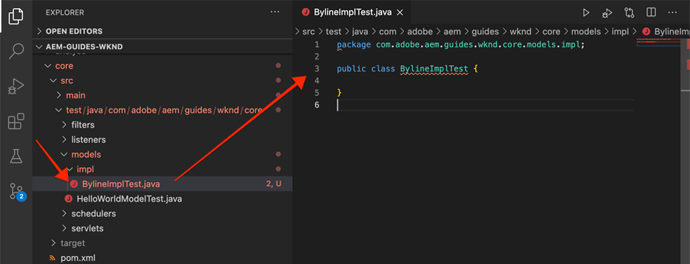

# 단위 테스트 {#unit-testing}

이 자습서는 [사용자 지정 구성 요소](./custom-component.md) 자습서에서 만든 필라인 구성 요소의 슬링 모델의 동작을 확인하는 단위 테스트 구현에 대해 설명합니다.

## 전제 조건 {#prerequisites}

[로컬 개발 환경 설정](overview.md#local-dev-environment)에 대한 필수 도구 및 지침을 검토하십시오.

_시스템에 Java 8과 Java 11이 모두 설치되어 있는 경우 VS 코드 테스트 참가자가 테스트를 실행할 때 낮은 Java 런타임을 선택하여 테스트 오류를 초래할 수 있습니다. 이러한 경우 Java 8._ 제거

### 시작 프로젝트

>[!NOTE]
>
> 이전 장을 성공적으로 완료한 경우 프로젝트를 다시 사용하고 시작 프로젝트를 체크 아웃하는 단계를 건너뛸 수 있습니다.

튜토리얼이 빌드하는 기본 라인 코드를 확인합니다.

1. [GitHub](https://github.com/adobe/aem-guides-wknd)에서 `tutorial/unit-testing-start` 분기를 확인합니다.

   ```shell
   $ cd aem-guides-wknd
   $ git checkout tutorial/unit-testing-start
   ```

1. Maven 기술을 사용하여 로컬 AEM 인스턴스에 코드 베이스를 배포할 수 있습니다.

   ```shell
   $ mvn clean install -PautoInstallSinglePackage
   ```

   >[!NOTE]
   >
   > AEM 6.5 또는 6.4를 사용하는 경우 `classic` 프로파일을 모든 Maven 명령에 추가합니다.

   ```shell
   $ mvn clean install -PautoInstallSinglePackage -Pclassic
   ```

항상 [GitHub](https://github.com/adobe/aem-guides-wknd/tree/tutorial/unit-testing-start)에서 완료된 코드를 보거나 분기 `tutorial/unit-testing-start`로 전환하여 로컬로 코드를 체크 아웃할 수 있습니다.

## 목표

1. 단위 테스트의 기본 사항을 이해합니다.
1. AEM 코드를 테스트하는 데 일반적으로 사용되는 프레임워크 및 도구에 대해 알아보십시오.
1. 단위 테스트를 작성할 때 AEM 리소스를 조롱하거나 시뮬레이션할 수 있는 옵션을 이해합니다.

## 배경 {#unit-testing-background}

이 자습서에서는 [사용자 정의 AEM 구성 요소 만들기](custom-component.md)에서 만든 필라인 구성 요소의 [셀 모델](https://sling.apache.org/documentation/bundles/models.html)에 대해 [단위 테스트](https://en.wikipedia.org/wiki/Unit_testing)를 쓰는 방법을 살펴봅니다. 단위 테스트는 Java 코드의 예상 동작을 확인하는 Java로 작성된 빌드 시간 테스트입니다. 각 단위 테스트는 일반적으로 작고 예상 결과와 비교하여 메서드(또는 작업 단위)의 출력을 검증합니다.

AEM 모범 사례를 사용하고 다음과 같은 이점을 사용할 것입니다.

* [주니트 5](https://junit.org/junit5/)
* [Mockito Testing Framework](https://site.mockito.org/)
* [wcm.io 테스트 프레임워크](https://wcm.io/testing/) ( [Apache Sling Android를 기반으로 구축됨](https://sling.apache.org/documentation/development/sling-mock.html))

## 유닛 테스트 및 Adobe 클라우드 관리자 {#unit-testing-and-adobe-cloud-manager}

[Adobe Cloud ](https://docs.adobe.com/content/help/ko-KR/experience-manager-cloud-manager/using/introduction-to-cloud-manager.html) Manager는 유닛 테스트 실행 및  [코드 적용 범위를 CI/CD 파이프라인에 통합하여 AEM 코드 테스트 모범 사례를 장려하고 홍보할 수 ](https://docs.adobe.com/content/help/en/experience-manager-cloud-manager/using/how-to-use/understand-your-test-results.html#code-quality-testing) 있습니다.

단위 테스트 코드는 모든 코드 베이스에 적합한 방법이지만, Cloud Manager를 사용하는 경우 Cloud Manager를 실행하기 위한 단위 테스트를 제공함으로써 코드 품질 테스트 및 보고 기능을 활용하는 것이 중요합니다.

## Inspect 테스트 마벤 종속성 {#inspect-the-test-maven-dependencies}

첫 번째 단계는 테스트 작성 및 실행을 지원하기 위해 Maven 종속성을 검사하는 것입니다. 4가지 종속성이 필요합니다.

1. JUnit5
1. Mockito Test Framework
1. Apache Sling Android
1. AEM Android Test Framework(io.wcm 제공)

**JUnit5**, **Mockito** 및 **AEM Android** 테스트 종속성이 [AEM Maven 원형](project-setup.md)을 사용하여 설정하는 동안 프로젝트에 자동으로 추가됩니다.

1. 이러한 종속성을 보려면 상위 원자로 POM을 **aem-guides-wknd/pom.xml**&#x200B;에서 열고 `<dependencies>..</dependencies>`로 이동하여 다음 종속성을 정의하는지 확인하십시오.

   ```xml
   <dependencies>
       ...       
       <!-- Testing -->
       <dependency>
           <groupId>org.junit</groupId>
           <artifactId>junit-bom</artifactId>
           <version>5.6.2</version>
           <type>pom</type>
           <scope>import</scope>
       </dependency>
       <dependency>
           <groupId>org.mockito</groupId>
           <artifactId>mockito-core</artifactId>
           <version>3.3.3</version>
           <scope>test</scope>
       </dependency>
       <dependency>
           <groupId>org.mockito</groupId>
           <artifactId>mockito-junit-jupiter</artifactId>
           <version>3.3.3</version>
           <scope>test</scope>
       </dependency>
       <dependency>
           <groupId>junit-addons</groupId>
           <artifactId>junit-addons</artifactId>
           <version>1.4</version>
           <scope>test</scope>
       </dependency>
       <dependency>
           <groupId>io.wcm</groupId>
           <artifactId>io.wcm.testing.aem-mock.junit5</artifactId>
           <!-- Prefer the latest version of AEM Mock Junit5 dependency -->
           <version>3.0.2</version>
           <scope>test</scope>
       </dependency>        
       ...
   </dependencies>
   ```

1. **aem-guides-wknd/core/pom.xml**&#x200B;을(를) 열고 해당 테스트 종속성을 사용할 수 있는지 확인합니다.

   ```xml
   ...
   <!-- Testing -->
   <dependency>
       <groupId>org.junit.jupiter</groupId>
       <artifactId>junit-jupiter</artifactId>
       <scope>test</scope>
   </dependency>
   <dependency>
       <groupId>org.mockito</groupId>
       <artifactId>mockito-core</artifactId>
       <scope>test</scope>
   </dependency>
   <dependency>
       <groupId>org.mockito</groupId>
       <artifactId>mockito-junit-jupiter</artifactId>
       <scope>test</scope>
   </dependency>
   <dependency>
       <groupId>junit-addons</groupId>
       <artifactId>junit-addons</artifactId>
       <scope>test</scope>
   </dependency>
   <dependency>
       <groupId>io.wcm</groupId>
       <artifactId>io.wcm.testing.aem-mock.junit5</artifactId>
       <exclusions>
           <exclusion>
               <groupId>org.apache.sling</groupId>
               <artifactId>org.apache.sling.models.impl</artifactId>
           </exclusion>
           <exclusion>
               <groupId>org.slf4j</groupId>
               <artifactId>slf4j-simple</artifactId>
           </exclusion>
       </exclusions>
       <scope>test</scope>
   </dependency>
   <!-- Required to be able to support injection with @Self and @Via -->
   <dependency>
       <groupId>org.apache.sling</groupId>
       <artifactId>org.apache.sling.models.impl</artifactId>
       <version>1.4.4</version>
       <scope>test</scope>
   </dependency>
   ...
   ```

   **core** 프로젝트의 병렬 소스 폴더에는 단위 테스트와 지원 테스트 파일이 포함됩니다. 이 **test** 폴더는 테스트 클래스를 소스 코드와 분리하지만 테스트가 소스 코드와 동일한 패키지에 있는 것처럼 작동할 수 있도록 합니다.

## JUnit 테스트 {#creating-the-junit-test} 만들기

단위 테스트는 일반적으로 Java 클래스에 1-1로 매핑됩니다. 이 장에서 Byline 구성 요소를 지원하는 Sling 모델인 **BylineImpl.java**&#x200B;에 대한 JUnit 테스트를 작성합니다.


*단위 테스트가 저장되는 위치입니다.*

1. 테스트할 Java 클래스의 위치를 미러링하는 Java 패키지 폴더 구조에서 `src/test/java` 아래에 새 Java 클래스를 만들어 `BylineImpl.java`에 대한 단위 테스트를 만듭니다.

   

   테스트 중

   * `src/main/java/com/adobe/aem/guides/wknd/core/models/impl/BylineImpl.java`

   해당 단위 테스트 Java 클래스 만들기(

   * `src/test/java/com/adobe/aem/guides/wknd/core/models/impl/BylineImplTest.java`

2. 또한 테스트 파일을 차별화합니다.    단위 테스트 파일의 `Test` 접미사 `BylineImplTest.java`는 우리가 사용할 수 있는 규칙입니다.
1. _`BylineImpl.java`용 테스트 파일_으로 쉽게 식별합니다.
2. 테스트 중인 클래스 `BylineImpl.java`와 테스트 파일 _을 차별화합니다._

## BylineImplTest.java {#reviewing-bylineimpltest-java} 검토

이때 JUnit 테스트 파일은 빈 Java 클래스입니다. 다음 코드로 파일을 업데이트합니다.

```java
package com.adobe.aem.guides.wknd.core.models.impl;

import static org.junit.jupiter.api.Assertions.*;

import org.junit.jupiter.api.BeforeEach;
import org.junit.jupiter.api.Test;

public class BylineImplTest {

    @BeforeEach
    void setUp() throws Exception {

    }

    @Test 
    void testGetName() { 
        fail("Not yet implemented");
    }
    
    @Test 
    void testGetOccupations() { 
        fail("Not yet implemented");
    }

    @Test 
    void testIsEmpty() { 
        fail("Not yet implemented");
    }
}
```

1. 첫 번째 메서드 `public void setUp() { .. }`에 JUnit의 `@BeforeEach`로 주석을 달면 JUnit 테스트 참가자가 이 메서드를 실행하고 이 클래스의 각 테스트 메서드를 실행하게 됩니다. 모든 테스트에 필요한 일반적인 테스트 상태를 초기화하기 위한 편리한 위치를 제공합니다.

2. 그 다음 메서드는 이름에 `test` 접두어가 추가되고 `@Test` 주석으로 표시된 테스트 메서드입니다. 아직 구현하지 않았기 때문에 기본적으로 모든 테스트가 실패하도록 설정되어 있습니다.

   먼저 테스트하고 있는 클래스의 각 공용 메서드에 대해 단일 테스트 방법으로 시작합니다.

   | BylineImpl.java |  | BylineImplTest.java |
   | ------------------|--------------|---------------------|
   | getName() | 에 의해 테스트됨 | testGetName() |
   | getFirty() | 에 의해 테스트됨 | testGetProtals() |
   | isEmpty() | 에 의해 테스트됨 | testIsEmpty() |

   이 장의 후반부에서 볼 수 있듯이 이러한 방법은 필요에 따라 확장할 수 있습니다.

   이 JUnit 테스트 클래스(JUnit Test Case라고도 함)를 실행하면 `@Test`으로 표시된 각 메서드가 합격 또는 실패할 수 있는 테스트로 실행됩니다.


*`core/src/test/java/com/adobe/aem/guides/wknd/core/models/impl/BylineImplTest.java`*

1. `BylineImplTest.java` 파일을 마우스 오른쪽 단추로 클릭하고 **Run**을 눌러 JUnit 테스트 케이스를 실행합니다.
예상대로 모든 테스트는 아직 구현되지 않았기 때문에 실패한다.

   

   *BylineImplTests.java > Run을 마우스 오른쪽 단추로 클릭합니다.*

## BylineImpl.java 검토 {#reviewing-bylineimpl-java}

단위 테스트를 작성하는 경우 두 가지 주요 접근 방식이 있습니다.

* [구현을 개발하기](https://en.wikipedia.org/wiki/Test-driven_development) 직전에 단위 테스트를 증분적으로 쓰는 TDD 또는 테스트 기반 개발테스트를 작성하고 구현을 작성하여 테스트를 통과합니다.
* 먼저 작업 코드를 개발한 다음 해당 코드의 유효성을 검사하는 테스트를 작성하는 등의 구현 첫 번째 개발.

이 자습서에서는 작업 중인 **BylineImpl.java**&#x200B;을(를) 이미 이전 장에서 만들었으므로 후자의 접근 방식이 사용됩니다. 따라서 공개 방법의 행동을 검토하고 이해해야 하며, 또한 구체적인 구현 방법도 고려해야 합니다. 이는 반대로 들릴 수 있습니다. 좋은 테스트는 입력 및 출력 문제만 신경써야 하지만 AEM에서 작업할 때는 작업 테스트를 구성하기 위해 이해해야 하는 다양한 구현 고려 사항이 있습니다.

AEM의 컨텍스트에서 TDD는 전문 지식 수준을 필요로 하며 AEM 개발 및 AEM 코드의 유닛 테스트 분야에서 능숙하게 AEM 개발자에게 채택되고 있습니다.

## AEM 테스트 컨텍스트 설정 {#setting-up-aem-test-context}

AEM용으로 작성된 대부분의 코드는 JCR, Sling 또는 AEM API에 의존하며, 이를 위해서는 실행 중인 AEM의 컨텍스트를 올바르게 실행해야 합니다.

단위 테스트는 실행 중인 AEM 인스턴스의 컨텍스트 외부에서 빌드에서 실행되므로 그러한 컨텍스트가 없습니다. 이 작업을 용이하게 하기 위해 [wcm.io의 AEM Android](https://wcm.io/testing/aem-mock/usage.html)에서는 이러한 API가 AEM에서 실행 중인 것처럼 _대부분_&#x200B;이(가) 작동할 수 있도록 하는 모의 컨텍스트를 만듭니다.

1. `@ExtendWith`BylineImplTest.java **에서** wcm.io의&#x200B;**`AemContext`을(를) 사용하여** BylineImplTest.java **파일에**&#x200B;로 장식된 JUnit 확장자로 추가하여 AEM 컨텍스트를 만듭니다. 익스텐션은 필요한 모든 초기화 및 정리 작업을 처리합니다. 모든 테스트 메서드에 사용할 수 있는 `AemContext`에 대한 클래스 변수를 만듭니다.

   ```java
   import org.junit.jupiter.api.extension.ExtendWith;
   import io.wcm.testing.mock.aem.junit5.AemContext;
   import io.wcm.testing.mock.aem.junit5.AemContextExtension;
   ...
   
   @ExtendWith(AemContextExtension.class)
   class BylineImplTest {
   
       private final AemContext ctx = new AemContext();
   ```

   이 변수 `ctx`는 많은 AEM 및 Sling 추상적 요소를 제공하는 mock AEM 컨텍스트를 표시합니다.

   * BylineImpl Sling 모델은 이 컨텍스트에 등록됩니다.
   * 이 컨텍스트에서 JCR 컨텐츠 구조 모의가 만들어집니다.
   * 이 컨텍스트에서 사용자 지정 OSGi 서비스를 등록할 수 있습니다.
   * SlingHttpServletRequest 객체, ModelFactory, PageManager, Page, Template, ComponentManager, TagManager, TagManager, TagManager 등과 같은 다양한 Mock Sling 및 AEM OSGi 서비스 등 일반적인 필수 객체 및 도우미를 제공합니다.
      * *이러한 개체에 대한 일부 메서드는 구현되지 않습니다.*
   * [훨씬 더 많은 ](https://wcm.io/testing/aem-mock/usage.html)!

   **`ctx`** 개체는 대부분의 모의 컨텍스트에서 시작 지점으로 사용됩니다.

1. 각 `@Test` 메서드 전에 실행되는 `setUp(..)` 메서드에서 일반적인 모의 테스트 상태를 정의합니다.

   ```java
   @BeforeEach
   public void setUp() throws Exception {
       ctx.addModelsForClasses(BylineImpl.class);
       ctx.load().json("/com/adobe/aem/guides/wknd/core/models/impl/BylineImplTest.json", "/content");
   }
   ```

   * **`addModelsForClasses`** 메서드에서 인스턴스화할 수 있도록 Sling 모델을 샘플 AEM 컨텍스트에  `@Test` 등록합니다.
   * **`load().json`** 리소스 구조를 모의 컨텍스트에 로드하여 코드가 실제 저장소에서 제공한 것처럼 이러한 리소스와 상호 작용할 수 있습니다. **`BylineImplTest.json`** 파일의 리소스 정의는 **/content** 아래의 모의 JCR 컨텍스트에 로드됩니다.
   * **`BylineImplTest.json`** 가 아직 존재하지 않으므로, 이 항목을 만들고 테스트에 필요한 JCR 리소스 구조를 정의하겠습니다.

1. 모의 리소스 구조를 나타내는 JSON 파일은 JUnit Java 테스트 파일과 동일한 패키지 경로 지정 다음에 **core/src/test/resources** 아래에 저장됩니다.

   다음 콘텐트를 사용하여 **core/test/resources/com/adobe/aem/guides/wknd/core/models/impl**&#x200B;이라는 **BylineImplTest.json**&#x200B;에 새 JSON 파일을 만듭니다.

   ```json
   {
       "byline": {
       "jcr:primaryType": "nt:unstructured",
       "sling:resourceType": "wknd/components/content/byline"
       }
   }
   ```

   

   이 JSON은 필라인 구성 요소 단위 테스트에 대한 모의 리소스(JCR 노드)를 정의합니다. 이 시점에서 JSON에는 Byline 구성 요소 컨텐츠 리소스, `jcr:primaryType` 및 `sling:resourceType`을(를) 나타내는 데 필요한 최소 속성 세트가 있습니다.

   단위 테스트를 사용할 때의 일반적인 규칙은 각 테스트를 충족하는 데 필요한 최소한의 샘플 컨텐츠, 컨텍스트 및 코드를 만드는 것입니다. 테스트를 작성하기 전에 전체 시안적 컨텍스트를 작성하려는 유혹을 피하십시오. 이러한 경우 불필요한 가공물이 발생할 수 있습니다.

   이제 **BylineImplTest.json**&#x200B;이(가) 있으므로 `ctx.json("/com/adobe/aem/guides/wknd/core/models/impl/BylineImplTest.json", "/content")`이(가) 실행될 때 모의 리소스 정의는 **/content 경로의 컨텍스트에 로드됩니다.**

## getName() {#testing-get-name} 테스트

기본 모의 컨텍스트 설정이 있으므로 **BylineImpl의 getName()**&#x200B;에 대한 첫 번째 테스트를 작성하겠습니다. 이 테스트에서는 **getName()** 메서드가 리소스의 &quot;**name&quot;** 속성에 저장된 올바른 작성 이름을 반환하도록 해야 합니다.

1. **BylineImplTest.java**&#x200B;에서 **testGetName**() 메서드를 다음과 같이 업데이트합니다.

   ```java
   import com.adobe.aem.guides.wknd.core.components.Byline;
   ...
   @Test
   public void testGetName() {
       final String expected = "Jane Doe";
   
       ctx.currentResource("/content/byline");
       Byline byline = ctx.request().adaptTo(Byline.class);
   
       String actual = byline.getName();
   
       assertEquals(expected, actual);
   }
   ```

   * **`String expected`** 예상 값을 설정합니다. 이 설정을 &quot;**Jane Done**&quot;으로 설정합니다.
   * **`ctx.currentResource`** 코드를 평가할 모의 리소스의 컨텍스트를 설정하므로 샘플 컨텐츠 리소스가 로드되는  **/content/** bylineas로 설정됩니다.
   * **`Byline byline`** 모의 요청 객체에서 변형하여 Byline Sling 모델을 인스턴스화합니다.
   * **`String actual`** Byline Sling Model 객체에서 테스트하고  `getName()`있는 방법을 호출합니다.
   * **`assertEquals`** 예상 값이 byline Sling Model 객체에서 반환되는 값과 일치하는지 확인합니다. 이러한 값이 같지 않으면 테스트가 실패합니다.

1. 테스트를 실행하면 `NullPointerException`과(와) 함께 실패합니다.

   모의 JSON에 `name` 속성을 정의하지 않아 테스트 실패가 발생하지 않습니다. 따라서 테스트 실행이 해당 시점으로 넘어가지 못했지만 테스트 실행이 실패하게 됩니다. 이 테스트는 바이트 개체 자체의 `NullPointerException` 때문에 실패합니다.

1. `BylineImpl.java`에서, `@PostConstruct init()`에서 예외가 발생하면 Sling 모델이 인스턴스화되지 못하도록 하여 Sling 모델 객체가 null이 됩니다.

   ```java
   @PostConstruct
   private void init() {
       image = modelFactory.getModelFromWrappedRequest(request, request.getResource(), Image.class);
   }
   ```

   ModelFactory OSGi 서비스가 `AemContext`(Apache Sling Context의 방식)을 통해 제공되지만 BylineImpl의 `init()` 메서드에서 호출되는 `getModelFromWrappedRequest(...)`을 포함하여 모든 메서드가 구현되지 않는 것으로 나타났습니다. 이로 인해 [AbstractMethodError](https://docs.oracle.com/en/java/javase/11/docs/api/java.base/java/lang/AbstractMethodError.html)이(가) 발생하여 `init()`이(가) 실패하고 `ctx.request().adaptTo(Byline.class)`의 결과가 null 개체입니다.

   제공된 조롱은 코드를 수용할 수 없으므로 직접 샘플 컨텍스트를 구현해야 합니다. 따라서 Mockie를 사용하여 ModelFactory 객체를 만들 수 있습니다. 이 개체 앞에 `getModelFromWrappedRequest(...)`이(가) 호출되면 모의 이미지 객체를 반환합니다.

   Byline Sling 모델을 인스턴스화하기 위해 이 Mock 컨텍스트가 적절한 상태여야 하므로 `@Before setUp()` 메서드에 추가할 수 있습니다. 또한 `MockitoExtension.class`BylineImplTest **클래스 위에 `@ExtendWith` 주석을 추가해야 합니다.**

   ```java
   package com.adobe.aem.guides.wknd.core.models.impl;
   
   import org.mockito.junit.jupiter.MockitoExtension;
   import org.mockito.Mock;
   
   import com.adobe.aem.guides.wknd.core.models.Byline;
   import com.adobe.cq.wcm.core.components.models.Image;
   
   import io.wcm.testing.mock.aem.junit5.AemContext;
   import io.wcm.testing.mock.aem.junit5.AemContextExtension;
   
   import org.apache.sling.models.factory.ModelFactory;
   import org.junit.jupiter.api.BeforeEach;
   import org.junit.jupiter.api.Test;
   import org.junit.jupiter.api.extension.ExtendWith;
   
   import static org.junit.jupiter.api.Assertions.*;
   import static org.mockito.Mockito.*;
   import org.apache.sling.api.resource.Resource;
   
   @ExtendWith({ AemContextExtension.class, MockitoExtension.class })
   public class BylineImplTest {
   
       private final AemContext ctx = new AemContext();
   
       @Mock
       private Image image;
   
       @Mock
       private ModelFactory modelFactory;
   
       @BeforeEach
       public void setUp() throws Exception {
           ctx.addModelsForClasses(BylineImpl.class);
   
           ctx.load().json("/com/adobe/aem/guides/wknd/core/models/impl/BylineImplTest.json", "/content");
   
           lenient().when(modelFactory.getModelFromWrappedRequest(eq(ctx.request()), any(Resource.class), eq(Image.class)))
                   .thenReturn(image);
   
           ctx.registerService(ModelFactory.class, modelFactory, org.osgi.framework.Constants.SERVICE_RANKING,
                   Integer.MAX_VALUE);
       }
   
       @Test
       void testGetName() { ...
   }
   ```

   * **`@ExtendWith({AemContextExtension.class, MockitoExtension.class})`** Mockito JUnit Jupiter  [Extensionsionewith에서 실행할 Test Case 클래스를 ](https://www.javadoc.io/page/org.mockito/mockito-junit-jupiter/latest/org/mockito/junit/jupiter/MockitoExtension.html) 표시합니다. 이 클래스를 사용하면 @Mock 주석을 사용하여 클래스 수준에서 모의 객체를 정의할 수 있습니다.
   * **`@Mock private Image`** 유형의 모의 객체를 만듭니다 `com.adobe.cq.wcm.core.components.models.Image`. 이 값은 필요한 경우 `@Test` 메서드에서 비헤이비어를 변경할 수 있도록 클래스 수준에서 정의됩니다.
   * **`@Mock private ModelFactory`** ModelFactory 유형의 모의 객체를 만듭니다. 이것은 순수한 모키토(Mockito) 모의이며 구현된 방법이 없습니다. 이 값은 필요한 경우 `@Test`메서드에서 비헤이비어를 변경할 수 있도록 클래스 수준에서 정의됩니다.
   * **`when(modelFactory.getModelFromWrappedRequest(..)`** mock ModelFactory 객체 `getModelFromWrappedRequest(..)` 에서 호출될 때 모의 동작을 등록합니다. `thenReturn (..)`에 정의된 결과는 모의 이미지 개체를 반환하는 것입니다. 이 동작은 다음 경우에만 호출됩니다.첫 번째 매개 변수는 `ctx` 요청 개체와 동일하며 2번째 매개 변수는 모든 리소스 개체이고 3번째 매개 변수는 핵심 구성 요소 이미지 클래스여야 합니다. 테스트 동안 `ctx.currentResource(...)`은(는) **BylineImplTest.json**&#x200B;에 정의된 다양한 샘플 리소스로 설정되기 때문에 모든 리소스를 사용할 수 있습니다. 나중에 ModelFactory의 이 동작을 무시하려고 하므로 **enliant()** 엄격도를 추가합니다.
   * **`ctx.registerService(..)`.** Mock ModelFactory 개체를 AemContext에 등록하고 서비스 순위가 가장 높습니다. BylineImpl의 `init()`에 사용된 ModelFactory가 `@OSGiService ModelFactory model` 필드를 통해 삽입되기 때문에 필요합니다. AemContext가 `getModelFromWrappedRequest(..)`에 대한 호출을 처리하는 **adobe** 모의 개체를 주입하려면 해당 유형의 최상위 서비스(ModelFactory)로 등록해야 합니다.

1. 테스트를 다시 실행하면 실패하지만 이번에는 실패한 이유를 알 수 있습니다.

   

   *어설션으로 인해 testGetName() 실패*

   테스트에 실패한 어설션 조건을 의미하는 **AssertionError**&#x200B;이(가) 수신되고, **예상 값은 &quot;Jane Doe&quot;**&#x200B;이지만 **실제 값은 null**&#x200B;입니다. 이것은 &quot;**name&quot;** 속성이 **BylineImplTest.json**&#x200B;의 모의 **/content/byline** 리소스 정의에 추가되지 않았기 때문에 의미가 있습니다. 이 속성을 추가해 보죠.

1. `"name": "Jane Doe".`BylineImplTest.json **을 업데이트하여** 정의

   ```json
   {
       "byline": {
       "jcr:primaryType": "nt:unstructured",
       "sling:resourceType": "wknd/components/content/byline",
       "name": "Jane Doe"
       }
   }
   ```

1. 테스트를 다시 실행하면 이제 **`testGetName()`**&#x200B;이(가) 전달됩니다!

   


## getProtals() {#testing-get-occupations} 테스트

좋아! 우리의 첫 번째 시험이 합격했어! 계속 이동하여 `getOccupations()`을 테스트해 봅시다. 모의 컨텍스트의 초기화가 `@Before setUp()`메서드에서 수행되었으므로 이 테스트 케이스의 모든 `@Test` 메서드에서 `getOccupations()`를 사용할 수 있습니다.

이 방법은 직업 속성에 저장된 직종의 알파벳순으로 정렬된 목록(내림차순)을 반환해야 합니다.

1. 다음과 같이 **`testGetOccupations()`**&#x200B;을(를) 업데이트합니다.

   ```java
   import java.util.List;
   import com.google.common.collect.ImmutableList;
   ...
   @Test
   public void testGetOccupations() {
       List<String> expected = new ImmutableList.Builder<String>()
                               .add("Blogger")
                               .add("Photographer")
                               .add("YouTuber")
                               .build();
   
       ctx.currentResource("/content/byline");
       Byline byline = ctx.request().adaptTo(Byline.class);
   
       List<String> actual = byline.getOccupations();
   
       assertEquals(expected, actual);
   }
   ```

   * **`List<String> expected`** 예상 결과를 정의합니다.
   * **`ctx.currentResource`** /content/byline의 mock 리소스 정의에 대한 컨텍스트를 평가할 현재 리소스를 설정합니다. 그러면 Mock 리소스의 컨텍스트에서 **BylineImpl.java**&#x200B;가 실행됩니다.
   * **`ctx.request().adaptTo(Byline.class)`** 모의 요청 객체에서 변형하여 Byline Sling 모델을 인스턴스화합니다.
   * **`byline.getOccupations()`** Byline Sling Model 객체에서 테스트하고  `getOccupations()`있는 방법을 호출합니다.
   * **`assertEquals(expected, actual)`** projects expected list는 실제 목록과 같습니다.

1. 위의 **`getName()`**&#x200B;과 마찬가지로 **BylineImplTest.json**&#x200B;은 직업을 정의하지 않으므로, `byline.getOccupations()`이(가) 빈 목록을 반환하므로 이 테스트를 실행하는 경우 이 테스트가 실패하게 됩니다.

   직업 목록을 포함하도록 **BylineImplTest.json**&#x200B;을 업데이트하면, 해당 직업 목록이 알파벳 순으로 정렬되어 테스트 결과가 **`getOccupations()`**&#x200B;별로 알파벳순으로 정렬되어 있는지 확인할 수 있습니다.

   ```json
   {
       "byline": {
       "jcr:primaryType": "nt:unstructured",
       "sling:resourceType": "wknd/components/content/byline",
       "name": "Jane Doe",
       "occupations": ["Photographer", "Blogger", "YouTuber"]
       }
   }
   ```

1. 테스트를 실행하면, 다시 합격합니다! 정렬된 직업이 효과가 있는 것 같아!

   

   *testGetFirty() 패스*

## 테스트 isEmpty() {#testing-is-empty}

**`isEmpty()`**&#x200B;을(를) 테스트하는 마지막 방법입니다.

`isEmpty()`을(를) 테스트하려면 다양한 조건을 테스트하는 것이 필요하므로 매우 유용합니다. **BylineImpl.java**&#x200B;의 `isEmpty()` 메서드를 검토하려면 다음 조건을 테스트해야 합니다.

* 이름이 비어 있으면 true를 반환합니다.
* 직업이 null이거나 비어 있으면 true를 반환합니다.
* 이미지가 null이거나 src URL이 없는 경우 true를 반환합니다.
* 이름, 직업 및 이미지(src URL 포함)가 있으면 false를 반환합니다.

이러한 테스트를 수행하려면 새로운 테스트 방법을 만들어야 하며, 각 테스트에는 특정 조건과 `BylineImplTest.json`의 새로운 모의 리소스 구조가 필요합니다.

이 검사는 `getName()`, `getOccupations()` 및 `getImage()`이(가) 비어 있는 경우에 테스트를 건너뛸 수 있도록 허용했습니다. 왜냐하면 해당 상태의 예상 비헤이비어가 `isEmpty()`을 통해 테스트되었기 때문입니다.

1. 첫 번째 테스트는 속성이 설정되지 않은 새 구성 요소의 조건을 테스트합니다.

   새 리소스 정의를 `BylineImplTest.json`에 추가하여 의미 이름 &quot;**empty**&quot;을 지정합니다.

   ```json
   {
       "byline": {
           "jcr:primaryType": "nt:unstructured",
           "sling:resourceType": "wknd/components/content/byline",
           "name": "Jane Doe",
           "occupations": ["Photographer", "Blogger", "YouTuber"]
       },
       "empty": {
           "jcr:primaryType": "nt:unstructured",
           "sling:resourceType": "wknd/components/content/byline"
       }
   }
   ```

   **`"empty": {...}`** and만 있는 &quot;empty&quot;라는 새 리소스 정의 `jcr:primaryType` 를 정의합니다 `sling:resourceType`.

   `@setUp`의 각 테스트 메서드를 실행하기 전에 `BylineImplTest.json`을 `ctx`에 로드해야 합니다. 따라서 이 새 리소스 정의는 **/content/empty의 테스트에서 즉시 사용할 수 있습니다.**

1. `testIsEmpty()`을(를) 다음과 같이 업데이트하여 현재 리소스를 새 &quot;**빈**&quot; 모의 리소스 정의로 설정합니다.

   ```java
   @Test
   public void testIsEmpty() {
       ctx.currentResource("/content/empty");
       Byline byline = ctx.request().adaptTo(Byline.class);
   
       assertTrue(byline.isEmpty());
   }
   ```

   테스트를 실행하고 통과되는지 확인합니다.

1. 그런 다음 필요한 데이터 포인트(이름, 직업 또는 이미지) 중 하나가 비어 있으면 `isEmpty()`은 true를 반환합니다.

   각 테스트에 대해 개별 모의 리소스 정의가 사용되면 **without-name** 및 **withotise**&#x200B;에 대한 추가 리소스 정의가 있는 **BylineImplTest.json**&#x200B;을 업데이트합니다.

   ```json
   {
       "byline": {
           "jcr:primaryType": "nt:unstructured",
           "sling:resourceType": "wknd/components/content/byline",
           "name": "Jane Doe",
           "occupations": ["Photographer", "Blogger", "YouTuber"]
       },
       "empty": {
           "jcr:primaryType": "nt:unstructured",
           "sling:resourceType": "wknd/components/content/byline"
       },
       "without-name": {
           "jcr:primaryType": "nt:unstructured",
           "sling:resourceType": "wknd/components/content/byline",
           "occupations": "[Photographer, Blogger, YouTuber]"
       },
       "without-occupations": {
           "jcr:primaryType": "nt:unstructured",
           "sling:resourceType": "wknd/components/content/byline",
           "name": "Jane Doe"
       }
   }
   ```

   다음 테스트 메서드를 만들어 이러한 각 상태를 테스트합니다.

   ```java
   @Test
   public void testIsEmpty() {
       ctx.currentResource("/content/empty");
   
       Byline byline = ctx.request().adaptTo(Byline.class);
   
       assertTrue(byline.isEmpty());
   }
   
   @Test
   public void testIsEmpty_WithoutName() {
       ctx.currentResource("/content/without-name");
   
       Byline byline = ctx.request().adaptTo(Byline.class);
   
       assertTrue(byline.isEmpty());
   }
   
   @Test
   public void testIsEmpty_WithoutOccupations() {
       ctx.currentResource("/content/without-occupations");
   
       Byline byline = ctx.request().adaptTo(Byline.class);
   
       assertTrue(byline.isEmpty());
   }
   
   @Test
   public void testIsEmpty_WithoutImage() {
       ctx.currentResource("/content/byline");
   
       lenient().when(modelFactory.getModelFromWrappedRequest(eq(ctx.request()),
           any(Resource.class),
           eq(Image.class))).thenReturn(null);
   
       Byline byline = ctx.request().adaptTo(Byline.class);
   
       assertTrue(byline.isEmpty());
   }
   
   @Test
   public void testIsEmpty_WithoutImageSrc() {
       ctx.currentResource("/content/byline");
   
       when(image.getSrc()).thenReturn("");
   
       Byline byline = ctx.request().adaptTo(Byline.class);
   
       assertTrue(byline.isEmpty());
   }
   ```

   **`testIsEmpty()`** 빈 모의 리소스 정의에 대해 테스트하고  `isEmpty()` 사실임을 주장합니다.

   **`testIsEmpty_WithoutName()`** 직업이 있지만 이름이 없는 모의 리소스 정의에 대해 테스트합니다.

   **`testIsEmpty_WithoutOccupations()`** 이름은 있지만 직업이 없는 모의 리소스 정의에 대해 테스트합니다.

   **`testIsEmpty_WithoutImage()`** 이름 및 직업이 있는 모의 리소스 정의를 대상으로 하지만 모의 이미지가 null로 돌아가도록 설정합니다. 이 호출에서 반환되는 이미지 개체가 null인지 확인하기 위해 `setUp()`에 정의된 `modelFactory.getModelFromWrappedRequest(..)` 동작을 무시하려고 합니다. Mockito에 관한 토막글 기능은 엄격하고 불완전한 코드를 원하지 않습니다. 따라서 **`lenient`** 설정으로 모의 값을 설정하여 `setUp()` 메서드에서 비헤이비어를 재정의하고 있습니다.

   **`testIsEmpty_WithoutImageSrc()`** 이름 및 직업이 있는 모의 리소스 정의에 대해 테스트하지만 호출될 때 샘플 이미지가 빈 문자열을 반환하도록  `getSrc()` 설정합니다.

1. 마지막으로, 구성 요소가 올바르게 구성된 경우 **isEmpty()**&#x200B;에서 false를 반환하도록 테스트를 작성하십시오. 이러한 경우 전체 구성된 필자 구성 요소를 나타내는 **/content/byline**&#x200B;을 다시 사용할 수 있습니다.

   ```java
   @Test
   public void testIsNotEmpty() {
       ctx.currentResource("/content/byline");
       when(image.getSrc()).thenReturn("/content/bio.png");
   
       Byline byline = ctx.request().adaptTo(Byline.class);
   
       assertFalse(byline.isEmpty());
   }
   ```

1. 이제 BylineImplTest.java 파일에서 모든 단위 테스트를 실행하고 Java 테스트 보고서 출력을 검토합니다.


## 빌드 {#running-unit-tests-as-part-of-the-build}의 일부로 단위 테스트를 실행하는 중

테스트 빌드의 일부로 통과하려면 단위 테스트가 실행됩니다. 따라서 응용 프로그램을 배포하기 전에 모든 테스트가 성공적으로 통과됩니다. 패키지 또는 설치와 같은 테스트 목표를 실행하면 자동으로 호출되며 프로젝트의 모든 단위 테스트를 통과해야 합니다.

```shell
$ mvn package
```


```shell
$ mvn package
```

마찬가지로 테스트 방법을 실패하도록 변경하면 빌드가 실패하며 실패한 테스트 및 이유를 보고합니다.


## 코드 {#review-the-code} 검토

[GitHub](https://github.com/adobe/aem-guides-wknd)에서 완료된 코드를 보거나 Git brach `tutorial/unit-testing-solution`에서 코드를 로컬로 검토 및 배포합니다.
