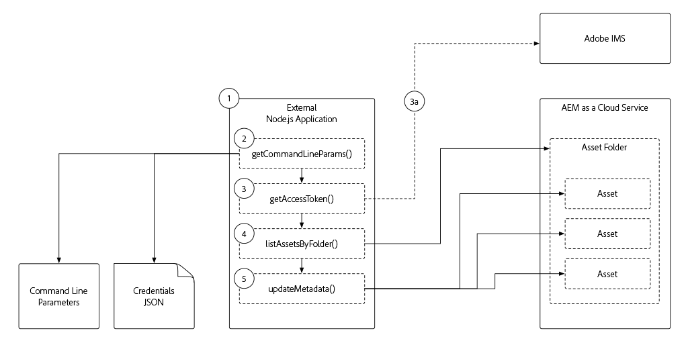

# Cloud Service으로 AEM에 대한 토큰 기반 인증

이 자습서에서는 액세스 토큰을 사용하여 외부 애플리케이션이 HTTP를 통해 Cloud Service으로 프로그래밍 방식으로 인증하고 AEM에 상호 작용할 수 있는 방법을 살펴봅니다.

>[!VIDEO](https://video.tv.adobe.com/v/330460/?quality=12&learn=on)

## 전제 조건

이 튜토리얼과 함께 다음 작업을 수행하기 전에 다음 사항이 적용되었는지 확인합니다.

1. Cloud Service 환경으로서 am AEM에 액세스(되도록이면 개발 환경 또는 샌드박스 프로그램)
1. Cloud Service 환경의 작성자 서비스 AEM 관리자 제품 프로필로 AEM 멤버십
1. Adobe IMS 조직 관리자에 대한 회원 가입 또는 액세스(해당 사용자는 [서비스 자격 증명](./service-credentials.md)에 대한 1회 초기화를 수행해야 함)
1. Cloud Service 환경에 배포된 최신 [WKND 사이트](https://github.com/adobe/aem-guides-wknd)

## 외부 애플리케이션 개요

이 자습서는 명령줄에서 [간단한 Node.js 응용 프로그램](./assets/aem-guides_token-authentication-external-application.zip) 실행을 사용하여 [자산 HTTP API](https://experienceleague.adobe.com/docs/experience-manager-cloud-service/assets/admin/mac-api-assets.html)을 사용하여 AEM의 자산 메타데이터를 Cloud Service으로 업데이트합니다.

Node.js 애플리케이션의 실행 플로우는 다음과 같습니다.

1. 명령줄에서 호출된 Node.js 응용 프로그램
1. 명령줄 매개 변수는 다음과 같이 정의합니다.
   + 연결할 Cloud Service 호스트로 AEM(`aem`)
   + 자산을 업데이트할 AEM 자산 폴더(`folder`)
   + 업데이트할 메타데이터 속성 및 값(`propertyName` 및 `propertyValue`)
   + AEM에 Cloud Service(`file`)로 액세스하는 데 필요한 자격 증명을 제공하는 파일의 로컬 경로
1. AEM 인증에 사용되는 액세스 토큰은 명령줄 매개 변수에서 제공하는 자격 증명 JSON 파일에서 파생됩니다

   a.로컬 이외의 개발에 사용되는 서비스 자격 증명을 자격 증명 JSON에 제공하는 경우 액세스 토큰은 Adobe IMS API에서 검색됩니다
1. 응용 프로그램은 액세스 토큰을 사용하여 AEM에 액세스하고 명령줄 매개 변수에 지정된 폴더의 모든 에셋을 나열합니다
1. 폴더의 각 에셋에 대해 응용 프로그램은 명령줄 매개 변수에 지정된 속성 이름 및 값을 기반으로 메타데이터를 업데이트합니다

이 예제 응용 프로그램은 Node.js이지만 이러한 상호 작용은 다른 프로그래밍 언어를 사용하여 개발하여 다른 외부 시스템에서 실행할 수 있습니다.

## 로컬 개발 액세스 토큰

로컬 개발 액세스 토큰은 Cloud Service 환경으로 생성되고 작성자 및 게시 서비스에 대한 액세스를 제공합니다.  이러한 액세스 토큰은 일시적이며 HTTP를 통해 AEM과 상호 작용하는 외부 응용 프로그램 또는 시스템의 개발을 돕는 데만 사용됩니다. 개발자가 통합 기능을 개발할 수 있도록 임시 액세스 토큰을 빠르고 쉽게 자동 생성할 수 있습니다.

+ [로컬 개발 액세스 토큰을 사용하는 방법](./local-development-access-token.md)

## 서비스 자격 증명

서비스 자격 증명은 외부 애플리케이션 또는 시스템이 HTTP를 통한 Cloud Service으로 AEM에 인증하고 상호 작용할 수 있도록 하는 개발 외의 시나리오(가장 명백히 제작)에서 사용되는 통합 자격 증명입니다. 서비스 자격 증명 자체는 AEM으로 직접 전송되어 인증되지 않으며, 대신 외부 응용 프로그램은 이러한 정보를 사용하여 Adobe IMS의 API _for_&#x200B;보안 액세스 토큰으로 교환되는 JWT를 생성합니다. 이 JWT는 이 API를 사용하여 Cloud Service에 대한 HTTP 요청을 인증하는 데 사용될 수 있습니다.

+ [서비스 자격 증명을 사용하는 방법](./service-credentials.md)

## 추가 리소스

+ [예제 애플리케이션 다운로드](./assets/aem-guides_token-authentication-external-application.zip)
+ JWT 작성 및 교환의 기타 코드 샘플
   + [Node.js, Java, Python, C#.NET 및 PHP 코드 샘플](https://www.adobe.io/authentication/auth-methods.html#!AdobeDocs/adobeio-auth/master/JWT/samples/samples.md)
   + [JavaScript/Axis 기반 코드 샘플](https://github.com/adobe/aemcs-api-client-lib)
