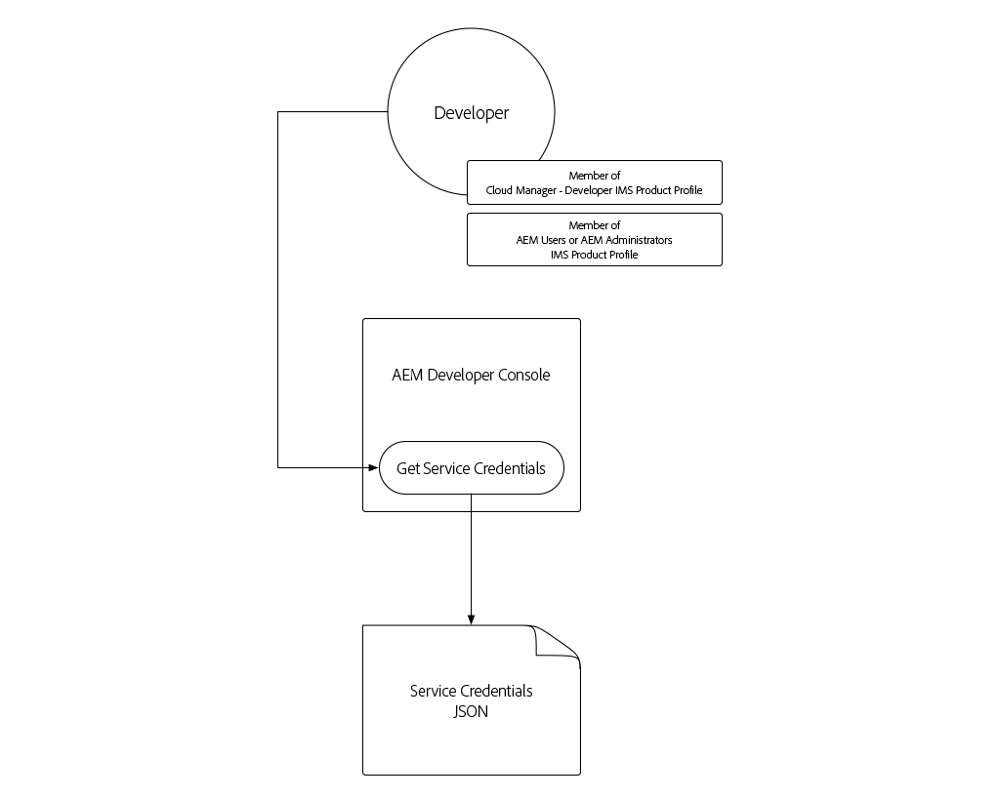

# 서비스 자격 증명

AEM과의 Cloud Service 통합은 AEM에 안전하게 인증할 수 있어야 합니다. AEM 개발자 콘솔은 HTTP를 통해 AEM 작성자 또는 게시 서비스와 프로그래밍 방식으로 상호 작용할 수 있도록 외부 애플리케이션, 시스템 및 서비스를 용이하게 하는 데 사용되는 서비스 자격 증명에 대한 액세스 권한을 부여합니다.

>[!VIDEO](https://video.tv.adobe.com/v/330519/?quality=12&learn=on)

서비스 자격 증명은 [로컬 개발 액세스 토큰](./local-development-access-token.md)과 비슷하지만 몇 가지 주요 방법으로 다릅니다.

+ 서비스 자격 증명은 _액세스 토큰이 아닌_&#x200B;입니다. 오히려 이 자격 증명은 _obtain_ 액세스 토큰에 사용되는 자격 증명입니다.
+ 서비스 자격 증명은 보다 영구적이며(365일마다 만료), 취소되지 않는 한 변경되지 않으며, 로컬 개발 액세스 토큰은 매일 만료됩니다.
+ Cloud Service 환경으로 AEM에 대한 서비스 자격 증명은 단일 AEM 기술 계정 사용자에게 매핑되는 반면, 로컬 개발 액세스 토큰은 액세스 토큰을 생성한 AEM 사용자로 인증합니다.

서비스 자격 증명과 사용자가 생성하는 액세스 토큰 및 로컬 개발 액세스 토큰은 모두 비밀로 유지되어야 합니다. 이 세 가지는 Cloud Service 환경으로 각 AEM에 대한 액세스를 얻는 데 사용할 수 있습니다

## 서비스 자격 증명 생성

서비스 자격 증명 생성은 다음 두 단계로 구분됩니다.

1. Adobe IMS 조직 관리자에 의한 1회 서비스 자격 증명 초기화
1. 서비스 자격 증명 JSON의 다운로드 및 사용

### 서비스 자격 증명 초기화

로컬 개발 액세스 토큰과 달리 서비스 자격 증명은 Adobe 조직 IMS의 _1회 초기화_&#x200B;를 필요로 합니다. 관리자가 이러한 자격 증명을 다운로드하여 사용할 수 있습니다.


__Cloud Service 환경으로 AEM당 한 번 초기화됩니다.__

1. Adobe IMS Org의 관리자로 로그인되어 있는지 확인합니다.
1. [Adobe 클라우드 관리자](https://my.cloudmanager.adobe.com)에 로그인
1. AEM이 포함된 프로그램을 Cloud Service 환경으로 열어
1. __환경__ 섹션의 환경 옆에 있는 줄임표를 누르고 __개발자 콘솔__&#x200B;을 선택합니다.
1. __통합__ 탭을 탭합니다.
1. __서비스 자격 증명 가져오기__ 단추를 누릅니다.
1. 서비스 자격 증명이 초기화되고 JSON으로 표시됩니다.


Cloud Service 환경의 서비스 자격 증명으로 AEM이 초기화되면 Adobe IMS Org의 다른 AEM 개발자가 해당 자격 증명을 다운로드할 수 있습니다.

### 서비스 자격 증명 다운로드



서비스 자격 증명을 다운로드하는 것은 초기화와 동일한 단계를 따릅니다. 초기화가 아직 발생하지 않은 경우 __서비스 자격 증명 가져오기__ 단추를 누르면 사용자에게 오류가 표시됩니다.

1. __클라우드 관리자 - Developer__ IMS 제품 프로필(AEM 개발자 콘솔에 대한 액세스 권한을 부여합니다)의 멤버인지 확인하십시오.
   + Cloud Service 환경으로 샌드박스 AEM은 __AEM 관리자__ 또는 __AEM 사용자__ 제품 프로필에 멤버십만 필요합니다.
1. [Adobe 클라우드 관리자](https://my.cloudmanager.adobe.com)에 로그인
1. AEM이 포함된 프로그램을 Cloud Service 환경으로 열고
1. __환경__ 섹션의 환경 옆에 있는 줄임표를 누르고 __개발자 콘솔__&#x200B;을 선택합니다.
1. __통합__ 탭을 탭합니다.
1. __서비스 자격 증명 가져오기__ 단추를 누릅니다.
1. 왼쪽 위 모서리의 다운로드 단추를 눌러 서비스 자격 증명 값이 포함된 JSON 파일을 다운로드하고 파일을 안전한 위치에 저장합니다.
   + _서비스 자격 증명이 손상되면 즉시 Adobe 지원 센터에 연락하여 서비스 자격 증명을 취소하도록 합니다._

## 서비스 자격 증명 설치

서비스 인증서에서는 AEM을 Cloud Service으로 인증하는 데 사용되는 액세스 토큰으로 교환되는 JWT를 생성하는 데 필요한 세부 정보를 제공합니다. 서비스 자격 증명은 AEM에 액세스하는 데 사용하는 외부 응용 프로그램, 시스템 또는 서비스에서 액세스할 수 있는 보안 위치에 저장해야 합니다. 서비스 자격 증명을 관리하는 방법과 위치는 고객별로 다릅니다.

간단히 말하자면, 이 자습서는 명령줄을 통해 서비스 자격 증명을 전달하지만, IT 보안 팀과 함께 조직의 보안 지침에 따라 이러한 자격 증명을 저장하고 액세스하는 방법을 파악합니다.

1. 서비스 자격 증명 JSON](#download-service-credentials)을 다운로드한 [을 프로젝트의 루트에 있는 `service_token.json`라는 파일에 복사합니다
   + 하지만 Git에 자격 증명을 커밋하지 마십시오!

## 서비스 자격 증명 사용

전체 형식의 JSON 개체인 서비스 자격 증명은 JWT 또는 액세스 토큰과 동일하지 않습니다. 대신 서비스 자격 증명(개인 키 포함)은 액세스 토큰에 대해 Adobe IMS API와 교환되는 JWT를 생성하는 데 사용됩니다.


1. AEM Developer Console에서 보안 위치로 서비스 자격 증명 다운로드
1. 외부 애플리케이션은 Cloud Service 환경에서 AEM과 프로그래밍 방식으로 상호 작용해야 합니다.
1. 외부 응용 프로그램은 보안 위치에서 서비스 자격 증명을 읽습니다.
1. 외부 응용 프로그램은 서비스 자격 증명의 정보를 사용하여 JWT 토큰을 생성합니다.
1. JWT 토큰이 액세스 토큰과 교환하기 위해 Adobe IMS로 전송됩니다.
1. Adobe IMS는 AEM에 Cloud Service으로 액세스하는 데 사용할 수 있는 액세스 토큰을 반환합니다.
   + 액세스 토큰에는 만료가 요청될 수 있습니다. 액세스 토큰의 수명을 짧게 유지하고 필요할 때 새로 고치는 것이 가장 좋습니다.
1. 외부 응용 프로그램은 AEM에 HTTP 요청을 Cloud Service으로 만들어 액세스 토큰을 HTTP 요청의 인증 헤더에 베어러 토큰으로 추가합니다.
1. AEM은 Cloud Service이 HTTP 요청을 받고, 요청을 인증하고, HTTP 요청에 의해 요청된 작업을 수행하고, 외부 응용 프로그램에 HTTP 응답을 다시 반환합니다

### 외부 응용 프로그램 업데이트

서비스 자격 증명을 사용하여 Cloud Service으로 AEM에 액세스하려면 외부 애플리케이션을 다음 3가지 방법으로 업데이트해야 합니다.

1. 서비스 자격 증명에서 읽기
   + 간단히 말하자면, 다운로드한 JSON 파일에서 이러한 내용을 확인하지만 실제 사용 시나리오에서는 서비스 자격 증명이 조직의 보안 지침에 따라 안전하게 저장되어야 합니다
1. 서비스 자격증명에서 JWT 생성
1. JWT를 액세스 토큰으로 교환
   + 서비스 자격 증명이 있으면 외부 응용 프로그램은 AEM에 Cloud Service으로 액세스할 때 로컬 개발 액세스 토큰 대신 이 액세스 토큰을 사용합니다

이 자습서에서는 Adobe의 `@adobe/jwt-auth` npm 모듈이 둘 다에 사용되고, (1) 서비스 자격 증명에서 JWT를 생성하고, (2) 단일 함수 호출에서 액세스 토큰으로 교환합니다. 응용 프로그램이 JavaScript를 기반으로 하지 않는 경우, 서비스 자격 증명에서 JWT를 만드는 방법에 대한 [ 샘플 코드를 다른 언어](https://www.adobe.io/authentication/auth-methods.html#!AdobeDocs/adobeio-auth/master/JWT/samples/samples.md)로 검토하여 Adobe IMS를 사용하여 액세스 토큰으로 교환하십시오.

## 서비스 자격 증명 읽기

`getCommandLineParams()`을 검토하고 로컬 개발 액세스 토큰 JSON에서 읽는 데 사용된 동일한 코드를 사용하여 서비스 자격 증명 JSON 파일에서 읽을 수 있는지 확인하십시오.

```javascript
function getCommandLineParams() {
    ...

    // Read in the credentials from the provided JSON file
    // Since both the Local Development Access Token and Service Credentials files are JSON, this same approach can be re-used
    if (parameters.file) {
        parameters.developerConsoleCredentials = JSON.parse(fs.readFileSync(parameters.file));
    }

    ...
    return parameters;
}
```

## JWT 만들기 및 액세스 토큰에 대한 교환

서비스 자격 증명을 읽고 액세스 토큰으로 Adobe IMS API와 교환되는 JWT를 생성하는 데 사용되며, 이 API를 사용하여 AEM을 Cloud Service으로 액세스할 수 있습니다.

이 예제 애플리케이션은 Node.js 기반이므로 [@adobe/jwt-auth](https://www.npmjs.com/package/@adobe/jwt-auth) npm 모듈을 사용하여 (1) JWT 생성 및 (Adobe IMS와의 20 교환을 용이하게 하는 것이 가장 좋습니다. 응용 프로그램이 다른 언어를 사용하여 개발된 경우 다른 프로그래밍 언어를 사용하여 Adobe IMS에 HTTP 요청을 구성하는 방법에 대한 [적절한 코드 샘플](https://www.adobe.io/authentication/auth-methods.html#!AdobeDocs/adobeio-auth/master/JWT/samples/samples.md)을 검토하십시오.

1. `getAccessToken(..)`을 업데이트하여 JSON 파일 내용을 검사하고 로컬 개발 액세스 토큰 또는 서비스 자격 증명을 나타내는지 확인합니다. 이 작업은 로컬 개발 액세스 토큰 JSON에만 존재하는 `.accessToken` 속성이 있는지 확인하여 손쉽게 수행할 수 있습니다.

   서비스 자격 증명이 제공되면 애플리케이션이 JWT를 생성하고 액세스 토큰에 대해 Adobe IMS와 교환합니다. JWT를 생성하여 단일 함수 호출에서 액세스 토큰으로 교환하는 [@adobe/jwt-auth](https://www.npmjs.com/package/@adobe/jwt-auth)`auth(...)` 함수를 사용합니다.  `auth(..)`에 대한 매개 변수는 아래 코드에 설명된 바와 같이 서비스 자격 증명 JSON에서 사용할 수 있는 특정 정보[JSON 개체입니다.](https://www.npmjs.com/package/@adobe/jwt-auth#config-object)

   ```javascript
    async function getAccessToken(developerConsoleCredentials) {
   
        if (developerConsoleCredentials.accessToken) {
            // This is a Local Development access token
            return developerConsoleCredentials.accessToken;
        } else {
            // This is the Service Credentials JSON object that must be exchanged with Adobe IMS for an access token
            let serviceCredentials = developerConsoleCredentials.integration;
   
            // Use the @adobe/jwt-auth library to pass the service credentials generated a JWT and exchange that with Adobe IMS for an access token.
            // If other programming languages are used, please see these code samples: https://www.adobe.io/authentication/auth-methods.html#!AdobeDocs/adobeio-auth/master/JWT/samples/samples.md
            let { access_token } = await auth({
                clientId: serviceCredentials.technicalAccount.clientId, // Client Id
                technicalAccountId: serviceCredentials.id,              // Technical Account Id
                orgId: serviceCredentials.org,                          // Adobe IMS Org Id
                clientSecret: serviceCredentials.technicalAccount.clientSecret, // Client Secret
                privateKey: serviceCredentials.privateKey,              // Private Key to sign the JWT
                metaScopes: serviceCredentials.metascopes.split(','),   // Meta Scopes defining level of access the access token should provide
                ims: `https://${serviceCredentials.imsEndpoint}`,       // IMS endpoint used to obtain the access token from
            });
   
            return access_token;
        }
    }
   ```

   이제 `file` 명령줄 매개 변수를 통해 전달되는 JSON 파일(로컬 개발 액세스 토큰 JSON 또는 서비스 자격 증명 JSON)에 따라 응용 프로그램에서 액세스 토큰을 파생합니다.

   서비스 자격 증명이 만료되지 않는 동안 JWT 및 해당 액세스 토큰은 만료되기 전에 새로 고쳐야 합니다. 이 작업은 Adobe IMS](https://www.adobe.io/authentication/auth-methods.html#!AdobeDocs/adobeio-auth/master/OAuth/OAuth.md#access-tokens)에서 제공하는 `refresh_token` [을 사용하여 수행할 수 있습니다.

1. 이러한 변경 사항이 적용되고 AEM 개발자 콘솔에서 다운로드한 서비스 자격 증명 JSON과 간단히 이 `index.js`과 동일한 폴더 `service_token.json`로 저장된 경우 명령줄 매개 변수 `file`를 `service_token.json`으로 대체한 응용 프로그램을 실행하고 `propertyValue`을(를) 새 값으로 업데이트하여 효과가 AEM에 분명히 나타날 수 있습니다.

   ```shell
   $ node index.js \
       aem=https://author-p1234-e5678.adobeaemcloud.com \
       folder=/wknd/en/adventures/napa-wine-tasting \
       propertyName=metadata/dc:rights \
       propertyValue="WKND Restricted Use" \
       file=service_token.json
   ```

   터미널로 출력하는 모습은 다음과 같습니다.

   ```shell
   200 - OK @ https://author-p1234-e5678.adobeaemcloud.com/api/assets/wknd/en/adventures/napa-wine-tasting.json
   403 - Forbidden @ https://author-p1234-e5678.adobeaemcloud.com/api/assets/wknd/en/adventures/napa-wine-tasting/AdobeStock_277654931.jpg.json
   403 - Forbidden @ https://author-p1234-e5678.adobeaemcloud.com/api/assets/wknd/en/adventures/napa-wine-tasting/AdobeStock_239751461.jpg.json
   403 - Forbidden @ https://author-p1234-e5678.adobeaemcloud.com/api/assets/wknd/en/adventures/napa-wine-tasting/AdobeStock_280313729.jpg.json
   403 - Forbidden @ https://author-p1234-e5678.adobeaemcloud.com/api/assets/wknd/en/adventures/napa-wine-tasting/AdobeStock_286664352.jpg.json
   ```

   __403 - 금지된__ 줄은 AEM에 대한 HTTP API 호출에서 Cloud Service으로 오류를 나타냅니다. 이러한 403 에셋의 메타데이터를 업데이트하려고 할 때 금지된 오류가 발생합니다.

   서비스 자격 증명을 통해 파생된 액세스 토큰은 기본적으로 읽기 권한만 있는 자동 생성된 기술 계정 AEM 사용자를 사용하여 AEM에 대한 요청을 인증합니다. AEM에 응용 프로그램 쓰기 액세스 권한을 제공하려면 액세스 토큰과 연결된 기술 계정 AEM 사용자에게 AEM에서 사용 권한이 부여되어야 합니다.

## AEM에서 액세스 구성

서비스 자격 증명을 통해 파생되는 액세스 토큰은 기여자 AEM 사용자 그룹에 멤버십이 있는 기술 계정 AEM 사용자를 사용합니다.


기술 계정 AEM 사용자가 AEM에 존재하면(액세스 토큰이 있는 첫 번째 HTTP 요청 이후) 이 AEM 사용자의 권한을 다른 AEM 사용자와 동일하게 관리할 수 있습니다.

1. 먼저 AEM Developer Console에서 다운로드한 서비스 자격 증명 JSON을 열어 기술 계정의 AEM 로그인 이름을 찾아 다음과 유사한 `integration.email` 값을 찾습니다.`12345678-abcd-9000-efgh-0987654321c@techacct.adobe.com`.
1. 해당 AEM 환경의 작성자 서비스에 AEM 관리자로 로그인
1. __도구__ > __보안__ > __사용자__&#x200B;로 이동합니다.
1. 1단계에서 식별된 __로그인 이름__&#x200B;으로 AEM 사용자를 찾고 __속성__&#x200B;을 엽니다.
1. __그룹__ 탭으로 이동하여 __DAM 사용자__ 그룹(자산에 대한 쓰기 액세스 권한)을 추가합니다.
1. __저장 후 닫기__&#x200B;를 누릅니다.

자산에 대한 쓰기 권한을 가지도록 AEM에 권한이 부여된 기술 계정이 있는 상태에서 응용 프로그램을 다시 실행하십시오.

```shell
$ node index.js \
    aem=https://author-p1234-e5678.adobeaemcloud.com \
    folder=/wknd/en/adventures/napa-wine-tasting \
    propertyName=metadata/dc:rights \
    propertyValue="WKND Restricted Use" \
    file=service_token.json
```

터미널로 출력하는 모습은 다음과 같습니다.

```
200 - OK @ https://author-p1234-e5678.adobeaemcloud.com/api/assets/wknd/en/adventures/napa-wine-tasting.json
200 - OK @ https://author-p1234-e5678.adobeaemcloud.com/api/assets/wknd/en/adventures/napa-wine-tasting/AdobeStock_277654931.jpg.json
200 - OK @ https://author-p1234-e5678.adobeaemcloud.com/api/assets/wknd/en/adventures/napa-wine-tasting/AdobeStock_286664352.jpg.json
200 - OK @ https://author-p1234-e5678.adobeaemcloud.com/api/assets/wknd/en/adventures/napa-wine-tasting/AdobeStock_239751461.jpg.json
200 - OK @ https://author-p1234-e5678.adobeaemcloud.com/api/assets/wknd/en/adventures/napa-wine-tasting/AdobeStock_280313729.jpg.json
```

## 변경 내용 확인

1. 업데이트된 Cloud Service 환경으로 AEM에 로그인합니다(`aem` 명령줄 매개 변수에 제공된 동일한 호스트 이름 사용).
1. __자산__ > __파일__&#x200B;으로 이동합니다.
1. `folder` 명령줄 매개 변수에 의해 지정된 자산 폴더로 이동합니다(예: __WKND__ > __영어__ > __Adventure__ > __Napa Wine Tasting__)
1. 폴더의 자산에 대해 __속성__&#x200B;을 엽니다.
1. __고급__ 탭으로 이동합니다.
1. 업데이트된 속성의 값을 검토하십시오. 예를 들어 업데이트된 `metadata/dc:rights` JCR 속성에 매핑되고, 이 속성은 `propertyValue` 매개 변수에 제공된 값을 반영합니다(예: __WKND 제한된 사용__).____


## 축하합니다!

이제 로컬 개발 액세스 토큰과 프로덕션 준비 서비스 간 액세스 토큰을 사용하여 프로그래밍 방식으로 AEM을 Cloud Service으로 액세스했습니다.

