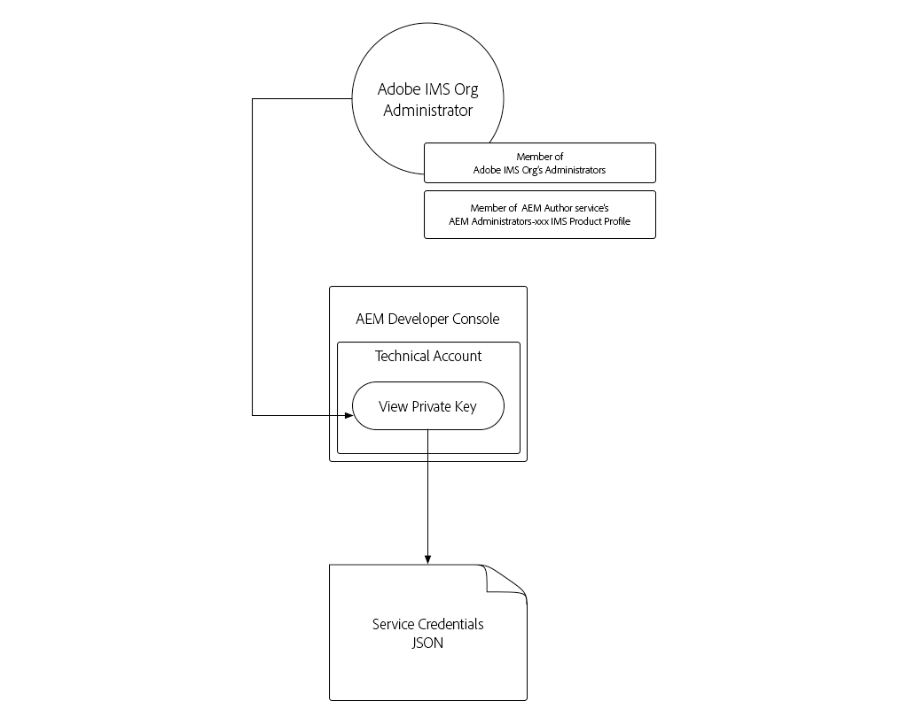

# 서비스 자격 증명

AEM as a Cloud Service(Adobe Experience Manager)과의 통합을 통해 AEM 서비스를 안전하게 인증할 수 있어야 합니다. AEM 개발자 콘솔에서는 외부 애플리케이션, 시스템 및 서비스가 HTTP를 통해 AEM 작성자 또는 게시 서비스와 프로그래밍 방식으로 상호 작용하는 데 사용되는 서비스 자격 증명에 대한 액세스 권한을 부여합니다.

>[!VIDEO](https://video.tv.adobe.com/v/330519?quality=12&learn=on)

서비스 자격 증명이 비슷하게 표시될 수 있습니다. [로컬 개발 액세스 토큰](./local-development-access-token.md) 그러나 몇 가지 주요 방법에서는 다릅니다.

+ 서비스 자격 증명은 기술 계정과 연결되어 있습니다. 기술 계정에 대해 여러 서비스 자격 증명을 활성화할 수 있습니다.
+ 서비스 자격 증명은 _아님_ 액세스 토큰으로, 대신 다음에 사용되는 자격 증명으로 사용됩니다. _획득_ 액세스 토큰.
+ 서비스 자격 증명은 보다 영구적이며(인증서는 365일마다 만료), 해지되지 않는 한 변경되지 않지만, 로컬 개발 액세스 토큰은 매일 만료됩니다.
+ AEM as a Cloud Service 환경에 대한 서비스 자격 증명은 단일 AEM 기술 계정 사용자에게 매핑되지만, 로컬 개발 액세스 토큰은 액세스 토큰을 생성한 AEM 사용자로 인증됩니다.
+ AEM as a Cloud Service 환경에서는 각각 고유한 서비스 자격 증명이 있는 최대 10개의 기술 계정을 가질 수 있으며 각 계정은 개별 기술 계정 AEM 사용자에 매핑됩니다.

서비스 자격 증명과 이 자격 증명에서 생성하는 액세스 토큰 및 로컬 개발 액세스 토큰은 모두 비밀로 유지되어야 합니다. 세 가지 모두 를 사용하여 해당 AEM as a Cloud Service 환경에 액세스할 수 있습니다.

## 서비스 자격 증명 생성

서비스 자격 증명 생성은 두 단계로 나뉩니다.

1. Adobe IMS 조직 관리자가 일회성 기술 계정 만들기
1. 기술 계정의 서비스 자격 증명 JSON 다운로드 및 사용

### 기술 계정 만들기

로컬 개발 액세스 토큰과 달리 서비스 자격 증명은 다운로드하기 전에 Adobe 조직 IMS 관리자가 기술 계정을 만들어야 합니다. AEM에 프로그래밍 방식으로 액세스해야 하는 각 클라이언트에 대해 개별 기술 계정을 만들어야 합니다.


기술 계정은 한 번 생성되지만, 기술 계정과 연결된 서비스 자격 증명을 관리하는 데 사용되는 개인 키는 시간이 지남에 따라 관리될 수 있습니다. 예를 들어 서비스 자격 증명 사용자가 계속 액세스할 수 있도록 하려면 현재 개인 키가 만료되기 전에 새 개인 키/서비스 자격 증명을 생성해야 합니다.

1. 다음으로 로그인했는지 확인합니다.
   + __Adobe IMS Org의 시스템 관리자__
   + 의 멤버 __AEM 관리자__ 의 IMS 제품 프로필 __AEM 작성자__
1. 에 로그인 [Adobe Cloud Manager](https://my.cloudmanager.adobe.com)
1. AEM as a Cloud Service 환경이 포함된 프로그램을 열어 다음에 대한 서비스 자격 증명을 통합합니다.
1. 에서 환경 옆에 있는 생략 부호를 탭합니다. __환경__ 섹션, 선택 __개발자 콘솔__
1. 을 누릅니다. __통합__ 탭
1. 탭 __기술 계정__ 탭
1. 누르기 __새 기술 계정 만들기__ 단추
1. 기술 계정의 서비스 자격 증명이 초기화되어 JSON으로 표시됩니다


AEM as Cloud Service 환경의 서비스 자격 증명이 초기화되면 Adobe IMS 조직의 다른 AEM 개발자가 해당 자격 증명을 다운로드할 수 있습니다.

### 서비스 자격 증명 다운로드



서비스 자격 증명 다운로드는 초기화와 유사한 단계를 따릅니다.

1. 다음으로 로그인했는지 확인합니다.
   + __Adobe IMS Org 관리자__
   + 의 멤버 __AEM 관리자__ 의 IMS 제품 프로필 __AEM 작성자__
1. 에 로그인 [Adobe Cloud Manager](https://my.cloudmanager.adobe.com)
1. 통합할 AEM as a Cloud Service 환경이 포함된 프로그램을 엽니다.
1. 에서 환경 옆에 있는 생략 부호를 탭합니다. __환경__ 섹션, 선택 __개발자 콘솔__
1. 을 누릅니다. __통합__ 탭
1. 탭 __기술 계정__ 탭
1. 확장 __기술 계정__ 사용 예정
1. 확장 __개인 키__ 서비스 자격 증명이 다운로드되고 상태가 (이)인지 확인합니다. __활성__
1. 을 누릅니다. __...__ > __보기__ 과(와) 연계됨 __개인 키__&#x200B;서비스 자격 증명 JSON을 표시하는
1. 왼쪽 상단 모서리의 다운로드 버튼을 탭하여 서비스 자격 증명 값이 포함된 JSON 파일을 다운로드하고 파일을 안전한 위치에 저장합니다

## 서비스 자격 증명 설치

서비스 자격 증명은 AEM as a Cloud Service으로 인증하는 데 사용되는 액세스 토큰으로 교환되는 JWT를 생성하는 데 필요한 세부 정보를 제공합니다. 서비스 자격 증명은 AEM에 액세스하는 데 사용하는 외부 응용 프로그램, 시스템 또는 서비스에서 액세스할 수 있는 보안 위치에 저장해야 합니다. 서비스 자격 증명을 관리하는 방법 및 위치는 고객별로 다릅니다.

간소화를 위해 이 자습서에서는 명령줄을 통해 의 서비스 자격 증명을 전달합니다. 그러나 IT 보안 팀과 협력하여 조직의 보안 지침에 따라 이러한 자격 증명을 저장하고 액세스하는 방법을 이해하십시오.

1. 다음을 복사합니다. [서비스 자격 증명 JSON 다운로드](#download-service-credentials) (이)라는 파일에 `service_token.json` 프로젝트의 루트에서
   + 다음을 기억, 커밋하지 않음 _모든 자격 증명_ Git으로!

## 서비스 자격 증명 사용

완전한 형태의 JSON 개체인 서비스 자격 증명은 JWT나 액세스 토큰과 동일하지 않습니다. 대신 개인 키를 포함하는 서비스 자격 증명을 사용하여 JWT를 생성하고, 액세스 토큰에 대해 Adobe IMS API와 교환됩니다.


1. AEM Developer Console에서 보안 위치로 서비스 자격 증명 다운로드
1. 외부 응용 프로그램은 AEM as a Cloud Service 환경과 프로그래밍 방식으로 상호 작용해야 합니다
1. 외부 애플리케이션이 보안 위치에서 서비스 자격 증명을 읽습니다
1. 외부 애플리케이션은 서비스 자격 증명의 정보를 사용하여 JWT 토큰을 구성합니다
1. JWT 토큰은 액세스 토큰으로 교환하기 위해 Adobe IMS로 전송됩니다
1. Adobe IMS는 AEM as a Cloud Service에 액세스하는 데 사용할 수 있는 액세스 토큰을 반환합니다
   + 액세스 토큰은 만료 시간을 변경할 수 없습니다.
1. AEM 외부 애플리케이션은 HTTP 요청의 인증 헤더에 전달자 토큰으로 액세스 토큰을 추가하여 as a Cloud Service으로 HTTP 요청을 수행합니다
1. AEM as a Cloud Service은 HTTP 요청을 수신하고 요청을 인증하며 HTTP 요청에서 요청한 작업을 수행하고 HTTP 응답을 다시 외부 응용 프로그램으로 반환합니다

### 외부 애플리케이션 업데이트

서비스 자격 증명을 사용하여 AEM에 as a Cloud Service으로 액세스하려면 외부 애플리케이션을 다음 세 가지 방법으로 업데이트해야 합니다.

1. 서비스 자격 증명에서 읽기

+ 간소화를 위해 다운로드한 JSON 파일에서 서비스 자격 증명을 읽지만, 실제 사용 시나리오에서는 조직의 보안 지침에 따라 서비스 자격 증명을 안전하게 저장해야 합니다

1. 서비스 자격 증명에서 JWT 생성
1. JWT를 액세스 토큰으로 교환

+ 서비스 자격 증명이 있으면 외부 애플리케이션이 AEM as a Cloud Service에 액세스할 때 로컬 개발 액세스 토큰 대신 이 액세스 토큰을 사용합니다

이 자습서에서는 Adobe의 `@adobe/jwt-auth` npm 모듈은 (1) 서비스 자격 증명에서 JWT를 생성하고 (2) 단일 함수 호출에서 액세스 토큰으로 교환하는 데 사용됩니다. 애플리케이션이 JavaScript 기반이 아닌 경우 [기타 언어의 샘플 코드](https://developer.adobe.com/developer-console/docs/guides/authentication/JWT/samples/) 서비스 자격 증명에서 JWT를 만들고, Adobe IMS와 액세스 토큰으로 교환하는 방법에 대해 알아봅니다.

## 서비스 자격 증명 읽기

리뷰 `getCommandLineParams()` 로컬 개발 액세스 토큰 JSON에서 읽는 데 사용되는 것과 동일한 코드를 사용하여 서비스 자격 증명 JSON 파일을 읽는 방법을 참조하십시오.

```javascript
function getCommandLineParams() {
    ...

    // Read in the credentials from the provided JSON file
    // Since both the Local Development Access Token and Service Credentials files are JSON, this same approach can be re-used
    if (parameters.file) {
        parameters.developerConsoleCredentials = JSON.parse(fs.readFileSync(parameters.file));
    }

    ...
    return parameters;
}
```

## JWT 만들기 및 액세스 토큰으로 교환

서비스 자격 증명을 읽으면 JWT를 생성하는 데 사용되고, 이 JWT는 액세스 토큰에 대한 Adobe IMS API와 교환됩니다. 그런 다음 이 액세스 토큰을 사용하여 AEM에 as a Cloud Service으로 액세스할 수 있습니다.

이 예제 애플리케이션은 Node.js 기반이므로 사용하는 것이 가장 좋습니다 [@adobe/jwt-auth](https://www.npmjs.com/package/@adobe/jwt-auth) (1) JWT 생성 및 (20)Adobe IMS와의 교환을 용이하게 하는 npm 모듈. 다른 언어를 사용하여 애플리케이션을 개발한 경우 다음을 검토하십시오. [적절한 코드 샘플](https://developer.adobe.com/developer-console/docs/guides/authentication/JWT/samples/) 다른 프로그래밍 언어를 사용하여 Adobe IMS에 대한 HTTP 요청을 구성하는 방법에 대해 설명합니다.

1. 업데이트 `getAccessToken(..)` JSON 파일 콘텐츠를 검사하고 로컬 개발 액세스 토큰 또는 서비스 자격 증명을 나타내는지 확인합니다. 이 작업은 의 존재를 확인함으로써 쉽게 수행할 수 있습니다. `.accessToken` 로컬 개발 액세스 토큰 JSON에만 존재하는 속성입니다.

   서비스 자격 증명이 제공되면 애플리케이션은 JWT를 생성하고 액세스 토큰에 대해 Adobe IMS와 교환합니다. 사용 [@adobe/jwt-auth](https://www.npmjs.com/package/@adobe/jwt-auth)의 `auth(...)` jwt를 생성하고 단일 함수 호출에서 액세스 토큰으로 교환하는 함수입니다. 에 대한 매개변수 `auth(..)` 메서드는 [특정 정보로 구성된 JSON 개체](https://www.npmjs.com/package/@adobe/jwt-auth#config-object) 코드에 아래 설명된 대로 서비스 자격 증명 JSON에서 사용할 수 있습니다.

```javascript
 async function getAccessToken(developerConsoleCredentials) {

     if (developerConsoleCredentials.accessToken) {
         // This is a Local Development access token
         return developerConsoleCredentials.accessToken;
     } else {
         // This is the Service Credentials JSON object that must be exchanged with Adobe IMS for an access token
         let serviceCredentials = developerConsoleCredentials.integration;

         // Use the @adobe/jwt-auth library to pass the service credentials generated a JWT and exchange that with Adobe IMS for an access token.
         // If other programming languages are used, please see these code samples: https://www.adobe.io/authentication/auth-methods.html#!AdobeDocs/adobeio-auth/master/JWT/samples/samples.md
         let { access_token } = await auth({
             clientId: serviceCredentials.technicalAccount.clientId, // Client Id
             technicalAccountId: serviceCredentials.id,              // Technical Account Id
             orgId: serviceCredentials.org,                          // Adobe IMS Org Id
             clientSecret: serviceCredentials.technicalAccount.clientSecret, // Client Secret
             privateKey: serviceCredentials.privateKey,              // Private Key to sign the JWT
             metaScopes: serviceCredentials.metascopes.split(','),   // Meta Scopes defining level of access the access token should provide
             ims: `https://${serviceCredentials.imsEndpoint}`,       // IMS endpoint used to obtain the access token from
         });

         return access_token;
     }
 }
```

    이제 &#39;file&#39; 명령줄 매개 변수를 통해 전달되는 JSON 파일(로컬 개발 액세스 토큰 JSON 또는 서비스 자격 증명 JSON)에 따라 애플리케이션이 액세스 토큰을 파생합니다.
    
    서비스 자격 증명이 365일마다 만료되는 동안 JWT 및 해당 액세스 토큰은 자주 만료되며 만료되기 전에 새로 고쳐야 합니다. 이 작업은 Adobe IMS에서 제공하는 &#39;refresh_token&#39;(https://www.adobe.io/authentication/auth-methods.html#!AdobeDocs/adobeio-auth/master/OAuth/OAuth.md)을 사용하여 수행할 수 #access-tokens.

1. 이러한 변경 사항이 적용되면 서비스 자격 증명 JSON이 AEM Developer Console에서 다운로드되어 다음과 같이 저장되었습니다. `service_token.json` 이것과 같은 폴더에 `index.js`. 이제 명령줄 매개 변수를 대체하는 애플리케이션을 실행하겠습니다 `file` 포함 `service_token.json`, 및 업데이트 `propertyValue` 를 새 값으로 변경하여 AEM에서 효과가 명확하게 나타나도록 할 수 있습니다.

   ```shell
   $ node index.js \
       aem=https://author-p1234-e5678.adobeaemcloud.com \
       folder=/wknd-shared/en/adventures/napa-wine-tasting \
       propertyName=metadata/dc:rights \
       propertyValue="WKND Restricted Use" \
       file=service_token.json
   ```

   터미널에 대한 출력은 다음과 같습니다.

   ```shell
   200 - OK @ https://author-p1234-e5678.adobeaemcloud.com/api/assets/wknd-shared/en/adventures/napa-wine-tasting.json
   403 - Forbidden @ https://author-p1234-e5678.adobeaemcloud.com/api/assets/wknd-shared/en/adventures/napa-wine-tasting/AdobeStock_277654931.jpg.json
   403 - Forbidden @ https://author-p1234-e5678.adobeaemcloud.com/api/assets/wknd-shared/en/adventures/napa-wine-tasting/AdobeStock_239751461.jpg.json
   403 - Forbidden @ https://author-p1234-e5678.adobeaemcloud.com/api/assets/wknd-shared/en/adventures/napa-wine-tasting/AdobeStock_280313729.jpg.json
   403 - Forbidden @ https://author-p1234-e5678.adobeaemcloud.com/api/assets/wknd-shared/en/adventures/napa-wine-tasting/AdobeStock_286664352.jpg.json
   ```

   다음 __403 - 금지됨__ 라인은 AEM as a Cloud Service에 대한 HTTP API 호출의 오류를 나타냅니다. 이 403 금지된 오류는 에셋의 메타데이터를 업데이트하려고 할 때 발생합니다.

   그 이유는 서비스 자격 증명에서 파생된 액세스 토큰이 자동으로 생성된 기술 계정 AEM 사용자를 사용하여 AEM에 대한 요청을 인증하기 때문이며, 기본적으로 읽기 액세스 권한만 있습니다. 응용 프로그램에 AEM에 대한 쓰기 액세스 권한을 제공하려면 액세스 토큰과 연결된 기술 계정 AEM 사용자에게 AEM에서 권한이 부여되어야 합니다.

## AEM에서 액세스 구성

서비스 자격 증명에서 파생된 액세스 토큰은에 멤버십이 있는 기술 계정 AEM 사용자를 사용합니다. __참가자__ AEM 사용자 그룹.


기술 계정 AEM 사용자가 AEM에 존재하면(액세스 토큰을 사용하여 첫 번째 HTTP 요청 이후) 이 AEM 사용자의 권한은 다른 AEM 사용자와 동일하게 관리할 수 있습니다.

1. 먼저 AEM Developer Console에서 다운로드한 서비스 자격 증명 JSON을 열어 기술 계정의 AEM 로그인 이름을 찾은 다음 를 찾습니다. `integration.email` 값은 다음과 유사해야 합니다. `12345678-abcd-9000-efgh-0987654321c@techacct.adobe.com`.
1. AEM 관리자로 해당 AEM 환경의 Author 서비스에 로그인합니다
1. 다음으로 이동 __도구__ > __보안__ > __사용자__
1. 를 사용하여 AEM 사용자를 찾습니다. __로그인 이름__ 1단계에서 식별 및 열기 __속성__
1. 다음 위치로 이동 __그룹__ 탭을 클릭하고 다음을 추가합니다 __DAM 사용자__ 그룹(자산에 대한 쓰기 액세스 권한이 있는 사람)
   + [AEM에서 제공한 사용자 그룹 목록 보기](https://experienceleague.adobe.com/docs/experience-manager-65/administering/security/security.html#built-in-users-and-groups) 최적의 권한을 얻으려면에 서비스 사용자를 추가합니다. 충분한 AEM 제공 사용자 그룹이 없는 경우 고유한 사용자 그룹을 만들고 적절한 권한을 추가합니다.
1. 누르기 __저장 및 닫기__

AEM에서 자산에 대한 쓰기 권한을 가질 수 있는 기술 계정을 사용하여 애플리케이션을 다시 실행하십시오.

```shell
$ node index.js \
    aem=https://author-p1234-e5678.adobeaemcloud.com \
    folder=/wknd-shared/en/adventures/napa-wine-tasting \
    propertyName=metadata/dc:rights \
    propertyValue="WKND Restricted Use" \
    file=service_token.json
```

터미널에 대한 출력은 다음과 같습니다.

```
200 - OK @ https://author-p1234-e5678.adobeaemcloud.com/api/assets/wknd-shared/en/adventures/napa-wine-tasting.json
200 - OK @ https://author-p1234-e5678.adobeaemcloud.com/api/assets/wknd-shared/en/adventures/napa-wine-tasting/AdobeStock_277654931.jpg.json
200 - OK @ https://author-p1234-e5678.adobeaemcloud.com/api/assets/wknd-shared/en/adventures/napa-wine-tasting/AdobeStock_286664352.jpg.json
200 - OK @ https://author-p1234-e5678.adobeaemcloud.com/api/assets/wknd-shared/en/adventures/napa-wine-tasting/AdobeStock_239751461.jpg.json
200 - OK @ https://author-p1234-e5678.adobeaemcloud.com/api/assets/wknd-shared/en/adventures/napa-wine-tasting/AdobeStock_280313729.jpg.json
```

## 변경 사항 확인

1. 업데이트된 AEM as a Cloud Service 환경에 로그인합니다( 에 제공된 것과 동일한 호스트 이름 사용). `aem` 명령줄 매개 변수)
1. 다음 위치로 이동 __에셋__ > __파일__
1. 에 의해 지정된 자산 폴더로 이동합니다. `folder` 명령줄 매개 변수(예: __WKND__ > __영어__ > __모험__ > __나파 와인 테이스팅__
1. 를 엽니다. __속성__ 폴더의 모든 에셋
1. 다음 위치로 이동 __고급__ 탭
1. 업데이트된 속성의 값 검토(예: __저작권__ 업데이트된 항목에 매핑됨 `metadata/dc:rights` JCR 속성, 이제 `propertyValue` 매개 변수(예: ) __WKND 제한된 사용__


## 축하합니다!

이제 로컬 개발 액세스 토큰과 프로덕션 준비 서비스 간 액세스 토큰을 사용하여 AEM에 프로그래밍 방식으로 as a Cloud Service으로 액세스했으므로!
