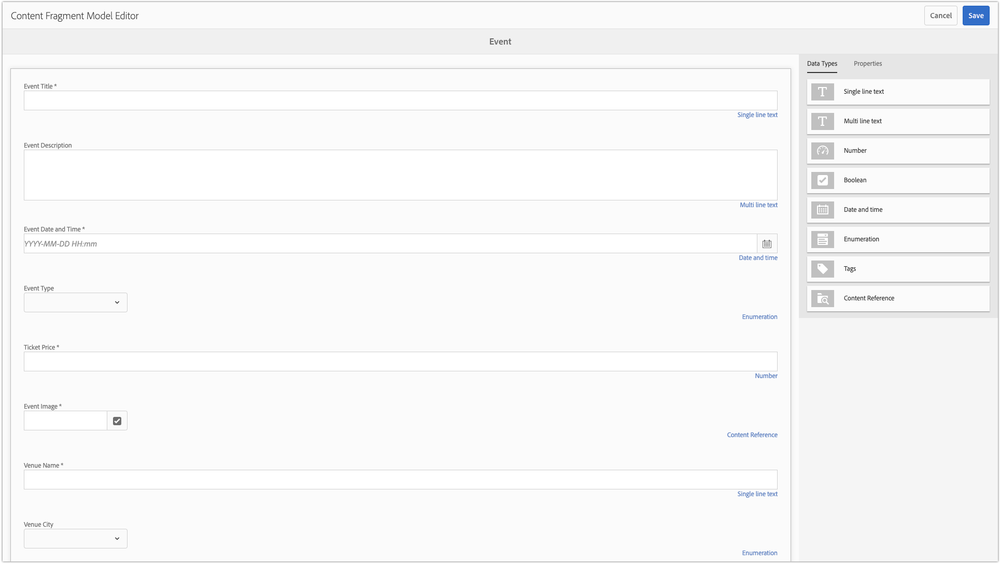

# 2장 - 컨텐츠 조각 모델 사용

AEM 컨텐츠 조각 모델은 AEM 작성자가 원시 컨텐츠 생성을 템플리트화하는 데 사용할 수 있는 컨텐츠 스키마를 정의합니다. 이 방법은 스캐폴딩 또는 양식 기반 작성과 유사합니다. 컨텐츠 조각의 주요 개념은 작성된 컨텐츠가 프레젠테이션에 영향을 받지 않는 것으로, 이는 AEM, 단일 페이지 애플리케이션 또는 모바일 앱이 사용자에게 컨텐츠가 표시되는 방식을 제어하는 데 사용되는 다중 채널 사용을 위한 것임을 의미합니다.

컨텐츠 조각의 주요 관심사는 다음과 같습니다.

1. 작성자로부터 올바른 컨텐츠가 수집됨
2. 이러한 컨텐츠는 구조화되고 잘 이해된 포맷으로 노출되어 애플리케이션을 소모할 수 있습니다.

이 장에서는 &quot;이벤트&quot;를 모델링 및 생성하기 위해 표준화된 데이터 구조 및 제작 인터페이스를 정의하는 데 사용되는 컨텐츠 조각 모델을 활성화하고 정의하는 데 대해 설명합니다.

## 컨텐츠 조각 모델 활성화

컨텐츠 조각 모델은 **AEM** 구성 브라우저를 통해 활성화되어야 **[!UICONTROL 합니다]**.

컨텐츠 조각 모델이 구성에 대해 **활성화되지** **[!UICONTROL 않은]경우[!UICONTROL 관련 AEM 구성에 대해]** 만들기>컨텐츠 조각버튼이 나타나지 않습니다.

>[!NOTE]
>
>AEM 구성은 아래에 저장된 [컨텍스트 인식 테넌트 구성](https://sling.apache.org/documentation/bundles/context-aware-configuration/context-aware-configuration.html) 세트를 나타냅니다 `/conf`. 일반적으로 AEM 구성은 AEM Sites에서 관리되는 특정 웹 사이트나 하위 컨텐츠 세트(자산, 페이지 등)를 담당하는 사업부와 상관 관계를 맺습니다. aem에서
>
>구성이 콘텐츠 계층에 영향을 주려면 해당 콘텐츠 계층 구조의 속성을 통해 구성을 `cq:conf` 참조해야 합니다. (아래 [!DNL WKND Mobile] 5단계 **** 에서 구성을 위해 이 작업을 수행합니다.)
>
>구성을 `global` 사용하면 구성이 모든 컨텐츠에 적용되며 설정할 필요가 `cq:conf` 없습니다.

1. 관련 구성을 수정할 수 있는 적절한 권한이 있는 사용자로 AEM Author에 로그인합니다.
   * 이 자습서에서는 **관리자** 사용자를 사용할 수 있습니다.
1. 도구 **[!UICONTROL >]일반[!UICONTROL >구성브라우저로이동합니다.]**
1. 선택 옆에 있는 **폴더 아이콘** 을 **[!DNL WKND Mobile]** 누른 다음 왼쪽 상단에 있는 **[!UICONTROL 편집]단추** 를누릅니다.
1. 컨텐츠 **[!UICONTROL 조각 모델을]**&#x200B;선택하고 오른쪽 상단에서 **[!UICONTROL 저장 및]** 닫기를 누릅니다.

   이렇게 하면 구성이 적용된 자산 폴더 컨텐츠 트리에서 컨텐츠 조각 모델을 [!DNL WKND Mobile] 사용할 수 있습니다.

   >[!NOTE]
   >
   >이 구성 변경은 [!UICONTROL AEM 구성] 웹 UI에서 되돌릴 수 없습니다. 이 구성을 취소하려면 다음을 수행하십시오.
   >    
   >    1. 개방형 [CRXDE Lite](http://localhost:4502/crx/de)
   >    1. 다음으로 이동 `/conf/wknd-mobile/settings/dam/cfm`
   >    1. 노드 `models` 삭제

   >    
   >이 구성에서 생성된 기존 컨텐츠 조각 모델은 삭제되고 해당 정의는 다음 위치에 저장됩니다 `/conf/wknd-mobile/settings/dam/cfm/models`.

1. 구성 **[!DNL WKND Mobile]** 을 자산 폴더에 **[!DNL WKND Mobile]적용하여 컨텐츠 조각 모델의 컨텐츠 조각을 해당 자산 폴더 계층 내에 만들 수 있도록 합니다** .

   1. AEM **[!UICONTROL >]자산[!UICONTROL >]파일[!UICONTROL 로이동합니다.]**
   1. WKND **[!UICONTROL 모바일]폴더 선택**
   1. 상단 작업 **[!UICONTROL 막대의 속성]** 단추를 눌러 폴더 [!UICONTROL 속성을 엽니다.]
   1. 폴더 [!UICONTROL 속성에서]**[!UICONTROL Cloud Services]** 탭을 누릅니다
   1. 클라우드 **[!UICONTROL 구성]** 필드가 **/conf/wknd-mobile로 설정되어 있는지 확인**
   1. 오른쪽 **[!UICONTROL 상단에 있는 저장]** 및 닫기를 눌러 변경 사항을 유지합니다.

>[!VIDEO](https://video.tv.adobe.com/v/28336/?quality=12&learn=on)

## 생성할 컨텐츠 조각 모델 이해

컨텐츠 조각 모델을 정의하기 전에, 필요한 모든 데이터 포인트를 캡처하고 있는지 확인하기 위해 진행할 경험을 검토해 보겠습니다. 이를 위해 모바일 애플리케이션 디자인을 검토하고 디자인 요소를 수집하기 위한 컨텐츠에 매핑합니다.

다음과 같이 이벤트를 정의하는 데이터 포인트를 분류할 수 있습니다.

이 매핑을 사용하여 Adobe는 이벤트 데이터를 수집하여 궁극적으로 노출하는 데 사용할 컨텐츠 조각을 정의할 수 있습니다.

## 컨텐츠 조각 모델 생성

1. Navigate to **[!UICONTROL Tools]>[!UICONTROL Assets]>[!UICONTROL Content Fragment Models]**.
1. 폴더를 눌러 **[!DNL WKND Mobile]** 엽니다.
1. 만들기를 **[!UICONTROL 눌러]** 컨텐츠 조각 모델 생성 마법사를 엽니다.
1. 모델 제목 **[!DNL Event]** 으로 **[!UICONTROL 입력하고]** *(설명* 선택) **[!UICONTROL 만들기를]** 탭하여저장합니다.

>[!VIDEO](https://video.tv.adobe.com/v/28337/?quality=12&learn=on)

## 컨텐츠 조각 모델의 구조 정의

1. Navigate to **[!UICONTROL Tools]>[!UICONTROL Assets]>[!UICONTROL Content Fragment Models]>[!DNL WKND]**.
1. 컨텐츠 **[!DNL Event]** 조각 모델을 선택하고 상단 작업 **[!UICONTROL 막대에서]** 편집을 누릅니다.
1. 오른쪽의 **[!UICONTROL 데이터 유형]탭****** 에서 **[!DNL Question]** 단일 행 텍스트 입력을왼쪽 드롭 영역에 드래그하여필드를 정의합니다.
1. 왼쪽에서 새 **[!UICONTROL 단일 행 텍스트 입력]** 이 선택되어 있고 오른쪽에 **[!UICONTROL 속성]탭** 이선택되어 있는지 확인합니다. 다음과 같이 속성 필드를 채웁니다.

   * [!UICONTROL 렌더링 형식] : `textfield`
   * [!UICONTROL 필드 레이블] : `Event Title`
   * [!UICONTROL 속성 이름] : `eventTitle`
   * [!UICONTROL 최대 길이] :25
   * [!UICONTROL 필수] : `Yes`

아래에 정의된 입력 정의를 사용하여 이러한 단계를 반복하여 이벤트 컨텐츠 조각 모델의 나머지 부분을 생성합니다.

>[!NOTE]
>
> Android 응용 프로그램이 **이러한 이름을** 키로 하도록 프로그래밍되었기 때문에 속성 이름 필드는 정확히 일치해야 합니다.

### 이벤트 설명

* [!UICONTROL 데이터 유형] : `Multi-line text`
* [!UICONTROL 필드 레이블] : `Event Description`
* [!UICONTROL 속성 이름] : `eventDescription`
* [!UICONTROL 기본 유형] : `Rich text`

### 이벤트 날짜 및 시간

* [!UICONTROL 데이터 유형] : `Date and time`
* [!UICONTROL 필드 레이블] : `Event Date and Time`
* [!UICONTROL 속성 이름] : `eventDateAndTime`
* [!UICONTROL 필수] : `Yes`

### 이벤트 유형

* [!UICONTROL 데이터 유형] : `Enumeration`
* [!UICONTROL 필드 레이블] : `Event Type`
* [!UICONTROL 속성 이름] : `eventType`
* [!UICONTROL 옵션] : `Art,Music,Performance,Photography`

### 티켓 가격

* [!UICONTROL 데이터 유형] : `Number`
* [!UICONTROL 렌더링 형식] : `numberfield`
* [!UICONTROL 필드 레이블] : `Ticket Price`
* [!UICONTROL 속성 이름] : `eventPrice`
* [!UICONTROL 유형] : `Integer`
* [!UICONTROL 필수] : `Yes`

### 이벤트 이미지

* [!UICONTROL 데이터 유형] : `Content Reference`
* [!UICONTROL 렌더링 형식] : `contentreference`
* [!UICONTROL 필드 레이블] : `Event Image`
* [!UICONTROL 속성 이름] : `eventImage`
* [!UICONTROL 루트 경로] : `/content/dam/wknd-mobile/images`
* [!UICONTROL 필수] : `Yes`

### 장소 이름

* [!UICONTROL 데이터 유형] : `Single-line text`
* [!UICONTROL 렌더링 형식] : `textfield`
* [!UICONTROL 필드 레이블] : `Venue Name`
* [!UICONTROL 속성 이름] : `venueName`
* [!UICONTROL 최대 길이] :20년
* [!UICONTROL 필수] : `Yes`

### 장소 도시

* [!UICONTROL 데이터 유형] : `Enumeration`
* [!UICONTROL 필드 레이블] : `Venue City`
* [!UICONTROL 속성 이름] : `venueCity`
* [!UICONTROL 옵션] : `Basel,London,Los Angeles,Paris,New York,Tokyo`

>[!VIDEO](https://video.tv.adobe.com/v/28335/?quality=12&learn=on)

>[!NOTE]
>
>속성 **[!UICONTROL 이름]** 은 이 값이 저장될 JCR 속성 이름 **모두와** JSON 파일의 키를 나타냅니다. 이것은 컨텐츠 조각 모델의 수명 동안 변경되지 않는 의미 체계 이름이어야 합니다.

컨텐츠 조각 모델 생성을 완료한 후 다음과 같은 정의 생성 완료:

## 다음 단계

원할 경우, [AEM Package Manager를 통해 AEM Author에](https://github.com/adobe/aem-guides-wknd-mobile/releases/latest) com.adobe.aem.guides.wknd-mobile.content.chapter-2.zip [컨텐츠 패키지를 설치합니다](http://localhost:4502/crx/packmgr/index.jsp). 이 패키지에는 자습서의 이 부분에 나와 있는 구성 및 컨텐츠가 들어 있습니다.

* [3장 - 이벤트 컨텐츠 조각 작성](./chapter-3.md)
