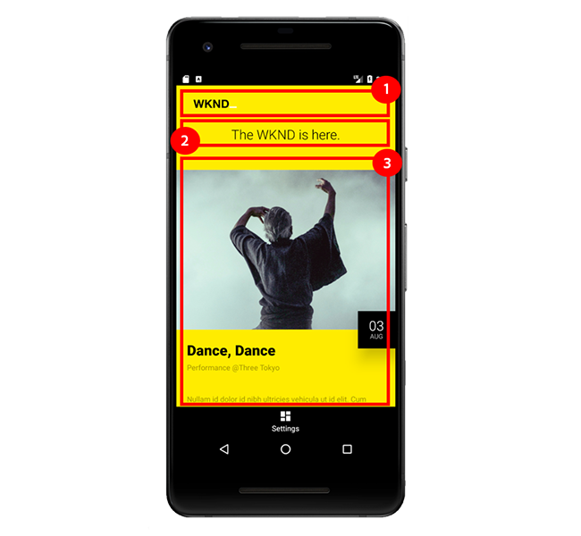

# 7장 - 모바일 앱에서 AEM 컨텐츠 서비스 사용

자습서의 7장에서는 기본 Android 모바일 앱을 사용하여 AEM Content Services의 콘텐츠를 사용합니다.

## Android 모바일 앱

이 자습서에서는 **간단한 기본 Android 모바일 앱**&#x200B;을 사용하여 AEM Content Services에서 노출되는 이벤트 콘텐츠를 사용하고 표시합니다.

[Android](https://developer.android.com/)의 사용은 크게 중요하지 않으며, 모바일 앱은 iOS와 같은 모든 모바일 플랫폼의 모든 프레임워크에서 작성할 수 있습니다.

Android는 Windows, macOs 및 Linux에서 Android 에뮬레이터를 실행하는 기능과 인기, AEM 개발자가 잘 알고 있는 Java로 작성할 수 있기 때문에 자습서에 사용됩니다.

*이 자습서의 Android 모바일 앱은 Android 모바일 앱을 빌드하거나 Android 개발 우수 사례를 전달하는 방법을 알려주기 위한 것이&#x200B;****아니라, 모바일 애플리케이션에서 AEM Content Services를 어떻게 사용할 수 있는지 설명하기 위한 것입니다.*

### AEM 콘텐츠 서비스를 통해 모바일 앱 경험을 향상시키는 방법



1. [!DNL Events API] 페이지의 **이미지 구성 요소**&#x200B;에 의해 정의된 **로고**&#x200B;입니다.
1. [!DNL Events API] 페이지의 **텍스트 구성 요소**&#x200B;에 정의된 **태그 줄**
1. 이 **이벤트 목록**&#x200B;은 구성된 **컨텐츠 조각 목록 구성 요소**&#x200B;을 통해 밝혀진 이벤트 컨텐츠 조각 일련화에서 파생됩니다.

## 모바일 앱 데모

>[!VIDEO](https://video.tv.adobe.com/v/28345/?quality=12&learn=on)

### 비로컬 호스트에 대한 모바일 앱 구성

AEM 게시가 **http://localhost:4503**&#x200B;에서 실행되지 않으면, AEM 게시 호스트/포트를 가리키도록 모바일 앱의 [!DNL Settings]에서 호스트 및 포트를 업데이트할 수 있습니다.

>[!VIDEO](https://video.tv.adobe.com/v/28344/?quality=12&learn=on)

## 로컬로 모바일 앱 실행

1. Android 에뮬레이터를 설치하려면 [Android Studio](https://developer.android.com/studio/install)를 다운로드하여 설치하십시오.
1. **Android** 파일  [!DNL APK]   [GitHub > 자산 > wknd-mobile.x.xapk 다운로드](https://github.com/adobe/aem-guides-wknd-mobile/releases/latest)
1. **Android Studio** 열기
   * Android Studio의 초기 실행 시 [!DNL Android SDK] 설치 메시지가 표시됩니다. 기본값을 그대로 적용하고 설치를 완료합니다.
1. Android Studio를 열고 **프로필 또는 디버그 APK**&#x200B;를 선택합니다.
1. 2단계에서 다운로드한 APK 파일(**wknd-mobile.x.x.apk**)을 선택하고 **확인**&#x200B;을 클릭합니다
   * **새 폴더 만들기** 또는 **기존 폴더 사용** 메시지가 표시되면 **기존 폴더 사용**&#x200B;을 선택합니다.
1. Android Studio의 초기 실행 시 프로젝트 목록에서 **wknd-mobile.x.x**&#x200B;을 마우스 오른쪽 단추로 클릭하고 **모듈 설정 열기**&#x200B;를 선택합니다.
   * **모듈 > wknd-mobile.x.x.x > 종속성 탭**&#x200B;에서 **Android API 29 플랫폼**&#x200B;을 선택합니다. 확인을 눌러 변경 사항을 닫고 저장합니다.
   * 이렇게 하지 않으면 에뮬레이터를 실행하려 할 때 &quot;Android SDK를 선택하십시오&quot; 오류가 표시됩니다.
1. **도구 > AVD 관리자**&#x200B;를 선택하거나 상단 막대에서 **AVD 관리자** 아이콘을 눌러 **AVD 관리자**&#x200B;를 엽니다.
1. **AVD 관리자** 창에서 **+ 가상 장치 만들기...를 클릭합니다.** 아직 등록된 장치가 없는 경우
   1. 왼쪽에서 **Phone** 범주를 선택합니다.
   1. **픽셀 2**&#x200B;을 선택합니다.
   1. **다음** 단추를 클릭합니다.
   1. **API 수준 29**&#x200B;과 함께 **Q**&#x200B;을 선택합니다.
      * AVD Manager가 처음 실행되면 버전 관리 API 다운로드라는 메시지가 나타납니다. &quot;Q&quot; 릴리스 옆에 있는 다운로드 링크를 클릭하고 다운로드 및 설치를 완료합니다.
   1. **다음** 단추를 클릭합니다.
   1. **마침** 단추를 클릭합니다.
1. **AVD 관리자** 창을 닫습니다.
1. 상단 메뉴 모음에서 **실행/편집 구성** 드롭다운에서 **wknd-mobile.x.x**&#x200B;을 선택합니다.
1. 선택한 **구성 실행/편집** 옆의 **실행** 단추를 누릅니다.
1. 팝업에서 새로 만든 **[!DNL Pixel 2 API 29]** 가상 장치를 선택하고 **OK**&#x200B;를 누릅니다.
1. [!DNL WKND Mobile] 앱이 즉시 로드되지 않으면 에뮬레이터의 Android 홈 화면에서 **[!DNL WKND]** 아이콘을 찾아 탭합니다.
   * 에뮬레이터가 실행되지만 에뮬레이터의 화면이 검은색으로 표시되는 경우 에뮬레이터 창 옆에 있는 에뮬레이터의 도구 창에서 **power** 단추를 누릅니다.
   * 가상 장치 내에서 스크롤하려면 마우스 단추를 누른 상태에서 드래그합니다.
   * AEM에서 컨텐츠를 새로 고치려면 새로 고침 아이콘까지 맨 위에서 아래로 당기십시오
표시됩니다.

>[!VIDEO](https://video.tv.adobe.com/v/28341/?quality=12&learn=on)

## 모바일 앱 코드

이 섹션에서는 AEM Content Services 및 JSON 출력에 따라 가장 상호 작용하며 의존하는 Android 모바일 앱 코드를 집중적으로 다룹니다.

모바일 앱이 로드되면 모바일 앱을 구동하기 위해 컨텐트를 제공하도록 구성된 AEM Content Services 끝점인 `HTTP GET`이(가) `/content/wknd-mobile/en/api/events.model.json`으로 만들어집니다.

이벤트 API(`/content/wknd-mobile/en/api/events.model.json`)의 편집 가능 템플릿이 잠겨 있으므로 모바일 앱을 코딩하여 JSON 응답의 특정 위치에서 특정 정보를 찾을 수 있습니다.

### 고급 코드 흐름

1. [!DNL WKND Mobile] 앱을 열면 AEM 게시(`/content/wknd-mobile/en/api/events.model.json`에 있음)에 대한 `HTTP GET` 요청을 호출하여 모바일 앱의 UI를 채우는 내용을 수집합니다.
2. AEM에서 콘텐츠를 받으면 모바일 앱의 세 가지 보기 요소인 **로고, 태그 라인 및 이벤트 목록**&#x200B;이 AEM의 컨텐츠로 초기화됩니다.
   * AEM 콘텐츠를 모바일 앱의 보기 요소에 바인딩하기 위해 각 AEM 구성 요소를 나타내는 JSON은 개체를 Java POJO에 매핑하고, 이 JSON은 Android 보기 요소에 바인딩됩니다.
      * 이미지 구성 요소 JSON→로고 POJO→로고 이미지 보기
      * 텍스트 구성 요소 JSON→TagLine POJO→텍스트 이미지 보기
      * 컨텐츠 조각 목록 JSON→이벤트 POJO→이벤트 ReciperView
   * *모바일 앱 코드는 JSON 응답 수가 더 많은 JSON 내에서 잘 알려진 위치 때문에 JSON을 POJO에 매핑할 수 있습니다. &quot;image&quot;, &quot;text&quot; 및 &quot;contentfragmentlist&quot;의 JSON 키는 지원 AEM Components의 노드 이름에 의해 좌우됩니다. 이러한 노드 이름이 변경되면 JSON 데이터에서 필수 콘텐츠를 소싱하는 방법을 모르기 때문에 모바일 앱이 중단됩니다.*

#### AEM Content Services 끝점 호출

다음은 AEM 콘텐츠 서비스를 호출하여 모바일 앱 경험을 유도하는 콘텐츠를 수집해야 하는 모바일 앱의 `MainActivity`에 있는 코드를 추출하는 것입니다.

```
protected void onCreate(Bundle savedInstanceState) {
    ...
    // Create the custom objects that will map the JSON -> POJO -> View elements
    final List<ViewBinder> viewBinders = new ArrayList<>();

    viewBinders.add(new LogoViewBinder(this, getAemHost(), (ImageView) findViewById(R.id.logo)));
    viewBinders.add(new TagLineViewBinder(this, (TextView) findViewById(R.id.tagLine)));
    viewBinders.add(new EventsViewBinder(this, getAemHost(), (RecyclerView) findViewById(R.id.eventsList)));
    ...
    initApp(viewBinders);
}

private void initApp(final List<ViewBinder> viewBinders) {
    final String aemUrl = getAemUrl(); // -> http://localhost:4503/content/wknd-mobile/en/api/events.mobile.json
    JsonObjectRequest request = new JsonObjectRequest(aemUrl, null,
        new Response.Listener<JSONObject>() {
            @Override
            public void onResponse(JSONObject response) {
                for (final ViewBinder viewBinder : viewBinders) {
                    viewBinder.bind(response);
                }
            }
        },
        ...
    );
}
```

`onCreate(..)` 은 모바일 앱에 대한 초기화 후크이며, JSON을 구문 분석하고 값을  `ViewBinders` 요소에 바인딩하는 3개의 사용자 지정 항목을  `View` 등록합니다.

`initApp(...)` 그러면 AEM Publish의 AEM Content Services 최종 지점에 HTTP GET 요청을 하여 컨텐츠를 수집합니다. 유효한 JSON 응답을 받으면 JSON을 구문 분석하고 모바일 `View` 요소에 바인딩하는 각각의 `ViewBinder`에 JSON 응답이 전달됩니다.

#### JSON 응답 구문 분석

다음으로 간단하지만 몇 가지 중요한 고려 사항을 강조 표시하는 `LogoViewBinder`을 살펴보겠습니다.

```
public class LogoViewBinder implements ViewBinder {
    ...
    public void bind(JSONObject jsonResponse) throws JSONException, IOException {
        final JSONObject components = jsonResponse.getJSONObject(":items").getJSONObject("root").getJSONObject(":items");

        if (components.has("image")) {
            final Image image = objectMapper.readValue(components.getJSONObject("image").toString(), Image.class);

            final String imageUrl = aemHost + image.getSrc();
            Glide.with(context).load(imageUrl).into(logo);
        } else {
            Log.d("WKND", "Missing Logo");
        }
    }
}
```

`bind(...)`의 첫 번째 행은 구성 요소가 추가된 AEM 레이아웃 컨테이너를 나타내는 **:items→루트→항목** 키를 통해 JSON 응답을 탐색합니다.

여기에서 이미지 구성 요소를 나타내는 **image**&#x200B;라는 키에 대해 확인이 수행됩니다(다시, 이 노드 이름 대신 JSON 키가 안정적임). 이 개체가 존재하는 경우 Jackson `ObjectMapper` 라이브러리를 통해 [사용자 지정 이미지 POJO](#image-pojo)에 읽고 매핑됩니다. 이미지 POJO는 아래에 설명되어 있습니다.

마지막으로 로고의 `src`이(가) [!DNL Glide] 도우미 라이브러리를 사용하여 Android ImageView에 로드됩니다.

AEM Content Services는 JCR 경로(예: `aemHost` `/content/dam/wknd-mobile/images/wknd-logo.png`)을 참조했습니다.

#### 이미지 POJO{#image-pojo}

선택 사항이지만, Gson과 같은 다른 라이브러리에서 제공하는 [Jackson ObjectMapper](https://fasterxml.github.io/jackson-databind/javadoc/2.9/com/fasterxml/jackson/databind/ObjectMapper.html) 또는 유사한 기능을 사용하면 기본 JSON 개체 자체를 직접 처리하는 데 오랜 시간이 소요되는 없이도 복잡한 JSON 구조를 Java POJO에 매핑할 수 있습니다. 이 간단한 경우 `image` JSON 개체의 `src` 키를 `@JSONProperty` 주석을 통해 이미지 POJO의 `src` 속성에 직접 매핑합니다.

```
package com.adobe.aem.guides.wknd.mobile.android.models;

import com.fasterxml.jackson.annotation.JsonProperty;

public class Image {
    @JsonProperty(value = "src")
    private String src;

    public String getSrc() {
        return src;
    }
}
```

JSON 개체에서 더 많은 데이터 포인트를 선택해야 하는 이벤트 POJO는 간단한 이미지보다 이 기법을 더 활용합니다. 우리가 원하는 것은 `src`입니다.

## 모바일 앱 경험 살펴보기

이제 AEM 콘텐츠 서비스가 기본 모바일 경험을 구현하는 방법을 이해했으므로 다음 단계를 수행하는 방법을 살펴보고 모바일 앱에 반영된 변경 사항을 확인하십시오.

각 단계 후 모바일 앱을 풀링하여 새로 고치고 모바일 경험에 대한 업데이트를 확인합니다.

1. **새 [!DNL Event] 컨텐츠 조각** 만들기 및 게시
1. **기존 [!DNL Event] 컨텐츠 조각** 게시 취소
1. **Tag Line**&#x200B;에 업데이트 게시

## 축하합니다

**AEM 헤드리스 튜토리얼을 통해 완성했습니다.**

헤드리스 CMS로 AEM 콘텐츠 서비스 및 AEM에 대한 자세한 내용은 Adobe의 다른 설명서 및 역량 강화 자료를 참조하십시오.

* [컨텐츠 조각 사용](../sites/content-fragments/understand-content-fragments-and-experience-fragments.md)
* [AEM WCM 핵심 구성 요소 사용 안내서](https://docs.adobe.com/content/help/ko-KR/experience-manager-core-components/using/introduction.html)
* [AEM WCM 코어 구성 요소 라이브러리](https://opensource.adobe.com/aem-core-wcm-components/library.html)
* [AEM WCM 핵심 구성 요소 GitHub 프로젝트](https://github.com/adobe/aem-core-wcm-components)
* [AEM WCM 핵심 구성 요소 - 전문가에게 문의](https://helpx.adobe.com/kr/experience-manager/kt/eseminars/ask-the-expert/aem-content-services.html)
* [구성 요소 내보내기 코드 샘플](https://github.com/Adobe-Consulting-Services/acs-aem-samples/blob/master/bundle/src/main/java/com/adobe/acs/samples/models/SampleComponentExporter.java)
