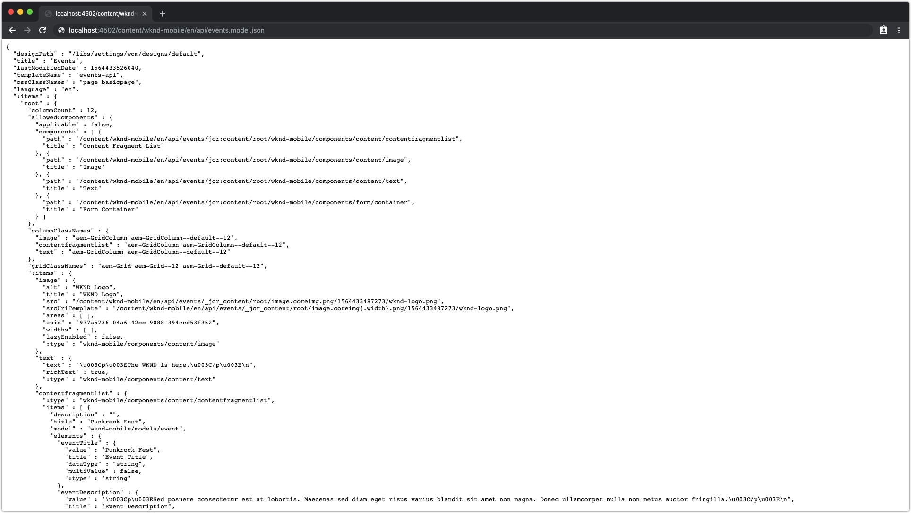

# 5장 - 컨텐츠 서비스 페이지 작성

AEM Headless 자습서의 5장에서는 4장에 정의된 템플릿에서 페이지 작성을 다룹니다. 이 장에서 만드는 페이지는 모바일 앱에 대한 JSON HTTP 종료 지점 역할을 합니다.

>[!NOTE]
>
> 의 페이지 컨텐츠 아키텍처 `/content/wknd-mobile/en/api` 이 사전 빌드되었습니다. 의 기본 페이지 `en` 및 `api` 건축적이고 조직적인 목적을 위해 일하지만, 엄격히 요구되는 것은 아니다. API 컨텐츠를 현지화할 수 있는 경우 API 페이지를 AEM Sites 페이지처럼 현지화할 수 있으므로 일반적인 언어 사본 및 다중 사이트 관리자 페이지 조직 우수 사례를 따르는 것이 좋습니다.

## 이벤트 API 페이지 만들기

1. 다음으로 이동 **[!UICONTROL AEM] > [!UICONTROL Sites] > [!DNL WKND Mobile] > [!DNL English] >[!DNL API]**.
1. **API 페이지에서 레이블을 누릅니다**&#x200B;를 입력한 다음 **만들기** 상단 작업 모음에서 를 클릭하고 API 페이지 아래에 새 이벤트 API 페이지를 만듭니다.
   1. 탭 **만들기** 상단 작업 모음에서
   1. 선택 **이벤트 API** 템플릿
   1. 에서 **이름** 필드 입력 **events**
   1. 에서 **제목** 필드 입력 **이벤트 API**
   1. 탭 **만들기** 맨 위 작업 표시줄에서 페이지를 만듭니다
   1. 탭 **완료** AEM Sites 관리자로 돌아갑니다.

>[!VIDEO](https://video.tv.adobe.com/v/28340?quality=12&learn=on)

## 이벤트 API 페이지 작성

>[!NOTE]
>
> 이 프로젝트는 작성 경험을 위한 몇 가지 기본 스타일을 제공하기 위해 CSS를 제공합니다.

1. 편집 **이벤트 API** 페이지로 이동하여 **AEM > Sites > WKND Mobile > English > API**, 선택 **이벤트 API** 페이지 및 탭 **편집** 를 클릭합니다.
1. 추가 **로고 이미지** 를 자산 파인더에서 이미지 구성 요소 자리 표시자로 끌어다 놓아 앱에 표시합니다.
   * 에 있는 제공된 로고를 사용하십시오. `/content/dam/wknd-mobile/images/wknd-logo.png`.

1. 추가 **태그 라인** 를 클릭하여 이벤트 위에 표시합니다.
   1. 편집 **텍스트** 구성 요소
   1. 텍스트를 입력합니다.
      * `The WKND is here.`

1. 을(를) 선택합니다 **events** 다음과 같이 표시합니다.
   1. 에서 다음 구성을 설정합니다. **속성** 탭:
      * 모델: **이벤트**
      * 상위 경로: **/content/dam/wknd-mobile/en/events**
      * 태그: **&lt;leave blank=&quot;&quot;>**
   1. 에서 다음 구성을 설정합니다. **요소** 탭:
      * 나열된 요소를 모두 제거하여 이벤트 컨텐츠 조각의 모든 요소가 표시되도록 합니다.

>[!VIDEO](https://video.tv.adobe.com/v/28339?quality=12&learn=on)

## API 페이지의 JSON 출력을 검토하십시오

JSON 출력 및 해당 형식은 를 사용하여 페이지를 요청하여 검토할 수 있습니다. `.model.json` 선택기.

이 API의 소비자가 이 JSON 구조(또는 스키마)를 잘 알고 있어야 합니다. 이는 중요한 API 소비자가 구조의 어떤 측면이 고정되어 있는지(예: 이벤트 API의 로고(이미지) 및 Tag Live(텍스트)이며 유동(예: 컨텐츠 조각 목록 구성 요소 아래에 나열된 이벤트.

게시된 API에서 이 계약을 중단하면 앱이 사용되는 경우 잘못된 동작이 발생할 수 있습니다.

1. 새 브라우저 탭에서 다음을 사용하여 이벤트 API 페이지를 요청합니다 `.model.json` 선택기: 는 AEM Content Services의 JSON Exporter를 호출하고 페이지 및 구성 요소를 정규화된 잘 정의된 JSON 구조로 serialize합니다.

   이러한 페이지에서 만든 JSON 구조는 앱을 사용하는 구조가 충족해야 하는 구조입니다.

1. 요청 **이벤트 API** 페이지 페이지 **JSON**.

   * [http://localhost:4502/content/wknd-mobile/en/api/events.model.json](http://localhost:4502/content/wknd-mobile/en/api/events.model.tidy.json)

   결과는 다음과 유사하게 표시됩니다.

>[!NOTE]
>
> 이 JSON은 **깔끔해** (포맷됨) `.tidy` 선택기:
> * [http://localhost:4502/content/wknd-mobile/en/api/events.model.tidy.json](http://localhost:4502/content/wknd-mobile/en/api/events.model.tidy.json)

## 다음 단계

선택적으로 를 설치합니다 [com.adobe.aem.guides.wknd-mobile.content.chapter-5.zip](https://github.com/adobe/aem-guides-wknd-mobile/releases/latest) 를 통해 AEM 작성자의 컨텐츠 패키지 [AEM 패키지 관리자](http://localhost:4502/crx/packmgr/index.jsp). 이 패키지에는 자습서의 이전 장과 이 장에 설명된 구성 및 컨텐츠가 들어 있습니다.

* [6장 - AEM 게시에서 JSON으로 컨텐츠 노출](./chapter-6.md)
