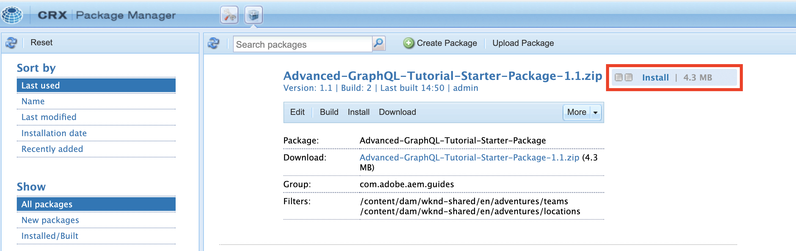
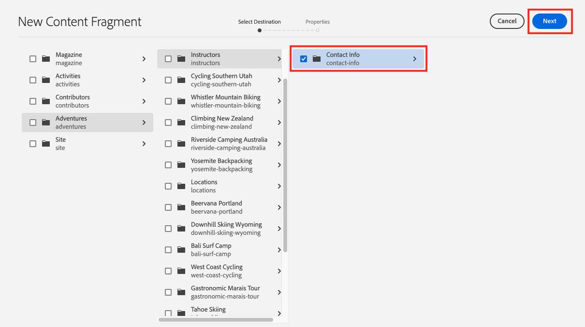
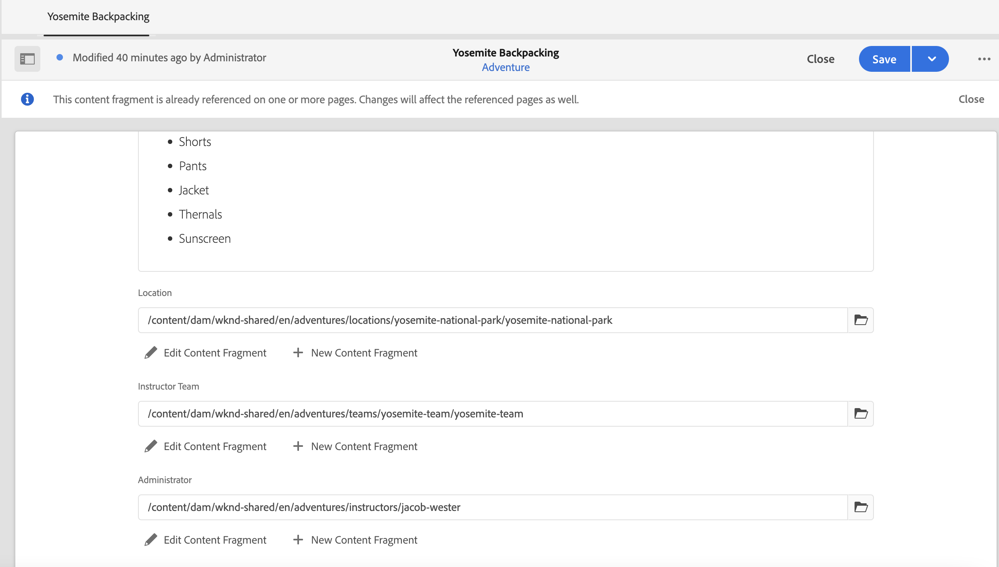

# 컨텐츠 조각 작성

에서 [이전 장](/help/headless-tutorial/graphql/advanced-graphql/create-content-fragment-models.md)5개의 컨텐츠 조각 모델을 만들었습니다. 개인, 팀, 위치, 주소 및 연락처 정보 이 장에서는 해당 모델을 기반으로 컨텐츠 조각을 만드는 단계를 안내합니다. 또한 폴더 정책을 만들어 폴더에서 사용할 수 있는 컨텐츠 조각 모델을 제한하는 방법을 살펴봅니다.

## 전제 조건 {#prerequisites}

이 문서는 여러 부분으로 구성된 자습서의 일부입니다. 이 장을 진행하기 전에 이전 장이 완료되었는지 확인하십시오.

## 목표 {#objectives}

이 장에서는 다음 방법을 알아봅니다.

* 폴더 정책을 사용하여 폴더 생성 및 제한 설정
* 컨텐츠 조각 편집기에서 직접 조각 참조를 생성합니다
* 탭, 날짜 및 JSON 개체 데이터 유형 사용
* 여러 줄 텍스트 편집기에 컨텐츠 및 조각 참조를 삽입합니다
* 여러 조각 참조 추가
* 컨텐츠 조각 중첩

## 샘플 컨텐츠 설치 {#sample-content}

자습서를 가속화하는 데 사용되는 여러 폴더와 샘플 이미지가 포함된 AEM 패키지를 설치합니다.

1. 다운로드 [Advanced-GraphQL-Tutorial-Starter-Package-1.0.zip](/help/headless-tutorial/graphql/advanced-graphql/assets/tutorial-files/Advanced-GraphQL-Tutorial-Starter-Package-1.0.zip)
1. AEM에서 **도구** > **배포** > **패키지** 액세스 권한 **패키지 관리자**.
1. 이전 단계에서 다운로드한 패키지(zip 파일)를 업로드하고 설치합니다.

   

## 폴더 정책을 사용하여 폴더 생성 및 제한 설정

AEM 홈페이지에서 을 선택합니다 **자산** > **파일** > **WKND 사이트** > **영어**. 여기에서는 모험과 기여자를 비롯하여 이전 컨텐츠에서 탐색한 다양한 컨텐츠 조각 카테고리를 볼 수 있습니다 [여러 단계 GraphQL 자습서](../multi-step/overview.md).

### 폴더 만들기 {#create-folders}

로 이동합니다. **모험** 폴더를 입력합니다. 팀 및 위치 컨텐츠 조각을 저장하기 위해 팀 및 위치에 대한 폴더가 이미 생성되었음을 확인할 수 있습니다.

개인 컨텐츠 조각 모델을 기반으로 하는 강사 컨텐츠 조각용 폴더를 만듭니다.

1. [모험] 페이지에서 **만들기** > **폴더** 오른쪽 상단 모서리에서

   

1. 표시되는 폴더 만들기 모달에서 **제목** 필드. 끝에 &#39;s&#39;를 주목하십시오. 여러 조각이 포함된 폴더의 제목은 복수여야 합니다. **만들기**&#x200B;를 선택합니다.

   

   이제 Adventure Teachers를 저장할 폴더를 만들었습니다.

### 폴더 정책을 사용하여 제한 설정

AEM에서는 컨텐츠 조각 폴더에 대한 권한 및 정책을 정의할 수 있습니다. 권한을 사용하여 특정 사용자(작성자) 또는 작성자 그룹만 특정 폴더에 액세스할 수 있도록 허용할 수 있습니다. 폴더 정책을 사용하여 컨텐츠 조각 모델 작성자가 해당 폴더에서 사용할 수 있는 컨텐츠 조각 모델을 제한할 수 있습니다. 이 예에서는 폴더를 개인 및 연락처 정보 모델로 제한하겠습니다. 폴더 정책을 구성하려면

1. 을(를) 선택합니다 **강사** 만든 폴더를 선택한 다음 **속성** 상단 탐색 막대에서 을 클릭합니다.

   

1. 을(를) 선택합니다 **정책** 탭에서 선택 취소합니다 **/content/dam/wknd에서 상속됨**. 에서 **경로별 허용된 컨텐츠 조각 모델** 필드에서 폴더 아이콘을 선택합니다.

   

1. 열리는 경로 선택 대화 상자에서 경로를 따릅니다 **conf** > **WKND 사이트**. 이전 장에서 생성된 개인 컨텐츠 조각 모델은 연락처 정보 컨텐츠 조각 모델에 대한 참조를 포함합니다. 강사 컨텐츠 조각을 생성하려면 개인 및 연락처 정보 모델을 모두 강사 폴더에 허용해야 합니다. 선택 **개인** 및 **연락처 정보**, 그런 다음 키를 누릅니다. **선택** 을 클릭하여 대화 상자를 닫습니다.

   

1. 선택 **저장 후 닫기** 을(를) 선택합니다. **확인** 이 나타납니다.

1. 이제 강사 폴더에 대한 폴더 정책을 구성했습니다. 로 이동합니다. **강사** 폴더를 선택하고 **만들기** > **컨텐츠 조각**. 이제 선택할 수 있는 유일한 모델은 다음과 같습니다 **개인** 및 **연락처 정보**.

   

## 강사의 컨텐츠 조각 작성

로 이동합니다. **강사** 폴더를 입력합니다. 여기에서 강사의 연락처 정보를 저장할 중첩된 폴더를 만들겠습니다.

의 섹션에 설명된 단계를 따릅니다 [폴더 만들기](#create-folders) &quot;연락처 정보&quot;라는 폴더를 만들려면 중첩된 폴더는 상위 폴더의 폴더 정책을 상속합니다. 새로 만든 폴더만 연락처 정보 모델을 사용할 수 있도록 좀 더 구체적인 정책을 자유롭게 구성할 수 있습니다.

### 강사 컨텐츠 조각 만들기

어드벤처 강사 팀에 추가될 수 있는 네 명의 사람들을 만들자. 이전 항목에서 만든 기여자 컨텐츠 조각의 이미지 및 이름을 재사용합니다 [여러 단계 GraphQL 자습서](../multi-step/author-content-fragments.md). 이전 자습서에서는 기본 컨텐츠 조각을 만드는 방법에 대해 간략하게 설명했지만 이 자습서에서는 더 고급 기능에 중점을 둡니다.

1. 강사 폴더에서 개인 컨텐츠 조각 모델을 기반으로 새 컨텐츠 조각을 만들어 &quot;Jacob Wester&quot;의 제목을 지정합니다.

   새로 만든 컨텐츠 조각은 다음과 같습니다.

   

1. 필드에 다음 콘텐츠를 입력합니다.

   * **전체 이름**: 제이콥 웨스터
   * **전기**: 제이콥 웨스터는 10년 동안 하이킹 강사로 일해왔고 매 순간 그 일을 아주 좋아했어요! 그는 암벽 등반과 배낭 여행에 재능이 있는 모험 탐구자이다. 야곱은 만 표석 싸움 등 등반 경기의 우승자다. 그는 현재 캘리포니아에 살고 있다.
   * **강사 경험 수준**: 전문가
   * **기술**: 암벽 등반, 서핑, 배낭
   * **관리자 세부 정보**: 제이콥 웨스터는 배낭 모험에 대해 3년간 협력해왔다.

1. 에서 **프로필 사진** 필드에서 이미지에 컨텐츠 참조를 추가합니다. 찾아보기 **WKND 사이트** > **영어** > **기여자** > **jacob_wester.jpg** 을 눌러 이미지에 대한 경로를 생성합니다.

### 컨텐츠 조각 편집기에서 새 조각 참조를 만듭니다 {#fragment-reference-from-editor}

AEM에서는 컨텐츠 조각 편집기에서 직접 조각 참조를 생성할 수 있습니다. 제이콥의 연락처 정보를 참고하자.

1. 선택 **새 컨텐츠 조각** 아래 **연락처 정보** 필드.

   

1. 새 컨텐츠 조각 모달이 열립니다. 대상 선택 탭에서 경로를 따릅니다 **모험** > **강사** 그리고 옆의 확인란을 선택합니다 **연락처 정보** 폴더를 입력합니다. 선택 **다음** 속성 탭으로 이동합니다.

   

1. 속성(Properties) 탭 아래에 &quot;Jacob Wester Contact Info&quot;를 입력합니다. **제목** 필드. 선택 **만들기**, 그런 다음 키를 누릅니다. **열기** 이 나타납니다.

   

   연락처 정보 컨텐츠 조각을 편집할 수 있는 새 필드가 나타납니다.

   

1. 필드에 다음 콘텐츠를 입력합니다.

   * **전화**: 209-888-0000
   * **이메일**: jwester@wknd.com

   완료되면 을 선택합니다 **저장**. 이제 새 연락처 정보 컨텐츠 조각을 만들었습니다.

1. 강사 컨텐츠 조각으로 돌아가려면 을 선택합니다 **제이콥 웨스터** 편집기 왼쪽 상단 모서리에서 을(를) 클릭합니다.

   

   다음 **연락처 정보** 이제 필드에 참조된 연락처 정보 조각의 경로가 포함됩니다. 중첩 조각 참조입니다. 완료된 강사 컨텐츠 조각은 다음과 같습니다.

   

1. 선택 **저장 후 닫기** 컨텐츠 조각을 저장 합니다. 이제 새 강사 컨텐츠 조각이 있습니다.

### 추가 조각 만들기

에 설명된 것과 동일한 프로세스를 따릅니다 [이전 섹션](#fragment-reference-from-editor) 이러한 강사에 대해 3개의 강사 컨텐츠 조각과 3개의 담당자 정보 컨텐츠 조각을 추가로 생성합니다. 강사 조각에 다음 컨텐츠를 추가합니다.

**스테이시 로셀**

| 필드 | 값 |
| --- | --- |
| 컨텐츠 조각 제목 | 스테이시 로셀 |
| 전체 이름 | 스테이시 로셀 |
| 연락처 정보 | /content/dam/wknd/en/adventures/guidelines/contact-info/stacey-roswells-contact-info |
| 프로필 사진 | /content/dam/wknd/en/contributors/stacey-roswells.jpg |
| 전기 | Stacey Roswells는 뛰어난 암벽 등반가와 알파인 모험가이다. 메릴랜드주 볼티모어에서 태어난 스테이시는 여섯 아이 중 막내이다. 그녀의 아버지는 미 해군 대령, 어머니는 현대 댄스 교관이었다. 그의 가족은 아버지의 업무 과제물을 자주 챙기고 그가 태국 주재 때 첫 사진을 찍었다. 이곳은 또한 스테이시가 암벽을 오르는 것을 배운 곳입니다. |
| 강사 경험 수준 | 고급 |
| 기술 | 암벽 등반 | 스키 | 백패킹 |

**쿠마르 셀바라즈**

| 필드 | 값 |
| --- | --- |
| 컨텐츠 조각 제목 | 쿠마르 셀바라즈 |
| 전체 이름 | 쿠마르 셀바라즈 |
| 연락처 정보 | /content/dam/wknd/en/adventure/trapers/contact-info/kumar-selvaraj-contact-info |
| 프로필 사진 | /content/dam/wknd/en/contributors/Kumar_Selvaraj.JPG |
| 전기 | Kumar Selvaraj는 경험이 많은 AMGA 공인 전문 강사이며, 가장 큰 목표는 학생들이 등산과 하이킹 기술을 향상시키는 것을 돕는 것입니다. |
| 강사 경험 수준 | 고급 |
| 기술 | 암벽 등반 | 백패킹 |

**아요 오군세인데**

| 필드 | 값 |
| --- | --- |
| 컨텐츠 조각 제목 | 아요 오군세인데 |
| 전체 이름 | 아요 오군세인데 |
| 연락처 정보 | /content/dam/wknd/en/adventure/trapers/contact-info/ayo-ogunseinde-contact-info |
| 프로필 사진 | /content/dam/wknd/en/contributors/ayo-ogunseinde-237739.jpg |
| 전기 | Ayo Ogunseinde는 중부 캘리포니아 주 프레스노에서 살고 있는 전문적인 등산가들과 배낭 강사이다. 그녀의 목표는 하이커들이 그들의 가장 서사적인 국립공원의 모험을 안내하는 것이다. |
| 강사 경험 수준 | 고급 |
| 기술 | 암벽 등반 | 사이클링 | 백패킹 |

을(를) 종료하십시오. **추가 정보** 필드가 비어 있습니다.

연락처 정보 조각에 다음 정보를 추가합니다.

| 컨텐츠 조각 제목 | 전화 | 이메일 |
| ------- | -------- | -------- |
| Stacey Roswell 연락처 정보 | 209-888-0011 | sroswells@wknd.com |
| 쿠마르 셀바라즈 연락처 정보 | 209-888-0002 | kselvaraj@wknd.com |
| Ayo Ogunseinde 연락처 정보 | 209-888-0304 | aogunseinde@wknd.com |

이제 팀을 만들 준비가 되었습니다!

## 위치에 대한 컨텐츠 조각 작성

로 이동합니다. **위치** 폴더를 입력합니다. 여기서는 이미 만들어진 중첩된 폴더 두 개를 볼 수 있습니다. 요세미티 국립공원과 요세미티 밸리 로지.


지금 요세미티 밸리 로지 폴더를 무시하세요. 이 섹션의 후반부에 강사팀의 홈 베이스 역할을 할 새 위치를 만들 때 다시 살펴봅니다.

로 이동합니다. **요세미티 국립공원** 폴더를 입력합니다. 현재 요세미티 국립공원의 사진만 담고 있습니다 위치 컨텐츠 조각 모델을 사용하여 새 컨텐츠 조각을 만들어 &quot;Yosemite National Park&quot;라고 명명하겠습니다.

### 탭 자리 표시자

AEM에서는 탭 자리 표시자를 사용하여 다양한 유형의 컨텐츠를 그룹화하고 컨텐츠 조각을 보다 쉽게 읽고 관리할 수 있습니다. 이전 장에서는 탭 자리 표시자를 위치 모델에 추가했습니다. 따라서 이제 위치 컨텐츠 조각에 두 개의 탭 섹션이 있습니다. **위치 세부 사항** 및 **위치 주소**.


다음 **위치 세부 사항** 탭에는 다음이 포함되어 있습니다 **이름**, **설명**, **연락처 정보**, **위치 이미지**, 및 **계절별 날씨** 필드, **위치 주소** 탭에는 주소 컨텐츠 조각에 대한 참조가 포함되어 있습니다. 탭에서는 어떤 유형의 컨텐츠를 입력해야 하는지 명확히 알 수 있으므로 컨텐츠를 작성하는 것이 더 쉽게 관리됩니다.

### JSON Object 데이터 유형

다음 **계절별 날씨** field는 JSON 개체 데이터 유형이며, 이는 JSON 형식으로 데이터를 허용함을 의미합니다. 이 데이터 유형은 유연하며 컨텐츠에 포함할 데이터에 사용할 수 있습니다.

마우스로 필드 오른쪽의 정보 아이콘을 가리키면 이전 장에서 만들어진 필드 설명을 볼 수 있습니다.


이 경우, 해당 지역의 평균 날씨를 제공해야 합니다. 다음 데이터를 입력합니다.

```json
{
    "summer": "81 / 89°F",
    "fall": "56 / 83°F",
    "winter": "46 / 51°F",
    "spring": "57 / 71°F"
}
```

다음 **계절별 날씨** 이제 다음과 같이 표시됩니다.


### 컨텐츠 추가

다음 장에서 GraphQL을 사용하여 정보를 쿼리하기 위해 나머지 컨텐츠를 위치 컨텐츠 조각에 추가하겠습니다.

1. 에서 **위치 세부 사항** 탭에서 필드에 다음 정보를 입력합니다.

   * **이름**: 요세미티 국립공원
   * **설명**: 요세미티 국립공원은 캘리포니아의 시에라 네바다 산맥에 있습니다. 호텔은 아름다운 폭포, 거대한 세쿼이아 나무, 엘 카피탄 및 하프 돔 절벽의 상징적인 전망을 자랑합니다. 하이킹과 캠핑은 요세미티를 즐길 수 있는 최고의 방법입니다. 수많은 오솔길은 모험과 탐험의 무한한 기회를 제공한다.

1. 에서 **연락처 정보** 새 컨텐츠 조각을 만든 후 Contact Info 모델을 기반으로 &quot;Yosemite National Park Contact Info&quot;라는 제목을 지정합니다. 의 이전 섹션에 설명된 것과 동일한 프로세스를 따릅니다 [편집기에서 새 조각 참조 만들기](#fragment-reference-from-editor) 및 필드에 다음 데이터를 입력합니다.

   * **전화**: 209-999-0000
   * **이메일**: yosemite@wknd.com

1. 에서 **위치 이미지** 필드, 찾아보기 **모험** > **위치** > **요세미티 국립공원** > **yosemite-national-park.jpeg** 을 눌러 이미지에 대한 경로를 생성합니다.

   이전 장에서 이미지 유효성 검사를 구성했으므로 위치 이미지의 크기가 2560 x 1800 미만이어야 하며 파일 크기는 3MB 미만이어야 합니다.

1. 모든 정보가 추가되면 **위치 세부 사항** 이제 탭은 다음과 같습니다.

   

1. 로 이동합니다. **위치 주소** 탭. 에서 **주소** 필드에서는 이전 장에서 만든 주소 컨텐츠 조각 모델을 사용하여 &quot;Yosemite National Park Address&quot;라는 새 컨텐츠 조각을 만듭니다. 의 섹션에 설명된 것과 동일한 프로세스를 따릅니다 [편집기에서 새 조각 참조 만들기](#fragment-reference-from-editor) 및 필드에 다음 데이터를 입력합니다.

   * **주소**: 9010 커리 빌리지 드라이브
   * **구/군/시**: 요세미티 밸리
   * **주/도**: CA
   * **우편 번호**: 95389
   * **국가**: 미국

1. 완료됨 **위치 주소** 요세미티 국립공원조각의 탭은 다음과 같습니다.

   

1. **저장 후 닫기**&#x200B;를 선택합니다.

### 추가 조각 만들기

1. 로 이동합니다. **요세미티 밸리 로지** 폴더를 입력합니다. 위치 컨텐츠 조각 모델을 사용하여 새 컨텐츠 조각을 만들고 &quot;Yosemite Valley Lodge&quot;로 제목을 지정합니다.

1. 에서 **위치 세부 사항** 탭에서 필드에 다음 정보를 입력합니다.

   * **이름**: 요세미티 밸리 로지
   * **설명**: Yosemite Valley Lodge는 단체 회의 및 쇼핑, 식사, 낚시, 하이킹 등 모든 종류의 활동을 제공하는 허브 호텔입니다.

1. 에서 **연락처 정보** Contact Info 모델을 기반으로 새 컨텐츠 조각을 만들고 &quot;Yosemite Valley Lodge Contact Info&quot;라는 제목을 지정합니다. 의 섹션에 설명된 것과 동일한 프로세스를 따릅니다 [편집기에서 새 조각 참조 만들기](#fragment-reference-from-editor) 다음 데이터를 새 컨텐츠 조각의 필드에 입력합니다.

   * **전화**: 209-992-0000
   * **이메일**: yosemitelodge@wknd.com

   새로 만든 컨텐츠 조각을 저장합니다.

1. 다시 로 이동 **요세미티 밸리 로지** 그리고 **위치 주소** 탭. 에서 **주소** 필드를 생성하려면 이전 장에서 만든 주소 컨텐츠 조각 모델을 사용하여 &quot;Yosemite Valley Lodge Address&quot;라는 새 컨텐츠 조각을 만드십시오. 의 섹션에 설명된 것과 동일한 프로세스를 따릅니다 [편집기에서 새 조각 참조 만들기](#fragment-reference-from-editor) 및 필드에 다음 데이터를 입력합니다.

   * **주소**: 9006 요세미티 로지 드라이브
   * **구/군/시**: 요세미티 국립공원
   * **주/도**: CA
   * **우편 번호**: 95389
   * **국가**: 미국

   새로 만든 컨텐츠 조각을 저장합니다.

1. 다시 로 이동 **요세미티 밸리 로지**&#x200B;를 선택하고 을 선택합니다. **저장 후 닫기**. 다음 **요세미티 밸리 로지** 폴더에는 이제 세 개의 컨텐츠 조각이 포함됩니다. Yosemite Valley Lodge, Yosemite Valley Lodge Contact Info, Yosemite Valley Lodge Address 등이 있습니다.

   

## 팀 컨텐츠 조각 작성

폴더 찾아보기 **팀** > **요세미티 팀**. 현재 Yosemite Team 폴더에 팀 로고만 포함되어 있는 것을 볼 수 있습니다.


팀 컨텐츠 조각 모델을 사용하여 새 컨텐츠 조각을 만들어 &quot;Yosemite Team&quot;이라고 명명하겠습니다.

### 여러 줄 텍스트 편집기에서 컨텐츠 및 조각 참조

AEM에서는 컨텐츠 및 조각 참조를 여러 줄 텍스트 편집기에 직접 추가하고 GraphQL 쿼리를 사용하여 나중에 검색할 수 있습니다. 컨텐츠 및 조각 참조를 모두 에 추가하겠습니다. **설명** 필드.

1. 먼저 다음 텍스트를 **설명** 필드: &quot;요세미티 국립공원에서 일하는 전문 모험가와 하이킹 강사들로 구성된 팀&quot;

1. 컨텐츠 참조를 추가하려면 **자산 삽입** 아이콘을 클릭합니다.

   

1. 표시되는 모달에서 를 선택합니다. **team-yosemite-logo.png** 누르기 **선택**.

   

   이제 컨텐츠 참조가 **설명** 필드.

이전 장에서는 조각 참조를 **설명** 필드. 여기에 하나 추가합시다.

1. 을(를) 선택합니다 **컨텐츠 조각 삽입** 아이콘을 클릭합니다.

   

1. 찾아보기 **WKND 사이트** > **영어** > **모험** > **위치** > **요세미티 밸리 로지** > **요세미티 밸리 로지**. 누르기 **선택** 을 눌러 컨텐츠 조각을 삽입합니다.

   

   다음 **설명** 이제 필드가 다음과 같습니다.

   

이제 컨텐츠 및 조각 참조를 여러 줄 텍스트 편집기에 직접 추가했습니다.

### 날짜 및 시간 데이터 유형

날짜 및 시간 데이터 유형을 살펴보겠습니다. 을(를) 선택합니다 **달력** 아이콘을 클릭합니다 **팀 창설 날짜** 달력 보기를 여는 필드입니다.


과거 또는 미래 날짜는 해당 월의 양쪽에서 전달 및 뒤로 화살표를 사용하여 설정할 수 있습니다. 요세미티 팀이 2016년 5월 24일에 설립되었다고 가정해 보겠습니다. 그래서 그 날짜를 정하겠습니다.

### 여러 조각 참조 추가

팀 구성원 조각 참조에 강사를 추가하겠습니다.

1. 선택 **추가** 에서 **팀 구성원** 필드.

   

1. 표시되는 새 필드에서 폴더 아이콘을 선택하여 경로 선택 모달을 엽니다. 폴더 탐색 **WKND 사이트** > **영어** > **모험** > **강사**&#x200B;을 선택한 다음 옆의 확인란을 선택합니다 **제이콥 웨스터**. 누르기 **선택** 경로 저장

   

1. 을(를) 선택합니다 **추가** 3번 더 새 필드를 사용하여 나머지 3명의 강사를 팀에 추가합니다. 다음 **팀 구성원** 이제 다음과 같습니다.

   

1. 선택 **저장 후 닫기** 팀 컨텐츠 조각을 저장하려면 다음을 수행하십시오.

### 모험 컨텐츠 조각에 조각 참조 추가

마지막으로 새로 만든 컨텐츠 조각을 Adventure에 추가하겠습니다.

1. 다음으로 이동 **모험** > **요세미티 백패킹** Yosemite Backpacking Content Fragment를 엽니다. 양식 아래쪽에는 이전 장에서 만든 세 개의 필드가 표시됩니다. **위치**, **강사 팀**, 및 **관리자**.

1. 에서 조각 참조를 추가합니다. **위치** 필드. 위치 경로는 사용자가 만든 Yosemite National Park 콘텐츠 조각을 참조해야 합니다. `/content/dam/wknd/en/adventures/locations/yosemite-national-park/yosemite-national-park`.

1. 에서 조각 참조를 추가합니다. **강사 팀** 필드. 팀 경로는 사용자가 만든 Yosemite 팀 컨텐츠 조각을 참조해야 합니다. `/content/dam/wknd/en/adventures/teams/yosemite-team/yosemite-team`. 중첩 조각 참조입니다. 팀 컨텐츠 조각에는 연락처 정보 및 주소 모델을 참조하는 개인 모델에 대한 참조가 포함되어 있습니다. 따라서 중첩된 컨텐츠 조각을 3개 수준 아래로 만들 수 있습니다.

1. 에서 조각 참조를 추가합니다. **관리자** 필드. 제이콥 웨스터가 요세미티 백패킹 어드벤처의 관리자라고 하자. 경로는 Jacob Wester 컨텐츠 조각으로 이어져야 하며 다음과 같이 표시됩니다. `/content/dam/wknd/en/adventures/instructors/jacob-wester`.

1. 이제 3개의 조각 참조를 모험 컨텐츠 조각에 추가했습니다. 필드는 다음과 같습니다.

   

1. 선택 **저장 후 닫기** 콘텐츠를 저장합니다.

## 축하합니다!

축하합니다! 이제 이전 장에서 만든 고급 컨텐츠 조각 모델을 기반으로 컨텐츠 조각을 만들었습니다. 폴더 내에서 선택할 수 있는 컨텐츠 조각 모델을 제한하는 폴더 정책을 만들었습니다.

## 다음 단계

에서 [다음 장](/help/headless-tutorial/graphql/advanced-graphql/explore-graphql-api.md)에서는 GraphiQL IDE(통합 개발 환경)를 사용하여 고급 GraphQL 쿼리를 전송하는 방법에 대해 알아봅니다. 이러한 쿼리를 사용하면 이 장에서 만든 데이터를 보고 나중에 이러한 쿼리를 WKND 앱에 추가할 수 있습니다.

이 자습서에서는 선택 사항이지만 실제 프로덕션 상황에서 모든 콘텐츠를 게시해야 합니다. 작성 및 게시 환경에 대한 자세한 내용은 [헤드리스 비디오 시리즈](/help/headless-tutorial/graphql/video-series/author-publish-architecture.md)
