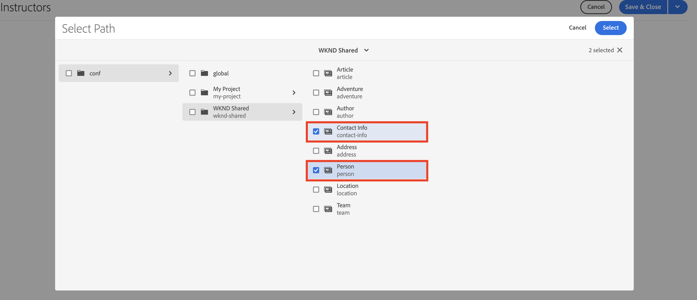
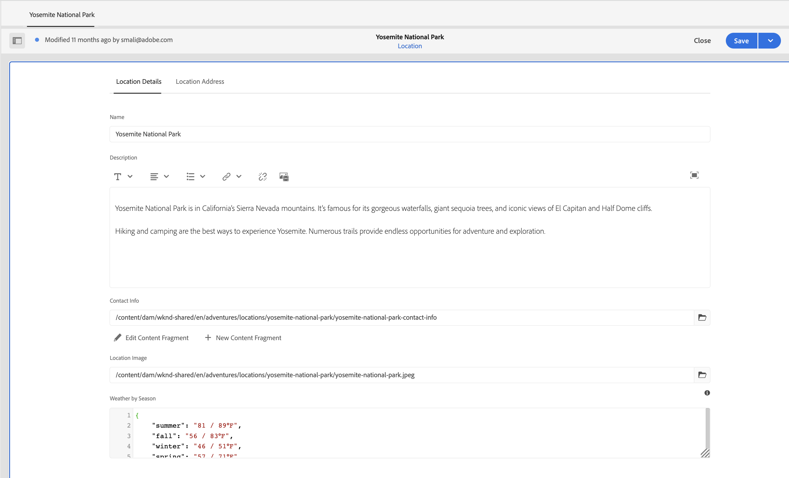
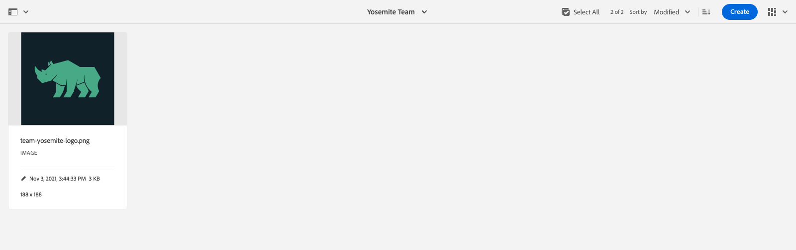

# 콘텐츠 조각 작성

다음에서 [이전 챕터](/help/headless-tutorial/graphql/advanced-graphql/create-content-fragment-models.md), 개인, 팀, 위치, 주소 및 연락처 정보의 5가지 콘텐츠 조각 모델을 만들었습니다. 이 장에서는 이러한 모델을 기반으로 콘텐츠 조각을 만드는 단계를 안내합니다. 또한 폴더에서 사용할 수 있는 콘텐츠 조각 모델을 제한하는 폴더 정책을 만드는 방법에 대해 살펴봅니다.

## 사전 요구 사항 {#prerequisites}

이 문서는 여러 부분으로 구성된 자습서의 일부입니다. 다음을 확인하십시오. [이전 챕터](create-content-fragment-models.md) 이(가) 이 장을 계속 진행하기 전에 완료되었습니다.

## 목표 {#objectives}

이 장에서는 다음 방법을 알아봅니다.

* 폴더 정책을 사용하여 폴더 만들기 및 제한 설정
* 콘텐츠 조각 편집기에서 직접 조각 참조 만들기
* Tab, Date 및 JSON Object 데이터 유형 사용
* 여러 줄 텍스트 편집기에 콘텐츠 및 조각 참조 삽입
* 여러 조각 참조 추가
* 콘텐츠 조각 중첩

## 샘플 콘텐츠 설치 {#sample-content}

자습서를 가속화하는 데 사용되는 여러 폴더 및 샘플 이미지가 포함된 AEM 패키지를 설치합니다.

1. 다운로드 [Advanced-GraphQL-Tutorial-Starter-Package-1.1.zip](/help/headless-tutorial/graphql/advanced-graphql/assets/tutorial-files/Advanced-GraphQL-Tutorial-Starter-Package-1.1.zip)
1. AEM에서 다음 위치로 이동합니다. **도구** > **배포** > **패키지** 액세스 **패키지 관리자**.
1. 이전 단계에서 다운로드한 패키지(zip 파일)를 업로드하고 설치합니다.

   

## 폴더 정책을 사용하여 폴더 만들기 및 제한 설정

AEM 홈페이지에서 을 선택합니다. **에셋** > **파일** > **WKND 공유** > **영어**. 여기에서 모험 및 기여자 등 다양한 콘텐츠 조각 범주를 볼 수 있습니다.

### 폴더 만들기 {#create-folders}

다음으로 이동 **모험** 폴더를 삭제합니다. 팀 및 위치 콘텐츠 조각을 저장하기 위해 팀 및 위치용 폴더가 이미 만들어져 있음을 볼 수 있습니다.

개인 콘텐츠 조각 모델을 기반으로 하는 강사 콘텐츠 조각에 대한 폴더를 만듭니다.

1. Adventures 페이지에서 을 선택합니다. **만들기** > **폴더** 오른쪽 상단 모서리입니다.

   

1. 표시되는 폴더 만들기 모달에서 **제목** 필드. 끝에 &#39;s&#39;가 있습니다. 많은 조각이 포함된 폴더의 제목은 plural이어야 합니다. **만들기**&#x200B;를 선택합니다.

   

   이제 Adventure Instructors를 저장하는 폴더를 만들었습니다.

### 폴더 정책을 사용하여 제한 설정

AEM에서는 콘텐츠 조각 폴더에 대한 권한 및 정책을 정의할 수 있습니다. 권한을 사용하면 특정 사용자(작성자) 또는 작성자 그룹에게만 특정 폴더에 대한 액세스 권한을 부여할 수 있습니다. 폴더 정책을 사용하면 콘텐츠 조각 모델 작성자가 해당 폴더에서 사용할 수 있는 항목을 제한할 수 있습니다. 이 예제에서는 폴더를 개인 및 연락처 정보 모델로 제한해 보겠습니다. 폴더 정책을 구성하려면:

1. 다음 항목 선택 **강사** 작성한 폴더를 선택한 다음 **속성** 을 클릭합니다.

   

1. 다음 항목 선택 **정책** 탭, 선택 취소 **/content/dam/wknd-shared에서 상속됨**. 다음에서 **경로에 의해 허용된 콘텐츠 조각 모델** 필드에서 폴더 아이콘을 선택합니다.

   

1. 열리는 경로 선택 대화 상자에서 경로를 따릅니다 **conf** > **WKND 공유**. 이전 장에서 만든 개인 콘텐츠 조각 모델에는 연락처 정보 콘텐츠 조각 모델에 대한 참조가 포함되어 있습니다. 강사 콘텐츠 조각을 생성하려면 개인 및 연락처 정보 모델이 강사 폴더에서 허용되어야 합니다. 선택 **개인** 및 **연락처 정보**, 그런 다음 누르기 **선택** 대화 상자를 닫습니다.

   

1. 선택 **저장 및 닫기** 및 선택 **확인** 표시되는 성공 대화 상자에서

1. 이제 강사 폴더에 대한 폴더 정책을 구성했습니다. 다음으로 이동 **강사** 폴더 및 선택 **만들기** > **컨텐츠 조각**. 이제 선택할 수 있는 유일한 모델은 **개인** 및 **연락처 정보**.

   

## 강사를 위한 콘텐츠 조각 작성

다음으로 이동 **강사** 폴더를 삭제합니다. 여기에서 강사의 연락처 정보를 저장할 중첩된 폴더를 생성해 보겠습니다.

다음에 대한 섹션에 설명된 단계를 수행합니다. [폴더 만들기](#create-folders) 을 클릭하여 &quot;연락처 정보&quot;라는 폴더를 만듭니다. 중첩 폴더는 상위 폴더의 폴더 정책을 상속합니다. 새로 만든 폴더만 연락처 정보 모델을 사용할 수 있도록 보다 구체적인 정책을 자유롭게 구성할 수 있습니다.

### 강사 콘텐츠 조각 만들기

어드벤처 강사 팀에 추가할 수 있는 4명의 사람을 만들어 보겠습니다.

1. 강사 폴더에서 개인 콘텐츠 조각 모델을 기반으로 콘텐츠 조각을 만들고 &quot;Jacob Wester&quot;라는 제목을 지정합니다.

   새로 만든 콘텐츠 조각은 다음과 같습니다.

   

1. 필드에 다음 컨텐츠를 입력합니다.

   * **전체 이름**: 제이콥 웨스터
   * **전기**: Jacob Wester는 10년 동안 하이킹 강사로 일해왔고 매 순간 사랑을 받아왔습니다! 제이콥은 암벽등반과 배낭여행에 재능이 있는 모험가이다. 야곱은 베이 볼더링 전투 등 클라이밍 대회의 우승자입니다. 제이콥은 현재 캘리포니아에 살고 있다.
   * **강사 경험 수준**: Expert
   * **스킬**: 암벽 등반, 서핑, 배낭 여행
   * **관리자 세부 정보**: 제이콥 웨스터는 3년 동안 배낭여행 계획을 조정해 왔다.

1. 다음에서 **프로필 사진** 필드, 이미지에 콘텐츠 참조를 추가합니다. 다음으로 이동 **WKND 공유** > **영어** > **참가자** > **jacob_wester.jpg** 를 클릭하여 이미지에 대한 경로를 만듭니다.

### 콘텐츠 조각 편집기에서 조각 참조 만들기 {#fragment-reference-from-editor}

AEM에서는 콘텐츠 조각 편집기에서 직접 조각 참조를 만들 수 있습니다. Jacob의 연락처 정보에 대한 참조를 만들어 보자.

1. 선택 **새 콘텐츠 조각** 아래 **연락처 정보** 필드.

   

1. 새 콘텐츠 조각 모달이 열립니다. 대상 선택 탭에서 경로를 따릅니다 **모험** > **강사** 옆에 있는 확인란을 선택합니다. **연락처 정보** 폴더를 삭제합니다. 선택 **다음** 속성 탭으로 이동합니다.

   

1. Properties 탭에서 &quot;Jacob Wester Contact Info&quot;를 입력합니다. **제목** 필드. 선택 **만들기**, 그런 다음 누르기 **열기** 표시되는 성공 대화 상자에서

   

   연락처 정보 콘텐츠 조각을 편집할 수 있는 새 필드가 나타납니다.

   

1. 필드에 다음 컨텐츠를 입력합니다.

   * **전화**: 209-888-0000
   * **이메일**: jwester@wknd.com

   완료되면 다음을 선택합니다. **저장**. 이제 연락처 정보 콘텐츠 조각을 만들었습니다.

1. 강사 콘텐츠 조각으로 돌아가려면 다음을 선택합니다. **제이컵 웨스터** 를 클릭합니다.

   

   다음 **연락처 정보** 이제 필드에는 참조된 연락처 정보 조각에 대한 경로가 포함됩니다. 중첩된 조각 참조입니다. 완료된 강사 콘텐츠 조각은 다음과 같습니다.

   

1. 선택 **저장 및 닫기** 컨텐츠 조각을 저장합니다. 이제 새로운 강사 콘텐츠 조각이 있습니다.

### 추가 조각 만들기

다음에 설명된 것과 동일한 프로세스를 수행합니다. [이전 섹션](#fragment-reference-from-editor) 강사를 위한 3개의 강사 콘텐츠 조각과 3개의 연락처 정보 콘텐츠 조각을 추가로 만듭니다. 강사 조각에 다음 콘텐츠를 추가합니다.

**스테이시 로웰스**

| 필드 | 값 |
| --- | --- |
| 컨텐츠 조각 제목 | 스테이시 로웰스 |
| 전체 이름 | 스테이시 로웰스 |
| 연락처 정보 | /content/dam/wknd-shared/en/adventures/instructors/contact-info/stacey-roflowers-contact-info |
| 프로필 사진 | /content/dam/wknd-shared/en/contributors/stacey-roswells.jpg |
| 전기 | 스테이시 로플로어스는 암벽 등반가이자 고산 모험가이다. 스테이시는 메릴랜드주 볼티모어에서 태어나 6남매 중 막내다. 스테이시의 아버지는 미 해군 중령이었고 어머니는 현대 무용 강사였다. 스테이시의 가족은 아버지의 당직 과제로 수시로 이사를 했고, 아버지가 태국에 주둔할 때 가장 먼저 사진을 찍었다. 이곳은 스테이시가 암벽등반을 배운 곳이기도 하다. |
| 강사 경험 수준 | 고급 |
| 기술 | 암벽 등반 | 스키 | 배낭 여행 |

**쿠마르 셀바라지**

| 필드 | 값 |
| --- | --- |
| 컨텐츠 조각 제목 | 쿠마르 셀바라지 |
| 전체 이름 | 쿠마르 셀바라지 |
| 연락처 정보 | /content/dam/wknd-shared/en/adventures/instructors/contact-info/kumar-selvaraj-contact-info |
| 프로필 사진 | /content/dam/wknd-shared/en/contributors/kumar-selvaraj.jpg |
| 전기 | Kumar Selvaraj는 AMGA 인증 전문 강사로 학생들의 등산 및 등산 능력 신장을 돕는 것이 주요 목표입니다. |
| 강사 경험 수준 | 고급 |
| 기술 | 암벽 등반 | 배낭 여행 |

**아요 오군세이데**

| 필드 | 값 |
| --- | --- |
| 컨텐츠 조각 제목 | 아요 오군세이데 |
| 전체 이름 | 아요 오군세이데 |
| 연락처 정보 | /content/dam/wknd-shared/en/adventures/instructors/contact-info/ayo-ogunseinde-contact-info |
| 프로필 사진 | /content/dam/wknd-shared/en/contributors/ayo-ogunseinde-237739.jpg |
| 전기 | Ayo Ogunseinde는 중앙 캘리포니아 Fresno에 사는 전문 등산가 겸 배낭 강사입니다. Ayo의 목표는 하이커들에게 가장 멋진 국립공원의 모험을 안내하는 것이다. |
| 강사 경험 수준 | 고급 |
| 기술 | 암벽 등반 | 사이클링 | 배낭 여행 |

나가기 **추가 정보** 필드가 비어 있습니다.

연락처 정보 조각에 다음 정보를 추가합니다.

| 컨텐츠 조각 제목 | 전화 | 이메일 |
| ------- | -------- | -------- |
| Stacey Roswells 연락처 정보 | 209-888-0011 | sroswells@wknd.com |
| Kumar Selvaraj 연락처 정보 | 209-888-0002 | kselvaraj@wknd.com |
| Ayo Ogunseinde 연락처 정보 | 209-888-0304 | aogunseinde@wknd.com |

이제 팀을 만들 준비가 되었습니다!

## 위치에 대한 콘텐츠 조각 작성

다음으로 이동 **위치** 폴더를 삭제합니다. 이곳에서는 이미 만들어진 2개의 중첩된 폴더를 볼 수 있습니다: 요세미티 국립공원(Yosemite National Park)과 요세미티 밸리 로지(Yosemite Valley Lodge).


지금은 요세미티 밸리 로지 폴더를 무시하십시오. 강사 팀의 홈 베이스 역할을 하는 위치를 만들 때 이 섹션의 뒷부분에서 다시 살펴봅니다.

다음으로 이동 **요세미티 국립공원** 폴더를 삭제합니다. 현재는 요세미티 국립공원의 그림만 수록되어 있다. 위치 콘텐츠 조각 모델을 사용하여 콘텐츠 조각을 만들고 제목을 &quot;Yosemite National Park&quot;로 정하겠습니다.

### 탭 자리 표시자

AEM에서는 탭 자리 표시자를 사용하여 다양한 유형의 콘텐츠를 그룹화하고 콘텐츠 조각을 보다 쉽게 읽고 관리할 수 있습니다. 이전 장에서는 위치 모델에 탭 자리 표시자를 추가했습니다. 따라서 이제 위치 콘텐츠 조각에는 두 개의 탭 섹션이 있습니다. **위치 세부 정보** 및 **위치 주소**.


다음 **위치 세부 정보** 탭에는 **이름**, **설명**, **연락처 정보**, **위치 이미지**, 및 **계절별 날씨** 필드, 반면에 **위치 주소** 탭에는 주소 콘텐츠 조각에 대한 참조가 포함되어 있습니다. 탭에는 채워야 하는 콘텐츠 유형이 명확하게 표시되므로 콘텐츠를 작성하는 것이 보다 쉽게 관리할 수 있습니다.

### JSON 개체 데이터 유형

다음 **계절별 날씨** 필드는 JSON 오브젝트 데이터 유형이며, 이는 JSON 형식의 데이터를 수락함을 의미합니다. 이 데이터 유형은 유연하며 콘텐츠에 포함할 모든 데이터에 사용할 수 있습니다.

필드의 오른쪽에 있는 정보 아이콘 위로 마우스를 가져가면 이전 장에서 만든 필드 설명을 볼 수 있습니다.


이 경우, 우리는 위치에 대한 평균 날씨를 제공할 필요가 있습니다. 다음 데이터를 입력합니다.

```json
{
    "summer": "81 / 89°F",
    "fall": "56 / 83°F",
    "winter": "46 / 51°F",
    "spring": "57 / 71°F"
}
```

다음 **계절별 날씨** 이제 필드가 다음과 같이 표시됩니다.


### 콘텐츠 추가

다음 장에서 GraphQL을 사용하여 정보를 쿼리하기 위해 위치 콘텐츠 조각에 나머지 콘텐츠를 추가하겠습니다.

1. 다음에서 **위치 세부 정보** 탭에서 필드에 다음 정보를 입력합니다.

   * **이름**: 요세미티 국립공원
   * **설명**: 요세미티 국립 공원은 캘리포니아 시에라 네바다 산맥 내에 있습니다. 아름다운 폭포와 거대한 세쿼이아 나무, 그리고 엘 카피탄과 하프 돔 절벽의 상징적인 전망으로 유명합니다. 하이킹과 캠핑은 요세미티를 경험하는 가장 좋은 방법입니다. 수많은 산책로는 모험과 탐험을 위한 무한한 기회를 제공합니다.

1. 다음에서 **연락처 정보** 필드에서는 연락처 정보 모델을 기반으로 콘텐츠 조각을 만들고 제목을 &quot;Yosemite National Park Contact Info&quot;로 지정합니다. 의 이전 섹션에 설명된 것과 동일한 프로세스를 따릅니다. [편집기에서 조각 참조 만들기](#fragment-reference-from-editor) 필드에 다음 데이터를 입력합니다.

   * **전화**: 209-999-0000
   * **이메일**: yosemite@wknd.com

1. 다음에서 **위치 이미지** 필드, 다음으로 이동 **모험** > **위치** > **요세미티 국립공원** > **요세미티-내셔널-파크.jpeg** 를 클릭하여 이미지에 대한 경로를 만듭니다.

   이전 장에서 이미지 유효성 검사를 구성했으므로 위치 이미지의 크기는 2560 x 1800 미만이어야 하며 파일 크기는 3MB 미만이어야 합니다.

1. 모든 정보가 추가되면 **위치 세부 정보** 이제 tab은 다음과 같이 표시됩니다.

   

1. 다음으로 이동 **위치 주소** 탭. 다음에서 **주소** 필드에서는 이전 장에서 만든 주소 콘텐츠 조각 모델을 사용하여 &quot;요세미티 국립공원 주소&quot;라는 콘텐츠 조각을 만듭니다. 다음에 대한 섹션에 설명된 것과 동일한 프로세스를 따릅니다. [편집기에서 조각 참조 만들기](#fragment-reference-from-editor) 필드에 다음 데이터를 입력합니다.

   * **상세 주소**: 9010 카레 빌리지 드라이브
   * **도시**: 요세미티 밸리
   * **시/도**: CA
   * **우편 번호**: 95389
   * **국가**: 미국

1. 완료됨 **위치 주소** 요세미티 국립공원 조각의 탭은 다음과 같습니다.

   

1. **저장 후 닫기**&#x200B;를 선택합니다.

### 하나 이상의 조각 만들기

1. 다음으로 이동 **요세미티 밸리 로지** 폴더를 삭제합니다. 위치 콘텐츠 조각 모델을 사용하여 콘텐츠 조각을 만들고 제목을 &quot;Yosemite Valley Lodge&quot;로 지정합니다.

1. 다음에서 **위치 세부 정보** 탭에서 필드에 다음 정보를 입력합니다.

   * **이름**: 요세미티 밸리 로지
   * **설명**: Yosemite Valley Lodge는 단체 회의 및 쇼핑, 식사, 낚시, 하이킹 등 다양한 활동을 위한 중심지입니다.

1. 다음에서 **연락처 정보** 필드에서는 연락처 정보 모델을 기반으로 콘텐츠 조각을 만들고 제목을 &quot;Yosemite Valley Lodge 연락처 정보&quot;로 지정합니다. 다음에 대한 섹션에 설명된 것과 동일한 프로세스를 따릅니다. [편집기에서 조각 참조 만들기](#fragment-reference-from-editor) 새 콘텐츠 조각의 필드에 다음 데이터를 입력합니다.

   * **전화**: 209-992-0000
   * **이메일**: yosemitelodge@wknd.com

   새로 만든 콘텐츠 조각을 저장합니다.

1. 다음으로 돌아가기 **요세미티 밸리 로지** 로 이동 **위치 주소** 탭. 다음에서 **주소** 필드에서는 이전 장에서 만든 주소 콘텐츠 조각 모델을 사용하여 &quot;Yosemite Valley Lodge Address&quot;라는 콘텐츠 조각을 만듭니다. 다음에 대한 섹션에 설명된 것과 동일한 프로세스를 따릅니다. [편집기에서 조각 참조 만들기](#fragment-reference-from-editor) 필드에 다음 데이터를 입력합니다.

   * **상세 주소**: 9006 요세미티 로지 드라이브
   * **도시**: 요세미티 국립공원
   * **시/도**: CA
   * **우편 번호**: 95389
   * **국가**: 미국

   새로 만든 콘텐츠 조각을 저장합니다.

1. 다음으로 돌아가기 **요세미티 밸리 로지**&#x200B;을 선택한 다음 을 선택합니다. **저장 및 닫기**. 다음 **요세미티 밸리 로지** 폴더에는 이제 Yosemite Valley Lodge, Yosemite Valley Lodge 연락처 정보 및 Yosemite Valley Lodge 주소의 세 가지 콘텐츠 조각이 포함됩니다.

   

## 팀 콘텐츠 조각 작성

폴더 찾아보기 **팀** > **요세미티 팀**. 요세미티 팀 폴더에는 현재 팀 로고만 포함되어 있습니다.



팀 콘텐츠 조각 모델을 사용하여 콘텐츠 조각을 만들고 제목을 &quot;Yosemite 팀&quot;으로 정하겠습니다.

### 여러 줄 텍스트 편집기의 컨텐츠 및 조각 참조

AEM에서는 콘텐츠 및 조각 참조를 여러 줄 텍스트 편집기에 바로 추가하고 나중에 GraphQL 쿼리를 사용하여 검색할 수 있습니다. 콘텐츠 및 조각 참조를 모두 **설명** 필드.

1. 먼저 다음 텍스트를 **설명** 분야: &quot;요세미티 국립공원에서 일하는 전문 모험가 및 하이킹 강사 팀&quot;

1. 콘텐츠 참조를 추가하려면 **자산 삽입** 아이콘을 클릭합니다.

   

1. 표시되는 모달에서 다음을 선택합니다. **team-yosemite-logo.png** 및 누르기 **선택**.

   

   이제 콘텐츠 참조가 **설명** 필드.

이전 장에서는 조각 참조를 다음 위치에 추가할 수 있도록 했습니다. **설명** 필드. 여기에 하나 추가하겠습니다.

1. 다음 항목 선택 **콘텐츠 조각 삽입** 아이콘을 클릭합니다.

   

1. 다음으로 이동 **WKND 공유** > **영어** > **모험** > **위치** > **요세미티 밸리 로지** > **요세미티 밸리 로지**. 누르기 **선택** 컨텐츠 조각을 삽입합니다.

   

   다음 **설명** 이제 필드가 다음과 같이 표시됩니다.

   

이제 콘텐츠 및 조각 참조를 여러 줄 텍스트 편집기에 바로 추가했습니다.

### 날짜 및 시간 데이터 유형

날짜 및 시간 데이터 유형을 살펴보겠습니다. 다음 항목 선택 **캘린더** 아이콘(오른쪽) **팀 창립일** 달력 보기를 열 필드입니다.


과거 또는 미래 날짜는 해당 월의 양쪽에 있는 앞/뒤 화살표를 사용하여 설정할 수 있습니다. 요세미티 팀이 2016년 5월 24일에 창단되었다고 가정해 보겠습니다. 그럼 그 날짜를 정하겠습니다.

### 여러 조각 참조 추가

팀 멤버 조각 참조에 강사를 추가하겠습니다.

1. 선택 **추가** 다음에서 **팀원** 필드.

   

1. 표시되는 새 필드에서 폴더 아이콘을 선택하여 경로 선택 모달을 엽니다. 폴더 검색 대상 **WKND 공유** > **영어** > **모험** > **강사**&#x200B;을 클릭한 다음 옆에 있는 확인란을 선택합니다 **제이콥 웨스터**. 누르기 **선택** 을 클릭하여 경로를 저장합니다.

   

1. 다음 항목 선택 **추가** 단추를 세 번 더 누릅니다. 새 필드를 사용하여 나머지 강사 3명을 팀에 추가합니다. 다음 **팀원** 이제 필드가 다음과 같이 표시됩니다.

   

1. 선택 **저장 및 닫기** 팀 콘텐츠 조각을 저장합니다.

### 어드벤처 콘텐츠 조각에 조각 참조 추가

마지막으로 새로 만든 콘텐츠 조각을 모험에 추가하겠습니다.

1. 다음으로 이동 **모험** > **요세미티 백패킹** 그리고 Yosemite Backpacking Content Fragment 를 엽니다. 양식 맨 아래에 이전 장에서 만든 세 개의 필드가 표시됩니다. **위치**, **강사 팀**, 및 **관리자**.

1. 에 조각 참조 추가 **위치** 필드. 위치 경로는 사용자가 만든 요세미티 국립공원 콘텐츠 조각을 참조해야 합니다. `/content/dam/wknd-shared/en/adventures/locations/yosemite-national-park/yosemite-national-park`.

1. 에 조각 참조 추가 **강사 팀** 필드. 팀 경로는 사용자가 만든 Yosemite 팀 콘텐츠 조각을 참조해야 합니다. `/content/dam/wknd-shared/en/adventures/teams/yosemite-team/yosemite-team`. 중첩된 조각 참조입니다. 팀 콘텐츠 조각에는 연락처 정보 및 주소 모델을 참조하는 개인 모델에 대한 참조가 포함됩니다. 따라서 콘텐츠 조각이 세 수준 아래에 중첩됩니다.

1. 에 조각 참조 추가 **관리자** 필드. 제이콥 웨스터가 요세미티 배낭여행 어드벤처의 관리자라고 가정해 보겠습니다. 경로는 Jacob Wester 콘텐츠 조각으로 이어져야 하며 다음과 같이 표시됩니다. `/content/dam/wknd-shared/en/adventures/instructors/jacob-wester`.

1. 이제 3개의 조각 참조를 어드벤처 콘텐츠 조각에 추가했습니다. 필드는 다음과 같습니다.

   

1. 선택 **저장 및 닫기** 컨텐츠를 저장합니다.

## 축하합니다!

축하합니다! 이제 이전 장에서 만든 고급 콘텐츠 조각 모델을 기반으로 콘텐츠 조각을 만들었습니다. 또한 폴더 내에서 선택할 수 있는 콘텐츠 조각 모델을 제한하는 폴더 정책을 생성했습니다.

## 다음 단계

다음에서 [다음 장](/help/headless-tutorial/graphql/advanced-graphql/explore-graphql-api.md), GraphiQL IDE(통합 개발 환경)를 사용하여 고급 GraphQL 쿼리를 전송하는 방법에 대해 알아봅니다. 이러한 쿼리를 사용하면 이 장에서 만든 데이터를 볼 수 있으며 결국 이러한 쿼리를 WKND 앱에 추가할 수 있습니다.
