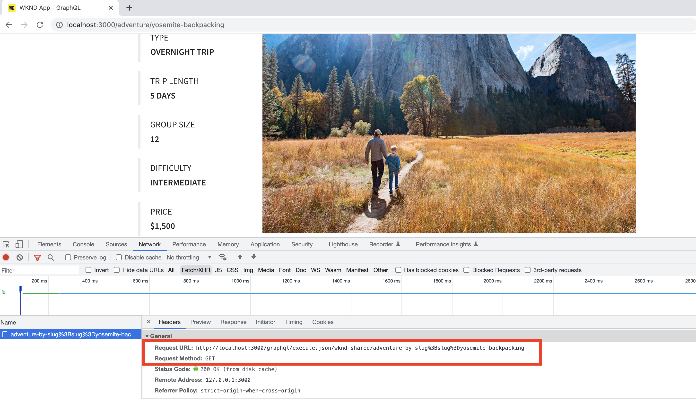

# 클라이언트 애플리케이션 통합

이전 장에서는 GraphiQL 탐색기를 사용하여 지속 쿼리를 만들고 업데이트했습니다.

이 장에서는 기존 **React 구성 요소** 내에서 HTTP GET 요청을 사용하여 지속 쿼리를 WKND 클라이언트 응용 프로그램(즉, WKND 앱)과 통합하는 단계를 안내합니다. 또한 AEM Headless 학습을 적용하고 WKND 클라이언트 애플리케이션을 향상시키기 위한 코딩 전문 지식을 적용하는 선택적 과제를 제공합니다.

## 사전 요구 사항 {#prerequisites}

이 문서는 여러 부분으로 구성된 자습서의 일부입니다. 이 장을 진행하기 전에 이전 장이 완료되었는지 확인하십시오. WKND 클라이언트 응용 프로그램이 AEM 게시 서비스에 연결되므로 **다음 항목을 AEM 게시 서비스에 게시했습니다**.

* 프로젝트 구성
* GraphQL 엔드포인트
* 콘텐츠 조각 모델
* 작성된 콘텐츠 조각
* GraphQL 지속 쿼리

이 장의 _IDE 스크린샷은 [Visual Studio Code](https://code.visualstudio.com/)_&#x200B;에서 가져옵니다.

### 1장-4 솔루션 패키지(선택 사항) {#solution-package}

1-4장에 대한 AEM UI의 단계를 완료하는 솔루션 패키지를 설치할 수 있습니다. 이전 챕터가 완료된 경우 이 패키지가 **필요하지 않습니다**.

1. [Advanced-GraphQL-Tutorial-Solution-Package-1.2.zip](/help/headless-tutorial/graphql/advanced-graphql/assets/tutorial-files/Advanced-GraphQL-Tutorial-Solution-Package-1.2.zip)을 다운로드합니다.
1. AEM에서 **도구** > **배포** > **패키지**(으)로 이동하여 **패키지 관리자**&#x200B;에 액세스합니다.
1. 이전 단계에서 다운로드한 패키지(zip 파일)를 업로드하고 설치합니다.
1. 패키지를 AEM Publish 서비스로 복제

## 목표 {#objectives}

이 자습서에서는 [GraphQL용 AEM Headless 클라이언트](https://github.com/adobe/aem-headless-client-js)를 사용하여 지속 쿼리에 대한 요청을 샘플 WKND JavaScript React 앱에 통합하는 방법을 알아봅니다.

## 샘플 클라이언트 애플리케이션 복제 및 실행 {#clone-client-app}

자습서를 가속화하기 위해 스타터 React JS 앱이 제공됩니다.

1. [adobe/aem-guides-wknd-graphql](https://github.com/adobe/aem-guides-wknd-graphql) 리포지토리 복제:

   ```shell
   $ git clone git@github.com:adobe/aem-guides-wknd-graphql.git
   ```

1. `aem-guides-wknd-graphql/advanced-tutorial/.env.development` 파일을 편집하고 대상 AEM 게시 서비스를 가리키도록 `REACT_APP_HOST_URI`을(를) 설정합니다.

   작성자 인스턴스에 연결하는 경우 인증 방법을 업데이트합니다.

   ```plain
   # Server namespace
   REACT_APP_HOST_URI=https://publish-pxx-eyy.adobeaemcloud.com
   
   #AUTH (Choose one method)
   # Authentication methods: 'service-token', 'dev-token', 'basic' or leave blank to use no authentication
   REACT_APP_AUTH_METHOD=
   
   # For Bearer auth, use DEV token (dev-token) from Cloud console
   REACT_APP_DEV_TOKEN=
   
   # For Service toke auth, provide path to service token file (download file from Cloud console)
   REACT_APP_SERVICE_TOKEN=auth/service-token.json
   
   # For Basic auth, use AEM ['user','pass'] pair (eg for Local AEM Author instance)
   REACT_APP_BASIC_AUTH_USER=
   REACT_APP_BASIC_AUTH_PASS=
   ```

   


   >[!NOTE]
   > 
   > 위의 지침은 React 앱을 **AEM Publish 서비스**&#x200B;에 연결하는 것이지만, **AEM 작성자 서비스**&#x200B;에 연결하여 대상 AEM as a Cloud Service 환경에 대한 로컬 개발 토큰을 얻는 것입니다.
   >
   > 기본 인증을 사용하여 AEMaaCS SDK](/help/headless-tutorial/graphql/quick-setup/local-sdk.md)를 사용하여 [로컬 작성자 인스턴스에 앱을 연결할 수도 있습니다.


1. 터미널을 열고 다음 명령을 실행합니다.

   ```shell
   $ cd aem-guides-wknd-graphql/advanced-tutorial
   $ npm install
   $ npm start
   ```

1. 새 브라우저 창을 [http://localhost:3000](http://localhost:3000)에 로드해야 합니다.


1. **캠핑** > **요세미티 백패킹**&#x200B;을 탭하여 요세미티 백패킹 모험 세부 정보를 보십시오.

   

1. 브라우저의 개발자 도구를 열고 `XHR` 요청을 검사합니다.

   

   프로젝트 구성 이름(`wknd-shared`), 지속 쿼리 이름(`adventure-by-slug`), 변수 이름(`slug`), 값(`yosemite-backpacking`) 및 특수 문자 인코딩을 사용하여 GraphQL 끝점에 대한 `GET`개의 요청이 표시됩니다.

>[!IMPORTANT]
>
>    GraphQL API 요청이 AEM Publish 서비스 도메인이 아닌 `http://localhost:3000`에 대해 수행되는 이유가 궁금한 경우 기본 자습서에서 [Under The Hood](../multi-step/graphql-and-react-app.md#under-the-hood)을(를) 검토하십시오.


## 코드 검토

[기본 자습서 - AEM의 GraphQL API를 사용하는 React 앱을 빌드합니다](https://experienceleague.adobe.com/docs/experience-manager-learn/getting-started-with-aem-headless/graphql/multi-step/graphql-and-react-app.html#review-the-aemheadless-object) 단계에서는 전문 지식을 얻기 위해 몇 가지 주요 파일을 검토하고 개선했습니다. WKND 앱을 개선하기 전에 주요 파일을 검토하십시오.

* [AEMHeadless 개체 검토](https://experienceleague.adobe.com/docs/experience-manager-learn/getting-started-with-aem-headless/graphql/multi-step/graphql-and-react-app.html#review-the-aemheadless-object)

* [AEM GraphQL 지속 쿼리를 실행하도록 구현](https://experienceleague.adobe.com/docs/experience-manager-learn/getting-started-with-aem-headless/graphql/multi-step/graphql-and-react-app.html#implement-to-run-aem-graphql-persisted-queries)

### `Adventures` React 구성 요소 검토

WKND React 앱의 기본 보기는 모든 모험 목록이며 _캠핑, 사이클링_&#x200B;과 같은 활동 유형에 따라 이러한 모험을 필터링할 수 있습니다. 이 보기는 `Adventures` 구성 요소에 의해 렌더링됩니다. 다음은 주요 구현 세부 사항입니다.

* `src/components/Adventures.js`이(가) `useAllAdventures(adventureActivity)` 후크를 호출하는데 `adventureActivity` 인수는 활동 형식입니다.

* `useAllAdventures(adventureActivity)` 후크가 `src/api/usePersistedQueries.js` 파일에 정의되어 있습니다. `adventureActivity` 값을 기반으로 호출할 지속 쿼리를 결정합니다. null 값이 아니면 `wknd-shared/adventures-by-activity`을(를) 호출하고 `wknd-shared/adventures-all` 사용 가능한 모든 모험 값을 가져옵니다.

* 후크는 `aemHeadlessClient.js`을(를) 통해 쿼리 실행을 `AEMHeadless`에게 위임하는 기본 `fetchPersistedQuery(..)` 함수를 사용합니다.

* 또한 후크는 `response.data?.adventureList?.items`에 있는 AEM GraphQL 응답의 관련 데이터만 반환하여 `Adventures` React 보기 구성 요소가 상위 JSON 구조를 인식하지 못하도록 합니다.

* 쿼리가 성공적으로 실행되면 `Adventures.js`의 `AdventureListItem(..)` 렌더링 함수가 HTML 요소를 추가하여 _이미지, 이동 길이, 가격 및 제목_ 정보를 표시합니다.

### `AdventureDetail` React 구성 요소 검토

`AdventureDetail` React 구성 요소는 모험의 세부 정보를 렌더링합니다. 다음은 주요 구현 세부 사항입니다.

* `src/components/AdventureDetail.js`이(가) `useAdventureBySlug(slug)` 후크를 호출하며 여기서 `slug` 인수는 쿼리 매개 변수입니다.

* 위와 같이 `useAdventureBySlug(slug)` 후크는 `src/api/usePersistedQueries.js` 파일에 정의되어 있습니다. `aemHeadlessClient.js`을(를) 통해 `AEMHeadless`에 위임하여 `wknd-shared/adventure-by-slug` 지속 쿼리를 호출합니다.

* 쿼리 실행에 성공하면 `AdventureDetail.js`의 `AdventureDetailRender(..)` 렌더링 함수가 HTML 요소를 추가하여 모험의 세부 정보를 표시합니다.


## 코드 개선

### `adventure-details-by-slug` 지속 쿼리 사용

이전 장에서는 `adventure-details-by-slug` 지속 쿼리를 만들었는데, 이 쿼리는 _위치, instructorTeam 및 administrator_&#x200B;와 같은 추가 모험 정보를 제공합니다. 이 추가 정보를 렌더링하기 위해 `adventure-by-slug`을(를) `adventure-details-by-slug` 지속 쿼리로 바꾸겠습니다.

1. `src/api/usePersistedQueries.js` 열기

1. `useAdventureBySlug()` 함수를 찾고 쿼리를 다음으로 업데이트하십시오.

```javascript
 ...

 // Call the AEM GraphQL persisted query named "wknd-shared/adventure-details-by-slug" with parameters
 response = await fetchPersistedQuery(
 "wknd-shared/adventure-details-by-slug",
 queryParameters
 );

 ...
```

### 추가 정보 표시

1. 추가 모험 정보를 표시하려면 `src/components/AdventureDetail.js`을(를) 여세요.

1. 함수 `AdventureDetailRender(..)`을(를) 찾고 반환 함수를 다음으로 업데이트하십시오.

   ```javascript
   ...
   
   return (<>
       <h1 className="adventure-detail-title">{title}</h1>
       <div className="adventure-detail-info">
   
           <LocationInfo {...location} />
   
           ...
   
           <Location {...location} />
   
           <Administrator {...administrator} />
   
           <InstructorTeam {...instructorTeam} />
   
       </div>
   </>); 
   
   ...
   ```

1. 해당 렌더링 함수도 정의합니다.

   **위치 정보**

   ```javascript
   function LocationInfo({name}) {
   
       if (!name) {
           return null;
       }
   
       return (
           <>
               <div className="adventure-detail-info-label">Location</div>
               <div className="adventure-detail-info-description">{name}</div>
           </>
       );
   
   }
   ```

   **위치**

   ```javascript
   function Location({ contactInfo }) {
   
       if (!contactInfo) {
           return null;
       }
   
       return (
           <>
               <div className='adventure-detail-location'>
                   <h2>Where we meet</h2>
                   <hr />
                   <div className="adventure-detail-addtional-info">Phone:{contactInfo.phone}</div>
                   <div className="adventure-detail-addtional-info">Email:{contactInfo.email}</div>
               </div>
           </>);
   }
   ```

   **강사 팀**

   ```javascript
   function InstructorTeam({ _metadata }) {
   
       if (!_metadata) {
           return null;
       }
   
       return (
           <>
               <div className='adventure-detail-team'>
                   <h2>Instruction Team</h2>
                   <hr />
                   <div className="adventure-detail-addtional-info">Team Name: {_metadata.stringMetadata[0].value}</div>
               </div>
           </>);
   }
   ```

   **관리자**

   ```javascript
   function Administrator({ fullName, contactInfo }) {
   
       if (!fullName || !contactInfo) {
           return null;
       }
   
       return (
           <>
               <div className='adventure-detail-administrator'>
                   <h2>Administrator</h2>
                   <hr />
                   <div className="adventure-detail-addtional-info">Name: {fullName}</div>
                   <div className="adventure-detail-addtional-info">Phone: {contactInfo.phone}</div>
                   <div className="adventure-detail-addtional-info">Email: {contactInfo.email}</div>
               </div>
           </>);
   }
   ```

### 새 스타일 정의

1. `src/components/AdventureDetail.scss`을(를) 열고 다음 클래스 정의를 추가하십시오.

   ```CSS
   .adventure-detail-administrator,
   .adventure-detail-team,
   .adventure-detail-location {
   margin-top: 1em;
   width: 100%;
   float: right;
   }
   
   .adventure-detail-addtional-info {
   padding: 10px 0px 5px 0px;
   text-transform: uppercase;
   }
   ```

>[!TIP]
>
>업데이트된 파일은 **AEM Guides WKND - GraphQL** 프로젝트에서 사용할 수 있습니다. [고급 자습서](https://github.com/adobe/aem-guides-wknd-graphql/tree/main/advanced-tutorial) 섹션을 참조하십시오.


위의 개선 사항을 완료한 후 WKND 앱은 아래와 같으며 브라우저의 개발자 도구에 `adventure-details-by-slug` 지속 쿼리 호출이 표시됩니다.


## 개선 과제(선택 사항)

WKND React 앱의 기본 보기를 사용하면 _캠핑, 사이클링_&#x200B;과 같은 활동 유형에 따라 이러한 모험을 필터링할 수 있습니다. 그러나 WKND 비즈니스 팀에서 추가 _위치_ 기반 필터링 기능을 사용하려고 합니다. 요구 사항은 다음과 같습니다.

* WKND 앱의 기본 보기의 왼쪽 상단 또는 오른쪽 상단에서 _위치_ 필터링 아이콘을 추가합니다.
* _위치_ 필터링 아이콘을 클릭하면 위치 목록이 표시됩니다.
* 목록에서 원하는 위치 옵션을 클릭하면 일치하는 모험만 표시됩니다.
* 일치하는 Adventure가 하나만 있으면 Adventure Details 보기가 표시됩니다.

## 축하합니다.

축하합니다! 이제 통합 및 샘플 WKND 앱에 지속 쿼리 구현을 완료했습니다.
