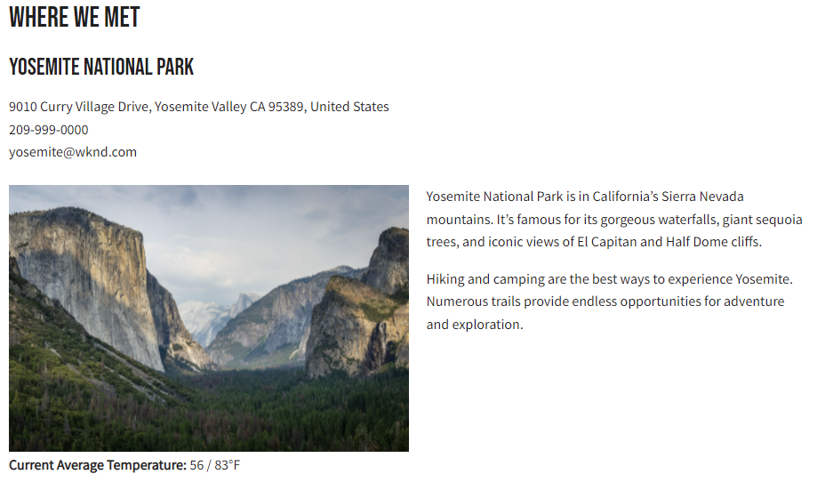

# 클라이언트 애플리케이션 통합

이전 장에서는 HTTP PUT 및 POST 요청을 사용하여 지속적인 쿼리를 만들고 업데이트했습니다.

이 장에서는 5개의 React 구성 요소 내에서 HTTP GET 요청을 사용하여 이러한 지속된 쿼리를 WKND 앱과 통합하는 단계를 안내합니다.

* 위치
* 주소
* 강사
* 관리자
* 팀

## 사전 요구 사항 {#prerequisites}

이 문서는 여러 부분으로 구성된 자습서의 일부입니다. 이 장을 진행하기 전에 이전 장이 완료되었는지 확인하십시오. 완료 [기본 자습서](/help/headless-tutorial/graphql/multi-step/overview.md) 이 권장됩니다.

_이 장의 IDE 스크린샷은 [Visual Studio 코드](https://code.visualstudio.com/)_

### 제1장의4 솔루션 패키지(선택 사항) {#solution-package}

1-4장에 대해 AEM UI의 단계를 완료하는 솔루션 패키지를 설치할 수 있습니다. 이 패키지는 **필요하지 않음** 이전 장이 완료된 경우

1. 다운로드 [Advanced-GraphQL-Tutorial-Solution-Package-1.1.zip](/help/headless-tutorial/graphql/advanced-graphql/assets/tutorial-files/Advanced-GraphQL-Tutorial-Solution-Package-1.1.zip).
1. AEM에서 **도구** > **배포** > **패키지** 액세스 권한 **패키지 관리자**.
1. 이전 단계에서 다운로드한 패키지(zip 파일)를 업로드하고 설치합니다.

## 목표 {#objectives}

이 자습서에서는 AEM 헤드리스 JavaScript를 사용하여 지속된 쿼리에 대한 요청을 샘플 WKND GraphQl React 앱에 통합하는 방법을 알아봅니다 [SDK](https://github.com/adobe/aem-headless-client-js).

## 샘플 클라이언트 응용 프로그램 설치 및 실행 {#install-client-app}

자습서를 가속화하기 위해 시작 React JS 앱이 제공됩니다.

>[!NOTE]
> 
> 다음은 React 앱을 **작성자** AEM as a Cloud Service 환경 [로컬 개발 액세스 토큰](/help/headless-tutorial/authentication/local-development-access-token.md). 앱에 [aemAaCS SDK를 사용한 로컬 작성자 인스턴스](/help/headless-tutorial/graphql/quick-setup/local-sdk.md) 기본 인증 사용.

1. 다운로드 **[aem-guides-wknd-headless-start-tutorial.zip](/help/headless-tutorial/graphql/advanced-graphql/assets/tutorial-files/aem-guides-wknd-headless-start-tutorial.zip)**.
1. 파일의 압축을 풀고 IDE에서 프로젝트를 엽니다.
1. 획득 [로컬 개발 토큰](/help/headless-tutorial/authentication/local-development-access-token.md) target AEM 환경용.
1. 프로젝트에서 파일을 엽니다 `.env.development`.
   1. 설정 `REACT_APP_DEV_TOKEN` 다음과 같음 `accessToken` 로컬 개발 토큰의 값입니다. (전체 JSON 파일이 아님)
   1. 설정 `REACT_APP_HOST_URI` AEM의 url로 **작성자** 환경.

   
1. 새 터미널을 열고 프로젝트 폴더로 이동합니다. 다음 명령을 실행합니다.

   ```shell
   $ npm install
   $ npm start
   ```

1. 새 브라우저는 다음에 열립니다. `http://localhost:3000/aem-guides-wknd-pwa`.
1. 탭 **캠핑** > **요세미티 백패킹** 요세미티 백패킹 어드벤처 상세 정보를 보려면

   

1. 브라우저의 개발자 도구를 열고 를 검사합니다. `XHR` 요청

   

   다음 항목이 표시됩니다. `POST` GraphQL 종단점에 연결할 수 있습니다. 보기 `Payload`전송된 전체 GraphQL 쿼리를 볼 수 있습니다. 다음 섹션에서 앱을 사용하도록 업데이트했습니다 **지속형** 쿼리


## 시작하기

기본 자습서에서는 매개 변수가 있는 GraphQl 쿼리를 사용하여 단일 컨텐츠 조각을 요청하고 모험 세부 사항을 렌더링합니다. 다음으로, `adventureDetailQuery` 새 필드를 포함하고 이전 장에서 생성된 지속적인 쿼리를 사용하려면

5개의 구성 요소가 만들어집니다.

| React 구성 요소 | 위치 |
|-------|------|
| 관리자 | `src/components/Administrator.js` |
| 팀 | `src/components/Team.js` |
| 위치 | `src/components/Location.js` |
| 강사 | `src/components/Instructors.js` |
| 주소 | `src/components/Address.js` |

## useGraphQL 후크 업데이트

사용자 지정 [반응 효과 후크](https://reactjs.org/docs/hooks-overview.html#effect-hook) 앱 변경 사항을 수신하는 가 생성되었습니다. `query`및 가 변경되면 AEM GraphQL 엔드포인트에 HTTP POST 요청을 수행하고 앱에 JSON 응답을 반환합니다.

사용할 새 후크 만들기 **지속형** 쿼리 그런 다음 이 앱에서는 Adventure 세부 정보에 대한 HTTP GET 요청을 수행할 수 있습니다. 다음 `runPersistedQuery` 의 [AEM Headless Client SDK](https://github.com/adobe/aem-headless-client-js) 은 지속되는 쿼리를 더 쉽게 실행할 수 있도록 하는 데 사용됩니다.

1. 파일을 엽니다. `src/api/useGraphQL.js`
1. 새 후크 추가 `useGraphQLPersisted`:

   ```javascript
   /**
   * Custom React Hook to perform a GraphQL query to a persisted query endpoint
   * @param persistedPath - the short path to the persisted query
   * @param fragmentPathParam - optional parameters object that can be passed in for parameterized persistent queries
   */
   export function useGraphQLPersisted(persistedPath, fragmentPathVariable) {
       let [data, setData] = useState(null);
       let [errors, setErrors] = useState(null);
   
       useEffect(() => {
           let queryVariables = {};
   
           // we pass in a primitive fragmentPathVariable (String) and then construct the object {fragmentPath: fragmentPathParam} to pass as query params to the persisted query
           // It is simpler to pass a primitive into a React hooks, as comparing the state of a dependent object can be difficult. see https://reactjs.org/docs/hooks-faq.html#can-i-skip-an-effect-on-updates
           if(fragmentPathVariable) {
               queryVariables = {fragmentPath: fragmentPathVariable};
           }
   
           // execute a persisted query using the given path and pass in variables (if needed)
           sdk.runPersistedQuery(persistedPath, queryVariables)
               .then(({ data, errors }) => {
               if (errors) setErrors(mapErrors(errors));
               if (data) setData(data);
           })
           .catch((error) => {
           setErrors(error);
           });
   }, [persistedPath, fragmentPathVariable]);
   
   return { data, errors }
   }
   ```
1. 파일에 변경 사항을 저장합니다.

## Adventure Details 구성 요소 업데이트

파일 `src/api/queries.js` 응용 프로그램을 구동하는 데 사용되는 GraphQL 쿼리를 포함합니다 `adventureDetailQuery` 표준 POST GraphQL 요청을 사용하여 개별 모험에 대한 세부 사항을 반환합니다. 다음으로, `AdventureDetail` 지속형 구성 요소를 사용할 수 있습니다 `wknd/all-adventure-details` 쿼리를 클릭합니다.

1. 열기 `src/screens/AdventureDetail.js`.
1. 먼저 다음 줄에 주석을 답니다.

   ```javascript
   export default function AdventureDetail() {
   
       ...
   
       //const { data, errors } = useGraphQL(adventureDetailQuery(adventureFragmentPath));
   ```

   위의 에서는 표준 GraphQL POST을 사용하여 `adventureFragmentPath`

1. 를 사용하려면 `useGraphQLPersisted` 후크, 다음 줄을 추가합니다.

   ```javascript
   export default function AdventureDetail() {
   
      //const { data, errors } = useGraphQL(adventureDetailQuery(adventureFragmentPath));
       const {data, errors} = useGraphQLPersisted("wknd/all-adventure-details", adventureFragmentPath);
   ```

   경로를 관찰합니다 `wknd/all-adventure-details` 는 이전 장에서 만든 지속된 쿼리의 경로입니다.

   >[!CAUTION]
   >
   > 업데이트된 쿼리가 `wknd/all-adventure-details` 는 target AEM 환경에서 지속되어야 합니다. 의 단계를 검토하십시오 [지속된 GraphQL 쿼리](/help/headless-tutorial/graphql/advanced-graphql/graphql-persisted-queries.md#cache-control-all-adventures) 또는 설치 [AEM 솔루션 패키지](/help/headless-tutorial/graphql/advanced-graphql/assets/tutorial-files/Advanced-GraphQL-Tutorial-Solution-Package-1.1.zip)

1. 브라우저에서 실행 중인 앱으로 돌아가서 로 이동한 후 브라우저의 개발자 도구를 사용하여 요청을 검사합니다 **어드벤처 세부 정보** 페이지.

   

   ```
   http://localhost:3000/graphql/execute.json/wknd/all-adventure-details;fragmentPath=/content/dam/wknd/en/adventures/yosemite-backpacking/yosemite-backpacking
   ```

   이제 `GET` 에서 지속되는 쿼리를 사용하는 요청 `wknd/all-adventure-details`.

1. 다른 모험 세부 사항으로 이동하여 동일한 내용을 확인합니다 `GET` 요청이 수행되지만 조각 경로가 다릅니다. 애플리케이션이 이전과 동일하게 계속 작동해야 합니다.

을(를) 참조하십시오. `AdventureDetail.js` 에서 [aem-guides-wknd-headless-solution-tutorial.zip](/help/headless-tutorial/graphql/advanced-graphql/assets/tutorial-files/aem-guides-wknd-headless-solution-tutorial.zip) 업데이트된 구성 요소의 전체 예는 를 참조하십시오.

다음으로, **위치**, **관리자**, 및 **강사** 구성 요소를 사용하여 위치 데이터를 렌더링합니다. 다음 **주소** 구성 요소는 내에서 참조됩니다 **팀** 구성 요소.

## 위치 구성 요소 개발

1. 에서 `AdventureDetail.js` 파일에서 `<Location>` 구성 요소에서 위치 데이터를 전달 `adventure` 데이터 개체:

   ```javascript
   export default function AdventureDetail() {
       ...
   
       return (
           ...
   
           <Location data={adventure.location} />
   ```

1. 다음 위치에서 파일을 검토합니다. `src/components/Location.js`. 다음 `Location` 구성 요소는 데이터를 가져올 위치, 연락처 정보, 날씨에 대한 정보 및 위치 이미지를 **위치** 컨텐츠 조각 모델 . 최소한, `Location` 구성 요소에 필요한 값 `address` 전달할 개체입니다.
1. 을(를) 참조하십시오. `Location.js` 에서 [aem-guides-wknd-headless-solution-tutorial.zip](/help/headless-tutorial/graphql/advanced-graphql/assets/tutorial-files/aem-guides-wknd-headless-solution-tutorial.zip) 업데이트된 구성 요소의 전체 예는 를 참조하십시오.

업데이트가 수행되면 렌더링된 세부 정보 페이지는 다음과 같이 표시됩니다.



## 팀 구성 요소 개발

1. 에서 `AdventureDetail.js` 파일에서 `<Team>` 구성 요소(아래) `<Location>` 구성 요소) 전달 `instructorTeam` 의 데이터 `adventure` 데이터 개체:

   ```javascript
   <Location data={adventure.location} />
   <Team data={adventure.instructorTeam} />
   ```

1. 다음 위치에서 파일을 검토합니다. `src/components/Team.js`. 다음 `Team` 구성 요소는 팀 작성 날짜, 이미지 및 설명에 대한 데이터를 **팀** 컨텐츠 조각.

1. in `Team.js` 의 포함 내용을 확인합니다. `Address` 구성 요소.

   ```javascript
   export default function Team({data}) {
       ...
       {teamPath && <Address _path={teamPath}/>}
   ```

   여기에서 현재 팀의 경로가 `Address` 구성 요소로서 팀을 기반으로 주소를 얻기 위해 쿼리를 실행합니다.

1. 을(를) 참조하십시오. `Team.js` 에서 [aem-guides-wknd-headless-solution-tutorial.zip](/help/headless-tutorial/graphql/advanced-graphql/assets/tutorial-files/aem-guides-wknd-headless-solution-tutorial.zip) 를 참조하십시오.

쿼리가 통합되면 다음과 같이 표시됩니다.


## 주소 구성 요소 개발

1. 다음 위치에서 파일을 검토합니다. `src/components/Address.js`. 다음 `Address` 구성 요소는 주소, 도시, 주, 우편 번호, 국가 등의 주소 정보를 **주소** 컨텐츠 조각 및 전화와 이메일을 **연락처 정보** 조각 참조.
1. 다음 `Address` 구성 요소는 와 유사합니다 `AdventureDetails` 구성 요소를 사용하여 경로를 기반으로 데이터를 검색하기 위해 지속형 호출을 생성합니다. 차이점은 `/wknd/team-location-by-location-path` 을 입력하여 요청을 수행할 수 있습니다.
1. 을(를) 참조하십시오. `Address.js` 에서 [aem-guides-wknd-headless-solution-tutorial.zip](/help/headless-tutorial/graphql/advanced-graphql/assets/tutorial-files/aem-guides-wknd-headless-solution-tutorial.zip) 를 참조하십시오.

## 관리자 구성 요소 개발

1. 에서 `AdventureDetail.js` 파일에서 `<Adminstrator>` 구성 요소(아래) `<Team>` 구성 요소) 전달 `administrator` 의 데이터 `adventure` 데이터 개체:

   ```javascript
   <Location data={adventure.location} />
   <Team data={adventure.instructorTeam} />
   <Administrator data={adventure.administrator} /> 
   ```

1. 다음 위치에서 파일을 검토합니다. `src/components/Administrator.js`. 다음 `Administrator` 구성 요소는 전체 이름과 같은 세부 정보를 렌더링합니다 **관리자** 컨텐츠 조각 을 사용하여 휴대폰과 이메일을 렌더링할 수 있습니다. **연락처 정보** 조각 참조.
1. 을(를) 참조하십시오. `Administrator.js` in [aem-guides-wknd-headless-solution-tutorial.zip](/help/headless-tutorial/graphql/advanced-graphql/assets/tutorial-files/aem-guides-wknd-headless-solution-tutorial.zip) 를 참조하십시오.

관리자 구성 요소를 만들면 응용 프로그램을 렌더링할 수 있습니다. 출력은 아래 이미지와 일치해야 합니다.


## 강사 구성 요소 개발

1. 에서 `AdventureDetail.js` 파일에서 `<Instructors>` 구성 요소(아래) `<Administrator>` 구성 요소) 전달 `instructorTeam` 의 데이터 `adventure` 데이터 개체:

   ```javascript
   <Location data={adventure.location} />
   <Team data={adventure.instructorTeam}/>
   <Administrator data={adventure.administrator} />             
   <Instructors data={adventure.instructorTeam} />
   ```

1. 다음 위치에서 파일을 검토합니다. `src/components/Instructors.js`. 다음 `Instructors` 구성 요소는 전체 이름, 전기, 사진, 전화 번호, 경험 수준 및 기술을 포함하여 각 팀 구성원에 대한 데이터를 렌더링합니다. 구성 요소는 배열을 반복하여 각 멤버를 표시합니다.
1. 을(를) 참조하십시오. `Instructors.js` in [aem-guides-wknd-headless-solution-tutorial.zip](/help/headless-tutorial/graphql/advanced-graphql/assets/tutorial-files/aem-guides-wknd-headless-solution-tutorial.zip) 를 참조하십시오.

애플리케이션을 렌더링하면 출력이 아래 이미지와 일치해야 합니다.


## 완료된 샘플 WKND 앱

완성된 앱은 다음과 같아야 합니다.


### 최종 클라이언트 애플리케이션

앱의 최종 버전은 다음과 같이 다운로드하여 사용할 수 있습니다.
**[aem-guides-wknd-headless-solution-tutorial.zip](/help/headless-tutorial/graphql/advanced-graphql/assets/tutorial-files/aem-guides-wknd-headless-solution-tutorial.zip)**

## 축하합니다

축하합니다! 이제 샘플 WKND 앱으로의 통합 및 지속적인 쿼리를 구현했습니다.
