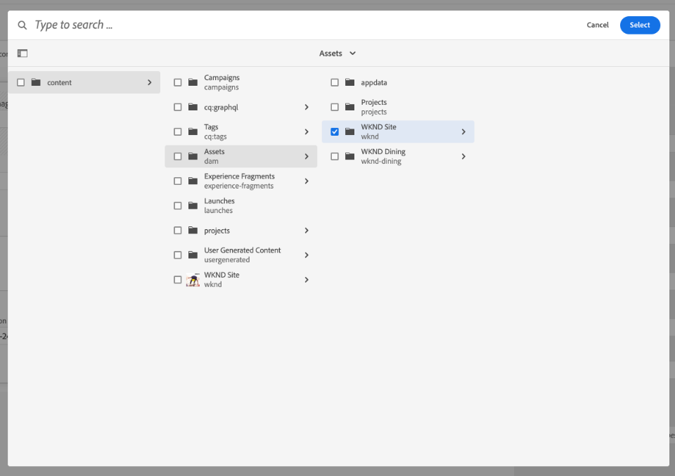
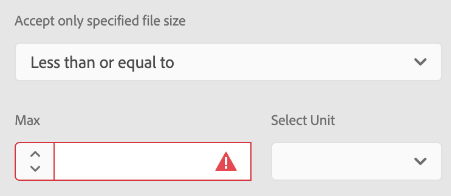
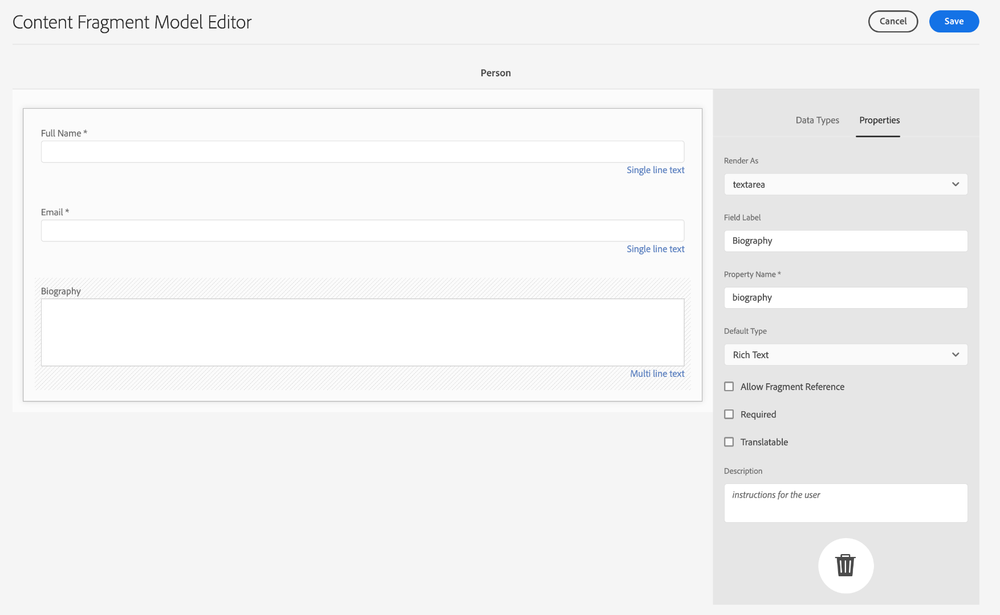
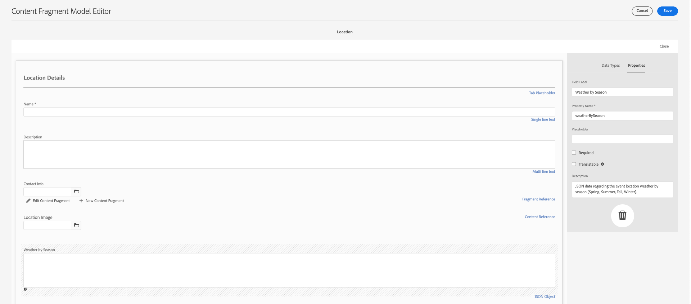
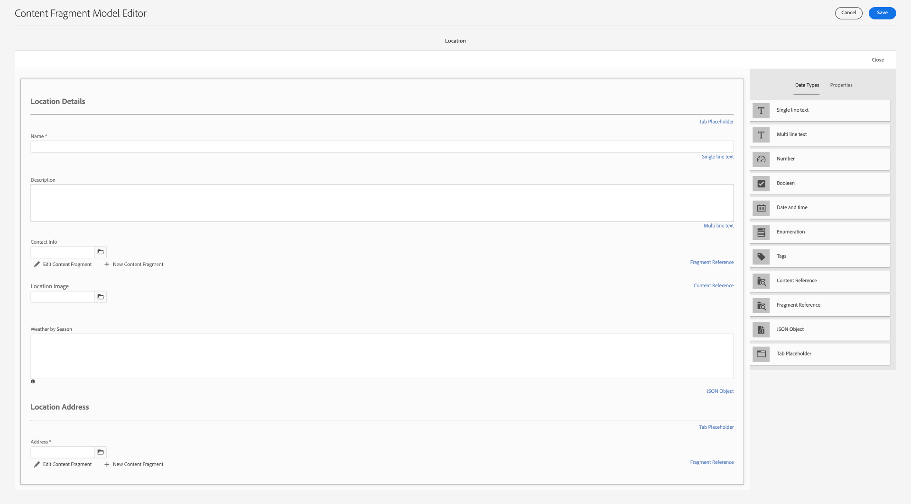

# 컨텐츠 조각 모델 만들기 {#create-content-fragment-models}

이 장에서는 5개의 컨텐츠 조각 모델을 만드는 단계를 안내합니다.

* **연락처 정보**
* **주소**
* **개인**
* **위치**
* **팀**

컨텐츠 조각 모델을 사용하면 컨텐츠 유형 간 관계를 정의하고 스키마와 같은 관계를 유지할 수 있습니다. 시각적 컨텐츠 조직에 중첩 조각 참조, 다양한 컨텐츠 데이터 유형 및 탭 유형을 사용합니다. 탭 자리 표시자, 조각 참조, JSON 개체 및 날짜 및 시간 데이터 유형과 같은 고급 데이터 유형입니다.

이 장에서는 이미지와 같은 컨텐츠 참조에 대한 유효성 검사 규칙을 향상시키는 방법도 다룹니다.

## 전제 조건 {#prerequisites}

고급 자습서입니다. 이 장을 계속 진행하기 전에 [빠른 설정](../quick-setup/cloud-service.md). 고급 자습서 설정에 대한 자세한 내용은 이전 개요 장을 참조하십시오.

## 목표 {#objectives}

* 컨텐츠 조각 모델을 만듭니다.
* 탭 자리 표시자, 날짜 및 시간, JSON 개체, 조각 참조 및 컨텐츠 참조를 모델에 추가합니다.
* 컨텐츠 참조에 유효성 검사를 추가합니다.

## 컨텐츠 조각 모델 개요 {#content-fragment-model-overview}

다음 비디오에서는 컨텐츠 조각 모델 및 이 자습서에서 사용하는 방법에 대해 간략하게 소개합니다.

>[!VIDEO](https://video.tv.adobe.com/v/340037/?quality=12&learn=on)

## 컨텐츠 조각 모델 만들기 {#create-models}

WKND 앱에 대한 컨텐츠 조각 모델을 만들어 보겠습니다. 컨텐츠 조각 모델 생성에 대한 기본 소개가 필요한 경우, [기본 자습서](../multi-step/content-fragment-models.md).

1. 다음으로 이동 **도구** > **자산** > **컨텐츠 조각 모델**.

   

2. 선택 **WKND 사이트** 사이트에 대한 기존 컨텐츠 조각 모델 목록을 보려면 다음을 수행하십시오.

### 연락처 정보 모델 {#contact-info-model}

다음으로 개인 또는 위치에 대한 연락처 정보가 포함된 모델을 만듭니다.

1. 선택 **만들기** 오른쪽 상단 모서리에서

2. 모델의 제목을 &quot;Contact Info&quot;로 지정한 다음 **만들기**. 표시되는 성공 모달에서 **열기** 새로 생성된 모델을 편집하려면

3. 먼저 **한 줄 텍스트** 필드에 설명을 추가합니다. ID를 **필드 레이블** &quot;Phone&quot;에서 **속성** 탭. 속성 이름은 자동으로 `phone`. 확인란을 선택하여 필드를 만듭니다 **필수 여부**.

4. 로 이동합니다 **데이터 유형** 탭을 클릭한 다음 다른 탭을 추가합니다 **한 줄 텍스트** &quot;전화&quot; 필드 아래에 있는 필드입니다. ID를 **필드 레이블** &quot;Email&quot;로 설정하고 **필수 여부**.

Adobe Experience Manager에는 몇 가지 내장된 유효성 검사 방법이 포함되어 있습니다. 이러한 유효성 검사 방법을 사용하면 컨텐츠 조각 모델의 특정 필드에 거버넌스 규칙을 추가할 수 있습니다. 이 경우 유효성 검사 규칙을 추가하여 사용자가 이 필드를 작성할 때 유효한 이메일 주소만 입력할 수 있도록 합니다. 아래에 **유효성 검사 유형** 드롭다운, 선택 **이메일**.

완료된 컨텐츠 조각 모델은 다음과 같습니다.

완료되면 을 선택합니다 **저장** 변경 사항을 확인하고 컨텐츠 조각 모델 편집기를 닫습니다.

### 주소 모델 {#address-model}

그런 다음 주소에 대한 모델을 만듭니다.

1. 에서 **WKND 사이트**, 선택 **만들기** 오른쪽 상단 모서리에서

2. &quot;Address&quot;라는 제목을 입력하고 **만들기**.

   나. 표시되는 성공 모달에서 **열기** 새로 생성된 모델을 편집하려면

3. 끌어서 놓기 **한 줄 텍스트** 모델에 필드를 추가하고 **필드 레이블** &quot;주소&quot; 그러면 속성 이름이 `streetAddress`. 을(를) 선택합니다 **필수 여부** 확인란을 선택합니다.

4. 위의 단계를 반복하여 &quot;단일 행 텍스트&quot; 필드를 모델에 4개 더 추가합니다. 다음 레이블을 사용합니다.

   * 도시
   * 상태
   * 우편 번호
   * 국가

5. 선택 **저장** 주소 모델에 대한 변경 사항을 저장합니다.

   완료된 &quot;주소&quot; 조각 모델은 다음과 같습니다.
   

### 개인 모델 {#person-model}

그런 다음 사람에 대한 정보가 포함된 모델을 만듭니다.

1. 오른쪽 상단 모서리에서 을(를) 선택합니다 **만들기**.

2. 모델의 제목을 &quot;Person&quot;으로 지정한 다음, **만들기**. 표시되는 성공 모달에서 **열기** 새로 생성된 모델을 편집하려면

3. 먼저 **한 줄 텍스트** 필드에 설명을 추가합니다. ID를 **필드 레이블** 전체 이름. 속성 이름은 자동으로 `fullName`. 확인란을 선택하여 필드를 만듭니다 **필수 여부**.

   

4. 컨텐츠 조각 모델은 다른 모델에서 참조할 수 있습니다. 로 이동합니다 **데이터 유형** 탭을 클릭한 다음 드래그하여 놓습니다 **조각 참조** 필드에 &quot;연락처 정보&quot;라는 레이블을 지정합니다.

5. 에서 **속성** 탭, 아래 **허용된 컨텐츠 조각 모델** 필드에서 폴더 아이콘을 선택한 다음 **연락처 정보** 조각 모델 을 이전에 만들었습니다.

6. 추가 **컨텐츠 참조** 필드 및 **필드 레이블** 프로필 사진 아래에서 폴더 아이콘을 선택합니다 **루트 경로** 경로 선택 모달을 엽니다. 을(를) 선택하여 루트 경로 선택 **콘텐츠** > **자산**&#x200B;을 선택한 다음, **WKND 사이트**. 를 사용하십시오 **선택** 오른쪽 위에 있는 단추를 클릭하여 경로를 저장합니다. 최종 텍스트 경로는 읽어야 합니다 `/content/dam/wknd`.

   

7. 아래 **지정된 콘텐츠 형식만 허용합니다**&#x200B;에서 &quot;이미지&quot;를 선택합니다.

   

8. 이미지 파일 크기 및 차원을 제한하려면 컨텐츠 참조 필드에 대한 유효성 검사 옵션을 살펴보겠습니다.

   아래 **지정된 파일 크기만 허용합니다**아래에서 &quot;작거나 같음&quot;을 선택하고 추가 필드가 아래에 표시됩니다.
   

9. 대상 **최대**&#x200B;에 &quot;5&quot;를 입력하고 **장치 선택**&#x200B;을 선택하고 &quot;메가바이트(MB)&quot;를 선택합니다. 이 유효성 검사에서는 지정된 크기의 이미지만 선택할 수 있습니다.

10. 아래 **지정된 이미지 너비만 허용합니다**&#x200B;를 클릭하고 &quot;최대 너비&quot;를 선택합니다. 에서 **최대(픽셀)** 표시되는 필드에 &quot;500&quot;을 입력합니다. 에 대해 동일한 옵션을 선택합니다 **지정된 이미지 높이만 허용합니다**.

   이러한 유효성 검사는 추가된 이미지가 지정된 값을 초과하지 않도록 합니다. 이제 유효성 검사 규칙은 다음과 같습니다.
   

11. 추가 **여러 줄 텍스트** 필드 및 **필드 레이블** &quot;전기&quot; 을(를) 종료하십시오. **기본 유형** 드롭다운을 기본 &quot;리치 텍스트&quot; 옵션으로 설정합니다.

   

12. 로 이동합니다 **데이터 유형** 탭을 클릭한 다음 **열거형** 프로필 사진 아래의 필드입니다. 기본값 **다음으로 렌더링** 선택 **드롭다운**. Expert, Advanced, Intermediate와 같은 강사 경험 수준 옵션을 선택합니다.

13. 그런 다음 다른 **열거형** &quot;강사 경험 수준&quot; 아래의 필드를 선택하고 **다음으로 렌더링** 선택 사항입니다. 암벽 등반, 서핑, 사이클링, 스키, 배낭 여행과 같은 다양한 기술을 사용해 보십시오. 옵션 레이블 및 옵션 값은 다음과 일치해야 합니다.

   

14. 마지막으로 다음을 사용하여 &quot;관리자 세부 사항&quot; 필드 레이블을 만듭니다 **여러 줄 텍스트** 필드.

선택 **저장** 변경 사항을 확인하고 컨텐츠 조각 모델 편집기를 닫습니다.

### 위치 모델 {#location-model}

다음 컨텐츠 조각 모델은 물리적 위치를 설명합니다. 이 모델은 탭 자리 표시자를 사용합니다. 탭 자리 표시자는 컨텐츠를 분류하여 모델 편집기에서 데이터 유형을 구성하고 조각 편집기에서 컨텐츠를 각각 구성하는 데 도움이 됩니다. 각 자리 표시자는 컨텐츠 조각 편집기에서 인터넷 브라우저의 탭과 유사한 탭을 만듭니다. 위치 모델에는 두 개의 탭이 있어야 합니다. 위치 세부 사항 및 위치 주소.

1. 이전처럼 을(를) 선택합니다. **만들기** 다른 컨텐츠 조각 모델을 만드는 방법. 모델 제목의 경우 &quot;위치&quot;를 입력합니다. 선택 **만들기** 후 **열기** 에 표시되는 성공 모달에서 을 참조하십시오.

2. 추가 **탭 자리 표시자** 필드에 값을 지정한 후 &quot;위치 세부 정보&quot;로 레이블을 지정합니다.

3. 끌어다 놓기 **단일 행 텍스트** 이름을 &quot;Name&quot;으로 지정합니다. 이 필드 레이블 아래에 을(를) 추가합니다. **여러 줄 텍스트** 필드에 &quot;Description&quot;으로 레이블을 지정합니다.

4. 그런 다음 **조각 참조** 필드에 &quot;연락처 정보&quot;로 레이블을 지정합니다. 속성 탭의 **허용된 컨텐츠 조각 모델**&#x200B;에서 을(를) 선택합니다. **폴더 아이콘** 앞에서 만든 &quot;연락처 정보&quot; 조각 모델을 선택합니다.

5. 추가 **컨텐츠 참조** 연락처 정보 아래의 필드. 위치 이미지에 레이블을 지정합니다. 다음 **루트 경로** 다음과 같습니다. `/content/dam/wknd.` 아래 **지정된 콘텐츠 형식만 허용합니다**&#x200B;에서 &quot;이미지&quot;를 선택합니다.

6. 또한 **JSON 개체** 위치 이미지 아래의 필드입니다. 이 데이터 유형은 유연하므로 컨텐츠에 포함할 데이터를 표시하는 데 사용할 수 있습니다. 이 경우 날씨에 대한 정보를 표시하는 데 JSON 개체가 사용됩니다. JSON 개체 &quot;Weather by Season&quot;에 레이블을 지정합니다. 에서 **속성** 탭에서 추가 **설명** 따라서 사용자에게 여기에 어떤 데이터를 입력해야 하는지 명확히 확인합니다. &quot;계절별 이벤트 위치 날씨에 대한 JSON 데이터(봄, 여름, 가을, 겨울)입니다.&quot;

   

7. 위치 주소 탭을 만들려면 **탭 자리 표시자** 필드에 값을 지정한 후 &quot;위치 주소&quot;로 레이블을 지정합니다.

8. 끌어서 놓기 **조각 참조** 필드 및 속성 탭의 **허용된 컨텐츠 조각 모델**&#x200B;에서 을(를) 선택합니다. **주소** 모델.

9. 선택 **저장** 변경 사항을 확인하고 컨텐츠 조각 모델 편집기를 닫습니다. 완료된 위치 모델은 다음과 같이 나타납니다.

   

### 팀 모델 {#team-model}

마지막으로, 팀을 설명하는 모델을 만듭니다.

1. 에서 **WKND 사이트** 페이지를 선택하고 **만들기** 다른 컨텐츠 조각 모델을 만들기 위해 모델 제목의 경우 &quot;Team&quot;을 입력합니다. 이전처럼 을(를) 선택합니다. **만들기** 후 **열기** 에 표시되는 성공 모달에서 을 참조하십시오.

2. 추가 **여러 줄 텍스트** 필드를 추가합니다. 아래 **필드 레이블**&#x200B;를 입력합니다. &quot;Description&quot;을 입력합니다.

3. 추가 **날짜 및 시간** 필드에 값을 지정한 후 &quot;Team Confirence Date&quot;로 레이블을 지정합니다. 이 경우 기본값을 유지합니다 **유형** 을 &quot;날짜&quot;로 설정하고, &quot;날짜 및 시간&quot; 또는 &quot;시간&quot;을 사용할 수도 있습니다.

   

4. 로 이동합니다 **데이터 유형** 탭. 팀 구성 날짜 아래에서 **조각 참조**. 에서 **다음으로 렌더링** 드롭다운에서 &quot;multifield&quot;를 선택합니다. 대상 **필드 레이블**&#x200B;를 입력하고 &quot;팀 구성원&quot;을 입력합니다. 이 필드는 이전에 만든 개인 모델에 연결됩니다. 데이터 유형은 다중 필드이므로 여러 개인 조각을 추가하여 팀을 만들 수 있습니다.

   

5. 아래 **허용된 컨텐츠 조각 모델**&#x200B;를 클릭하고 폴더 아이콘을 사용하여 경로 선택 모달을 연 다음, **개인** 모델. 를 사용하십시오 **선택** 버튼을 클릭하여 경로를 저장합니다.

   

6. 선택 **저장** 변경 사항을 확인하고 컨텐츠 조각 모델 편집기를 닫습니다.

## 모험 모델에 조각 참조 추가 {#fragment-references}

팀 모델에 개인 모델에 대한 조각 참조가 있는 방식과 유사한 방식으로, WKND 앱에서 이러한 새 모델을 표시하려면 Adventure 모델에서 팀 및 위치 모델을 참조해야 합니다.

1. 에서 **WKND 사이트** 페이지에서 을 선택합니다 **모험** 모델을 선택한 다음 **편집** 위쪽 탐색에서 를 클릭합니다.

   

2. 양식 하단의 &quot;가져올 내용&quot; 아래에 을 추가합니다. **조각 참조** 필드. 을(를) 입력합니다. **필드 레이블** 위치. 아래 **허용된 컨텐츠 조각 모델**&#x200B;에서 을(를) 선택합니다. **위치** 모델.

   

3. 추가 **조각 참조** 필드에 &quot;Instructor Team&quot;이라고 레이블을 지정합니다. 아래 **허용된 컨텐츠 조각 모델**&#x200B;에서 을(를) 선택합니다. **팀** 모델.

   

4. 다른 추가 **조각 참조** 필드를 작성하고 &quot;관리자&quot;로 레이블을 지정합니다.

   

5. 선택 **저장** 변경 사항을 확인하고 컨텐츠 조각 모델 편집기를 닫습니다.

## 우수 사례 {#best-practices}

컨텐츠 조각 모델 만들기와 관련된 몇 가지 우수 사례가 있습니다.

* UX 구성 요소에 매핑되는 모델을 만듭니다. 예를 들어 WKND 앱에는 모험, 문서 및 위치에 대한 컨텐츠 조각 모델이 있습니다. 헤더, 프로모션 또는 면책조항을 추가할 수도 있습니다. 이러한 각 예제는 특정 UX 구성 요소를 구성합니다.

* 가능한 한 적은 수의 모델을 만듭니다. 모델 수를 제한하면 컨텐츠 관리를 극대화하고 간소화할 수 있습니다.

* 컨텐츠 조각 모델 중첩은 필요한 만큼 깊게(필요한 경우에만) 조각 참조 또는 컨텐츠 참조를 사용하여 중첩이 수행된다는 것을 기억하십시오. 최대 다섯 수준의 중첩을 고려합니다.

## 축하합니다! {#congratulations}

축하합니다! 이제 탭을 추가하고, 날짜 및 시간 및 JSON 개체 데이터 유형을 사용하며, 조각 및 컨텐츠 참조에 대해 자세히 알아봅니다. 또한 컨텐츠 참조 유효성 검사 규칙을 추가했습니다.

## 다음 단계 {#next-steps}

이 시리즈의 다음 장에서는 [컨텐츠 조각 작성](/help/headless-tutorial/graphql/advanced-graphql/author-content-fragments.md) 이 장에서 생성한 모델에서 이 장에 도입된 데이터 유형을 사용하고 폴더 정책을 만들어 자산 폴더에서 만들 수 있는 컨텐츠 조각 모델을 제한하는 방법을 알아봅니다.

이 자습서에서는 선택 사항이지만 실제 프로덕션 상황에서 모든 콘텐츠를 게시해야 합니다. AEM의 작성 및 게시 환경에 대한 검토는 다음을 참조하십시오.
[AEM 헤드리스 및 GraphQL 비디오 시리즈](/help/headless-tutorial/graphql/video-series/author-publish-architecture.md).
