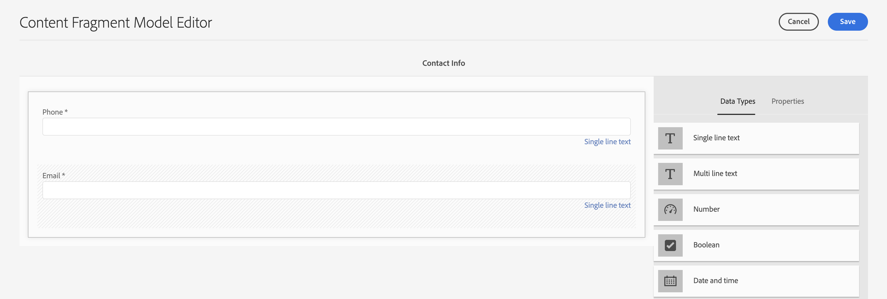

# 콘텐츠 조각 모델 만들기 {#create-content-fragment-models}

이 장에서는 5개의 콘텐츠 조각 모델을 만드는 단계를 안내합니다.

* **연락처 정보**
* **주소**
* **개인**
* **위치**
* **팀**

콘텐츠 조각 모델을 사용하면 콘텐츠 유형 간의 관계를 정의하고 스키마와 같은 관계를 유지할 수 있습니다. 중첩된 조각 참조, 다양한 콘텐츠 데이터 유형 및 시각적 콘텐츠 구성을 위한 탭 유형을 사용합니다. 탭 자리 표시자, 조각 참조, JSON 개체 및 날짜 및 시간 데이터 유형과 같은 고급 데이터 유형입니다.

이 장에서는 이미지와 같은 콘텐츠 참조에 대한 유효성 검사 규칙을 향상시키는 방법도 다룹니다.

## 사전 요구 사항 {#prerequisites}

고급 자습서입니다. 이 장을 진행하기 전에 다음을 완료했는지 확인하십시오. [빠른 설정](../quick-setup/cloud-service.md). 이전 내용도 모두 읽었는지 확인합니다. [개요](../overview.md) 고급 자습서 설정에 대한 자세한 내용은 챕터를 참조하십시오.

## 목표 {#objectives}

* 콘텐츠 조각 모델을 만듭니다.
* 모델에 탭 자리 표시자, 날짜 및 시간, JSON 개체, 조각 참조 및 콘텐츠 참조를 추가합니다.
* 콘텐츠 참조에 유효성 검사를 추가합니다.

## 콘텐츠 조각 모델 개요 {#content-fragment-model-overview}

다음 비디오에서는 콘텐츠 조각 모델에 대해 간략히 소개하고 이 자습서에서 해당 모델을 사용하는 방법을 제공합니다.

>[!VIDEO](https://video.tv.adobe.com/v/340037?quality=12&learn=on)

## 콘텐츠 조각 모델 만들기 {#create-models}

WKND 앱을 위한 몇 가지 콘텐츠 조각 모델을 만들어 보겠습니다. 콘텐츠 조각 모델 생성에 대한 기본적인 소개가 필요한 경우 [기본 자습서](../multi-step/content-fragment-models.md).

1. **도구** > **일반** > **콘텐츠 조각 모델**&#x200B;로 이동합니다.

   

1. 선택 **WKND 공유** 사이트에 대한 기존 콘텐츠 조각 모델 목록을 봅니다.

### 연락처 정보 모델 {#contact-info-model}

다음으로 개인 또는 위치에 대한 연락처 정보가 포함된 모델을 만듭니다.

1. 선택 **만들기** 오른쪽 상단 모서리입니다.

1. 모델에 &quot;연락처 정보&quot;라는 제목을 지정한 다음 **만들기**. 표시되는 성공 모달에서 다음을 선택합니다. **열기** 를 클릭하여 새로 생성된 모델을 편집합니다.

1. 을(를) 드래그하여 시작 **한 줄 텍스트** 모델에 대한 필드입니다. 다음을 제공합니다. **필드 레이블** 의 &quot;Phone&quot; **속성** 탭. 속성 이름은으로 자동 채워집니다. `phone`. 확인란을 선택하여 필드를 만듭니다. **필수**.

1. 다음 위치로 이동 **데이터 유형** 탭을 클릭한 다음 다른 탭 추가 **한 줄 텍스트** &quot;전화&quot; 필드 아래에 있는 필드입니다. 다음을 제공합니다. **필드 레이블** / &quot;Email&quot; 및 를 로 설정 **필수**.

Adobe Experience Manager에는 몇 가지 기본 제공 유효성 검사 메서드가 포함되어 있습니다. 이러한 유효성 검사 메서드를 사용하면 콘텐츠 조각 모델의 특정 필드에 거버넌스 규칙을 추가할 수 있습니다. 이 경우 이 필드를 작성할 때 사용자가 유효한 이메일 주소만 입력할 수 있도록 유효성 검사 규칙을 추가해 보겠습니다. 아래 **유효성 검사 유형** 드롭다운, 선택 **이메일**.

완료된 콘텐츠 조각 모델은 다음과 같아야 합니다.

완료되면 다음을 선택합니다. **저장** 변경 사항을 확인하고 콘텐츠 조각 모델 편집기를 닫습니다.

### 주소 모델 {#address-model}

그런 다음 주소에 대한 모델을 만듭니다.

1. 다음에서 **WKND 공유**, 선택 **만들기** 오른쪽 상단에서

1. &quot;주소&quot;의 제목을 입력한 다음 선택 **만들기**. 표시되는 성공 모달에서 다음을 선택합니다. **열기** 를 클릭하여 새로 생성된 모델을 편집합니다.

1. 드래그 앤 드롭 **한 줄 텍스트** 모델에 필드를 추가하고 **필드 레이블** &quot;거리 주소&quot; 그런 다음 속성 이름을 로 채웁니다. `streetAddress`. 다음 항목 선택 **필수** 확인란.

1. 위의 단계를 반복하고 4개의 &quot;한 줄 텍스트&quot; 필드를 모델에 더 추가합니다. 다음 레이블을 사용합니다.

   * 도시
   * 상태
   * 우편 번호
   * 국가

1. 선택 **저장** 를 클릭하여 주소 모델에 대한 변경 사항을 저장합니다.

   완료된 &quot;주소&quot; 조각 모델은 다음과 같아야 합니다.
   

### 개인 모델 {#person-model}

다음으로, 개인에 대한 정보가 포함된 모델을 만듭니다.

1. 오른쪽 상단 모서리에서 을(를) 선택합니다. **만들기**.

1. 모델에 &quot;개인&quot;이라는 제목을 지정한 다음 을 선택합니다. **만들기**. 표시되는 성공 모달에서 다음을 선택합니다. **열기** 를 클릭하여 새로 생성된 모델을 편집합니다.

1. 을(를) 드래그하여 시작 **한 줄 텍스트** 모델에 대한 필드입니다. 다음을 제공합니다. **필드 레이블** &quot;전체 이름&quot; 속성 이름은으로 자동 채워집니다. `fullName`. 확인란을 선택하여 필드를 만듭니다. **필수**.

   

1. 콘텐츠 조각 모델은 다른 모델에서 참조할 수 있습니다. 다음 위치로 이동 **데이터 유형** 탭을 누른 다음 을(를) 끌어서 놓습니다. **조각 참조** 필드에 &quot;Contact Info&quot; 레이블을 지정합니다.

1. 다음에서 **속성** 탭, **허용된 컨텐츠 조각 모델** 필드에서 폴더 아이콘을 선택한 다음 **연락처 정보** 조각 모델이 이전에 생성되었습니다.

1. 추가 **콘텐츠 참조** 필드 및 부여 **필드 레이블** 프로필 사진 아래의 폴더 아이콘 선택 **루트 경로** 를 클릭하여 경로 선택 모달을 엽니다. 다음을 선택하여 루트 경로 선택 **콘텐츠** > **에셋**&#x200B;을 클릭한 다음 확인란을 선택합니다. **WKND 공유**. 사용 **선택** 오른쪽 상단의 단추를 클릭하여 경로를 저장합니다. 최종 텍스트 경로는 다음과 같아야 합니다. `/content/dam/wknd-shared`.

   

1. 아래 **지정된 컨텐츠 유형만 수락**, &quot;이미지&quot;를 선택합니다.

   

1. 이미지 파일 크기와 크기를 제한하려면 콘텐츠 참조 필드에 대한 몇 가지 유효성 검사 옵션을 살펴보겠습니다.

   아래 **지정된 파일 크기만 수락**에서 &quot;작거나 같음&quot;을 선택하고 아래에 추가 필드가 나타납니다.
   

1. 대상 **최대**, &quot;5&quot;를 입력하고 **단위 선택**&#x200B;를 클릭하고 &quot;메가바이트(MB)&quot;를 선택합니다. 이 유효성 검사에서는 지정된 크기의 이미지만 선택할 수 있습니다.

1. 아래 **지정된 이미지 폭만 수락**, &quot;최대 너비&quot;를 선택합니다. 다음에서 **최대(픽셀)** 표시되는 필드에 &quot;10000&quot;를 입력합니다. 에 대해 동일한 옵션 선택 **지정된 이미지 높이만 수락**.

   이러한 유효성 검사는 추가된 이미지가 지정된 값을 초과하지 않도록 합니다. 이제 유효성 검사 규칙은 다음과 같아야 합니다.

   

1. 추가 **여러 줄 텍스트** 필드 및 부여 **필드 레이블** &quot;Biography&quot;의 나가기 **기본 유형** 드롭다운을 기본 &quot;리치 텍스트&quot; 옵션으로 사용합니다.

   

1. 다음 위치로 이동 **데이터 유형** 탭을 누른 다음 을(를) 드래그합니다. **열거형** &quot;Biography&quot; 아래에 있는 필드. 기본값 대신 **렌더링 형식** 옵션, 선택 **드롭다운** 다음을 수행합니다. **필드 레이블** (&quot;강사 경험 수준&quot;) 아래에 그룹화됩니다. 다음과 같은 강사 경험 수준 옵션 선택 사항을 입력합니다. _전문가, 고급, 중간_.

1. 다음으로 다른 을(를) 드래그합니다. **열거형** &quot;강사 경험 수준&quot; 아래에 있는 필드를 선택하고 **렌더링 형식** 옵션을 선택합니다. 다음을 제공합니다. **필드 레이블** of &quot;Skills&quot;. 암벽 등반, 서핑, 사이클링, 스키, 배낭여행 등 다양한 기술을 익히세요. 옵션 레이블과 옵션 값은 다음과 일치해야 합니다.

   

1. 마지막으로 다음을 사용하여 &quot;관리자 세부 정보&quot; 필드 레이블을 만듭니다. **여러 줄 텍스트** 필드.

선택 **저장** 변경 사항을 확인하고 콘텐츠 조각 모델 편집기를 닫습니다.

### 위치 모델 {#location-model}

다음 콘텐츠 조각 모델은 실제 위치를 설명합니다. 이 모델은 탭 자리 표시자를 사용합니다. 탭 자리 표시자는 콘텐츠를 분류하여 모델 편집기에서 데이터 유형을 구성하고 조각 편집기에서 콘텐츠를 구성하는 데 도움이 됩니다. 각 자리 표시자는 콘텐츠 조각 편집기에서 인터넷 브라우저의 탭과 유사한 탭을 만듭니다. 위치 모델에는 위치 세부 사항 및 위치 주소의 두 가지 탭이 있어야 합니다.

1. 이전과 같이 **만들기** 을 클릭하여 다른 콘텐츠 조각 모델을 만듭니다. 모델 제목에는 &quot;위치&quot;를 입력합니다. 선택 **만들기** 뒤에 오는 **열기** 표시되는 성공 모달에서 을 참조하십시오.

1. 추가 **탭 자리 표시자** 필드에 모델을 추가하고 레이블을 &quot;Location Details&quot;로 지정합니다.

1. 드래그 앤 드롭 **한 줄 텍스트** 이름을 &quot;Name&quot;으로 지정합니다. 이 필드 레이블 아래에 **여러 줄 텍스트** 필드에 레이블을 지정하고 &quot;Description&quot;으로 지정합니다.

1. 다음으로, 추가 **조각 참조** 필드에 레이블을 지정하고 &quot;Contact Info&quot;로 지정합니다. 속성 탭의 **허용된 컨텐츠 조각 모델**&#x200B;를 선택하고 **폴더 아이콘** 이전에 만든 &quot;연락처 정보&quot; 조각 모델을 선택합니다.

1. 추가 **콘텐츠 참조** &quot;연락처 정보&quot; 아래에 있는 필드입니다. 레이블을 &quot;위치 이미지&quot;로 지정합니다. 다음 **루트 경로** 다음이어야 함: `/content/dam/wknd-shared.` 아래 **지정된 컨텐츠 유형만 수락**, &quot;이미지&quot;를 선택합니다.

1. 도 추가하겠습니다. **JSON 개체** &quot;위치 이미지&quot; 아래의 필드. 이 데이터 유형은 유연하므로 콘텐츠에 포함할 모든 데이터를 표시하는 데 사용할 수 있습니다. 이 경우 JSON 개체는 날씨에 대한 정보를 표시하는 데 사용됩니다. JSON 개체에 &quot;계절별 날씨&quot;라는 레이블을 지정합니다. 다음에서 **속성** 탭, 추가 **설명** 따라서 사용자에게 여기에 어떤 데이터를 입력해야 하는지 명확히 알 수 있습니다. &quot;시즌(봄, 여름, 가을, 겨울)별 이벤트 위치 날씨에 대한 JSON 데이터&quot;

   

1. 위치 주소 탭을 만들려면 **탭 자리 표시자** 필드에 모델을 추가하고 레이블을 &quot;위치 주소&quot;로 지정합니다.

1. 드래그 앤 드롭 **조각 참조** 필드와 속성 탭에서 &quot;Address&quot;로 레이블을 지정하고 **허용된 컨텐츠 조각 모델**&#x200B;를 선택하고 **주소** 모델.

1. 선택 **저장** 변경 사항을 확인하고 콘텐츠 조각 모델 편집기를 닫습니다. 완료된 위치 모델이 다음과 같이 표시됩니다.

   

### 팀 모델 {#team-model}

마지막으로 사람 팀을 설명하는 모델을 만듭니다.

1. 다음에서 **WKND 공유** 페이지, 선택 **만들기** 다른 콘텐츠 조각 모델을 만듭니다. 모델 제목에는 &quot;Team&quot;을 입력합니다. 이전과 같이 **만들기** 뒤에 오는 **열기** 표시되는 성공 모달에서 을 참조하십시오.

1. 추가 **여러 줄 텍스트** 필드를 양식에 추가합니다. 아래 **필드 레이블**, &quot;설명&quot;을 입력합니다.

1. 추가 **날짜 및 시간** 필드에 모델을 추가하고 레이블을 &quot;Team Foundation Date&quot;로 지정합니다. 이 경우 기본값 유지 **유형** 날짜를 &quot;날짜&quot;로 설정하되 &quot;날짜 및 시간&quot; 또는 &quot;시간&quot;을 사용할 수도 있습니다.

   

1. 다음 위치로 이동 **데이터 유형** 탭. &quot;팀 창립일&quot; 아래에 **조각 참조**. 다음에서 **렌더링 형식** 드롭다운에서 &quot;multifield&quot;를 선택합니다. 대상 **필드 레이블**, &quot;팀원&quot;을 입력합니다. 이 필드는 다음으로 연결됩니다. _개인_ 이전에 만든 모델입니다. 데이터 유형은 다중 필드이므로 여러 개인 조각을 추가할 수 있으므로 사람 팀을 만들 수 있습니다.

   

1. 아래 **허용된 컨텐츠 조각 모델**, 폴더 아이콘을 사용하여 경로 선택 모달을 연 다음 **개인** 모델. 사용 **선택** 단추를 클릭하여 경로를 저장합니다.

   

1. 선택 **저장** 변경 사항을 확인하고 콘텐츠 조각 모델 편집기를 닫습니다.

## 어드벤처 모델에 조각 참조 추가 {#fragment-references}

팀 모델에 개인 모델에 대한 조각 참조가 있는 것과 마찬가지로, WKND 앱에 이러한 새 모델을 표시하려면 어드벤처 모델에서 팀 및 위치 모델을 참조해야 합니다.

1. 다음에서 **WKND 공유** 페이지에서 **모험** 모델, 선택 **편집** 위쪽 탐색에서 입니다.

   

1. 양식 하단의 &quot;가져올 항목&quot; 아래에 **조각 참조** 필드. 입력 **필드 레이블** / &quot;위치&quot; 아래 **허용된 컨텐츠 조각 모델**&#x200B;를 선택하고 **위치** 모델.

   

1. 한 개 더 추가 **조각 참조** 필드를 지정하고 &quot;강사 팀&quot;으로 레이블을 지정합니다. 아래 **허용된 컨텐츠 조각 모델**&#x200B;를 선택하고 **팀** 모델.

   

1. 다른 항목 추가 **조각 참조** 필드에 레이블을 지정하고 &quot;Administrator&quot;로 지정합니다.

   

1. 선택 **저장** 변경 사항을 확인하고 콘텐츠 조각 모델 편집기를 닫습니다.

## 모범 사례 {#best-practices}

콘텐츠 조각 모델 생성과 관련된 몇 가지 우수 사례가 있습니다.

* UX 구성 요소에 매핑되는 모델을 생성합니다. 예를 들어 WKND 앱에는 모험, 문서 및 위치에 대한 콘텐츠 조각 모델이 있습니다. 헤더, 프로모션 또는 면책조항을 추가할 수도 있습니다. 이러한 각 예는 특정 UX 구성 요소를 구성합니다.

* 가능한 한 적은 수의 모델을 만듭니다. 모델 수를 제한하면 재사용을 극대화하고 컨텐츠 관리를 간소화할 수 있습니다.

* 콘텐츠 조각 모델을 필요한 만큼 깊게 중첩하지만 필요한 만큼만 중첩합니다. 조각 참조 또는 콘텐츠 참조를 사용하여 중첩이 수행된다는 점을 기억하십시오. 최대 5단계의 중첩을 고려합니다.

## 축하합니다! {#congratulations}

축하합니다! 이제 탭을 추가하고, 날짜 및 시간 및 JSON 개체 데이터 유형을 사용하고 조각 및 콘텐츠 참조에 대해 자세히 알아보았습니다. 콘텐츠 참조 유효성 검사 규칙도 추가했습니다.

## 다음 단계 {#next-steps}

이 시리즈의 다음 장에서는 [컨텐츠 조각 작성](/help/headless-tutorial/graphql/advanced-graphql/author-content-fragments.md) 을 참조하십시오. 이 장에 소개된 데이터 유형을 사용하고 폴더 정책을 만들어 에셋 폴더에서 만들 수 있는 콘텐츠 조각 모델을 제한하는 방법에 대해 알아봅니다.

이 자습서에서는 선택 사항이지만 실제 프로덕션 상황에서 모든 콘텐츠를 게시해야 합니다. AEM의 작성자 및 게시 환경에 대한 검토는
[AEM Headless 및 GraphQL 비디오 시리즈](/help/headless-tutorial/graphql/video-series/author-publish-architecture.md).
