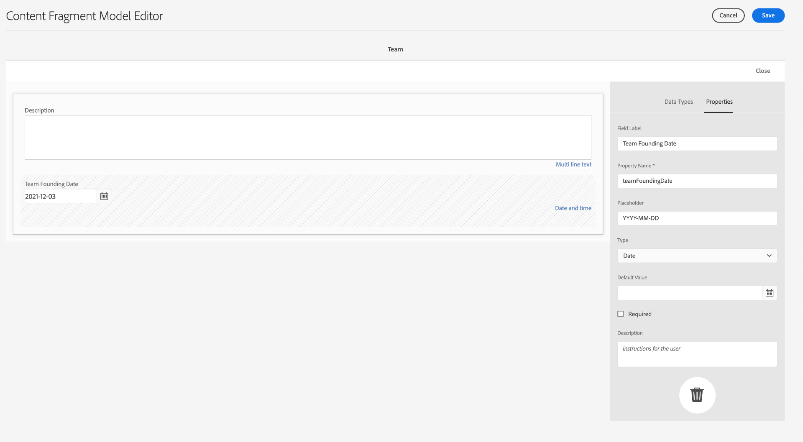

# 콘텐츠 조각 모델 만들기 {#create-content-fragment-models}

이 장에서는 5개의 콘텐츠 조각 모델을 만드는 단계를 안내합니다.

* **연락처 정보**
* **주소**
* **개인**
* **위치**
* **팀**

콘텐츠 조각 모델을 사용하면 콘텐츠 유형 간의 관계를 정의하고 스키마와 같은 관계를 유지할 수 있습니다. 중첩된 조각 참조, 다양한 콘텐츠 데이터 유형 및 시각적 콘텐츠 구성을 위한 탭 유형을 사용합니다. 탭 자리 표시자, 조각 참조, JSON 개체 및 날짜 및 시간 데이터 유형과 같은 고급 데이터 유형입니다.

이 장에서는 이미지와 같은 콘텐츠 참조에 대한 유효성 검사 규칙을 향상시키는 방법도 다룹니다.

## 사전 요구 사항 {#prerequisites}

고급 자습서입니다. 이 장을 진행하기 전에 [빠른 설정](../quick-setup/cloud-service.md)을 완료했는지 확인하십시오. 고급 자습서의 설정에 대한 자세한 내용은 이전 [개요](../overview.md) 장도 참조하십시오.

## 목표 {#objectives}

* 콘텐츠 조각 모델을 만듭니다.
* 모델에 탭 자리 표시자, 날짜 및 시간, JSON 개체, 조각 참조 및 콘텐츠 참조를 추가합니다.
* 콘텐츠 참조에 유효성 검사를 추가합니다.

## 콘텐츠 조각 모델 개요 {#content-fragment-model-overview}

다음 비디오에서는 콘텐츠 조각 모델에 대해 간략히 소개하고 이 자습서에서 해당 모델을 사용하는 방법을 제공합니다.

>[!VIDEO](https://video.tv.adobe.com/v/340037?quality=12&learn=on)

## 콘텐츠 조각 모델 만들기 {#create-models}

WKND 앱을 위한 몇 가지 콘텐츠 조각 모델을 만들어 보겠습니다. 콘텐츠 조각 모델 만들기에 대한 기본적인 소개가 필요한 경우 [기본 자습서](../multi-step/content-fragment-models.md)의 해당 장을 참조하십시오.

1. **도구** > **일반** > **콘텐츠 조각 모델**&#x200B;로 이동합니다.

   

1. 사이트에 대한 기존 콘텐츠 조각 모델 목록을 보려면 **WKND 공유**&#x200B;를 선택하십시오.

### 연락처 정보 모델 {#contact-info-model}

다음으로 개인 또는 위치에 대한 연락처 정보가 포함된 모델을 만듭니다.

1. 오른쪽 상단에서 **만들기**&#x200B;를 선택합니다.

1. 모델에 &quot;연락처 정보&quot;라는 제목을 지정한 다음 **만들기**&#x200B;를 선택합니다. 표시되는 성공 모달에서 **열기**&#x200B;를 선택하여 새로 만든 모델을 편집합니다.

1. **한 줄 텍스트** 필드를 모델로 드래그하여 시작하십시오. **속성** 탭에서 &quot;휴대폰&quot;의 **필드 레이블**&#x200B;을 지정하십시오. 속성 이름이 `phone`(으)로 자동으로 채워집니다. 확인란을 선택하여 필드를 **필수**&#x200B;로 만듭니다.

1. **데이터 형식** 탭으로 이동한 다음 &quot;전화&quot; 필드 아래에 다른 **한 줄 텍스트** 필드를 추가합니다. &quot;전자 메일&quot;의 **필드 레이블**&#x200B;을 지정하고 **필수**(으)로도 설정하십시오.

Adobe Experience Manager에는 몇 가지 기본 제공 유효성 검사 메서드가 포함되어 있습니다. 이러한 유효성 검사 메서드를 사용하면 콘텐츠 조각 모델의 특정 필드에 거버넌스 규칙을 추가할 수 있습니다. 이 경우 이 필드를 작성할 때 사용자가 유효한 이메일 주소만 입력할 수 있도록 유효성 검사 규칙을 추가해 보겠습니다. **유효성 검사 유형** 드롭다운에서 **전자 메일**&#x200B;을 선택합니다.

완료된 콘텐츠 조각 모델은 다음과 같아야 합니다.

완료되면 **저장**&#x200B;을 선택하여 변경 내용을 확인하고 콘텐츠 조각 모델 편집기를 닫습니다.

### 주소 모델 {#address-model}

그런 다음 주소에 대한 모델을 만듭니다.

1. **WKND 공유**&#x200B;의 오른쪽 상단에서 **만들기**&#x200B;를 선택합니다.

1. &quot;주소&quot;의 제목을 입력한 다음 **만들기**&#x200B;를 선택하십시오. 표시되는 성공 모달에서 **열기**&#x200B;를 선택하여 새로 만든 모델을 편집합니다.

1. **한 줄 텍스트** 필드를 모델에 끌어다 놓고 **필드 레이블**(거리 주소)을 지정하십시오. 그러면 속성 이름이 `streetAddress`(으)로 채워집니다. **필수** 확인란을 선택하십시오.

1. 위의 단계를 반복하고 4개의 &quot;한 줄 텍스트&quot; 필드를 모델에 더 추가합니다. 다음 레이블을 사용합니다.

   * 도시
   * 상태
   * 우편 번호
   * 국가

1. **저장**&#x200B;을 선택하여 주소 모델에 대한 변경 내용을 저장합니다.

   완료된 &quot;주소&quot; 조각 모델은 다음과 같아야 합니다.
   

### 개인 모델 {#person-model}

다음으로, 개인에 대한 정보가 포함된 모델을 만듭니다.

1. 오른쪽 상단 모서리에서 **만들기**&#x200B;를 선택합니다.

1. 모델에 &quot;개인&quot;이라는 제목을 지정한 다음 **만들기**&#x200B;를 선택하십시오. 표시되는 성공 모달에서 **열기**&#x200B;를 선택하여 새로 만든 모델을 편집합니다.

1. **한 줄 텍스트** 필드를 모델로 드래그하여 시작하십시오. &quot;전체 이름&quot;의 **필드 레이블**&#x200B;을 지정하십시오. 속성 이름이 `fullName`(으)로 자동으로 채워집니다. 확인란을 선택하여 필드를 **필수**&#x200B;로 만듭니다.

   

1. 콘텐츠 조각 모델은 다른 모델에서 참조할 수 있습니다. **데이터 형식** 탭으로 이동한 다음 **조각 참조** 필드를 끌어서 놓고 &quot;연락처 정보&quot; 레이블을 지정합니다.

1. **속성** 탭의 **허용된 콘텐츠 조각 모델** 필드에서 폴더 아이콘을 선택한 다음 이전에 만든 **연락처 정보** 조각 모델을 선택합니다.

1. **콘텐츠 참조** 필드를 추가하고 &quot;프로필 사진&quot;의 **필드 레이블**&#x200B;을(를) 지정하십시오. **루트 경로** 아래의 폴더 아이콘을 선택하여 경로 선택 모달을 엽니다. **컨텐츠** > **Assets**&#x200B;을(를) 선택한 다음 **WKND 공유**&#x200B;에 대한 확인란을 선택하여 루트 경로를 선택합니다. 오른쪽 상단의 **Select** 단추를 사용하여 경로를 저장합니다. 최종 텍스트 경로는 `/content/dam/wknd-shared`을(를) 읽어야 합니다.

   

1. **지정된 콘텐츠 형식만 수락**&#x200B;에서 &quot;이미지&quot;를 선택합니다.

   

1. 이미지 파일 크기와 크기를 제한하려면 콘텐츠 참조 필드에 대한 몇 가지 유효성 검사 옵션을 살펴보겠습니다.

   **지정된 파일 크기만 수락**&#x200B;에서 &quot;작거나 같음&quot;을 선택하면 아래에 추가 필드가 나타납니다.
   

1. **Max**&#x200B;에 &quot;5&quot;를 입력하고 **단위 선택**&#x200B;에 &quot;메가바이트(MB)&quot;를 선택합니다. 이 유효성 검사에서는 지정된 크기의 이미지만 선택할 수 있습니다.

1. **지정된 이미지 폭만 수락**&#x200B;에서 &quot;최대 폭&quot;을 선택합니다. 표시되는 **최대(픽셀)** 필드에 &quot;10000&quot;을 입력합니다. **지정된 이미지 높이만 수락**&#x200B;에 대해 동일한 옵션을 선택하십시오.

   이러한 유효성 검사는 추가된 이미지가 지정된 값을 초과하지 않도록 합니다. 이제 유효성 검사 규칙은 다음과 같아야 합니다.

   

1. **여러 줄 텍스트** 필드를 추가하고 **필드 레이블**&#x200B;의 &quot;전기&quot;를 지정하십시오. **기본 유형** 드롭다운을 기본 &quot;서식 있는 텍스트&quot; 옵션으로 둡니다.

   

1. **데이터 형식** 탭으로 이동한 다음 &quot;전기&quot; 아래의 **열거형** 필드를 드래그합니다. 기본 **다른 이름으로 렌더링** 옵션 대신 **드롭다운**&#x200B;을(를) 선택하고 &quot;강사 경험 수준&quot;의 **필드 레이블**&#x200B;을(를) 지정하십시오. _전문가, 고급, 중급_&#x200B;과 같은 강사 경험 수준 옵션을 선택하십시오.

1. 그런 다음 &quot;강사 경험 수준&quot; 아래의 다른 **열거형** 필드를 드래그하고 **다른 이름으로 렌더링** 옵션에서 &quot;확인란&quot;을 선택합니다. &quot;스킬&quot;의 **필드 레이블**&#x200B;을 지정하십시오. 암벽 등반, 서핑, 사이클링, 스키, 배낭여행 등 다양한 기술을 익히세요. 옵션 레이블과 옵션 값은 다음과 일치해야 합니다.

   

1. 마지막으로 **여러 줄 텍스트** 필드를 사용하여 &quot;관리자 세부 정보&quot; 필드 레이블을 만듭니다.

**저장**&#x200B;을 선택하여 변경 내용을 확인하고 콘텐츠 조각 모델 편집기를 닫습니다.

### 위치 모델 {#location-model}

다음 콘텐츠 조각 모델은 실제 위치를 설명합니다. 이 모델은 탭 자리 표시자를 사용합니다. 탭 자리 표시자는 콘텐츠를 분류하여 모델 편집기에서 데이터 유형을 구성하고 조각 편집기에서 콘텐츠를 구성하는 데 도움이 됩니다. 각 자리 표시자는 콘텐츠 조각 편집기에서 인터넷 브라우저의 탭과 유사한 탭을 만듭니다. 위치 모델에는 위치 세부 사항 및 위치 주소의 두 가지 탭이 있어야 합니다.

1. 이전과 같이 **만들기**&#x200B;를 선택하여 다른 콘텐츠 조각 모델을 만듭니다. 모델 제목에는 &quot;위치&quot;를 입력합니다. 표시되는 성공 모달에서 **만들기**, **열기**&#x200B;를 차례로 선택합니다.

1. 모델에 **탭 자리 표시자** 필드를 추가하고 레이블을 &quot;위치 세부 정보&quot;로 지정합니다.

1. **한 줄 텍스트**&#x200B;를 끌어서 놓고 &quot;Name&quot; 레이블을 지정합니다. 이 필드 레이블 아래에 **여러 줄 텍스트** 필드를 추가하고 레이블을 &quot;Description&quot;으로 지정합니다.

1. 그런 다음 **조각 참조** 필드를 추가하고 &quot;연락처 정보&quot;로 레이블을 지정합니다. 속성 탭의 **허용된 콘텐츠 조각 모델**&#x200B;에서 **폴더 아이콘**&#x200B;을(를) 선택하고 이전에 만든 &quot;연락처 정보&quot; 조각 모델을 선택합니다.

1. &quot;연락처 정보&quot; 아래에 **콘텐츠 참조** 필드를 추가합니다. 레이블을 &quot;위치 이미지&quot;로 지정합니다. **루트 경로**&#x200B;은(는) **지정된 콘텐츠 형식만 수락**&#x200B;에서 `/content/dam/wknd-shared.`이어야 합니다. &quot;이미지&quot;를 선택하십시오.

1. &quot;위치 이미지&quot; 아래에 **JSON 개체** 필드도 추가하겠습니다. 이 데이터 유형은 유연하므로 콘텐츠에 포함할 모든 데이터를 표시하는 데 사용할 수 있습니다. 이 경우 JSON 개체는 날씨에 대한 정보를 표시하는 데 사용됩니다. JSON 개체에 &quot;계절별 날씨&quot;라는 레이블을 지정합니다. **속성** 탭에서 **설명**&#x200B;을(를) 추가하여 사용자에게 &quot;시즌(봄, 여름, 가을, 겨울)별 이벤트 위치 날씨에 대한 JSON 데이터&quot;를 입력해야 하는 데이터를 명확하게 합니다.

   

1. 위치 주소 탭을 만들려면 모델에 **탭 자리 표시자** 필드를 추가하고 이름을 &quot;위치 주소&quot;로 지정합니다.

1. **조각 참조** 필드를 끌어다 놓고 속성 탭에서 &quot;주소&quot;로 레이블을 지정하고 **허용된 콘텐츠 조각 모델**&#x200B;에서 **주소** 모델을 선택합니다.

1. **저장**&#x200B;을 선택하여 변경 내용을 확인하고 콘텐츠 조각 모델 편집기를 닫습니다. 완료된 위치 모델이 다음과 같이 표시됩니다.

   

### 팀 모델 {#team-model}

마지막으로 사람 팀을 설명하는 모델을 만듭니다.

1. **WKND 공유** 페이지에서 **만들기**&#x200B;를 선택하여 다른 콘텐츠 조각 모델을 만듭니다. 모델 제목에는 &quot;Team&quot;을 입력합니다. 이전과 같이 표시되는 성공 모달에서 **만들기**, **열기**&#x200B;를 차례로 선택합니다.

1. **여러 줄 텍스트** 필드를 양식에 추가합니다. **필드 레이블**&#x200B;에서 &quot;설명&quot;을 입력하십시오.

1. 모델에 **날짜 및 시간** 필드를 추가하고 &quot;팀 설립 날짜&quot;로 레이블을 지정합니다. 이 경우 기본 **Type**&#x200B;을(를) &quot;날짜&quot;로 설정하되 &quot;날짜 및 시간&quot; 또는 &quot;시간&quot;을 사용할 수도 있습니다.

   

1. **데이터 형식** 탭으로 이동합니다. &quot;팀 창립일&quot; 아래에 **조각 참조**&#x200B;를 추가하십시오. **다른 이름으로 렌더링** 드롭다운에서 &quot;multifield&quot;를 선택합니다. **필드 레이블**&#x200B;에 &quot;팀원&quot;을 입력하십시오. 이 필드는 이전에 만든 _개인_ 모델에 연결됩니다. 데이터 유형은 다중 필드이므로 여러 개인 조각을 추가할 수 있으므로 사람 팀을 만들 수 있습니다.

   

1. **허용된 콘텐츠 조각 모델**&#x200B;에서 폴더 아이콘을 사용하여 경로 선택 모달을 연 다음 **개인** 모델을 선택합니다. **Select** 단추를 사용하여 경로를 저장합니다.

   

1. **저장**&#x200B;을 선택하여 변경 내용을 확인하고 콘텐츠 조각 모델 편집기를 닫습니다.

## 어드벤처 모델에 조각 참조 추가 {#fragment-references}

팀 모델에 개인 모델에 대한 조각 참조가 있는 것과 마찬가지로, WKND 앱에 이러한 새 모델을 표시하려면 어드벤처 모델에서 팀 및 위치 모델을 참조해야 합니다.

1. **WKND 공유** 페이지에서 **모험** 모델을 선택한 다음 상단 탐색에서 **편집**&#x200B;을 선택합니다.

   

1. 양식의 맨 아래에서 &quot;가져올 항목&quot; 아래에 **조각 참조** 필드를 추가합니다. &quot;위치&quot;의 **필드 레이블**&#x200B;을(를) 입력하십시오. **허용된 콘텐츠 조각 모델**&#x200B;에서 **위치** 모델을 선택합니다.

   

1. **조각 참조** 필드를 하나 더 추가하고 &quot;강사 팀&quot;으로 레이블을 지정합니다. **허용된 콘텐츠 조각 모델**&#x200B;에서 **팀** 모델을 선택합니다.

   

1. 다른 **조각 참조** 필드를 추가하고 &quot;관리자&quot;로 레이블을 지정합니다.

   

1. **저장**&#x200B;을 선택하여 변경 내용을 확인하고 콘텐츠 조각 모델 편집기를 닫습니다.

## 모범 사례 {#best-practices}

콘텐츠 조각 모델 생성과 관련된 몇 가지 우수 사례가 있습니다.

* UX 구성 요소에 매핑되는 모델을 생성합니다. 예를 들어 WKND 앱에는 모험, 문서 및 위치에 대한 콘텐츠 조각 모델이 있습니다. 헤더, 프로모션 또는 면책조항을 추가할 수도 있습니다. 이러한 각 예는 특정 UX 구성 요소를 구성합니다.

* 가능한 한 적은 수의 모델을 만듭니다. 모델 수를 제한하면 재사용을 극대화하고 컨텐츠 관리를 간소화할 수 있습니다.

* 콘텐츠 조각 모델을 필요한 만큼 깊게 중첩하지만 필요한 만큼만 중첩합니다. 조각 참조 또는 콘텐츠 참조를 사용하여 중첩이 수행된다는 점을 기억하십시오. 최대 5단계의 중첩을 고려합니다.

## 축하합니다! {#congratulations}

축하합니다! 이제 탭을 추가하고, 날짜 및 시간 및 JSON 개체 데이터 유형을 사용하고 조각 및 콘텐츠 참조에 대해 자세히 알아보았습니다. 콘텐츠 참조 유효성 검사 규칙도 추가했습니다.

## 다음 단계 {#next-steps}

이 시리즈의 다음 장에서는 이 장에서 만든 모델의 [콘텐츠 조각 작성](/help/headless-tutorial/graphql/advanced-graphql/author-content-fragments.md)을 다룹니다. 이 장에 소개된 데이터 유형을 사용하고 폴더 정책을 만들어 에셋 폴더에서 만들 수 있는 콘텐츠 조각 모델을 제한하는 방법에 대해 알아봅니다.

이 자습서에서는 선택 사항이지만 실제 프로덕션 상황에서 모든 콘텐츠를 게시해야 합니다. AEM의 작성자 및 게시 환경에 대한 검토는
[AEM 헤드리스 및 GraphQL 비디오 시리즈](/help/headless-tutorial/graphql/video-series/author-publish-architecture.md).
