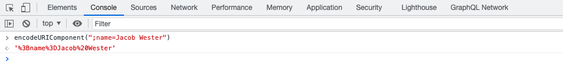

# 지속된 GraphQL 쿼리

지속되는 쿼리는 Adobe Experience Manager(AEM) 서버에 저장된 쿼리입니다. 클라이언트는 쿼리 이름으로 HTTP GET 요청을 전송하여 실행할 수 있습니다. 이 접근 방식의 이점은 캐시성입니다. 클라이언트측 GraphQL 쿼리는 캐시할 수 없는 HTTP POST 요청을 사용하여 실행할 수도 있지만 HTTP 캐시 또는 CDN에서 지속적인 쿼리를 캐시할 수 있으므로 성능을 향상시킬 수 있습니다. 지속되는 쿼리를 사용하면 쿼리가 서버에 캡슐화되고 AEM 관리자가 요청을 완전히 제어하므로 요청을 단순화하고 보안을 향상시킬 수 있습니다. AEM GraphQL API를 사용할 때는 지속적인 쿼리를 사용하는 것이 좋습니다.

이전 장에서는 고급 GraphQL 쿼리를 탐색하여 WKND 앱에 대한 데이터를 수집했습니다. 이 장에서는 이러한 쿼리를 AEM에 유지하고 업데이트하며, 지속적인 쿼리에 캐시 제어를 사용하는 방법을 알아봅니다.

## 전제 조건 {#prerequisites}

이 문서는 여러 부분으로 구성된 자습서의 일부입니다. 이 장을 진행하기 전에 이전 장이 완료되었는지 확인하십시오.

이 자습서에서는 을 사용합니다 [포스트맨](https://www.postman.com/) http 요청을 실행하려면 를 클릭합니다. 이 장을 시작하기 전에 서비스에 등록했는지 확인하십시오. 또한 이 자습서에서는 컬렉션을 설정하고, 변수를 만들고, 요청을 수행하는 방법과 같은 Postman 앱에 대한 작업 지식이 필요합니다. 에 대한 자세한 내용은 Postman 설명서를 참조하십시오. [요청 작성](https://learning.postman.com/docs/sending-requests/requests/) 및 [첫 번째 요청 보내기](https://learning.postman.com/docs/getting-started/sending-the-first-request/) 를 참조하십시오.

이 장에서 이전 장에서 탐색한 쿼리는 AEM으로 유지됩니다. 이러한 표준 GraphQL 쿼리로 텍스트 파일을 다운로드할 수 있습니다 [여기](assets/graphql-persisted-queries/advanced-concepts-aem-headless-graphql-queries.txt) 쉽게 참조할 수 있습니다.

## 목표 {#objectives}

이 장에서는 다음 방법을 알아봅니다.

* 매개 변수를 사용하여 GraphQL 쿼리 유지
* 지속되는 쿼리 업데이트
* 지속되는 쿼리에 cache-control 매개 변수 사용

## 지속되는 쿼리 개요

이 비디오에서는 GraphQL 쿼리를 유지하고 업데이트하며 캐시 제어를 사용하는 방법에 대한 개요를 제공합니다.

>[!VIDEO](https://video.tv.adobe.com/v/340036/?quality=12&learn=on)

## 지속되는 쿼리 활성화

먼저 AEM 인스턴스의 WKND 사이트 프로젝트에 대해 지속적인 쿼리가 활성화되어 있는지 확인합니다.

1. 다음으로 이동 **도구** > **일반** > **구성 브라우저**.

1. 선택 **WKND 사이트**&#x200B;를 선택하고 을 선택합니다. **속성** 위쪽 탐색 막대에서 구성 속성을 엽니다.

   

   구성 속성 페이지에서 **GraphQL 영구 쿼리** 사용 권한이 활성화되어 있습니다.

   

## Postman Collection 가져오기

자습서를 보다 쉽게 따를 수 있도록 Postman 컬렉션이 제공됩니다. 또는 다음과 같은 명령줄 도구 `curl` 사용할 수 있습니다.

1. 다운로드 및 설치 [포스트맨](https://www.postman.com/)
1. 다운로드 [AdvancedConcepts ofAEMHeadless.postman_collection.json](/help/headless-tutorial/graphql/advanced-graphql/assets/tutorial-files/AdvancedConceptsofAEMHeadless.postman_collection.json)
1. Postman 앱을 엽니다.
1. 선택 **파일** > **가져오기** > **파일 업로드** 및 `AdvancedConceptsofAEMHeadless.postman_collection.json` 컬렉션을 가져오려면 다음을 수행하십시오.

   

### 인증

AEM 작성자 인스턴스에 대한 쿼리를 전송하려면 인증이 필요합니다. 이 자습서는 AEM as a Cloud Service 환경을 기반으로 하며 개발 토큰과 함께 베어러 인증을 사용합니다. Postman 컬렉션에 대한 인증을 구성하려면 다음 단계를 사용합니다.

1. 개발 토큰을 가져오려면 클라우드 개발자 콘솔로 이동하여 **통합** 탭을 선택하고 **로컬 개발 토큰 가져오기**.

   

1. Postman 컬렉션에서 **인증** 탭을 선택하고 **베어러 토큰** 에서 **유형** 드롭다운 메뉴 아래의 제품에서 사용할 수 있습니다.

   

1. 에 개발 토큰을 입력합니다. **토큰** 필드. 다음 섹션에 설명된 대로 토큰을 변수를 전달할 수 있습니다.

   

### 변수 {#variables}

인증 토큰 및 URI 구성 요소와 같은 값을 Postman 컬렉션 내의 변수를 통해 전달하여 프로세스를 단순화할 수 있습니다. 이 자습서의 경우 다음 단계를 사용하여 변수를 만듭니다.

1. 로 이동합니다 **변수** Postman 컬렉션 내에서 탭을 탭하고 다음 변수를 만듭니다.

   | 변수 | 값 |
   | --- | --- |
   | `AEM_SCHEME` | `https` |
   | `AEM_AUTH_TOKEN` | (개발 토큰) |
   | `AEM_HOST` | (AEM 인스턴스의 호스트 이름) |
   | `AEM_PROJECT` | `wknd` |

1. 만들려는 각 지속적인 쿼리에 변수를 추가할 수도 있습니다. 이 자습서에서 다음 쿼리를 유지합니다. `getAdventureAdministratorDetailsByAdministratorName`, `getTeamByAdventurePath`, `getLocationDetailsByLocationPath`, `getTeamMembersByAdventurePath`, `getLocationPathByAdventurePath`, 및 `getTeamLocationByLocationPath`.

   다음 변수를 만듭니다.

   * `AEM_GET_ADVENTURE_ADMINISTRATOR_DETAILS_BY_ADMINISTRATOR_NAME` : `adventure-administrator-details-by-administrator-name`
   * `AEM_GET_ADVENTURE_ADMINISTRATOR_DETAILS_BY_ADMINISTRATOR_NAME` : `adventure-administrator-details-by-administrator-name`
   * `AEM_GET_TEAM_LOCATION_BY_LOCATION_PATH` : `team-location-by-location-path`
   * `AEM_GET_TEAM_MEMBERS_BY_ADVENTURE_PATH` : `team-members-by-adventure-path`
   * `AEM_GET_LOCATION_DETAILS_BY_LOCATION_PATH` : `location-details-by-location-path`
   * `AEM_GET_LOCATION_PATH_BY_ADVENTURE_PATH` : `location-path-by-adventure-path`
   * `AEM_GET_TEAM_BY_ADVENTURE_PATH` : `team-by-adventure-path`

   완료되면, **변수** Postman 컬렉션의 탭은 다음과 유사해야 합니다.

   

## 매개 변수를 사용하여 GraphQL 쿼리 유지

에서 [AEM 헤드리스 및 GraphQL 비디오 시리즈](../video-series/graphql-persisted-queries.md)에서는 지속되는 GraphQL 쿼리를 만드는 방법을 알아보았습니다. 이 섹션에서 매개 변수를 사용하여 GraphQL 쿼리를 지속하고 실행하겠습니다.

### 지속되는 쿼리 만들기 {#create-persisted-query}

이 예에서는 를 지속하겠습니다. `getAdventureAdministratorDetailsByAdministratorName` 이전 장에서 만든 쿼리를 쿼리합니다.

>[!NOTE]
>
>HTTP PUT 메서드는 지속되는 쿼리를 만드는 데 사용되고 HTTP POST 메서드를 사용하여 이 쿼리를 업데이트합니다.

1. 먼저 Postman 컬렉션 내에 새 요청을 추가합니다. HTTP PUT 메서드를 선택하여 지속형 쿼리를 만들고 다음 요청 URI를 사용합니다.

   ```plaintext
   {{AEM_SCHEME}}://{{AEM_HOST}}/graphql/persist.json/{{AEM_PROJECT}}/{{AEM_GET_ADVENTURE_ADMINISTRATOR_DETAILS_BY_ADMINISTRATOR_NAME}}
   ```

   URI는 `/graphql/persist.json` 작업.

1. 붙여넣기 `getAdventureAdministratorDetailsByAdministratorName` 요청 본문에 GraphQL 쿼리를 추가합니다. 변수가 있는 표준 GraphQL 질의입니다 `name` 필요한 경우 `String`.

   

1. 요청을 실행합니다. 다음 응답을 수신해야 합니다.

   

   이름이 인 지속된 쿼리를 만들었습니다. `adventure-administrator-details-by-administrator-name`.

### 지속된 쿼리 실행

생성한 지속된 쿼리를 실행하겠습니다.

1. 다음 요청 URI를 사용하여 Postman 컬렉션 내에서 새 GET 요청을 만듭니다.

   ```plaintext
   {{AEM_SCHEME}}://{{AEM_HOST}}/graphql/execute.json/{{AEM_PROJECT}}/{{AEM_GET_ADVENTURE_ADMINISTRATOR_DETAILS_BY_ADMINISTRATOR_NAME}}
   ```

   이제 요청 URI에 `execute.json` 작업.

   이 요청을 그대로 실행하면 쿼리에 변수가 필요하므로 오류가 발생합니다 `name`. 이 변수를 요청 URI에 매개 변수로 전달해야 합니다.

   

1. 그런 다음 Jacob Wester라는 이름으로 관리자를 검색합니다. 지속된 GraphQL 쿼리의 매개 변수는 `;` 및 를 인코딩한 후에 요청 URI로 전달합니다. 브라우저 콘솔에서 다음 명령을 실행합니다.

   ```js
   encodeURIComponent(";name=Jacob Wester")
   ```

   

1. 콘솔에서 결과를 복사하여 Postman의 요청 URI 끝에 붙여넣습니다. 다음 요청 URI가 있어야 합니다.

   ```plaintext
   {{AEM_SCHEME}}://{{AEM_HOST}}/graphql/execute.json/{{AEM_PROJECT}}/{{AEM_GET_ADVENTURE_ADMINISTRATOR_DETAILS_BY_ADMINISTRATOR_NAME}}%3Bname%3DJacob%20Wester
   ```

1. GET 요청을 실행합니다. 다음 응답을 수신해야 합니다.

   

이제 매개 변수를 사용하여 지속된 GraphQL 쿼리를 만들고 실행했습니다.

위에 요약된 단계에 따라 GraphQL 쿼리의 나머지 부분을 [텍스트 파일](assets/graphql-persisted-queries/advanced-concepts-aem-headless-graphql-queries.txt) 에서 만든 변수 사용 [이 장의 시작](#variables).

전체 [Postman 콜렉션](/help/headless-tutorial/graphql/advanced-graphql/assets/tutorial-files/AdvancedConceptsofAEMHeadless.postman_collection.json) 을 다운로드하여 가져올 수도 있습니다.

## 지속되는 쿼리 업데이트

PUT 요청을 사용하여 지속되는 쿼리를 만드는 동안 기존의 지속적인 쿼리를 업데이트하려면 POST 요청을 사용해야 합니다. 이 자습서에서 다음과 같은 지속된 쿼리를 업데이트하겠습니다. `adventure-administrator-details-by-administrator-name` 생성하신 [이전 섹션](#create-persisted-query).

1. 이전 섹션에서 PUT 요청에 사용한 탭을 복제합니다. 복사본에서 HTTP 메서드를 POST으로 변경합니다.

1. GraphQL 쿼리에서 `plaintext` 형식에서 `administratorDetails` 필드.

   

1. 요청을 실행합니다. 다음 응답이 표시됩니다.

   

이제 을(를) 업데이트했습니다 `adventure-administrator-details-by-administrator-name` 지속형 쿼리입니다. 변경한 경우 AEM에서 항상 GraphQL 쿼리를 업데이트해야 합니다.

## 지속되는 쿼리에서 캐시 제어 매개 변수 전달 {#cache-control-all-adventures}

AEM GraphQL API를 사용하면 성능 향상을 위해 쿼리에 캐시 제어 매개 변수를 추가할 수 있습니다.

를 사용하십시오 `getAllAdventureDetails` 이전 장에서 생성된 쿼리입니다. 쿼리 응답이 커서 쿼리 응답을 제어하는 것이 유용합니다 `age` 캐시에 저장

이 지속적인 쿼리는 나중에 를 업데이트하는 데 사용됩니다 [클라이언트 애플리케이션](/help/headless-tutorial/graphql/advanced-graphql/client-application-integration.md).

1. Postman 컬렉션에서 새 변수를 만듭니다.

   ```plaintext
   AEM_GET_ALL_AT_ONCE: all-adventure-details
   ```

1. 이 쿼리를 유지하려면 새 PUT 요청을 만듭니다.

1. 에서 **본문** 요청의 탭에서 을 선택합니다. **원시** 데이터 유형.

   

1. 쿼리에서 캐시 컨트롤을 사용하려면 쿼리를 JSON 구조로 래핑하고 끝에 캐시 제어 매개 변수를 추가해야 합니다. 다음 쿼리를 복사하여 요청 본문에 붙여넣습니다.

   ```json
   {
   "query": " query getAllAdventureDetails($fragmentPath: String!) { adventureByPath(_path: $fragmentPath){ item { _path adventureTitle adventureActivity adventureType adventurePrice adventureTripLength adventureGroupSize adventureDifficulty adventurePrice adventurePrimaryImage{ ...on ImageRef{ _path mimeType width height } } adventureDescription { html json } adventureItinerary { html json } location { _path name description { html json } contactInfo{ phone email } locationImage{ ...on ImageRef{ _path } } weatherBySeason address{ streetAddress city state zipCode country } } instructorTeam { _metadata{ stringMetadata{ name value } } teamFoundingDate description { json } teamMembers { fullName contactInfo { phone email } profilePicture{ ...on ImageRef { _path } } instructorExperienceLevel skills biography { html } } } administrator { fullName contactInfo { phone email } biography { html } } } _references { ...on ImageRef { _path mimeType } ...on LocationModel { _path __typename } } } }", 
   "cache-control": { "max-age": 300 }
   }
   ```

   >[!CAUTION]
   >
   >래핑된 쿼리에는 줄 바꿈을 포함하지 않아야 합니다.

   이제 요청은 다음과 같이 표시됩니다.

   

1. 요청을 실행합니다. 에 대한 `all-adventure-details` 지속형 쿼리를 만들었습니다.

   

## 축하합니다!

축하합니다! 이제 매개 변수로 GraphQL 쿼리를 유지하고, 지속적인 쿼리를 업데이트하고, 지속적인 쿼리와 함께 캐시 제어 매개 변수를 사용하는 방법을 알아보았습니다.

## 다음 단계

에서 [다음 장](/help/headless-tutorial/graphql/advanced-graphql/client-application-integration.md)로 지정하는 경우 WKND 앱에서 지속적인 쿼리에 대한 요청을 구현합니다.

이 자습서에서는 선택 사항이지만 실제 프로덕션 상황에서 모든 콘텐츠를 게시해야 합니다. AEM의 작성 및 게시 환경에 대한 검토는 다음을 참조하십시오. [AEM 헤드리스 및 GraphQL 비디오 시리즈](../video-series/author-publish-architecture.md).