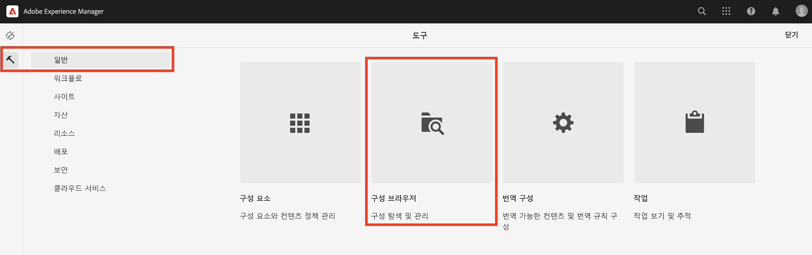
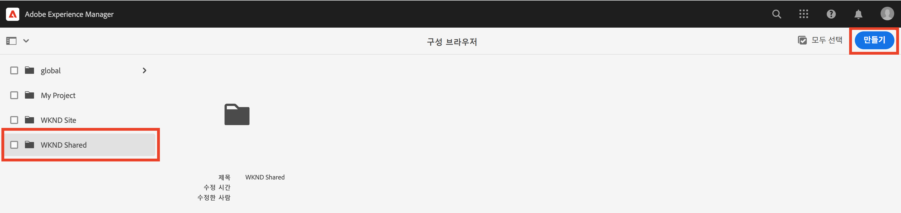
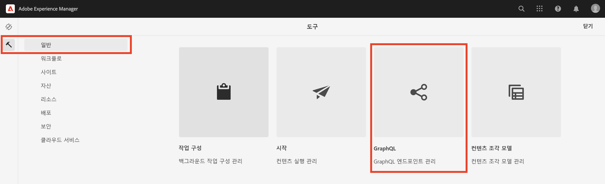
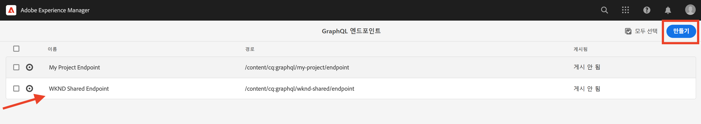
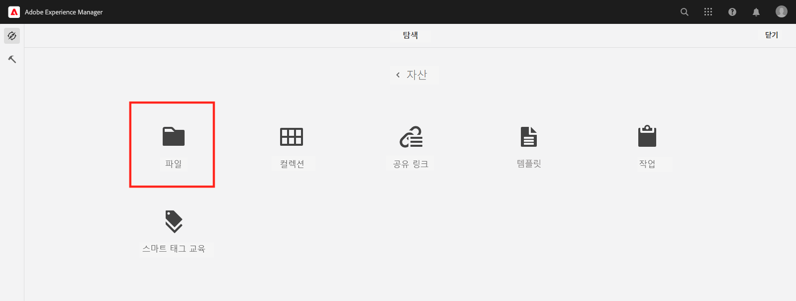
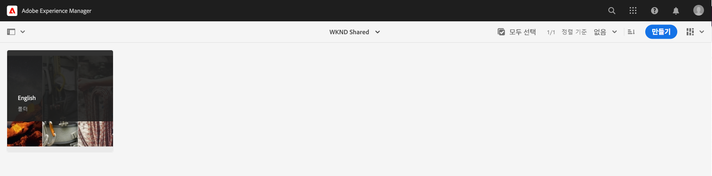
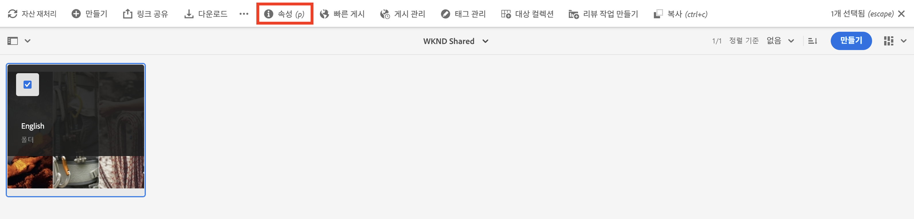
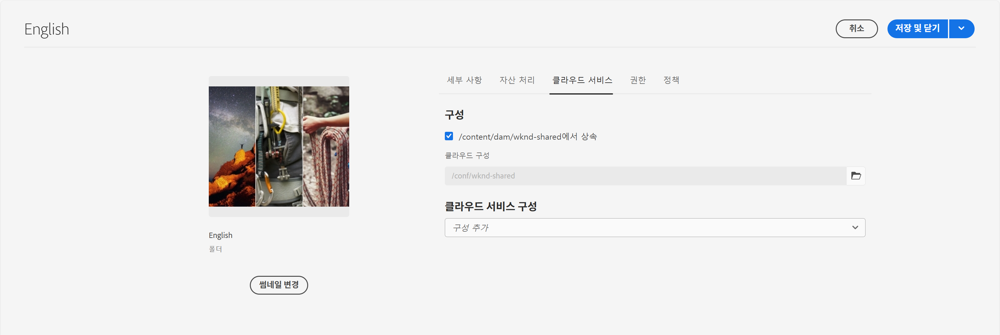

# AEM Headless의 고급 개념

이 엔드 투 엔드 튜토리얼은 [기본 자습서](../multi-step/overview.md) Adobe Experience Manager(AEM) 헤드리스 및 GraphQL의 기본 사항을 다룹니다. 고급 자습서에서는 클라이언트 응용 프로그램에서 GraphQL 지속적인 쿼리를 사용하는 것을 비롯하여 컨텐츠 조각 모델, 컨텐츠 조각 및 AEM GraphQL 지속적인 쿼리를 사용하는 심층적인 측면을 보여줍니다.

## 사전 요구 사항

을(를) 완료합니다 [AEM as a Cloud Service 빠른 설정](../quick-setup/cloud-service.md) AEM as a Cloud Service 환경을 구성하려면 다음을 수행하십시오.

이전 버전을 완료하는 것이 좋습니다 [기본 자습서](../multi-step/overview.md) 및 [비디오 시리즈](../video-series/modeling-basics.md) 이 고급 자습서를 계속하기 전에 자습서를 사용하십시오. 로컬 AEM 환경을 사용하여 자습서를 완료할 수 있지만 이 자습서에서는 AEM as a Cloud Service용 워크플로우만 다룹니다.

>[!CAUTION]
>
>AEM as a Cloud Service 환경에 액세스할 수 없는 경우 완료할 수 있습니다 [로컬 SDK를 사용하여 AEM Headless 빠른 설정](https://experienceleague.adobe.com/docs/experience-manager-learn/getting-started-with-aem-headless/graphql/quick-setup/local-sdk.html). 그러나 컨텐츠 조각 탐색과 같은 일부 제품 UI 페이지가 다른 점에 유의해야 합니다.

## 목표

이 자습서에서는 다음 주제를 다룹니다.

* 유효성 검사 규칙을 사용하여 컨텐츠 조각 모델을 만들고 탭 자리 표시자, 중첩된 조각 참조, JSON 개체 및 날짜 및 시간 데이터 유형과 같은 고급 데이터 유형을 만듭니다.
* 중첩된 컨텐츠 및 조각 참조를 사용하여 작업하는 동안 컨텐츠 조각을 작성하고 컨텐츠 조각 작성 거버넌스에 대한 폴더 정책을 구성합니다.
* 변수 및 지시어와 함께 GraphQL 쿼리를 사용하여 AEM GraphQL API 기능을 탐색합니다.
* AEM에서 매개 변수와 함께 GraphQL 쿼리를 유지하고 지속적인 쿼리에 캐시 제어 매개 변수를 사용하는 방법을 알아봅니다.
* AEM 헤드리스 JavaScript SDK를 사용하여 지속된 쿼리에 대한 요청을 샘플 WKND GraphQL React 앱에 통합합니다.

## AEM Headless 개요의 고급 개념

다음 비디오에서는 이 자습서에서 다루는 개념에 대한 개요 정보를 제공합니다. 이 자습서에는 고급 데이터 유형을 사용하는 컨텐츠 조각 모델 정의, 컨텐츠 조각 중첩 및 AEM에서 GraphQL 쿼리 지속도 포함됩니다.

>[!VIDEO](https://video.tv.adobe.com/v/340035/?quality=12&learn=on)

>[!CAUTION]
>
>이 비디오(2:25)에서는 패키지 관리자를 통해 GraphQL 쿼리 편집기를 설치하여 GraphQL 쿼리를 탐색하는 방법에 대해 설명합니다. 그러나 최신 버전의 AEM as a Cloud Service에서는 기본 제공 **GraphiQL 탐색기** 이 제공되므로 패키지를 설치할 필요가 없습니다. 자세한 내용은 [GraphiQL IDE 사용](https://experienceleague.adobe.com/docs/experience-manager-cloud-service/content/headless/graphql-api/graphiql-ide.html) 추가 정보.

## 프로젝트 설정

WKND 사이트 프로젝트에는 모든 필요한 구성이 있으므로 자습서를 완료한 후 바로 시작할 수 있습니다. [빠른 설정](../quick-setup/cloud-service.md). 이 섹션에서는 AEM 헤드리스 프로젝트를 만들 때 사용할 수 있는 몇 가지 중요한 단계만 강조 표시합니다.

### 기존 구성 검토

AEM에서 새 프로젝트를 시작하는 첫 번째 단계는 작업 공간으로 구성을 만들고 GraphQL API 엔드포인트를 만드는 것입니다. 구성을 검토하거나 만들려면 다음 위치로 이동합니다. **도구** > **일반** > **구성 브라우저**.

다음을 확인합니다. `WKND Shared` 자습서에 대한 사이트 구성이 이미 생성되었습니다. 고유한 프로젝트에 대한 구성을 만들려면 을(를) 선택합니다 **만들기** 오른쪽 상단 모서리에서 구성 만들기 모달에서 나타나는 양식을 작성합니다.

### GraphQL API 엔드포인트 검토

다음으로 GraphQL 쿼리를 전송하도록 API 엔드포인트를 구성해야 합니다. 기존 끝점을 검토하거나 만들려면 다음 위치로 이동합니다. **도구** > **일반** > **GraphQL**.

다음을 확인합니다. `WKND Shared Endpoint` 은(는) 이미 만들었습니다. 프로젝트에 대한 끝점을 만들려면 을(를) 선택합니다 **만들기** 오른쪽 상단 모서리에서 워크플로우를 따릅니다.

>[!NOTE]
>
> 엔드포인트를 저장한 후에는 엔드포인트에 대한 액세스를 구성하려는 경우 보안 설정을 조정할 수 있는 보안 콘솔 방문에 대한 모달이 표시됩니다. 그러나 보안 권한 자체는 이 자습서의 범위를 벗어납니다. 자세한 내용은 [AEM 설명서](https://experienceleague.adobe.com/docs/experience-manager-64/administering/security/security.html).

### WKND 컨텐츠 구조 및 언어 루트 폴더 검토

잘 정의된 컨텐츠 구조는 AEM 헤드리스 구현의 성공과 직결됩니다. 이는 컨텐츠의 확장성, 유용성 및 권한 관리에 유용합니다.

언어 루트 폴더는 EN 또는 FR와 같은 ISO 언어 코드가 있는 폴더입니다. AEM 번역 관리 시스템은 이러한 폴더를 사용하여 콘텐츠 번역을 위한 콘텐츠 및 언어의 기본 언어를 정의합니다.

이동 **탐색** > **자산** > **파일**.

로 이동합니다. **WKND 공유** 폴더를 입력합니다. &quot;English&quot;라는 제목과 &quot;EN&quot;이라는 이름으로 폴더를 관찰합니다. 이 폴더는 WKND 사이트 프로젝트의 언어 루트 폴더입니다.

고유한 프로젝트의 경우 구성 내에 언어 루트 폴더를 만듭니다. 의 섹션을 참조하십시오. [폴더 만들기](/help/headless-tutorial/graphql/advanced-graphql/author-content-fragments.md#create-folders) 자세한 내용

### 중첩된 폴더에 구성 할당

마지막으로 프로젝트의 구성을 언어 루트 폴더에 할당해야 합니다. 이 할당을 사용하면 프로젝트의 구성에 정의된 컨텐츠 조각 모델을 기반으로 컨텐츠 조각을 만들 수 있습니다.

구성에 언어 루트 폴더를 할당하려면 폴더를 선택한 다음 **속성** 를 클릭합니다.

을 선택하십시오

다음으로 이동하여 **Cloud Services** 탭을 선택하고 **클라우드 구성** 필드.

표시되는 모달에서 앞에서 만든 구성을 선택하여 언어 루트 폴더를 지정합니다.

### 우수 사례

다음은 AEM에서 고유한 프로젝트를 만들 때 모범 사례입니다.

* 폴더 계층 구조는 현지화 및 번역을 염두에 두고 모델링해야 합니다. 즉, 언어 폴더를 구성 폴더 내에 중첩하여 구성 폴더 내의 컨텐츠를 쉽게 변환할 수 있습니다.
* 폴더 계층 구조가 간단하고 평평하게 유지되어야 합니다. 조각 참조 및 GraphQL 쿼리에 영향을 줄 수 있는 경로를 변경하므로 나중에 라이브 사용을 위해 게시 후 폴더 및 조각을 이동하거나 이름을 변경하지 마십시오.

## 초보자 및 솔루션 패키지

두 개의 AEM **패키지** 사용 가능하며 [패키지 관리자](/help/headless-tutorial/graphql/advanced-graphql/author-content-fragments.md#sample-content)

* [Advanced-GraphQL-Tutorial-Starter-Package-1.1.zip](/help/headless-tutorial/graphql/advanced-graphql/assets/tutorial-files/Advanced-GraphQL-Tutorial-Starter-Package-1.1.zip) 는 나중에 튜토리얼에서 사용되며 샘플 이미지와 폴더를 포함합니다.
* [Advanced-GraphQL-Tutorial-Solution-Package-1.2.zip](/help/headless-tutorial/graphql/advanced-graphql/assets/tutorial-files/Advanced-GraphQL-Tutorial-Solution-Package-1.2.zip) 에는 새 컨텐츠 조각 모델, 컨텐츠 조각 및 지속적인 GraphQL 쿼리를 포함하여 1-4장에 대해 완료된 솔루션이 포함되어 있습니다. 바로 을 건너뛸 사용자에게 유용합니다. [클라이언트 애플리케이션 통합](/help/headless-tutorial/graphql/advanced-graphql/client-application-integration.md) 제2장.

다음 **React 앱 - 고급 자습서 - WKND Adventures**(https://github.com/adobe/aem-guides-wknd-graphql/blob/main/advanced-tutorial/README.md) 프로젝트를 사용하여 샘플 애플리케이션을 검토하고 탐색할 수 있습니다. 이 샘플 애플리케이션은 지속된 GraphQL 쿼리를 호출하여 AEM에서 컨텐츠를 검색하고 몰입형 환경에서 렌더링합니다.

## 시작하기

이 고급 자습서를 시작하려면 다음 단계를 수행하십시오.

1. 을 사용하여 개발 환경 설정 [AEM as a Cloud Service](../quick-setup/cloud-service.md).
1. 다음에서 자습서 장 시작 [컨텐츠 조각 모델 만들기](/help/headless-tutorial/graphql/advanced-graphql/create-content-fragment-models.md).
