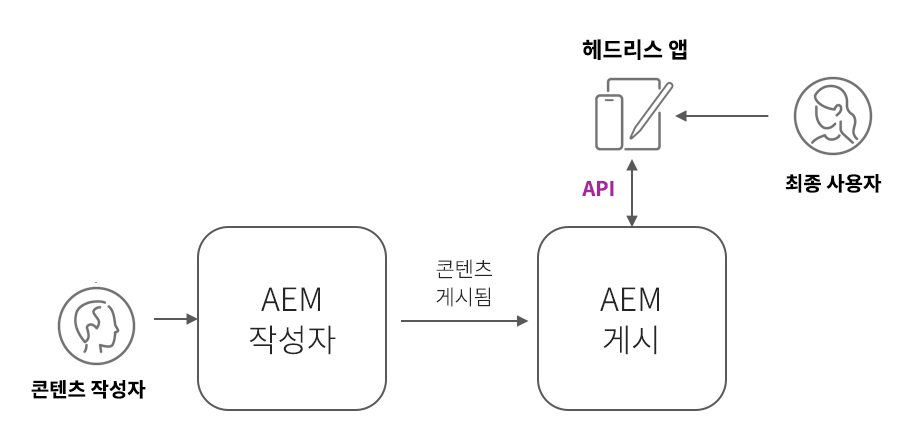

# AEM Headless 배포

AEM Headless 클라이언트 배포에는 AEM 호스팅 SPA, 외부 SPA, 웹 사이트, 모바일 앱 또는 서버 간 프로세스와 같은 많은 양식이 사용됩니다.

AEM Headless 배포는 클라이언트와 배포 방법에 따라 고려 사항이 다릅니다.

## AEM 서비스 아키텍처

배포 고려 사항을 살펴보기 전에 AEM 논리 아키텍처와 AEMas a Cloud Service 의 서비스 계층의 분리 및 역할을 이해해야 합니다. AEM as a Cloud Service은 두 가지 논리 서비스로 구성됩니다.

+ __AEM 작성자__ 는 팀에서 콘텐츠 조각(및 기타 에셋)을 만들고, 공동 작업하고, 게시하는 서비스입니다.
+ __AEM 게시__ 은 게시된 콘텐츠 조각(및 기타 에셋)이 일반 소비를 위해 복제되는 서비스입니다.
+ __AEM 미리 보기__ 은 AEM 게시 동작을 모방하지만 미리보기 또는 검토 목적으로 게시된 콘텐츠가 있는 서비스입니다. AEM 미리 보기는 내부 대상자를 위한 것이며 콘텐츠의 일반 전달을 위한 것이 아닙니다. 원하는 워크플로에 따라 AEM 미리보기 는 선택 사항입니다.

일반적인 AEM as a Cloud Service Headless 배포 아키텍처_

프로덕션 용량으로 작동하는 AEM Headless 클라이언트는 일반적으로 승인된 게시된 콘텐츠가 포함된 AEM 게시와 상호 작용합니다. AEM Author는 기본적으로 안전하며 모든 요청에 대한 승인이 필요하며 진행 중인 작업 또는 승인되지 않은 콘텐츠도 포함할 수 있으므로 AEM Author와 상호 작용하는 클라이언트는 특별히 주의해야 합니다.

## 헤드리스 클라이언트 배포

    <!-- Single-page App (SPA) -->
    

       

           

               <figure class="image is-16by9">
                   
               </figure>
           

           

               

                   
<a href="./spa.md" title="단일 페이지 앱(SPA)">단일 페이지 앱(SPA)</a>

                   
단일 페이지 앱(SPA)의 배포 고려 사항에 대해 알아봅니다.

                   <a href="./spa.md" class="spectrum-Button spectrum-Button--outline spectrum-Button--primary spectrum-Button--sizeM">
                       학습
                   </a>
               

           

       

    

<!-- Web component/JS -->

   

       

           <figure class="image is-16by9">
               
           </figure>
       

       

           

               
<a href="./web-component.md" title="웹 구성 요소/JS">웹 구성 요소/JS</a>

               
웹 구성 요소 및 브라우저 기반 JavaScript Headless 소비자에 대한 배포 고려 사항에 대해 알아봅니다.

               <a href="./web-component.md" class="spectrum-Button spectrum-Button--outline spectrum-Button--primary spectrum-Button--sizeM">
                   학습
               </a>
           

       

   

<!-- Mobile apps -->

   

       

           <figure class="image is-16by9">
               
           </figure>
       

       

           

               
<a href="./mobile.md" title="모바일 앱">모바일 앱</a>

               
모바일 앱의 배포 고려 사항에 대해 알아봅니다.

               <a href="./mobile.md" class="spectrum-Button spectrum-Button--outline spectrum-Button--primary spectrum-Button--sizeM">
                   학습
               </a>
           

       

   

<!-- Server-to-server apps -->

   

       

           <figure class="image is-16by9">
               
           </figure>
       

       

           

               
<a href="./server-to-server.md" title="서버 간 앱">서버 간 앱</a>

               
서버 간 앱에 대한 배포 고려 사항에 대해 알아봅니다

               <a href="./server-to-server.md" class="spectrum-Button spectrum-Button--outline spectrum-Button--primary spectrum-Button--sizeM">
                   학습
               </a>
           

       

   

