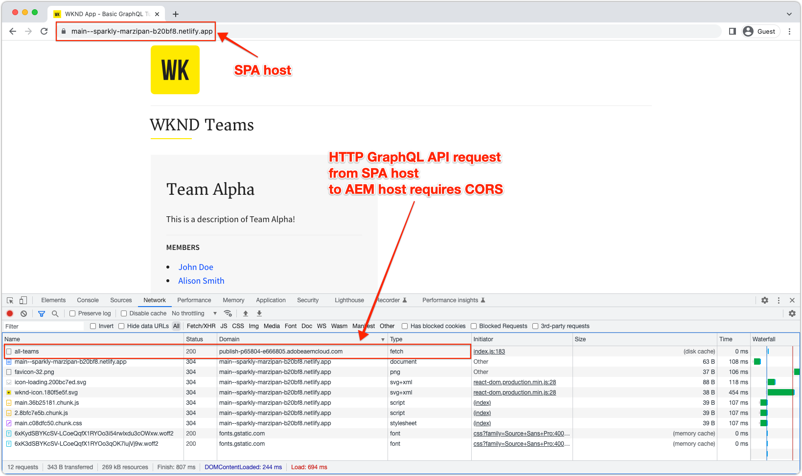

# AEM Headless SPA 배포

AEM Headless 단일 페이지 앱(SPA) 배포에는 React 또는 Vue와 같은 프레임워크를 사용하여 빌드된 JavaScript 기반 애플리케이션이 포함되며, 이러한 애플리케이션은 Headless 방식으로 AEM의 콘텐츠를 소비하고 상호 작용합니다.

Headless 방식으로 AEM과 상호 작용하는 SPA 배포에는 SPA을 호스팅하고 웹 브라우저를 통해 액세스할 수 있도록 하는 작업이 포함됩니다.

## SPA 호스팅

SPA은 기본 웹 리소스의 컬렉션으로 구성됩니다. **HTML, CSS 및 JavaScript**. 이러한 리소스는 _빌드_ 프로세스(예: `npm run build`) 최종 사용자가 사용할 수 있도록 호스트에 배포됩니다.

다양합니다 **호스팅** 조직의 요구 사항에 따른 옵션:

1. **클라우드 공급자** 과 같은 **Azure** 또는 **AWS**.

2. **온프레미스** 기업 호스팅 **데이터 센터**

3. **프론트엔드 호스팅 플랫폼** 과 같은 **AWS Amplify**, **Azure 앱 서비스**, **Netlify**, **헤로쿠**, **베르셀**&#x200B;등

## 배포 구성

AEM Headless와 상호 작용하는 SPA을 호스팅할 때 주로 고려해야 할 사항은 AEM 도메인(또는 호스트)을 통해 또는 다른 도메인에서 SPA에 액세스하는지 여부입니다.  그 이유는 SPA이 웹 브라우저에서 실행되는 웹 애플리케이션이므로 웹 브라우저 보안 정책의 적용을 받기 때문입니다.

### 공유 도메인

SPA과 AEM은 동일한 도메인에서 최종 사용자가 둘 다 액세스할 때 도메인을 공유합니다. 예:

+ AEM은 다음을 통해 액세스됩니다. `https://wknd.site/`
+ SPA은 를 통해 액세스됩니다. `https://wknd.site/spa`

AEM과 SPA은 동일한 도메인에서 액세스되므로 웹 브라우저를 사용하면 SPA이 CORS 없이도 AEM Headless 종단점으로 XHR을 만들고 HTTP 쿠키(예: AEM)를 공유할 수 있습니다 `login-token` cookie).

SPA 및 AEM 트래픽이 공유 도메인에서 라우팅되는 방법은 여러 출처가 있는 CDN, 역방향 프록시가 있는 HTTP 서버, SPAAEM 에서 직접 호스팅 등입니다.

다음은 AEM과 동일한 도메인에서 호스팅되는 경우 SPA 프로덕션 배포에 필요한 배포 구성입니다.

| SPA이에 연결 | AEM Author | AEM 게시 | AEM 미리 보기 |
|---------------------------------------------------:|:----------:|:-----------:|:-----------:|
| [Dispatcher 필터](./configurations/dispatcher-filters.md) | ✘ | ✔ | ✔ |
| CORS(원본 간 리소스 공유) | ✘ | ✘ | ✘ |
| AEM 호스트 | ✘ | ✘ | ✘ |

### 다른 도메인

SPA 및 AEM에는 다른 도메인의 최종 사용자가 액세스할 때 다른 도메인이 있습니다. 예:

+ AEM은 다음을 통해 액세스됩니다. `https://wknd.site/`
+ SPA은 를 통해 액세스됩니다. `https://wknd-app.site/`

AEM 및 SPA은 서로 다른 도메인에서 액세스되므로 웹 브라우저는 다음과 같은 보안 정책을 적용합니다. [CORS(원본 간 리소스 공유)](./configurations/cors.md)및 HTTP 쿠키(예: AEM) 공유 방지 `login-token` cookie).

다음은 AEM이 아닌 다른 도메인에서 호스팅되는 경우 SPA 프로덕션 배포에 필요한 배포 구성입니다.

| SPA이에 연결 | AEM Author | AEM 게시 | AEM 미리 보기 |
|---------------------------------------------------:|:----------:|:-----------:|:-----------:|
| [Dispatcher 필터](./configurations/dispatcher-filters.md) | ✘ | ✔ | ✔ |
| [CORS(원본 간 리소스 공유)](./configurations/cors.md) | ✔ | ✔ | ✔ |
| [AEM 호스트](./configurations/aem-hosts.md) | ✔ | ✔ | ✔ |

#### 다른 도메인에서의 SPA 배포 예

이 예에서 SPA은 Netlify 도메인에 배포됩니다(`https://main--sparkly-marzipan-b20bf8.netlify.app/`) SPA은 AEM 게시 도메인의 AEM GraphQL API( )를 사용합니다.`https://publish-p65804-e666805.adobeaemcloud.com`). 아래 스크린샷은 CORS 요구 사항을 강조합니다.

1. SPA은 Netlify 도메인에서 제공되지만 다른 도메인의 AEM GraphQL API에 대해 XHR을 호출합니다. 이 사이트 간 요청에는 다음이 필요합니다 [CORS](./configurations/cors.md) Netlify 도메인의 콘텐츠 액세스 요청을 허용하도록 AEM에 설정.

   

2. AEM GraphQL API에 대한 XHR 요청 검사 `Access-Control-Allow-Origin` 이 웹 브라우저에 표시되고, AEM이 이 Netlify 도메인의 콘텐츠 액세스 요청을 허용함을 나타냅니다.

   AEM이면 [CORS](./configurations/cors.md) 이(가) 없거나 Netlify 도메인을 포함하지 않음, 웹 브라우저에서 XHR 요청에 실패하고 CORS 오류가 보고되었습니다.

   

## 단일 페이지 앱 예

Adobe은 React로 코딩된 단일 페이지 앱의 예를 제공합니다.

<!-- React app -->

   

       

           <figure class="image is-16by9">
               
           </figure>
       

       

           

               
<a href="../example-apps/react-app.md" title="React 앱">React 앱</a>

               
AEM Headless GraphQL API의 콘텐츠를 사용하는 React로 작성된 단일 페이지 앱의 예입니다.

               <a href="../example-apps/react-app.md" class="spectrum-Button spectrum-Button--outline spectrum-Button--primary spectrum-Button--sizeM">
                   보기 예
               </a>
           

       

   

<!-- Next.js app -->

   

       

           <figure class="image is-16by9">
               
           </figure>
       

       

           

               
<a href="../example-apps/next-js.md" title="Next.js 앱">Next.js 앱</a>

               
AEM Headless GraphQL API의 콘텐츠를 사용하는 Next.js로 작성된 단일 페이지 앱의 예입니다.

               <a href="../example-apps/next-js.md" class="spectrum-Button spectrum-Button--outline spectrum-Button--primary spectrum-Button--sizeM">
                   보기 예
               </a>
           

       

   

