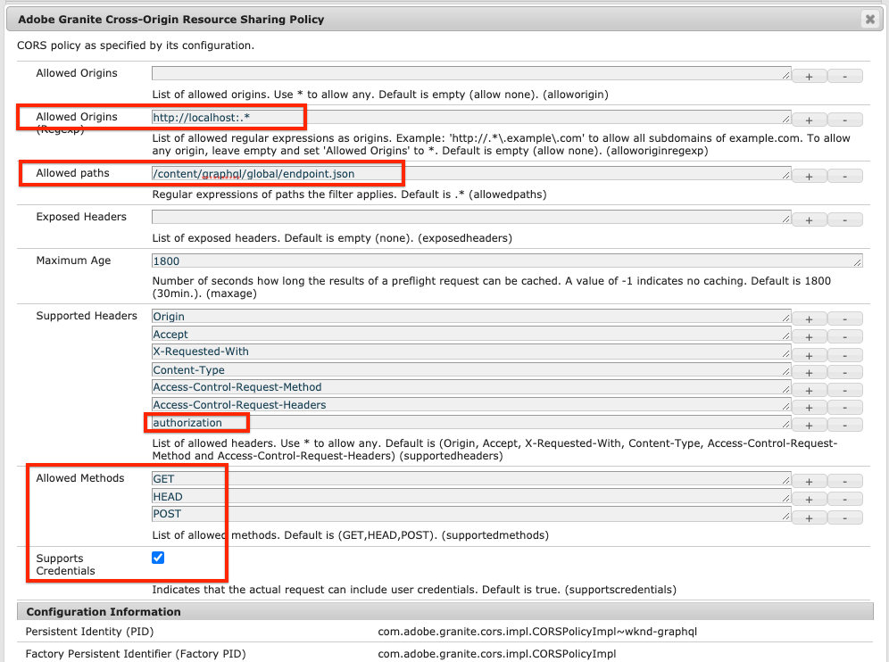

# React 앱

예제 애플리케이션은 AEM(Adobe Experience Manager)의 헤드리스 기능을 살펴보는 좋은 방법입니다. AEM의 GraphQL API를 사용하여 컨텐츠를 쿼리하는 방법을 보여 주는 React 애플리케이션이 제공됩니다. JavaScript용 AEM 헤드리스 클라이언트는 앱을 구동하는 GraphQL 쿼리를 실행하는 데 사용됩니다.

보기 [GitHub의 소스 코드](https://github.com/adobe/aem-guides-wknd-graphql/tree/main/react-app)


단계별 전체 자습서를 사용할 수 있습니다 [여기](https://experienceleague.adobe.com/docs/experience-manager-learn/getting-started-with-aem-headless/graphql/multi-step/overview.html).

## 전제 조건 {#prerequisites}

다음 도구는 로컬에 설치해야 합니다.

* [JDK 11](https://experience.adobe.com/#/downloads/content/software-distribution/en/general.html?1_group.propertyvalues.property=.%2Fjcr%3Acontent%2Fmetadata%2Fdc%3AsoftwareType&amp;1_group.propertyvalues.operation=equals&amp;1_group.propertyvalues.0_values=software-type%3Atologing&amp;fulltext=Oracle%7E+JDK%7E+11%7E&amp;orderby=%40jcr%3Acontent%3AlastModified&amp;orderby.sort=desc&amp;layout=0&amp;p.offset=0&amp;p.limit=0&amp;limit=1)
* [Node.js v10+](https://nodejs.org/en/)
* [npm 6+](https://www.npmjs.com/)
* [Git](https://git-scm.com/)

## AEM 요구 사항

응용 프로그램은 AEM에 연결하도록 설계되었습니다 **작성자** 또는 **게시** 최신 릴리스가 있는 환경 [WKND 참조 사이트](https://github.com/adobe/aem-guides-wknd/releases/latest) 설치되었습니다.

* [AEM as a Cloud Service](https://experienceleague.adobe.com/docs/experience-manager-cloud-service/overview/introduction.html)
* [AEM 6.5.10+](https://experienceleague.adobe.com/docs/experience-manager-65/release-notes/service-pack/new-features-latest-service-pack.html?lang=ko-KR)

추천합니다 [Cloud Service 환경에 WKND 참조 사이트 배포](https://experienceleague.adobe.com/docs/experience-manager-cloud-service/implementing/deploying/overview.html#coding-against-the-right-aem-version). 을 사용하여 로컬 설정 [AEM Cloud Service SDK](https://experienceleague.adobe.com/docs/experience-manager-learn/cloud-service/local-development-environment-set-up/overview.html) 또는 [AEM 6.5 QuickStart jar](https://experienceleague.adobe.com/docs/experience-manager-learn/foundation/development/set-up-a-local-aem-development-environment.html?lang=en#install-local-aem-instances) 사용할 수도 있습니다.

## 사용 방법

1. 복제 `aem-guides-wknd-graphql` 저장소:

   ```shell
   git clone git@github.com:adobe/aem-guides-wknd-graphql.git
   ```

1. 편집 `aem-guides-wknd/react-app/.env.development` 파일 및 `REACT_APP_HOST_URI` target AEM 인스턴스를 가리킵니다. 인증 방법을 업데이트합니다(작성자 인스턴스에 연결하는 경우).

   ```plain
   # Server namespace
   REACT_APP_HOST_URI=http://localhost:4503
   REACT_APP_GRAPHQL_ENDPOINT=/content/graphql/global/endpoint.json
   #AUTH (Choose one method)
   # Authentication methods: 'service-token', 'dev-token', 'basic' or leave blank to use no authentication
   ...
   ```

1. 터미널을 열고 다음 명령을 실행합니다.

   ```shell
   $ cd aem-guides-wknd-graphql/react-app
   $ npm install
   $ npm start
   ```
1. 새 브라우저 창이 로드되어야 함 [http://localhost:3000](http://localhost:3000)
1. WKND 참조 사이트의 모험 목록이 애플리케이션에 표시되어야 합니다.

## 코드

다음은 애플리케이션 전원을 지원하는 데 사용되는 중요한 파일 및 코드에 대한 간략한 요약 정보입니다. 전체 코드는 [GitHub](https://github.com/adobe/aem-guides-wknd-graphql).

### JavaScript용 AEM Headless 클라이언트

다음 [AEM Headless 클라이언트](https://github.com/adobe/aem-headless-client-js) GraphQL 쿼리를 실행하는 데 사용됩니다. AEM Headless 클라이언트는 쿼리를 실행하는 두 가지 방법을 제공합니다. [`runQuery`](https://github.com/adobe/aem-headless-client-js/blob/main/api-reference.md#aemheadlessrunqueryquery-options--promiseany) 및 [`runPersistedQuery`](https://github.com/adobe/aem-headless-client-js/blob/main/api-reference.md#aemheadlessrunpersistedquerypath-variables-options--promiseany).

`runQuery` AEM 컨텐츠에 대한 표준 GraphQL 쿼리를 실행하며 가장 일반적인 쿼리 실행 유형입니다.

[지속되는 쿼리](https://experienceleague.adobe.com/docs/experience-manager-learn/getting-started-with-aem-headless/graphql/video-series/graphql-persisted-queries.html) GraphQL 쿼리 결과를 캐시한 다음 GET에서 결과를 사용할 수 있도록 하는 AEM의 기능입니다. 지속형 쿼리는 반복해서 실행되는 일반적인 쿼리에 사용해야 합니다. 이 응용 프로그램에서 Adventure 목록은 홈 화면에서 실행되는 첫 번째 쿼리입니다. 이 쿼리는 매우 인기 있는 쿼리이므로 지속된 쿼리를 사용해야 합니다. `runPersistedQuery` 지속된 쿼리 끝점에 대해 요청을 실행합니다.

`src/api/useGraphQL.js` is [반응 효과 후크](https://reactjs.org/docs/hooks-overview.html#effect-hook) 매개 변수에 대한 변경 사항을 수신하는 `query` 및 `path`. If `query` 이 비어 있으면 을 기반으로 하여 지속적인 쿼리가 사용됩니다. `path`. 다음은 AEM Headless 클라이언트가 구성되어 데이터를 가져오는 데 사용되는 위치입니다.

```js
function useGraphQL(query, path) {
    let [data, setData] = useState(null);
    let [errorMessage, setErrors] = useState(null);

    useEffect(() => {
      // construct a new AEMHeadless client based on the graphQL endpoint
      const sdk = new AEMHeadless({ endpoint: REACT_APP_GRAPHQL_ENDPOINT })

      // if query is not null runQuery otherwise fall back to runPersistedQuery
      const request = query ? sdk.runQuery.bind(sdk) : sdk.runPersistedQuery.bind(sdk);

      request(query || path)
        .then(({ data, errors }) => {
          //If there are errors in the response set the error message
          if(errors) {
            setErrors(mapErrors(errors));
          }
          //If data in the response set the data as the results
          if(data) {
            setData(data);
          }
        })
        .catch((error) => {
          setErrors(error);
        });
    }, [query, path]);

    return {data, errorMessage}
}
```

### 어드벤처 콘텐츠

이 앱은 주로 모험 목록을 표시하며 사용자에게 모험의 세부 사항을 클릭하는 옵션을 제공합니다.

`Adventures.js` - 모험카드 목록을 표시합니다.  초기 상태는 [지속되는 쿼리](https://experienceleague.adobe.com/docs/experience-manager-learn/getting-started-with-aem-headless/graphql/video-series/graphql-persisted-queries.html) 다음 중 [사전 패키지](https://github.com/adobe/aem-guides-wknd/tree/master/ui.content/src/main/content/jcr_root/conf/wknd/settings/graphql/persistentQueries/adventures-all/_jcr_content) WKND 참조 사이트 사용. 끝점은 다음과 같습니다. `/wknd/adventures-all`. 사용자가 활동을 기반으로 필터링 결과를 실험해 볼 수 있는 버튼이 몇 가지 있습니다.

```javascript
function filterQuery(activity) {
  return `
    {
      adventureList (filter: {
        adventureActivity: {
          _expressions: [
            {
              value: "${activity}"
            }
          ]
        }
      }){
        items {
          _path
        adventureTitle
        adventurePrice
        adventureTripLength
        adventurePrimaryImage {
          ... on ImageRef {
            _path
            mimeType
            width
            height
          }
        }
      }
    }
  }
  `;
}
```

`AdventureDetail.js` - Adventure의 세부 보기를 표시합니다. url에서 구문 분석되는 모험의 경로를 기반으로 graphQL 쿼리를 만듭니다.

```javascript
//parse the content fragment from the url
const contentFragmentPath = props.location.pathname.substring(props.match.url.length);
...
function adventureDetailQuery(_path) {
  return `{
    adventureByPath (_path: "${_path}") {
      item {
        _path
          adventureTitle
          adventureActivity
          adventureType
          adventurePrice
          adventureTripLength
          adventureGroupSize
          adventureDifficulty
          adventurePrice
          adventurePrimaryImage {
            ... on ImageRef {
              _path
              mimeType
              width
              height
            }
          }
          adventureDescription {
            html
          }
          adventureItinerary {
            html
          }
      }
    }
  }
  `;
}
```

### 환경 변수

몇 개 [환경 변수](https://create-react-app.dev/docs/adding-custom-environment-variables) 이 프로젝트에서 AEM 환경에 연결하는 데 사용됩니다. 기본값은 http://localhost:4502에서 실행되는 AEM 작성 환경에 연결합니다. 이 동작을 변경하려면 `.env.development` 이에 따라 다음을 수행합니다.

* `REACT_APP_HOST_URI=http://localhost:4502` - AEM 타겟 호스트로 설정
* `REACT_APP_GRAPHQL_ENDPOINT=/content/graphql/global/endpoint.json` - GraphQL 끝점 경로 설정
* `REACT_APP_AUTH_METHOD=` - 기본 인증 방법입니다. 선택 사항이며, 기본적으로 인증이 사용되지 않습니다.
   * `service-token` - Cloud Env PROD에 서비스 토큰 교환 사용
   * `dev-token` - Cloud Env를 사용하여 로컬 개발에 개발 토큰 사용
   * `basic` - 로컬 작성자 Env를 사용하여 로컬 개발에 사용자/전달 사용
   * 인증 방법을 사용하지 않도록 하려면 비워 둡니다.
* `REACT_APP_AUTHORIZATION=admin:admin` - AEM 작성자 환경에 연결하는 경우 사용할 기본 인증 자격 증명을 설정합니다(개발용). 게시 환경에 연결하는 경우에는 이 설정이 필요하지 않습니다.
* `REACT_APP_DEV_TOKEN` - 개발 토큰 문자열입니다. 원격 인스턴스에 연결하려면 기본 인증(user:pass) 옆의 클라우드 콘솔에서 DEV 토큰과 함께 베어러 인증을 사용할 수 있습니다
* `REACT_APP_SERVICE_TOKEN` - 서비스 토큰 파일의 경로입니다. 원격 인스턴스에 연결하기 위해 서비스 토큰으로 인증을 수행할 수도 있습니다(클라우드 콘솔에서 파일 다운로드)

### 프록시 API 요청

웹 팩 개발 서버 사용 시(`npm start`) 프로젝트에 [프록시 설정](https://create-react-app.dev/docs/proxying-api-requests-in-development/#configuring-the-proxy-manually) 사용 `http-proxy-middleware`. 파일은에서 구성됩니다. [src/setupProxy.js](https://github.com/adobe/aem-guides-wknd-graphql/blob/main/react-app/src/setupProxy.js) 및은(는) `.env` 및 `.env.development`.

AEM 작성 환경에 연결하는 경우 해당 인증 방법을 구성해야 합니다.

### CORS - 원본 간 리소스 공유

이 프로젝트는 target AEM 환경에서 실행되는 CORS 구성을 사용하며 개발 모드에서 앱이 http://localhost:3000에서 실행되고 있다고 가정합니다. 다음 [코어 구성](https://github.com/adobe/aem-guides-wknd/blob/master/ui.config/src/main/content/jcr_root/apps/wknd/osgiconfig/config.author/com.adobe.granite.cors.impl.CORSPolicyImpl~wknd-graphql.cfg.json) 의 일부입니다. [WKND 참조 사이트](https://github.com/adobe/aem-guides-wknd).



*작성 환경에 대한 샘플 CORS 구성*