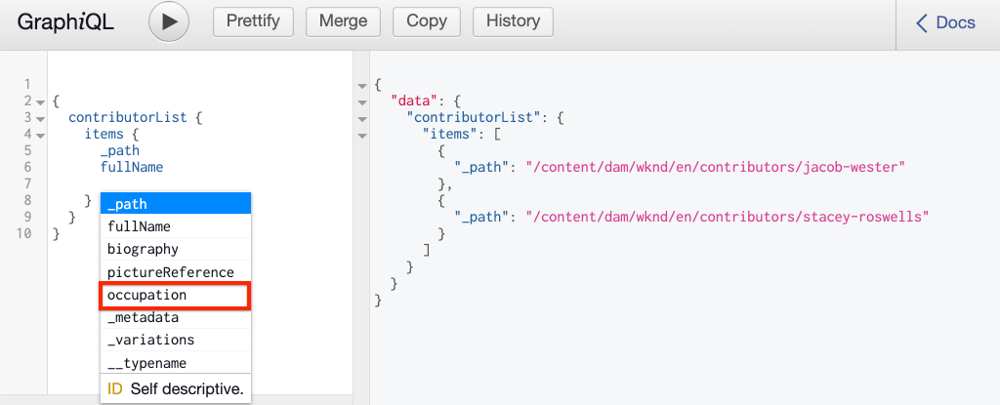

# GraphQL API 탐색 {#explore-graphql-apis}

>[!CAUTION]
>
> 컨텐츠 조각 전달용 AEM GraphQL API는 2021년 초에 릴리스됩니다.
> 관련 설명서는 미리 볼 수 있습니다.

AEM의 GraphQL API는 콘텐츠 조각의 데이터를 다운스트림 애플리케이션에 표시하는 강력한 쿼리 언어를 제공합니다. 컨텐츠 조각 모델은 컨텐츠 조각에서 사용되는 데이터 스키마를 정의합니다. 컨텐츠 조각 모델을 생성하거나 업데이트할 때마다 스키마가 번역되어 GraphQL API를 구성하는 &quot;그래프&quot;에 추가됩니다.

이 장에서는 몇 가지 일반적인 GraphQL 쿼리를 통해 컨텐츠를 수집합니다. AEM에 내장된 IDE는 [GraphiQL](https://github.com/graphql/graphiql)입니다. GraphiQL IDE를 사용하면 반환된 쿼리 및 데이터를 신속하게 테스트하고 세분화할 수 있습니다. GraphiQL은 문서에 손쉽게 액세스할 수 있으므로 사용 가능한 방법을 손쉽게 파악하고 파악할 수 있습니다.

## 전제 조건 {#prerequisites}

이 자습서는 다중 부분으로 구성된 자습서이며 [컨텐츠 조각 작성](./author-content-fragments.md)에 설명된 단계가 완료되었다고 가정합니다.

## 목표 {#objectives}

* GrapiQL 도구를 사용하여 GraphQL 구문을 사용하여 쿼리를 구성하는 방법을 알아봅니다.
* 컨텐츠 조각 및 단일 컨텐츠 조각 목록을 쿼리하는 방법을 알아봅니다.
* 특정 데이터 속성을 필터링하고 요청하는 방법을 알아봅니다.
* 컨텐츠 조각 변형을 쿼리하는 방법을 알아봅니다.
* 여러 컨텐츠 조각 모델의 쿼리에 참여하는 방법 알아보기

## 콘텐츠 조각 목록 쿼리 {#query-list-cf}

여러 컨텐츠 조각을 쿼리하는 것이 일반적인 요구 사항입니다.

1. [http://localhost:4502/content/graphiql.html](http://localhost:4502/content/graphiql.html)의 GraphiQL IDE로 이동합니다.
1. 왼쪽 패널(주석 목록 아래)에 다음 쿼리를 붙여 넣습니다.

   ```graphql
   {
     contributorList {
       items {
           _path
         }
     }
   }
   ```

1. 상단 메뉴에서 **재생** 단추를 눌러 쿼리를 실행합니다. 기여자 컨텐츠 조각에 대한 결과는 이전 장에서 확인할 수 있습니다.

   

1. 커서를 `_path` 텍스트 아래에 놓고 **CTRL+Space**&#x200B;를 입력하여 코드 힌트를 트리거합니다. 쿼리에 `fullName` 및 `occupation`을 추가합니다.

   

1. **Play** 단추를 눌러 쿼리를 다시 실행하면 `fullName` 및 `occupation`의 추가 속성이 결과에 포함됩니다.

   

   `fullName` 간단한  `occupation` 속성 [컨텐츠 조각 모델 정의 장에서 `fullName` 및 `occupation`은 각 필드의 **속성 이름**&#x200B;을 정의할 때 사용되는 값입니다.](./content-fragment-models.md)

1. `pictureReference` 보다 복잡한 필드를  `biography` 나타냅니다. `pictureReference` 및 `biography` 필드에 대한 데이터를 반환하려면 쿼리를 다음으로 업데이트하십시오.

   ```graphql
   {
   contributorList {
       items {
         _path
         fullName
         occupation
         biography {
           html
         }
         pictureReference {
           ... on ImageRef {
               _path
               width
               height
               }
           }
       }
     }
   }
   ```

   `biography` 는 여러 줄로 된 텍스트 필드이며 GraphQL API를 사용하여  `html`또는  `markdown`  `json`   `plaintext`같은 결과를 위한 다양한 형식을 선택할 수 있습니다.

   `pictureReference` 는 컨텐츠 참조이고 이미지여야 하므로 내장  `ImageRef` 개체가 사용됩니다. 따라서 참조되는 이미지에 대한 추가 데이터를 요청할 수 있습니다(예: `width` 및 `height`).

1. 그런 다음 **Adventure** 목록을 쿼리하여 다양하게 실험합니다. 다음 쿼리를 실행합니다.

   ```graphql
   {
     adventureList {
       items {
         adventureTitle
         adventureType
         adventurePrimaryImage {
           ...on ImageRef {
             _path
             mimeType
           }
         }
       }
     }
   }
   ```

   반환된 **Adventure** 목록이 표시됩니다. 쿼리에 필드를 추가하면 자유롭게 시도해 볼 수 있습니다.

## 컨텐츠 조각 목록 필터링 {#filter-list-cf}

다음으로 속성 값을 기반으로 결과를 컨텐츠 조각 하위 세트로 필터링할 수 있는 방법을 살펴보겠습니다.

1. GraphiQL UI에 다음 쿼리를 입력합니다.

   ```graphql
   {
   contributorList(filter: {
     occupation: {
       _expressions: {
         value: "Photographer"
         }
       }
     }) {
       items {
         _path
         fullName
         occupation
       }
     }
   }
   ```

   위의 쿼리는 시스템의 모든 작성자에 대해 검색을 수행합니다. 쿼리 시작 부분에 추가된 필터는 `occupation` 필드와 문자열 &quot;**Photographer**&quot;에 대한 비교를 수행합니다.

1. 쿼리를 실행하면 단일 **기여자**&#x200B;만 반환됩니다.
1. `adventureActivity`이 **&quot;Surfing&quot;**&#x200B;과 같지 않은 **Adventure**&#x200B;의 목록을 쿼리하려면 다음 쿼리를 입력하십시오.****

   ```graphql
   {
     adventureList(filter: {
       adventureActivity: {
           _expressions: {
               _operator: EQUALS_NOT
               value: "Surfing"
           }
       }
   }) {
       items {
       _path
       adventureTitle
       adventureActivity
       }
     }
   }
   ```

1. 쿼리를 실행하고 결과를 검사합니다. 결과 중 `adventureType`과(와) 동일한 **&quot;Surfing&quot;**&#x200B;이(가) 포함되어 있지 않습니다.

복잡한 쿼리를 필터링하고 만드는 다른 여러 옵션이 있지만 위의 몇 가지 예는 다음과 같습니다.

## 단일 컨텐츠 조각 쿼리 {#query-single-cf}

단일 컨텐츠 조각을 직접 쿼리할 수도 있습니다. AEM의 컨텐츠는 계층적 방식으로 저장되며 조각의 고유 식별자는 조각의 경로를 기반으로 합니다. 목표가 단일 조각에 대한 데이터를 반환하려는 경우 경로를 사용하고 모델을 직접 쿼리하는 것이 좋습니다. 이 구문을 사용하면 쿼리의 복잡도가 매우 낮을 뿐만 아니라 더 빠른 결과를 생성할 수 있습니다.

1. GraphiQL 편집기에 다음 쿼리를 입력합니다.

   ```graphql
   {
    contributorByPath(_path: "/content/dam/wknd/en/contributors/stacey-roswells") {
       item {
         _path
         fullName
         biography {
           html
         }
       }
     }
   }
   ```

1. 쿼리를 실행하고 **Stacey Roswels** 조각의 단일 결과가 반환되는지 확인합니다.

   이전 연습에서는 필터를 사용하여 결과 목록의 범위를 좁혔습니다. 유사한 구문을 사용하여 경로별로 필터링할 수 있지만 성능상의 이유로 위의 구문을 사용하는 것이 좋습니다.

1. **Stacey Roswels**&#x200B;에 대해 **요약**&#x200B;변형이 만들어졌다는 [컨텐츠 조각 작성](./author-content-fragments.md) 장에서 다시 호출합니다. 쿼리를 업데이트하여 **요약** 변형을 반환합니다.

   ```graphql
   {
   contributorByPath
   (
       _path: "/content/dam/wknd/en/contributors/stacey-roswells"
       variation: "summary"
   ) {
       item {
         _path
         fullName
         biography {
           html
         }
       }
     }
   }
   ```

   변형에 이름이 **Summary**&#x200B;인 경우에도 변형이 소문자로 유지되므로 `summary`가 사용됩니다.

1. 쿼리를 실행하고 `biography` 필드에 훨씬 짧은 `html` 결과가 포함되어 있음을 확인합니다.

## 여러 컨텐츠 조각 모델 쿼리 {#query-multiple-models}

또한 별도의 쿼리를 단일 쿼리로 결합할 수도 있습니다. 이 기능은 응용 프로그램의 전원을 끄는 데 필요한 HTTP 요청 수를 최소화하기 위해 유용합니다. 예를 들어 응용 프로그램의 *홈* 보기에서는 **두 개의**&#x200B;다른 컨텐츠 조각 모델을 기반으로 컨텐츠를 표시할 수 있습니다. **두 개의**&#x200B;개의 별도 쿼리를 실행하는 대신 쿼리를 하나의 요청으로 결합할 수 있습니다.

1. GraphiQL 편집기에 다음 쿼리를 입력합니다.

   ```graphql
   {
     adventureList {
       items {
         _path
         adventureTitle
       }
     }
     contributorList {
       items {
         _path
         fullName
       }
     }
   }
   ```

1. 쿼리를 실행하고 결과 세트에 **Adventure** 및 **Contributors**&#x200B;의 데이터가 포함되어 있는지 확인합니다.

```json
{
  "data": {
    "adventureList": {
      "items": [
        {
          "_path": "/content/dam/wknd/en/adventures/bali-surf-camp/bali-surf-camp",
          "adventureTitle": "Bali Surf Camp"
        },
        {
          "_path": "/content/dam/wknd/en/adventures/beervana-portland/beervana-in-portland",
          "adventureTitle": "Beervana in Portland"
        },
        ...
      ]
    },
    "contributorList": {
      "items": [
        {
          "_path": "/content/dam/wknd/en/contributors/jacob-wester",
          "fullName": "Jacob Wester"
        },
        {
          "_path": "/content/dam/wknd/en/contributors/stacey-roswells",
          "fullName": "Stacey Roswells"
        }
      ]
    }
  }
}
```

## 축하합니다!{#congratulations}

축하합니다. GraphQL 쿼리를 여러 개 만들고 실행하셨습니다.

## 다음 단계 {#next-steps}

다음 장, [반응형 앱](./graphql-and-external-app.md)에서 AEM을 쿼리하는 경우 외부 응용 프로그램이 AEM GraphQL 끝점을 쿼리하는 방법을 살펴보십시오. 샘플 WKND GraphQL React 앱을 수정하여 필터링 GraphQL 쿼리를 추가함으로써 앱 사용자가 활동별로 모험을 필터링할 수 있도록 하는 외부 앱 또한 기본적인 오류 처리를 소개합니다.
