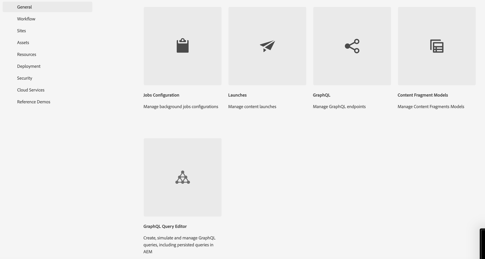

# 콘텐츠 모델링

Adobe Experience Manager(AEM)의 콘텐츠 조각 및 GraphQL 종단점에 대한 자습서 챕터를 시작합니다. 콘텐츠 조각 활용, 조각 모델 생성 및 AEM의 GraphQL 엔드포인트 사용에 대해 설명합니다.

콘텐츠 조각 은 채널 전반의 콘텐츠를 관리하는 구조화된 접근 방식을 제공하여 유연성과 재사용성을 제공합니다. AEM에서 컨텐츠 조각을 활성화하면 모듈식 컨텐츠를 만들 수 있으므로 일관성과 적응성을 높일 수 있습니다.

먼저 AEM에서 컨텐츠 조각을 활성화하는 방법을 안내하고, 원활한 통합을 위해 필요한 구성 및 설정을 설명합니다.

다음으로 구조 및 속성을 정의하는 조각 모델 생성을 다룹니다. 콘텐츠 요구 사항에 맞게 모델을 설계하고 효과적으로 관리하는 방법에 대해 알아봅니다.

그런 다음 모델에서 콘텐츠 조각을 만드는 방법을 보여 주고 작성 및 게시에 대한 단계별 지침을 제공합니다.

또한 AEM GraphQL 종단점 정의에 대해 알아보겠습니다. GraphQL은 AEM에서 데이터를 효율적으로 검색하고 원하는 데이터를 노출하도록 끝점을 설정하고 구성합니다. 지속 쿼리는 성능 및 캐싱을 최적화합니다.

자습서 전체에서 설명, 코드 예제 및 실용적인 팁을 제공합니다. 결국 콘텐츠 조각을 활성화하고, 조각 모델을 생성하고, 조각을 생성하고, AEM GraphQL 끝점 및 지속 쿼리를 정의하는 기술을 갖게 됩니다. 시작해 보겠습니다!

## 컨텍스트 인식 구성

1. Headless 환경에 대한 구성을 만들려면 __도구 > 구성 브라우저__(으)로 이동합니다.

   

   __제목__ 및 __이름__&#x200B;을 제공하고 __GraphQL 지속 쿼리__ 및 __콘텐츠 조각 모델__&#x200B;을 확인하세요.


## 콘텐츠 조각 모델

1. __도구 > 콘텐츠 조각 모델__(으)로 이동하여 1단계에서 만든 구성 이름의 폴더를 선택합니다.

   

1. 폴더 내에서 __만들기__&#x200B;를 선택하고 모델 이름을 __티저__&#x200B;로 지정합니다. __티저__ 모델에 다음 데이터 형식을 추가하십시오.

   | 데이터 유형 | 이름 | 필수 | 옵션 |
   |----------|------|----------|---------|
   | 콘텐츠 참조 | 자산 | 예 | 원하는 경우 기본 이미지를 추가합니다. 예: /content/dam/wknd-headless/assets/AdobeStock_307513975.mp4 |
   | 한 줄 텍스트 | 제목 | 예 |
   | 한 줄 텍스트 | 사전 제목 | 아니오 |
   | 여러 줄 텍스트 | 설명 | 아니오 | 기본 유형이 서식 있는 텍스트인지 확인합니다. |
   | 열거 | 스타일 | 예 | 드롭다운으로 렌더링 옵션은 영웅 -> 영웅 및 추천 -> 추천 |

   

1. 폴더 내에서 __Offer__(이)라는 두 번째 모델을 만듭니다. 만들기 를 클릭하고 모델에 &quot;Offer&quot; 이름을 지정하고 다음 데이터 형식을 추가합니다.

   | 데이터 유형 | 이름 | 필수 | 옵션 |
   |----------|------|----------|---------|
   | 콘텐츠 참조 | 자산 | 예 | 기본 이미지를 추가합니다. 예: `/content/dam/wknd-headless/assets/AdobeStock_238607111.jpeg` |
   | 여러 줄 텍스트 | 설명 | 아니오 |  |
   | 여러 줄 텍스트 | 문서 | 아니오 |  |

   

1. 폴더 내에 __이미지 목록__(이)라는 세 번째 모델을 만듭니다. 만들기 를 클릭하고 모델에 &quot;이미지 목록&quot; 이름을 지정하고 다음 데이터 형식을 추가합니다.

   | 데이터 유형 | 이름 | 필수 | 옵션 |
   |----------|------|----------|---------|
   | 조각 참조 | 목록 항목 | 예 | 다중 필드로 렌더링합니다. 허용된 컨텐츠 조각 모델은 오퍼입니다. |

   

## 콘텐츠 조각

1. 이제 Assets 로 이동하여 새 사이트에 대한 폴더를 만듭니다. 만들기 를 클릭하고 폴더 이름을 지정합니다.

   

1. 폴더를 만든 후 폴더를 선택하고 __속성__&#x200B;을 엽니다.
1. 폴더의 __클라우드 구성__ 탭에서 [이전에 만든](#enable-content-fragments-and-graphql) 구성을 선택합니다.

   

   새 폴더를 클릭하고 티저를 만듭니다. __만들기__ 및 __콘텐츠 조각__&#x200B;을 클릭하고 __티저__ 모델을 선택합니다. 모델 이름을 __Hero__&#x200B;로 지정하고 __만들기__&#x200B;를 클릭합니다.

   | 이름 | 메모 |
   |----------|------|
   | 자산 | 기본값으로 유지하거나 다른 에셋(비디오 또는 이미지)을 선택합니다. |
   | 제목 | `Explore. Discover. Live.` |
   | 사전 제목 | `Join use for your next adventure.` |
   | 설명 | 비워 둡니다. |
   | 스타일 | `Hero` |

   

## GraphQL 엔드포인트

1. __도구 > GraphQL__(으)로 이동

   

1. __만들기__&#x200B;를 클릭하고 새 끝점에 이름을 지정한 다음 새로 만든 구성을 선택합니다.

   

## GraphQL 지속 쿼리

1. 새 엔드포인트를 테스트해 보겠습니다. __도구 > GraphQL 쿼리 편집기__(으)로 이동하여 창의 오른쪽 상단에서 드롭다운에 대한 끝점을 선택합니다.

1. 쿼리 편집기에서 몇 가지 다른 쿼리를 만듭니다.


   ```graphql
   {
       teaserList {
           items {
           title
           }
       }
   }
   ```

   [위](#create-content)에서 만든 단일 조각이 포함된 목록을 가져와야 합니다.

   이 연습에서는 AEM Headless 앱이 사용하는 전체 쿼리를 만듭니다. 경로별로 단일 티저를 반환하는 쿼리를 만듭니다. 쿼리 편집기에서 다음 쿼리를 입력합니다.

   ```graphql
   query TeaserByPath($path: String!) {
   component: teaserByPath(_path: $path) {
       item {
       __typename
       _path
       _metadata {
           stringMetadata {
           name
           value
           }
       }
       title
       preTitle
       style
       asset {
           ... on MultimediaRef {
           __typename
           _authorUrl
           _publishUrl
           format
           }
           ... on ImageRef {
           __typename
           _authorUrl
           _publishUrl
           mimeType
           width
           height
           }
       }
       description {
           html
           plaintext
       }
       }
   }
   }
   ```

   하단의 __쿼리 변수__ 입력에서 다음을 입력합니다.

   ```json
   {
       "path": "/content/dam/pure-headless/hero"
   }
   ```

   >[!NOTE]
   >
   > 폴더 및 조각 이름을 기반으로 쿼리 변수 `path`을(를) 조정해야 할 수 있습니다.


   쿼리를 실행하여 이전에 만든 콘텐츠 조각의 결과를 수신합니다.

1. 쿼리를 유지(저장)하고 쿼리 이름을 __티저__&#x200B;하려면 __저장__&#x200B;을 클릭하세요. 이를 통해 애플리케이션에서 이름별로 쿼리를 참조할 수 있습니다.

## 다음 단계

축하합니다! 콘텐츠 조각 및 GraphQL 종단점을 만들 수 있도록 AEM as a Cloud Service을 구성했습니다. 또한 콘텐츠 조각 모델 및 콘텐츠 조각을 만들고 GraphQL 엔드포인트 및 지속 쿼리를 정의했습니다. 이제 다음 튜토리얼 장으로 이동하여 이 장에서 만든 콘텐츠 조각 및 GraphQL 엔드포인트를 사용하는 AEM Headless React 애플리케이션을 만드는 방법을 배울 준비가 되었습니다.

[다음 장: AEM Headless API 및 반응](./2-aem-headless-apis-and-react.md)
