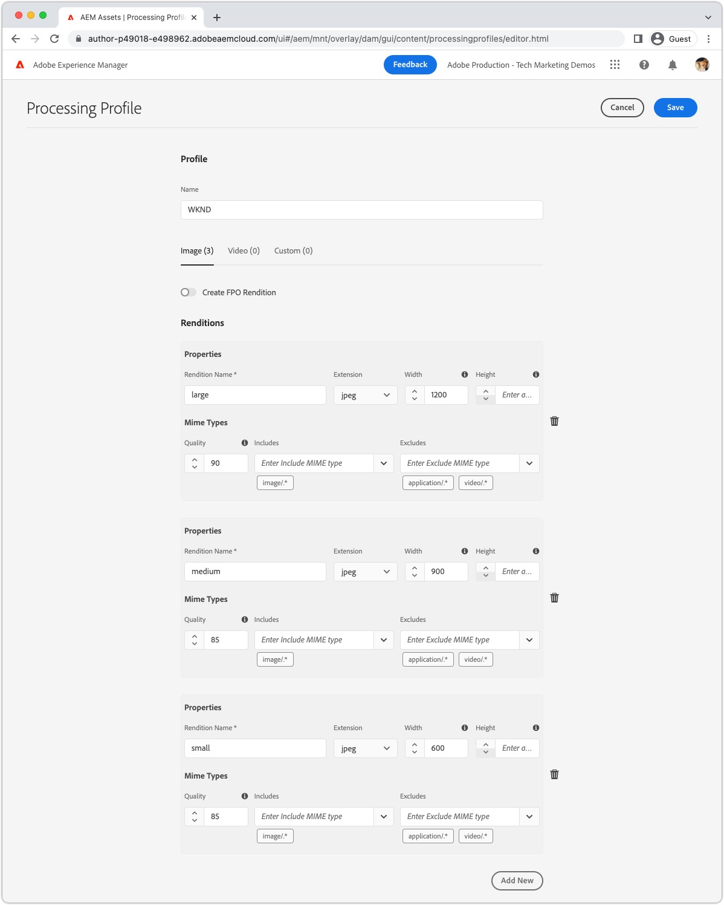
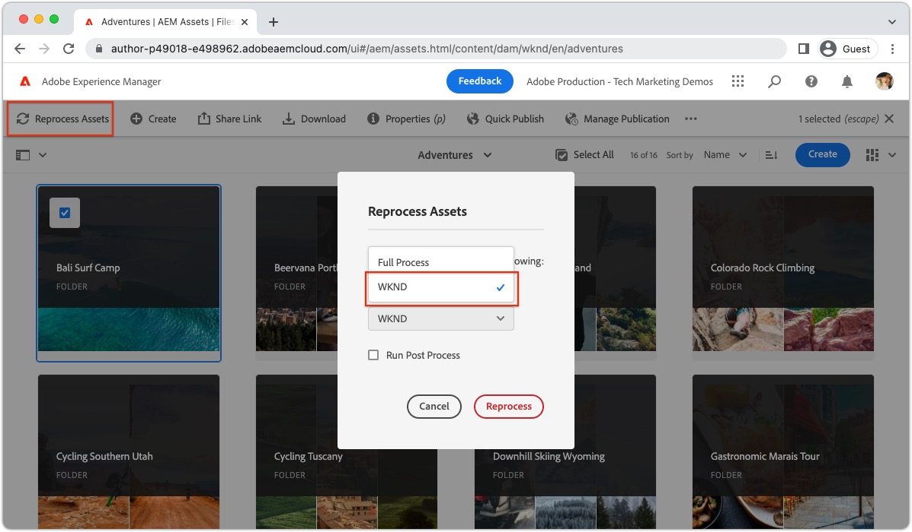

# AEM Headless를 사용한 이미지 {#images-with-aem-headless}

이미지는 [풍부하고 매력적인 AEM 헤드리스 환경 개발](https://experienceleague.adobe.com/docs/experience-manager-learn/getting-started-with-aem-headless/graphql/multi-step/overview.html?lang=ko-KR). AEM Headless는 이미지 자산 관리 및 최적화된 전달을 지원합니다.

AEM Headless 컨텐츠 모델링에서 사용되는 컨텐츠 조각으로서, 종종 헤드리스 경험에 표시하기 위한 이미지 자산을 참조합니다. AEM GraphQL 쿼리는 이미지가 참조되는 위치를 기반으로 이미지에 URL을 제공하도록 작성할 수 있습니다.

다음 `ImageRef` 유형에는 컨텐츠 참조에 대한 세 가지 URL 옵션이 있습니다.

+ `_path` 는 AEM에서 참조되는 경로이며 AEM 원본(호스트 이름)은 포함하지 않습니다
+ `_authorUrl` 는 AEM 작성자의 이미지 자산에 대한 전체 URL입니다
   + [AEM 작성자](https://experienceleague.adobe.com/docs/experience-manager-learn/cloud-service/underlying-technology/introduction-author-publish.html) 헤드리스 애플리케이션의 미리 보기 경험을 제공하는 데 사용할 수 있습니다.
+ `_publishUrl` 는 AEM 게시의 이미지 자산에 대한 전체 URL입니다
   + [AEM 게시](https://experienceleague.adobe.com/docs/experience-manager-learn/cloud-service/underlying-technology/introduction-author-publish.html) 일반적으로 헤드리스 애플리케이션의 프로덕션 배포에서 이미지를 표시하는 위치입니다.

필드는 다음 기준에 따라 가장 잘 사용됩니다.

| ImageRef 필드 | AEM에서 제공되는 클라이언트 웹 앱 | 클라이언트 앱 쿼리 AEM 작성자 | 클라이언트 앱 쿼리 AEM 게시 |
|--------------------|:------------------------------:|:-----------------------------:|:------------------------------:|
| `_path` | ✔ | ✔ (앱은 URL에 호스트를 지정해야 함) | ✔ (앱은 URL에 호스트를 지정해야 함) |
| `_authorUrl` | ✘ | ✔ | ✘ |
| `_publishUrl` | ✘ | ✘ | ✔ |

사용 `_authorUrl` 및 `_publishUrl` 는 GraphQL 응답을 소스로 지정하는 데 사용되는 AEM GraphQL 종단점과 일치해야 합니다.

>[!CONTEXTUALHELP]
>id="aemcloud_learn_headless_graphql_images"
>title="AEM Headless를 사용한 이미지"
>abstract="AEM Headless에서 이미지 자산 관리 및 최적화된 전달을 지원하는 방법을 알아봅니다."

## 콘텐츠 조각 모델

이미지 참조가 포함된 컨텐츠 조각 필드가 의 필드인지 확인합니다. __콘텐츠 참조__ 데이터 유형.

필드 유형은 [컨텐츠 조각 모델](https://experienceleague.adobe.com/docs/experience-manager-cloud-service/content/assets/content-fragments/content-fragments-models.html)를 클릭하여 필드를 선택하고 __속성__ 오른쪽에 있습니다.


## GraphQL 지속적인 쿼리

GraphQL 쿼리에서 필드를 `ImageRef` 을 입력하고 적절한 필드를 요청합니다 `_path`, `_authorUrl`, 또는 `_publishUrl` 애플리케이션에 필요합니다. 예를 들어, [WKND 참조 데모 프로젝트](https://experienceleague.adobe.com/docs/experience-manager-cloud-service/content/onboarding/demo-add-on/create-site.html) 이미지 자산 참조에 대한 이미지 URL을 포함합니다 `primaryImage` 필드, 새 지속적인 쿼리로 수행할 수 있습니다 `wknd-shared/adventure-image-by-path` 다음으로 정의:

```graphql
query ($path: String!) {
  adventureByPath(_path: $path) {
    item {
      title,
      primaryImage {
        ... on ImageRef {
          _path
          _authorUrl
          _publishUrl
        }
      }
    }
  }
}
```

다음 `$path` 변수를에서 `_path` 필터를 사용하려면 컨텐츠 조각의 전체 경로(예: `/content/dam/wknd-shared/en/adventures/bali-surf-camp/bali-surf-camp`).

## GraphQL 응답

결과 JSON 응답에는 이미지 자산에 대한 URL이 포함된 요청된 필드가 포함되어 있습니다.

```json
{
  "data": {
    "adventureByPath": {
      "item": {
        "adventurePrimaryImage": {
          "_path": "/content/dam/wknd-shared/en/adventures/bali-surf-camp/adobestock-175749320.jpg",
          "_authorUrl": "https://author-p123-e456.adobeaemcloud.com/content/dam/wknd-shared/en/adventures/bali-surf-camp/adobestock-175749320.jpg",
          "_publishUrl": "https://publish-p123-e789.adobeaemcloud.com/content/dam/wknd-shared/en/adventures/bali-surf-camp/adobestock-175749320.jpg"
        }
      }
    }
  }
}
```

응용 프로그램에서 참조된 이미지를 로드하려면 적절한 필드를 사용합니다. `_path`, `_authorUrl`, 또는 `_publishUrl` 의 `adventurePrimaryImage` 를 이미지의 소스 URL로 바꿉니다.

의 도메인 `_authorUrl` 및 `_publishUrl` 는 AEM as a Cloud Service에서 [외부 도우미](https://experienceleague.adobe.com/docs/experience-manager-cloud-service/content/implementing/developer-tools/externalizer.html).

React에서 AEM Publish의 이미지를 표시하는 모습은 다음과 같습니다.

```html

```

## 이미지 표현물

사용자 정의 가능한 이미지 자산 지원 [변환](../../../assets/authoring/renditions.md)- 원래 자산의 대체 표현입니다. 사용자 지정 렌디션은 헤드리스 환경을 최적화하는 데 도움이 될 수 있습니다. 헤드리스 애플리케이션에서 종종 큰 고해상도 파일인 원본 이미지 자산을 요청하는 대신 최적화된 렌디션을 요청할 수 있습니다.

### 표현물 만들기

AEM Assets 관리자는 처리 프로필을 사용하여 사용자 지정 표현물을 정의합니다. 그런 다음 처리 프로필을 특정 폴더 트리나 자산에 직접 적용하여 해당 자산에 대한 렌디션을 생성할 수 있습니다.

#### 처리 프로필

자산 표현물 사양은 [처리 프로필](../../../assets/configuring//processing-profiles.md) AEM Assets 관리자

처리 프로필을 만들거나 업데이트하고 헤드리스 애플리케이션에 필요한 이미지 크기에 대한 변환 정의를 추가합니다. 표현물의 이름은 무엇이든 지정할 수 있지만 의미상 이름을 지정해야 합니다.



이 예제에서는 다음 세 가지 표현물이 만들어집니다.

| 표현물 이름 | 확장 | 최대 너비 |
|----------------|:---------:|----------:|
| 큼 | jpeg | 1200px |
| 중간 | jpeg | 900px |
| 작음 | jpeg | 600px |

위의 표에서 호출된 속성은 중요합니다.

+ __표현물 이름__ 은 변환을 요청하는 데 사용됩니다.
+ __확장__ 는 를 요청하는 데 사용되는 확장입니다 __변환 이름__.
+ __최대 너비__ 헤드리스 애플리케이션에서 사용하는 렌디션을 기반으로 사용해야 하는 렌디션을 개발자에게 알려주는 데 사용됩니다.

표현물 정의는 헤드리스 애플리케이션의 필요에 따라 다르므로 사용 사례에 대한 최적의 표현물 세트를 정의하며, 사용 방식에 대해 의미적으로 이름이 지정됩니다.

#### 자산 재처리{#reprocess-assets}

처리 프로필이 만들어지거나 업데이트되면, 자산을 재처리하여 처리 프로필에 정의된 새 변환을 생성합니다. 자산이 처리 프로필로 처리될 때까지 새 표현물이 존재하지 않습니다.

+ 바람직하게는, [폴더에 처리 프로필 지정](../../../assets/configuring//processing-profiles.md) 따라서 이 폴더에 업로드된 모든 새 자산은 자동으로 표현물을 생성합니다. 기존 자산은 아래의 임시 방법을 사용하여 다시 처리해야 합니다.

+ 또는, 폴더 또는 자산을 선택하고, __자산 재처리__, 그리고 새 처리 프로필 이름 선택.

   

#### 표현물 검토

변환은 [자산의 표현물 보기 열기](../../../assets/authoring/renditions.md)를 클릭하고 표현물 레일에서 미리 볼 새 표현물을 선택합니다. 표현물이 누락된 경우 [처리 프로필을 사용하여 자산이 처리되는지 확인합니다](#reprocess-assets).


#### 자산 게시

새 표현물이 있는 자산이 있는지 확인합니다 [(re)게시됨](../../../assets/sharing/publish.md) 따라서 새 렌디션은 AEM 게시에서 액세스할 수 있습니다.

### 표현물에 액세스

표현물은 __변환 이름__ 및 __렌디션 확장__ 처리 프로필에서 정의됩니다.

| 에셋 URL | 표현물 하위 경로 | 표현물 이름 | 표현물 확장 |  | 표현물 URL |
|-----------|:------------------:|:--------------:|--------------------:|:--:|---|
| https://publish-p123-e789.adobeaemcloud.com/content/dam/example.jpeg | /_jcr_content/renditions/ | 큼 | .jpeg | → | https://publish-p123-e789.adobeaemcloud.com/content/dam/example.jpeg/_jcr_content/renditions/large.jpeg |
| https://publish-p123-e789.adobeaemcloud.com/content/dam/example.jpeg | /_jcr_content/renditions/ | 중간 | .jpeg | → | https://publish-p123-e789.adobeaemcloud.com/content/dam/example.jpeg/_jcr_content/renditions/medium.jpeg |
| https://publish-p123-e789.adobeaemcloud.com/content/dam/example.jpeg | /_jcr_content/renditions/ | 작음 | .jpeg | → | https://publish-p123-e789.adobeaemcloud.com/content/dam/example.jpeg/_jcr_content/renditions/small.jpeg |

{style=&quot;table-layout:auto&quot;}

### GraphQL 쿼리{#renditions-graphl-query}

AEM GraphQL에는 이미지 표현물 요청에 추가 구문이 필요합니다. 대신 [이미지를 쿼리합니다.](#images-graphql-query) 일반적인 방법으로, 원하는 표현물이 코드 내에 지정됩니다. 중요한 사항 [헤드리스 애플리케이션에서 사용하는 이미지 자산에 이름이 같은 표현물이 있는지 확인합니다](#reprocess-assets).

### React 예

단일 이미지 자산의 세 가지 표현물, 중소기업 및 큰 표현물을 표시하는 간단한 React 애플리케이션을 만들겠습니다.


#### 이미지 구성 요소 만들기{#react-example-image-component}

이미지를 렌더링하는 React 구성 요소를 만듭니다. 이 구성 요소는 다음 네 가지 속성을 허용합니다.

+ `assetUrl`: GraphQL 쿼리 응답을 통해 제공되는 이미지 자산 URL입니다.
+ `renditionName`: 로드할 표현물의 이름입니다.
+ `renditionExtension`: 로드할 표현물의 확장.
+ `alt`: 이미지의 대체 텍스트 접근성이 중요합니다!

이 구성 요소는 [에 요약된 형식을 사용하는 표현물 URL __표현물에 액세스__](#access-renditions). An `onError` 표현물이 누락된 경우 원래 자산을 표시하도록 핸들러가 설정됩니다.

이 예제는 원래 자산 URL을 `onError` 핸들러, 이벤트에서 표현물이 누락됩니다.

```javascript
// src/Image.js

export default function Image({ assetUrl, renditionName, renditionExtension, alt }) {
  // Construct the rendition Url in the format:
  //   <ASSET URL>/_jcr_content/renditions<RENDITION NAME>.<RENDITION EXTENSION>
  const renditionUrl = `${assetUrl}/_jcr_content/renditions/${renditionName}.${renditionExtension}`;

  // Load the original image asset in the event the named rendition is missing
  const handleOnError = (e) => { e.target.src = assetUrl; }

  return (
    <>
      
    </>
  );
}
```

#### 을(를) 정의합니다 `App.js`{#app-js}

간단합니다 `App.js` AEM에서 Adventure 이미지를 쿼리하고 이미지의 세 가지 표현물을 표시합니다. 작은, 중간, 큰

AEM에 대한 쿼리는 사용자 지정 React 후크에서 수행됩니다 [AEM Headless SDK를 사용하는 useAdventureByPath](./aem-headless-sdk.md#graphql-persisted-queries).

쿼리의 결과 및 특정 표현물 매개 변수가 [Image React 구성 요소](#react-example-image-component).

```javascript
// src/App.js

import "./App.css";
import { useAdventureByPath } from './api/persistedQueries'
import Image from "./Image";

function App() {

  // Get data from AEM using GraphQL persisted query as defined above 
  // The details of defining a React useEffect hook are explored in How to > AEM Headless SDK
  let { data, error } = useAdventureByPath("/content/dam/wknd-shared/en/adventures/bali-surf-camp/bali-surf-camp");

  // Wait for GraphQL to provide data
  if (!data) { return <></> }

  return (
    <div className="app">
      
      <h2>Small rendition</h2>
      {/* Render the small rendition for the Adventure Primary Image */}
      <Image
        assetUrl={data.adventureByPath.item.primaryImage._publishUrl}
        renditionName="small"
        renditionExtension="jpeg"
        alt={data.adventureByPath.item.title}
      />

      <hr />

      <h2>Medium rendition</h2>
      {/* Render the medium rendition for the Adventure Primary Image */}
      <Image
        assetUrl={data.adventureByPath.item.primaryImage._publishUrl}
        renditionName="medium"
        renditionExtension="jpeg"
        alt={data.adventureByPath.item.title}
      />

      <hr />

      <h2>Large rendition</h2>
      {/* Render the large rendition for the Adventure Primary Image */}
      <Image
        assetUrl={data.adventureByPath.item.primaryImage._publishUrl}
        renditionName="large"
        renditionExtension="jpeg"
        alt={data.adventureByPath.item.title}
      />
    </div>
  );
}

export default App;
```
