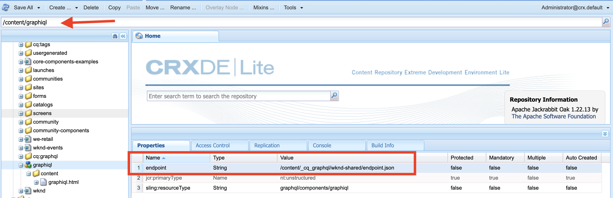

# AEM 6.5에 GraphiQL IDE 설치

AEM 6.5에서 GraphiQL IDE 도구를 수동으로 설치해야 합니다.

1. **[소프트웨어 배포 포털](https://experience.adobe.com/#/downloads/content/software-distribution/en/aemcloud.html)** > **AEM as a Cloud Service**&#x200B;로 이동합니다.
1. &quot;GraphiQL&quot; 검색(다음을 포함해야 함) **i** 위치: **GraphiQL**).
1. 최신 버전 다운로드 **GraphiQL 콘텐츠 패키지 v.x.x.x**.

   

   zip 파일은 직접 설치할 수 있는 AEM 패키지입니다.

1. AEM 시작 메뉴에서 다음으로 이동합니다. **도구** > **배포** > **패키지**.
1. **패키지 업로드**&#x200B;를 클릭하고 이전 단계에서 다운로드한 패키지를 선택합니다. **설치**&#x200B;를 클릭하여 패키지를 설치합니다.

   

1. 다음으로 이동 **CRXDE Lite** > **저장소 패널** > 선택 `/content/graphiql` 노드(예: <http://localhost:4502/crx/de/index.jsp#/content/graphiql>).
1. 다음에서 **속성** 탭 변경 값 `endpoint` 다음으로 속성: `/content/_cq_graphql/wknd-shared/endpoint.json`.
   

1. 다음 위치로 이동 **웹 콘솔 구성** UI > 검색 **CSRF 필터** 구성(예:<http://localhost:4502/system/console/configMgr/com.adobe.granite.csrf.impl.CSRFFilter)>
1. 다음에서 `Excluded Paths` 속성 이름 필드 업데이트, WKND GraphQL 끝점 경로 `/content/cq:graphql/wknd-shared/endpoint`.

1. 를 사용하여 GraphiQL 편집기에 액세스 `//HOST:PORT/content/graphiql.html`을 클릭하고, 새 쿼리를 구성하거나 기존 쿼리를 실행할 수 있는지 확인합니다. (예: <http://localhost:4502/content/graphiql.html>)

>[!TIP]
>
>프로젝트별 GraphQL 스키마 및 쿼리 실행을 지원하려면 `endpoint` 및 `Excluded Paths` 위의 단계에 있는 값입니다.
