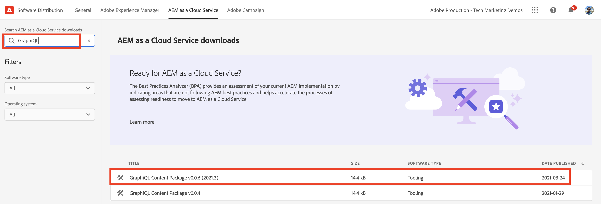

# AEM 6.5에 GraphiQL IDE 설치

AEM 6.5에서 GraphiQL IDE 도구를 수동으로 설치해야 합니다.

1. **[소프트웨어 배포 포털](https://experience.adobe.com/#/downloads/content/software-distribution/en/aemcloud.html)** > **AEM as a Cloud Service**&#x200B;로 이동합니다.
1. &quot;GraphiQL&quot;을 검색합니다(**GraphiQL**&#x200B;에 **i**&#x200B;을(를) 포함해야 함).
1. 최신 **GraphiQL 콘텐츠 패키지 v.x.x.x**&#x200B;를 다운로드합니다.

   

   zip 파일은 직접 설치할 수 있는 AEM 패키지입니다.

1. AEM 시작 메뉴에서 **도구** > **배포** > **패키지**&#x200B;로 이동합니다.
1. **패키지 업로드**&#x200B;를 클릭하고 이전 단계에서 다운로드한 패키지를 선택합니다. **설치**&#x200B;를 클릭하여 패키지를 설치합니다.

   

1. **CRXDE Lite** > **저장소 패널** > `/content/graphiql` 노드(예: <http://localhost:4502/crx/de/index.jsp#/content/graphiql>) 선택으로 이동합니다.
1. **속성** 탭에서 `endpoint` 속성의 값을 `/content/_cq_graphql/wknd-shared/endpoint.json`(으)로 변경합니다.
   

1. **웹 콘솔 구성** UI > **CSRF 필터** 구성 검색(예:<http://localhost:4502/system/console/configMgr/com.adobe.granite.csrf.impl.CSRFFilter)>)으로 이동합니다.
1. `Excluded Paths` 속성 이름 필드 업데이트에서 `/content/cq:graphql/wknd-shared/endpoint`에 대한 WKND GraphQL 끝점 경로입니다.

1. `//HOST:PORT/content/graphiql.html`을(를) 사용하여 GraphiQL 편집기에 액세스하고 새 쿼리를 구성하거나 기존 쿼리를 실행할 수 있는지 확인합니다. (예: <http://localhost:4502/content/graphiql.html>)

>[!TIP]
>
>프로젝트별 GraphQL 스키마 및 쿼리 실행을 지원하려면 위의 단계에서 `endpoint` 및 `Excluded Paths` 값을 변경해야 합니다.
