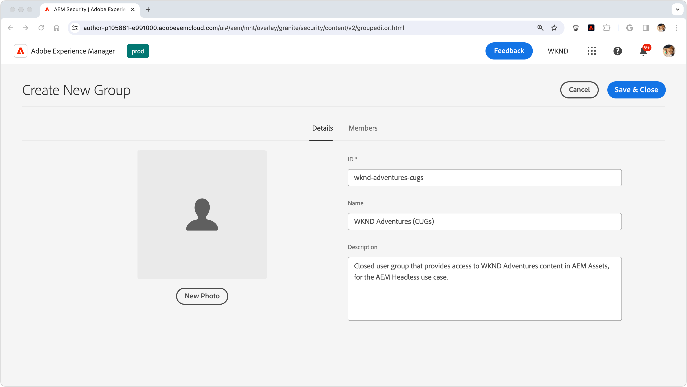

# AEM Headless에서 콘텐츠 보호

AEM Publish에서 AEM Headless 콘텐츠를 제공할 때 데이터의 무결성과 보안을 유지하는 것은 중요한 콘텐츠를 제공할 때 중요합니다. 이 방법은 AEM Headless GraphQL API 엔드포인트에서 제공하는 콘텐츠를 보호하는 방법을 안내합니다.

이 자습서의 안내서에서는 콘텐츠를 특정 사용자 또는 사용자 그룹만 사용할 수 있도록 하는 데 필요한 엄격한 요구 사항이 있습니다. 개인화된 마케팅 콘텐츠와 PII 또는 개인 금융 데이터와 같은 개인 콘텐츠를 구별하여 혼동과 의도하지 않은 결과를 피하는 것이 중요합니다. 이 튜토리얼에서는 개인 콘텐츠 보호에 대해 설명합니다.

마케팅 콘텐츠를 논할 때, 우리는 개인 사용자 또는 그룹에 맞는 콘텐츠를 언급하고 있으며, 이는 일반적인 소비를 위한 것이 아닙니다. 그러나 이 콘텐츠는 특정 사용자를 대상으로 할 수 있지만 의도한 컨텍스트(예: HTTP 요청 조작을 통해)를 벗어나면 보안, 법적 또는 평판 상의 위험이 발생하지 않는다는 사실을 이해하는 것이 중요합니다.

이 문서에서 다루는 모든 콘텐츠는 비공개로 가정되며, 지정된 사용자 또는 그룹만 볼 수 있음을 강조한다. 마케팅 컨텐츠는 보호가 필요하지 않은 경우가 많으며, 대신 애플리케이션에 의해 특정 사용자에게 전달되는 것을 관리하고 성능을 위해 캐시될 수 있습니다.

이 방법 은 다음을 포함하지 않습니다.

- 종단점을 직접 확보하되 대신 전달하는 콘텐츠를 확보하는 데 집중합니다.
- AEM 게시를 위한 인증 또는 로그인 토큰 가져오기 인증 방법 및 자격 증명 전달은 개별 사용 사례 및 구현에 따라 다릅니다.

## 사용자 그룹

먼저 다음을 정의해야 합니다 [사용자 그룹](https://experienceleague.adobe.com/en/docs/experience-manager-learn/cloud-service/accessing/aem-users-groups-and-permissions) 보호된 콘텐츠에 액세스할 수 있어야 하는 사용자를 포함합니다.

{align="center"}

사용자 그룹은 콘텐츠 조각 또는 기타 참조된 에셋을 포함한 AEM Headless 콘텐츠에 대한 액세스 권한을 할당합니다.

1. AEM 작성자에 다음으로 로그인 **사용자 관리자**.
1. 다음으로 이동 **도구** > **보안** > **그룹**.
1. 선택 **만들기** 오른쪽 상단에서
1. 다음에서 **세부 사항** 탭에서 **그룹 ID** 및 **그룹 이름**.
   - 그룹 ID와 그룹 이름은 어떤 것이든 사용할 수 있지만 이 예제에서는 이름을 사용합니다 **AEM Headless API 사용자**.
1. **저장 후 닫기**&#x200B;를 선택합니다.
1. 새로 만든 그룹을 선택한 다음 **활성화** 작업 표시줄에서

다양한 수준의 액세스가 필요한 경우 다양한 컨텐츠와 연결할 수 있는 여러 사용자 그룹을 만드십시오.

### 사용자 그룹에 사용자 추가

AEM Headless GraphQL API 요청에 보호된 콘텐츠에 대한 액세스 권한을 부여하려면 Headless 요청을 특정 사용자 그룹에 속하는 사용자와 연결할 수 있습니다. 다음은 두 가지 일반적인 접근 방식입니다.

1. **AEM as a Cloud Service [기술 계정](https://experienceleague.adobe.com/en/docs/experience-manager-learn/getting-started-with-aem-headless/authentication/service-credentials):**
   - AEM as a Cloud Service Developer Console에서 기술 계정을 만듭니다.
   - 기술 계정으로 AEM 작성자에 한 번 로그인합니다.
   - 다음을 통해 사용자 그룹에 기술 계정 추가 **도구 > 보안 > 그룹 > AEM Headless API 사용자 > 구성원**.
   - **활성화** 기술 계정 사용자와 AEM Publish의 사용자 그룹 모두.
   - 이 방법을 사용하려면 Headless 클라이언트가 특정 사용자에 대한 자격 증명이므로 공유해서는 안 되므로 서비스 자격 증명을 사용자에게 노출하지 않아야 합니다.

   {align="center"}

2. **지정된 사용자:**
   - 명명된 사용자를 인증하고 AEM Publish의 사용자 그룹에 직접 추가합니다.
   - 이 방법을 사용하려면 Headless 클라이언트가 AEM Publish를 사용하여 사용자 자격 증명을 인증하고, AEM 로그인 또는 액세스 토큰을 얻고, AEM에 대한 후속 요청에 이 토큰을 사용해야 합니다. 이를 달성하는 방법에 대한 자세한 내용은 이 방법 정보에서 다루지 않으며 구현에 따라 다릅니다.

## 콘텐츠 조각 보호

AEM Headless 콘텐츠를 보호하려면 콘텐츠 조각 보호가 필수적이며 콘텐츠를 CUG(폐쇄형 사용자 그룹)와 연결하여 보호합니다. 사용자가 AEM Headless GraphQL API에 대한 요청을 할 때 반환되는 콘텐츠는 사용자의 CUG를 기반으로 필터링됩니다.

{align="center"}

다음 단계에 따라 다음 작업을 수행하십시오 [폐쇄된 사용자 그룹(CUG)](https://experienceleague.adobe.com/en/docs/experience-manager-learn/assets/advanced/closed-user-groups).

1. AEM 작성자에 다음으로 로그인 **DAM 사용자**.
2. 다음으로 이동 **에셋 > 파일** 및 선택 **폴더** 보호할 콘텐츠 조각을 포함합니다. CUG는 계층적으로 적용되며 다른 CUG로 재정의되지 않는 한 하위 폴더에 적용됩니다.
   - 폴더의 콘텐츠를 활용하는 다른 채널에 속하는 사용자가 이 사용자 그룹에 포함되는지 확인합니다. 또는 이러한 채널과 연관된 사용자 그룹을 CUG 목록에 포함할 수 있습니다. 그렇지 않으면 해당 채널에서 콘텐츠에 액세스할 수 없습니다.
3. 폴더 선택 및 선택 **속성** 을 클릭합니다.
4. 다음 항목 선택 **권한** 탭.
5. 다음을 입력합니다. **그룹 이름** 및 선택 **추가** 단추를 클릭하여 새 CUG를 추가합니다.
6. **저장** CUG를 적용합니다.
7. **선택** 에셋 폴더 및 선택 **게시** 적용된 CUG가 있는 폴더를 AEM Publish로 보내면 권한이 평가됩니다.

보호해야 하는 콘텐츠 조각이 포함된 모든 폴더에 대해 동일한 단계를 수행하여 각 폴더에 올바른 CUG를 적용합니다.

이제 AEM Headless GraphQL API 엔드포인트에 대한 HTTP 요청이 이루어지면 요청 사용자의 지정된 CUG에 의해 액세스 가능한 콘텐츠 조각만 결과에 포함됩니다. 사용자가 컨텐츠 조각에 액세스할 수 없는 경우 결과는 200 HTTP 상태 코드를 계속 반환하지만 비어 있게 됩니다.

### 참조된 콘텐츠 보호

콘텐츠 조각은 종종 이미지와 같은 다른 AEM 콘텐츠를 참조합니다. 이 참조된 콘텐츠의 보안을 유지하기 위해 참조된 에셋이 저장된 에셋 폴더에 CUG를 적용합니다. 참조된 에셋은 일반적으로 AEM Headless GraphQL API의 메서드와 구별되는 메서드를 사용하여 요청됩니다. 결과적으로 액세스 토큰이 이러한 참조된 에셋에 대한 요청에 전달되는 방식이 다를 수 있습니다.

콘텐츠 아키텍처에 따라 참조된 모든 콘텐츠를 보호하기 위해 CUG를 여러 폴더에 적용해야 할 수 있습니다.

## 보호된 콘텐츠의 캐싱 방지

AEM as a Cloud Service [기본적으로 HTTP 응답 캐시](https://experienceleague.adobe.com/en/docs/experience-manager-learn/cloud-service/caching/publish) 성능 향상을 위해. 그러나 이로 인해 보호된 콘텐츠를 제공하는 데 문제가 발생할 수 있습니다. 이러한 콘텐츠의 캐싱을 방지하려면 [특정 끝점에 대한 캐시 헤더 제거](https://experienceleague.adobe.com/en/docs/experience-manager-learn/cloud-service/caching/publish#how-to-customize-cache-rules-1) AEM 게시 인스턴스의 Apache 구성에서 다음을 수행합니다.

Dispatcher 프로젝트의 Apache 구성 파일에 다음 규칙을 추가하여 특정 끝점에 대한 캐시 헤더를 제거합니다.

```xml
# dispatcher/src/conf.d/available_vhosts/example.vhost

<VirtualHost *:80>
    ...
    # Replace `example` with the name of your GraphQL endpoint's configuration name.
    <LocationMatch "^/graphql/execute.json/example/.*$">
        # Remove cache headers for protected endpoints so they are not cached
        Header unset Cache-Control
        Header unset Surrogate-Control
        Header set Age 0
    </LocationMatch>
    ...
</VirtualHost>
```

콘텐츠가 Dispatcher 또는 CDN에 의해 캐시되지 않으므로 성능 저하가 발생합니다. 이는 성능과 보안 간의 상충관계입니다.

## AEM Headless GraphQL API 엔드포인트 보호

이 안내서에서는 보안 문제를 해결하지 않습니다. [AEM 헤드리스 GraphQL API 엔드포인트](https://experienceleague.adobe.com/en/docs/experience-manager-cloud-service/content/headless/graphql-api/graphql-endpoint) 그 자체이지만, 오히려 그들이 제공하는 콘텐츠를 확보하는 데 주력한다. 익명 사용자를 포함한 모든 사용자는 보호된 콘텐츠가 포함된 엔드포인트에 액세스할 수 있습니다. 사용자의 [폐쇄된 사용자 그룹]이 액세스할 수 있는 컨텐츠만 반환됩니다. 콘텐츠에 액세스할 수 없는 경우 AEM Headless API 응답에는 여전히 200개의 HTTP 응답 상태 코드가 있지만 결과는 비어 있습니다. 일반적으로 콘텐츠 보안은 엔드포인트 자체가 기본적으로 중요한 데이터를 노출하지 않으므로 충분합니다. 끝점을 보호해야 하는 경우 를 통해 AEM 게시에서 끝점에 ACL을 적용합니다. [Sling 저장소 초기화(repoinit) 스크립트](https://sling.apache.org/documentation/bundles/repository-initialization.html#repoinit-parser-test-scenarios).
