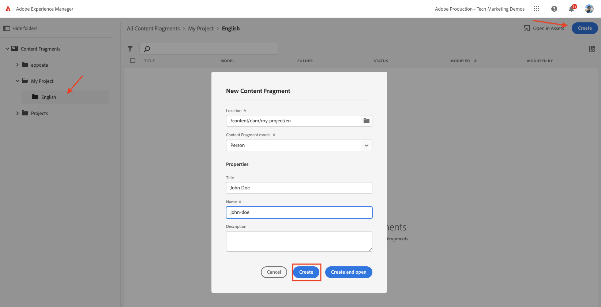

# 컨텐츠 조각 작성 {#authoring-content-fragments}

이 장에서는 [새로 정의된 컨텐츠 조각 모델](./content-fragment-models.md). 컨텐츠 조각의 변형을 만드는 방법도 알아봅니다.

## 사전 요구 사항 {#prerequisites}

이 내용은 여러 부분으로 구성된 자습서이며 [컨텐츠 조각 모델 정의](./content-fragment-models.md) 을(를) 완료했습니다.

## 목표 {#objectives}

* 컨텐츠 조각 모델을 기반으로 컨텐츠 조각 작성
* 컨텐츠 조각 변형 만들기

## 자산 폴더 만들기

컨텐츠 조각은 AEM Assets의 폴더에 저장됩니다. 이전 장에서 만든 모델에서 컨텐츠 조각을 생성하려면 해당 조각을 저장할 폴더를 만들어야 합니다. 특정 모델에서 조각을 만들려면 폴더에 구성이 필요합니다.

1. AEM 시작 화면에서 로 이동합니다. **자산** > **파일**.

   

1. 탭 **만들기** 모퉁이에서 **폴더**. 결과 대화 상자에서 다음을 입력합니다.

   * 제목*: **내 프로젝트**
   * 이름: **내 프로젝트**

   

1. 을(를) 선택합니다 **내 폴더** 폴더 및 탭 **속성**.

   

1. 탭하기 **Cloud Services** 탭. 아래 **클라우드 구성** 경로 파인더를 사용하여 **내 프로젝트** 구성. 값은 `/conf/my-project`.

   

   이 속성을 설정하면 이전 장에서 만든 모델을 사용하여 컨텐츠 조각을 만들 수 있습니다.

1. 탭하기 **정책** 탭. 아래 **허용된 컨텐츠 조각 모델** 경로 파인더를 사용하여 **개인** 및 **팀** 앞에서 만든 모델.

   

   이러한 정책은 하위 폴더에서 자동으로 상속되며 재정의할 수 있습니다. 태그별 모델을 허용하거나 다른 프로젝트 구성의 모델을 활성화할 수도 있습니다. 이 메커니즘은 컨텐츠 계층 구조를 관리하는 강력한 방법을 제공합니다.

1. 탭 **저장 및 닫기** 폴더 속성에 대한 변경 사항을 저장하려면 다음을 수행합니다.

1. 내 탐색 **내 프로젝트** 폴더를 입력합니다.

1. 다음 값으로 다른 폴더를 만듭니다.

   * 제목*: **영어**
   * 이름: **en**

   가장 좋은 방법은 다국어 지원을 위한 프로젝트를 설정하는 것입니다. 자세한 내용은 [자세한 내용은 다음 문서 페이지를 참조하십시오](https://experienceleague.adobe.com/docs/experience-manager-cloud-service/content/assets/admin/translate-assets.html).

## 컨텐츠 조각 만들기 {#create-content-fragment}

다음 여러 컨텐츠 조각은 **팀** 및 **개인** 모델.

1. AEM 시작 화면에서 탭하기 **컨텐츠 조각** 컨텐츠 조각 UI를 엽니다.

   

1. 왼쪽 레일에서 확장됩니다 **내 프로젝트** 탭 **영어**.
1. 탭 **만들기** 그것을 끄다 **새 컨텐츠 조각** 대화 상자를 열고 다음 값을 입력합니다.

   * 위치: `/content/dam/my-project/en`
   * 컨텐츠 조각 모델: **개인**
   * 제목: **존 도**
   * 이름: `john-doe`

   
1. 탭 **만들기**.
1. 위의 단계를 반복하여 을 나타내는 새 조각을 만듭니다 **앨리슨 스미스**:

   * 위치: `/content/dam/my-project/en`
   * 컨텐츠 조각 모델: **개인**
   * 제목: **앨리슨 스미스**
   * 이름: `alison-smith`

   탭 **만들기** 새 개인 조각을 생성하려면 다음을 수행하십시오.

1. 그런 다음 단계를 반복하여 새 를 만듭니다 **팀** 을 나타내는 조각 **팀 알파**:

   * 위치: `/content/dam/my-project/en`
   * 컨텐츠 조각 모델: **팀**
   * 제목: **팀 알파**
   * 이름: `team-alpha`

   탭 **만들기** 새 팀 조각을 만들려면

1. 이제 세 개의 컨텐츠 조각이 아래에 있어야 합니다 **내 프로젝트** > **영어**:

   

## 개인 컨텐츠 조각 편집 {#edit-person-content-fragments}

그런 다음 새로 만든 조각을 데이터로 채웁니다.

1. 옆에 있는 확인란을 누릅니다 **존 도** 탭 **열기**.

   

1. 컨텐츠 조각 편집기에는 컨텐츠 조각 모델을 기반으로 하는 양식이 포함되어 있습니다. 다양한 필드를 작성하여 컨텐츠를 **존 도** 조각. 프로필 그림의 경우 자체 이미지를 AEM Assets에 업로드하십시오.

   

1. 탭 **저장 및 닫기** 를 눌러 John Doe 조각의 변경 사항을 저장합니다.
1. 컨텐츠 조각 UI로 돌아가서 를 엽니다 **앨리슨 스미스** 편집할 파일입니다.
1. 위의 단계를 반복하여 **앨리슨 스미스** 조각을 사용하여 컨텐츠를 보거나 편집하거나 삭제할 수 있습니다.

## 팀 컨텐츠 조각 편집 {#edit-team-content-fragment}

1. 를 엽니다. **팀 알파** 컨텐츠 조각 UI를 사용한 컨텐츠 조각.
1. 다음 필드를 채웁니다 **제목**, **짧은 이름**, 및 **설명**.
1. 을(를) 선택합니다 **존 도** 및 **앨리슨 스미스** 컨텐츠 조각을 추가하여 **팀 구성원** 필드:

   

   >[!NOTE]
   >
   >를 사용하여 새 컨텐츠 조각을 인라인 만들 수도 있습니다 **새 컨텐츠 조각** 버튼을 클릭합니다.

1. 탭 **저장 및 닫기** 팀 알파 조각에 대한 변경 사항을 저장하려면 을 클릭합니다.

## 컨텐츠 조각 게시

검토 및 확인 시 작성된 문서를 게시합니다 `Content Fragments`

1. AEM 시작 화면에서 탭하기 **컨텐츠 조각** 컨텐츠 조각 UI를 엽니다.

1. 왼쪽 레일에서 확장됩니다 **내 프로젝트** 탭 **영어**.

1. 컨텐츠 조각 옆에 있는 확인란을 탭하고 탭합니다 **게시**

   

## 축하합니다! {#congratulations}

축하합니다. 여러 컨텐츠 조각을 작성하고 변형을 만들었습니다.

## 다음 단계 {#next-steps}

다음 장에서 [GraphQL API 탐색](explore-graphql-api.md)기본 제공 GraphicsQL 도구를 사용하여 AEM GraphQL API를 탐색합니다. AEM에서 컨텐츠 조각 모델을 기반으로 GraphQL 스키마를 자동으로 생성하는 방법을 알아봅니다. GraphQL 구문을 사용하여 기본 쿼리를 구성해 봅니다.

## 관련 설명서

* [콘텐츠 조각 관리](https://experienceleague.adobe.com/docs/experience-manager-cloud-service/content/assets/content-fragments/content-fragments-managing.html)
* [변형 - 조각 콘텐츠 작성](https://experienceleague.adobe.com/docs/experience-manager-cloud-service/content/assets/content-fragments/content-fragments-variations.html)
